# Advanced DR Orchestration Patterns

[← Back to Index](./README.md) | [← Previous: Reference Implementation](./01-reference-implementation.md)

---

This document describes advanced DR orchestration patterns derived from production implementations, including the 4-phase DR lifecycle, module factory architecture, and manifest-driven configuration.

---

## Table of Contents

- [4-Phase DR Lifecycle](#4-phase-dr-lifecycle)
- [Layered Step Functions Architecture](#layered-step-functions-architecture)
- [Module Factory Pattern](#module-factory-pattern)
- [Manifest-Driven Configuration](#manifest-driven-configuration)
- [Approval Workflow Pattern](#approval-workflow-pattern)
- [Troubleshooting Dashboard](#troubleshooting-dashboard)

---

## 4-Phase DR Lifecycle

The DR Orchestrator breaks a DR lifecycle into 4 distinct phases, each automated using manifest files and AWS Step Functions:

```mermaid
flowchart LR
    subgraph "DR Lifecycle Phases"
        I["🔧 INSTANTIATE<br/>Prewarm Secondary"]
        A["⚡ ACTIVATE<br/>Failover to Secondary"]
        C["🧹 CLEANUP<br/>Delete Old Primary"]
        R["🔄 REPLICATE<br/>Re-establish Replication"]
    end
    
    I --> A
    A --> C
    C --> R
    R -.-> I
    
    style I fill:#4CAF50,stroke:#2E7D32,color:#fff
    style A fill:#FF9800,stroke:#E65100,color:#fff
    style C fill:#f44336,stroke:#c62828,color:#fff
    style R fill:#2196F3,stroke:#1565C0,color:#fff
```



### Phase Descriptions

| Phase | Purpose | Example Actions |
|-------|---------|-----------------|
| **Instantiate** | Prewarm infrastructure in secondary region | Deploy stacks, scale up ECS/EKS clusters, create Aurora read replicas |
| **Activate** | Failover to secondary region (make it primary) | Failover database, switch DNS, enable EventBridge rules |
| **Cleanup** | Delete resources in old primary when it recovers | Delete old stacks, terminate instances, remove old database |
| **Replicate** | Re-establish replication from new primary to old | Create read replicas, configure SnapMirror, set up cross-region replication |

### Typical DR Workflow

**Scenario**: Primary region (us-east-1) experiences outage, failover to secondary (us-west-2)

```mermaid
sequenceDiagram
    participant Operator
    participant Orchestrator
    participant Secondary as us-west-2
    participant Primary as us-east-1
    
    Note over Primary: ❌ Region Outage
    
    Operator->>Orchestrator: Start INSTANTIATE (us-west-2)
    Orchestrator->>Secondary: Deploy infrastructure
    Orchestrator->>Secondary: Scale up ECS services
    Orchestrator->>Secondary: Create Aurora instances
    Secondary-->>Orchestrator: Ready
    
    Operator->>Orchestrator: Start ACTIVATE (us-west-2)
    Orchestrator->>Secondary: Failover Aurora cluster
    Orchestrator->>Secondary: Update DNS records
    Orchestrator->>Secondary: Enable EventBridge rules
    Secondary-->>Orchestrator: Active
    
    Note over Primary: ✅ Region Recovers
    
    Operator->>Orchestrator: Start CLEANUP (us-east-1)
    Orchestrator->>Primary: Delete old Aurora instances
    Orchestrator->>Primary: Scale down ECS to 0
    Orchestrator->>Primary: Delete old stacks
    Primary-->>Orchestrator: Cleaned
    
    Operator->>Orchestrator: Start REPLICATE (us-west-2 → us-east-1)
    Orchestrator->>Primary: Create Aurora read replica
    Orchestrator->>Primary: Configure replication
    Primary-->>Orchestrator: Replicating
    
    Note over Secondary,Primary: us-west-2 is now Primary<br/>us-east-1 is now Secondary
```



---

## Layered Step Functions Architecture

The orchestration uses a 3-layer Step Functions architecture for modularity and reusability:


### Layer Responsibilities

| Layer | Step Function | Responsibility |
|-------|---------------|----------------|
| **Layer 1** | DR-Orchestrator | Entry point, approval workflow, manifest retrieval |
| **Layer 2** | Lifecycle-Orchestrator | Process layers sequentially, parallel resource execution |
| **Layer 3** | ModuleFactory | Technology-specific operations (Aurora, ECS, Route53, etc.) |

### DR-Orchestrator Flow

```yaml
# DR-Orchestrator Step Function (simplified)
States:
  RequestApproval:
    Type: Task
    Resource: arn:aws:states:::sns:publish.waitForTaskToken
    Parameters:
      TopicArn: !Ref ApprovalTopic
      Message.$: "$.approvalMessage"
    Next: GetManifest
    
  GetManifest:
    Type: Task
    Resource: arn:aws:lambda:function:get-manifest
    Parameters:
      ManifestPath.$: "$.manifestPath"
    Next: InvokeLifecycle
    
  InvokeLifecycle:
    Type: Task
    Resource: arn:aws:states:::states:startExecution.sync
    Parameters:
      StateMachineArn: !Ref LifecycleOrchestrator
      Input.$: "$.manifest"
    End: true
```

### Lifecycle-Orchestrator Flow

```yaml
# Lifecycle-Orchestrator Step Function (simplified)
States:
  ProcessLayers:
    Type: Map
    ItemsPath: "$.layers"
    MaxConcurrency: 1  # Sequential layer processing
    Iterator:
      StartAt: ProcessResources
      States:
        ProcessResources:
          Type: Map
          ItemsPath: "$.resources"
          MaxConcurrency: 0  # Parallel resource processing
          Iterator:
            StartAt: InvokeModule
            States:
              InvokeModule:
                Type: Task
                Resource: arn:aws:states:::states:startExecution.sync
                Parameters:
                  StateMachineArn: !Ref ModuleFactory
                  Input.$: "$"
                End: true
          End: true
    End: true
```

---

## Module Factory Pattern

The Module Factory provides pluggable technology adapters that implement a standard interface for each DR lifecycle phase.

### Supported Modules

| Module | Instantiate | Activate | Cleanup | Replicate |
|--------|:-----------:|:--------:|:-------:|:---------:|
| **AuroraMySQL** | Create reader instances | Failover cluster | Delete instances | - |
| **ECS** | Scale up services | - | Scale to 0 | - |
| **AutoScaling** | Scale up groups | - | Scale to 0 | - |
| **R53Record** | - | Update DNS records | - | - |
| **EventBridge** | - | Enable rules | Disable rules | - |
| **LambdaFunction** | Trigger function | Trigger function | Trigger function | Trigger function |
| **EventArchive** | - | Replay events | - | - |
| **DRS** | - | Start recovery (failover/failback) | Stop replication, disconnect/delete source servers | Reverse replication or reinstall agent |
| **ElastiCache** | - | Disassociate global cluster, create new | Delete global cluster | Create replication group |
| **MemoryDB** | - | Restore from S3 backup | Delete cluster, store config | - |
| **OpenSearchService** | Scale up cluster | - | Scale down cluster | - |
| **SQLServer** | - | Restore from automated backup | Delete instance, store config | Start backup replication |
| **EC2** | Start instances | Start instances | Stop instances | - |

### Module Interface

Each module implements lifecycle-specific operations and status checks:

```python
class DRModule:
    """Base interface for DR modules."""
    
    def instantiate(self, parameters: dict) -> dict:
        """Prewarm resources in secondary region."""
        raise NotImplementedError
    
    def instantiate_status_check(self, parameters: dict) -> bool:
        """Check if instantiate operation completed."""
        raise NotImplementedError
    
    def activate(self, parameters: dict) -> dict:
        """Activate secondary region as primary."""
        raise NotImplementedError
    
    def activate_status_check(self, parameters: dict) -> bool:
        """Check if activate operation completed."""
        raise NotImplementedError
    
    def cleanup(self, parameters: dict) -> dict:
        """Clean up resources in old primary region."""
        raise NotImplementedError
    
    def cleanup_status_check(self, parameters: dict) -> bool:
        """Check if cleanup operation completed."""
        raise NotImplementedError
    
    def replicate(self, parameters: dict) -> dict:
        """Re-establish replication to old primary."""
        raise NotImplementedError
    
    def replicate_status_check(self, parameters: dict) -> bool:
        """Check if replicate operation completed."""
        raise NotImplementedError
```

### Module Examples

#### AuroraMySQL Module

```json
{
  "action": "AuroraMySQL",
  "resourceName": "production-database",
  "parameters": {
    "DBClusterIdentifier": "aurora-prod-cluster",
    "DBInstanceIdentifier": ["aurora-prod-reader-1", "aurora-prod-reader-2"],
    "GlobalClusterIdentifier": "global-aurora-cluster",
    "AccountId": "123456789012"
  }
}
```

| Lifecycle | Action |
|-----------|--------|
| **Instantiate** | Create reader Aurora DB instances |
| **Activate** | Failover cluster to make it primary |
| **Cleanup** | Delete Aurora DB instances |

#### ECS Module

```json
{
  "action": "ECS",
  "resourceName": "application-services",
  "parameters": [
    {
      "EcsClusterName": "prod-cluster",
      "EcsServiceName": "api-service",
      "EcsDesiredSize": 4,
      "EcsAsgMinSize": 2
    },
    {
      "EcsClusterName": "prod-cluster",
      "EcsServiceName": "worker-service",
      "EcsDesiredSize": 2,
      "EcsAsgMinSize": 1
    }
  ],
  "AccountId": "123456789012"
}
```

| Lifecycle | Action |
|-----------|--------|
| **Instantiate** | Scale up ECS services to desired count |
| **Cleanup** | Scale down ECS services to 0 |

#### Route53 Module

```json
{
  "action": "R53Record",
  "resourceName": "dns-failover",
  "parameters": [
    {
      "HostedZoneId": "/hostedzone/Z1234567890",
      "R53RecordName": "api.example.com",
      "RecordType": "A",
      "Alias": "Yes",
      "RecordValue": "dr-alb-us-west-2"
    },
    {
      "HostedZoneId": "/hostedzone/Z1234567890",
      "R53RecordName": "app.example.com",
      "RecordType": "CNAME",
      "Alias": "No",
      "RecordValue": "dr-app.us-west-2.elb.amazonaws.com"
    }
  ],
  "AccountId": "123456789012"
}
```

| Lifecycle | Action |
|-----------|--------|
| **Activate** | Create/update Route 53 records |

#### EventBridge Module

```json
{
  "action": "EventBridge",
  "resourceName": "scheduled-jobs",
  "parameters": [
    {
      "EventRuleName": "daily-report-generator",
      "BusName": "default"
    },
    {
      "EventRuleName": "hourly-sync-job",
      "BusName": "custom-bus"
    }
  ],
  "AccountId": "123456789012"
}
```

| Lifecycle | Action |
|-----------|--------|
| **Activate** | Enable EventBridge rules |
| **Cleanup** | Disable EventBridge rules |

#### DRS Module

```json
{
  "action": "DRS",
  "resourceName": "application-servers",
  "parameters": {
    "HostNames": ["web-server-1", "app-server-1", "db-server-1"],
    "Tags": {
      "Environment": "DR",
      "RecoveryType": "Failover"
    }
  },
  "AccountId": "123456789012"
}
```

| Lifecycle | Action |
|-----------|--------|
| **Activate** | Start DRS recovery for source servers (supports failover and failback) |
| **Cleanup** | Stop replication, disconnect and delete source servers |
| **Replicate** | Reverse replication or reinstall DRS agent |

#### ElastiCache Module

```json
{
  "action": "ElastiCache",
  "resourceName": "redis-global-datastore",
  "parameters": {
    "DBClusterIdentifier": "redis-prod-cluster",
    "GlobalClusterIdentifier": "global-redis",
    "ClusterEndpointSSMKey": "/prod/redis/endpoint"
  },
  "AccountId": "123456789012"
}
```

| Lifecycle | Action |
|-----------|--------|
| **Activate** | Disassociate from global cluster, create new global cluster in DR region |
| **Cleanup** | Delete global replication group, store settings in SSM |
| **Replicate** | Create replication group and join global cluster |

#### MemoryDB Module

```json
{
  "action": "MemoryDB",
  "resourceName": "memorydb-cluster",
  "parameters": {
    "ClusterName": "prod-memorydb",
    "ClusterConfigSSMKey": "/prod/memorydb/config",
    "ClusterEndpointSSMKey": "/prod/memorydb/endpoint",
    "BackupBucket": "dr-backups-bucket",
    "Prefix": "memorydb/",
    "Tags": [{"Key": "Environment", "Value": "Production"}]
  },
  "AccountId": "123456789012"
}
```

| Lifecycle | Action |
|-----------|--------|
| **Activate** | Restore cluster from S3 backup, update endpoint in SSM |
| **Cleanup** | Store cluster config in SSM, delete cluster |

#### OpenSearch Module

```json
{
  "action": "OpenSearchService",
  "resourceName": "search-cluster",
  "parameters": {
    "DomainName": "prod-search",
    "DataNodeType": "r6g.large.search",
    "DataNodeCount": 3,
    "MasterNodeType": "r6g.large.search",
    "MasterNodeCount": 3,
    "SubnetList": ["subnet-abc123", "subnet-def456"],
    "AzCount": 2,
    "TotalStorageSize": 300,
    "AutoTune": "ENABLED"
  },
  "AccountId": "123456789012"
}
```

| Lifecycle | Action |
|-----------|--------|
| **Instantiate** | Scale up OpenSearch cluster (add nodes, enable masters) |
| **Cleanup** | Scale down OpenSearch cluster (reduce nodes, disable masters) |

#### SQLServer Module

```json
{
  "action": "SQLServer",
  "resourceName": "sql-database",
  "parameters": {
    "DBInstanceIdentifierSource": "prod-sqlserver",
    "ClusterConfigSSMKey": "/prod/sqlserver/config"
  },
  "AccountId": "123456789012"
}
```

| Lifecycle | Action |
|-----------|--------|
| **Activate** | Restore from automated backup to point-in-time |
| **Cleanup** | Store config in SSM, delete DB instance |
| **Replicate** | Start automated backup replication to DR region |

#### EC2 Module

```json
{
  "action": "EC2",
  "resourceName": "application-servers",
  "parameters": {
    "Orchestrator_HostNames": ["web-server-1", "app-server-1", "db-server-1"]
  },
  "AccountId": "123456789012"
}
```

| Lifecycle | Action |
|-----------|--------|
| **Instantiate** | Start EC2 instances by Orchestrator:HostName tag |
| **Activate** | Start EC2 instances by Orchestrator:HostName tag |
| **Cleanup** | Stop EC2 instances by Orchestrator:HostName tag |

---

## Manifest-Driven Configuration

DR operations are defined using JSON manifest files stored in S3. Each application has 4 manifests (one per lifecycle phase).

### Manifest Schema

```json
[
  {
    "layer": 1,
    "resources": [
      {
        "action": "<module_type>",
        "resourceName": "<resource_name>",
        "parameters": {
          "<param1>": "<value1>",
          "<param2>": "<value2>"
        }
      }
    ]
  },
  {
    "layer": 2,
    "resources": [...]
  }
]
```

| Field | Type | Description |
|-------|------|-------------|
| `layer` | Number | Execution sequence (layer 1 runs first, then layer 2, etc.) |
| `resources` | Array | Resources to process in parallel within this layer |
| `action` | String | Module type (AuroraMySQL, ECS, R53Record, etc.) |
| `resourceName` | String | Arbitrary name for identification |
| `parameters` | Object | Module-specific parameters |

### Example: Complete Application Manifest Set

#### Instantiate.json (Prewarm Secondary)

```json
[
  {
    "layer": 1,
    "resources": [
      {
        "action": "AuroraMySQL",
        "resourceName": "database-tier",
        "parameters": {
          "DBClusterIdentifier": "aurora-prod",
          "DBInstanceIdentifier": ["aurora-prod-reader-1"],
          "GlobalClusterIdentifier": "global-aurora",
          "AccountId": "123456789012"
        }
      }
    ]
  },
  {
    "layer": 2,
    "resources": [
      {
        "action": "ECS",
        "resourceName": "application-tier",
        "parameters": [
          {
            "EcsClusterName": "prod-cluster",
            "EcsServiceName": "api-service",
            "EcsDesiredSize": 4
          },
          {
            "EcsClusterName": "prod-cluster",
            "EcsServiceName": "web-service",
            "EcsDesiredSize": 2
          }
        ],
        "AccountId": "123456789012"
      },
      {
        "action": "AutoScaling",
        "resourceName": "worker-tier",
        "parameters": {
          "Autoscalinggroupnames": ["worker-asg"],
          "DesiredCount": 3
        },
        "AccountId": "123456789012"
      }
    ]
  }
]
```

#### Activate.json (Failover to Secondary)

```json
[
  {
    "layer": 1,
    "resources": [
      {
        "action": "AuroraMySQL",
        "resourceName": "database-failover",
        "parameters": {
          "DBClusterIdentifier": "aurora-prod",
          "GlobalClusterIdentifier": "global-aurora",
          "AccountId": "123456789012"
        }
      }
    ]
  },
  {
    "layer": 2,
    "resources": [
      {
        "action": "R53Record",
        "resourceName": "dns-update",
        "parameters": [
          {
            "HostedZoneId": "/hostedzone/Z123",
            "R53RecordName": "api.example.com",
            "RecordType": "A",
            "Alias": "Yes",
            "RecordValue": "dr-alb"
          }
        ],
        "AccountId": "123456789012"
      },
      {
        "action": "EventBridge",
        "resourceName": "enable-jobs",
        "parameters": [
          {
            "EventRuleName": "daily-report",
            "BusName": "default"
          }
        ],
        "AccountId": "123456789012"
      }
    ]
  }
]
```

### Parameter References

Manifests support dynamic parameter resolution:

| Syntax | Description | Example |
|--------|-------------|---------|
| `!Import` | CloudFormation export reference | `"!Import VpcId"` |
| `resolve:ssm` | SSM Parameter Store reference | `"resolve:ssm:/prod/db-endpoint"` |

```json
{
  "action": "ECS",
  "resourceName": "api-service",
  "parameters": {
    "EcsClusterName": "!Import ProductionClusterName",
    "EcsServiceName": "resolve:ssm:/prod/api-service-name",
    "EcsDesiredSize": 4
  }
}
```

---

## Approval Workflow Pattern

DR operations require approval before execution to prevent accidental failovers.


### SNS Approval Configuration

```yaml
ApprovalTopic:
  Type: AWS::SNS::Topic
  Properties:
    TopicName: dr-approval-requests
    Subscription:
      - Protocol: email
        Endpoint: dr-approvers@company.com

ApprovalState:
  Type: Task
  Resource: arn:aws:states:::sns:publish.waitForTaskToken
  Parameters:
    TopicArn: !Ref ApprovalTopic
    Message:
      Fn::Sub: |
        DR Execution Approval Required
        
        Execution ID: ${execution_id}
        Lifecycle Phase: ${lifecycle_phase}
        Target Region: ${target_region}
        
        Approve: ${approve_url}
        Reject: ${reject_url}
```

---

## Troubleshooting Dashboard

The orchestrator creates a CloudWatch dashboard to aggregate Step Function failures for troubleshooting.

### Dashboard Features

- Aggregated view of all Step Function executions
- Failed execution details with error messages
- Direct links to failed Step Function executions
- Lambda log references for debugging

### Troubleshooting Workflow

1. Navigate to CloudWatch → Dashboards
2. Select `<Product>-Troubleshooting-Dashboard`
3. Identify failed execution in the dashboard
4. Extract Step Function name from `detail.stateMachineArn`
5. Search for execution using `detail.name`
6. Review failed step and error messages
7. Check Lambda logs for detailed debugging


---

## Cross-Account Deployment

For multi-account environments, deploy the target account role in each spoke account:

### Target Account Role (TargetAccountsAssumeRole.yaml)

```yaml
AWSTemplateFormatVersion: '2010-09-09'
Description: 'DR Orchestrator Cross-Account Role'

Parameters:
  OrchestratorAccountId:
    Type: String
    Description: Account ID where DR Orchestrator is deployed

Resources:
  DRExecutionRole:
    Type: AWS::IAM::Role
    Properties:
      RoleName: DR-Orchestrator-Execution-Role
      AssumeRolePolicyDocument:
        Version: '2012-10-17'
        Statement:
          - Effect: Allow
            Principal:
              AWS: !Sub "arn:aws:iam::${OrchestratorAccountId}:root"
            Action: sts:AssumeRole
      Policies:
        - PolicyName: DROperationsPolicy
          PolicyDocument:
            Version: '2012-10-17'
            Statement:
              - Effect: Allow
                Action:
                  - rds:*
                  - ecs:*
                  - autoscaling:*
                  - route53:*
                  - events:*
                  - lambda:InvokeFunction
                Resource: "*"
```

### Deployment Options

| Method | Use Case |
|--------|----------|
| **Manual** | Single account deployment |
| **StackSets** | Multi-account deployment across organization |
| **LZA** | Landing Zone Accelerator managed deployment |

---

## Integration with DRS Orchestration Solution

The 4-phase lifecycle pattern complements the DRS Orchestration solution:

| DRS Solution | 4-Phase Lifecycle |
|--------------|-------------------|
| Wave-based server recovery | Layer-based resource orchestration |
| Pause/resume between waves | Approval workflow between phases |
| Tag-based server discovery | Manifest-driven configuration |
| Protection groups | Resource groupings in layers |
| Single technology (DRS) | Multi-technology (Aurora, ECS, Route53, etc.) |

### Combined Architecture


---

[← Back to Index](./README.md) | [← Previous: Reference Implementation](./01-reference-implementation.md) | [Next: API Integration →](./03-api-integration.md)
