# API Integration Patterns

[← Back to Index](./README.md) | [← Previous: DR Orchestration Patterns](./02-dr-orchestration-patterns.md)

---

The Enterprise DR Orchestration Platform is designed as a **headless, API-first solution** that integrates into existing enterprise workflows through multiple automation channels.

---

## Table of Contents

- [Integration Architecture](#integration-architecture)
- [REST API Integration](#rest-api-integration)
- [SSM Document Integration](#ssm-document-integration)
- [EventBridge Integration](#eventbridge-integration)
- [Lambda Trigger Function](#lambda-trigger-function)
- [CI/CD Pipeline Integration](#cicd-pipeline-integration)
- [Configuration Management](#configuration-management)

---

## Integration Architecture

```mermaid
flowchart TD
    subgraph "🚀 Trigger Sources"
        CLI["💻 AWS CLI / curl"]
        SSM["📋 SSM Documents"]
        EB["⚡ EventBridge Rules"]
        LAMBDA["λ Lambda Functions"]
        CICD["🔧 CI/CD Pipelines"]
        ITSM["🎫 ITSM Systems"]
    end
    
    subgraph "🌐 API Gateway Layer"
        REST["🔗 REST API"]
        AUTH["🔐 Cognito/IAM Auth"]
    end
    
    subgraph "⚙️ Orchestration Engine"
        MASTER["🎯 Step Functions"]
        ADAPTERS["🔌 Technology Adapters"]
    end
    
    CLI --> REST
    SSM --> REST
    EB --> REST
    LAMBDA --> REST
    CICD --> REST
    ITSM --> REST
    
    REST --> AUTH
    AUTH --> MASTER
    MASTER --> ADAPTERS
```



---

## REST API Integration

### Authentication Setup

```bash
# Set environment variables
export API_URL="https://<api-id>.execute-api.us-east-1.amazonaws.com/dev"

# Get Cognito JWT token
export TOKEN=$(aws cognito-idp admin-initiate-auth \
  --user-pool-id <user-pool-id> \
  --client-id <client-id> \
  --auth-flow ADMIN_NO_SRP_AUTH \
  --auth-parameters USERNAME=<username>,PASSWORD=<password> \
  --region us-east-1 \
  --query 'AuthenticationResult.IdToken' \
  --output text)
```

### Core API Operations

```bash
# Start DR execution
curl -X POST "$API_URL/executions" \
  -H "Authorization: Bearer $TOKEN" \
  -H "Content-Type: application/json" \
  -d '{
    "planId": "enterprise-app-recovery",
    "executionType": "recovery",
    "tags": {
      "Environment": "production",
      "Application": "core-banking"
    }
  }'

# Monitor execution status
curl -X GET "$API_URL/executions/$EXECUTION_ID" \
  -H "Authorization: Bearer $TOKEN"

# Pause execution for validation
curl -X POST "$API_URL/executions/$EXECUTION_ID/pause" \
  -H "Authorization: Bearer $TOKEN"

# Resume after validation
curl -X POST "$API_URL/executions/$EXECUTION_ID/resume" \
  -H "Authorization: Bearer $TOKEN"

# Cancel execution
curl -X POST "$API_URL/executions/$EXECUTION_ID/cancel" \
  -H "Authorization: Bearer $TOKEN"

# Export execution results
curl -X GET "$API_URL/executions/$EXECUTION_ID/export" \
  -H "Authorization: Bearer $TOKEN"
```

### API Endpoints Summary

| Method | Endpoint | Description |
|--------|----------|-------------|
| `POST` | `/executions` | Start new execution |
| `GET` | `/executions/{id}` | Get execution status |
| `POST` | `/executions/{id}/pause` | Pause execution |
| `POST` | `/executions/{id}/resume` | Resume execution |
| `POST` | `/executions/{id}/cancel` | Cancel execution |
| `GET` | `/executions/{id}/export` | Export results |
| `GET` | `/protection-groups` | List protection groups |
| `GET` | `/recovery-plans` | List recovery plans |

---

## SSM Document Integration

### SSM Document Definition

```yaml
schemaVersion: '2.2'
description: 'Execute Enterprise DR Plan'
parameters:
  PlanId:
    type: String
    description: 'DR Plan ID to execute'
  ExecutionType:
    type: String
    allowedValues: [drill, recovery]
  Environment:
    type: String
    allowedValues: [production, staging, development]

mainSteps:
  - action: 'aws:executeAwsApi'
    name: 'StartDRExecution'
    inputs:
      Service: lambda
      Api: Invoke
      FunctionName: dr-orchestration-trigger
      Payload: |
        {
          "planId": "{{ PlanId }}",
          "executionType": "{{ ExecutionType }}",
          "tags": {
            "Environment": "{{ Environment }}",
            "TriggerSource": "SSM"
          }
        }
    outputs:
      - Name: ExecutionId
        Selector: $.Payload.executionId
        Type: String

  - action: 'aws:waitForAwsResourceProperty'
    name: 'WaitForCompletion'
    inputs:
      Service: lambda
      Api: Invoke
      FunctionName: dr-orchestration-status
      Payload: '{"executionId": "{{ StartDRExecution.ExecutionId }}"}'
      PropertySelector: '$.Payload.status'
      DesiredValues: [completed, failed, cancelled]
      MaxAttempts: 120
      TimeoutSeconds: 7200
```

### Execute via SSM

```bash
aws ssm start-automation-execution \
  --document-name "DR-Execution-Document" \
  --parameters "PlanId=enterprise-app-recovery,ExecutionType=drill,Environment=staging"
```

---

## EventBridge Integration

### Scheduled DR Drill

```json
{
  "Name": "MonthlyDRDrill",
  "Description": "Monthly DR drill execution",
  "ScheduleExpression": "cron(0 2 1 * ? *)",
  "State": "ENABLED",
  "Targets": [{
    "Id": "1",
    "Arn": "arn:aws:lambda:us-east-1:ACCOUNT:function:dr-orchestration-trigger",
    "Input": "{\"planId\":\"monthly-drill-plan\",\"executionType\":\"drill\",\"tags\":{\"TriggerSource\":\"EventBridge\",\"ScheduleType\":\"Monthly\"}}"
  }]
}
```

### Event-Driven DR Trigger

```json
{
  "Name": "DisasterDetectedDR",
  "Description": "Automatic DR on disaster detection",
  "EventPattern": {
    "source": ["custom.monitoring"],
    "detail-type": ["Disaster Detected"],
    "detail": {
      "severity": ["CRITICAL"],
      "environment": ["production"]
    }
  },
  "Targets": [{
    "Id": "1",
    "Arn": "arn:aws:lambda:us-east-1:ACCOUNT:function:dr-orchestration-trigger",
    "Input": "{\"planId\":\"emergency-recovery-plan\",\"executionType\":\"recovery\",\"tags\":{\"TriggerSource\":\"EventBridge\",\"TriggerType\":\"Automatic\"}}"
  }]
}
```

---

## Lambda Trigger Function

```python
import json
import boto3
import os

def lambda_handler(event, context):
    """Lambda function to trigger DR orchestration."""
    
    api_endpoint = os.environ['DR_API_ENDPOINT']
    
    # Extract execution parameters
    execution_params = {
        'planId': event.get('planId'),
        'executionType': event.get('executionType', 'drill'),
        'tags': event.get('tags', {})
    }
    
    # Add trigger context
    execution_params['tags']['TriggerFunction'] = context.function_name
    execution_params['tags']['TriggerRequestId'] = context.aws_request_id
    
    # Get authentication token
    token = get_cognito_token()
    
    # Call DR orchestration API
    response = requests.post(
        f'{api_endpoint}/executions',
        headers={
            'Authorization': f'Bearer {token}',
            'Content-Type': 'application/json'
        },
        json=execution_params
    )
    
    if response.status_code == 200:
        result = response.json()
        
        # Publish success event
        publish_event('DR Execution Started', {
            'executionId': result['executionId'],
            'planId': execution_params['planId']
        })
        
        return {'statusCode': 200, 'body': json.dumps(result)}
    else:
        publish_event('DR Execution Failed', {'error': response.text})
        raise Exception(f"DR execution failed: {response.text}")

def get_cognito_token():
    """Get Cognito JWT token for API authentication."""
    cognito = boto3.client('cognito-idp')
    response = cognito.initiate_auth(
        ClientId=os.environ['COGNITO_CLIENT_ID'],
        AuthFlow='USER_PASSWORD_AUTH',
        AuthParameters={
            'USERNAME': os.environ['SERVICE_USERNAME'],
            'PASSWORD': os.environ['SERVICE_PASSWORD']
        }
    )
    return response['AuthenticationResult']['AccessToken']

def publish_event(detail_type, detail):
    """Publish event to EventBridge."""
    eventbridge = boto3.client('events')
    eventbridge.put_events(Entries=[{
        'Source': 'dr.orchestration',
        'DetailType': detail_type,
        'Detail': json.dumps(detail)
    }])
```

---

## CI/CD Pipeline Integration

### GitHub Actions Workflow

```yaml
name: DR Drill Execution

on:
  schedule:
    - cron: '0 6 * * 1'  # Every Monday at 6 AM
  workflow_dispatch:
    inputs:
      execution_type:
        description: 'Execution type'
        required: true
        default: 'drill'
        type: choice
        options: [drill, recovery]

env:
  API_URL: ${{ secrets.DR_API_URL }}

jobs:
  execute-dr-drill:
    runs-on: ubuntu-latest
    steps:
      - name: Configure AWS credentials
        uses: aws-actions/configure-aws-credentials@v4
        with:
          role-to-assume: ${{ secrets.DR_EXECUTION_ROLE_ARN }}
          aws-region: us-east-1

      - name: Get authentication token
        id: auth
        run: |
          TOKEN=$(aws cognito-idp admin-initiate-auth \
            --user-pool-id ${{ secrets.COGNITO_USER_POOL_ID }} \
            --client-id ${{ secrets.COGNITO_CLIENT_ID }} \
            --auth-flow ADMIN_NO_SRP_AUTH \
            --auth-parameters USERNAME=${{ secrets.DR_SERVICE_USER }},PASSWORD=${{ secrets.DR_SERVICE_PASSWORD }} \
            --query 'AuthenticationResult.IdToken' --output text)
          echo "token=$TOKEN" >> $GITHUB_OUTPUT

      - name: Start DR execution
        id: start-dr
        run: |
          RESPONSE=$(curl -s -X POST "${{ env.API_URL }}/executions" \
            -H "Authorization: Bearer ${{ steps.auth.outputs.token }}" \
            -H "Content-Type: application/json" \
            -d '{"planId":"ci-cd-drill-plan","executionType":"${{ github.event.inputs.execution_type || 'drill' }}"}')
          
          EXECUTION_ID=$(echo $RESPONSE | jq -r '.executionId')
          echo "execution_id=$EXECUTION_ID" >> $GITHUB_OUTPUT

      - name: Monitor DR execution
        run: |
          while true; do
            STATUS=$(curl -s "${{ env.API_URL }}/executions/${{ steps.start-dr.outputs.execution_id }}" \
              -H "Authorization: Bearer ${{ steps.auth.outputs.token }}" | jq -r '.Status')
            
            echo "Status: $STATUS"
            [[ "$STATUS" =~ ^(COMPLETED|FAILED|CANCELLED)$ ]] && break
            sleep 30
          done
          
          [[ "$STATUS" != "COMPLETED" ]] && exit 1
```

---

## Configuration Management

### Parameter Store Structure

```
/dr-orchestration/
├── production/
│   ├── database/
│   │   ├── rds-endpoint
│   │   ├── aurora-clusters
│   │   └── failover-timeout
│   ├── application/
│   │   ├── recovery-scripts-bucket
│   │   └── health-check-endpoints
│   └── infrastructure/
│       ├── route53-hosted-zones
│       └── load-balancer-arns
└── plans/
    ├── enterprise-app-recovery/
    │   ├── waves
    │   └── pause-points
    └── monthly-drill-plan/
        └── waves
```

### Secrets Manager Structure

```
Secrets Manager:
├── dr-orchestration/production/database/
│   └── aurora-cluster-01 (username, password, endpoint)
├── dr-orchestration/external-apis/
│   ├── servicenow (instance_url, username, password)
│   └── pagerduty (integration_key)
└── dr-orchestration/cross-account/
    └── target-account-123456789 (role_arn, external_id)
```

### Configuration Access

```python
class DRConfigurationManager:
    def __init__(self):
        self.ssm = boto3.client('ssm')
        self.secrets = boto3.client('secretsmanager')
    
    def get_wave_config(self, plan_id: str) -> list:
        """Get wave configuration from Parameter Store."""
        response = self.ssm.get_parameter(
            Name=f'/dr-orchestration/plans/{plan_id}/waves',
            WithDecryption=True
        )
        return json.loads(response['Parameter']['Value'])
    
    def get_database_credentials(self, db_id: str) -> dict:
        """Get database credentials from Secrets Manager."""
        response = self.secrets.get_secret_value(
            SecretId=f'dr-orchestration/production/database/{db_id}'
        )
        return json.loads(response['SecretString'])
```

---

## API-First Benefits

| Integration Method | Use Case | Benefits |
|-------------------|----------|----------|
| **REST API** | Manual operations, scripts | Direct integration, scriptable |
| **SSM Documents** | Automated runbooks | Parameter validation, wait conditions |
| **EventBridge** | Scheduled/event-driven | Automatic triggers, event patterns |
| **Lambda** | Custom logic | Flexible integration, error handling |
| **CI/CD** | Testing workflows | Automated validation, reporting |
| **ITSM** | Change management | Approval workflows, audit trails |

---

[← Back to Index](./README.md) | [← Previous: DR Orchestration Patterns](./02-dr-orchestration-patterns.md) | [Next: Technology Adapters →](./04-technology-adapters.md)
