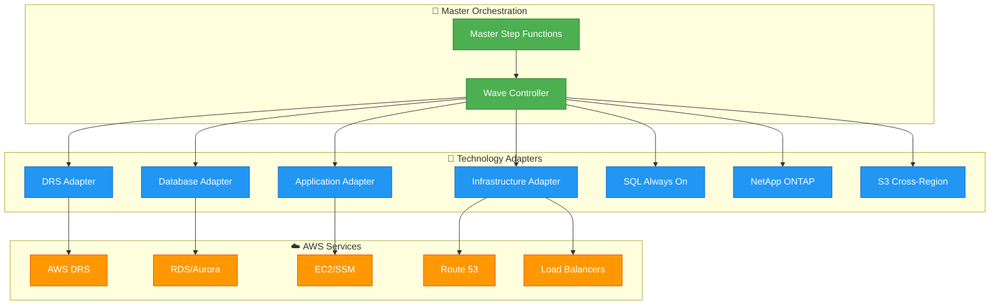

# Technology Adapters

[← Back to Index](./README.md) | [← Previous: API Integration](./03-api-integration.md)

---

This document describes the technology adapter architecture that enables the Enterprise DR Orchestration Platform to integrate with multiple DR technologies through a standardized interface.

---

## Table of Contents

- [Adapter Architecture Pattern](#adapter-architecture-pattern)
- [Standard Adapter Interface](#standard-adapter-interface)
- [DRS Adapter](#drs-adapter)
- [Database Adapter](#database-adapter)
- [Application Adapter](#application-adapter)
- [Infrastructure Adapter](#infrastructure-adapter)
- [SQL Always On Adapter](#sql-always-on-adapter)
- [NetApp ONTAP Adapter](#netapp-ontap-adapter)
- [S3 Cross-Region Adapter](#s3-cross-region-adapter)

---

## Adapter Architecture Pattern

Each technology adapter follows a standardized interface pattern that integrates seamlessly with the Step Functions orchestration engine:



---

## Standard Adapter Interface

All technology adapters implement a standardized interface for consistent orchestration:

```python
class TechnologyAdapter:
    """Base interface for all technology adapters."""
    
    def __init__(self, technology_type: str, config: dict):
        self.technology_type = technology_type
        self.config = config
        self.task_token = None
    
    def execute(self, task_token: str, resources: list, wave_config: dict) -> dict:
        """Standard execution interface for all technology adapters."""
        self.task_token = task_token
        
        try:
            # 1. Validate resources and configuration
            validated_resources = self.validate_resources(resources)
            
            # 2. Execute technology-specific operations
            execution_id = self.start_execution(validated_resources, wave_config)
            
            # 3. Monitor execution progress
            self.monitor_execution(execution_id)
            
            # 4. Generate standardized results
            results = self.generate_results(execution_id)
            
            # 5. Send success callback to Step Functions
            self.send_task_success(results)
            
            return results
            
        except Exception as e:
            self.send_task_failure(str(e))
            raise
    
    def validate_resources(self, resources: list) -> list:
        """Technology-specific resource validation."""
        raise NotImplementedError
    
    def start_execution(self, resources: list, config: dict) -> str:
        """Start technology-specific execution."""
        raise NotImplementedError
    
    def monitor_execution(self, execution_id: str) -> None:
        """Monitor execution until completion."""
        raise NotImplementedError
    
    def generate_results(self, execution_id: str) -> dict:
        """Generate standardized results format."""
        raise NotImplementedError
```

### Adapter Result Format

All adapters return results in a standardized format:

```json
{
  "executionId": "adapter-exec-12345",
  "technology": "drs|database|application|infrastructure",
  "status": "completed|failed|cancelled",
  "results": {
    "processedResources": ["resource-1", "resource-2"],
    "executionTime": "PT15M30S",
    "nextPhaseReady": true,
    "validationRequired": false,
    "technologySpecificData": {}
  }
}
```

---

## DRS Adapter

The DRS Adapter integrates the existing DRS Orchestration solution as the core DRS technology component.

### Integration Modes

| Mode | Description | Use Case |
|------|-------------|----------|
| **API** | Call DRS solution REST API | Standard integration |
| **Step Functions** | Direct Step Functions invocation | Low-latency requirements |

### DRS Adapter Implementation

```python
class DRSAdapter(TechnologyAdapter):
    """DRS technology adapter leveraging existing DRS solution."""
    
    def __init__(self, config: dict):
        super().__init__("drs", config)
        self.drs_api_endpoint = config["drs_api_endpoint"]
        self.drs_step_function_arn = config.get("drs_step_function_arn")
        self.integration_mode = config.get("integration_mode", "api")
    
    def validate_resources(self, resources: dict) -> dict:
        """Validate DRS resources using existing DRS solution."""
        response = requests.post(
            f"{self.drs_api_endpoint}/validation/resources",
            json={"resources": resources, "validationType": "pre_execution"},
            headers=self._get_auth_headers()
        )
        return response.json()
    
    def start_execution(self, resources: dict, config: dict) -> str:
        """Execute DRS recovery using existing solution."""
        drs_request = {
            "recoveryPlanId": resources.get("recoveryPlanId"),
            "executionType": config.get("executionType", "RECOVERY"),
            "initiatedBy": "Enterprise-DR-Platform",
            "enterpriseContext": {
                "parentExecutionId": resources.get("parentExecutionId"),
                "waveNumber": resources.get("waveNumber")
            },
            "protectionGroups": resources.get("protectionGroups", []),
            "sourceServers": resources.get("sourceServers", [])
        }
        
        if self.integration_mode == "step_functions":
            return self._start_drs_step_function(drs_request)
        else:
            return self._start_drs_api_execution(drs_request)
    
    def _start_drs_api_execution(self, drs_request: dict) -> str:
        """Start DRS execution via REST API."""
        response = requests.post(
            f"{self.drs_api_endpoint}/executions",
            json=drs_request,
            headers=self._get_auth_headers()
        )
        return response.json()["executionId"]
    
    def monitor_execution(self, operation_id: str) -> None:
        """Monitor DRS execution until completion."""
        while True:
            status = self._get_drs_execution_status(operation_id)
            if status["status"] in ["COMPLETED", "FAILED", "CANCELLED"]:
                if status["status"] != "COMPLETED":
                    raise Exception(f"DRS execution failed: {status.get('error')}")
                break
            time.sleep(30)
    
    def generate_results(self, operation_id: str) -> dict:
        """Get comprehensive DRS operation results."""
        drs_results = requests.get(
            f"{self.drs_api_endpoint}/executions/{operation_id}/export",
            headers=self._get_auth_headers()
        ).json()
        
        return {
            "operationId": operation_id,
            "operationType": "drs_orchestration",
            "results": {
                "drsExecution": drs_results,
                "recoveredInstances": drs_results.get("recoveredInstances", []),
                "nextPhaseReady": True
            }
        }
```

### DRS Adapter Configuration

```yaml
drs_adapter_config:
  technology: "drs"
  drs_api_endpoint: "https://api-gateway-url/prod"
  drs_step_function_arn: "arn:aws:states:region:account:stateMachine:drs-orchestrator"
  integration_mode: "api"
  drs_auth_config:
    type: "cognito"
    client_id: "your-cognito-client-id"
    username: "enterprise-platform-service"
    password: "${ssm:/enterprise-dr/drs-service-password}"
```

---

## Database Adapter

The Database Adapter handles RDS and Aurora failover operations.

```python
class DatabaseAdapter(TechnologyAdapter):
    """Database technology adapter for RDS/Aurora failover."""
    
    def __init__(self, config: dict):
        super().__init__("database", config)
        self.rds_client = boto3.client("rds")
    
    def validate_resources(self, resources: list) -> list:
        """Validate RDS/Aurora clusters and instances."""
        validated = []
        for resource in resources:
            if resource.startswith("cluster-"):
                cluster = self.rds_client.describe_db_clusters(
                    DBClusterIdentifier=resource
                )["DBClusters"][0]
                validated.append({
                    "type": "aurora_cluster",
                    "identifier": resource,
                    "engine": cluster["Engine"],
                    "status": cluster["Status"]
                })
            else:
                instance = self.rds_client.describe_db_instances(
                    DBInstanceIdentifier=resource
                )["DBInstances"][0]
                validated.append({
                    "type": "rds_instance",
                    "identifier": resource,
                    "engine": instance["Engine"],
                    "status": instance["DBInstanceStatus"]
                })
        return validated
    
    def start_execution(self, resources: list, config: dict) -> str:
        """Execute database failover operations."""
        execution_id = f"db-exec-{int(time.time())}"
        
        for resource in resources:
            if resource["type"] == "aurora_cluster":
                self.rds_client.failover_db_cluster(
                    DBClusterIdentifier=resource["identifier"],
                    TargetDBInstanceIdentifier=config.get("target_instance")
                )
            elif resource["type"] == "rds_instance":
                self.rds_client.reboot_db_instance(
                    DBInstanceIdentifier=resource["identifier"],
                    ForceFailover=True
                )
        
        return execution_id
    
    def monitor_execution(self, execution_id: str) -> None:
        """Monitor database failover completion."""
        while True:
            all_available = True
            for resource in self.validated_resources:
                if resource["type"] == "aurora_cluster":
                    cluster = self.rds_client.describe_db_clusters(
                        DBClusterIdentifier=resource["identifier"]
                    )["DBClusters"][0]
                    if cluster["Status"] != "available":
                        all_available = False
                        break
            
            if all_available:
                break
            time.sleep(30)
```

---

## Application Adapter

The Application Adapter executes custom application recovery scripts via SSM and Lambda.

```python
class ApplicationAdapter(TechnologyAdapter):
    """Application technology adapter for SSM/Lambda recovery."""
    
    def __init__(self, config: dict):
        super().__init__("application", config)
        self.ssm_client = boto3.client("ssm")
        self.lambda_client = boto3.client("lambda")
    
    def validate_resources(self, resources: list) -> list:
        """Validate application resources."""
        validated = []
        for resource in resources:
            if resource.startswith("i-"):
                validated.append({
                    "type": "ec2_application",
                    "instanceId": resource,
                    "scripts": self.get_application_scripts(resource)
                })
            elif resource.startswith("arn:aws:lambda"):
                validated.append({
                    "type": "lambda_function",
                    "functionArn": resource
                })
        return validated
    
    def start_execution(self, resources: list, config: dict) -> str:
        """Execute application recovery scripts."""
        execution_id = f"app-exec-{int(time.time())}"
        
        for resource in resources:
            if resource["type"] == "ec2_application":
                for script in resource["scripts"]:
                    self.ssm_client.send_command(
                        InstanceIds=[resource["instanceId"]],
                        DocumentName="AWS-RunShellScript",
                        Parameters={"commands": [script["command"]]}
                    )
            elif resource["type"] == "lambda_function":
                self.lambda_client.invoke(
                    FunctionName=resource["functionArn"],
                    InvocationType="Event",
                    Payload=json.dumps({
                        "action": "recovery",
                        "executionId": execution_id
                    })
                )
        
        return execution_id
```

---

## Infrastructure Adapter

The Infrastructure Adapter manages DNS, load balancers, and security groups.

```python
class InfrastructureAdapter(TechnologyAdapter):
    """Infrastructure technology adapter for DNS/ELB/SG."""
    
    def __init__(self, config: dict):
        super().__init__("infrastructure", config)
        self.route53_client = boto3.client("route53")
        self.elbv2_client = boto3.client("elbv2")
        self.ec2_client = boto3.client("ec2")
    
    def start_execution(self, resources: list, config: dict) -> str:
        """Execute infrastructure recovery operations."""
        execution_id = f"infra-exec-{int(time.time())}"
        
        # Update DNS records
        self.update_dns_records(config.get("dns_updates", []))
        
        # Update load balancer targets
        self.update_load_balancer_targets(config.get("lb_updates", []))
        
        # Update security groups
        self.update_security_groups(config.get("sg_updates", []))
        
        return execution_id
    
    def update_dns_records(self, dns_updates: list) -> None:
        """Update Route 53 DNS records for failover."""
        for update in dns_updates:
            self.route53_client.change_resource_record_sets(
                HostedZoneId=update["hosted_zone_id"],
                ChangeBatch={
                    "Changes": [{
                        "Action": "UPSERT",
                        "ResourceRecordSet": {
                            "Name": update["record_name"],
                            "Type": update["record_type"],
                            "TTL": 60,
                            "ResourceRecords": [{"Value": update["new_value"]}]
                        }
                    }]
                }
            )
```

---

## SQL Always On Adapter

The SQL Always On Adapter manages SQL Server Availability Group failover.

```python
class SQLAlwaysOnAdapter(TechnologyAdapter):
    """SQL Server Always On Availability Group DR adapter."""
    
    def validate_resources(self, resources: dict) -> dict:
        """Validate AG configuration and readiness."""
        ag_name = resources.get("availabilityGroup")
        primary_replica = resources.get("primaryReplica")
        secondary_replica = resources.get("secondaryReplica")
        
        health_check = self._check_ag_health(ag_name)
        sync_status = self._check_sync_status(ag_name)
        
        return {
            "valid": health_check and sync_status,
            "agHealth": health_check,
            "syncStatus": sync_status,
            "primaryReplica": primary_replica,
            "secondaryReplica": secondary_replica
        }
    
    def start_execution(self, resources: dict, config: dict) -> str:
        """Execute AG failover via SSM."""
        execution_id = f"sql-ag-exec-{int(time.time())}"
        
        # Execute failover script via SSM
        self.ssm_client.send_command(
            InstanceIds=[resources["secondaryReplica"]],
            DocumentName="AWS-RunPowerShellScript",
            Parameters={
                "commands": [
                    f"Switch-SqlAvailabilityGroup -Path 'SQLSERVER:\\Sql\\{resources['secondaryReplica']}\\DEFAULT\\AvailabilityGroups\\{resources['availabilityGroup']}' -AllowDataLoss"
                ]
            }
        )
        
        return execution_id
```

---

## NetApp ONTAP Adapter

The NetApp ONTAP Adapter manages SnapMirror replication and failover.

```python
class NetAppONTAPAdapter(TechnologyAdapter):
    """NetApp ONTAP SnapMirror DR adapter."""
    
    def __init__(self, config: dict):
        super().__init__("netapp_ontap", config)
        self.fsx_client = boto3.client("fsx")
    
    def start_execution(self, resources: dict, config: dict) -> str:
        """Execute SnapMirror failover."""
        execution_id = f"ontap-exec-{int(time.time())}"
        
        # Break SnapMirror relationship
        self._break_snapmirror(
            resources["sourceVolume"],
            resources["destinationVolume"]
        )
        
        # Make destination writable
        self._make_volume_writable(resources["destinationVolume"])
        
        return execution_id
    
    def _break_snapmirror(self, source: str, destination: str) -> None:
        """Break SnapMirror relationship for failover."""
        # FSx for NetApp ONTAP API call
        pass
```

---

## S3 Cross-Region Adapter

The S3 Cross-Region Adapter manages S3 cross-region replication failover.

```python
class S3CrossRegionAdapter(TechnologyAdapter):
    """S3 Cross-Region Replication DR adapter."""
    
    def __init__(self, config: dict):
        super().__init__("s3_cross_region", config)
        self.s3_client = boto3.client("s3")
    
    def start_execution(self, resources: dict, config: dict) -> str:
        """Execute S3 cross-region failover."""
        execution_id = f"s3-crr-exec-{int(time.time())}"
        
        # Update bucket policy to allow writes to replica
        self._update_bucket_policy(
            resources["replicaBucket"],
            config["writePolicy"]
        )
        
        # Update application configuration to use replica bucket
        self._update_application_config(
            resources["applicationConfig"],
            resources["replicaBucket"]
        )
        
        return execution_id
```

---

## Adapter Registration

Register adapters with the orchestration engine:

```python
# Adapter registry
ADAPTER_REGISTRY = {
    "drs": DRSAdapter,
    "database": DatabaseAdapter,
    "application": ApplicationAdapter,
    "infrastructure": InfrastructureAdapter,
    "sql_always_on": SQLAlwaysOnAdapter,
    "netapp_ontap": NetAppONTAPAdapter,
    "s3_cross_region": S3CrossRegionAdapter
}

def get_adapter(technology_type: str, config: dict) -> TechnologyAdapter:
    """Get adapter instance for technology type."""
    adapter_class = ADAPTER_REGISTRY.get(technology_type)
    if not adapter_class:
        raise ValueError(f"Unknown technology type: {technology_type}")
    return adapter_class(config)
```

---

[← Back to Index](./README.md) | [← Previous: API Integration](./03-api-integration.md) | [Next: IAM & Security →](./05-iam-security.md)