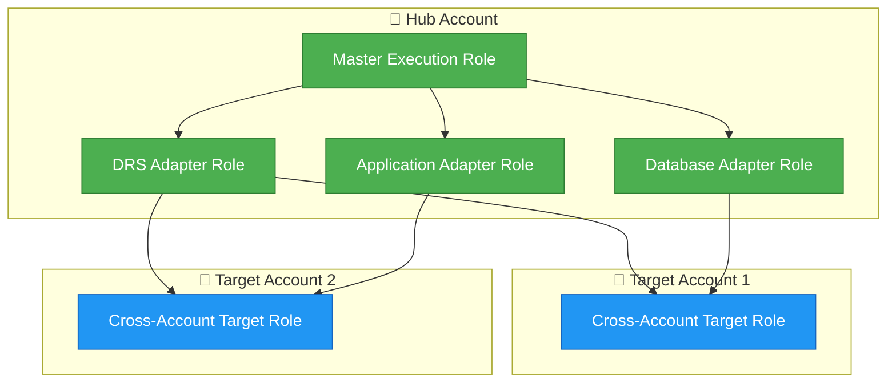
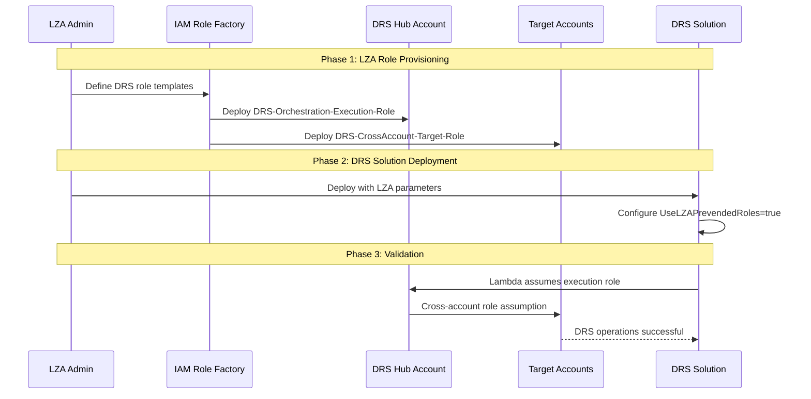

# IAM Roles & Security

[← Back to Index](./README.md) | [← Previous: Technology Adapters](./04-technology-adapters.md)

---

This document describes the IAM role architecture, RBAC implementation, and security configuration for the Enterprise DR Orchestration Platform.

---

## Table of Contents

- [IAM Role Architecture](#iam-role-architecture)
- [Master Execution Role](#master-execution-role)
- [Technology Adapter Roles](#technology-adapter-roles)
- [Cross-Account Target Role](#cross-account-target-role)
- [LZA Integration](#lza-integration)
- [RBAC Implementation](#rbac-implementation)
- [Flexible Authentication](#flexible-authentication)

---

## IAM Role Architecture



---

## Master Execution Role

The master execution role is assumed by Step Functions and Lambda functions for orchestration.

```yaml
DRSOrchestrationExecutionRole:
  Type: AWS::IAM::Role
  Properties:
    RoleName: DRS-Orchestration-Execution-Role
    Description: "Master execution role for DR orchestration"
    MaxSessionDuration: 43200  # 12 hours for long-running DR operations
    AssumeRolePolicyDocument:
      Version: '2012-10-17'
      Statement:
        - Effect: Allow
          Principal:
            Service:
              - lambda.amazonaws.com
              - states.amazonaws.com
          Action: sts:AssumeRole
    Policies:
      - PolicyName: DRSOrchestrationPolicy
        PolicyDocument:
          Version: '2012-10-17'
          Statement:
            # Step Functions execution
            - Sid: StepFunctionsExecution
              Effect: Allow
              Action:
                - states:StartExecution
                - states:SendTaskSuccess
                - states:SendTaskFailure
                - states:SendTaskHeartbeat
                - states:DescribeExecution
                - states:StopExecution
              Resource: "*"
            
            # Lambda invocation
            - Sid: LambdaInvocation
              Effect: Allow
              Action:
                - lambda:InvokeFunction
              Resource:
                - !Sub "arn:aws:lambda:*:${AWS::AccountId}:function:*drs*"
            
            # DynamoDB access
            - Sid: DynamoDBAccess
              Effect: Allow
              Action:
                - dynamodb:GetItem
                - dynamodb:PutItem
                - dynamodb:UpdateItem
                - dynamodb:DeleteItem
                - dynamodb:Query
                - dynamodb:Scan
              Resource:
                - !Sub "arn:aws:dynamodb:*:${AWS::AccountId}:table/*drs*"
            
            # Cross-account role assumption
            - Sid: AssumeTargetAccountRoles
              Effect: Allow
              Action:
                - sts:AssumeRole
              Resource:
                - "arn:aws:iam::*:role/DRS-CrossAccount-Target-Role"
            
            # CloudWatch logging
            - Sid: CloudWatchLogs
              Effect: Allow
              Action:
                - logs:CreateLogGroup
                - logs:CreateLogStream
                - logs:PutLogEvents
              Resource: "*"
```

---

## Technology Adapter Roles

Each technology adapter has specific IAM permissions.

### DRS Adapter Role

```yaml
DRSAdapterRole:
  Type: AWS::IAM::Role
  Properties:
    RoleName: DRS-Adapter-Role
    AssumeRolePolicyDocument:
      Version: '2012-10-17'
      Statement:
        - Effect: Allow
          Principal:
            AWS: !GetAtt DRSOrchestrationExecutionRole.Arn
          Action: sts:AssumeRole
    Policies:
      - PolicyName: DRSAdapterPolicy
        PolicyDocument:
          Version: '2012-10-17'
          Statement:
            - Sid: DRSFullAccess
              Effect: Allow
              Action:
                - drs:*
              Resource: "*"
            - Sid: EC2RecoveryOperations
              Effect: Allow
              Action:
                - ec2:DescribeInstances
                - ec2:DescribeInstanceStatus
                - ec2:DescribeVolumes
                - ec2:DescribeSnapshots
                - ec2:CreateTags
                - ec2:TerminateInstances
                - ec2:RunInstances
              Resource: "*"
```

### Database Adapter Role

```yaml
DatabaseAdapterRole:
  Type: AWS::IAM::Role
  Properties:
    RoleName: Database-Adapter-Role
    Policies:
      - PolicyName: DatabaseAdapterPolicy
        PolicyDocument:
          Version: '2012-10-17'
          Statement:
            - Sid: RDSOperations
              Effect: Allow
              Action:
                - rds:DescribeDBClusters
                - rds:DescribeDBInstances
                - rds:FailoverDBCluster
                - rds:RebootDBInstance
                - rds:CreateDBClusterSnapshot
                - rds:DescribeDBClusterSnapshots
              Resource: "*"
            - Sid: AuroraGlobalOperations
              Effect: Allow
              Action:
                - rds:FailoverGlobalCluster
                - rds:DescribeGlobalClusters
              Resource: "*"
```

### Infrastructure Adapter Role

```yaml
InfrastructureAdapterRole:
  Type: AWS::IAM::Role
  Properties:
    RoleName: Infrastructure-Adapter-Role
    Policies:
      - PolicyName: InfrastructureAdapterPolicy
        PolicyDocument:
          Version: '2012-10-17'
          Statement:
            - Sid: Route53Operations
              Effect: Allow
              Action:
                - route53:ChangeResourceRecordSets
                - route53:GetHostedZone
                - route53:ListResourceRecordSets
              Resource: "*"
            - Sid: ELBOperations
              Effect: Allow
              Action:
                - elasticloadbalancing:DescribeTargetGroups
                - elasticloadbalancing:RegisterTargets
                - elasticloadbalancing:DeregisterTargets
              Resource: "*"
```

---

## Cross-Account Target Role

Deploy this role in each target account for cross-account DR operations.

> **Note**: The reference implementation in `archive/dr-orchestration-artifacts/role-templates/TargetAccountsAssumeRole.yaml` uses `AdministratorAccess` for simplicity. The production template below uses least-privilege permissions for security compliance.

```yaml
AWSTemplateFormatVersion: '2010-09-09'
Description: 'Cross-Account Target Role for DRS Orchestration'

Parameters:
  DRSOrchestrationAccountId:
    Type: String
    Description: Account ID where DRS Orchestration is deployed
  ExternalId:
    Type: String
    Description: External ID for secure role assumption
    NoEcho: true
  OrganizationId:
    Type: String
    Description: AWS Organization ID for additional security
  PrimaryRegion:
    Type: String
    Description: Primary region of the orchestrator account
    Default: us-east-1
  SecondaryRegion:
    Type: String
    Description: Secondary region of the orchestrator account
    Default: us-west-2

Resources:
  DRSCrossAccountTargetRole:
    Type: AWS::IAM::Role
    Properties:
      RoleName: DRS-CrossAccount-Target-Role
      MaxSessionDuration: 43200
      AssumeRolePolicyDocument:
        Version: '2012-10-17'
        Statement:
          # Allow Lambda service to assume role
          - Effect: Allow
            Principal:
              Service: lambda.amazonaws.com
            Action: sts:AssumeRole
          # Allow orchestrator master roles from both regions
          - Effect: Allow
            Principal:
              AWS: 
                - !Sub "arn:aws:iam::${DRSOrchestrationAccountId}:role/DRS-Orchestration-Execution-Role"
                - !Sub "arn:aws:iam::${DRSOrchestrationAccountId}:role/aws-orchestrator-master-role-${PrimaryRegion}"
                - !Sub "arn:aws:iam::${DRSOrchestrationAccountId}:role/aws-orchestrator-master-role-${SecondaryRegion}"
            Action: sts:AssumeRole
            Condition:
              StringEquals:
                'sts:ExternalId': !Ref ExternalId
                'aws:PrincipalOrgID': !Ref OrganizationId
      Policies:
        - PolicyName: DRSCrossAccountPolicy
          PolicyDocument:
            Version: '2012-10-17'
            Statement:
              # DRS Operations
              - Sid: DRSFullAccess
                Effect: Allow
                Action:
                  - drs:*
                Resource: "*"
              # EC2 Recovery Operations
              - Sid: EC2RecoveryOperations
                Effect: Allow
                Action:
                  - ec2:DescribeInstances
                  - ec2:DescribeInstanceStatus
                  - ec2:CreateTags
                  - ec2:TerminateInstances
                  - ec2:RunInstances
                  - ec2:StopInstances
                  - ec2:StartInstances
                Resource: "*"
              # RDS/Aurora Operations
              - Sid: RDSOperations
                Effect: Allow
                Action:
                  - rds:DescribeDBClusters
                  - rds:DescribeDBInstances
                  - rds:FailoverDBCluster
                  - rds:FailoverGlobalCluster
                  - rds:CreateDBClusterSnapshot
                  - rds:RestoreDBInstanceToPointInTime
                  - rds:DeleteDBInstance
                  - rds:ModifyDBInstance
                  - rds:StartDBInstanceAutomatedBackupsReplication
                  - rds:DescribeDBInstanceAutomatedBackups
                Resource: "*"
              # ECS Operations
              - Sid: ECSOperations
                Effect: Allow
                Action:
                  - ecs:UpdateService
                  - ecs:DescribeServices
                  - ecs:DescribeClusters
                Resource: "*"
              # Auto Scaling Operations
              - Sid: AutoScalingOperations
                Effect: Allow
                Action:
                  - autoscaling:UpdateAutoScalingGroup
                  - autoscaling:DescribeAutoScalingGroups
                  - application-autoscaling:RegisterScalableTarget
                  - application-autoscaling:DescribeScalableTargets
                Resource: "*"
              # Route 53 Operations
              - Sid: Route53Operations
                Effect: Allow
                Action:
                  - route53:ChangeResourceRecordSets
                  - route53:GetHostedZone
                  - route53:ListResourceRecordSets
                Resource: "*"
              # EventBridge Operations
              - Sid: EventBridgeOperations
                Effect: Allow
                Action:
                  - events:EnableRule
                  - events:DisableRule
                  - events:DescribeRule
                  - events:StartReplay
                  - events:DescribeReplay
                Resource: "*"
              # Lambda Operations
              - Sid: LambdaOperations
                Effect: Allow
                Action:
                  - lambda:InvokeFunction
                Resource: "*"
              # ElastiCache Operations
              - Sid: ElastiCacheOperations
                Effect: Allow
                Action:
                  - elasticache:DescribeGlobalReplicationGroups
                  - elasticache:DisassociateGlobalReplicationGroup
                  - elasticache:CreateGlobalReplicationGroup
                  - elasticache:DeleteGlobalReplicationGroup
                  - elasticache:DescribeReplicationGroups
                  - elasticache:CreateReplicationGroup
                  - elasticache:DeleteReplicationGroup
                Resource: "*"
              # MemoryDB Operations
              - Sid: MemoryDBOperations
                Effect: Allow
                Action:
                  - memorydb:DescribeClusters
                  - memorydb:CreateCluster
                  - memorydb:DeleteCluster
                Resource: "*"
              # OpenSearch Operations
              - Sid: OpenSearchOperations
                Effect: Allow
                Action:
                  - es:UpdateDomainConfig
                  - es:DescribeDomainChangeProgress
                  - es:DescribeDomain
                Resource: "*"
              # SSM Parameter Store (for config storage)
              - Sid: SSMParameterStore
                Effect: Allow
                Action:
                  - ssm:GetParameter
                  - ssm:PutParameter
                  - ssm:SendCommand
                  - ssm:GetCommandInvocation
                Resource: "*"
              # S3 Access (for backups and manifests)
              - Sid: S3Access
                Effect: Allow
                Action:
                  - s3:GetObject
                  - s3:PutObject
                  - s3:ListBucket
                Resource: "*"
              # IAM PassRole for DRS
              - Sid: IAMPassRole
                Effect: Allow
                Action:
                  - iam:PassRole
                Resource:
                  - !Sub "arn:aws:iam::${AWS::AccountId}:role/AWSElasticDisasterRecovery*"
                Condition:
                  StringEquals:
                    'iam:PassedToService': drs.amazonaws.com
      Tags:
        - Key: ManagedBy
          Value: DRS-Orchestration
        - Key: TrustingAccount
          Value: !Ref DRSOrchestrationAccountId

Outputs:
  RoleArn:
    Description: ARN of the DRS Cross-Account Target Role
    Value: !GetAtt DRSCrossAccountTargetRole.Arn
    Export:
      Name: DRS-CrossAccount-Target-Role-Arn
```

### Reference Implementation Note

The archive reference implementation uses `AdministratorAccess` managed policy for rapid prototyping. **For production deployments**, always use the least-privilege policy above or customize based on your specific module requirements.

---

## LZA Integration

For AWS Landing Zone Accelerator (LZA) environments, use pre-vended IAM roles.

### LZA Deployment Workflow



### CloudFormation Parameters for LZA

```yaml
Parameters:
  UseLZAPrevendedRoles:
    Type: String
    Default: "false"
    AllowedValues: ["true", "false"]
    Description: "Use pre-vended IAM roles from LZA"
  
  LZAExecutionRoleArn:
    Type: String
    Default: ""
    Description: "ARN of LZA pre-vended execution role"
  
  LZACrossAccountRoleName:
    Type: String
    Default: "DRS-CrossAccount-Target-Role"
    Description: "Name of LZA pre-vended cross-account role"

Conditions:
  CreateIAMRoles: !Equals [!Ref UseLZAPrevendedRoles, "false"]
  UseLZARoles: !Equals [!Ref UseLZAPrevendedRoles, "true"]

Resources:
  APIHandlerFunction:
    Type: AWS::Lambda::Function
    Properties:
      Role: !If 
        - UseLZARoles
        - !Ref LZAExecutionRoleArn
        - !GetAtt DRSExecutionRole.Arn
```

### LZA Administrator Checklist

| Step | Action | Account | Notes |
|------|--------|---------|-------|
| 1 | Create DRS Orchestration Execution Role | Hub Account | Use template above |
| 2 | Create DRS Cross-Account Target Role | All Workload Accounts | Deploy via StackSets |
| 3 | Configure External ID | All Accounts | Store in Secrets Manager |
| 4 | Update SCPs if needed | Organization | Allow DRS operations |
| 5 | Provide role ARNs to DRS deployment | - | For CloudFormation parameters |
| 6 | Deploy DRS Orchestration | Hub Account | With LZA parameters |
| 7 | Validate cross-account access | - | Test role assumption |

---

## RBAC Implementation

The DRS solution implements comprehensive Role-Based Access Control with 5 granular roles.

### RBAC Roles

| Role | Description | Key Permissions |
|------|-------------|-----------------|
| **DRSOrchestrationAdmin** | Full administrative access | All operations including account deletion, configuration export/import |
| **DRSRecoveryManager** | Recovery operations lead | Execute plans, terminate instances, manage configuration |
| **DRSPlanManager** | DR planning focus | Create/modify/delete protection groups & recovery plans |
| **DRSOperator** | On-call operations | Execute/pause/resume recovery (no create/delete) |
| **DRSReadOnly** | Audit and monitoring | View-only access for compliance officers |

### Cognito Group Names

Users are assigned roles via AWS Cognito Groups:

**Primary DRS Roles:**
- `DRSOrchestrationAdmin`
- `DRSRecoveryManager`
- `DRSPlanManager`
- `DRSOperator`
- `DRSReadOnly`

**Legacy Group Names (Backward Compatible):**
- `DRS-Administrator` → DRSOrchestrationAdmin
- `DRS-Infrastructure-Admin` → DRSRecoveryManager
- `DRS-Recovery-Plan-Manager` → DRSPlanManager
- `DRS-Operator` → DRSOperator
- `DRS-Read-Only` → DRSReadOnly

### Permission Matrix

| Permission | Admin | RecoveryMgr | PlanMgr | Operator | ReadOnly |
|------------|:-----:|:-----------:|:-------:|:--------:|:--------:|
| View All Resources | ✅ | ✅ | ✅ | ✅ | ✅ |
| Create Protection Groups | ✅ | ✅ | ✅ | ❌ | ❌ |
| Modify Protection Groups | ✅ | ✅ | ✅ | ❌ | ❌ |
| Delete Protection Groups | ✅ | ✅ | ✅ | ❌ | ❌ |
| Create Recovery Plans | ✅ | ✅ | ✅ | ❌ | ❌ |
| Execute Recovery Plans | ✅ | ✅ | ✅ | ✅ | ❌ |
| Pause/Resume Execution | ✅ | ✅ | ✅ | ✅ | ❌ |
| Cancel Execution | ✅ | ✅ | ✅ | ✅ | ❌ |
| Terminate Instances | ✅ | ✅ | ❌ | ❌ | ❌ |
| Export Configuration | ✅ | ✅ | ❌ | ❌ | ❌ |
| Import Configuration | ✅ | ❌ | ❌ | ❌ | ❌ |
| Delete Target Accounts | ✅ | ❌ | ❌ | ❌ | ❌ |

### RBAC Middleware Implementation

```python
# lambda/shared/rbac_middleware.py
from enum import Enum
from typing import Dict, List, Set

class DRSPermission(Enum):
    VIEW_PROTECTION_GROUPS = "view_protection_groups"
    CREATE_PROTECTION_GROUPS = "create_protection_groups"
    MODIFY_PROTECTION_GROUPS = "modify_protection_groups"
    DELETE_PROTECTION_GROUPS = "delete_protection_groups"
    VIEW_RECOVERY_PLANS = "view_recovery_plans"
    CREATE_RECOVERY_PLANS = "create_recovery_plans"
    MODIFY_RECOVERY_PLANS = "modify_recovery_plans"
    DELETE_RECOVERY_PLANS = "delete_recovery_plans"
    START_RECOVERY = "start_recovery"
    STOP_RECOVERY = "stop_recovery"
    VIEW_EXECUTIONS = "view_executions"
    TERMINATE_INSTANCES = "terminate_instances"
    EXPORT_CONFIG = "export_config"
    IMPORT_CONFIG = "import_config"
    DELETE_ACCOUNTS = "delete_accounts"

ROLE_PERMISSIONS: Dict[str, Set[DRSPermission]] = {
    "DRSOrchestrationAdmin": set(DRSPermission),  # All permissions
    "DRSRecoveryManager": {
        DRSPermission.VIEW_PROTECTION_GROUPS,
        DRSPermission.CREATE_PROTECTION_GROUPS,
        DRSPermission.MODIFY_PROTECTION_GROUPS,
        DRSPermission.DELETE_PROTECTION_GROUPS,
        DRSPermission.VIEW_RECOVERY_PLANS,
        DRSPermission.CREATE_RECOVERY_PLANS,
        DRSPermission.MODIFY_RECOVERY_PLANS,
        DRSPermission.DELETE_RECOVERY_PLANS,
        DRSPermission.START_RECOVERY,
        DRSPermission.STOP_RECOVERY,
        DRSPermission.VIEW_EXECUTIONS,
        DRSPermission.TERMINATE_INSTANCES,
        DRSPermission.EXPORT_CONFIG,
    },
    # ... additional roles
}

def check_authorization(event: Dict) -> Dict:
    """Check if user is authorized for the requested operation."""
    # Extract user groups from Cognito JWT
    claims = event.get("requestContext", {}).get("authorizer", {}).get("claims", {})
    groups = claims.get("cognito:groups", "").split(",")
    
    # Get required permissions for endpoint
    method = event.get("httpMethod", "GET")
    path = event.get("path", "/")
    required_permissions = get_endpoint_permissions(method, path)
    
    # Check if user has required permissions
    user_permissions = get_user_permissions(groups)
    
    if any(perm in user_permissions for perm in required_permissions):
        return {"authorized": True, "user": {"groups": groups}}
    else:
        return {"authorized": False, "reason": "Insufficient permissions"}
```

---

## Flexible Authentication

The platform supports multiple authentication methods.

### Authentication Options

| Option | Auth Mode | Deploy UI | Use Case |
|--------|-----------|-----------|----------|
| **Full Interactive** | `cognito` | `true` | Complete web interface |
| **API + UI** | `cognito` | `true` | Web interface + programmatic access |
| **Pure API** | `role_based` | `false` | Headless automation |
| **Hybrid** | `cognito` | `false` | Cognito auth without UI |

### Role-Based Authentication (API-Only)

```yaml
Parameters:
  AuthenticationMode:
    Type: String
    Default: "cognito"
    AllowedValues: ["cognito", "role_based"]
    Description: "Authentication method for DRS solution"
  
  DeployWebUI:
    Type: String
    Default: "true"
    AllowedValues: ["true", "false"]
    Description: "Deploy web UI components"

Conditions:
  DeployCognito: !Equals [!Ref AuthenticationMode, "cognito"]
  DeployWebUI: !And 
    - !Equals [!Ref DeployWebUI, "true"]
    - !Condition DeployCognito
```

### IAM Roles for API-Only Deployment

```yaml
# DRS Admin Role (full access)
DRSAdminRole:
  Type: AWS::IAM::Role
  Properties:
    RoleName: DRS-Admin-Role
    AssumeRolePolicyDocument:
      Version: '2012-10-17'
      Statement:
        - Effect: Allow
          Principal:
            AWS: !Sub "arn:aws:iam::${SourceAccountId}:root"
          Action: sts:AssumeRole
          Condition:
            StringEquals:
              'sts:ExternalId': !Ref ExternalId
    Policies:
      - PolicyName: DRSAdminPolicy
        PolicyDocument:
          Version: '2012-10-17'
          Statement:
            - Effect: Allow
              Action: "execute-api:Invoke"
              Resource: !Sub "arn:aws:execute-api:*:${AWS::AccountId}:*/*/*"

# DRS ReadOnly Role
DRSReadOnlyRole:
  Type: AWS::IAM::Role
  Properties:
    RoleName: DRS-ReadOnly-Role
    Policies:
      - PolicyName: DRSReadOnlyPolicy
        PolicyDocument:
          Version: '2012-10-17'
          Statement:
            - Effect: Allow
              Action: "execute-api:Invoke"
              Resource:
                - !Sub "arn:aws:execute-api:*:${AWS::AccountId}:*/*/GET/*"
```

### API-Only Usage Example

```bash
# Assume DRS execution role
aws sts assume-role \
  --role-arn "arn:aws:iam::ACCOUNT:role/DRS-Execution-Role" \
  --role-session-name "drs-recovery-session" \
  --external-id "your-external-id"

# Use assumed role credentials
export AWS_ACCESS_KEY_ID="ASIA..."
export AWS_SECRET_ACCESS_KEY="..."
export AWS_SESSION_TOKEN="..."

# Start DRS recovery (no UI needed)
curl -X POST https://api-gateway-url/prod/executions \
  --aws-sigv4 "aws:us-east-1:execute-api" \
  -d '{"recoveryPlanId": "plan-123", "executionType": "RECOVERY"}'
```

---

[← Back to Index](./README.md) | [← Previous: Technology Adapters](./04-technology-adapters.md) | [Next: Architecture →](./06-architecture.md)