# Architecture & Data Flow

[← Back to Index](./README.md) | [← Previous: IAM & Security](./05-iam-security.md)

---

This document describes the technical architecture, core components, and data flow patterns for the Enterprise DR Orchestration Platform.

---

## Table of Contents

- [Core Architecture](#core-architecture)
- [Orchestration Engine](#orchestration-engine)
- [Technology Integration Architecture](#technology-integration-architecture)
- [Execution State Management](#execution-state-management)
- [Tag-Based Resource Discovery](#tag-based-resource-discovery)
- [Multi-Technology Wave Execution](#multi-technology-wave-execution)
- [DRS Solution Integration](#drs-solution-integration)

---

## Core Architecture

```mermaid
flowchart TD
    subgraph "🚀 Trigger Sources"
        CLI["💻 AWS CLI"]
        SSM["📋 SSM Documents"]
        EB["⚡ EventBridge"]
        CICD["🔧 CI/CD Pipelines"]
    end
    
    subgraph "🌐 API Gateway Layer"
        REST["🔗 REST API"]
        AUTH["🔐 Cognito/IAM Auth"]
    end
    
    subgraph "⚙️ Orchestration Engine"
        MASTER["🎯 Master Step Functions"]
        WAVE["🌊 Wave Controller"]
        PAUSE["⏸️ Pause/Resume Manager"]
    end
    
    subgraph "🔌 Technology Adapters"
        DRS["DRS Adapter"]
        DB["Database Adapter"]
        APP["Application Adapter"]
        INFRA["Infrastructure Adapter"]
    end
    
    subgraph "☁️ AWS Services"
        AWS_DRS["AWS DRS"]
        RDS["RDS/Aurora"]
        EC2["EC2/SSM"]
        R53["Route 53"]
    end
    
    CLI --> REST
    SSM --> REST
    EB --> REST
    CICD --> REST
    
    REST --> AUTH
    AUTH --> MASTER
    MASTER --> WAVE
    WAVE --> PAUSE
    
    WAVE --> DRS
    WAVE --> DB
    WAVE --> APP
    WAVE --> INFRA
    
    DRS --> AWS_DRS
    DB --> RDS
    APP --> EC2
    INFRA --> R53
```



---

## Orchestration Engine

### Master Step Functions State Machine


### Step Functions Definition

```yaml
States:
  PreExecutionValidation:
    Type: Task
    Resource: arn:aws:lambda:function:validate-execution
    Next: WaveExecutionLoop
    
  WaveExecutionLoop:
    Type: Map
    ItemsPath: "$.waves"
    MaxConcurrency: 1  # Sequential wave execution
    Iterator:
      StartAt: PreWaveValidation
      States:
        PreWaveValidation:
          Type: Task
          Resource: arn:aws:lambda:function:validate-wave
          Next: TechnologyParallelExecution
          
        TechnologyParallelExecution:
          Type: Parallel
          Branches:
            - StartAt: DRSExecution
              States:
                DRSExecution:
                  Type: Task
                  Resource: arn:aws:states:::states:startExecution.sync
                  Parameters:
                    StateMachineArn: !Ref DRSStateMachine
                  End: true
            - StartAt: DatabaseExecution
              States:
                DatabaseExecution:
                  Type: Task
                  Resource: arn:aws:lambda:function:database-adapter
                  End: true
          Next: WaveCompletionValidation
          
        WaveCompletionValidation:
          Type: Task
          Resource: arn:aws:lambda:function:validate-wave-completion
          Next: CheckPausePoint
          
        CheckPausePoint:
          Type: Choice
          Choices:
            - Variable: "$.pauseAfterWave"
              BooleanEquals: true
              Next: WaitForResume
          Default: WaveComplete
          
        WaitForResume:
          Type: Task
          Resource: arn:aws:states:::sqs:sendMessage.waitForTaskToken
          Parameters:
            QueueUrl: !Ref PauseResumeQueue
            MessageBody:
              TaskToken.$: "$$.Task.Token"
              ExecutionId.$: "$.executionId"
              WaveNumber.$: "$.currentWave"
          Next: WaveComplete
          
        WaveComplete:
          Type: Pass
          End: true
    Next: PostExecutionCleanup
    
  PostExecutionCleanup:
    Type: Task
    Resource: arn:aws:lambda:function:cleanup-execution
    Next: ExecutionComplete
    
  ExecutionComplete:
    Type: Succeed
```

---

## Technology Integration Architecture


---

## Execution State Management

### State Diagram


### Execution State Schema

```json
{
  "executionId": "exec-12345",
  "planId": "plan-67890",
  "status": "in_progress",
  "currentWave": 2,
  "startedAt": "2026-01-07T10:00:00Z",
  "waves": [
    {
      "waveNumber": 1,
      "name": "Database Tier",
      "status": "completed",
      "startedAt": "2026-01-07T10:00:00Z",
      "completedAt": "2026-01-07T10:05:00Z",
      "technologies": [
        {
          "type": "database",
          "status": "completed",
          "resources": ["rds-prod-01", "aurora-cluster-01"],
          "executionTime": "PT5M"
        }
      ]
    },
    {
      "waveNumber": 2,
      "name": "Application Tier",
      "status": "in_progress",
      "startedAt": "2026-01-07T10:05:00Z",
      "technologies": [
        {
          "type": "drs",
          "status": "in_progress",
          "subExecutionId": "drs-exec-456",
          "resources": ["i-app01", "i-app02"]
        },
        {
          "type": "application",
          "status": "pending",
          "resources": ["app-service-01"]
        }
      ]
    }
  ],
  "enterpriseContext": {
    "initiatedBy": "Enterprise-DR-Platform",
    "parentExecutionId": "enterprise-exec-789",
    "tags": {
      "Environment": "production",
      "Application": "core-banking"
    }
  }
}
```

---

## Tag-Based Resource Discovery

### Discovery Flow


### Discovery Query Schema

```json
{
  "discoveryQuery": {
    "tags": {
      "Environment": "production",
      "DR-Tier": "application",
      "DR-Wave": "2"
    },
    "technologies": ["drs", "application", "database"]
  },
  "discoveredResources": {
    "drs": ["i-app01", "i-app02"],
    "application": ["app-service-01"],
    "database": []
  }
}
```

### Tag Schema

| Tag Key | Description | Example Values |
|---------|-------------|----------------|
| `DR-Enabled` | Resource participates in DR | `true`, `false` |
| `DR-Tier` | Application tier | `database`, `application`, `web` |
| `DR-Wave` | Wave number for recovery | `1`, `2`, `3` |
| `DR-Technology` | Technology adapter to use | `drs`, `database`, `application` |
| `DR-Priority` | Recovery priority within wave | `high`, `medium`, `low` |

---

## Multi-Technology Wave Execution

### Execution Timeline


### Wave Configuration Schema

```yaml
waves:
  - waveNumber: 1
    name: "Database Tier"
    technologies:
      - type: "database"
        operation: "failover"
        resources:
          clusters: ["aurora-prod-cluster"]
    pauseAfterWave: false
    dependencies: []
    
  - waveNumber: 2
    name: "Application Tier"
    technologies:
      - type: "drs"
        operation: "recovery"
        resources:
          recoveryPlanId: "plan-app-tier"
          protectionGroups: ["pg-app-servers"]
      - type: "application"
        operation: "scripts"
        resources:
          scripts: ["start-services.sh"]
    pauseAfterWave: true  # Manual validation
    dependencies: [1]
    
  - waveNumber: 3
    name: "Infrastructure"
    technologies:
      - type: "infrastructure"
        operation: "dns_update"
        resources:
          route53Records:
            - recordName: "app.company.com"
              newValue: "recovered-lb.elb.amazonaws.com"
    pauseAfterWave: false
    dependencies: [2]
```

---

## DRS Solution Integration

### Integration Architecture


### DRS Integration Flow


### Export Data Integration

```json
{
  "executionId": "enterprise-exec-12345",
  "waveNumber": 2,
  "technology": "drs",
  "status": "completed",
  "results": {
    "drsExecutionId": "drs-exec-67890",
    "recoveredInstances": [
      {
        "sourceInstanceId": "i-source01",
        "recoveryInstanceId": "i-recovery01",
        "privateIp": "10.0.1.100",
        "status": "running"
      }
    ],
    "executionTime": "PT15M30S",
    "nextPhaseReady": true,
    "drsExportData": "<existing_export_format>"
  }
}
```

### DRS Solution vs Enterprise Platform

| DRS Solution | Enterprise Platform |
|--------------|---------------------|
| Wave-based server recovery | Layer-based resource orchestration |
| Pause/resume between waves | Approval workflow between phases |
| Tag-based server discovery | Manifest-driven configuration |
| Protection groups | Resource groupings in layers |
| Single technology (DRS) | Multi-technology (Aurora, ECS, Route53, etc.) |

---

## Data Architecture

### DynamoDB Tables

| Table | Purpose | Key Schema |
|-------|---------|------------|
| `protection-groups` | Server groupings | `GroupId` (PK) |
| `recovery-plans` | Wave configurations | `PlanId` (PK) |
| `execution-history` | Execution records | `ExecutionId` (PK), `Status-StartedAt` (GSI) |
| `target-accounts` | Cross-account config | `AccountId` (PK) |

### API Endpoints

| Category | Endpoints | Description |
|----------|-----------|-------------|
| Executions | 8 | Start, status, pause, resume, cancel, export |
| Protection Groups | 6 | CRUD + tag preview |
| Recovery Plans | 5 | CRUD + validation |
| DRS Operations | 10 | Source servers, launch config, tag sync |
| Configuration | 4 | Settings, export, import |
| Target Accounts | 4 | Cross-account management |

---

[← Back to Index](./README.md) | [← Previous: IAM & Security](./05-iam-security.md) | [Next: Implementation Guide →](./07-implementation.md)