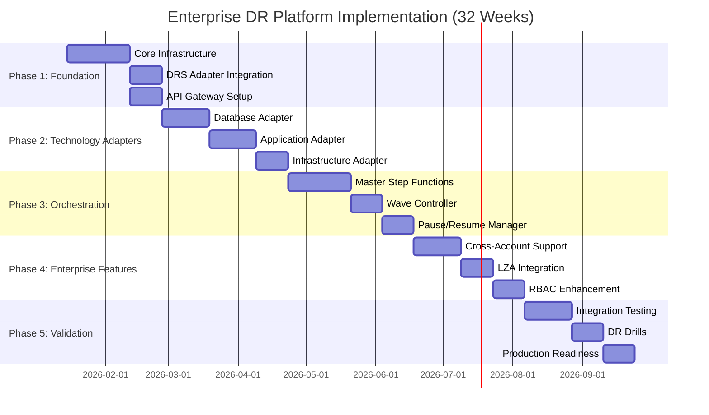
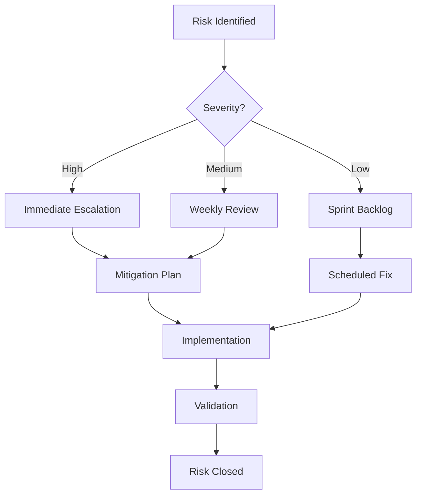
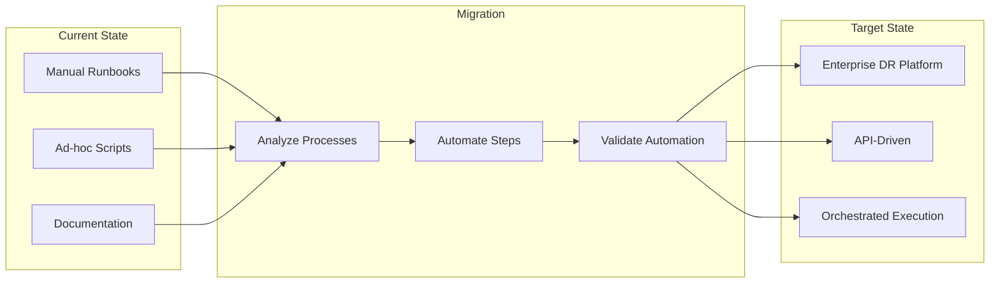
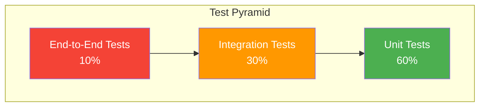

# Implementation Guide

[← Back to Index](./README.md) | [← Previous: Architecture](./06-architecture.md)

---

This document provides implementation phases, success criteria, risk assessment, and migration strategies for the Enterprise DR Orchestration Platform.

---

## Table of Contents

- [Implementation Phases](#implementation-phases)
- [Phase Details](#phase-details)
- [Success Criteria](#success-criteria)
- [Risk Assessment](#risk-assessment)
- [Migration Strategies](#migration-strategies)
- [Testing Strategy](#testing-strategy)

---

## Implementation Phases

---

## Phase Details

### Phase 1: Foundation (8 weeks)

**Objective**: Establish core infrastructure and integrate existing DRS solution.

| Week | Deliverable | Description |
|------|-------------|-------------|
| 1-2 | Infrastructure Setup | Deploy base CloudFormation stacks, DynamoDB tables, IAM roles |
| 3-4 | API Gateway | REST API with authentication, rate limiting, request validation |
| 5-6 | DRS Adapter | Integrate existing DRS solution as core technology adapter |
| 7-8 | Testing & Documentation | Unit tests, integration tests, API documentation |

**Key Milestones**:
- ✅ Core infrastructure deployed
- ✅ DRS solution integrated as adapter
- ✅ API Gateway operational with authentication
- ✅ Basic execution workflow functional

### Phase 2: Technology Adapters (8 weeks)

**Objective**: Implement additional technology adapters for multi-technology DR.

| Week | Deliverable | Description |
|------|-------------|-------------|
| 9-11 | Database Adapter | RDS/Aurora failover, SQL Always On support |
| 12-14 | Application Adapter | SSM script execution, Lambda triggers |
| 15-16 | Infrastructure Adapter | Route 53, Load Balancers, Security Groups |

**Key Milestones**:
- ✅ Database failover automated
- ✅ Application recovery scripts integrated
- ✅ Infrastructure updates automated
- ✅ All adapters follow standard interface

### Phase 3: Orchestration (8 weeks)

**Objective**: Build master orchestration engine with wave-based execution.

| Week | Deliverable | Description |
|------|-------------|-------------|
| 17-20 | Master Step Functions | Multi-technology wave orchestration |
| 21-22 | Wave Controller | Sequential wave execution with parallel technology processing |
| 23-24 | Pause/Resume Manager | Manual validation points between waves |

**Key Milestones**:
- ✅ Multi-technology wave execution
- ✅ Pause/resume functionality
- ✅ Status aggregation across technologies
- ✅ Export data generation

### Phase 4: Enterprise Features (7 weeks)

**Objective**: Add enterprise-grade features for large-scale deployments.

| Week | Deliverable | Description |
|------|-------------|-------------|
| 25-27 | Cross-Account Support | Hub-and-spoke architecture, role assumption |
| 28-29 | LZA Integration | Pre-vended IAM roles, StackSets deployment |
| 30-31 | RBAC Enhancement | Extended roles, API-only authentication |

**Key Milestones**:
- ✅ Cross-account DR operations
- ✅ LZA-compatible deployment
- ✅ Flexible authentication options
- ✅ Enterprise RBAC

### Phase 5: Validation (7 weeks)

**Objective**: Comprehensive testing and production readiness validation.

| Week | Deliverable | Description |
|------|-------------|-------------|
| 32-34 | Integration Testing | End-to-end testing across all technologies |
| 35-36 | DR Drills | Simulated disaster recovery exercises |
| 37-38 | Production Readiness | Performance tuning, documentation, training |

**Key Milestones**:
- ✅ All integration tests passing
- ✅ Successful DR drill execution
- ✅ Production deployment approved
- ✅ Operations team trained

---

## Success Criteria

### Technical Success Criteria

| Criteria | Target | Measurement |
|----------|--------|-------------|
| **API Availability** | 99.9% uptime | CloudWatch metrics |
| **Execution Success Rate** | >95% | Execution history analysis |
| **Recovery Time** | <RTO targets | Execution duration metrics |
| **Cross-Account Operations** | 100% success | Cross-account test results |
| **RBAC Enforcement** | 100% coverage | Security audit |

### Business Success Criteria

| Criteria | Target | Measurement |
|----------|--------|-------------|
| **DR Drill Frequency** | Monthly | Execution history |
| **Mean Time to Recovery** | <4 hours | Drill metrics |
| **Automation Coverage** | >90% | Manual intervention tracking |
| **Compliance Audit** | Pass | External audit results |
| **Team Adoption** | 100% | Training completion |

### Integration Success Criteria

| Criteria | Target | Measurement |
|----------|--------|-------------|
| **DRS Solution Integration** | Seamless | No breaking changes |
| **CI/CD Pipeline** | Automated | GitHub Actions success rate |
| **Monitoring Coverage** | 100% | CloudWatch dashboards |
| **Documentation** | Complete | Documentation review |

---

## Risk Assessment

### High Risk Items

| Risk | Impact | Probability | Mitigation |
|------|--------|-------------|------------|
| **DRS API Changes** | High | Medium | Version pinning, adapter abstraction |
| **Cross-Account Failures** | High | Medium | Comprehensive IAM testing, external ID validation |
| **Step Functions Limits** | High | Low | Pagination, chunked execution |
| **Data Loss During DR** | Critical | Low | Pre-execution validation, rollback procedures |

### Medium Risk Items

| Risk | Impact | Probability | Mitigation |
|------|--------|-------------|------------|
| **Performance Degradation** | Medium | Medium | Load testing, auto-scaling |
| **Authentication Failures** | Medium | Low | Token refresh, retry logic |
| **Network Connectivity** | Medium | Low | VPC endpoints, retry mechanisms |
| **Configuration Drift** | Medium | Medium | Infrastructure as Code, drift detection |

### Low Risk Items

| Risk | Impact | Probability | Mitigation |
|------|--------|-------------|------------|
| **Documentation Gaps** | Low | Medium | Continuous documentation updates |
| **Training Delays** | Low | Low | Self-service documentation |
| **Minor Bug Fixes** | Low | High | Automated testing, CI/CD |

### Risk Monitoring

---

## Migration Strategies

### From Manual DR Processes

### Migration Steps

1. **Discovery Phase** (2 weeks)
   - Document existing DR processes
   - Identify manual steps
   - Map dependencies between systems

2. **Analysis Phase** (2 weeks)
   - Categorize processes by technology
   - Identify automation candidates
   - Define wave structure

3. **Implementation Phase** (4 weeks)
   - Create protection groups
   - Define recovery plans
   - Configure technology adapters

4. **Validation Phase** (2 weeks)
   - Execute DR drills
   - Compare with manual process
   - Refine automation

5. **Cutover Phase** (1 week)
   - Deprecate manual processes
   - Enable automated DR
   - Monitor execution

### Rollback Strategy

| Scenario | Rollback Action | Recovery Time |
|----------|-----------------|---------------|
| **Adapter Failure** | Disable adapter, manual execution | <30 minutes |
| **Orchestration Failure** | Cancel execution, manual recovery | <1 hour |
| **Platform Outage** | Revert to manual runbooks | <2 hours |
| **Data Corruption** | Restore from DynamoDB backup | <4 hours |

---

## Testing Strategy

### Test Pyramid

### Unit Tests

| Component | Coverage Target | Framework |
|-----------|-----------------|-----------|
| Lambda Functions | >80% | pytest |
| Technology Adapters | >90% | pytest + moto |
| RBAC Middleware | >95% | pytest |
| Frontend Components | >70% | Jest + React Testing Library |

### Integration Tests

| Test Type | Description | Frequency |
|-----------|-------------|-----------|
| **API Integration** | End-to-end API calls | Every commit |
| **Cross-Account** | Role assumption, DRS operations | Daily |
| **Database** | DynamoDB operations | Every commit |
| **Step Functions** | Workflow execution | Daily |

### End-to-End Tests

| Test Scenario | Description | Frequency |
|---------------|-------------|-----------|
| **Full DR Drill** | Complete multi-technology recovery | Weekly |
| **Pause/Resume** | Manual validation workflow | Weekly |
| **Cross-Account DR** | Multi-account recovery | Monthly |
| **Failure Recovery** | Error handling, rollback | Monthly |

### DR Drill Schedule

| Drill Type | Scope | Frequency | Duration |
|------------|-------|-----------|----------|
| **Tabletop** | Process review | Monthly | 2 hours |
| **Component** | Single technology | Weekly | 1 hour |
| **Integrated** | Multi-technology | Monthly | 4 hours |
| **Full Scale** | Production-like | Quarterly | 8 hours |

---

## Deployment Checklist

### Pre-Deployment

- [ ] All unit tests passing
- [ ] Integration tests passing
- [ ] Security scan clean
- [ ] Documentation updated
- [ ] Change request approved
- [ ] Rollback plan documented

### Deployment

- [ ] CloudFormation validation
- [ ] Stack deployment successful
- [ ] API Gateway deployed
- [ ] Lambda functions updated
- [ ] Frontend deployed
- [ ] CloudFront cache invalidated

### Post-Deployment

- [ ] Health checks passing
- [ ] API endpoints responding
- [ ] Authentication working
- [ ] Cross-account access verified
- [ ] Monitoring dashboards updated
- [ ] Team notified

---

## Support and Maintenance

### Support Tiers

| Tier | Response Time | Scope |
|------|---------------|-------|
| **P1 - Critical** | <15 minutes | Production DR failure |
| **P2 - High** | <1 hour | DR drill failure |
| **P3 - Medium** | <4 hours | Feature issues |
| **P4 - Low** | <24 hours | Documentation, enhancements |

### Maintenance Windows

| Activity | Frequency | Duration | Impact |
|----------|-----------|----------|--------|
| **Security Patches** | Weekly | 30 minutes | None |
| **Feature Updates** | Bi-weekly | 1 hour | Minimal |
| **Major Upgrades** | Quarterly | 4 hours | Scheduled downtime |

---

[← Back to Index](./README.md) | [← Previous: Architecture](./06-architecture.md)