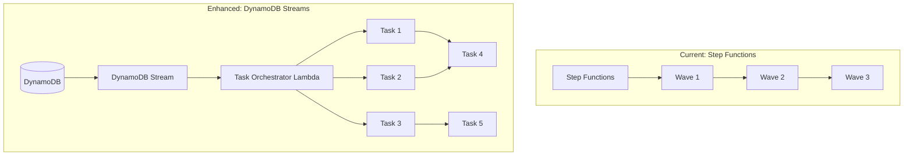

# Cloud Migration Factory Learnings for Enterprise Orchestration

**Version**: 1.0  
**Date**: January 8, 2026  
**Source**: AWS Cloud Migration Factory on AWS v4.5.1  
**Purpose**: Patterns and features to enhance the Enterprise DR Orchestration Platform

---

## Executive Summary

Analysis of AWS Cloud Migration Factory (CMF) v4.5.1 reveals sophisticated orchestration patterns that can enhance our enterprise DR orchestration platform. CMF is the migration equivalent of DRS, providing wave-based server migration with AWS MGN. The patterns identified are technology-agnostic and applicable to any orchestration scenario.

### Key Findings

| Category | CMF Feature | Applicability | Priority |
|----------|-------------|---------------|----------|
| **Orchestration** | DynamoDB Stream-Driven Task Execution | High | P1 |
| **Orchestration** | Predecessor/Successor Task Dependencies | High | P1 |
| **Workflow** | Manual Approval Workflow | High | P1 |
| **Workflow** | Task States (RETRY, SKIP, ABANDON) | High | P1 |
| **Notifications** | EventBridge Email Notifications | Medium | P2 |
| **Automation** | SSM Script Library with Versioning | Medium | P2 |
| **Security** | Credential Manager Integration | Medium | P2 |
| **Security** | Service Account Management | Medium | P2 |
| **Schema** | Dynamic Entity Schema Management | Low | P3 |
| **Analytics** | Migration Tracker (Glue/Athena) | Low | P3 |

---

## 1. Pipeline/Task Orchestration Pattern

### Current DRS Approach
- Step Functions with `waitForTaskToken` for pause/resume
- Wave-based execution with sequential processing
- Single execution path per wave

### CMF Pattern: DynamoDB Stream-Driven Orchestration

CMF uses DynamoDB Streams to trigger task execution, enabling:
- **Event-driven task processing**: Tasks execute when predecessors complete
- **Parallel execution paths**: Multiple independent task branches
- **Automatic successor triggering**: No polling required

```python
# CMF Task Orchestrator Pattern
class TaskExecutionStatus(Enum):
    NOT_STARTED = "Not Started"
    IN_PROGRESS = "In Progress"
    PENDING_APPROVAL = "Pending Approval"
    COMPLETE = "Complete"
    FAILED = "Failed"
    SKIPPED = "Skipped"
    RETRY = "Retry"
    ABANDONED = "Abandoned"

def process_task_execution_event(dynamodb_record):
    """Process task status changes from DynamoDB Stream."""
    new_status = TaskExecutionStatus(dynamodb_record['NewImage']['task_execution_status']['S'])
    old_status = TaskExecutionStatus(dynamodb_record['OldImage']['task_execution_status']['S'])
    
    if is_valid_update(old_status, new_status):
        # Get successor tasks and execute them
        ready_successors = check_successors_predecessors_complete(all_tasks, task_id)
        for successor in ready_successors:
            handle_task_execution(pipeline_id, successor)
```

### Recommendation for Enterprise Platform

Add DynamoDB Stream-based task orchestration as an alternative to Step Functions for complex multi-branch workflows:



---

## 2. Task Dependency Management

### CMF Pattern: Predecessor/Successor Relationships

CMF implements sophisticated task dependencies:

```python
def update_predecessors(task_executions):
    """Build predecessor map from successor definitions."""
    successors_to_predecessors = {}
    for task in task_executions:
        for successor_id in task.get('task_successors', []):
            if successor_id in successors_to_predecessors:
                successors_to_predecessors[successor_id].append(task['task_execution_id'])
            else:
                successors_to_predecessors[successor_id] = [task['task_execution_id']]
    
    # Attach predecessors to each task
    for task in task_executions:
        task['__task_predecessors'] = successors_to_predecessors.get(task['task_execution_id'], None)

def check_successors_predecessors_complete(all_tasks, current_task_id):
    """Determine which successor tasks are ready to execute."""
    ready_successors = []
    for successor_id in current_task.get('task_successors', []):
        successor = get_task(successor_id)
        predecessors = get_predecessors(successor)
        
        # Check if ALL predecessors are complete
        if all(get_status(p) in STATUS_OK_TO_PROCEED for p in predecessors):
            ready_successors.append(successor_id)
    
    return ready_successors
```

### Recommendation for Enterprise Platform

Extend recovery plan schema to support explicit task dependencies:

```json
{
  "recovery_plan_id": "rp-123",
  "tasks": [
    {
      "task_id": "task-db-failover",
      "task_type": "database_failover",
      "task_successors": ["task-app-recovery", "task-cache-warmup"]
    },
    {
      "task_id": "task-app-recovery",
      "task_type": "drs_recovery",
      "task_successors": ["task-dns-cutover"]
    },
    {
      "task_id": "task-cache-warmup",
      "task_type": "ssm_automation",
      "task_successors": ["task-dns-cutover"]
    },
    {
      "task_id": "task-dns-cutover",
      "task_type": "route53_failover",
      "task_successors": []
    }
  ]
}
```

---

## 3. Enhanced Task States

### Current DRS States
- PENDING, IN_PROGRESS, COMPLETED, FAILED, CANCELLED, PAUSED

### CMF Additional States

| State | Description | Use Case |
|-------|-------------|----------|
| **PENDING_APPROVAL** | Waiting for manual approval | Pre-cutover validation |
| **RETRY** | Task marked for retry | Transient failure recovery |
| **SKIPPED** | Task intentionally skipped | Optional tasks, known issues |
| **ABANDONED** | Task and successors abandoned | Critical failure, abort branch |

```python
# State transition validation
STATUS_OK_TO_PROCEED = [TaskExecutionStatus.COMPLETE, TaskExecutionStatus.SKIPPED]
STATUS_OK_TO_RETRY = [TaskExecutionStatus.FAILED, TaskExecutionStatus.COMPLETE]

def is_valid_retry(old_status, new_status):
    return old_status in STATUS_OK_TO_RETRY and new_status == TaskExecutionStatus.RETRY

def is_valid_abandon(old_status, new_status):
    return old_status in [TaskExecutionStatus.NOT_STARTED, TaskExecutionStatus.PENDING_APPROVAL] \
           and new_status == TaskExecutionStatus.ABANDONED
```

### Recommendation for Enterprise Platform

Add RETRY, SKIP, and ABANDON states to execution management:

```typescript
// Enhanced execution states
type ExecutionStatus = 
  | 'PENDING'
  | 'IN_PROGRESS'
  | 'PENDING_APPROVAL'  // NEW: Manual approval required
  | 'COMPLETED'
  | 'FAILED'
  | 'CANCELLED'
  | 'PAUSED'
  | 'RETRY'             // NEW: Marked for retry
  | 'SKIPPED'           // NEW: Intentionally skipped
  | 'ABANDONED';        // NEW: Abandoned with successors

// API endpoints
POST /api/v1/executions/{id}/retry      // Retry failed task
POST /api/v1/executions/{id}/skip       // Skip failed task, continue
POST /api/v1/executions/{id}/abandon    // Abandon task and all successors
POST /api/v1/executions/{id}/approve    // Approve pending task
```

---

## 4. Email Notification System

### CMF Pattern: EventBridge-Based Notifications

CMF uses EventBridge to decouple notification logic:

```python
# Notification types
class NotificationDetailType(Enum):
    TASK_MANUAL_APPROVAL = "TaskManualApprovalNeeded"
    TASK_FAILED = "TaskFailed"
    TASK_SEND_EMAIL = "EmailAutomationTaskType"

def publish_event(notification, events_client, source, bus_name):
    """Publish notification event to EventBridge."""
    events_client.put_events(
        Entries=[{
            'Source': source,
            'DetailType': notification['type'],
            'Detail': json.dumps(notification),
            'EventBusName': bus_name
        }]
    )

# Email notification Lambda (triggered by EventBridge)
def lambda_handler(event):
    detail = event['detail']
    pipeline = get_pipeline(detail['pipeline_id'])
    
    # Get recipients from pipeline config or task-level overrides
    if task_has_custom_recipients(pipeline, detail['task_name']):
        recipients = get_task_recipients(pipeline, detail['task_name'])
    else:
        recipients = get_default_recipients(pipeline)
    
    # Send via SNS with recipient filtering
    sns.publish(
        TopicArn=sns_topic_arn,
        Message=format_message(detail),
        Subject=f"{detail['type']} - {pipeline['name']}",
        MessageAttributes={
            'Email': {
                'DataType': 'String.Array',
                'StringValue': json.dumps(recipients)
            }
        }
    )
```

### Recommendation for Enterprise Platform

Add configurable email notifications:

```yaml
# Recovery plan notification configuration
notifications:
  enabled: true
  default_recipients:
    - dr-team@example.com
    - oncall@example.com
  default_groups:
    - DRSRecoveryManagers
  task_level_settings:
    - task_id: "wave-1-database"
      enabled: true
      override_defaults: true
      recipients:
        - dba-team@example.com
      email_body: "Database failover requires DBA approval"
    - task_id: "wave-3-cutover"
      enabled: true
      override_defaults: false  # Add to defaults
      recipients:
        - management@example.com
```

---

## 5. SSM Script Library with Versioning

### CMF Pattern: Versioned Automation Scripts

CMF maintains a library of versioned SSM scripts:

```python
# Script schema
{
    "package_uuid": "uuid-123",
    "script_name": "Install Agent",
    "version": 2,
    "script_arguments": [
        {"name": "target_server", "type": "string", "required": true},
        {"name": "agent_version", "type": "string", "default": "latest"}
    ],
    "compute_platform": "SSM Automation Document",  # or "Linux", "Windows"
    "lambda_function_name_suffix": "ssm"
}

# Script execution
def handle_ssm_script_based_task_execution(task, task_execution, auth_context):
    script = get_script(task['script_name'], task['version'])
    
    # Extract only required arguments
    script_arg_names = [arg['name'] for arg in script['script_arguments']]
    script_arguments = {k: v for k, v in task_execution['task_execution_inputs'].items() 
                        if k in script_arg_names}
    
    # Execute via SSM
    response = ssm.start_automation_execution(
        DocumentName=ssm_automation_document,
        Parameters={
            'payload': [json.dumps(script_arguments)],
            'instanceID': [script_arguments['mi_id']]
        }
    )
```

### Recommendation for Enterprise Platform

Add SSM script library for post-recovery automation:

```json
{
  "scripts": [
    {
      "script_id": "post-recovery-health-check",
      "name": "Post-Recovery Health Check",
      "version": 1,
      "description": "Validates recovered instances are healthy",
      "compute_platform": "SSM Automation Document",
      "arguments": [
        {"name": "instance_ids", "type": "StringList", "required": true},
        {"name": "health_check_timeout", "type": "String", "default": "300"}
      ],
      "ssm_document": "DRS-PostRecoveryHealthCheck"
    },
    {
      "script_id": "application-startup",
      "name": "Application Startup Sequence",
      "version": 2,
      "description": "Starts application services in correct order",
      "compute_platform": "Linux",
      "arguments": [
        {"name": "app_name", "type": "String", "required": true},
        {"name": "startup_order", "type": "StringList", "required": true}
      ]
    }
  ]
}
```

---

## 6. Credential Manager Integration

### CMF Pattern: Secure Credential Storage

CMF provides a credential manager for storing secrets used in automation:

```typescript
// Credential types
type SecretType = 'OS' | 'keyValue' | 'plainText';

interface OSCredential {
  secretName: string;
  secretType: 'OS';
  userName: string;
  password: string;
  osType: 'Linux' | 'Windows';
  isSSHKey: boolean;
}

interface KeyValueCredential {
  secretName: string;
  secretType: 'keyValue';
  secretKey: string;
  secretValue: string;
}

// API endpoints
POST /admin/credential          // Create credential
PUT /admin/credential           // Update credential
DELETE /admin/credential        // Delete credential
GET /admin/credential           // List credentials (metadata only)
```

### Recommendation for Enterprise Platform

Add credential management for cross-account and automation secrets:

```python
# Credential types for DR orchestration
CREDENTIAL_TYPES = {
    'cross_account': {
        'fields': ['role_arn', 'external_id'],
        'description': 'Cross-account IAM role assumption'
    },
    'database': {
        'fields': ['username', 'password', 'connection_string'],
        'description': 'Database credentials for failover validation'
    },
    'api_key': {
        'fields': ['api_key', 'api_secret'],
        'description': 'Third-party API credentials'
    },
    'ssh_key': {
        'fields': ['username', 'private_key'],
        'description': 'SSH credentials for post-recovery scripts'
    }
}
```

---

## 7. Service Account Management

### CMF Pattern: Automated Service Account Creation

CMF creates service accounts during CloudFormation deployment:

```python
def create_service_account():
    """Create service account with secure password in Secrets Manager."""
    # Generate random password
    pwd = secrets_manager.get_random_password(PasswordLength=24)
    
    # Create Cognito user
    user = cognito.admin_create_user(
        UserPoolId=pool_id,
        Username=service_account_email,
        MessageAction='SUPPRESS',
        TemporaryPassword=pwd['RandomPassword']
    )
    
    # Add to admin group
    cognito.admin_add_user_to_group(
        UserPoolId=pool_id,
        Username=user['User']['Username'],
        GroupName='admin'
    )
    
    # Set permanent password
    cognito.admin_set_user_password(
        UserPoolId=pool_id,
        Username=user['User']['Username'],
        Password=pwd['RandomPassword'],
        Permanent=True
    )
    
    # Store in Secrets Manager
    secrets_manager.create_secret(
        Name=f'ServiceAccount-{pool_id}',
        SecretString=json.dumps({
            'username': service_account_email,
            'password': pwd['RandomPassword']
        })
    )
```

### Recommendation for Enterprise Platform

Add service account for API automation:

```yaml
# CloudFormation resource
DRSOrchestrationServiceAccount:
  Type: Custom::ServiceAccount
  Properties:
    ServiceToken: !GetAtt ServiceAccountLambda.Arn
    UserPoolId: !Ref CognitoUserPool
    ServiceAccountEmail: !Sub 'drs-orchestration-service@${AWS::AccountId}.internal'
    CognitoGroup: 'DRSOrchestrationAdmin'
    SecretName: !Sub '${ProjectName}-service-account'
```

---

## 8. Dynamic Schema Management

### CMF Pattern: User-Definable Entity Schemas

CMF allows administrators to customize entity schemas:

```python
# Schema stored in DynamoDB
{
    "schema_name": "server",
    "attributes": [
        {
            "name": "server_name",
            "type": "string",
            "required": true,
            "description": "Server hostname"
        },
        {
            "name": "server_fqdn",
            "type": "string",
            "required": true,
            "description": "Fully qualified domain name"
        },
        {
            "name": "custom_field_1",  # User-added field
            "type": "string",
            "required": false,
            "description": "Custom tracking field"
        }
    ],
    "lastModifiedTimestamp": "2026-01-08T12:00:00Z"
}
```

### Recommendation for Enterprise Platform

Consider adding custom attributes to protection groups and recovery plans:

```json
{
  "protection_group_id": "pg-123",
  "name": "Web Tier",
  "custom_attributes": {
    "cost_center": "IT-12345",
    "business_owner": "John Smith",
    "rto_hours": 4,
    "rpo_hours": 1,
    "compliance_tags": ["SOC2", "HIPAA"]
  }
}
```

---

## 9. Migration Tracker (Analytics)

### CMF Pattern: Glue/Athena Analytics

CMF includes a migration tracker using AWS Glue and Athena:

- **Glue Crawler**: Scans DynamoDB tables for migration data
- **Athena Queries**: Pre-built queries for migration status
- **Dashboard Integration**: CloudWatch dashboards for visualization

### Recommendation for Enterprise Platform

Add DR analytics for compliance reporting:

```sql
-- Example Athena query for DR execution analytics
SELECT 
    DATE(execution_start_time) as execution_date,
    execution_type,
    COUNT(*) as total_executions,
    AVG(EXTRACT(EPOCH FROM (execution_end_time - execution_start_time))) as avg_duration_seconds,
    SUM(CASE WHEN status = 'COMPLETED' THEN 1 ELSE 0 END) as successful,
    SUM(CASE WHEN status = 'FAILED' THEN 1 ELSE 0 END) as failed
FROM dr_execution_history
WHERE execution_start_time >= DATE_ADD('day', -30, CURRENT_DATE)
GROUP BY DATE(execution_start_time), execution_type
ORDER BY execution_date DESC;
```

---

## 10. MGN Integration Patterns

### CMF Pattern: Wave-Based Migration Actions

CMF's MGN integration provides patterns applicable to DRS:

```python
MGN_ACTIONS = [
    'Validate Launch Template',
    'Launch Test Instances',
    'Mark as Ready for Cutover',
    'Launch Cutover Instances',
    'Finalize Cutover',
    '- Revert to ready for testing',
    '- Revert to ready for cutover',
    '- Terminate Launched instances',
    '- Disconnect from AWS',
    '- Mark as archived',
    'Start replication',
    'Stop replication',
    'Pause replication',
    'Resume replication'
]

def verify_target_account_servers(serverlist):
    """Verify servers exist in MGN and get launch template IDs."""
    for account in serverlist:
        # Assume role into target account
        target_creds = assume_role(account['aws_accountid'], account['aws_region'])
        
        # Get MGN source servers
        mgn_client = get_mgn_client(target_creds, account['aws_region'])
        mgn_servers = get_mgn_source_servers(mgn_client)
        
        # Match CMF servers to MGN servers
        for server in account['servers']:
            matched = match_server_to_mgn(server, mgn_servers)
            if matched:
                server['source_server_id'] = matched['sourceServerID']
                server['launch_template_id'] = get_launch_template_id(matched)
```

### Recommendation for Enterprise Platform

The DRS solution already implements similar patterns. Consider adding:
- Bulk action validation before execution
- Launch template verification step
- Replication state management actions

---

## Implementation Roadmap

### Phase 1: Core Orchestration (4-6 weeks)
- [ ] Add RETRY, SKIP, ABANDON task states
- [ ] Implement manual approval workflow (PENDING_APPROVAL)
- [ ] Add task dependency management (predecessor/successor)

### Phase 2: Notifications & Automation (4-6 weeks)
- [ ] EventBridge-based email notifications
- [ ] Configurable notification recipients per task
- [ ] SSM script library with versioning

### Phase 3: Security & Management (3-4 weeks)
- [ ] Credential manager for automation secrets
- [ ] Service account for API automation
- [ ] Custom attributes for entities

### Phase 4: Analytics & Reporting (2-3 weeks)
- [ ] Glue/Athena analytics integration
- [ ] Pre-built compliance reports
- [ ] CloudWatch dashboard templates

---

## Summary

The Cloud Migration Factory provides battle-tested patterns for enterprise orchestration that can significantly enhance our DR platform:

1. **DynamoDB Stream orchestration** enables complex multi-branch workflows
2. **Enhanced task states** (RETRY, SKIP, ABANDON) improve operational flexibility
3. **Manual approval workflow** supports compliance requirements
4. **Email notifications** keep stakeholders informed
5. **SSM script library** enables post-recovery automation
6. **Credential management** secures automation secrets
7. **Service accounts** enable API-driven automation

These patterns are technology-agnostic and applicable to any orchestration scenario, not just DRS or MGN migrations.
