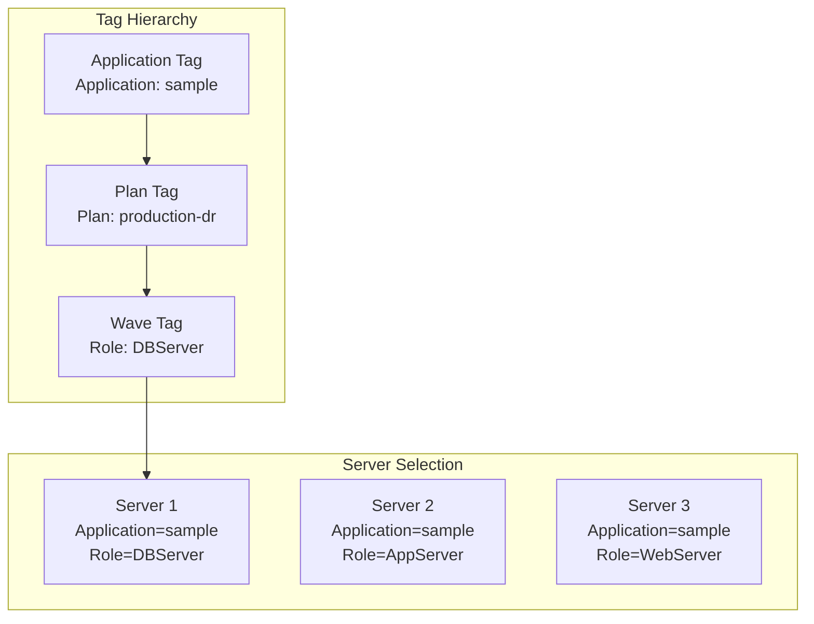
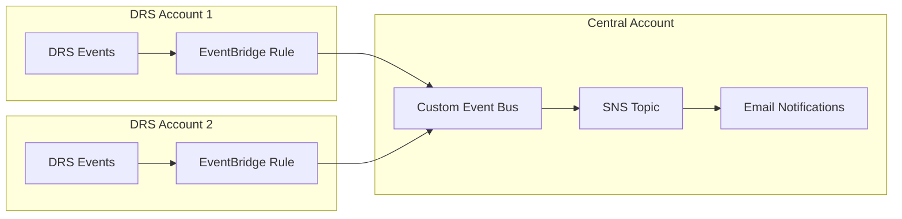
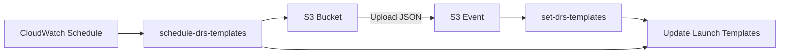

# DRS Tools Learnings for Enterprise Orchestration

**Version**: 1.0  
**Date**: January 8, 2026  
**Source**: AWS DRS Tools Repository (5 Solutions)  
**Purpose**: Patterns and features to enhance the Enterprise DR Orchestration Platform

---

## Executive Summary

Analysis of the AWS DRS Tools repository reveals production-ready patterns for disaster recovery orchestration, configuration management, and observability. While DRS-specific, many patterns are technology-agnostic and applicable to any orchestration scenario.

### Key Findings

| Category | DRS Tool | Pattern | Applicability | Priority |
|----------|----------|---------|---------------|----------|
| **Orchestration** | DRS Plan Automation | PreWave/PostWave SSM Actions | High | P1 |
| **Orchestration** | DRS Plan Automation | Tag-Based Server Selection | High | P1 |
| **Configuration** | Configuration Synchronizer | YAML-Based Config with Tag Overrides | High | P1 |
| **Configuration** | Configuration Synchronizer | Automatic Subnet Assignment by IP | Medium | P2 |
| **Observability** | DRS Observability | Cross-Account CloudWatch Dashboards | High | P1 |
| **Observability** | DRS Observability | EventBridge Notifications | High | P1 |
| **Sync** | Tag Synchronizer | EC2 to DRS Tag Sync | Medium | P2 |
| **Sync** | Tag Synchronizer | Instance Type Preservation | Medium | P2 |
| **Templates** | Template Manager | S3-Triggered Batch Updates | Medium | P2 |
| **Templates** | Template Manager | Tag-Based Template Matching | Medium | P2 |

---

## 1. DRS Plan Automation - Wave Orchestration Patterns

### Overview

The DRS Plan Automation solution provides wave-based DR orchestration with React UI, Step Functions, and SSM automation. Very similar to our current solution but with additional features worth adopting.

### Pattern: PreWave/PostWave SSM Actions

Each wave can have sequenced automation actions before and after DRS recovery:

```json
{
  "Waves": [
    {
      "Name": "Database Wave",
      "KeyName": "Role",
      "KeyValue": "DBServer",
      "MaxWaitTime": 900,
      "UpdateTime": 30,
      "PreWaveActions": [
        {
          "Name": "Stop Application Connections",
          "Description": "Gracefully stop app connections before DB failover",
          "MaxWaitTime": 90,
          "UpdateTime": 30,
          "StartAutomationExecution": {
            "DocumentName": "StopApplicationConnections",
            "Parameters": {
              "TargetInstances": ["i-1234567890abcdef0"]
            }
          }
        }
      ],
      "PostWaveActions": [
        {
          "Name": "Validate Database Health",
          "Description": "Run health checks after DB recovery",
          "MaxWaitTime": 120,
          "UpdateTime": 30,
          "StartAutomationExecution": {
            "DocumentName": "ValidateDatabaseHealth",
            "Parameters": {
              "DatabaseEndpoint": ["db.example.com"]
            }
          }
        }
      ]
    }
  ]
}
```

### Recommendation for Enterprise Platform

Extend wave configuration to support PreWave and PostWave SSM automation:

```typescript
interface WaveConfig {
  waveId: string;
  name: string;
  keyName: string;
  keyValue: string;
  maxWaitTime: number;
  updateTime: number;
  preWaveActions: SSMAction[];
  postWaveActions: SSMAction[];
}

interface SSMAction {
  name: string;
  description: string;
  maxWaitTime: number;
  updateTime: number;
  startAutomationExecution: {
    documentName: string;
    parameters: Record<string, string[]>;
  };
}
```

### Pattern: Tag-Based Server Selection

DRS Plan Automation uses hierarchical tag matching:

1. **Application Level**: `Application: sample` - All servers for an application
2. **Plan Level**: `Plan: production-dr` - Servers for a specific plan
3. **Wave Level**: `Role: DBServer` - Servers for a specific wave



### Pattern: Execution Results Storage

DRS Plan Automation stores comprehensive execution results:

```json
{
  "AppId_PlanId": "uuid_uuid",
  "ExecutionId": "arn:aws:states:...",
  "duration": "20m 44s",
  "status": "completed",
  "Waves": [
    {
      "drs": {
        "job": {},
        "status": "completed"
      },
      "duration": "9m 50s",
      "PreWaveActions": [
        {
          "id": "uuid",
          "job": {
            "AutomationExecutionId": "uuid",
            "AutomationExecutionStatus": "Success",
            "duration": "0m 1s"
          },
          "status": "completed"
        }
      ],
      "PostWaveActions": [],
      "SourceServers": ["s-xxx", "s-yyy"]
    }
  ]
}
```

---

## 2. Configuration Synchronizer - YAML-Based Configuration

### Overview

The Configuration Synchronizer provides a flexible, configuration-based approach for synchronizing launch templates, launch configurations, and replication settings using YAML files with tag-based overrides.

### Pattern: Layered Configuration with Tag Overrides

Configuration is applied in layers:

1. **Global Defaults**: `defaults.yml`
2. **Account Defaults**: `defaults_for_account_{AccountId}.yml`
3. **Tag Overrides**: `override_for_tag__{TagKey}__{TagValue}.yml`

```yaml
# defaults.yml - Global defaults
copyPrivateIp: true
copyTags: true
launchDisposition: STARTED
licensing:
  osByol: true
targetInstanceTypeRightSizingMethod: BASIC

# override_for_tag__IPAssignment__dynamic.yml - Tag-based override
copyPrivateIp: false
```

### Recommendation for Enterprise Platform

Add YAML-based configuration management for recovery settings:

```python
def apply_configuration_layers(server_id: str, server_tags: dict) -> dict:
    """Apply configuration in layers: defaults → account → tag overrides."""
    config = {}
    
    # Layer 1: Global defaults
    config.update(load_yaml("defaults.yml"))
    
    # Layer 2: Account-specific defaults
    account_config = f"defaults_for_account_{account_id}.yml"
    if exists(account_config):
        config.update(load_yaml(account_config))
    
    # Layer 3: Tag-based overrides (applied in order)
    for tag_key, tag_value in server_tags.items():
        override_file = f"override_for_tag__{tag_key}__{tag_value}.yml"
        if exists(override_file):
            config.update(load_yaml(override_file))
    
    return config
```

### Pattern: Automatic Subnet Assignment by IP Address

The Configuration Synchronizer automatically assigns target subnets based on source server IP addresses:

```python
def find_matching_subnet(source_ip: str, available_subnets: list) -> str:
    """Find subnet where source IP falls within CIDR block."""
    for subnet in available_subnets:
        # Check if subnet is tagged for DR target
        if not is_dr_target_subnet(subnet):
            continue
        
        # Check if IP falls within subnet CIDR
        if ip_in_cidr(source_ip, subnet['CidrBlock']):
            # Verify IP is not AWS reserved
            if not is_reserved_ip(source_ip, subnet['CidrBlock']):
                return subnet['SubnetId']
    
    return None

def is_dr_target_subnet(subnet: dict) -> bool:
    """Check if subnet is tagged as DR target."""
    tags = {t['Key']: t['Value'] for t in subnet.get('Tags', [])}
    return tags.get('drstarget') == 'true'
```

### Pattern: Feature Exclusion Configuration

Allow selective disabling of synchronization features per server:

```csv
Name,ExcludeAll,ExcludeNetworkConfiguration
SERVERA,false,true
SERVERB,true,
*,false,true
```

### Recommendation for Enterprise Platform

Add configuration exclusion support:

```json
{
  "protection_group_id": "pg-123",
  "configuration_exclusions": {
    "exclude_all": false,
    "exclude_network_configuration": true,
    "exclude_tag_sync": false,
    "exclude_instance_type_sync": false
  }
}
```

---

## 3. DRS Observability - Monitoring Patterns

### Overview

The DRS Observability solution provides CloudWatch dashboards, EventBridge notifications, and CloudWatch Logs integration for comprehensive DR monitoring.

### Pattern: Per-Account and Cross-Account Dashboards

Deploy dashboards at two levels:

1. **Per-Account Dashboard**: Deployed in each DRS account for local monitoring
2. **Cross-Account Dashboard**: Consolidated view in central monitoring account

```yaml
# Per-account dashboard metrics
DRSMetrics:
  - LagDuration per Source Server
  - Backlog per Source Server
  - Replication Status

# Cross-account dashboard (consolidated)
CrossAccountDRSMetrics:
  - Account 1: LagDuration, Backlog
  - Account 2: LagDuration, Backlog
  - Account N: LagDuration, Backlog
```

### Pattern: EventBridge Notifications for DR Events

Centralized notification architecture:



### Recommendation for Enterprise Platform

Add EventBridge-based DR event notifications:

```yaml
# CloudFormation for per-account EventBridge rules
DRSFailedRecoveryRule:
  Type: AWS::Events::Rule
  Properties:
    Name: drs-failed-recovery-notification
    EventPattern:
      source:
        - aws.drs
      detail-type:
        - DRS Recovery Instance Launch Result
      detail:
        state:
          - LAUNCH_FAILED
    Targets:
      - Id: CentralEventBus
        Arn: !Sub "arn:aws:events:${AWS::Region}:${CentralAccountId}:event-bus/${DrsEventBusName}"
        RoleArn: !GetAtt EventBridgeRole.Arn

DRSStalledAgentRule:
  Type: AWS::Events::Rule
  Properties:
    Name: drs-stalled-agent-notification
    EventPattern:
      source:
        - aws.drs
      detail-type:
        - DRS Source Server Data Replication Stalled Change
      detail:
        state:
          - STALLED
    Targets:
      - Id: CentralEventBus
        Arn: !Sub "arn:aws:events:${AWS::Region}:${CentralAccountId}:event-bus/${DrsEventBusName}"
```

### Pattern: CloudWatch Logs for DRS Agent

Stream DRS agent logs to CloudWatch for troubleshooting:

```json
{
  "logs": {
    "logs_collected": {
      "files": {
        "collect_list": [
          {
            "file_path": "/var/log/aws-replication-agent/agent.log",
            "log_group_name": "drs-replication-agent",
            "log_stream_name": "{instance_id}",
            "timezone": "UTC"
          }
        ]
      }
    }
  }
}
```

### Pattern: CloudWatch Metric Filters

Create metrics from DRS agent logs:

```yaml
DrsReplicationAgentErrorsFilter:
  Type: AWS::Logs::MetricFilter
  Properties:
    LogGroupName: drs-replication-agent
    FilterPattern: "ERROR"
    MetricTransformations:
      - MetricName: DrsReplicationAgentErrors
        MetricNamespace: DRS/AgentMetrics
        MetricValue: "1"

DrsReplicationAgentWarningsFilter:
  Type: AWS::Logs::MetricFilter
  Properties:
    LogGroupName: drs-replication-agent
    FilterPattern: "WARNING"
    MetricTransformations:
      - MetricName: DrsReplicationAgentWarnings
        MetricNamespace: DRS/AgentMetrics
        MetricValue: "1"
```

---

## 4. Tag Synchronizer - EC2 to DRS Tag Sync

### Overview

The Tag Synchronizer replicates EC2 instance tags to DRS source servers and updates launch templates with correct instance types.

### Pattern: Cross-Account Tag Synchronization

```python
def sync_ec2_tags_to_drs(source_regions: list, drs_account: str, drs_region: str):
    """Synchronize EC2 tags to DRS source servers."""
    # Assume role in DRS account
    drs_creds = assume_role(drs_account, DRS_ASSUME_ROLE_NAME)
    drs_client = get_drs_client(drs_creds, drs_region)
    
    # Get all DRS source servers
    source_servers = drs_client.describe_source_servers()
    
    for server in source_servers:
        # Extract EC2 instance ID from source server
        ec2_instance_id = get_ec2_instance_id(server)
        source_region = get_source_region(server)
        
        # Get EC2 instance tags from source account/region
        ec2_client = get_ec2_client(source_region)
        ec2_tags = ec2_client.describe_tags(
            Filters=[{'Name': 'resource-id', 'Values': [ec2_instance_id]}]
        )
        
        # Apply tags to DRS source server
        drs_client.tag_resource(
            resourceArn=server['arn'],
            tags=convert_tags(ec2_tags)
        )
        
        # Add source tracking tags
        drs_client.tag_resource(
            resourceArn=server['arn'],
            tags={
                'source:account': source_account,
                'source:region': source_region,
                'source:instance-id': ec2_instance_id,
                'source:instance-type': ec2_instance_type
            }
        )
```

### Pattern: Instance Type Preservation

Ensure recovery instances use the same instance type as source:

```python
def sync_instance_type(server: dict, ec2_instance_type: str):
    """Update launch template with source instance type."""
    launch_template_id = get_launch_template_id(server)
    
    # Create new launch template version with correct instance type
    ec2_client.create_launch_template_version(
        LaunchTemplateId=launch_template_id,
        LaunchTemplateData={
            'InstanceType': ec2_instance_type
        },
        SourceVersion='$Latest'
    )
    
    # Disable right-sizing to preserve instance type
    drs_client.update_launch_configuration(
        sourceServerID=server['sourceServerID'],
        targetInstanceTypeRightSizingMethod='NONE'
    )
```

### Recommendation for Enterprise Platform

Add automatic tag synchronization as a scheduled task:

```yaml
# EventBridge rule for scheduled tag sync
TagSyncScheduleRule:
  Type: AWS::Events::Rule
  Properties:
    Name: drs-tag-sync-schedule
    ScheduleExpression: "rate(1 hour)"
    Targets:
      - Id: TagSyncLambda
        Arn: !GetAtt TagSyncLambda.Arn
        Input: |
          {
            "synch_tags": true,
            "synch_instance_type": true
          }
```

---

## 5. Template Manager - Batch Launch Template Updates

### Overview

The Template Manager enables batch updates to DRS launch templates using S3-stored JSON templates with tag-based matching.

### Pattern: S3-Triggered Template Updates



### Pattern: Tag-Based Template Matching

Templates are matched to servers by tag prefix in filename:

```
templates/
├── Role__DBServer.json      # Applied to servers with Role=DBServer
├── Role__AppServer.json     # Applied to servers with Role=AppServer
├── Role__WebServer.json     # Applied to servers with Role=WebServer
└── Environment__Prod.json   # Applied to servers with Environment=Prod
```

### Recommendation for Enterprise Platform

Add template library for standardized launch configurations:

```json
{
  "template_library": [
    {
      "template_id": "tpl-database-standard",
      "name": "Database Server Standard",
      "match_tags": {"Role": "DBServer"},
      "launch_template_data": {
        "InstanceType": "r5.xlarge",
        "Monitoring": {"Enabled": true},
        "MetadataOptions": {
          "HttpTokens": "required",
          "HttpEndpoint": "enabled"
        }
      }
    }
  ]
}
```

---

## 6. Technology-Agnostic Patterns Summary

The following patterns from DRS Tools are applicable to any orchestration scenario:

### Configuration Management Patterns

| Pattern | Description | Applicability |
|---------|-------------|---------------|
| **Layered YAML Config** | Defaults → Account → Tag overrides | Any multi-tenant system |
| **Feature Exclusions** | CSV-based feature toggle per resource | Any configurable system |
| **Automatic Assignment** | IP-based subnet/resource matching | Network-aware deployments |

### Orchestration Patterns

| Pattern | Description | Applicability |
|---------|-------------|---------------|
| **PreWave/PostWave Actions** | SSM automation before/after each wave | Any wave-based workflow |
| **Tag-Based Selection** | Hierarchical tag matching for resources | Any tag-organized system |
| **Execution Results Storage** | Comprehensive result tracking per wave | Any multi-step workflow |

### Observability Patterns

| Pattern | Description | Applicability |
|---------|-------------|---------------|
| **Per-Account Dashboards** | Local monitoring in each account | Multi-account deployments |
| **Cross-Account Dashboards** | Consolidated central view | Enterprise monitoring |
| **EventBridge Notifications** | Event-driven alerting | Any AWS service events |
| **Log Metric Filters** | Metrics from log patterns | Any log-generating service |

### Synchronization Patterns

| Pattern | Description | Applicability |
|---------|-------------|---------------|
| **Cross-Account Tag Sync** | Replicate tags between accounts | Multi-account tag management |
| **Source Tracking Tags** | Add origin metadata tags | Any cross-account resources |
| **Scheduled Sync Jobs** | Periodic synchronization | Any drift-prone configuration |

---

## Implementation Roadmap

### Phase 1: Observability (2-3 weeks)
- [ ] Deploy per-account CloudWatch dashboards
- [ ] Configure cross-account dashboard in central account
- [ ] Set up EventBridge notifications for DR events
- [ ] Create CloudWatch metric filters for agent logs

### Phase 2: Configuration Management (3-4 weeks)
- [ ] Implement YAML-based configuration with tag overrides
- [ ] Add feature exclusion support per protection group
- [ ] Create automatic subnet assignment by IP address
- [ ] Build configuration drift detection

### Phase 3: Wave Automation (4-6 weeks)
- [ ] Add PreWave/PostWave SSM action support
- [ ] Implement SSM automation document library
- [ ] Create wave action result tracking
- [ ] Build action timeout and retry handling

### Phase 4: Synchronization (2-3 weeks)
- [ ] Implement EC2 to DRS tag synchronization
- [ ] Add instance type preservation
- [ ] Create scheduled sync jobs
- [ ] Build sync status reporting

---

## Comparison: DRS Plan Automation vs Our Solution

| Feature | DRS Plan Automation | Our Solution | Gap |
|---------|---------------------|--------------|-----|
| Wave-based recovery | ✅ | ✅ | None |
| Tag-based server selection | ✅ | ✅ | None |
| Step Functions orchestration | ✅ | ✅ | None |
| Pause/Resume | ❌ | ✅ | We're ahead |
| PreWave/PostWave SSM | ✅ | ❌ | Add this |
| React UI | ✅ (Material UI) | ✅ (CloudScape) | We're ahead |
| Cognito auth | ✅ | ✅ | None |
| WAF protection | ✅ | ❌ | Consider adding |
| Multi-account support | ✅ | ✅ | None |
| Execution history | ✅ | ✅ | None |
| SNS notifications | ✅ | ❌ | Add this |
| CodePipeline CI/CD | ✅ | ✅ (GitHub Actions) | Different approach |

---

## Summary

The DRS Tools repository provides battle-tested patterns that can enhance our enterprise DR orchestration platform:

1. **PreWave/PostWave SSM Actions** enable automation before and after each wave
2. **YAML-based configuration with tag overrides** provides flexible, maintainable settings
3. **Cross-account CloudWatch dashboards** improve enterprise observability
4. **EventBridge notifications** enable proactive alerting for DR events
5. **Automatic subnet assignment** simplifies network configuration for on-premises migrations
6. **Tag synchronization** maintains consistency between source and DR environments

These patterns are technology-agnostic and applicable beyond DRS to any orchestration scenario requiring wave-based execution, configuration management, and observability.
