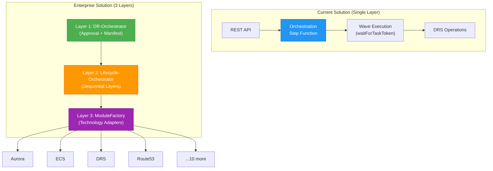
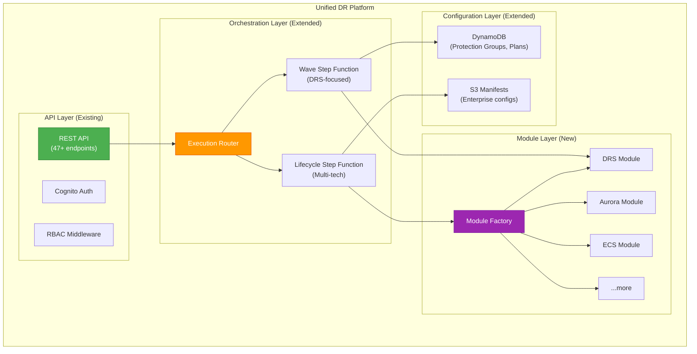

# Enterprise DR Platform Integration Plan

[← Back to Index](./README.md) | [← Previous: DRS Tools Learnings](./09-drs-tools-learnings.md)

---

This document provides a comprehensive analysis of the current AWS DRS Orchestration codebase alignment with the enterprise dr-orchestration-artifacts solution, along with a detailed integration roadmap.

---

## Table of Contents

- [Executive Summary](#executive-summary)
- [Architecture Comparison](#architecture-comparison)
- [Gap Analysis](#gap-analysis)
- [Integration Strategy](#integration-strategy)
- [Implementation Phases](#implementation-phases)
- [Risk Assessment](#risk-assessment)

---

## Executive Summary

### Current State

The AWS DRS Orchestration solution is a **production-ready, DRS-focused** disaster recovery platform with:

- ✅ Wave-based orchestration with pause/resume (`waitForTaskToken`)
- ✅ 47+ REST API endpoints with RBAC (5 roles, 308 tests)
- ✅ React/CloudScape frontend with real-time monitoring
- ✅ Cross-account support via STS role assumption
- ✅ Tag-based dynamic server discovery
- ✅ Hierarchical launch configuration (PG + server overrides)

### Target State

The enterprise dr-orchestration-artifacts solution provides **multi-technology DR orchestration** with:

- 🎯 4-phase DR lifecycle (Instantiate → Activate → Cleanup → Replicate)
- 🎯 3-layer Step Functions architecture (DR-Orchestrator → Lifecycle → ModuleFactory)
- 🎯 13 pluggable technology modules (DRS, Aurora, ECS, Route53, etc.)
- 🎯 Manifest-driven configuration from S3
- 🎯 SNS approval workflow between phases

### Recommendation

**Hybrid Integration Approach**: Extend the current solution to adopt enterprise patterns incrementally without breaking existing DRS-focused functionality. The current wave-based model maps naturally to the ACTIVATE phase.

---

## Architecture Comparison

### Step Functions Architecture



### Feature Comparison Matrix

| Feature | Current Solution | Enterprise Solution | Gap |
|---------|------------------|---------------------|-----|
| **Orchestration Model** | Wave-based (unlimited) | 4-phase lifecycle | Different paradigm |
| **Step Functions Layers** | 1 layer | 3 layers | Need 2 more layers |
| **Technology Support** | DRS only | 13 technologies | Need module factory |
| **Configuration** | API-driven (CRUD) | Manifest-driven (S3) | Need manifest support |
| **Approval Workflow** | Manual pause/resume | SNS approval gates | Need SNS integration |
| **Server Discovery** | Tag-based + explicit | Manifest-defined | Compatible |
| **Cross-Account** | STS role assumption | STS role assumption | ✅ Aligned |
| **Authentication** | Cognito JWT + RBAC | IAM-based | Current is more advanced |
| **Frontend** | React/CloudScape | None (CLI/API only) | Current is more advanced |
| **API Coverage** | 47+ endpoints | CLI/Step Functions | Current is more advanced |
| **Testing** | 308 automated tests | Unknown | Current is more advanced |

---

## Gap Analysis

### What Current Solution Has (Strengths)

| Capability | Implementation | Enterprise Value |
|------------|----------------|------------------|
| **Wave Orchestration** | Step Functions with `waitForTaskToken` | Maps to ACTIVATE phase |
| **REST API** | 47+ endpoints, Cognito auth, RBAC | Superior to enterprise CLI-only |
| **Frontend** | React 19 + CloudScape | Enterprise has no UI |
| **Tag Discovery** | Dynamic server resolution | Compatible with manifests |
| **Launch Config** | Hierarchical (PG + server) | More flexible than enterprise |
| **Cross-Account** | STS role assumption | Same pattern as enterprise |
| **RBAC** | 5 granular roles | Enterprise lacks RBAC |
| **Testing** | 308 automated tests | Enterprise testing unknown |

### What Current Solution Lacks (Gaps)

| Gap | Enterprise Pattern | Priority | Effort |
|-----|-------------------|----------|--------|
| **4-Phase Lifecycle** | INSTANTIATE/ACTIVATE/CLEANUP/REPLICATE | High | 3-4 weeks |
| **Layered Step Functions** | 3-layer architecture | High | 2-3 weeks |
| **Module Factory** | Pluggable technology adapters | High | 4-6 weeks |
| **Manifest Configuration** | S3-based JSON manifests | Medium | 2-3 weeks |
| **Multi-Technology** | 12 additional modules | Medium | 6-8 weeks |
| **SNS Approval** | Approval gates between phases | Low | 1-2 weeks |
| **Troubleshooting Dashboard** | CloudWatch aggregation | Low | 1 week |

### Module Coverage Gap

| Module | Enterprise | Current | Gap |
|--------|:----------:|:-------:|:---:|
| **DRS** | ✅ | ✅ | None |
| **AuroraMySQL** | ✅ | ❌ | Need adapter |
| **EcsService** | ✅ | ❌ | Need adapter |
| **AutoScaling** | ✅ | ❌ | Need adapter |
| **R53Record** | ✅ | ❌ | Need adapter |
| **EventBridge** | ✅ | ❌ | Need adapter |
| **LambdaFunction** | ✅ | ❌ | Need adapter |
| **EventArchive** | ✅ | ❌ | Need adapter |
| **ElastiCache** | ✅ | ❌ | Need adapter |
| **MemoryDB** | ✅ | ❌ | Need adapter |
| **OpenSearchService** | ✅ | ❌ | Need adapter |
| **SQLServer** | ✅ | ❌ | Need adapter |
| **EC2** | ✅ | ❌ | Need adapter |

---

## Integration Strategy

### Option A: Full Enterprise Migration (Not Recommended)

Replace current solution with enterprise architecture.

**Pros**: Complete feature parity
**Cons**: Lose REST API, frontend, RBAC, testing infrastructure
**Risk**: High - breaks existing deployments
**Effort**: 16-20 weeks

### Option B: Hybrid Integration (Recommended)

Extend current solution to support enterprise patterns while preserving existing capabilities.

**Pros**: 
- Preserve REST API, frontend, RBAC
- Incremental adoption
- Backward compatible
- Best of both worlds

**Cons**: 
- More complex architecture
- Dual configuration modes

**Risk**: Medium
**Effort**: 12-16 weeks

### Option C: Parallel Systems (Alternative)

Run both systems independently, integrate at API level.

**Pros**: No changes to either system
**Cons**: Operational complexity, data sync issues
**Risk**: Medium
**Effort**: 8-10 weeks

### Recommended Approach: Option B (Hybrid Integration)



---

## Implementation Phases

### Phase 1: Module Factory Foundation (Weeks 1-4)

**Goal**: Create pluggable module architecture without breaking existing functionality.

#### 1.1 Module Interface (Week 1)

Create base module interface matching enterprise pattern:

```python
# lambda/shared/module_interface.py
from abc import ABC, abstractmethod
from typing import Dict, Any

class DRModule(ABC):
    """Base interface for all DR technology modules."""
    
    @abstractmethod
    def instantiate(self, parameters: Dict[str, Any]) -> Dict[str, Any]:
        """Prewarm resources in secondary region."""
        pass
    
    @abstractmethod
    def instantiate_status_check(self, parameters: Dict[str, Any]) -> bool:
        """Check if instantiate operation completed."""
        pass
    
    @abstractmethod
    def activate(self, parameters: Dict[str, Any]) -> Dict[str, Any]:
        """Activate secondary region as primary."""
        pass
    
    @abstractmethod
    def activate_status_check(self, parameters: Dict[str, Any]) -> bool:
        """Check if activate operation completed."""
        pass
    
    @abstractmethod
    def cleanup(self, parameters: Dict[str, Any]) -> Dict[str, Any]:
        """Clean up resources in old primary region."""
        pass
    
    @abstractmethod
    def cleanup_status_check(self, parameters: Dict[str, Any]) -> bool:
        """Check if cleanup operation completed."""
        pass
    
    @abstractmethod
    def replicate(self, parameters: Dict[str, Any]) -> Dict[str, Any]:
        """Re-establish replication to old primary."""
        pass
    
    @abstractmethod
    def replicate_status_check(self, parameters: Dict[str, Any]) -> bool:
        """Check if replicate operation completed."""
        pass
```

#### 1.2 DRS Module Adapter (Week 2)

Wrap existing DRS logic in module interface:

```python
# lambda/modules/drs_module.py
from module_interface import DRModule

class DRSModule(DRModule):
    """DRS technology module - wraps existing orchestration logic."""
    
    def __init__(self, region: str, account_context: Dict = None):
        self.region = region
        self.account_context = account_context
        self.drs_client = self._create_drs_client()
    
    def activate(self, parameters: Dict[str, Any]) -> Dict[str, Any]:
        """Start DRS recovery - maps to existing wave execution."""
        host_names = parameters.get("HostNames", [])
        tags = parameters.get("Tags", {})
        
        # Reuse existing DRS recovery logic
        source_servers = self._lookup_source_servers(host_names)
        job_ids = []
        
        for server in source_servers:
            response = self.drs_client.start_recovery(
                sourceServers=[{"sourceServerID": server["sourceServerID"]}],
                tags=tags
            )
            job_ids.append(response["job"]["jobID"])
        
        return {"jobIds": job_ids, "status": "STARTED"}
    
    def activate_status_check(self, parameters: Dict[str, Any]) -> bool:
        """Check if DRS recovery jobs completed."""
        job_ids = parameters.get("jobIds", [])
        
        for job_id in job_ids:
            response = self.drs_client.describe_jobs(
                filters={"jobIDs": [job_id]}
            )
            if response["items"][0]["status"] != "COMPLETED":
                return False
        
        return True
    
    # ... implement other lifecycle methods
```

#### 1.3 Module Factory (Week 3)

```python
# lambda/shared/module_factory.py
from enum import Enum
from typing import Dict, Any

class ServiceModule(Enum):
    DRS = "DRS"
    AuroraMySQL = "AuroraMySQL"
    EcsService = "EcsService"
    # ... add more as implemented

class ModuleFactory:
    """Factory for creating technology module instances."""
    
    _registry: Dict[ServiceModule, type] = {}
    
    @classmethod
    def register(cls, module_type: ServiceModule, module_class: type):
        """Register a module implementation."""
        cls._registry[module_type] = module_class
    
    @classmethod
    def create(cls, module_type: ServiceModule, config: Dict[str, Any]):
        """Create module instance."""
        if module_type not in cls._registry:
            raise ValueError(f"Unknown module type: {module_type}")
        
        return cls._registry[module_type](**config)

# Register DRS module
ModuleFactory.register(ServiceModule.DRS, DRSModule)
```

#### 1.4 Module Factory Lambda (Week 4)

```python
# lambda/module-factory/index.py
from module_factory import ModuleFactory, ServiceModule

def lambda_handler(event, context):
    """Module factory Lambda - executes lifecycle operations."""
    
    state_payload = event.get("StatePayload", {})
    lifecycle_phase = event.get("LifeCyclePhase", "activate")
    status_check = event.get("status", {}).get("status_check", False)
    
    # Get module type and parameters
    action = state_payload.get("action")
    parameters = state_payload.get("parameters", {})
    account_id = state_payload.get("AccountId")
    
    # Create module instance
    module_type = ServiceModule[action]
    module = ModuleFactory.create(module_type, {
        "region": os.environ["AWS_REGION"],
        "account_context": {"accountId": account_id}
    })
    
    # Execute lifecycle method
    method_name = f"{lifecycle_phase}_status_check" if status_check else lifecycle_phase
    method = getattr(module, method_name)
    
    return method(parameters)
```

**Deliverables**:
- [ ] Module interface definition
- [ ] DRS module adapter
- [ ] Module factory with registration
- [ ] Module factory Lambda function
- [ ] Unit tests for module factory

---

### Phase 2: Lifecycle Orchestration (Weeks 5-8)

**Goal**: Add 4-phase lifecycle support alongside existing wave execution.

#### 2.1 Lifecycle Step Function (Weeks 5-6)

Create new Step Function for lifecycle orchestration:

```yaml
# cfn/lifecycle-orchestrator-stack.yaml
Resources:
  LifecycleOrchestratorStateMachine:
    Type: AWS::StepFunctions::StateMachine
    Properties:
      StateMachineName: !Sub "${ProjectName}-lifecycle-orchestrator-${Environment}"
      DefinitionString:
        Fn::Sub: |
          {
            "StartAt": "ProcessLayers",
            "States": {
              "ProcessLayers": {
                "Type": "Map",
                "ItemsPath": "$.manifest.layers",
                "MaxConcurrency": 1,
                "Iterator": {
                  "StartAt": "ProcessResources",
                  "States": {
                    "ProcessResources": {
                      "Type": "Map",
                      "ItemsPath": "$.resources",
                      "Iterator": {
                        "StartAt": "InvokeModule",
                        "States": {
                          "InvokeModule": {
                            "Type": "Task",
                            "Resource": "arn:aws:states:::lambda:invoke.waitForTaskToken",
                            "Parameters": {
                              "FunctionName": "${ModuleFactoryFunction}",
                              "Payload": {
                                "taskToken.$": "$$.Task.Token",
                                "StatePayload.$": "$",
                                "LifeCyclePhase.$": "$.lifecyclePhase"
                              }
                            },
                            "End": true
                          }
                        }
                      },
                      "End": true
                    }
                  }
                },
                "Next": "Complete"
              },
              "Complete": {
                "Type": "Succeed"
              }
            }
          }
```

#### 2.2 Execution Router (Weeks 7-8)

Add routing logic to determine execution path:

```python
# lambda/api-handler/execution_router.py
def route_execution(recovery_plan: Dict, execution_type: str) -> str:
    """
    Route execution to appropriate Step Function.
    
    Returns:
        "wave" - Use existing wave-based Step Function (DRS-only)
        "lifecycle" - Use new lifecycle Step Function (multi-tech)
    """
    
    # Check if plan uses manifest configuration
    if recovery_plan.get("manifestPath"):
        return "lifecycle"
    
    # Check if plan has non-DRS resources
    resources = recovery_plan.get("resources", [])
    for resource in resources:
        if resource.get("type") != "DRS":
            return "lifecycle"
    
    # Default to wave-based for DRS-only plans
    return "wave"
```

**Deliverables**:
- [ ] Lifecycle orchestrator Step Function
- [ ] Execution router logic
- [ ] API endpoint updates for lifecycle execution
- [ ] Integration tests

---

### Phase 3: Manifest Support (Weeks 9-11)

**Goal**: Add S3 manifest configuration alongside API-driven configuration.

#### 3.1 Manifest Schema (Week 9)

```json
{
  "$schema": "http://json-schema.org/draft-07/schema#",
  "type": "array",
  "items": {
    "type": "object",
    "properties": {
      "layer": {"type": "integer", "minimum": 1},
      "resources": {
        "type": "array",
        "items": {
          "type": "object",
          "properties": {
            "action": {"type": "string", "enum": ["DRS", "AuroraMySQL", "EcsService", "R53Record", "EventBridge", "LambdaFunction", "AutoScaling", "ElastiCache", "MemoryDB", "OpenSearchService", "SQLServer", "EC2", "EventArchive"]},
            "resourceName": {"type": "string"},
            "AccountId": {"type": "string", "pattern": "^[0-9]{12}$"},
            "parameters": {"type": "object"}
          },
          "required": ["action", "resourceName", "AccountId", "parameters"]
        }
      }
    },
    "required": ["layer", "resources"]
  }
}
```

#### 3.2 Manifest Parser (Week 10)

```python
# lambda/shared/manifest_parser.py
import json
import boto3
from jsonschema import validate

class ManifestParser:
    """Parse and validate DR manifests from S3."""
    
    def __init__(self, bucket: str):
        self.s3_client = boto3.client("s3")
        self.bucket = bucket
    
    def load_manifest(self, key: str) -> Dict:
        """Load manifest from S3."""
        response = self.s3_client.get_object(Bucket=self.bucket, Key=key)
        manifest = json.loads(response["Body"].read().decode("utf-8"))
        
        # Validate against schema
        validate(instance=manifest, schema=MANIFEST_SCHEMA)
        
        return manifest
    
    def resolve_parameters(self, manifest: Dict, ssm_client, cfn_client) -> Dict:
        """Resolve SSM and CloudFormation references in parameters."""
        resolved = []
        
        for layer in manifest:
            resolved_layer = {"layer": layer["layer"], "resources": []}
            
            for resource in layer["resources"]:
                resolved_params = self._resolve_refs(
                    resource["parameters"], ssm_client, cfn_client
                )
                resolved_layer["resources"].append({
                    **resource,
                    "parameters": resolved_params
                })
            
            resolved.append(resolved_layer)
        
        return resolved
```

#### 3.3 API Extensions (Week 11)

Add manifest-related API endpoints:

```python
# New endpoints in api-handler
POST /api/v1/manifests                    # Upload manifest to S3
GET  /api/v1/manifests                    # List manifests
GET  /api/v1/manifests/{manifestId}       # Get manifest details
POST /api/v1/manifests/{manifestId}/validate  # Validate manifest
DELETE /api/v1/manifests/{manifestId}     # Delete manifest

# Extended execution endpoint
POST /api/v1/executions
{
  "recoveryPlanId": "plan-123",           # Existing: API-driven
  "manifestPath": "manifests/app/activate.json",  # New: Manifest-driven
  "lifecyclePhase": "activate",           # New: Lifecycle phase
  "executionType": "RECOVERY"
}
```

**Deliverables**:
- [ ] Manifest JSON schema
- [ ] Manifest parser with validation
- [ ] Parameter resolution (SSM, CloudFormation)
- [ ] Manifest API endpoints
- [ ] S3 bucket for manifests
- [ ] Frontend manifest management UI

---

### Phase 4: Additional Modules (Weeks 12-16)

**Goal**: Implement high-priority technology modules.

#### Priority 1: Database Modules (Weeks 12-13)

```python
# lambda/modules/aurora_module.py
class AuroraMySQLModule(DRModule):
    """Aurora MySQL Global Database module."""
    
    def instantiate(self, parameters: Dict) -> Dict:
        """Create reader instances in secondary region."""
        cluster_id = parameters["DBClusterIdentifier"]
        instance_ids = parameters["DBInstanceIdentifier"]
        
        for instance_id in instance_ids:
            self.rds_client.create_db_instance(
                DBInstanceIdentifier=instance_id,
                DBClusterIdentifier=cluster_id,
                DBInstanceClass=parameters.get("DBInstanceClass", "db.r5.large"),
                Engine="aurora-mysql"
            )
        
        return {"status": "CREATING", "instanceIds": instance_ids}
    
    def activate(self, parameters: Dict) -> Dict:
        """Failover Aurora cluster to secondary."""
        global_cluster_id = parameters["GlobalClusterIdentifier"]
        cluster_id = parameters["DBClusterIdentifier"]
        
        self.rds_client.failover_global_cluster(
            GlobalClusterIdentifier=global_cluster_id,
            TargetDbClusterIdentifier=cluster_id
        )
        
        return {"status": "FAILING_OVER"}
```

#### Priority 2: Application Modules (Weeks 14-15)

```python
# lambda/modules/ecs_module.py
class EcsServiceModule(DRModule):
    """ECS Service scaling module."""
    
    def instantiate(self, parameters: Dict) -> Dict:
        """Scale up ECS services."""
        results = []
        
        for service_config in parameters:
            self.ecs_client.update_service(
                cluster=service_config["EcsClusterName"],
                service=service_config["EcsServiceName"],
                desiredCount=service_config["EcsDesiredSize"]
            )
            results.append({
                "cluster": service_config["EcsClusterName"],
                "service": service_config["EcsServiceName"],
                "desiredCount": service_config["EcsDesiredSize"]
            })
        
        return {"status": "SCALING", "services": results}
    
    def cleanup(self, parameters: Dict) -> Dict:
        """Scale down ECS services to 0."""
        for service_config in parameters:
            self.ecs_client.update_service(
                cluster=service_config["EcsClusterName"],
                service=service_config["EcsServiceName"],
                desiredCount=0
            )
        
        return {"status": "SCALING_DOWN"}
```

#### Priority 3: Infrastructure Modules (Week 16)

```python
# lambda/modules/route53_module.py
class R53RecordModule(DRModule):
    """Route 53 DNS record module."""
    
    def activate(self, parameters: Dict) -> Dict:
        """Update DNS records for failover."""
        changes = []
        
        for record in parameters:
            change = {
                "Action": "UPSERT",
                "ResourceRecordSet": {
                    "Name": record["R53RecordName"],
                    "Type": record["RecordType"],
                    "TTL": 60
                }
            }
            
            if record.get("Alias") == "Yes":
                # Handle alias records
                change["ResourceRecordSet"]["AliasTarget"] = self._get_alias_target(
                    record["RecordValue"]
                )
            else:
                change["ResourceRecordSet"]["ResourceRecords"] = [
                    {"Value": record["RecordValue"]}
                ]
            
            changes.append(change)
        
        self.route53_client.change_resource_record_sets(
            HostedZoneId=parameters[0]["HostedZoneId"],
            ChangeBatch={"Changes": changes}
        )
        
        return {"status": "UPDATING", "recordCount": len(changes)}
```

**Deliverables**:
- [ ] AuroraMySQL module
- [ ] EcsService module
- [ ] AutoScaling module
- [ ] R53Record module
- [ ] EventBridge module
- [ ] LambdaFunction module
- [ ] Unit tests for each module
- [ ] Integration tests

---

## Risk Assessment

### Technical Risks

| Risk | Impact | Probability | Mitigation |
|------|--------|-------------|------------|
| Breaking existing DRS functionality | High | Low | Feature flags, backward compatibility |
| Step Functions complexity | Medium | Medium | Incremental rollout, extensive testing |
| Cross-account permission issues | Medium | Medium | Reuse existing STS patterns |
| Module interface incompatibility | Medium | Low | Follow enterprise interface exactly |

### Operational Risks

| Risk | Impact | Probability | Mitigation |
|------|--------|-------------|------------|
| Deployment downtime | High | Low | Blue-green deployment |
| Configuration migration | Medium | Medium | Dual-mode support (API + manifest) |
| Learning curve for operators | Medium | High | Documentation, training |

### Schedule Risks

| Risk | Impact | Probability | Mitigation |
|------|--------|-------------|------------|
| Scope creep | High | Medium | Strict phase boundaries |
| Resource availability | Medium | Medium | Parallel workstreams |
| Integration complexity | Medium | Medium | Early integration testing |

---

## Success Criteria

### Phase 1 (Module Factory)
- [ ] DRS module passes all existing tests
- [ ] Module factory creates modules correctly
- [ ] No regression in existing functionality

### Phase 2 (Lifecycle Orchestration)
- [ ] Lifecycle Step Function executes successfully
- [ ] Execution router correctly routes requests
- [ ] Both wave and lifecycle modes work

### Phase 3 (Manifest Support)
- [ ] Manifests load and validate from S3
- [ ] Parameter resolution works (SSM, CFN)
- [ ] API endpoints functional

### Phase 4 (Additional Modules)
- [ ] All priority modules implemented
- [ ] Cross-account operations work
- [ ] End-to-end lifecycle execution succeeds

---

## Timeline Summary

| Phase | Duration | Start | End |
|-------|----------|-------|-----|
| Phase 1: Module Factory | 4 weeks | Week 1 | Week 4 |
| Phase 2: Lifecycle Orchestration | 4 weeks | Week 5 | Week 8 |
| Phase 3: Manifest Support | 3 weeks | Week 9 | Week 11 |
| Phase 4: Additional Modules | 5 weeks | Week 12 | Week 16 |
| **Total** | **16 weeks** | | |

---

## Next Steps

1. **Review and approve** this integration plan
2. **Prioritize modules** based on business requirements
3. **Allocate resources** for Phase 1 development
4. **Set up feature branch** for integration work
5. **Create detailed task breakdown** for Phase 1

---

[← Back to Index](./README.md) | [← Previous: DRS Tools Learnings](./09-drs-tools-learnings.md)
