# Enterprise DR Orchestration Platform - Product Requirements Document

**Version**: 1.5  
**Date**: January 7, 2026  
**Author**: Technical Architecture Team  
**Status**: Draft  

---

## Table of Contents

| # | Document | Description |
|---|----------|-------------|
| 1 | [Executive Summary](#executive-summary) | Product vision, stakeholders, key features |
| 2 | [Reference Implementation Code](./01-reference-implementation.md) | GitHub links to production code patterns |
| 3 | [Advanced DR Orchestration Patterns](./02-dr-orchestration-patterns.md) | 4-phase lifecycle, module factory, manifests |
| 4 | [API Integration Patterns](./03-api-integration.md) | REST API, CLI, SSM, EventBridge, CI/CD |
| 5 | [Technology Adapters](./04-technology-adapters.md) | DRS, Database, Application, Infrastructure adapters |
| 6 | [IAM Roles & Security](./05-iam-security.md) | IAM roles, LZA integration, RBAC |
| 7 | [Architecture & Data Flow](./06-architecture.md) | Core components, state management, diagrams |
| 8 | [Implementation Guide](./07-implementation.md) | Phases, success criteria, risks |

---

## Quick Navigation

### By Use Case

| I want to... | Go to |
|--------------|-------|
| Understand the product vision | [Executive Summary](#executive-summary) |
| Reference production code examples | [Reference Implementation](./01-reference-implementation.md) |
| Learn about DR lifecycle phases | [DR Orchestration Patterns](./02-dr-orchestration-patterns.md) |
| Integrate via API/CLI/SSM | [API Integration](./03-api-integration.md) |
| Build a technology adapter | [Technology Adapters](./04-technology-adapters.md) |
| Configure IAM roles for LZA | [IAM & Security](./05-iam-security.md) |
| Understand the architecture | [Architecture](./06-architecture.md) |
| Plan implementation phases | [Implementation Guide](./07-implementation.md) |

### By Role

| Role | Recommended Reading |
|------|---------------------|
| **Enterprise Architect** | Executive Summary → Architecture → DR Patterns |
| **Developer** | Reference Implementation → Technology Adapters → API Integration |
| **DevOps/SRE** | API Integration → IAM & Security → Implementation Guide |
| **Security Engineer** | IAM & Security → Architecture |
| **Project Manager** | Executive Summary → Implementation Guide |

---

## Revision History

| Version | Date | Changes |
|---------|------|---------|
| 1.5 | 2026-01-07 | Restructured into modular documents; Added Advanced DR Orchestration Patterns (4-phase lifecycle, module factory, manifests, approval workflows) |
| 1.4 | 2026-01-07 | Added Reference Implementation Code section with GitHub links |
| 1.3 | 2026-01-07 | Fixed API examples, corrected HTTP methods |
| 1.2 | 2026-01-07 | Added AWS LZA integration section |
| 1.1 | 2026-01-06 | Initial draft |

---

## Executive Summary

The Enterprise DR Orchestration Platform is a comprehensive disaster recovery orchestration solution that provides unified, wave-based orchestration across multiple DR technologies including AWS DRS, database failover/failback, application recovery, and infrastructure restoration. The platform leverages AWS Step Functions with pause/resume capabilities and tag-based wave orchestration to provide a "black box" API-driven solution that can be integrated into larger enterprise DR workflows.

### Product Vision

Create a technology-agnostic DR orchestration platform that:

- **Unifies Multiple DR Technologies**: Orchestrates AWS DRS, database failover, application recovery, and custom DR solutions
- **Provides API-First Integration**: Enables seamless integration into existing enterprise DR workflows
- **Leverages Proven Patterns**: Uses battle-tested Step Functions orchestration with pause/resume and tag-based wave management
- **Ensures Enterprise Scalability**: Supports complex multi-tier, multi-technology DR scenarios

### Key Stakeholders

| Role | Responsibility |
|------|----------------|
| **Enterprise DR Teams** | Primary users who orchestrate complex DR scenarios |
| **Application Teams** | Provide DR requirements and validate recovery procedures |
| **Database Teams** | Define database failover/failback procedures |
| **Infrastructure Teams** | Manage underlying DR infrastructure and dependencies |
| **Integration Partners** | Consume APIs for broader enterprise DR workflows |

### Core Capabilities

```mermaid
flowchart TB
    subgraph "🚀 Trigger Sources"
        CLI["💻 AWS CLI"]
        SSM["📋 SSM Documents"]
        EB["⚡ EventBridge Rules"]
        SF["🔄 Step Functions"]
        CICD["🔧 CI/CD Pipelines"]
    end
    
    subgraph "🌐 API Gateway Layer"
        REST["🔗 REST API"]
        AUTH["🔐 IAM/Cognito Auth"]
    end
    
    subgraph "⚙️ Orchestration Engine"
        MASTER["🎯 Master Step Functions"]
        ADAPTERS["🔌 Technology Adapters"]
    end
    
    subgraph "🔧 DR Technologies"
        DRS["AWS DRS"]
        DB["Database"]
        APP["Application"]
        INFRA["Infrastructure"]
    end
    
    CLI --> REST
    SSM --> REST
    EB --> REST
    SF --> REST
    CICD --> REST
    
    REST --> AUTH
    AUTH --> MASTER
    MASTER --> ADAPTERS
    
    ADAPTERS --> DRS
    ADAPTERS --> DB
    ADAPTERS --> APP
    ADAPTERS --> INFRA
```

### Supported DR Technologies

| Technology | Adapter | Capabilities |
|------------|---------|--------------|
| **AWS DRS** | [DRS Adapter](./04-technology-adapters.md#drs-adapter) | Wave-based recovery, pause/resume, tag sync |
| **Database** | [Database Adapter](./04-technology-adapters.md#database-adapter) | RDS/Aurora failover, SQL Always On |
| **Application** | [Application Adapter](./04-technology-adapters.md#application-adapter) | SSM scripts, Lambda triggers |
| **Infrastructure** | [Infrastructure Adapter](./04-technology-adapters.md#infrastructure-adapter) | Route 53, Load Balancers, Security Groups |
| **Storage** | [Storage Adapters](./04-technology-adapters.md#storage-adapters) | NetApp ONTAP, S3 Cross-Region |

---

## Document Index

### 1. [Reference Implementation Code](./01-reference-implementation.md)

Production-ready code from the DRS Orchestration solution that developers can reference:

- Step Functions with pause/resume (`waitForTaskToken`)
- Wave-based tag orchestration
- Tag sync (EC2 to DRS)
- Launch settings configuration
- DynamoDB database schema
- Cross-account role assumption
- RBAC middleware
- Complete API handler

### 2. [Advanced DR Orchestration Patterns](./02-dr-orchestration-patterns.md)

Enterprise DR patterns from production implementations:

- **4-Phase DR Lifecycle**: Instantiate → Activate → Cleanup → Replicate
- **Module Factory Pattern**: Pluggable technology adapters
- **Manifest-Driven Configuration**: JSON-based resource definitions
- **Approval Workflow**: SNS-based approval before execution
- **Layered Step Functions**: DR-Orchestrator → Lifecycle → ModuleFactory

### 3. [API Integration Patterns](./03-api-integration.md)

Multiple integration methods for enterprise automation:

- REST API with curl/HTTP examples
- SSM Document integration
- EventBridge rule triggers
- Lambda trigger functions
- CI/CD pipeline integration (GitHub Actions)
- Configuration management (Parameter Store, Secrets Manager)

### 4. [Technology Adapters](./04-technology-adapters.md)

Complete adapter implementations:

- Standard adapter interface pattern
- DRS Adapter (core component)
- Database Adapter (RDS/Aurora)
- Application Adapter (SSM/Lambda)
- Infrastructure Adapter (Route 53/ELB)
- SQL Always On Adapter
- NetApp ONTAP Adapter
- S3 Cross-Region Adapter

### 5. [IAM Roles & Security](./05-iam-security.md)

Enterprise security configuration:

- Master execution role
- Technology adapter roles
- Cross-account target roles
- LZA pre-vended role integration
- RBAC with 5 DRS-specific roles
- Flexible authentication (Cognito vs IAM)

### 6. [Architecture & Data Flow](./06-architecture.md)

Technical architecture details:

- Core component diagrams
- Execution state management
- Tag-based resource discovery
- Multi-technology wave execution
- DRS solution integration flow

### 7. [Implementation Guide](./07-implementation.md)

Project planning resources:

- Implementation phases (32 weeks)
- Success criteria
- Risk assessment
- Migration strategies

---

## Related Documentation

| Document | Location | Description |
|----------|----------|-------------|
| DRS Orchestration README | [/README.md](/README.md) | Main project documentation |
| API Reference Guide | [/docs/guides/API_REFERENCE_GUIDE.md](/docs/guides/API_REFERENCE_GUIDE.md) | Complete REST API documentation |
| Architecture Diagram | [/docs/architecture/](/docs/architecture/) | Visual architecture diagrams |
| Troubleshooting Guide | [/docs/guides/TROUBLESHOOTING_GUIDE.md](/docs/guides/TROUBLESHOOTING_GUIDE.md) | Common issues and solutions |

---

## Getting Started

1. **Understand the Vision**: Read this [Executive Summary](#executive-summary)
2. **Explore Code Examples**: Review [Reference Implementation](./01-reference-implementation.md)
3. **Learn DR Patterns**: Study [DR Orchestration Patterns](./02-dr-orchestration-patterns.md)
4. **Plan Integration**: Choose your [API Integration](./03-api-integration.md) method
5. **Configure Security**: Set up [IAM Roles](./05-iam-security.md)
6. **Build Adapters**: Implement [Technology Adapters](./04-technology-adapters.md)
