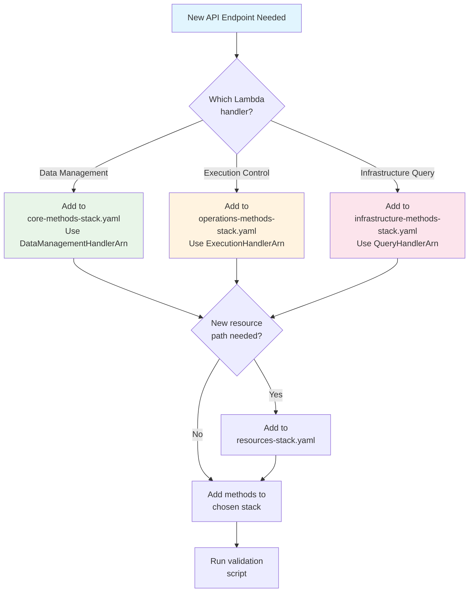

# API Development Quick Reference

## Lambda Handler Architecture

The API uses **3 specialized Lambda handlers** for different endpoint types:

| Handler | Purpose | Endpoints |
|---------|---------|-----------|
| **data-management-handler** | CRUD operations for primary entities | Protection Groups, Recovery Plans, User Management |
| **execution-handler** | DR execution lifecycle operations | Start, pause, resume, cancel executions |
| **query-handler** | Read-only infrastructure queries | DRS source servers, EC2 subnets, cross-account resources |

## Adding New API Endpoints - Decision Tree



## Stack & Handler Selection Guide

| Endpoint Type | Example | Stack | Lambda Handler |
|---------------|---------|-------|----------------|
| **CRUD Operations** | `/protection-groups`, `/recovery-plans` | `core-methods-stack.yaml` | `DataManagementHandlerArn` |
| **User Management** | `/user/profile`, `/user/roles` | `core-methods-stack.yaml` | `DataManagementHandlerArn` |
| **Execution Control** | `/executions/{id}/pause`, `/executions/{id}/resume` | `operations-methods-stack.yaml` | `ExecutionHandlerArn` |
| **Execution Lifecycle** | `/executions`, `/executions/{id}` | `operations-methods-stack.yaml` | `ExecutionHandlerArn` |
| **Infrastructure Query** | `/drs/source-servers`, `/ec2/subnets` | `infrastructure-methods-stack.yaml` | `QueryHandlerArn` |
| **Cross-Account Query** | `/accounts/targets` | `infrastructure-methods-stack.yaml` | `QueryHandlerArn` |
| **Health Check** | `/health` | `core-methods-stack.yaml` | `QueryHandlerArn` |

## Step-by-Step Process

### 1. Add Resource (if new path needed)

```yaml
# In cfn/api-gateway-resources-stack.yaml
NewFeatureResource:
  Type: AWS::ApiGateway::Resource
  Properties:
    RestApiId: !Ref RestApiId
    ParentId: !Ref RootResourceId
    PathPart: 'new-feature'

# Export the resource ID
Outputs:
  NewFeatureResourceId:
    Description: 'API Gateway Resource ID for New Feature'
    Value: !Ref NewFeatureResource
    Export:
      Name: !Sub '${AWS::StackName}-NewFeatureResourceId'
```

### 2. Add Methods to Appropriate Stack

**Choose the correct Lambda handler based on endpoint type:**

#### For Data Management (CRUD operations):

```yaml
# In cfn/api-gateway-core-methods-stack.yaml

# Import resource ID
Parameters:
  NewFeatureResourceId:
    Type: String
    Description: 'Resource ID for new feature endpoint'
  
  DataManagementHandlerArn:
    Type: String
    Description: 'Data Management Handler Function ARN from Lambda Stack'

# Add GET method
NewFeatureGetMethod:
  Type: AWS::ApiGateway::Method
  Properties:
    RestApiId: !Ref RestApiId
    ResourceId: !Ref NewFeatureResourceId
    HttpMethod: GET
    AuthorizationType: COGNITO_USER_POOLS
    AuthorizerId: !Ref ApiAuthorizerId
    Integration:
      Type: AWS_PROXY
      IntegrationHttpMethod: POST
      Uri: !Sub 'arn:aws:apigateway:${AWS::Region}:lambda:path/2015-03-31/functions/${DataManagementHandlerArn}/invocations'
```

#### For Execution Operations:

```yaml
# In cfn/api-gateway-operations-methods-stack.yaml

Parameters:
  ExecutionHandlerArn:
    Type: String
    Description: 'Execution Handler Function ARN from Lambda Stack'

# Add POST method for execution control
ExecutionActionMethod:
  Type: AWS::ApiGateway::Method
  Properties:
    RestApiId: !Ref RestApiId
    ResourceId: !Ref ExecutionActionResourceId
    HttpMethod: POST
    AuthorizationType: COGNITO_USER_POOLS
    AuthorizerId: !Ref ApiAuthorizerId
    Integration:
      Type: AWS_PROXY
      IntegrationHttpMethod: POST
      Uri: !Sub 'arn:aws:apigateway:${AWS::Region}:lambda:path/2015-03-31/functions/${ExecutionHandlerArn}/invocations'
```

#### For Infrastructure Queries:

```yaml
# In cfn/api-gateway-infrastructure-methods-stack.yaml

Parameters:
  QueryHandlerArn:
    Type: String
    Description: 'Query Handler Function ARN from Lambda Stack'

# Add GET method for infrastructure query
InfrastructureQueryMethod:
  Type: AWS::ApiGateway::Method
  Properties:
    RestApiId: !Ref RestApiId
    ResourceId: !Ref InfrastructureResourceId
    HttpMethod: GET
    AuthorizationType: COGNITO_USER_POOLS
    AuthorizerId: !Ref ApiAuthorizerId
    Integration:
      Type: AWS_PROXY
      IntegrationHttpMethod: POST
      Uri: !Sub 'arn:aws:apigateway:${AWS::Region}:lambda:path/2015-03-31/functions/${QueryHandlerArn}/invocations'
```

### 3. Add OPTIONS Method for CORS

**Required for every non-OPTIONS method:**

```yaml
NewFeatureOptionsMethod:
  Type: AWS::ApiGateway::Method
  Properties:
    RestApiId: !Ref RestApiId
    ResourceId: !Ref NewFeatureResourceId
    HttpMethod: OPTIONS
    AuthorizationType: NONE
    Integration:
      Type: MOCK
      IntegrationResponses:
        - StatusCode: 200
          ResponseParameters:
            method.response.header.Access-Control-Allow-Headers: "'Content-Type,X-Amz-Date,Authorization,X-Api-Key,X-Amz-Security-Token'"
            method.response.header.Access-Control-Allow-Methods: "'GET,POST,PUT,DELETE,OPTIONS'"
            method.response.header.Access-Control-Allow-Origin: "'*'"
          ResponseTemplates:
            application/json: ''
      RequestTemplates:
        application/json: '{"statusCode": 200}'
    MethodResponses:
      - StatusCode: 200
        ResponseParameters:
          method.response.header.Access-Control-Allow-Headers: false
          method.response.header.Access-Control-Allow-Methods: false
          method.response.header.Access-Control-Allow-Origin: false
```

### 4. Update Master Template Parameters

**Pass the correct Lambda handler ARN to the method stack:**

```yaml
# In cfn/master-template.yaml

# For core methods stack (data management)
ApiGatewayCoreMethodsStack:
  Type: AWS::CloudFormation::Stack
  Properties:
    TemplateURL: !Sub '${TemplateBaseUrl}/api-gateway-core-methods-stack.yaml'
    Parameters:
      RestApiId: !GetAtt ApiGatewayCoreStack.Outputs.RestApiId
      ApiAuthorizerId: !GetAtt ApiGatewayCoreStack.Outputs.AuthorizerId
      DataManagementHandlerArn: !GetAtt LambdaStack.Outputs.DataManagementHandlerFunctionArn
      QueryHandlerArn: !GetAtt LambdaStack.Outputs.QueryHandlerFunctionArn
      # ... resource IDs

# For operations methods stack (execution control)
ApiGatewayOperationsMethodsStack:
  Type: AWS::CloudFormation::Stack
  Properties:
    TemplateURL: !Sub '${TemplateBaseUrl}/api-gateway-operations-methods-stack.yaml'
    Parameters:
      RestApiId: !GetAtt ApiGatewayCoreStack.Outputs.RestApiId
      ApiAuthorizerId: !GetAtt ApiGatewayCoreStack.Outputs.AuthorizerId
      ExecutionHandlerArn: !GetAtt LambdaStack.Outputs.ExecutionHandlerFunctionArn
      # ... resource IDs

# For infrastructure methods stack (queries)
ApiGatewayInfrastructureMethodsStack:
  Type: AWS::CloudFormation::Stack
  Properties:
    TemplateURL: !Sub '${TemplateBaseUrl}/api-gateway-infrastructure-methods-stack.yaml'
    Parameters:
      RestApiId: !GetAtt ApiGatewayCoreStack.Outputs.RestApiId
      ApiAuthorizerId: !GetAtt ApiGatewayCoreStack.Outputs.AuthorizerId
      QueryHandlerArn: !GetAtt LambdaStack.Outputs.QueryHandlerFunctionArn
      # ... resource IDs
```

## Validation Commands

```bash
# Run architecture validation
./scripts/validate-api-architecture.sh

# Check CloudFormation syntax
make validate

# Verify Lambda handler parameters in method stacks
grep -E "DataManagementHandlerArn|ExecutionHandlerArn|QueryHandlerArn" cfn/api-gateway-*-methods-stack.yaml

# Check resource counts per stack
grep -E "^  [A-Za-z][A-Za-z0-9]*:$" cfn/api-gateway-*-methods-stack.yaml | wc -l

# Check template sizes
ls -lh cfn/api-gateway-*.yaml | awk '{print $5, $9}'
```

## Lambda Handler Implementation

After adding API Gateway methods, implement the handler logic in the appropriate Lambda function:

### Data Management Handler
```python
# lambda/data-management-handler/index.py

def lambda_handler(event, context):
    """
    Handles CRUD operations for:
    - Protection Groups
    - Recovery Plans
    - User Management
    """
    path = event.get('path', '')
    method = event.get('httpMethod', '')
    
    # Route to appropriate handler
    if '/protection-groups' in path:
        return handle_protection_groups(event, context)
    elif '/recovery-plans' in path:
        return handle_recovery_plans(event, context)
    # ...
```

### Execution Handler
```python
# lambda/execution-handler/index.py

def lambda_handler(event, context):
    """
    Handles DR execution lifecycle:
    - Start, pause, resume, cancel executions
    - Execution status queries
    """
    path = event.get('path', '')
    method = event.get('httpMethod', '')
    
    # Route to appropriate handler
    if '/executions' in path:
        if method == 'POST' and '/pause' in path:
            return handle_pause_execution(event, context)
        elif method == 'POST' and '/resume' in path:
            return handle_resume_execution(event, context)
    # ...
```

### Query Handler
```python
# lambda/query-handler/index.py

def lambda_handler(event, context):
    """
    Handles read-only infrastructure queries:
    - DRS source servers
    - EC2 subnets, VPCs
    - Cross-account resources
    """
    path = event.get('path', '')
    
    # Route to appropriate handler
    if '/drs/source-servers' in path:
        return query_drs_source_servers(event, context)
    elif '/ec2/subnets' in path:
        return query_ec2_subnets(event, context)
    # ...
```

## Common Patterns

### CRUD Endpoint Set (Data Management Handler)
```yaml
# In core-methods-stack.yaml
# Uses DataManagementHandlerArn

# GET /items
ItemsGetMethod:
  Properties:
    HttpMethod: GET
    Integration:
      Uri: !Sub '...${DataManagementHandlerArn}/invocations'

# POST /items  
ItemsPostMethod:
  Properties:
    HttpMethod: POST
    Integration:
      Uri: !Sub '...${DataManagementHandlerArn}/invocations'

# GET /items/{id}
ItemGetMethod:
  Properties:
    HttpMethod: GET
    Integration:
      Uri: !Sub '...${DataManagementHandlerArn}/invocations'

# PUT /items/{id}
ItemPutMethod:
  Properties:
    HttpMethod: PUT
    Integration:
      Uri: !Sub '...${DataManagementHandlerArn}/invocations'

# DELETE /items/{id}
ItemDeleteMethod:
  Properties:
    HttpMethod: DELETE
    Integration:
      Uri: !Sub '...${DataManagementHandlerArn}/invocations'

# OPTIONS for each resource
ItemsOptionsMethod: ...
ItemOptionsMethod: ...
```

### Execution Control Endpoint (Execution Handler)
```yaml
# In operations-methods-stack.yaml
# Uses ExecutionHandlerArn

# POST /executions/{id}/pause
ExecutionPauseMethod:
  Properties:
    HttpMethod: POST
    Integration:
      Uri: !Sub '...${ExecutionHandlerArn}/invocations'

# POST /executions/{id}/resume
ExecutionResumeMethod:
  Properties:
    HttpMethod: POST
    Integration:
      Uri: !Sub '...${ExecutionHandlerArn}/invocations'

ExecutionPauseOptionsMethod: ...
ExecutionResumeOptionsMethod: ...
```

### Infrastructure Query Endpoint (Query Handler)
```yaml
# In infrastructure-methods-stack.yaml
# Uses QueryHandlerArn

# GET /drs/source-servers
DrsSourceServersGetMethod:
  Properties:
    HttpMethod: GET
    Integration:
      Uri: !Sub '...${QueryHandlerArn}/invocations'

# GET /ec2/subnets
Ec2SubnetsGetMethod:
  Properties:
    HttpMethod: GET
    Integration:
      Uri: !Sub '...${QueryHandlerArn}/invocations'

DrsSourceServersOptionsMethod: ...
Ec2SubnetsOptionsMethod: ...
```

## Naming Conventions

| Pattern | Example | Usage |
|---------|---------|-------|
| `[Feature]sGetMethod` | `ProtectionGroupsGetMethod` | GET /protection-groups |
| `[Feature]GetMethod` | `ProtectionGroupGetMethod` | GET /protection-groups/{id} |
| `[Feature]sPostMethod` | `ProtectionGroupsPostMethod` | POST /protection-groups |
| `[Feature]PutMethod` | `ProtectionGroupPutMethod` | PUT /protection-groups/{id} |
| `[Feature]DeleteMethod` | `ProtectionGroupDeleteMethod` | DELETE /protection-groups/{id} |
| `[Feature][Action]Method` | `ExecutionPauseMethod` | POST /executions/{id}/pause |
| `[Feature]OptionsMethod` | `ProtectionGroupOptionsMethod` | OPTIONS /protection-groups/{id} |

## Resource Limits

| Metric | Warning | Action Required |
|--------|---------|-----------------|
| Resources per stack | 350+ | 400+ |
| Template size | 800KB+ | 900KB+ |
| Methods without OPTIONS | Any | Add CORS |
| Hardcoded values | Any | Use parameters |

## Troubleshooting

### "Template too large" Error
```bash
# Check template sizes
ls -la cfn/api-gateway-*.yaml

# Split large method stack into multiple stacks
# Move related methods to new stack file
```

### "Resource limit exceeded" Error
```bash
# Count resources per stack
./scripts/validate-api-architecture.sh

# Create new method stack for additional endpoints
```

### CORS Issues
```bash
# Ensure every non-OPTIONS method has corresponding OPTIONS method
grep -c "HttpMethod: GET\|POST\|PUT\|DELETE" cfn/api-gateway-*-methods-stack.yaml
grep -c "HttpMethod: OPTIONS" cfn/api-gateway-*-methods-stack.yaml
```

### Deployment Failures
```bash
# Check parameter passing between stacks
# Ensure resources stack exports all resource IDs
# Ensure method stacks import required parameters
```

## Best Practices Checklist

- [ ] Choose appropriate method stack based on functionality
- [ ] Select correct Lambda handler (DataManagement, Execution, or Query)
- [ ] Add resource to resources stack if new path needed
- [ ] Follow naming convention: `[Feature][Action]Method`
- [ ] Include OPTIONS method for CORS
- [ ] Use AWS_PROXY integration pattern
- [ ] Use correct handler ARN parameter (not generic LambdaFunctionArn)
- [ ] Export resource IDs from resources stack
- [ ] Import required parameters in method stacks
- [ ] Pass correct handler ARN from master template
- [ ] Run validation script before committing
- [ ] Implement handler logic in appropriate Lambda function
- [ ] Test in development environment
- [ ] Update API documentation

## Handler Selection Decision Matrix

| Question | Answer | Handler | Stack |
|----------|--------|---------|-------|
| Does it create/update/delete data? | Yes | DataManagementHandlerArn | core-methods |
| Does it control execution lifecycle? | Yes | ExecutionHandlerArn | operations-methods |
| Is it read-only infrastructure query? | Yes | QueryHandlerArn | infrastructure-methods |
| Is it user profile/roles/permissions? | Yes | DataManagementHandlerArn | core-methods |
| Is it health check? | Yes | QueryHandlerArn | core-methods |

This quick reference ensures consistent API development following the 3-handler Lambda architecture pattern.