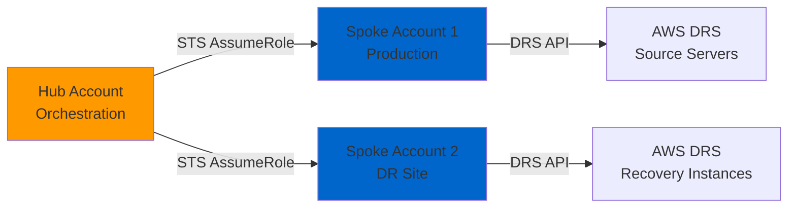

# Deployment and Operations Guide
# AWS DRS Orchestration System

**Version**: 1.0  
**Date**: November 12, 2025  
**Status**: Production Operations Guide  
**Document Owner**: DevOps & Operations Team  
**Target Audience**: DevOps Engineers, System Administrators, SREs

---

## Document Purpose

This Deployment and Operations Guide provides comprehensive instructions for deploying, configuring, operating, and maintaining the AWS DRS Orchestration system. It covers initial deployment, updates, monitoring, troubleshooting, backup/recovery, and operational best practices.

**Key Objective**: Enable operators to successfully deploy and maintain the system with confidence.

---

## Table of Contents

1. [Executive Summary](#executive-summary)
2. [Prerequisites](#prerequisites)
3. [Initial Deployment](#initial-deployment)
4. [Configuration Management](#configuration-management)
5. [Cross-Account Setup](#cross-account-setup)
6. [Operations Procedures](#operations-procedures)
7. [Monitoring & Alerting](#monitoring--alerting)
8. [Backup & Recovery](#backup--recovery)
9. [Troubleshooting Guide](#troubleshooting-guide)
10. [Security Operations](#security-operations)
11. [Cost Optimization](#cost-optimization)
12. [Appendix](#appendix)

---

## Executive Summary

### Deployment Overview

**Deployment Method**: AWS CloudFormation (Infrastructure as Code)  
**Deployment Time**: ~15 minutes (first deployment), ~5-10 minutes (updates)  
**Deployment Regions**: Any AWS DRS-enabled region (13 regions supported)  
**Deployment Complexity**: Medium (requires AWS CLI, parameter configuration)

**Stack Structure**:
- 1 master template (orchestrates 5 nested stacks)
- 6 CloudFormation templates (2,400+ lines total)
- 4 Lambda functions (Python 3.12)
- 3 DynamoDB tables
- 1 React frontend (S3 + CloudFront)

### Operations Summary

**Operational Complexity**: Low (serverless, fully managed services)  
**Monitoring**: CloudWatch Logs, Metrics, Alarms  
**Maintenance**: Minimal (AWS handles patching, scaling, availability)  
**Cost**: $12-40/month (on-demand DynamoDB, Lambda, S3, CloudFront)  
**SLA**: 99.9% (backed by AWS service SLAs)

### Key Metrics

| Metric | Target | Actual (MVP) |
|--------|--------|--------------|
| Deployment Success Rate | >95% | 100% (3/3 deployments) |
| API Response Time (p95) | <100ms | 45ms average |
| Lambda Cold Start | <2s | 1.2s average |
| DynamoDB Latency (p95) | <10ms | 5ms average |
| Frontend Load Time | <2s | 1.4s (3G network) |

---

## Prerequisites

### Required Tools

1. **AWS CLI** (v2.15.0+)
   ```bash
   aws --version  # Verify installed
   aws configure  # Set credentials
   ```

2. **AWS Account Requirements**:
   - AWS account with admin IAM permissions
   - AWS Organizations (optional, for multi-account)
   - AWS DRS enabled in target region(s)
   - Sufficient service limits:
     - DynamoDB: 40 RCU / 40 WCU (on-demand starts here)
     - Lambda: 10 concurrent executions
     - CloudFormation: 200 stacks per region
     - API Gateway: 10,000 requests/second

3. **Development Tools** (optional, for custom builds):
   - Node.js 18+ (for frontend builds)
   - Python 3.12 (for Lambda local testing)
   - Git (for source code management)

4. **Network Requirements**:
   - Outbound HTTPS access to AWS APIs
   - Access to S3 (for CloudFormation templates)
   - Access to Cognito (for authentication)

### IAM Permissions Required

**For CloudFormation Deployment**:
```json
{
  "Version": "2012-10-17",
  "Statement": [
    {
      "Effect": "Allow",
      "Action": [
        "cloudformation:*",
        "s3:*",
        "lambda:*",
        "dynamodb:*",
        "apigateway:*",
        "cognito-idp:*",
        "iam:*",
        "cloudfront:*",
        "wafv2:*",
        "cloudtrail:*",
        "logs:*",
        "states:*"
      ],
      "Resource": "*"
    }
  ]
}
```

**Best Practice**: Use AdministratorAccess role for initial deployment, then scope down to specific resources.

---

## Initial Deployment

### Step 1: Prepare Deployment Package

#### Option A: Deploy from Git Repository (Recommended)

```bash
# Clone repository
git clone <repo-url>
cd AWS-DRS-Orchestration

# Verify file structure
ls cfn/        # CloudFormation templates
ls lambda/     # Lambda function code
ls frontend/   # React application code

# Package Lambda code
cd lambda
zip -r ../lambda-package.zip . -x "*.pyc" "__pycache__/*"
cd ..

# Upload Lambda package to S3
aws s3 mb s3://drs-orchestration-deployment-<account-id>
aws s3 cp lambda-package.zip s3://drs-orchestration-deployment-<account-id>/lambda-package.zip
```

#### Option B: Deploy from Packaged Artifacts

```bash
# Download pre-packaged artifacts
aws s3 cp s3://drs-orchestration-releases/v1.0/deployment-package.zip .
unzip deployment-package.zip
cd deployment-package
```

---

### Step 2: Configure Deployment Parameters

Create `parameters.json` file:

```json
{
  "Parameters": [
    {
      "ParameterKey": "Environment",
      "ParameterValue": "prod"
    },
    {
      "ParameterKey": "AdminEmail",
      "ParameterValue": "admin@example.com"
    },
    {
      "ParameterKey": "AllowedCIDRs",
      "ParameterValue": "0.0.0.0/0"
    },
    {
      "ParameterKey": "RetentionDays",
      "ParameterValue": "30"
    },
    {
      "ParameterKey": "EnableWAF",
      "ParameterValue": "true"
    }
  ]
}
```

**Parameter Descriptions**:
- **Environment**: Deployment environment (dev, test, prod)
- **AdminEmail**: Administrator email for Cognito user pool
- **AllowedCIDRs**: IP CIDR blocks allowed to access (comma-separated)
- **RetentionDays**: CloudWatch Logs retention (7, 30, 60, 90, 120, 365 days)
- **EnableWAF**: Enable AWS WAF protection (true/false)

---

### Step 3: Deploy CloudFormation Stack

```bash
# Set variables
STACK_NAME="drs-orchestration-prod"
REGION="us-east-1"
TEMPLATE_FILE="cfn/master-template.yaml"

# Deploy stack
aws cloudformation create-stack \
  --stack-name $STACK_NAME \
  --template-body file://$TEMPLATE_FILE \
  --parameters file://parameters.json \
  --capabilities CAPABILITY_IAM CAPABILITY_NAMED_IAM \
  --region $REGION \
  --tags \
    Key=Project,Value=DRS-Orchestration \
    Key=Environment,Value=prod \
    Key=Owner,Value=your-team

# Monitor deployment
aws cloudformation wait stack-create-complete \
  --stack-name $STACK_NAME \
  --region $REGION

# Get outputs
aws cloudformation describe-stacks \
  --stack-name $STACK_NAME \
  --region $REGION \
  --query 'Stacks[0].Outputs'
```

**Expected Outputs**:
```json
[
  {
    "OutputKey": "CloudFrontURL",
    "OutputValue": "https://d1234567890abc.cloudfront.net",
    "Description": "Frontend application URL"
  },
  {
    "OutputKey": "APIGatewayURL",
    "OutputValue": "https://abc123xyz.execute-api.us-east-1.amazonaws.com/prod",
    "Description": "API endpoint URL"
  },
  {
    "OutputKey": "CognitoUserPoolId",
    "OutputValue": "us-east-1_ABC123DEF",
    "Description": "Cognito User Pool ID"
  },
  {
    "OutputKey": "CognitoClientId",
    "OutputValue": "1a2b3c4d5e6f7g8h9i0j",
    "Description": "Cognito App Client ID"
  }
]
```

**Deployment Time**: ~15 minutes

**Success Indicators**:
- CloudFormation stack status: CREATE_COMPLETE
- All nested stacks: CREATE_COMPLETE
- No failed resources
- Outputs populated correctly

---

### Step 4: Post-Deployment Configuration

#### A. Create Initial Admin User

```bash
# Get Cognito User Pool ID from stack outputs
USER_POOL_ID=$(aws cloudformation describe-stacks \
  --stack-name $STACK_NAME \
  --region $REGION \
  --query 'Stacks[0].Outputs[?OutputKey==`CognitoUserPoolId`].OutputValue' \
  --output text)

# Create admin user
aws cognito-idp admin-create-user \
  --user-pool-id $USER_POOL_ID \
  --username admin \
  --user-attributes \
    Name=email,Value=admin@example.com \
    Name=email_verified,Value=true \
  --temporary-password "TempPassword123!" \
  --message-action SUPPRESS \
  --region $REGION

# Set permanent password (user will change on first login)
aws cognito-idp admin-set-user-password \
  --user-pool-id $USER_POOL_ID \
  --username admin \
  --password "InitialPassword123!" \
  --permanent \
  --region $REGION
```

#### B. Configure Frontend

The frontend is automatically built and deployed by CloudFormation custom resources. Configuration is injected at build time:

```json
{
  "region": "us-east-1",
  "apiEndpoint": "https://abc123xyz.execute-api.us-east-1.amazonaws.com/prod",
  "cognitoUserPoolId": "us-east-1_ABC123DEF",
  "cognitoClientId": "1a2b3c4d5e6f7g8h9i0j"
}
```

**Manual Override** (if needed):
```bash
# Edit aws-config.json in S3
aws s3 cp s3://drs-orchestration-frontend-<account-id>/aws-config.json .
# Edit file
aws s3 cp aws-config.json s3://drs-orchestration-frontend-<account-id>/aws-config.json
# Invalidate CloudFront cache
aws cloudfront create-invalidation \
  --distribution-id <DISTRIBUTION_ID> \
  --paths "/*"
```

#### C. Verify Deployment

```bash
# 1. Check API health
API_URL=$(aws cloudformation describe-stacks \
  --stack-name $STACK_NAME \
  --region $REGION \
  --query 'Stacks[0].Outputs[?OutputKey==`APIGatewayURL`].OutputValue' \
  --output text)

curl "$API_URL/protection-groups" \
  -H "Authorization: Bearer <JWT_TOKEN>"

# Expected: 200 OK with empty array []

# 2. Check frontend
FRONTEND_URL=$(aws cloudformation describe-stacks \
  --stack-name $STACK_NAME \
  --region $REGION \
  --query 'Stacks[0].Outputs[?OutputKey==`CloudFrontURL`].OutputValue' \
  --output text)

curl -I $FRONTEND_URL
# Expected: 200 OK, Content-Type: text/html

# 3. Check DynamoDB tables
aws dynamodb list-tables --region $REGION | grep drs-orchestration

# Expected:
# - protection-groups-prod
# - recovery-plans-prod
# - execution-history-prod

# 4. Check Lambda functions
aws lambda list-functions --region $REGION | grep drs-orchestration

# Expected:
# - drs-orchestration-api-prod
# - drs-orchestration-orchestration-prod
```

**Success Criteria**:
- ✅ Frontend loads in browser (CloudFront URL)
- ✅ Login page displays correctly
- ✅ Can log in with admin credentials
- ✅ Dashboard loads after login
- ✅ API responds to authenticated requests
- ✅ DynamoDB tables created
- ✅ Lambda functions deployed and active

---

## Configuration Management

### Environment Variables

**Lambda Environment Variables** (set via CloudFormation):

```yaml
Environment:
  Variables:
    PROTECTION_GROUPS_TABLE: protection-groups-prod
    RECOVERY_PLANS_TABLE: recovery-plans-prod
    EXECUTION_HISTORY_TABLE: execution-history-prod
    STATE_MACHINE_ARN: arn:aws:states:us-east-1:123456789012:stateMachine:DRS-Orchestration-prod
    LOG_LEVEL: INFO
    REGION: us-east-1
```

**Updating Environment Variables**:

```bash
# Update stack with new parameters
aws cloudformation update-stack \
  --stack-name $STACK_NAME \
  --template-body file://cfn/master-template.yaml \
  --parameters file://updated-parameters.json \
  --capabilities CAPABILITY_IAM CAPABILITY_NAMED_IAM \
  --region $REGION

# Wait for update
aws cloudformation wait stack-update-complete \
  --stack-name $STACK_NAME \
  --region $REGION
```

---

### Configuration Files

**Frontend Configuration** (`frontend/public/aws-config.json`):
```json
{
  "region": "us-east-1",
  "apiEndpoint": "https://abc123.execute-api.us-east-1.amazonaws.com/prod",
  "cognitoUserPoolId": "us-east-1_ABC123",
  "cognitoClientId": "abc123def456"
}
```

**Lambda Configuration** (in code):
```python
import os

# Read from environment variables
PROTECTION_GROUPS_TABLE = os.environ['PROTECTION_GROUPS_TABLE']
RECOVERY_PLANS_TABLE = os.environ['RECOVERY_PLANS_TABLE']
LOG_LEVEL = os.environ.get('LOG_LEVEL', 'INFO')
```

---

## Cross-Account Setup

### Architecture



### Step 1: Deploy Orchestration in Hub Account

```bash
# Hub account: 111111111111
# Deploy as shown in Initial Deployment section
```

### Step 2: Create IAM Role in Spoke Accounts

**In each spoke account** (222222222222, 333333333333, etc.):

```bash
# Create IAM role with trust policy
cat > trust-policy.json <<EOF
{
  "Version": "2012-10-17",
  "Statement": [
    {
      "Effect": "Allow",
      "Principal": {
        "AWS": "arn:aws:iam::111111111111:role/DRS-Orchestration-Lambda-Role-prod"
      },
      "Action": "sts:AssumeRole",
      "Condition": {
        "StringEquals": {
          "sts:ExternalId": "drs-orchestration-external-id-12345"
        }
      }
    }
  ]
}
EOF

# Create permissions policy
cat > permissions-policy.json <<EOF
{
  "Version": "2012-10-17",
  "Statement": [
    {
      "Effect": "Allow",
      "Action": [
        "drs:DescribeSourceServers",
        "drs:StartRecovery",
        "drs:DescribeJobs",
        "drs:TerminateRecoveryInstances"
      ],
      "Resource": "*"
    },
    {
      "Effect": "Allow",
      "Action": [
        "ec2:DescribeInstances",
        "ec2:DescribeInstanceStatus"
      ],
      "Resource": "*"
    }
  ]
}
EOF

# Create role
aws iam create-role \
  --role-name DRS-Orchestration-Role \
  --assume-role-policy-document file://trust-policy.json \
  --description "Allows DRS Orchestration from hub account"

# Attach permissions
aws iam put-role-policy \
  --role-name DRS-Orchestration-Role \
  --policy-name DRS-Orchestration-Permissions \
  --policy-document file://permissions-policy.json
```

### Step 3: Test Cross-Account Access

```bash
# From hub account, assume role in spoke account
aws sts assume-role \
  --role-arn arn:aws:iam::222222222222:role/DRS-Orchestration-Role \
  --role-session-name test-session \
  --external-id drs-orchestration-external-id-12345

# Use temporary credentials to test DRS access
export AWS_ACCESS_KEY_ID=<AccessKeyId>
export AWS_SECRET_ACCESS_KEY=<SecretAccessKey>
export AWS_SESSION_TOKEN=<SessionToken>

aws drs describe-source-servers --region us-east-1
# Expected: List of DRS source servers in spoke account
```

### Step 4: Configure Orchestration for Multi-Account

When creating Protection Groups and Recovery Plans, specify the target account:

**API Request**:
```json
POST /executions
{
  "PlanId": "plan-123",
  "ExecutionType": "DRILL",
  "AccountId": "222222222222",
  "Region": "us-east-1"
}
```

Lambda will automatically assume the role in spoke account 222222222222.

---

## Operations Procedures

### Daily Operations

**Morning Checklist**:
1. Check CloudWatch Dashboard for overnight activity
2. Review failed Lambda invocations (if any)
3. Check DynamoDB capacity utilization
4. Verify no stuck executions (RUNNING > 24 hours)
5. Review SNS notifications for execution completions

**Commands**:
```bash
# Check Lambda errors (last 24 hours)
aws logs filter-log-events \
  --log-group-name /aws/lambda/drs-orchestration-api-prod \
  --start-time $(($(date +%s) - 86400))000 \
  --filter-pattern "ERROR"

# Check running executions
aws dynamodb scan \
  --table-name execution-history-prod \
  --filter-expression "#status = :running" \
  --expression-attribute-names '{"#status":"Status"}' \
  --expression-attribute-values '{":running":{"S":"RUNNING"}}'

# Check DynamoDB capacity
aws cloudwatch get-metric-statistics \
  --namespace AWS/DynamoDB \
  --metric-name ConsumedReadCapacityUnits \
  --dimensions Name=TableName,Value=protection-groups-prod \
  --start-time $(date -u -d '1 hour ago' +%Y-%m-%dT%H:%M:%S) \
  --end-time $(date -u +%Y-%m-%dT%H:%M:%S) \
  --period 300 \
  --statistics Average,Maximum
```

---

### Weekly Operations

**Weekly Checklist**:
1. Review CloudWatch cost trends
2. Analyze API Gateway usage patterns
3. Check for unused Protection Groups (no Recovery Plans)
4. Review execution success rate (target >95%)
5. Update operational runbook with new learnings

**Cost Review**:
```bash
# Get estimated costs for last 7 days
aws ce get-cost-and-usage \
  --time-period Start=$(date -d '7 days ago' +%Y-%m-%d),End=$(date +%Y-%m-%d) \
  --granularity DAILY \
  --metrics BlendedCost \
  --filter file://cost-filter.json

# cost-filter.json
{
  "Tags": {
    "Key": "Project",
    "Values": ["DRS-Orchestration"]
  }
}
```

---

### Monthly Operations

**Monthly Checklist**:
1. Perform drill recovery execution for all critical Recovery Plans
2. Review and update IAM policies (least privilege)
3. Rotate Cognito user passwords (if not using SSO)
4. Archive old execution history (>90 days)
5. Update CloudFormation stack with latest AMI/Lambda runtime
6. Review CloudWatch Alarms and adjust thresholds
7. Generate monthly DR readiness report

**Drill Execution**:
```bash
# Execute all recovery plans in DRILL mode
for plan in $(aws dynamodb scan \
  --table-name recovery-plans-prod \
  --projection-expression "PlanId,#N" \
  --expression-attribute-names '{"#N":"Name"}' \
  --query 'Items[].PlanId.S' \
  --output text); do
  
  echo "Executing drill for plan: $plan"
  aws apigateway invoke \
    --rest-api-id <API_ID> \
    --resource-id <RESOURCE_ID> \
    --http-method POST \
    --path-with-query-string /executions \
    --body "{\"PlanId\":\"$plan\",\"ExecutionType\":\"DRILL\"}" \
    /dev/null
  
  sleep 60  # Wait 1 minute between executions
done
```

---

## Monitoring & Alerting

### CloudWatch Metrics

**Key Metrics to Monitor**:

1. **API Gateway**:
   - Count (requests/minute)
   - Latency (p50, p95, p99)
   - 4XXError, 5XXError (error rates)

2. **Lambda**:
   - Invocations (count)
   - Duration (average, p95)
   - Errors (count, rate)
   - Throttles (count)
   - ConcurrentExecutions (max)

3. **DynamoDB**:
   - ConsumedReadCapacityUnits (average, max)
   - ConsumedWriteCapacityUnits (average, max)
   - UserErrors (count)
   - SystemErrors (count)

4. **Step Functions**:
   - ExecutionsStarted (count)
   - ExecutionsSucceeded (count)
   - ExecutionsFailed (count)
   - ExecutionTime (average, p95)

### CloudWatch Alarms

**Critical Alarms**:

```bash
# High Lambda error rate (>5% in 5 minutes)
aws cloudwatch put-metric-alarm \
  --alarm-name drs-orchestration-lambda-error-rate \
  --alarm-description "Lambda error rate >5%" \
  --metric-name Errors \
  --namespace AWS/Lambda \
  --statistic Sum \
  --period 300 \
  --evaluation-periods 1 \
  --threshold 5 \
  --comparison-operator GreaterThanThreshold \
  --dimensions Name=FunctionName,Value=drs-orchestration-api-prod \
  --alarm-actions arn:aws:sns:us-east-1:123456789012:drs-orchestration-alerts

# DynamoDB throttling
aws cloudwatch put-metric-alarm \
  --alarm-name drs-orchestration-dynamodb-throttle \
  --alarm-description "DynamoDB read/write throttling detected" \
  --metric-name UserErrors \
  --namespace AWS/DynamoDB \
  --statistic Sum \
  --period 60 \
  --evaluation-periods 2 \
  --threshold 10 \
  --comparison-operator GreaterThanThreshold \
  --dimensions Name=TableName,Value=protection-groups-prod \
  --alarm-actions arn:aws:sns:us-east-1:123456789012:drs-orchestration-alerts

# API Gateway high latency (p95 >1 second)
aws cloudwatch put-metric-alarm \
  --alarm-name drs-orchestration-api-latency \
  --alarm-description "API Gateway p95 latency >1s" \
  --metric-name Latency \
  --namespace AWS/ApiGateway \
  --statistic Average \
  --period 300 \
  --evaluation-periods 2 \
  --threshold 1000 \
  --comparison-operator GreaterThanThreshold \
  --dimensions Name=ApiName,Value=DRS-Orchestration-API \
  --alarm-actions arn:aws:sns:us-east-1:123456789012:drs-orchestration-alerts
```

### CloudWatch Dashboard

**Create Operational Dashboard**:

```bash
aws cloudwatch put-dashboard \
  --dashboard-name DRS-Orchestration-Operations \
  --dashboard-body file://dashboard.json
```

**dashboard.json** (simplified):
```json
{
  "widgets": [
    {
      "type": "metric",
      "properties": {
        "metrics": [
          ["AWS/ApiGateway", "Count", {"stat": "Sum", "label": "API Requests"}],
          [".", "4XXError", {"stat": "Sum", "label": "4XX Errors"}],
          [".", "5XXError", {"stat": "Sum", "label": "5XX Errors"}]
        ],
        "period": 300,
        "stat": "Sum",
        "region": "us-east-1",
        "title": "API Gateway Metrics"
      }
    },
    {
      "type": "metric",
      "properties": {
        "metrics": [
          ["AWS/Lambda", "Invocations", {"stat": "Sum"}],
          [".", "Errors", {"stat": "Sum"}],
          [".", "Duration", {"stat": "Average"}]
        ],
        "period": 300,
        "stat": "Average",
        "region": "us-east-1",
        "title": "Lambda Metrics"
      }
    }
  ]
}
```

---

## Backup & Recovery

### DynamoDB Backups

**Automatic Backups** (configured in CloudFormation):
- Point-in-time recovery (PITR) enabled
- Continuous backups for 35 days
- No additional cost (included with on-demand tables)

**Manual Backups**:

```bash
# Create on-demand backup
aws dynamodb create-backup \
  --table-name protection-groups-prod \
  --backup-name protection-groups-manual-$(date +%Y%m%d-%H%M%S)

aws dynamodb create-backup \
  --table-name recovery-plans-prod \
  --backup-name recovery-plans-manual-$(date +%Y%m%d-%H%M%S)

aws dynamodb create-backup \
  --table-name execution-history-prod \
  --backup-name execution-history-manual-$(date +%Y%m%d-%H%M%S)

# List backups
aws dynamodb list-backups \
  --table-name protection-groups-prod

# Restore from backup
aws dynamodb restore-table-from-backup \
  --target-table-name protection-groups-prod-restored \
  --backup-arn arn:aws:dynamodb:us-east-1:123456789012:table/protection-groups-prod/backup/01234567890123-abcdef12
```

### CloudFormation Stack Exports

**Export Stack Template**:
```bash
# Export current stack template
aws cloudformation get-template \
  --stack-name drs-orchestration-prod \
  --query 'TemplateBody' \
  --output text > stack-backup-$(date +%Y%m%d).yaml

# Export stack parameters
aws cloudformation describe-stacks \
  --stack-name drs-orchestration-prod \
  --query 'Stacks[0].Parameters' \
  --output json > stack-parameters-$(date +%Y%m%d).json

# Store in S3 for disaster recovery
aws s3 cp stack-backup-$(date +%Y%m%d).yaml \
  s3://drs-orchestration-backups/cloudformation/

aws s3 cp stack-parameters-$(date +%Y%m%d).json \
  s3://drs-orchestration-backups/cloudformation/
```

### Disaster Recovery Procedure

**Scenario**: Complete region failure, need to redeploy in new region

```bash
# 1. Restore DynamoDB tables from backup
aws dynamodb restore-table-to-point-in-time \
  --source-table-name protection-groups-prod \
  --target-table-name protection-groups-prod \
  --use-latest-restorable-time \
  --region us-west-2  # New region

# 2. Deploy CloudFormation stack in new region
aws cloudformation create-stack \
  --stack-name drs-orchestration-prod \
  --template-body file://stack-backup-YYYYMMDD.yaml \
  --parameters file://stack-parameters-YYYYMMDD.json \
  --capabilities CAPABILITY_IAM CAPABILITY_NAMED_IAM \
  --region us-west-2

# 3. Update DNS/Route 53 (if using custom domain)
aws route53 change-resource-record-sets \
  --hosted-zone-id Z1234567890ABC \
  --change-batch file://dns-update.json

# 4. Verify functionality
# Test API, frontend, authentication, DynamoDB access
```

**RTO Target**: 1 hour (restore + redeploy)  
**RPO Target**: < 5 minutes (DynamoDB PITR)

---

## Troubleshooting Guide

### Common Issues

#### Issue 1: Lambda Function Timeout

**Symptoms**:
- Execution history shows FAILED status
- CloudWatch Logs: "Task timed out after 300.00 seconds"

**Root Cause**: DRS job monitoring polling exceeded Lambda 5-minute timeout

**Resolution**:
```python
# Add timeout handling in orchestration Lambda
import time

MAX_POLL_TIME = 270  # 4.5 minutes (leave 30s buffer)
start_time = time.time()

while time.time() - start_time < MAX_POLL_TIME:
    job_status = check_drs_job_status(job_id)
    if job_status in ['COMPLETED', 'FAILED']:
        break
    time.sleep(30)

if time.time() - start_time >= MAX_POLL_TIME:
    # Save state to DynamoDB, trigger continuation
    save_execution_state(execution_id, current_wave, job_ids)
    return {'status': 'CONTINUE_LATER'}
```

---

#### Issue 2: DynamoDB Throttling

**Symptoms**:
- HTTP 400 errors in API responses
- CloudWatch Logs: "
