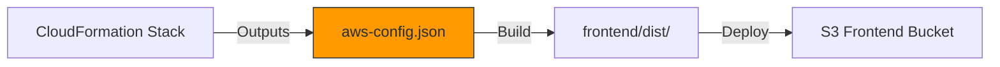

# Development Workflow Guide

**Version**: 2.1  
**Date**: January 1, 2026  
**Status**: Production Ready - EventBridge Security Enhancements Complete  

Complete guide for developing, testing, and deploying the AWS DRS Orchestration Solution with EventBridge security enhancements and tag synchronization automation.

## Development Environment Setup

### Prerequisites

- AWS Account with DRS configured and source servers replicating
- AWS CLI v2 configured with appropriate permissions
- Node.js 18+ and npm for frontend development
- Python 3.12+ for Lambda development
- S3 bucket for deployment artifacts

### Local Development Setup

```bash
# Clone repository
git clone <repository-url>
cd aws-drs-orchestration

# Frontend setup
cd frontend
npm install
npm run dev      # Development server at localhost:5173

# Backend setup
cd lambda
pip install -r requirements.txt
```

### Frontend Configuration (CRITICAL)

The `frontend/public/aws-config.json` file contains environment-specific Cognito and API Gateway values. **This file is gitignored and must NOT be committed.**



**Why this matters:**
- `aws-config.json` contains stack-specific values (UserPoolId, UserPoolClientId, ApiEndpoint)
- Committing old values causes "User pool client does not exist" errors after stack updates
- GitHub Actions generates this file fresh from CloudFormation outputs during deployment

**Local Development Setup:**
```bash
# Get current values from your deployed stack
STACK_NAME="aws-elasticdrs-orchestrator-dev"

# Create local aws-config.json from stack outputs
cat > frontend/public/aws-config.json << EOF
{
  "region": "us-east-1",
  "userPoolId": "$(aws cloudformation describe-stacks --stack-name $STACK_NAME --query 'Stacks[0].Outputs[?OutputKey==`UserPoolId`].OutputValue' --output text)",
  "userPoolClientId": "$(aws cloudformation describe-stacks --stack-name $STACK_NAME --query 'Stacks[0].Outputs[?OutputKey==`UserPoolClientId`].OutputValue' --output text)",
  "identityPoolId": "$(aws cloudformation describe-stacks --stack-name $STACK_NAME --query 'Stacks[0].Outputs[?OutputKey==`IdentityPoolId`].OutputValue' --output text)",
  "apiEndpoint": "$(aws cloudformation describe-stacks --stack-name $STACK_NAME --query 'Stacks[0].Outputs[?OutputKey==`ApiEndpoint`].OutputValue' --output text)"
}
EOF
```

**Reference template:** See `frontend/public/aws-config.template.json` for the expected structure.

## CI/CD Pipeline Integration

### GitHub Actions Infrastructure (MANDATORY)

**ALL deployments MUST use GitHub Actions CI/CD pipeline. Manual deployment scripts are for emergencies only.**

The project uses **GitHub Actions** for automated deployment with OIDC-based AWS authentication (no long-lived credentials).

| Component | Description |
|-----------|-------------|
| **Workflow** | `.github/workflows/deploy.yml` |
| **Repository** | GitHub (`johnjcousens/aws-elasticdrs-orchestrator`) |
| **Authentication** | OIDC (OpenID Connect) |
| **OIDC Stack** | `cfn/github-oidc-stack.yaml` |
| **Account** | ***REMOVED*** |
| **Deployment Bucket** | `aws-elasticdrs-orchestrator` |
| **Current Stack** | `aws-elasticdrs-orchestrator-dev` |
| **Project Name** | `aws-elasticdrs-orchestrator` |

### Pipeline Stages

1. **Detect Changes** (~10s) - Analyzes changed files to determine deployment scope
2. **Validate** (~2 min) - CloudFormation validation, Python linting, TypeScript checking
3. **Security Scan** (~2 min) - Bandit security scan, Safety dependency check
4. **Build** (~3 min) - Lambda packaging, frontend build
5. **Test** (~2 min) - Unit tests
6. **Deploy Infrastructure** (~10 min) - CloudFormation stack deployment
7. **Deploy Frontend** (~2 min) - S3 sync, CloudFront invalidation

**Total Duration**: ~22 minutes for complete deployment

**Intelligent Pipeline Optimization**:
- **Documentation-only**: ~30 seconds (95% time savings)
- **Frontend-only**: ~12 minutes (45% time savings)  
- **Full deployment**: ~22 minutes (complete pipeline)

**Lambda Functions Covered (7 total)**:
- `api-handler` - Main API handler
- `orchestration-stepfunctions` - Step Functions orchestration
- `execution-finder` - EventBridge execution finder
- `execution-poller` - DRS job status polling
- `frontend-builder` - Frontend build automation
- `bucket-cleaner` - S3 bucket cleanup
- `notification-formatter` - Notification formatting

### Development Workflow Options

#### Option 1: GitHub Actions CI/CD (MANDATORY for Production)

⚠️ **CRITICAL**: Always check for running workflows before pushing to prevent deployment conflicts.

```bash
# MANDATORY: Check for running workflows before pushing
./scripts/check-workflow.sh && git push origin main

# OR use the safe push script (RECOMMENDED)
./scripts/safe-push.sh

# Monitor deployment at:
# https://github.com/johnjcousens/aws-elasticdrs-orchestrator/actions
```

**Prerequisites (One-time Setup)**:
```bash
# Install GitHub CLI
brew install gh

# Authenticate with GitHub
gh auth login
```

**Workflow Conflict Prevention Rules**:
1. **ALWAYS check for running workflows** before pushing
2. **NEVER push while a deployment is in progress** - causes conflicts and failures
3. **WAIT for completion** if a workflow is running (max 30 minutes)
4. **Use safe-push.sh script** instead of manual `git push`

#### Option 2: Emergency Manual Deployment (RESTRICTED)

**ONLY use manual deployment for:**
- GitHub Actions service outage (confirmed AWS/GitHub issue)
- Critical production hotfix when pipeline is broken
- Pipeline debugging (with immediate Git follow-up)

```bash
# EMERGENCY ONLY: Fast Lambda code update
./scripts/sync-to-deployment-bucket.sh --update-lambda-code  # ~5 seconds

# IMMEDIATELY follow up with proper Git commit
git add .
git commit -m "emergency: describe the critical fix"
git push  # Restores proper CI/CD tracking
```

### When to Use Each Approach

| Scenario | Recommended Approach | Duration |
|----------|---------------------|----------|
| **Daily Development** | Manual deployment with `--update-lambda-code` | ~5 seconds |
| **Infrastructure Changes** | Manual deployment with `--deploy-cfn` | ~5-10 minutes |
| **Production Releases** | GitHub Actions CI/CD | ~20 minutes |
| **Team Collaboration** | GitHub Actions CI/CD | ~20 minutes |
| **Security Validation** | GitHub Actions CI/CD (includes security scanning) | ~20 minutes |

### S3 Deployment Bucket Structure

The S3 bucket serves as the source of truth for all deployable artifacts:

```
s3://aws-elasticdrs-orchestrator/
├── cfn/                          # CloudFormation templates (7 total)
├── lambda/                       # Lambda deployment packages (5 functions)
├── frontend/                     # Frontend build artifacts
├── scripts/                      # Deployment and automation scripts
└── docs/                         # Documentation (synced for reference)
```

### Manual Deployment Script Options (EMERGENCY ONLY)

⚠️ **WARNING**: These bypass GitHub Actions and should only be used in emergencies.

```bash
# Basic operations
./scripts/sync-to-deployment-bucket.sh                    # Sync all to S3
./scripts/sync-to-deployment-bucket.sh --deploy-cfn       # Deploy CloudFormation
./scripts/sync-to-deployment-bucket.sh --update-lambda-code  # Update all Lambda functions

# Advanced operations
./scripts/sync-to-deployment-bucket.sh --dry-run          # Preview changes
./scripts/sync-to-deployment-bucket.sh --profile prod     # Use specific AWS profile
./scripts/sync-to-deployment-bucket.sh --validate         # Run local validation pipeline

# Frontend operations
./scripts/sync-to-deployment-bucket.sh --build-frontend   # Build frontend first
./scripts/sync-to-deployment-bucket.sh --deploy-frontend  # Deploy to CloudFront

# Emergency deployment with all safety checks
./scripts/sync-to-deployment-bucket.sh --emergency-deploy --update-lambda-code
```

**Prohibited Practices**:
- ❌ Use sync script for regular development
- ❌ Deploy "quick fixes" without Git tracking
- ❌ Bypass pipeline for convenience
- ❌ Skip the pipeline "just this once"
- ❌ Push while GitHub Actions workflow is running

## Stack Configuration

### Current Working Stack (PRIMARY)

- **Stack Name**: `aws-elasticdrs-orchestrator-dev`
- **Project Name**: `aws-elasticdrs-orchestrator`
- **Environment**: `dev`
- **Lambda Functions**: `aws-elasticdrs-orchestrator-*-dev` naming pattern
- **API Gateway URL**: `https://***REMOVED***.execute-api.us-east-1.amazonaws.com/dev`
- **Frontend URL**: `https://d2d8elt2tpmz1z.cloudfront.net`
- **Cognito User Pool ID**: `***REMOVED***`
- **Cognito Client ID**: `***REMOVED***`

### Authentication (Test User)
- **Username**: `***REMOVED***`
- **Password**: `***REMOVED***`
- **Role**: Admin (full access)

### S3 Deployment Bucket Structure

The S3 bucket serves as the source of truth for all deployable artifacts:

```
s3://aws-elasticdrs-orchestrator/
├── cfn/                          # CloudFormation templates (15+ total)
├── lambda/                       # Lambda deployment packages (7 functions)
│   ├── api-handler.zip
│   ├── orchestration-stepfunctions.zip
│   ├── execution-finder.zip
│   ├── execution-poller.zip
│   ├── frontend-builder.zip
│   ├── bucket-cleaner.zip
│   └── notification-formatter.zip
├── frontend/                     # Frontend build artifacts
├── scripts/                      # Deployment and automation scripts
└── docs/                         # Documentation (synced for reference)
```

## Development Commands

### Frontend Development

```bash
cd frontend
npm install                    # Install dependencies
npm run dev                    # Start dev server (http://localhost:5173)
npm run build                  # Production build
npm run preview                # Preview production build
npm run lint                   # ESLint validation
npm run test                   # Run unit tests
npm run test:watch             # Run tests in watch mode
npm run test:coverage          # Run tests with coverage
```

### Lambda Development

```bash
cd lambda
pip install -r requirements.txt

# Use sync script for deployment (recommended)
./scripts/sync-to-deployment-bucket.sh --update-lambda-code
```

### CloudFormation Validation

```bash
make validate    # AWS validate-template
make lint        # cfn-lint validation
make all         # Complete validation pipeline
```

## Testing

### Frontend Testing

Unit tests for frontend services using Vitest:

```bash
cd frontend
npm run test           # Run all tests once
npm run test:watch     # Run tests in watch mode
npm run test:coverage  # Run tests with coverage report
```

### Backend Testing

Python unit tests for Lambda functions:

```bash
cd tests/python
pip install -r requirements.txt
python -m pytest unit/test_drs_service_limits.py -v
pytest unit/                   # Run unit tests
pytest integration/            # Run integration tests
pytest --cov=lambda            # Run with coverage
```

### End-to-End Testing

```bash
cd tests/playwright
npm install
npx playwright test            # Run all tests
npx playwright test --ui       # Interactive UI mode
npx playwright show-report     # View test report
```

## Deployment Verification

After deployment, verify the correct resources are updated:

```bash
# Check CloudFront URL matches your environment
aws cloudformation describe-stacks \
  --stack-name aws-elasticdrs-orchestrator-dev \
  --query 'Stacks[0].Outputs[?OutputKey==`CloudFrontUrl`].OutputValue' \
  --output text

# Verify Lambda function was updated
aws lambda get-function \
  --function-name aws-elasticdrs-orchestrator-api-handler-dev \
  --query 'Configuration.LastModified' \
  --output text

# Check API Gateway endpoint
curl https://***REMOVED***.execute-api.us-east-1.amazonaws.com/dev/health

# Verify all Lambda functions are deployed
for func in api-handler orchestration-stepfunctions execution-finder execution-poller frontend-builder bucket-cleaner notification-formatter; do
  echo "Checking aws-elasticdrs-orchestrator-${func}-dev..."
  aws lambda get-function --function-name aws-elasticdrs-orchestrator-${func}-dev --query 'Configuration.LastModified' --output text
done
```

## Makefile Targets

```bash
make help                      # Show all available targets
make install                   # Install validation tools
make validate                  # Validate CloudFormation templates
make lint                      # Run cfn-lint
make sync-s3                   # Sync to S3 deployment bucket
make sync-s3-dry-run          # Preview S3 sync
make deploy                    # Deploy CloudFormation stack
make deploy-lambda             # Deploy Lambda code only
make deploy-frontend           # Build and deploy frontend
make create-test-user          # Create Cognito test user
make test                      # Run E2E tests
make clean                     # Clean build artifacts
```

## Git Workflow

### Repository Snapshots & Rollback

The repository uses Git tags to mark significant milestones:

| Tag                                | Description                                                               | Date              |
| ---------------------------------- | ------------------------------------------------------------------------- | ----------------- |
| `v2.0.0-mvp-drill-prototype` | **MVP Drill Only Prototype v2.0** - Core drill functionality with comprehensive documentation | December 30, 2025 |
| `mvp-demo-ready`                 | MVP Demo Ready - Complete working state with all core features | December 9, 2025  |

### Create a New Tag

```bash
# Create annotated tag (recommended)
git tag -a my-tag-name -m "Description of this milestone"

# Push tag to remote
git push origin my-tag-name
```

### Rollback to a Tag

```bash
# View the repository at the tagged state
git checkout mvp-demo-ready

# Create a new branch from tag for development
git checkout -b my-feature-branch mvp-demo-ready

# Return to main branch
git checkout main
```

## Troubleshooting

### Common Development Issues

| Issue | Cause | Solution |
|-------|-------|----------|
| Lambda deployment fails | Code not synced to S3 | Run sync script first |
| Frontend not updating | CloudFront cache | Run with `--deploy-frontend` |
| Stack name mismatch | Using wrong stack name | Use `drs-orch-v4` |
| Permission errors | Wrong AWS profile | Use `--profile` option |
| "User pool client does not exist" | Stale `aws-config.json` | Regenerate from stack outputs (see below) |
| CORS 403 errors | API Gateway not redeployed | Run `scripts/redeploy-api-gateway.sh` |

### Fixing "User pool client does not exist" Error

This error occurs when `aws-config.json` contains old Cognito values from a previous stack deployment.

**Root Cause:** The `frontend/public/aws-config.json` file was committed or synced with old stack values.

**Solution:**
```bash
# 1. Regenerate aws-config.json from current stack
STACK_NAME="aws-elasticdrs-orchestrator-dev"

cat > frontend/public/aws-config.json << EOF
{
  "region": "us-east-1",
  "userPoolId": "$(aws cloudformation describe-stacks --stack-name $STACK_NAME --query 'Stacks[0].Outputs[?OutputKey==`UserPoolId`].OutputValue' --output text)",
  "userPoolClientId": "$(aws cloudformation describe-stacks --stack-name $STACK_NAME --query 'Stacks[0].Outputs[?OutputKey==`UserPoolClientId`].OutputValue' --output text)",
  "identityPoolId": "$(aws cloudformation describe-stacks --stack-name $STACK_NAME --query 'Stacks[0].Outputs[?OutputKey==`IdentityPoolId`].OutputValue' --output text)",
  "apiEndpoint": "$(aws cloudformation describe-stacks --stack-name $STACK_NAME --query 'Stacks[0].Outputs[?OutputKey==`ApiEndpoint`].OutputValue' --output text)"
}
EOF

# 2. Rebuild and redeploy frontend
cd frontend && npm run build && cd ..
./scripts/sync-to-deployment-bucket.sh --deploy-frontend
```

**Prevention:**
- `frontend/public/aws-config.json` is gitignored - never commit it
- GitHub Actions generates this file fresh from CloudFormation outputs
- The sync script excludes `aws-config.json` and regenerates it from stack outputs

### Fixing CORS 403 Errors

If OPTIONS requests return 403 instead of 200, the API Gateway deployment may not have been applied to the stage.

**Solution:**
```bash
# Redeploy API Gateway
./scripts/redeploy-api-gateway.sh aws-elasticdrs-orchestrator-dev us-east-1
```

This script:
1. Gets the API ID from CloudFormation outputs
2. Creates a new API Gateway deployment
3. Verifies OPTIONS endpoints return 200

### Deployment Recovery

If deployment fails, see the [Deployment Recovery Guide](DEPLOYMENT_RECOVERY_GUIDE.md) for complete recovery procedures.

## Best Practices

1. **Always sync before deploy**: Never deploy directly from local files
2. **Use S3 versioning**: Enables rollback to previous versions
3. **Tag deployments**: Use git commit hash as S3 object metadata
4. **Validate before deploy**: Run `make validate lint` before deploying
5. **Test in dev first**: Deploy to dev environment before production
6. **Monitor deployments**: Watch CloudFormation events during deployment
7. **Keep artifacts in sync**: Local code, S3 artifacts, and deployed resources should match

## Recent Updates

**December 30, 2025**: History Page Enhancements and Critical Bug Fixes - Major improvements to execution history management and status reporting.

**December 20, 2025**: Dashboard Auto-Detect Busiest DRS Region - Dashboard automatically detects and displays the region with the most replicating servers.

**December 17, 2025**: Complete EC2 Instance Type Support Enhancement - Enhanced EC2 Launch Configuration to display ALL available instance types supported by DRS.

**December 17, 2025**: MVP Drill Only Prototype v2.0 Released - Core drill functionality with comprehensive documentation.

For complete development setup including local environment configuration, see the [Local Development Guide](LOCAL_DEVELOPMENT.md).