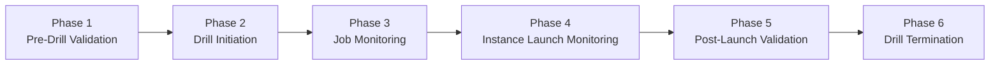
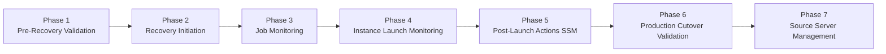
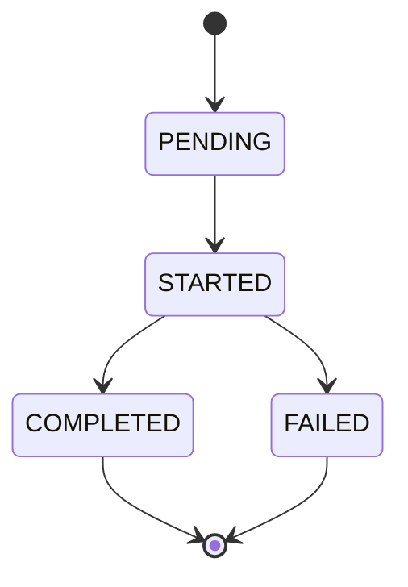
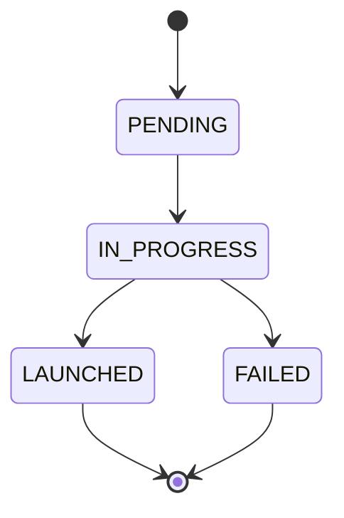
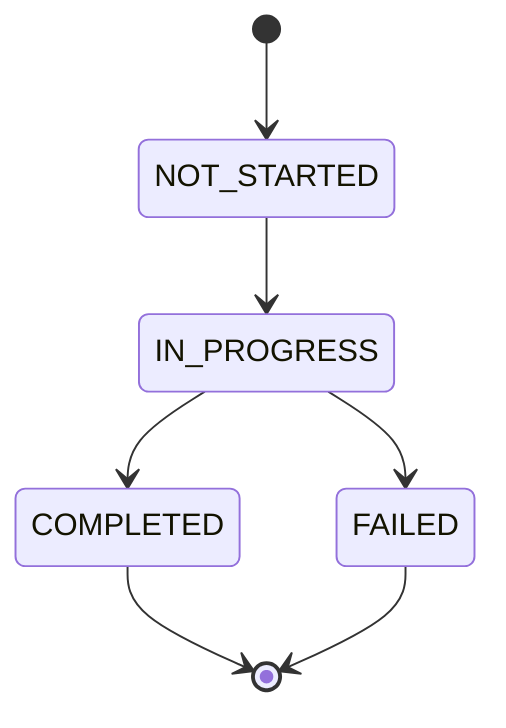

# AWS DRS Execution Walkthrough - Complete API Reference

**Document Version**: 2.1  
**Last Updated**: January 1, 2026  
**Status**: Production Ready - EventBridge Security Enhancements Complete  
**Purpose**: Complete walkthrough of AWS DRS API calls for both drill and recovery operations

---

## Overview

This document provides detailed walkthroughs of AWS DRS API call sequences for both **drill execution** (testing) and **production recovery** (failover) operations, including all status markers, state transitions, and response structures with EventBridge security validation.

## Execution Types Comparison

| Aspect | Drill Execution | Production Recovery |
|--------|-----------------|---------------------|
| `isDrill` parameter | `true` | `false` |
| Instance purpose | Testing only | Production workload |
| Post-launch actions | Optional | Typically required |
| Source replication | Continues | May stop (depends on strategy) |
| Cleanup | Always terminate | Keep running |
| Risk level | Low (isolated) | High (production impact) |
| EventBridge validation | Standard | Enhanced security validation |

---

## Part 1: Drill Execution Walkthrough

### Drill Execution Lifecycle



### Phase 1: Pre-Drill Validation

#### API Call 1: DescribeSourceServers

**Purpose**: Verify source servers are ready for drill

**Request**:
```python
import boto3
drs = boto3.client('drs', region_name='us-east-1')

response = drs.describe_source_servers(
    filters={
        'sourceServerIDs': ['s-1234567890abcdef0', 's-abcdef1234567890']
    }
)
```

**Response Structure**:
```json
{
  "items": [
    {
      "sourceServerID": "s-1234567890abcdef0",
      "arn": "arn:aws:drs:us-east-1:123456789012:source-server/s-1234567890abcdef0",
      "dataReplicationInfo": {
        "dataReplicationState": "CONTINUOUS",
        "lagDuration": "PT30S"
      },
      "lifeCycle": {
        "state": "READY_FOR_RECOVERY"
      },
      "sourceProperties": {
        "identificationHints": {
          "hostname": "web-server-01"
        },
        "recommendedInstanceType": "m5.large"
      }
    }
  ]
}
```

**Key Status Checks**:
- ✅ `dataReplicationState` = `"CONTINUOUS"` (ready for drill)
- ✅ `lifeCycle.state` = `"READY_FOR_RECOVERY"`
- ❌ `dataReplicationState` = `"INITIAL_SYNC"` (not ready)
- ❌ `dataReplicationState` = `"STALLED"` (replication issue)

### Phase 2: Drill Initiation

#### API Call 2: StartRecovery (Drill Mode)

**Purpose**: Launch drill instances

**Request**:
```python
response = drs.start_recovery(
    sourceServers=[
        {
            'sourceServerID': 's-1234567890abcdef0',
            'recoveryInstanceProperties': {
                'targetInstanceTypeRightSizingMethod': 'BASIC'
            }
        }
    ],
    isDrill=True,  # ← CRITICAL: This makes it a drill
    tags={
        'RecoveryPlan': 'WebApp-DR-Plan',
        'Wave': '1',
        'ExecutionType': 'Drill'
    }
)
```

**Response Structure**:
```json
{
  "job": {
    "jobID": "job-drill-1234567890abcdef",
    "arn": "arn:aws:drs:us-east-1:123456789012:job/job-drill-1234567890abcdef",
    "type": "LAUNCH",
    "initiatedBy": "START_RECOVERY",
    "creationDateTime": "2026-01-01T14:30:00.000Z",
    "status": "PENDING",
    "participatingServers": [
      {
        "sourceServerID": "s-1234567890abcdef0",
        "launchStatus": "PENDING"
      }
    ],
    "tags": {
      "ExecutionType": "Drill"
    }
  }
}
```

### Phase 3: Job Status Monitoring

#### API Call 3: DescribeJobs (Polling Loop)

**Request** (Poll every 30 seconds):
```python
import time

job_id = "job-drill-1234567890abcdef"

while True:
    response = drs.describe_jobs(filters={'jobIDs': [job_id]})
    job = response['items'][0]
    print(f"Job Status: {job['status']}")
    
    if job['status'] in ['COMPLETED', 'FAILED']:
        break
    
    time.sleep(30)
```

**Response Progression**:

**State 1: PENDING → STARTED** (0-30 seconds)
```json
{
  "items": [{
    "jobID": "job-drill-1234567890abcdef",
    "status": "STARTED",
    "participatingServers": [{
      "sourceServerID": "s-1234567890abcdef0",
      "launchStatus": "PENDING"
    }]
  }]
}
```

**State 2: STARTED (Launching)** (30 seconds - 5 minutes)
```json
{
  "items": [{
    "status": "STARTED",
    "participatingServers": [{
      "sourceServerID": "s-1234567890abcdef0",
      "launchStatus": "LAUNCHED",
      "recoveryInstanceID": "i-0987654321fedcba0"
    }]
  }]
}
```

**State 3: COMPLETED** (5-15 minutes)
```json
{
  "items": [{
    "status": "COMPLETED",
    "endDateTime": "2026-01-01T14:38:45.000Z",
    "participatingServers": [{
      "sourceServerID": "s-1234567890abcdef0",
      "launchStatus": "LAUNCHED",
      "recoveryInstanceID": "i-0987654321fedcba0"
    }]
  }]
}
```

### Phase 4: Instance Launch Monitoring

#### API Call 4: DescribeRecoveryInstances

**Purpose**: Get detailed instance information

**Request**:
```python
response = drs.describe_recovery_instances(
    filters={'sourceServerIDs': ['s-1234567890abcdef0']}
)
```

**Response Structure**:
```json
{
  "items": [{
    "recoveryInstanceID": "i-0987654321fedcba0",
    "sourceServerID": "s-1234567890abcdef0",
    "ec2InstanceID": "i-0987654321fedcba0",
    "ec2InstanceState": "running",
    "jobID": "job-drill-1234567890abcdef",
    "isDrill": true,
    "pointInTime": "2026-01-01T14:29:00.000Z",
    "tags": {
      "Name": "DRS-Drill-web-server-01",
      "DRS-Drill": "true"
    }
  }]
}
```

### Phase 5: Post-Launch Validation

#### API Call 5: DescribeRecoverySnapshots

**Purpose**: Verify recovery point used

**Request**:
```python
response = drs.describe_recovery_snapshots(
    sourceServerID='s-1234567890abcdef0'
)
```

### Phase 6: Drill Termination

#### API Call 6: TerminateRecoveryInstances

**Purpose**: Clean up drill instances

**Request**:
```python
response = drs.terminate_recovery_instances(
    recoveryInstanceIDs=['i-0987654321fedcba0']
)
```

**Response Structure**:
```json
{
  "job": {
    "jobID": "job-terminate-9876543210fedcba",
    "type": "TERMINATE",
    "status": "STARTED",
    "participatingServers": [{
      "sourceServerID": "s-1234567890abcdef0",
      "recoveryInstanceID": "i-0987654321fedcba0"
    }]
  }
}
```

---

## Part 2: Production Recovery Walkthrough

### Recovery Execution Lifecycle



### Phase 1: Pre-Recovery Validation

#### API Call 1: DescribeSourceServers (Enhanced Validation)

**Purpose**: Verify servers ready for production recovery

**Request**:
```python
response = drs.describe_source_servers(
    filters={'sourceServerIDs': ['s-1234567890abcdef0']}
)
```

**Critical Validation Checks**:
```python
for server in response['items']:
    data_rep = server['dataReplicationInfo']
    lifecycle = server['lifeCycle']
    
    # MUST be CONTINUOUS for production recovery
    assert data_rep['dataReplicationState'] == 'CONTINUOUS'
    assert lifecycle['state'] == 'READY_FOR_RECOVERY'
    
    # Check replication lag (should be minimal)
    lag = data_rep.get('lagDuration', 'PT0S')
    print(f"Replication lag: {lag}")  # e.g., "PT30S" = 30 seconds
```

### Phase 2: Recovery Initiation

#### API Call 2: StartRecovery (Production Mode)

**Purpose**: Launch production recovery instances

**Request**:
```python
response = drs.start_recovery(
    sourceServers=[{
        'sourceServerID': 's-1234567890abcdef0',
        'recoveryInstanceProperties': {
            'targetInstanceTypeRightSizingMethod': 'BASIC'
        }
    }],
    isDrill=False,  # ← CRITICAL: Production recovery
    tags={
        'RecoveryPlan': 'WebApp-DR-Plan',
        'Wave': '1',
        'ExecutionType': 'Recovery',
        'Environment': 'Production'
    }
)
```

### Phase 3: Job Status Monitoring (Enhanced)

**Status Progression with Post-Launch Actions**:

**T+8m: Post-Launch Actions Running**
```json
{
  "status": "STARTED",
  "participatingServers": [{
    "launchStatus": "LAUNCHED",
    "recoveryInstanceID": "i-0987654321fedcba0",
    "postLaunchActionsStatus": "IN_PROGRESS"
  }]
}
```

**T+15m: COMPLETED**
```json
{
  "status": "COMPLETED",
  "endDateTime": "2026-01-01T14:45:00.000Z",
  "participatingServers": [{
    "launchStatus": "LAUNCHED",
    "postLaunchActionsStatus": "COMPLETED"
  }]
}
```

### Phase 4: Instance Launch Monitoring (Production)

#### API Call 4: DescribeRecoveryInstances

**Response Structure**:
```json
{
  "items": [{
    "recoveryInstanceID": "i-0987654321fedcba0",
    "sourceServerID": "s-1234567890abcdef0",
    "ec2InstanceID": "i-0987654321fedcba0",
    "ec2InstanceState": "running",
    "jobID": "job-recovery-1234567890abcdef",
    "isDrill": false,
    "pointInTime": "2026-01-01T14:29:00.000Z",
    "postLaunchActionsDeployment": {
      "status": "COMPLETED",
      "ssmAgentDiscoveryDateTime": "2026-01-01T14:35:00.000Z"
    },
    "tags": {
      "Name": "web-server-01-recovery",
      "Environment": "Production"
    }
  }]
}
```

### Phase 5: Post-Launch Actions (SSM)

#### API Call 5: GetLaunchConfiguration

**Purpose**: Verify post-launch actions configured

**Response Structure**:
```json
{
  "postLaunchActions": {
    "deployment": "TEST_AND_CUTOVER",
    "s3LogBucket": "drs-logs-bucket",
    "cloudWatchLogGroupName": "/aws/drs/post-launch",
    "ssmDocuments": [{
      "actionName": "health-check",
      "ssmDocumentName": "AWS-RunShellScript",
      "timeoutSeconds": 300,
      "mustSucceedForCutover": true,
      "parameters": {
        "commands": ["systemctl status nginx"]
      }
    }]
  }
}
```

### Phase 6: Production Cutover Validation

#### API Call 7: EC2 DescribeInstances (Validation)

**Purpose**: Verify instance health and networking

**Request**:
```python
ec2 = boto3.client('ec2', region_name='us-east-1')

response = ec2.describe_instances(
    InstanceIds=['i-0987654321fedcba0']
)
```

### Phase 7: Source Server Management

#### Option A: Disconnect Source Server

**Purpose**: Stop replication after successful recovery

**Request**:
```python
response = drs.disconnect_source_server(
    sourceServerID='s-1234567890abcdef0'
)
```

**⚠️ WARNING**: This is permanent - server must be re-added for future protection

#### Option B: Reverse Replication (Failback Preparation)

**Purpose**: Prepare for eventual failback to source

**Request**:
```python
response = drs.reverse_replication(
    recoveryInstanceID='i-0987654321fedcba0'
)
```

---

## EventBridge Security Integration (v2.1)

### Security Validation for DRS Operations

**Enhanced Security Checks**:
```python
def validate_drs_operation_security(source_server_id, operation_type):
    """Enhanced security validation for DRS operations"""
    
    # IP validation
    client_ip = get_client_ip()
    if not validate_ip_whitelist(client_ip):
        raise SecurityError("IP not authorized for DRS operations")
    
    # Temporal validation
    if not validate_time_window(operation_type):
        raise SecurityError("Operation not permitted during current time window")
    
    # Request structure validation
    if not validate_request_structure(source_server_id, operation_type):
        raise SecurityError("Invalid request structure")
    
    # Log security validation
    log_security_event("DRS_OPERATION_VALIDATED", {
        "sourceServerId": source_server_id,
        "operationType": operation_type,
        "clientIp": client_ip,
        "timestamp": datetime.utcnow().isoformat()
    })
```

### EventBridge Rule Validation

**Automated Security Monitoring**:
```python
# EventBridge rule for monitoring DRS operations
{
  "Rules": [{
    "Name": "drs-security-monitoring",
    "EventPattern": {
      "source": ["aws.drs"],
      "detail-type": ["DRS Job State Change"],
      "detail": {
        "state": ["STARTED", "COMPLETED", "FAILED"]
      }
    },
    "Targets": [{
      "Id": "1",
      "Arn": "arn:aws:lambda:us-east-1:123456789012:function:drs-security-validator"
    }]
  }]
}
```

---

## Complete Execution Timelines

### Drill Execution Timeline
```
Time    | API Call                    | Status
--------|-----------------------------|---------------------------------
T+0s    | DescribeSourceServers       | Validate servers ready
T+5s    | StartRecovery (isDrill)     | Job created (PENDING)
T+30s   | DescribeJobs                | Job status: STARTED
T+3m    | DescribeJobs                | launchStatus: LAUNCHED
T+8m    | DescribeJobs                | Job status: COMPLETED
T+8m    | DescribeRecoveryInstances   | Get instance details
T+30m   | TerminateRecoveryInstances  | Cleanup initiated
T+40m   | DescribeJobs (termination)  | Termination COMPLETED
```

### Production Recovery Timeline
```
Time    | API Call                      | Status
--------|-------------------------------|----------------------------------
T+0s    | DescribeSourceServers         | Validate CONTINUOUS replication
T+5s    | StartRecovery (isDrill=false) | Job created (PENDING)
T+30s   | DescribeJobs                  | Job status: STARTED
T+3m    | DescribeJobs                  | launchStatus: LAUNCHED
T+5m    | DescribeRecoveryInstances     | ec2InstanceState: running
T+7m    | DescribeJobs                  | postLaunchActionsStatus: IN_PROGRESS
T+15m   | DescribeJobs                  | Job status: COMPLETED
T+16m   | EC2 DescribeInstances         | Validate networking
T+30m   | DisconnectSourceServer        | Stop source replication (optional)
```

---

## Status Marker Reference

### Job Status Progression


### Launch Status Progression (Per Server)


### Post-Launch Actions Status


---

## Production Implementation Examples

### Drill Executor Class
```python
class DRSDrillExecutor:
    def __init__(self, region='us-east-1'):
        self.drs = boto3.client('drs', region_name=region)
    
    def execute_drill(self, source_server_ids):
        """Execute complete drill with monitoring"""
        
        # Phase 1: Validate
        if not self._validate_servers(source_server_ids):
            return False
        
        # Phase 2: Start drill
        job_id = self._start_drill(source_server_ids)
        if not job_id:
            return False
        
        # Phase 3: Monitor job
        if not self._monitor_job(job_id):
            return False
        
        # Phase 4: Get instance details
        instances = self._get_recovery_instances(source_server_ids)
        print(f"✅ Drill completed: {len(instances)} instances launched")
        return True
```

### Recovery Executor Class
```python
class DRSRecoveryExecutor:
    def __init__(self, region='us-east-1'):
        self.drs = boto3.client('drs', region_name=region)
        self.ec2 = boto3.client('ec2', region_name=region)
    
    def execute_recovery(self, source_server_ids):
        """Execute production recovery with full validation"""
        
        # Enhanced security validation (v2.1)
        if not self._validate_security_context():
            return False
        
        # Phase 1: Validate
        if not self._validate_servers(source_server_ids):
            return False
        
        # Phase 2: Start recovery
        job_id = self._start_recovery(source_server_ids)
        if not job_id:
            return False
        
        # Phase 3: Monitor job
        if not self._monitor_job(job_id):
            return False
        
        # Phase 4: Validate instances
        instances = self._get_recovery_instances(source_server_ids)
        
        # Phase 5: Validate post-launch actions
        if not self._validate_post_launch_actions(instances):
            return False
        
        print("✅ Recovery completed successfully")
        return True
```

---

## Summary

**Key Differences Between Drill and Recovery**:
- **Drill**: `isDrill=True`, instances terminated after testing
- **Recovery**: `isDrill=False`, instances remain for production use
- **Security**: Enhanced validation for production recovery operations
- **Post-Launch**: SSM actions typically required for production recovery

**Total API Calls**:
- **Drill**: 7 API calls (including termination)
- **Recovery**: 8+ API calls (including post-launch validation)

**EventBridge Security Enhancements (v2.1)**:
- Multi-layer security validation for all DRS operations
- Automated monitoring and audit trails
- Time-based access controls and IP validation
- Enhanced logging and security event tracking

**Critical Success Factors**:
- Replication state must be CONTINUOUS
- Minimize replication lag before operations
- Monitor post-launch actions completion (recovery)
- Validate application functionality
- Implement proper security validation procedures