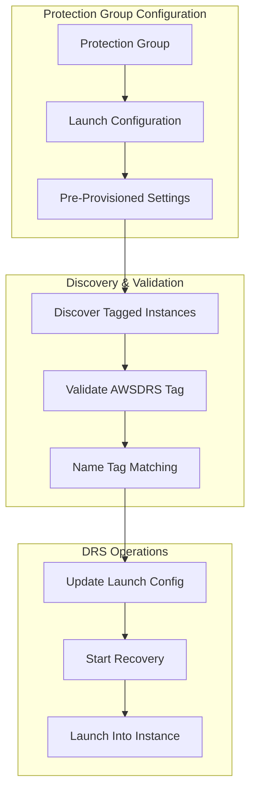

# DRS Pre-Provisioned Instance Recovery

**Version**: 1.0  
**Date**: January 26, 2026  
**Status**: Implementation Ready  

---

## Executive Summary

The `AWSDRS=AllowLaunchingIntoThisInstance` feature enables AWS DRS to launch recovery instances into **pre-existing EC2 instances** instead of creating new ones. This is critical for:

- **Failback Operations**: Recovering back to original source region instances
- **IP Address Preservation**: Instances keep their existing private IPs (preserves last octet)
- **Pre-Provisioned DR Infrastructure**: Reuse stopped instances instead of creating new ones
- **Cost Optimization**: Eliminate instance creation overhead
- **Compliance Requirements**: Maintain specific instance configurations

## Table of Contents

1. [Feature Overview](#feature-overview)
2. [Use Cases](#use-cases)
3. [Core Implementation](#core-implementation)
4. [Configuration Management](#configuration-management)
5. [API Reference](#api-reference)
6. [Testing Strategy](#testing-strategy)
7. [Deployment Plan](#deployment-plan)

---

## Feature Overview

### What It Does

The `AWSDRS=AllowLaunchingIntoThisInstance` tag tells DRS to **launch into an existing EC2 instance** rather than creating a new one. When DRS performs recovery:

1. **Finds the tagged instance** in the target region
2. **Stops the instance** if it's running
3. **Replaces the EBS volumes** with recovery volumes from DRS
4. **Starts the instance** with the recovered data
5. **Preserves the instance metadata** (private IP, security groups, etc.)

### Key Benefits

- **IP Address Preservation**: Instance keeps its existing private IP address (critical for failback)
- **Network Configuration**: Security groups, subnets, and network interfaces remain unchanged
- **Cost Efficiency**: Reuses existing instances instead of creating new ones
- **Faster Recovery**: No instance launch time, just volume replacement
- **Compliance**: Maintains pre-approved instance configurations

---

## Use Cases

### 1. Failback to Original Source Region

**Scenario**: After failing over to DR region, fail back to original source region instances.

**Requirements**:
- Original source instances tagged with `AWSDRS=AllowLaunchingIntoThisInstance`
- Name tag matching between source and target instances
- Instances in stopped state (or will be stopped automatically)

**Workflow**:
```
Primary Region (us-east-1)          DR Region (us-west-2)
┌─────────────────────┐            ┌─────────────────────┐
│ db-server-01        │  Failover  │ db-server-01        │
│ 10.0.1.100          │ ────────>  │ 10.1.1.100          │
│ (stopped)           │            │ (running)           │
└─────────────────────┘            └─────────────────────┘
         ▲                                  │
         │            Failback              │
         └──────────────────────────────────┘
         (Launches into original instance,
          preserves 10.0.1.100 IP)
```

### 2. Pre-Provisioned DR Infrastructure

**Scenario**: Pre-create DR instances with specific configurations, reuse during recovery.

**Benefits**:
- Pre-approved instance configurations
- Faster recovery (no instance creation time)
- Predictable IP addressing
- Cost savings (stopped instances have minimal cost)

### 3. IP Address Preservation for Stateful Applications

**Scenario**: Applications with hardcoded IP dependencies require exact IP preservation.

**Examples**:
- Database clusters with IP-based replication
- Legacy applications with IP-based licensing
- Network appliances with IP-based routing

---

## Core Implementation

### Architecture Integration

The solution integrates with existing DRS Orchestration components:



### Backend Implementation

#### 1. Pre-Provisioned Instance Discovery

```python
# New API endpoint: GET /api/v1/drs/pre-provisioned-instances
def get_pre_provisioned_instances(region: str, name_pattern: str = None) -> Dict:
    """Find EC2 instances tagged for DRS pre-provisioned recovery."""
    try:
        ec2_client = boto3.client('ec2', region_name=region)
        
        filters = [
            {
                'Name': 'tag:AWSDRS',
                'Values': ['AllowLaunchingIntoThisInstance']
            },
            {
                'Name': 'instance-state-name',
                'Values': ['running', 'stopped']
            }
        ]
        
        if name_pattern:
            filters.append({
                'Name': 'tag:Name',
                'Values': [f'*{name_pattern}*']
            })
        
        response = ec2_client.describe_instances(Filters=filters)
        
        instances = []
        for reservation in response.get('Reservations', []):
            for instance in reservation.get('Instances', []):
                tags = {tag['Key']: tag['Value'] for tag in instance.get('Tags', [])}
                
                instances.append({
                    'instanceId': instance.get('InstanceId'),
                    'name': tags.get('Name', ''),
                    'instanceType': instance.get('InstanceType'),
                    'state': instance.get('State', {}).get('Name'),
                    'privateIp': instance.get('PrivateIpAddress'),
                    'availabilityZone': instance.get('Placement', {}).get('AvailabilityZone'),
                    'tags': tags
                })
        
        return {
            'instances': instances,
            'count': len(instances),
            'region': region
        }
        
    except Exception as e:
        raise Exception(f'Error discovering pre-provisioned instances: {str(e)}')
```

#### 2. Launch Configuration Validation

```python
def validate_target_instance(instance_id: str, region: str) -> Dict:
    """Validate target instance has AWSDRS=AllowLaunchingIntoThisInstance tag."""
    try:
        ec2_client = boto3.client('ec2', region_name=region)
        response = ec2_client.describe_instances(InstanceIds=[instance_id])
        
        if not response.get('Reservations'):
            return {
                'valid': False,
                'error': f'Instance {instance_id} not found in region {region}'
            }
        
        instance = response['Reservations'][0]['Instances'][0]
        tags = {tag['Key']: tag['Value'] for tag in instance.get('Tags', [])}
        
        if tags.get('AWSDRS') != 'AllowLaunchingIntoThisInstance':
            return {
                'valid': False,
                'error': f'Instance {instance_id} missing required tag AWSDRS=AllowLaunchingIntoThisInstance'
            }
        
        return {
            'valid': True,
            'instanceState': instance.get('State', {}).get('Name'),
            'instanceType': instance.get('InstanceType'),
            'privateIp': instance.get('PrivateIpAddress')
        }
        
    except Exception as e:
        return {
            'valid': False,
            'error': f'Error validating instance: {str(e)}'
        }
```

#### 3. DRS Launch Configuration Application

```python
def build_drs_launch_config(launch_config: Dict, current_config: Dict, server_id: str, region: str) -> Dict:
    """Build DRS launch configuration with pre-provisioned instance support."""
    
    updated_config = {}
    
    # Handle pre-provisioned instance configuration
    if launch_config.get('PreProvisionedInstance', {}).get('enabled'):
        pre_prov = launch_config['PreProvisionedInstance']
        
        if pre_prov.get('targetInstanceId'):
            # Explicit instance ID specified
            updated_config['launchIntoInstanceProperties'] = {
                'launchIntoEC2InstanceID': pre_prov['targetInstanceId']
            }
        elif pre_prov.get('nameTagMatching'):
            # Find instance by name tag matching
            target_instance = find_matching_pre_provisioned_instance(server_id, region)
            if target_instance:
                updated_config['launchIntoInstanceProperties'] = {
                    'launchIntoEC2InstanceID': target_instance['instanceId']
                }
            else:
                raise Exception(f'No matching pre-provisioned instance found for server {server_id}')
        
        # Pre-provisioned instances should use existing configuration
        updated_config['targetInstanceTypeRightSizingMethod'] = 'NONE'
        updated_config['copyPrivateIp'] = False  # Keep existing IP
        
    else:
        # Standard launch configuration
        if 'TargetInstanceTypeRightSizingMethod' in launch_config:
            updated_config['targetInstanceTypeRightSizingMethod'] = launch_config['TargetInstanceTypeRightSizingMethod']
        
        if 'CopyPrivateIp' in launch_config:
            updated_config['copyPrivateIp'] = launch_config['CopyPrivateIp']
    
    # Common settings
    if 'CopyTags' in launch_config:
        updated_config['copyTags'] = launch_config['CopyTags']
    
    if 'LaunchDisposition' in launch_config:
        updated_config['launchDisposition'] = launch_config['LaunchDisposition']
    
    return updated_config

def find_matching_pre_provisioned_instance(server_id: str, region: str) -> Optional[Dict]:
    """Find pre-provisioned instance matching source server by name/hostname."""
    try:
        # Get source server details
        drs_client = boto3.client('drs', region_name=region)
        server_response = drs_client.describe_source_servers(
            filters={'sourceServerIDs': [server_id]}
        )
        
        if not server_response.get('items'):
            return None
        
        server = server_response['items'][0]
        hostname = server.get('sourceProperties', {}).get('identificationHints', {}).get('hostname', '')
        
        if not hostname:
            return None
        
        # Find matching pre-provisioned instance
        ec2_client = boto3.client('ec2', region_name=region)
        response = ec2_client.describe_instances(
            Filters=[
                {
                    'Name': 'tag:Name',
                    'Values': [hostname]
                },
                {
                    'Name': 'tag:AWSDRS',
                    'Values': ['AllowLaunchingIntoThisInstance']
                },
                {
                    'Name': 'instance-state-name',
                    'Values': ['running', 'stopped']
                }
            ]
        )
        
        if response.get('Reservations') and response['Reservations'][0].get('Instances'):
            instance = response['Reservations'][0]['Instances'][0]
            return {
                'instanceId': instance.get('InstanceId'),
                'name': next((tag['Value'] for tag in instance.get('Tags', []) if tag['Key'] == 'Name'), ''),
                'state': instance.get('State', {}).get('Name'),
                'privateIp': instance.get('PrivateIpAddress')
            }
        
        return None
        
    except Exception as e:
        print(f'Error finding matching pre-provisioned instance for {server_id}: {e}')
        return None
```

### Frontend Implementation

#### Launch Configuration Component

```typescript
// In frontend/src/components/LaunchConfigSection.tsx
interface LaunchConfig {
  PreProvisionedInstance?: {
    enabled: boolean;
    targetInstanceId?: string;
    nameTagMatching?: boolean;
  };
}

// Add to LaunchConfigSection component
<ExpandableSection
  variant="container"
  headerText="Pre-Provisioned Instance Recovery"
  headerDescription="Launch into existing EC2 instances instead of creating new ones"
>
  <SpaceBetween direction="vertical" size="m">
    <Checkbox
      checked={launchConfig.PreProvisionedInstance?.enabled || false}
      onChange={({ detail }) => 
        updateConfig('PreProvisionedInstance', {
          ...launchConfig.PreProvisionedInstance,
          enabled: detail.checked
        })
      }
      disabled={disabled}
    >
      Enable pre-provisioned instance recovery
    </Checkbox>

    {launchConfig.PreProvisionedInstance?.enabled && (
      <>
        <FormField
          label="Target Instance Selection"
          description="Choose how to select the target instance for recovery"
        >
          <RadioGroup
            value={launchConfig.PreProvisionedInstance?.nameTagMatching ? 'nameTag' : 'explicit'}
            onChange={({ detail }) => {
              const useNameTag = detail.value === 'nameTag';
              updateConfig('PreProvisionedInstance', {
                ...launchConfig.PreProvisionedInstance,
                nameTagMatching: useNameTag,
                targetInstanceId: useNameTag ? undefined : launchConfig.PreProvisionedInstance?.targetInstanceId
              });
            }}
            items={[
              {
                value: 'nameTag',
                label: 'Automatic by Name tag matching',
                description: 'Find instance with matching Name tag and AWSDRS=AllowLaunchingIntoThisInstance'
              },
              {
                value: 'explicit',
                label: 'Explicit instance selection',
                description: 'Manually select specific instance ID'
              }
            ]}
          />
        </FormField>

        <Alert type="info">
          <strong>Pre-provisioned instance recovery:</strong>
          <ul>
            <li>Instance must have tag <code>AWSDRS=AllowLaunchingIntoThisInstance</code></li>
            <li>Instance will be stopped and volumes replaced during recovery</li>
            <li>Private IP address and network configuration will be preserved</li>
            <li>Instance type right-sizing will be disabled (uses existing instance type)</li>
          </ul>
        </Alert>
      </>
    )}
  </SpaceBetween>
</ExpandableSection>
```

---

## Configuration Management

### Configuration Template System

**Template Structure** (extends existing Protection Group configuration):

```json
{
  "replicationTemplate": {
    "templateId": "standard-pre-provisioned-v1",
    "templateName": "Standard Pre-Provisioned Instance Configuration",
    "applicableScenarios": ["pre-provisioned", "failback"],
    "launchConfiguration": {
      "launchDisposition": "STARTED",
      "licensing": {
        "osByol": false
      },
      "targetInstanceTypeRightSizingMethod": "NONE",
      "copyPrivateIp": false,
      "copyTags": true,
      "preProvisionedInstanceSupport": {
        "enabled": true,
        "requireNameTagMatching": true,
        "allowLaunchIntoExistingInstance": true
      }
    }
  }
}
```

### Name Tag Matching Validation

**Cross-Region Validation**:

```python
def validate_name_tag_matching(primary_region, dr_region, server_tags):
    """Validate Name tag matching between primary and DR regions."""
    
    # Get instances in both regions
    primary_instances = get_instances_by_tags(primary_region, server_tags)
    dr_instances = get_instances_by_tags(dr_region, server_tags)
    
    validation_results = []
    
    for primary_instance in primary_instances:
        primary_name = get_instance_name_tag(primary_instance)
        
        # Find matching DR instance
        matching_dr_instance = None
        for dr_instance in dr_instances:
            dr_name = get_instance_name_tag(dr_instance)
            if primary_name == dr_name:
                matching_dr_instance = dr_instance
                break
        
        validation_results.append({
            'primaryInstanceId': primary_instance['InstanceId'],
            'primaryName': primary_name,
            'drInstanceId': matching_dr_instance['InstanceId'] if matching_dr_instance else None,
            'drName': get_instance_name_tag(matching_dr_instance) if matching_dr_instance else None,
            'matched': matching_dr_instance is not None,
            'hasAllowLaunchingTag': has_allow_launching_tag(matching_dr_instance) if matching_dr_instance else False
        })
    
    return validation_results
```

### Configuration Drift Detection

**Automated Drift Detection** (EventBridge-scheduled):

```python
def detect_configuration_drift(event, context):
    """Detect drift in DRS launch configuration for pre-provisioned instances."""
    
    servers_with_templates = get_servers_with_replication_templates()
    drift_results = []
    
    for server_config in servers_with_templates:
        source_server_id = server_config['sourceServerId']
        template_id = server_config['templateId']
        
        # Get current configuration
        current_config = get_current_launch_configuration(source_server_id)
        expected_config = get_replication_template(template_id)
        
        # Compare configurations
        drift_detected = compare_configurations(current_config, expected_config)
        
        if drift_detected:
            drift_results.append({
                'sourceServerId': source_server_id,
                'templateId': template_id,
                'driftDetails': drift_detected,
                'detectedAt': datetime.utcnow().isoformat()
            })
    
    # Trigger remediation if drift detected
    if drift_results:
        trigger_drift_remediation(drift_results)
    
    return {
        'driftDetected': len(drift_results),
        'results': drift_results
    }
```

---

## API Reference

### REST API Endpoints

```bash
# Discover pre-provisioned instances
GET /api/v1/drs/pre-provisioned-instances?region={region}&namePattern={pattern}

# Validate target instance
POST /api/v1/drs/pre-provisioned-instances/validate
{
  "instanceId": "i-1234567890abcdef0",
  "region": "us-east-1"
}

# Apply replication template
POST /api/v1/drs/replication-templates/apply
{
  "templateId": "standard-pre-provisioned-v1",
  "serverTags": {"Environment": "Production", "DR-Type": "pre-provisioned"}
}

# Validate name tag matching
POST /api/v1/drs/validation/name-tag-matching
{
  "primaryRegion": "us-east-1",
  "drRegion": "us-west-2",
  "serverTags": {"Environment": "Production"}
}

# Detect configuration drift
GET /api/v1/drs/drift-detection/scan

# Remediate configuration drift
POST /api/v1/drs/drift-detection/remediate
{
  "sourceServerId": "s-1234567890abcdef0",
  "remediationType": "automatic"
}
```

### Response Examples

**Pre-Provisioned Instances Discovery**:
```json
{
  "instances": [
    {
      "instanceId": "i-1234567890abcdef0",
      "name": "db-server-01",
      "instanceType": "m5.large",
      "state": "stopped",
      "privateIp": "10.0.1.100",
      "availabilityZone": "us-east-1a",
      "tags": {
        "Name": "db-server-01",
        "AWSDRS": "AllowLaunchingIntoThisInstance",
        "Environment": "Production"
      }
    }
  ],
  "count": 1,
  "region": "us-east-1"
}
```

**Instance Validation**:
```json
{
  "valid": true,
  "instanceState": "stopped",
  "instanceType": "m5.large",
  "privateIp": "10.0.1.100"
}
```

---

## Testing Strategy

### Unit Tests

```python
# tests/python/unit/test_pre_provisioned_instances.py
def test_validate_target_instance_success():
    """Test successful validation of pre-provisioned instance."""
    with patch('boto3.client') as mock_boto3:
        mock_ec2 = Mock()
        mock_boto3.return_value = mock_ec2
        
        mock_ec2.describe_instances.return_value = {
            'Reservations': [{
                'Instances': [{
                    'InstanceId': 'i-1234567890abcdef0',
                    'State': {'Name': 'stopped'},
                    'InstanceType': 'm5.large',
                    'PrivateIpAddress': '10.0.1.100',
                    'Tags': [
                        {'Key': 'Name', 'Value': 'test-instance'},
                        {'Key': 'AWSDRS', 'Value': 'AllowLaunchingIntoThisInstance'}
                    ]
                }]
            }]
        }
        
        result = validate_target_instance('i-1234567890abcdef0', 'us-east-1')
        
        assert result['valid'] is True
        assert result['instanceState'] == 'stopped'
        assert result['privateIp'] == '10.0.1.100'

def test_build_drs_launch_config_pre_provisioned():
    """Test building DRS launch config for pre-provisioned instance."""
    launch_config = {
        'PreProvisionedInstance': {
            'enabled': True,
            'targetInstanceId': 'i-1234567890abcdef0'
        },
        'CopyTags': True,
        'LaunchDisposition': 'STARTED'
    }
    
    result = build_drs_launch_config(launch_config, {}, 's-test', 'us-east-1')
    
    assert result['launchIntoInstanceProperties']['launchIntoEC2InstanceID'] == 'i-1234567890abcdef0'
    assert result['targetInstanceTypeRightSizingMethod'] == 'NONE'
    assert result['copyPrivateIp'] is False
```

### Integration Tests

```python
# tests/python/integration/test_pre_provisioned_integration.py
@mock_ec2
@mock_drs
def test_end_to_end_pre_provisioned_recovery():
    """Test complete pre-provisioned instance recovery flow."""
    
    # Setup mock EC2 instance with AWSDRS tag
    ec2 = boto3.client('ec2', region_name='us-east-1')
    response = ec2.run_instances(
        ImageId='ami-12345678',
        MinCount=1,
        MaxCount=1,
        InstanceType='m5.large'
    )
    instance_id = response['Instances'][0]['InstanceId']
    
    # Tag instance for DRS pre-provisioned recovery
    ec2.create_tags(
        Resources=[instance_id],
        Tags=[
            {'Key': 'Name', 'Value': 'test-recovery-instance'},
            {'Key': 'AWSDRS', 'Value': 'AllowLaunchingIntoThisInstance'}
        ]
    )
    
    # Test discovery API
    instances = get_pre_provisioned_instances('us-east-1')
    assert len(instances['instances']) == 1
    assert instances['instances'][0]['instanceId'] == instance_id
    
    # Test validation
    validation = validate_target_instance(instance_id, 'us-east-1')
    assert validation['valid'] is True
```

---

## Deployment Plan

### Phase 1: Core API Support (Weeks 1-2)
- Extend launch configuration schema
- Add pre-provisioned instance discovery API
- Implement instance validation

### Phase 2: Launch Configuration Application (Weeks 2-3)
- Extend apply_launch_config_to_servers function
- Implement name tag matching logic
- Add DRS launch configuration updates

### Phase 3: Frontend Integration (Weeks 3-4)
- Extend LaunchConfigSection component
- Add pre-provisioned instance selector
- Implement validation UI

### Phase 4: Configuration Management (Weeks 4-5)
- Implement template system
- Add drift detection
- Create auto-remediation logic

### Phase 5: Testing & Documentation (Week 5)
- Complete unit and integration tests
- Update API documentation
- Create user guides

### Deployment Checklist

- [ ] Backend Lambda functions updated
- [ ] Frontend components deployed
- [ ] API endpoints tested
- [ ] CloudFormation templates updated
- [ ] EventBridge rules configured
- [ ] Documentation updated
- [ ] User training completed

---

## Success Criteria

✅ **Discovery**: Pre-provisioned instances discoverable via API  
✅ **Validation**: Instance tags and configuration validated  
✅ **Configuration**: Launch settings applied to DRS source servers  
✅ **Name Matching**: Automatic instance matching by Name tag  
✅ **Recovery**: DRS launches into pre-provisioned instances  
✅ **IP Preservation**: Private IP addresses preserved during recovery  
✅ **Drift Detection**: Configuration drift detected and remediated  
✅ **Testing**: Comprehensive test coverage implemented  
✅ **Documentation**: Complete API and user documentation  

---

## Related Documentation

- [DRS Execution Walkthrough](../guides/DRS_EXECUTION_WALKTHROUGH.md) - Complete recovery procedures
- [API Reference Guide](../guides/API_AND_INTEGRATION_GUIDE.md) - REST API documentation
- [Architecture Documentation](../architecture/ARCHITECTURE.md) - System architecture

---

**Implementation Status**: Ready for Development  
**Estimated Effort**: 5 weeks  
**Dependencies**: DRS Orchestration solution v3.5.0+  
**Risk Level**: Low (extends existing patterns)
