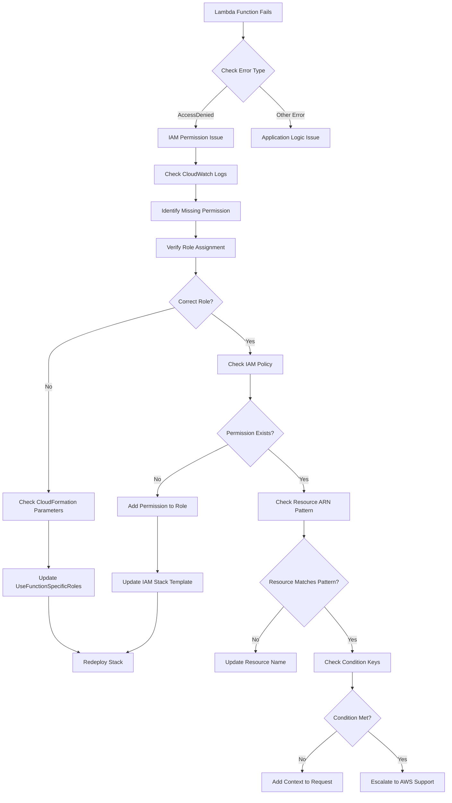
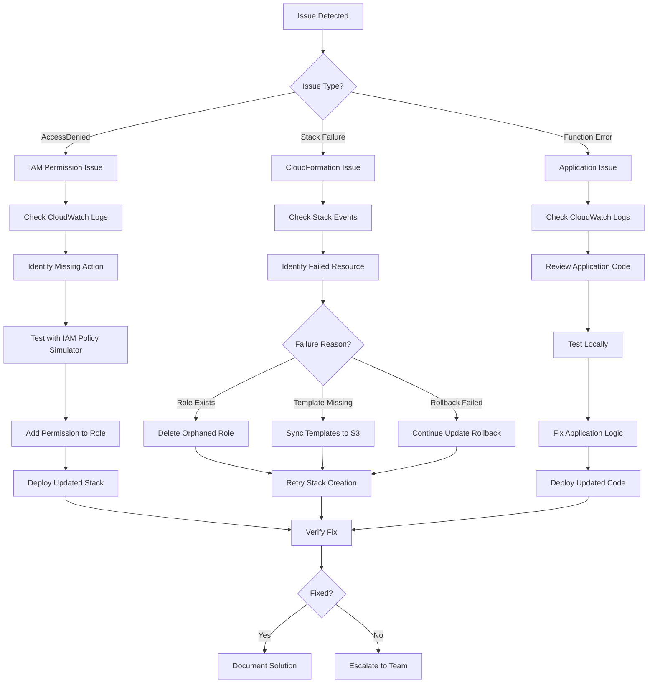

# IAM Troubleshooting Guide

Comprehensive guide for diagnosing and resolving IAM permission issues, CloudFormation deployment errors, and operational problems with function-specific IAM roles.

## Table of Contents

1. [IAM Permission Errors](#iam-permission-errors)
2. [CloudFormation Deployment Errors](#cloudformation-deployment-errors)
3. [Rollback Procedures](#rollback-procedures)
4. [CloudWatch Logs Debugging](#cloudwatch-logs-debugging)
5. [IAM Policy Simulator](#iam-policy-simulator)
6. [Common Patterns](#common-patterns)

## IAM Permission Errors

### AccessDenied Errors

#### Symptom: Lambda function fails with AccessDenied

**Error Message**:
```
An error occurred (AccessDeniedException) when calling the StartRecovery operation: 
User: arn:aws:sts::123456789:assumed-role/aws-drs-orchestration-query-handler-role-test/aws-drs-orchestration-query-handler-test 
is not authorized to perform: drs:StartRecovery on resource: *
```

**Root Cause**: Function-specific role lacks required permission

**Resolution**:
1. Identify which Lambda function generated the error (check CloudWatch Logs)
2. Verify the function is using the correct role:
```bash
AWS_PAGER="" aws lambda get-function-configuration \
  --function-name aws-drs-orchestration-query-handler-test \
  --query 'Role'
```

3. Check if the role has the required permission:
```bash
AWS_PAGER="" aws iam get-role-policy \
  --role-name aws-drs-orchestration-query-handler-role-test \
  --policy-name DRSReadOnlyPolicy
```

4. If permission is missing, update the IAM role in `/cfn/iam/roles-stack.yaml`
5. Deploy the updated stack:
```bash
./scripts/deploy-main-stack.sh test
```


**Quick Fix for Common Missing Permissions**:

Query Handler (read-only):
- Missing: `drs:DescribeSourceServers`, `dynamodb:GetItem`, `ec2:DescribeInstances`
- Solution: Add to DRSReadOnlyPolicy in QueryHandlerRole

Data Management Handler:
- Missing: `dynamodb:PutItem`, `drs:TagResource`, `events:PutRule`
- Solution: Add to DynamoDBCRUDPolicy or DRSMetadataPolicy in DataManagementRole

Execution Handler:
- Missing: `states:StartExecution`, `sns:Publish`, `drs:StartRecovery`
- Solution: Add to StepFunctionsPolicy or DRSRecoveryPolicy in ExecutionHandlerRole

Orchestration Function:
- Missing: `drs:CreateRecoveryInstanceForDrs`, `ec2:RunInstances`, `iam:PassRole`
- Solution: Add to DRSComprehensivePolicy or EC2Policy in OrchestrationRole

Frontend Deployer:
- Missing: `s3:PutObject`, `cloudfront:CreateInvalidation`, `s3:DeleteObjectVersion`
- Solution: Add to S3Policy or CloudFrontPolicy in FrontendDeployerRole

#### Symptom: Cross-account AssumeRole fails

**Error Message**:
```
An error occurred (AccessDenied) when calling the AssumeRole operation: 
User is not authorized to perform: sts:AssumeRole on resource: 
arn:aws:iam::987654321:role/DRSOrchestrationRole
```

**Root Cause**: Missing ExternalId or incorrect trust policy

**Resolution**:
1. Verify ExternalId is configured correctly in orchestration account role:
```bash
AWS_PAGER="" aws iam get-role \
  --role-name aws-drs-orchestration-orchestration-role-test \
  --query 'Role.AssumeRolePolicyDocument'
```

2. Check the condition requires ExternalId:
```json
{
  "Condition": {
    "StringEquals": {
      "sts:ExternalId": "aws-drs-orchestration-test"
    }
  }
}
```

3. Verify workload account role trust policy allows orchestration account:
```bash
# In workload account (987654321)
AWS_PAGER="" aws iam get-role \
  --role-name DRSOrchestrationRole \
  --query 'Role.AssumeRolePolicyDocument'
```

4. Trust policy should include:
```json
{
  "Effect": "Allow",
  "Principal": {
    "AWS": "arn:aws:iam::123456789:root"
  },
  "Action": "sts:AssumeRole",
  "Condition": {
    "StringEquals": {
      "sts:ExternalId": "aws-drs-orchestration-test"
    }
  }
}
```

5. Update workload account role if needed:
```bash
# Create trust policy file
cat > trust-policy.json << 'EOF'
{
  "Version": "2012-10-17",
  "Statement": [
    {
      "Effect": "Allow",
      "Principal": {
        "AWS": "arn:aws:iam::123456789:root"
      },
      "Action": "sts:AssumeRole",
      "Condition": {
        "StringEquals": {
          "sts:ExternalId": "aws-drs-orchestration-test"
        }
      }
    }
  ]
}
EOF

# Update trust policy
AWS_PAGER="" aws iam update-assume-role-policy \
  --role-name DRSOrchestrationRole \
  --policy-document file://trust-policy.json
```


#### Symptom: IAM PassRole fails for DRS or EC2

**Error Message**:
```
An error occurred (AccessDenied) when calling the StartRecovery operation: 
User is not authorized to perform: iam:PassRole on resource: 
arn:aws:iam::123456789:role/EC2InstanceProfile
```

**Root Cause**: Missing PassRole permission or incorrect service condition

**Resolution**:
1. Verify OrchestrationRole has PassRole permission:
```bash
AWS_PAGER="" aws iam get-role-policy \
  --role-name aws-drs-orchestration-orchestration-role-test \
  --policy-name IAMPassRolePolicy
```

2. Check the condition restricts PassRole to DRS and EC2 services:
```json
{
  "Effect": "Allow",
  "Action": "iam:PassRole",
  "Resource": "arn:aws:iam::123456789:role/*",
  "Condition": {
    "StringEquals": {
      "iam:PassedToService": [
        "drs.amazonaws.com",
        "ec2.amazonaws.com"
      ]
    }
  }
}
```

3. If condition is missing or incorrect, update `/cfn/iam/roles-stack.yaml`:
```yaml
- Effect: Allow
  Action:
    - iam:PassRole
  Resource: !Sub "arn:${AWS::Partition}:iam::${AWS::AccountId}:role/*"
  Condition:
    StringEquals:
      iam:PassedToService:
        - drs.amazonaws.com
        - ec2.amazonaws.com
```

4. Deploy the updated stack

#### Symptom: KMS operations fail

**Error Message**:
```
An error occurred (AccessDenied) when calling the CreateGrant operation: 
User is not authorized to perform: kms:CreateGrant on resource: 
arn:aws:kms:us-east-2:123456789:key/abc-123
```

**Root Cause**: Missing KMS permission or incorrect service condition

**Resolution**:
1. Verify OrchestrationRole has KMS permissions:
```bash
AWS_PAGER="" aws iam get-role-policy \
  --role-name aws-drs-orchestration-orchestration-role-test \
  --policy-name KMSPolicy
```

2. Check the condition restricts KMS operations to EC2 and DRS services:
```json
{
  "Effect": "Allow",
  "Action": [
    "kms:DescribeKey",
    "kms:CreateGrant"
  ],
  "Resource": "*",
  "Condition": {
    "StringEquals": {
      "kms:ViaService": [
        "ec2.us-east-2.amazonaws.com",
        "drs.us-east-2.amazonaws.com"
      ]
    }
  }
}
```

3. Update `/cfn/iam/roles-stack.yaml` if needed:
```yaml
- Effect: Allow
  Action:
    - kms:DescribeKey
    - kms:CreateGrant
  Resource: "*"
  Condition:
    StringEquals:
      kms:ViaService:
        - !Sub "ec2.${AWS::Region}.amazonaws.com"
        - !Sub "drs.${AWS::Region}.amazonaws.com"
```


### Resource-Level Permission Errors

#### Symptom: Operation fails on non-project resources

**Error Message**:
```
An error occurred (AccessDenied) when calling the GetItem operation: 
User is not authorized to perform: dynamodb:GetItem on resource: 
arn:aws:dynamodb:us-east-2:123456789:table/other-project-table
```

**Root Cause**: Resource ARN pattern restricts access to project resources only

**Resolution**:
This is expected behavior - function-specific roles are scoped to project resources matching `{ProjectName}-*` pattern.

1. Verify the resource name matches the project pattern:
```bash
# List project tables
AWS_PAGER="" aws dynamodb list-tables \
  --query 'TableNames[?starts_with(@, `aws-drs-orchestration-`)]'
```

2. If the resource should be accessible, ensure it follows naming convention:
   - DynamoDB tables: `aws-drs-orchestration-*`
   - Lambda functions: `aws-drs-orchestration-*-{environment}`
   - SNS topics: `aws-drs-orchestration-*`
   - S3 buckets: `aws-drs-orchestration-*`

3. If accessing external resources is required, add explicit permission:
```yaml
- Effect: Allow
  Action:
    - dynamodb:GetItem
  Resource: "arn:aws:dynamodb:us-east-2:123456789:table/external-table"
```

#### Symptom: Lambda invoke fails for non-project functions

**Error Message**:
```
An error occurred (AccessDenied) when calling the Invoke operation: 
User is not authorized to perform: lambda:InvokeFunction on resource: 
arn:aws:lambda:us-east-2:123456789:function:other-function
```

**Root Cause**: Lambda invoke permission is scoped to specific project functions

**Resolution**:
1. Verify which functions the role can invoke:
```bash
AWS_PAGER="" aws iam get-role-policy \
  --role-name aws-drs-orchestration-query-handler-role-test \
  --policy-name LambdaInvokePolicy
```

2. Query Handler can only invoke Execution Handler:
```json
{
  "Resource": "arn:aws:lambda:us-east-2:123456789:function:aws-drs-orchestration-execution-handler-test"
}
```

3. If cross-function invocation is needed, update the role policy:
```yaml
- Effect: Allow
  Action:
    - lambda:InvokeFunction
  Resource:
    - !Sub "arn:${AWS::Partition}:lambda:${AWS::Region}:${AWS::AccountId}:function:${ProjectName}-execution-handler-${Environment}"
    - !Sub "arn:${AWS::Partition}:lambda:${AWS::Region}:${AWS::AccountId}:function:${ProjectName}-data-management-handler-${Environment}"
```


## CloudFormation Deployment Errors

### Stack Creation Failures

#### Symptom: IAM role creation fails with "Role already exists"

**Error Message**:
```
Resource creation failed: aws-drs-orchestration-query-handler-role-test already exists
```

**Root Cause**: Previous stack deletion didn't complete or role was created manually

**Resolution**:
1. Check if the role exists:
```bash
AWS_PAGER="" aws iam get-role \
  --role-name aws-drs-orchestration-query-handler-role-test
```

2. If role exists but stack doesn't, delete the orphaned role:
```bash
# List attached policies
AWS_PAGER="" aws iam list-attached-role-policies \
  --role-name aws-drs-orchestration-query-handler-role-test

# Detach policies
AWS_PAGER="" aws iam detach-role-policy \
  --role-name aws-drs-orchestration-query-handler-role-test \
  --policy-arn arn:aws:iam::aws:policy/PolicyName

# Delete inline policies
AWS_PAGER="" aws iam list-role-policies \
  --role-name aws-drs-orchestration-query-handler-role-test

AWS_PAGER="" aws iam delete-role-policy \
  --role-name aws-drs-orchestration-query-handler-role-test \
  --policy-name PolicyName

# Delete role
AWS_PAGER="" aws iam delete-role \
  --role-name aws-drs-orchestration-query-handler-role-test
```

3. Retry stack creation

#### Symptom: Nested stack creation fails with "Template URL not accessible"

**Error Message**:
```
Template URL https://s3.amazonaws.com/bucket/cfn/iam/roles-stack.yaml is not accessible
```

**Root Cause**: Template not synced to S3 or incorrect bucket permissions

**Resolution**:
1. Verify template exists in S3:
```bash
AWS_PAGER="" aws s3 ls s3://aws-drs-orchestration-YOUR_ACCOUNT_ID-qa/cfn/iam/
```

2. If missing, sync templates to S3:
```bash
# Sync all nested stack templates
aws s3 sync cfn/ s3://aws-drs-orchestration-YOUR_ACCOUNT_ID-qa/cfn/ \
  --exclude "master-template.yaml" \
  --exclude "*.md"
```

3. Verify S3 bucket policy allows CloudFormation access:
```bash
AWS_PAGER="" aws s3api get-bucket-policy \
  --bucket aws-drs-orchestration-YOUR_ACCOUNT_ID-qa
```

4. Bucket policy should include:
```json
{
  "Effect": "Allow",
  "Principal": {
    "Service": "cloudformation.amazonaws.com"
  },
  "Action": "s3:GetObject",
  "Resource": "arn:aws:s3:::aws-drs-orchestration-YOUR_ACCOUNT_ID-qa/cfn/*"
}
```


#### Symptom: Stack update fails with "No updates to perform"

**Error Message**:
```
No updates are to be performed.
```

**Root Cause**: CloudFormation detected no changes between current and desired state

**Resolution**:
This is not an error - it means the stack is already in the desired state.

1. Verify the change you expected was included:
```bash
# Check current role policy
AWS_PAGER="" aws iam get-role-policy \
  --role-name aws-drs-orchestration-query-handler-role-qa \
  --policy-name DRSReadOnlyPolicy
```

2. If change is missing, verify template was updated:
```bash
# Check template in S3
aws s3 cp s3://aws-drs-orchestration-YOUR_ACCOUNT_ID-qa/cfn/iam/roles-stack.yaml - | grep -A 10 "DRSReadOnlyPolicy"
```

3. If template is correct but not applied, force update:
```bash
# Add a tag to force update
AWS_PAGER="" aws cloudformation update-stack \
  --stack-name aws-drs-orchestration-iam-qa \
  --use-previous-template \
  --tags Key=LastUpdated,Value=$(date +%s)
```

#### Symptom: Stack rollback with "Resource creation cancelled"

**Error Message**:
```
CREATE_FAILED: Resource creation cancelled
Status: ROLLBACK_IN_PROGRESS
```

**Root Cause**: Dependency failure or timeout during stack creation

**Resolution**:
1. Check stack events to identify failed resource:
```bash
AWS_PAGER="" aws cloudformation describe-stack-events \
  --stack-name aws-drs-orchestration-qa \
  --query 'StackEvents[?ResourceStatus==`CREATE_FAILED`].[LogicalResourceId,ResourceStatusReason]' \
  --output table
```

2. Common failure reasons:
   - **IAM role creation timeout**: Increase timeout or simplify policies
   - **Nested stack dependency**: Check DependsOn attributes
   - **Parameter validation**: Verify all required parameters are provided
   - **Resource limit**: Check AWS service quotas

3. Fix the root cause and retry:
```bash
# Delete failed stack
AWS_PAGER="" aws cloudformation delete-stack \
  --stack-name aws-drs-orchestration-qa

# Wait for deletion
AWS_PAGER="" aws cloudformation wait stack-delete-complete \
  --stack-name aws-drs-orchestration-qa

# Retry creation
./scripts/deploy-main-stack.sh qa
```

#### Symptom: UPDATE_ROLLBACK_FAILED state

**Error Message**:
```
Stack is in UPDATE_ROLLBACK_FAILED state and cannot be updated
```

**Root Cause**: Rollback failed due to resource deletion issues

**Resolution**:
1. Identify resources that failed to rollback:
```bash
AWS_PAGER="" aws cloudformation describe-stack-events \
  --stack-name aws-drs-orchestration-qa \
  --query 'StackEvents[?ResourceStatus==`DELETE_FAILED`].[LogicalResourceId,ResourceStatusReason]' \
  --output table
```

2. Continue rollback with skip resources:
```bash
AWS_PAGER="" aws cloudformation continue-update-rollback \
  --stack-name aws-drs-orchestration-qa \
  --resources-to-skip LogicalResourceId1 LogicalResourceId2
```

3. If continue-update-rollback fails, manually delete problematic resources:
```bash
# Example: Delete Lambda function that failed to delete
AWS_PAGER="" aws lambda delete-function \
  --function-name aws-drs-orchestration-query-handler-qa
```

4. Retry continue-update-rollback


### Conditional Logic Errors

#### Symptom: Both unified and function-specific roles created

**Error Message**:
```
Resource creation failed: Condition evaluation error - both roles exist
```

**Root Cause**: Condition logic error in CloudFormation template

**Resolution**:
1. Verify UseFunctionSpecificRoles parameter value:
```bash
AWS_PAGER="" aws cloudformation describe-stacks \
  --stack-name aws-drs-orchestration-iam-qa \
  --query 'Stacks[0].Parameters[?ParameterKey==`UseFunctionSpecificRoles`].ParameterValue' \
  --output text
```

2. Check condition definitions in template:
```yaml
Conditions:
  UseFunctionSpecificRoles: !Equals [!Ref UseFunctionSpecificRoles, 'true']
  UseUnifiedRole: !Not [!Condition UseFunctionSpecificRoles]
```

3. Verify resources use correct conditions:
```yaml
UnifiedOrchestrationRole:
  Type: AWS::IAM::Role
  Condition: UseUnifiedRole  # Should only create when false

QueryHandlerRole:
  Type: AWS::IAM::Role
  Condition: UseFunctionSpecificRoles  # Should only create when true
```

4. If both roles exist, delete stack and recreate:
```bash
AWS_PAGER="" aws cloudformation delete-stack \
  --stack-name aws-drs-orchestration-iam-qa

./scripts/deploy-main-stack.sh qa
```

#### Symptom: Lambda function has no role assigned

**Error Message**:
```
Lambda function creation failed: Role ARN is empty
```

**Root Cause**: Conditional role selection returned empty value

**Resolution**:
1. Check Lambda function role assignment:
```yaml
QueryHandlerFunction:
  Type: AWS::Lambda::Function
  Properties:
    Role: !If
      - UseFunctionSpecificRoles
      - !Ref QueryHandlerRoleArn
      - !Ref UnifiedRoleArn
```

2. Verify role ARN parameters are passed from IAM stack:
```yaml
# In main-stack.yaml
LambdaStack:
  Type: AWS::CloudFormation::Stack
  Properties:
    Parameters:
      QueryHandlerRoleArn: !GetAtt IAMStack.Outputs.QueryHandlerRoleArn
      UnifiedRoleArn: !GetAtt IAMStack.Outputs.UnifiedRoleArn
```

3. Check IAM stack outputs:
```bash
AWS_PAGER="" aws cloudformation describe-stacks \
  --stack-name aws-drs-orchestration-iam-qa \
  --query 'Stacks[0].Outputs[?OutputKey==`QueryHandlerRoleArn`].OutputValue' \
  --output text
```

4. If output is empty, verify IAM stack created the role:
```bash
AWS_PAGER="" aws iam get-role \
  --role-name aws-drs-orchestration-query-handler-role-qa
```


## Rollback Procedures

### Switching from Function-Specific to Unified Roles

**When to Use**: Function-specific roles causing issues, need to revert to unified role

**Procedure**:

1. **Verify current configuration**:
```bash
AWS_PAGER="" aws cloudformation describe-stacks \
  --stack-name aws-drs-orchestration-qa \
  --query 'Stacks[0].Parameters[?ParameterKey==`UseFunctionSpecificRoles`].ParameterValue' \
  --output text
```

2. **Update stack with UseFunctionSpecificRoles=false**:
```bash
AWS_PAGER="" aws cloudformation update-stack \
  --stack-name aws-drs-orchestration-qa \
  --use-previous-template \
  --parameters \
    ParameterKey=ProjectName,UsePreviousValue=true \
    ParameterKey=Environment,UsePreviousValue=true \
    ParameterKey=DeploymentBucket,UsePreviousValue=true \
    ParameterKey=AdminEmail,UsePreviousValue=true \
    ParameterKey=UseFunctionSpecificRoles,ParameterValue=false \
  --capabilities CAPABILITY_NAMED_IAM
```

3. **Monitor rollback progress**:
```bash
# Watch stack events
AWS_PAGER="" aws cloudformation describe-stack-events \
  --stack-name aws-drs-orchestration-qa \
  --max-items 20 \
  --query 'StackEvents[].[Timestamp,ResourceStatus,LogicalResourceId,ResourceStatusReason]' \
  --output table

# Check stack status
AWS_PAGER="" aws cloudformation describe-stacks \
  --stack-name aws-drs-orchestration-qa \
  --query 'Stacks[0].StackStatus' \
  --output text
```

4. **Verify Lambda functions use unified role**:
```bash
# Check each function
for func in query-handler data-management-handler execution-handler dr-orch-sf frontend-deployer; do
  echo "Checking $func..."
  AWS_PAGER="" aws lambda get-function-configuration \
    --function-name aws-drs-orchestration-$func-qa \
    --query 'Role'
done
```

5. **Verify function-specific roles are deleted**:
```bash
# Should return error "NoSuchEntity"
AWS_PAGER="" aws iam get-role \
  --role-name aws-drs-orchestration-query-handler-role-qa
```

6. **Test Lambda functions**:
```bash
# Invoke query handler
AWS_PAGER="" aws lambda invoke \
  --function-name aws-drs-orchestration-query-handler-qa \
  --payload '{"httpMethod":"GET","path":"/accounts"}' \
  response.json

cat response.json | jq .
```

**Expected Timeline**: 5-10 minutes for complete rollback

**Rollback Verification Checklist**:
- [ ] Stack status is UPDATE_COMPLETE
- [ ] All Lambda functions use unified role ARN
- [ ] Function-specific roles are deleted
- [ ] All Lambda functions respond to test invocations
- [ ] No AccessDenied errors in CloudWatch Logs
- [ ] DynamoDB tables unchanged
- [ ] Step Functions executions continue running


### Emergency Rollback - Complete Stack Deletion

**When to Use**: Stack is in unrecoverable state, need fresh deployment

**⚠️ WARNING**: This procedure deletes all resources. Only use in non-production environments.

**Procedure**:

1. **Backup critical data**:
```bash
# Export DynamoDB tables
for table in protection-groups recovery-plans execution-history target-accounts; do
  AWS_PAGER="" aws dynamodb scan \
    --table-name aws-drs-orchestration-$table-qa \
    --output json > backup-$table-$(date +%Y%m%d).json
done
```

2. **Stop active executions**:
```bash
# List running executions
AWS_PAGER="" aws stepfunctions list-executions \
  --state-machine-arn arn:aws:states:us-east-2:YOUR_ACCOUNT_ID:stateMachine:aws-drs-orchestration-dr-orch-sf-qa \
  --status-filter RUNNING

# Stop each execution
AWS_PAGER="" aws stepfunctions stop-execution \
  --execution-arn arn:aws:states:us-east-2:YOUR_ACCOUNT_ID:execution:aws-drs-orchestration-dr-orch-sf-qa:execution-id
```

3. **Delete stack**:
```bash
AWS_PAGER="" aws cloudformation delete-stack \
  --stack-name aws-drs-orchestration-qa
```

4. **Monitor deletion**:
```bash
# Watch deletion progress
AWS_PAGER="" aws cloudformation describe-stack-events \
  --stack-name aws-drs-orchestration-qa \
  --max-items 20 \
  --query 'StackEvents[].[Timestamp,ResourceStatus,LogicalResourceId]' \
  --output table
```

5. **Handle deletion failures**:
```bash
# If stack gets stuck in DELETE_FAILED
AWS_PAGER="" aws cloudformation describe-stack-events \
  --stack-name aws-drs-orchestration-qa \
  --query 'StackEvents[?ResourceStatus==`DELETE_FAILED`].[LogicalResourceId,ResourceStatusReason]' \
  --output table

# Manually delete problematic resources
# Example: S3 bucket with objects
aws s3 rm s3://aws-drs-orchestration-fe-qa/ --recursive
aws s3 rb s3://aws-drs-orchestration-fe-qa/

# Retry deletion
AWS_PAGER="" aws cloudformation delete-stack \
  --stack-name aws-drs-orchestration-qa
```

6. **Wait for complete deletion**:
```bash
AWS_PAGER="" aws cloudformation wait stack-delete-complete \
  --stack-name aws-drs-orchestration-qa
```

7. **Verify all resources deleted**:
```bash
# Check IAM roles
AWS_PAGER="" aws iam list-roles \
  --query 'Roles[?starts_with(RoleName, `aws-drs-orchestration`) && contains(RoleName, `qa`)].RoleName'

# Check Lambda functions
AWS_PAGER="" aws lambda list-functions \
  --query 'Functions[?starts_with(FunctionName, `aws-drs-orchestration`) && contains(FunctionName, `qa`)].FunctionName'

# Check DynamoDB tables
AWS_PAGER="" aws dynamodb list-tables \
  --query 'TableNames[?starts_with(@, `aws-drs-orchestration`) && contains(@, `qa`)]'
```

8. **Redeploy from scratch**:
```bash
./scripts/deploy-main-stack.sh qa
```

9. **Restore data** (if needed):
```bash
# Restore DynamoDB tables
for table in protection-groups recovery-plans execution-history target-accounts; do
  jq -c '.Items[]' backup-$table-*.json | while read item; do
    AWS_PAGER="" aws dynamodb put-item \
      --table-name aws-drs-orchestration-$table-qa \
      --item "$item"
  done
done
```

**Expected Timeline**: 15-30 minutes for complete deletion and redeployment


## CloudWatch Logs Debugging

### Finding AccessDenied Errors

#### Query all Lambda functions for AccessDenied errors

```bash
# Query last 1 hour
AWS_PAGER="" aws logs start-query \
  --log-group-names \
    /aws/lambda/aws-drs-orchestration-query-handler-qa \
    /aws/lambda/aws-drs-orchestration-data-management-handler-qa \
    /aws/lambda/aws-drs-orchestration-execution-handler-qa \
    /aws/lambda/aws-drs-orchestration-dr-orch-sf-qa \
    /aws/lambda/aws-drs-orchestration-frontend-deployer-qa \
  --start-time $(date -u -d '1 hour ago' +%s) \
  --end-time $(date -u +%s) \
  --query-string 'fields @timestamp, @message | filter @message like /AccessDenied/ | sort @timestamp desc | limit 50'
```

#### Get query results

```bash
# Get query ID from previous command output
QUERY_ID="abc-123-def-456"

# Check query status and get results
AWS_PAGER="" aws logs get-query-results \
  --query-id $QUERY_ID
```

#### Query specific function for permission errors

```bash
AWS_PAGER="" aws logs start-query \
  --log-group-name /aws/lambda/aws-drs-orchestration-query-handler-qa \
  --start-time $(date -u -d '1 hour ago' +%s) \
  --end-time $(date -u +%s) \
  --query-string 'fields @timestamp, @message
    | filter @message like /AccessDenied/ or @message like /UnauthorizedOperation/ or @message like /AccessDeniedException/
    | parse @message /User: (?<user>.*) is not authorized to perform: (?<action>.*) on resource: (?<resource>.*)/
    | stats count() by action, resource
    | sort count desc'
```

### CloudWatch Insights Queries

#### List all IAM actions performed by each function

```bash
AWS_PAGER="" aws logs start-query \
  --log-group-names \
    /aws/lambda/aws-drs-orchestration-query-handler-qa \
    /aws/lambda/aws-drs-orchestration-data-management-handler-qa \
    /aws/lambda/aws-drs-orchestration-execution-handler-qa \
    /aws/lambda/aws-drs-orchestration-dr-orch-sf-qa \
    /aws/lambda/aws-drs-orchestration-frontend-deployer-qa \
  --start-time $(date -u -d '24 hours ago' +%s) \
  --end-time $(date -u +%s) \
  --query-string 'fields @timestamp, @logStream, @message
    | filter @message like /Calling AWS API/
    | parse @message /Calling AWS API: (?<service>.*):(?<action>.*)/
    | stats count() by @logStream, service, action
    | sort count desc'
```

#### Find functions exceeding permission boundaries

```bash
AWS_PAGER="" aws logs start-query \
  --log-group-names \
    /aws/lambda/aws-drs-orchestration-query-handler-qa \
  --start-time $(date -u -d '1 hour ago' +%s) \
  --end-time $(date -u +%s) \
  --query-string 'fields @timestamp, @message
    | filter @message like /PutItem/ or @message like /UpdateItem/ or @message like /DeleteItem/ or @message like /StartRecovery/
    | display @timestamp, @message'
```

This query identifies when Query Handler (read-only) attempts write operations.

#### Track cross-account AssumeRole operations

```bash
AWS_PAGER="" aws logs start-query \
  --log-group-names \
    /aws/lambda/aws-drs-orchestration-orchestration-role-qa \
  --start-time $(date -u -d '1 hour ago' +%s) \
  --end-time $(date -u +%s) \
  --query-string 'fields @timestamp, @message
    | filter @message like /AssumeRole/
    | parse @message /AssumeRole.*RoleArn: (?<roleArn>.*), ExternalId: (?<externalId>.*)/
    | display @timestamp, roleArn, externalId, @message'
```


### Monitoring Dashboard Queries

#### Create custom metric filter for AccessDenied errors

```bash
# Create metric filter for each function
for func in query-handler data-management-handler execution-handler dr-orch-sf frontend-deployer; do
  AWS_PAGER="" aws logs put-metric-filter \
    --log-group-name /aws/lambda/aws-drs-orchestration-$func-qa \
    --filter-name AccessDeniedErrors \
    --filter-pattern '[..., msg="*AccessDenied*"]' \
    --metric-transformations \
      metricName=AccessDeniedErrors,\
metricNamespace=aws-drs-orchestration/Security,\
metricValue=1,\
defaultValue=0,\
unit=Count
done
```

#### Query AccessDenied metrics

```bash
AWS_PAGER="" aws cloudwatch get-metric-statistics \
  --namespace aws-drs-orchestration/Security \
  --metric-name AccessDeniedErrors \
  --dimensions Name=FunctionName,Value=aws-drs-orchestration-query-handler-qa \
  --start-time $(date -u -d '24 hours ago' +%Y-%m-%dT%H:%M:%S) \
  --end-time $(date -u +%Y-%m-%dT%H:%M:%S) \
  --period 3600 \
  --statistics Sum \
  --output table
```

#### View recent Lambda errors

```bash
# Tail logs in real-time
AWS_PAGER="" aws logs tail /aws/lambda/aws-drs-orchestration-query-handler-qa \
  --follow \
  --filter-pattern "ERROR"
```

#### Export logs for analysis

```bash
# Export last 24 hours of logs
AWS_PAGER="" aws logs create-export-task \
  --log-group-name /aws/lambda/aws-drs-orchestration-query-handler-qa \
  --from $(date -u -d '24 hours ago' +%s)000 \
  --to $(date -u +%s)000 \
  --destination aws-drs-orchestration-logs-qa \
  --destination-prefix lambda-logs/query-handler/$(date +%Y/%m/%d)
```

### Log Analysis Best Practices

1. **Enable detailed logging** in Lambda functions:
```python
import logging
logger = logging.getLogger(__name__)
logger.setLevel(logging.DEBUG)

# Log IAM actions
logger.debug(f"Calling AWS API: {service}:{action} on {resource}")

# Log permission checks
logger.debug(f"Checking permission: {action} on {resource}")
```

2. **Structured logging** for easier querying:
```python
import json

logger.info(json.dumps({
    "event": "iam_action",
    "service": "drs",
    "action": "DescribeSourceServers",
    "resource": "*",
    "role": role_arn,
    "timestamp": datetime.utcnow().isoformat()
}))
```

3. **Log retention** configuration:
```bash
# Set retention to 30 days
AWS_PAGER="" aws logs put-retention-policy \
  --log-group-name /aws/lambda/aws-drs-orchestration-query-handler-qa \
  --retention-in-days 30
```


## IAM Policy Simulator

### Testing Permissions Before Deployment

The IAM Policy Simulator allows you to test IAM policies without deploying them to production.

#### Simulate DRS DescribeSourceServers permission

```bash
AWS_PAGER="" aws iam simulate-principal-policy \
  --policy-source-arn arn:aws:iam::YOUR_ACCOUNT_ID:role/aws-drs-orchestration-query-handler-role-qa \
  --action-names drs:DescribeSourceServers \
  --resource-arns "*"
```

**Expected Output**:
```json
{
  "EvaluationResults": [
    {
      "EvalActionName": "drs:DescribeSourceServers",
      "EvalResourceName": "*",
      "EvalDecision": "allowed",
      "MatchedStatements": [
        {
          "SourcePolicyId": "DRSReadOnlyPolicy"
        }
      ]
    }
  ]
}
```

#### Simulate DynamoDB PutItem permission (should be denied for Query Handler)

```bash
AWS_PAGER="" aws iam simulate-principal-policy \
  --policy-source-arn arn:aws:iam::YOUR_ACCOUNT_ID:role/aws-drs-orchestration-query-handler-role-qa \
  --action-names dynamodb:PutItem \
  --resource-arns "arn:aws:dynamodb:us-east-2:YOUR_ACCOUNT_ID:table/aws-drs-orchestration-protection-groups-qa"
```

**Expected Output**:
```json
{
  "EvaluationResults": [
    {
      "EvalActionName": "dynamodb:PutItem",
      "EvalResourceName": "arn:aws:dynamodb:us-east-2:YOUR_ACCOUNT_ID:table/aws-drs-orchestration-protection-groups-qa",
      "EvalDecision": "implicitDeny",
      "MissingContextValues": []
    }
  ]
}
```

#### Test cross-account AssumeRole with ExternalId

```bash
AWS_PAGER="" aws iam simulate-principal-policy \
  --policy-source-arn arn:aws:iam::YOUR_ACCOUNT_ID:role/aws-drs-orchestration-orchestration-role-qa \
  --action-names sts:AssumeRole \
  --resource-arns "arn:aws:iam::987654321:role/DRSOrchestrationRole" \
  --context-entries \
    ContextKeyName=sts:ExternalId,ContextKeyValues=aws-drs-orchestration-qa,ContextKeyType=string
```

#### Test IAM PassRole with service condition

```bash
AWS_PAGER="" aws iam simulate-principal-policy \
  --policy-source-arn arn:aws:iam::YOUR_ACCOUNT_ID:role/aws-drs-orchestration-orchestration-role-qa \
  --action-names iam:PassRole \
  --resource-arns "arn:aws:iam::YOUR_ACCOUNT_ID:role/EC2InstanceProfile" \
  --context-entries \
    ContextKeyName=iam:PassedToService,ContextKeyValues=ec2.amazonaws.com,ContextKeyType=string
```

#### Test KMS operations with service condition

```bash
AWS_PAGER="" aws iam simulate-principal-policy \
  --policy-source-arn arn:aws:iam::YOUR_ACCOUNT_ID:role/aws-drs-orchestration-orchestration-role-qa \
  --action-names kms:CreateGrant \
  --resource-arns "arn:aws:kms:us-east-2:YOUR_ACCOUNT_ID:key/YOUR_KMS_KEY_ID" \
  --context-entries \
    ContextKeyName=kms:ViaService,ContextKeyValues=drs.us-east-2.amazonaws.com,ContextKeyType=string
```


### Batch Testing Multiple Permissions

#### Test all Query Handler permissions

```bash
# Create test file
cat > query-handler-permissions.txt << 'EOF'
drs:DescribeSourceServers
drs:DescribeJobs
drs:DescribeRecoveryInstances
dynamodb:GetItem
dynamodb:Query
dynamodb:Scan
ec2:DescribeInstances
ec2:DescribeSubnets
cloudwatch:GetMetricData
lambda:InvokeFunction
EOF

# Test each permission
while read action; do
  echo "Testing $action..."
  result=$(AWS_PAGER="" aws iam simulate-principal-policy \
    --policy-source-arn arn:aws:iam::YOUR_ACCOUNT_ID:role/aws-drs-orchestration-query-handler-role-qa \
    --action-names $action \
    --resource-arns "*" \
    --query 'EvaluationResults[0].EvalDecision' \
    --output text)
  echo "$action: $result"
done < query-handler-permissions.txt
```

#### Test negative permissions (should be denied)

```bash
# Create test file for operations Query Handler should NOT have
cat > query-handler-denied.txt << 'EOF'
dynamodb:PutItem
dynamodb:UpdateItem
dynamodb:DeleteItem
drs:StartRecovery
drs:TerminateRecoveryInstances
ec2:RunInstances
ec2:TerminateInstances
EOF

# Test each permission (all should be denied)
while read action; do
  echo "Testing $action (should be denied)..."
  result=$(AWS_PAGER="" aws iam simulate-principal-policy \
    --policy-source-arn arn:aws:iam::YOUR_ACCOUNT_ID:role/aws-drs-orchestration-query-handler-role-qa \
    --action-names $action \
    --resource-arns "*" \
    --query 'EvaluationResults[0].EvalDecision' \
    --output text)
  
  if [ "$result" = "implicitDeny" ]; then
    echo "✓ $action: correctly denied"
  else
    echo "✗ $action: SECURITY ISSUE - should be denied but got $result"
  fi
done < query-handler-denied.txt
```

### Policy Simulator Web Console

For visual policy testing, use the AWS IAM Policy Simulator web console:

1. Navigate to: https://policysim.aws.amazon.com/
2. Select the IAM role to test (e.g., `aws-drs-orchestration-query-handler-role-qa`)
3. Select the service (e.g., DRS, DynamoDB, EC2)
4. Select actions to test
5. Optionally add resource ARNs and condition context
6. Click "Run Simulation"

**Benefits**:
- Visual interface for testing policies
- Shows which policy statements matched
- Displays missing permissions
- Tests multiple actions simultaneously
- Exports results as JSON

### Automated Permission Validation Script

Create a script to validate all function-specific roles:

```bash
#!/bin/bash
# validate-iam-permissions.sh

ENVIRONMENT="qa"
ACCOUNT_ID="YOUR_ACCOUNT_ID"
REGION="us-east-2"

echo "=== IAM Permission Validation ==="

# Test Query Handler (read-only)
echo "Testing Query Handler..."
AWS_PAGER="" aws iam simulate-principal-policy \
  --policy-source-arn arn:aws:iam::$ACCOUNT_ID:role/aws-drs-orchestration-query-handler-role-$ENVIRONMENT \
  --action-names \
    drs:DescribeSourceServers \
    dynamodb:GetItem \
    ec2:DescribeInstances \
  --resource-arns "*" \
  --query 'EvaluationResults[?EvalDecision!=`allowed`].[EvalActionName,EvalDecision]' \
  --output table

# Test Data Management Handler
echo "Testing Data Management Handler..."
AWS_PAGER="" aws iam simulate-principal-policy \
  --policy-source-arn arn:aws:iam::$ACCOUNT_ID:role/aws-drs-orchestration-data-management-role-$ENVIRONMENT \
  --action-names \
    dynamodb:PutItem \
    dynamodb:UpdateItem \
    drs:TagResource \
  --resource-arns "*" \
  --query 'EvaluationResults[?EvalDecision!=`allowed`].[EvalActionName,EvalDecision]' \
  --output table

# Test Orchestration Role
echo "Testing Orchestration Role..."
AWS_PAGER="" aws iam simulate-principal-policy \
  --policy-source-arn arn:aws:iam::$ACCOUNT_ID:role/aws-drs-orchestration-orchestration-role-$ENVIRONMENT \
  --action-names \
    drs:StartRecovery \
    ec2:RunInstances \
    iam:PassRole \
  --resource-arns "*" \
  --context-entries \
    ContextKeyName=iam:PassedToService,ContextKeyValues=drs.amazonaws.com,ContextKeyType=string \
  --query 'EvaluationResults[?EvalDecision!=`allowed`].[EvalActionName,EvalDecision]' \
  --output table

echo "=== Validation Complete ==="
```


## Common Patterns

### Debugging Workflow



### Permission Troubleshooting Checklist

When a Lambda function fails with AccessDenied:

1. **Identify the operation**:
   - [ ] Check CloudWatch Logs for exact error message
   - [ ] Note the AWS service (DRS, DynamoDB, EC2, etc.)
   - [ ] Note the action (DescribeSourceServers, PutItem, etc.)
   - [ ] Note the resource ARN

2. **Verify role assignment**:
   - [ ] Check which role the Lambda function is using
   - [ ] Verify UseFunctionSpecificRoles parameter value
   - [ ] Confirm role matches expected configuration

3. **Check IAM policy**:
   - [ ] Verify role has policy with required action
   - [ ] Check resource ARN pattern matches
   - [ ] Verify condition keys are satisfied
   - [ ] Use IAM Policy Simulator to test

4. **Test the fix**:
   - [ ] Update IAM role policy if needed
   - [ ] Deploy updated CloudFormation stack
   - [ ] Invoke Lambda function to verify fix
   - [ ] Monitor CloudWatch Logs for new errors

5. **Document the issue**:
   - [ ] Record the missing permission
   - [ ] Update this troubleshooting guide
   - [ ] Add test case to prevent regression


### Quick Reference - Common Fixes

#### Query Handler AccessDenied on DRS operations

**Error**: `User is not authorized to perform: drs:DescribeSourceServers`

**Fix**:
```yaml
# In /cfn/iam/roles-stack.yaml - QueryHandlerRole
- Effect: Allow
  Action:
    - drs:DescribeSourceServers
    - drs:DescribeJobs
    - drs:DescribeRecoveryInstances
    - drs:DescribeJobLogItems
  Resource: "*"
```

#### Data Management Handler AccessDenied on DynamoDB

**Error**: `User is not authorized to perform: dynamodb:PutItem`

**Fix**:
```yaml
# In /cfn/iam/roles-stack.yaml - DataManagementRole
- Effect: Allow
  Action:
    - dynamodb:GetItem
    - dynamodb:PutItem
    - dynamodb:UpdateItem
    - dynamodb:DeleteItem
    - dynamodb:Query
    - dynamodb:Scan
  Resource: !Sub "arn:${AWS::Partition}:dynamodb:${AWS::Region}:${AWS::AccountId}:table/${ProjectName}-*"
```

#### Orchestration Function AccessDenied on EC2

**Error**: `User is not authorized to perform: ec2:RunInstances`

**Fix**:
```yaml
# In /cfn/iam/roles-stack.yaml - OrchestrationRole
- Effect: Allow
  Action:
    - ec2:RunInstances
    - ec2:TerminateInstances
    - ec2:CreateLaunchTemplate
    - ec2:CreateLaunchTemplateVersion
    - ec2:DescribeInstances
    - ec2:CreateTags
  Resource: "*"
```

#### Frontend Deployer AccessDenied on S3

**Error**: `User is not authorized to perform: s3:PutObject`

**Fix**:
```yaml
# In /cfn/iam/roles-stack.yaml - FrontendDeployerRole
- Effect: Allow
  Action:
    - s3:ListBucket
    - s3:ListBucketVersions
    - s3:GetObject
    - s3:PutObject
    - s3:PutObjectAcl
    - s3:DeleteObject
    - s3:DeleteObjectVersion
  Resource:
    - !Sub "arn:${AWS::Partition}:s3:::${ProjectName}-*-fe-*"
    - !Sub "arn:${AWS::Partition}:s3:::${ProjectName}-*-fe-*/*"
```

### Retry Logic for Transient Errors

```python
import time
from botocore.exceptions import ClientError

def retry_with_backoff(func, max_retries=3, base_delay=1):
    """
    Retry function with exponential backoff.
    
    Args:
        func: Function to retry
        max_retries: Maximum number of retry attempts
        base_delay: Base delay in seconds (doubles each retry)
    
    Returns:
        Function result if successful
    
    Raises:
        Last exception if all retries fail
    """
    for attempt in range(max_retries):
        try:
            return func()
        except ClientError as e:
            error_code = e.response['Error']['Code']
            
            # Don't retry on permission errors
            if error_code in ['AccessDenied', 'AccessDeniedException', 'UnauthorizedOperation']:
                raise
            
            # Retry on throttling or transient errors
            if error_code in ['ThrottlingException', 'TooManyRequestsException', 'ServiceUnavailable']:
                if attempt < max_retries - 1:
                    delay = base_delay * (2 ** attempt)
                    logger.warning(f"Throttled, retrying in {delay}s... (attempt {attempt + 1}/{max_retries})")
                    time.sleep(delay)
                    continue
            
            # Don't retry other errors
            raise
    
    raise Exception(f"Max retries ({max_retries}) exceeded")
```

### Error Logging Best Practices

```python
import logging
import json
from datetime import datetime

logger = logging.getLogger(__name__)

def log_iam_error(error, context):
    """
    Log IAM permission errors with structured data.
    
    Args:
        error: ClientError exception
        context: Additional context (function name, operation, resource)
    """
    error_data = {
        "timestamp": datetime.utcnow().isoformat(),
        "error_type": "IAM_PERMISSION_ERROR",
        "error_code": error.response['Error']['Code'],
        "error_message": error.response['Error']['Message'],
        "function_name": context.get('function_name'),
        "operation": context.get('operation'),
        "resource": context.get('resource'),
        "role_arn": context.get('role_arn'),
        "request_id": error.response['ResponseMetadata']['RequestId']
    }
    
    logger.error(json.dumps(error_data))
    
    # Also log human-readable message
    logger.error(
        f"IAM Permission Error: {context.get('function_name')} "
        f"cannot perform {context.get('operation')} on {context.get('resource')}"
    )
```


## Additional Resources

### AWS Documentation

- [IAM Policy Simulator](https://docs.aws.amazon.com/IAM/latest/UserGuide/access_policies_testing-policies.html)
- [CloudFormation Stack Updates](https://docs.aws.amazon.com/AWSCloudFormation/latest/UserGuide/using-cfn-updating-stacks.html)
- [CloudWatch Logs Insights Query Syntax](https://docs.aws.amazon.com/AmazonCloudWatch/latest/logs/CWL_QuerySyntax.html)
- [IAM Condition Keys](https://docs.aws.amazon.com/IAM/latest/UserGuide/reference_policies_condition-keys.html)
- [DRS IAM Permissions](https://docs.aws.amazon.com/drs/latest/userguide/security-iam.html)

### Internal Documentation

- [Implementation Guide](./IMPLEMENTATION_GUIDE.md) - Complete implementation details
- [Testing Guide](./TESTING_GUIDE.md) - Comprehensive testing procedures
- [Deployment Guide](../../.kiro/steering/deployment-guide.md) - Deployment workflows
- [Debugging Guide](../../.kiro/steering/debugging-guide.md) - General debugging patterns

### CloudFormation Templates

- IAM Roles Stack: `/cfn/iam/roles-stack.yaml`
- Lambda Functions Stack: `/cfn/lambda/functions-stack.yaml`
- Main Stack Orchestrator: `/cfn/main-stack.yaml`

### Monitoring and Alerting

- CloudWatch Alarms: `/cfn/monitoring/alarms-stack.yaml`
- AccessDenied Metric Filters: Automatically created for each Lambda function
- Security Alert SNS Topic: `aws-drs-orchestration-security-alerts-{environment}`

### Support Contacts

For issues not covered in this guide:

1. **IAM Permission Issues**: Check CloudWatch Logs first, then use IAM Policy Simulator
2. **CloudFormation Deployment Issues**: Review stack events and nested stack status
3. **Rollback Procedures**: Follow documented rollback procedures in this guide
4. **Emergency Issues**: Use emergency rollback procedure and notify team

### Troubleshooting Decision Tree



## Summary

This troubleshooting guide covers the most common issues encountered when working with function-specific IAM roles:

1. **IAM Permission Errors**: Use CloudWatch Logs to identify missing permissions, then update IAM roles
2. **CloudFormation Deployment Errors**: Check stack events, verify templates in S3, handle rollback failures
3. **Rollback Procedures**: Switch between unified and function-specific roles, or perform emergency rollback
4. **CloudWatch Logs Debugging**: Use Insights queries to find AccessDenied errors and track IAM actions
5. **IAM Policy Simulator**: Test permissions before deployment to catch issues early

**Key Takeaways**:
- Always check CloudWatch Logs first for detailed error messages
- Use IAM Policy Simulator to test permissions before deploying
- Follow the documented rollback procedures when issues occur
- Monitor AccessDenied metrics to catch permission issues quickly
- Document new issues and solutions to improve this guide

For additional help, refer to the related documentation and AWS resources listed above.
