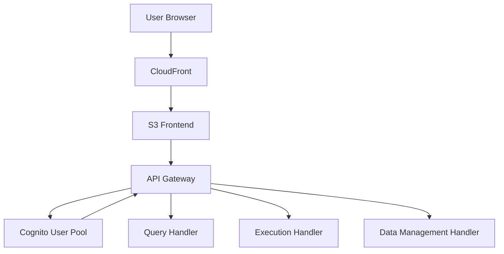
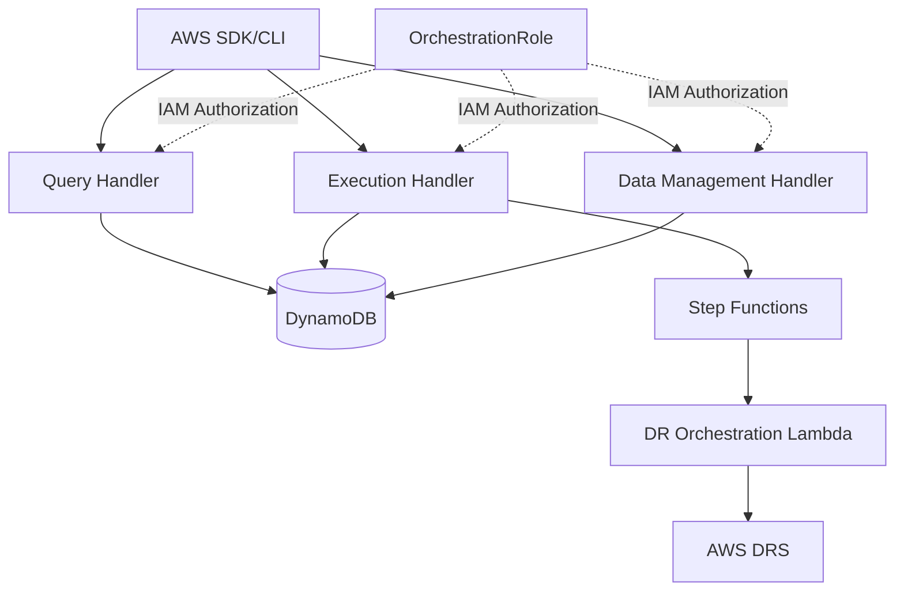

# Migration Guide: API Gateway Mode to Direct Lambda Invocation Mode

## Overview

This guide helps you migrate from **API Gateway Mode** (with Cognito authentication and frontend) to **Direct Lambda Invocation Mode** (headless, IAM-based) for the AWS DRS Orchestration Platform.

### What's Changing

| Aspect | API Gateway Mode | Direct Invocation Mode |
|--------|------------------|------------------------|
| **Entry Point** | API Gateway REST endpoints | Direct Lambda invocation via AWS SDK/CLI |
| **Authentication** | Cognito User Pool JWT tokens | IAM principal validation |
| **Authorization** | RBAC from Cognito user attributes | IAM policies and Lambda resource policies |
| **Frontend** | CloudFront + S3 React application | No frontend (headless operation) |
| **Use Cases** | Interactive web UI, manual operations | Automation, CI/CD, IaC workflows |
| **Invocation Method** | HTTP requests with Bearer token | `lambda:InvokeFunction` API calls |
| **Response Format** | API Gateway format (statusCode, headers, body) | Direct JSON response |

### Why Migrate?

**Benefits of Direct Invocation Mode:**
- **Infrastructure as Code**: Integrate DR operations into Terraform, CDK, or CloudFormation
- **CI/CD Pipelines**: Automate disaster recovery testing in deployment pipelines
- **Reduced Costs**: Eliminate API Gateway, Cognito, and CloudFront charges
- **Simplified Architecture**: Fewer components to manage and secure
- **Programmatic Control**: Full AWS SDK/CLI access for automation
- **No User Management**: No need to manage Cognito users and groups

**When to Stay with API Gateway Mode:**
- You need the interactive web UI for manual operations
- Non-technical users need to trigger DR operations
- You prefer visual dashboards and real-time status updates
- You want built-in user authentication and RBAC

## Architecture Comparison

### Current Architecture (API Gateway Mode)



### Target Architecture (Direct Invocation Mode)



## Migration Strategies

### Strategy 1: Gradual Migration (Recommended)

**Timeline**: 2-4 weeks

**Approach**: Run both modes in parallel, gradually shift workloads to direct invocation

**Steps**:
1. Deploy with `DeployApiGateway=true` (keep existing setup)
2. Configure IAM permissions for direct invocation
3. Test direct invocation alongside API Gateway
4. Migrate automation scripts to direct invocation
5. Validate all operations work correctly
6. Redeploy with `DeployApiGateway=false` to remove API Gateway

**Advantages**:
- Zero downtime
- Rollback capability at any point
- Thorough testing before full migration
- Gradual user training

**Disadvantages**:
- Temporary cost increase (running both modes)
- More complex during transition period

---

### Strategy 2: Clean Cutover

**Timeline**: 1 week

**Approach**: Complete migration in a single deployment

**Steps**:
1. Document all current API Gateway integrations
2. Convert all scripts to direct Lambda invocation
3. Test in development environment
4. Schedule maintenance window
5. Redeploy with `DeployApiGateway=false`
6. Validate all operations

**Advantages**:
- Faster migration
- Simpler transition
- Immediate cost savings

**Disadvantages**:
- Requires maintenance window
- Higher risk if issues arise
- All scripts must be ready before cutover

---

### Strategy 3: Hybrid Mode (Long-Term)

**Timeline**: Ongoing

**Approach**: Keep both modes running indefinitely

**Steps**:
1. Deploy with `DeployApiGateway=true`
2. Configure IAM permissions for direct invocation
3. Use API Gateway for manual operations
4. Use direct invocation for automation

**Advantages**:
- Best of both worlds
- No migration pressure
- Flexibility for different use cases

**Disadvantages**:
- Higher ongoing costs
- More components to maintain
- Dual authentication systems

## Pre-Migration Checklist

Before starting migration, ensure you have:

- [ ] **AWS CLI configured** with appropriate credentials
- [ ] **IAM permissions** to create/modify IAM roles and policies
- [ ] **CloudFormation access** to update stacks
- [ ] **Backup of current configuration** (export via API)
- [ ] **Test environment** to validate migration steps
- [ ] **Documentation** of all current API Gateway integrations
- [ ] **Inventory** of all automation scripts using the API
- [ ] **Communication plan** for users affected by changes
- [ ] **Rollback plan** documented and tested
- [ ] **Monitoring** configured for Lambda invocations


## Step-by-Step Migration Guide

### Phase 1: Preparation (Week 1)

#### Step 1.1: Export Current Configuration

Export your existing Protection Groups and Recovery Plans for backup:

**Using API Gateway (current method)**:
```bash
curl -X GET "https://your-api-gateway-url/export" \
  -H "Authorization: Bearer $COGNITO_TOKEN" \
  -o config-backup-$(date +%Y%m%d).json
```

**Using Direct Invocation (new method)**:
```bash
aws lambda invoke \
  --function-name hrp-drs-tech-adapter-query-handler-dev \
  --payload '{"operation":"export_configuration"}' \
  config-backup-$(date +%Y%m%d).json
```

#### Step 1.2: Document Current Integrations

Create an inventory of all systems using the API:

```bash
# List all API Gateway integrations
aws apigateway get-rest-apis --query 'items[?name==`hrp-drs-tech-adapter-api-dev`]'

# Check CloudWatch Logs for API usage patterns
aws logs filter-log-events \
  --log-group-name /aws/apigateway/hrp-drs-tech-adapter-api-dev \
  --start-time $(date -d '30 days ago' +%s)000 \
  --filter-pattern '[ip, user, timestamp, request, status_code = 2*, ...]'
```

#### Step 1.3: Create IAM Role for Direct Invocation

Create the OrchestrationRole with required permissions:

```bash
# Create trust policy
cat > trust-policy.json << 'EOF'
{
  "Version": "2012-10-17",
  "Statement": [
    {
      "Effect": "Allow",
      "Principal": {
        "Service": [
          "lambda.amazonaws.com",
          "states.amazonaws.com"
        ]
      },
      "Action": "sts:AssumeRole"
    },
    {
      "Effect": "Allow",
      "Principal": {
        "AWS": "arn:aws:iam::YOUR_ACCOUNT_ID:root"
      },
      "Action": "sts:AssumeRole",
      "Condition": {
        "StringEquals": {
          "sts:ExternalId": "your-external-id"
        }
      }
    }
  ]
}
EOF

# Create the role
aws iam create-role \
  --role-name DRSOrchestrationRole \
  --assume-role-policy-document file://trust-policy.json \
  --description "Role for AWS DRS Orchestration direct Lambda invocation"
```

Attach the required policies (see [IAM Policy Documentation](../iam/ORCHESTRATION_ROLE_POLICY.md) for complete policy):

```bash
# Attach Lambda invocation permissions
aws iam put-role-policy \
  --role-name DRSOrchestrationRole \
  --policy-name LambdaInvocationAccess \
  --policy-document file://lambda-invocation-policy.json
```

#### Step 1.4: Test Direct Invocation in Development

Test basic operations using direct invocation:

```bash
# Test query operation
aws lambda invoke \
  --function-name hrp-drs-tech-adapter-query-handler-dev \
  --payload '{"operation":"get_target_accounts"}' \
  response.json

# Verify response
cat response.json | jq .
```


### Phase 2: Parallel Operation (Week 2-3)

#### Step 2.1: Update CloudFormation Stack (Keep API Gateway)

Update your stack to support both modes:

```bash
aws cloudformation update-stack \
  --stack-name hrp-drs-tech-adapter-dev \
  --template-url https://s3.amazonaws.com/your-bucket/cfn/master-template.yaml \
  --parameters \
    ParameterKey=ProjectName,ParameterValue=hrp-drs-tech-adapter \
    ParameterKey=Environment,ParameterValue=test \
    ParameterKey=DeployApiGateway,ParameterValue=true \
    ParameterKey=DeploymentBucket,ParameterValue=hrp-drs-tech-adapter-dev \
    ParameterKey=AdminEmail,ParameterValue=admin@example.com \
  --capabilities CAPABILITY_NAMED_IAM
```

**Note**: `DeployApiGateway=true` keeps the existing API Gateway, Cognito, and frontend running.

#### Step 2.2: Configure Lambda Resource-Based Policies

The CloudFormation update automatically adds resource-based policies to Lambda functions allowing invocation from OrchestrationRole. Verify:

```bash
# Check query-handler policy
aws lambda get-policy \
  --function-name hrp-drs-tech-adapter-query-handler-dev \
  | jq -r '.Policy' | jq .

# Check execution-handler policy
aws lambda get-policy \
  --function-name hrp-drs-tech-adapter-execution-handler-dev \
  | jq -r '.Policy' | jq .

# Check data-management-handler policy
aws lambda get-policy \
  --function-name hrp-drs-tech-adapter-data-management-handler-dev \
  | jq -r '.Policy' | jq .
```

Expected policy statement:
```json
{
  "Effect": "Allow",
  "Principal": {
    "AWS": "arn:aws:iam::YOUR_ACCOUNT_ID:role/hrp-drs-tech-adapter-orchestration-role-dev"
  },
  "Action": "lambda:InvokeFunction",
  "Resource": "arn:aws:lambda:us-east-1:YOUR_ACCOUNT_ID:function:hrp-drs-tech-adapter-query-handler-dev"
}
```

#### Step 2.3: Convert Automation Scripts

Convert your existing scripts from API Gateway to direct invocation.

**Before (API Gateway with Cognito)**:
```python
import requests
import json

# Get Cognito token
def get_cognito_token(username, password):
    # ... Cognito authentication logic ...
    return token

# Call API Gateway
token = get_cognito_token("user@example.com", "password")
headers = {"Authorization": f"Bearer {token}"}
response = requests.get(
    "https://api-gateway-url/protection-groups",
    headers=headers
)
protection_groups = response.json()
```

**After (Direct Lambda Invocation)**:
```python
import boto3
import json

# Create Lambda client
lambda_client = boto3.client('lambda')

# Invoke Lambda directly
response = lambda_client.invoke(
    FunctionName='hrp-drs-tech-adapter-query-handler-dev',
    InvocationType='RequestResponse',
    Payload=json.dumps({
        "operation": "list_protection_groups"
    })
)

# Parse response
result = json.loads(response['Payload'].read())
protection_groups = result['protectionGroups']
```

#### Step 2.4: Update CI/CD Pipelines

Update your CI/CD pipelines to use direct invocation:

**Before (API Gateway)**:
```yaml
# .github/workflows/dr-test.yml
- name: Trigger DR Drill
  run: |
    TOKEN=$(curl -X POST https://cognito-url/oauth2/token ...)
    curl -X POST https://api-gateway-url/executions \
      -H "Authorization: Bearer $TOKEN" \
      -d '{"planId":"uuid","executionType":"DRILL"}'
```

**After (Direct Invocation)**:
```yaml
# .github/workflows/dr-test.yml
- name: Trigger DR Drill
  run: |
    aws lambda invoke \
      --function-name hrp-drs-tech-adapter-execution-handler-dev \
      --payload '{"operation":"start_execution","parameters":{"planId":"uuid","executionType":"DRILL","initiatedBy":"github-actions"}}' \
      response.json
    cat response.json
```

#### Step 2.5: Parallel Testing

Run both methods in parallel to validate equivalence:

```bash
# Test with API Gateway
curl -X GET "https://api-gateway-url/protection-groups" \
  -H "Authorization: Bearer $TOKEN" \
  -o api-gateway-result.json

# Test with direct invocation
aws lambda invoke \
  --function-name hrp-drs-tech-adapter-query-handler-dev \
  --payload '{"operation":"list_protection_groups"}' \
  direct-invocation-result.json

# Compare results (should be identical except for API Gateway wrapper)
diff <(jq -S '.protectionGroups' api-gateway-result.json) \
     <(jq -S '.protectionGroups' direct-invocation-result.json)
```


### Phase 3: Full Migration (Week 4)

#### Step 3.1: Validate All Operations

Before removing API Gateway, validate all operations work via direct invocation:

```bash
#!/bin/bash
# validate-direct-invocation.sh

FUNCTION_PREFIX="hrp-drs-tech-adapter"
ENV="test"

echo "=== Validating Direct Lambda Invocation ==="

# Test Query Handler
echo "Testing Query Handler..."
aws lambda invoke \
  --function-name ${FUNCTION_PREFIX}-query-handler-${ENV} \
  --payload '{"operation":"get_target_accounts"}' \
  /tmp/query-test.json
echo "✓ Query Handler: $(jq -r '.count' /tmp/query-test.json) accounts found"

# Test Execution Handler
echo "Testing Execution Handler..."
aws lambda invoke \
  --function-name ${FUNCTION_PREFIX}-execution-handler-${ENV} \
  --payload '{"operation":"list_executions"}' \
  /tmp/execution-test.json
echo "✓ Execution Handler: $(jq -r '.count' /tmp/execution-test.json) executions found"

# Test Data Management Handler
echo "Testing Data Management Handler..."
aws lambda invoke \
  --function-name ${FUNCTION_PREFIX}-data-management-handler-${ENV} \
  --payload '{"operation":"list_protection_groups"}' \
  /tmp/data-test.json
echo "✓ Data Management Handler: $(jq -r '.count' /tmp/data-test.json) groups found"

echo "=== All validations passed ==="
```

#### Step 3.2: Remove API Gateway (Final Migration)

Update CloudFormation stack to disable API Gateway:

```bash
aws cloudformation update-stack \
  --stack-name hrp-drs-tech-adapter-dev \
  --template-url https://s3.amazonaws.com/hrp-drs-tech-adapter-dev/cfn/master-template.yaml \
  --parameters \
    ParameterKey=ProjectName,ParameterValue=hrp-drs-tech-adapter \
    ParameterKey=Environment,ParameterValue=test \
    ParameterKey=DeployApiGateway,ParameterValue=false \
    ParameterKey=DeploymentBucket,ParameterValue=hrp-drs-tech-adapter-dev \
    ParameterKey=AdminEmail,ParameterValue=admin@example.com \
  --capabilities CAPABILITY_NAMED_IAM
```

**What Gets Removed**:
- API Gateway REST API
- Cognito User Pool
- CloudFront distribution
- S3 frontend bucket
- API Gateway CloudWatch Logs

**What Remains**:
- All Lambda functions
- DynamoDB tables
- Step Functions state machine
- EventBridge rules
- IAM roles and policies

#### Step 3.3: Verify Stack Update

Monitor the stack update:

```bash
# Watch stack events
aws cloudformation describe-stack-events \
  --stack-name hrp-drs-tech-adapter-dev \
  --max-items 20 \
  --query 'StackEvents[*].[Timestamp,ResourceStatus,ResourceType,LogicalResourceId]' \
  --output table

# Wait for completion
aws cloudformation wait stack-update-complete \
  --stack-name hrp-drs-tech-adapter-dev

# Verify final status
aws cloudformation describe-stacks \
  --stack-name hrp-drs-tech-adapter-dev \
  --query 'Stacks[0].StackStatus'
```

#### Step 3.4: Update DNS and Documentation

If you had custom DNS pointing to API Gateway:

```bash
# Remove DNS records pointing to API Gateway
aws route53 change-resource-record-sets \
  --hosted-zone-id YOUR_ZONE_ID \
  --change-batch file://delete-api-dns.json
```

Update internal documentation:
- Remove API Gateway endpoint URLs
- Update integration guides with Lambda invocation examples
- Update runbooks with new procedures
- Notify all stakeholders of the change


## Authentication Migration

### From Cognito JWT to IAM Credentials

#### Before: Cognito Authentication

```python
import boto3
from warrant import Cognito

# Authenticate with Cognito
cognito = Cognito(
    user_pool_id='us-east-1_XXXXXXXXX',
    client_id='your-client-id',
    username='user@example.com'
)
cognito.authenticate(password='password')
token = cognito.id_token

# Use token with API Gateway
headers = {"Authorization": f"Bearer {token}"}
response = requests.get(
    "https://api-gateway-url/protection-groups",
    headers=headers
)
```

#### After: IAM Authentication

```python
import boto3
import json

# Use AWS credentials (from environment, profile, or IAM role)
lambda_client = boto3.client('lambda')

# Invoke Lambda directly (IAM authentication automatic)
response = lambda_client.invoke(
    FunctionName='hrp-drs-tech-adapter-query-handler-dev',
    InvocationType='RequestResponse',
    Payload=json.dumps({
        "operation": "list_protection_groups"
    })
)

result = json.loads(response['Payload'].read())
```

### AWS Credentials Configuration

#### Option 1: AWS CLI Profile

```bash
# Configure AWS CLI profile
aws configure --profile dr-automation
# AWS Access Key ID: YOUR_ACCESS_KEY
# AWS Secret Access Key: YOUR_SECRET_KEY
# Default region: us-east-1
# Default output format: json

# Use profile in scripts
export AWS_PROFILE=dr-automation
aws lambda invoke ...
```

#### Option 2: IAM Role (Recommended for EC2/ECS)

```bash
# Attach IAM role to EC2 instance or ECS task
# Role should have lambda:InvokeFunction permission

# No credentials needed in code - automatic from instance metadata
aws lambda invoke \
  --function-name hrp-drs-tech-adapter-query-handler-dev \
  --payload '{"operation":"list_protection_groups"}' \
  response.json
```

#### Option 3: Environment Variables

```bash
# Set environment variables
export AWS_ACCESS_KEY_ID=YOUR_ACCESS_KEY
export AWS_SECRET_ACCESS_KEY=YOUR_SECRET_KEY
export AWS_DEFAULT_REGION=us-east-1

# Use in scripts
aws lambda invoke ...
```

#### Option 4: AssumeRole (Cross-Account)

```python
import boto3
import json

# Assume OrchestrationRole
sts_client = boto3.client('sts')
assumed_role = sts_client.assume_role(
    RoleArn='arn:aws:iam::123456789012:role/DRSOrchestrationRole',
    RoleSessionName='dr-automation-session',
    ExternalId='your-external-id'
)

# Create Lambda client with assumed credentials
lambda_client = boto3.client(
    'lambda',
    aws_access_key_id=assumed_role['Credentials']['AccessKeyId'],
    aws_secret_access_key=assumed_role['Credentials']['SecretAccessKey'],
    aws_session_token=assumed_role['Credentials']['SessionToken']
)

# Invoke Lambda
response = lambda_client.invoke(
    FunctionName='hrp-drs-tech-adapter-query-handler-dev',
    InvocationType='RequestResponse',
    Payload=json.dumps({"operation": "list_protection_groups"})
)
```


## Code Examples: Before and After

### Example 1: List Protection Groups

**Before (API Gateway + Cognito)**:
```python
import requests
import json
from warrant import Cognito

# Authenticate
cognito = Cognito(
    user_pool_id='us-east-1_XXXXXXXXX',
    client_id='your-client-id',
    username='user@example.com'
)
cognito.authenticate(password='password')

# Call API
headers = {"Authorization": f"Bearer {cognito.id_token}"}
response = requests.get(
    "https://cbpdf7d52d.execute-api.us-east-2.amazonaws.com/dev/protection-groups",
    headers=headers
)

if response.status_code == 200:
    data = response.json()
    for group in data['protectionGroups']:
        print(f"{group['name']}: {group['serverCount']} servers")
```

**After (Direct Lambda Invocation)**:
```python
import boto3
import json

# Create Lambda client (uses AWS credentials automatically)
lambda_client = boto3.client('lambda', region_name='us-east-1')

# Invoke Lambda
response = lambda_client.invoke(
    FunctionName='hrp-drs-tech-adapter-query-handler-dev',
    InvocationType='RequestResponse',
    Payload=json.dumps({
        "operation": "list_protection_groups"
    })
)

# Parse response
result = json.loads(response['Payload'].read())
for group in result['protectionGroups']:
    print(f"{group['name']}: {group['serverCount']} servers")
```

### Example 2: Start Recovery Execution

**Before (API Gateway + Cognito)**:
```bash
#!/bin/bash

# Get Cognito token
TOKEN=$(curl -X POST https://cognito-idp.us-east-1.amazonaws.com/ \
  -H "X-Amz-Target: AWSCognitoIdentityProviderService.InitiateAuth" \
  -H "Content-Type: application/x-amz-json-1.1" \
  -d '{
    "AuthFlow": "USER_PASSWORD_AUTH",
    "ClientId": "your-client-id",
    "AuthParameters": {
      "USERNAME": "user@example.com",
      "PASSWORD": "password"
    }
  }' | jq -r '.AuthenticationResult.IdToken')

# Start execution
curl -X POST https://cbpdf7d52d.execute-api.us-east-2.amazonaws.com/dev/executions \
  -H "Authorization: Bearer $TOKEN" \
  -H "Content-Type: application/json" \
  -d '{
    "planId": "550e8400-e29b-41d4-a716-446655440000",
    "executionType": "DRILL",
    "initiatedBy": "automation"
  }'
```

**After (Direct Lambda Invocation)**:
```bash
#!/bin/bash

# Start execution (AWS credentials from environment/profile)
aws lambda invoke \
  --function-name hrp-drs-tech-adapter-execution-handler-dev \
  --payload '{
    "operation": "start_execution",
    "parameters": {
      "planId": "550e8400-e29b-41d4-a716-446655440000",
      "executionType": "DRILL",
      "initiatedBy": "automation"
    }
  }' \
  response.json

# Check result
cat response.json | jq .
```

### Example 3: Create Protection Group

**Before (API Gateway + Cognito)**:
```javascript
// Node.js with axios
const axios = require('axios');
const AWS = require('aws-sdk');

// Get Cognito token
const cognito = new AWS.CognitoIdentityServiceProvider();
const authResult = await cognito.initiateAuth({
  AuthFlow: 'USER_PASSWORD_AUTH',
  ClientId: 'your-client-id',
  AuthParameters: {
    USERNAME: 'user@example.com',
    PASSWORD: 'password'
  }
}).promise();

const token = authResult.AuthenticationResult.IdToken;

// Create protection group
const response = await axios.post(
  'https://cbpdf7d52d.execute-api.us-east-2.amazonaws.com/dev/protection-groups',
  {
    name: 'Production Servers',
    region: 'us-east-1',
    serverSelectionMode: 'tags',
    serverSelectionTags: {
      Environment: 'production'
    }
  },
  {
    headers: { Authorization: `Bearer ${token}` }
  }
);

console.log('Created:', response.data.groupId);
```

**After (Direct Lambda Invocation)**:
```javascript
// Node.js with AWS SDK
const AWS = require('aws-sdk');

// Create Lambda client (uses AWS credentials automatically)
const lambda = new AWS.Lambda({ region: 'us-east-1' });

// Invoke Lambda
const response = await lambda.invoke({
  FunctionName: 'hrp-drs-tech-adapter-data-management-handler-dev',
  InvocationType: 'RequestResponse',
  Payload: JSON.stringify({
    operation: 'create_protection_group',
    body: {
      name: 'Production Servers',
      region: 'us-east-1',
      serverSelectionMode: 'tags',
      serverSelectionTags: {
        Environment: 'production'
      }
    }
  })
}).promise();

const result = JSON.parse(response.Payload);
console.log('Created:', result.groupId);
```


## CloudFormation Deployment Examples

### Deployment Mode Comparison

#### Full Mode (API Gateway + Frontend)

```bash
aws cloudformation create-stack \
  --stack-name hrp-drs-tech-adapter-dev \
  --template-url https://s3.amazonaws.com/hrp-drs-tech-adapter-dev/cfn/master-template.yaml \
  --parameters \
    ParameterKey=ProjectName,ParameterValue=hrp-drs-tech-adapter \
    ParameterKey=Environment,ParameterValue=test \
    ParameterKey=DeployApiGateway,ParameterValue=true \
    ParameterKey=DeploymentBucket,ParameterValue=hrp-drs-tech-adapter-dev \
    ParameterKey=AdminEmail,ParameterValue=admin@example.com \
  --capabilities CAPABILITY_NAMED_IAM \
  --tags \
    Key=Project,Value=DROrchestration \
    Key=Environment,Value=test
```

**Deployed Resources**:
- ✅ Lambda functions (6)
- ✅ DynamoDB tables (4)
- ✅ Step Functions state machine
- ✅ EventBridge rules
- ✅ API Gateway REST API
- ✅ Cognito User Pool
- ✅ CloudFront distribution
- ✅ S3 frontend bucket
- ✅ IAM roles and policies

**Estimated Monthly Cost**: $150-300 (depending on usage)

---

#### Headless Mode (Direct Invocation Only)

```bash
aws cloudformation create-stack \
  --stack-name hrp-drs-tech-adapter-dev \
  --template-url https://s3.amazonaws.com/hrp-drs-tech-adapter-dev/cfn/master-template.yaml \
  --parameters \
    ParameterKey=ProjectName,ParameterValue=hrp-drs-tech-adapter \
    ParameterKey=Environment,ParameterValue=test \
    ParameterKey=DeployApiGateway,ParameterValue=false \
    ParameterKey=DeploymentBucket,ParameterValue=hrp-drs-tech-adapter-dev \
    ParameterKey=AdminEmail,ParameterValue=admin@example.com \
  --capabilities CAPABILITY_NAMED_IAM \
  --tags \
    Key=Project,Value=DROrchestration \
    Key=Environment,Value=test
```

**Deployed Resources**:
- ✅ Lambda functions (6)
- ✅ DynamoDB tables (4)
- ✅ Step Functions state machine
- ✅ EventBridge rules
- ✅ IAM roles and policies
- ❌ API Gateway REST API (not deployed)
- ❌ Cognito User Pool (not deployed)
- ❌ CloudFront distribution (not deployed)
- ❌ S3 frontend bucket (not deployed)

**Estimated Monthly Cost**: $50-100 (depending on usage)

**Cost Savings**: ~$100-200/month (66% reduction)

### Parameter Reference

| Parameter | Required | Default | Description |
|-----------|----------|---------|-------------|
| `ProjectName` | Yes | - | Project name prefix for all resources |
| `Environment` | Yes | - | Environment name (dev, test, staging, prod) |
| `DeployApiGateway` | No | `true` | Deploy API Gateway, Cognito, and frontend |
| `DeploymentBucket` | Yes | - | S3 bucket for deployment artifacts |
| `AdminEmail` | Yes | - | Email for CloudWatch alarms and notifications |

### Updating Existing Stack

To migrate an existing stack from Full Mode to Headless Mode:

```bash
# Update stack with DeployApiGateway=false
aws cloudformation update-stack \
  --stack-name hrp-drs-tech-adapter-dev \
  --template-url https://s3.amazonaws.com/hrp-drs-tech-adapter-dev/cfn/master-template.yaml \
  --parameters \
    ParameterKey=ProjectName,UsePreviousValue=true \
    ParameterKey=Environment,UsePreviousValue=true \
    ParameterKey=DeployApiGateway,ParameterValue=false \
    ParameterKey=DeploymentBucket,UsePreviousValue=true \
    ParameterKey=AdminEmail,UsePreviousValue=true \
  --capabilities CAPABILITY_NAMED_IAM

# Monitor update progress
aws cloudformation wait stack-update-complete \
  --stack-name hrp-drs-tech-adapter-dev
```

**What Happens During Update**:
1. CloudFormation removes API Gateway resources
2. CloudFormation removes Cognito User Pool
3. CloudFormation removes CloudFront distribution
4. CloudFormation removes S3 frontend bucket
5. Lambda functions remain unchanged (dual-mode support)
6. DynamoDB tables remain unchanged (data preserved)
7. Step Functions and EventBridge remain unchanged

**Rollback**: If issues occur, update stack again with `DeployApiGateway=true` to restore API Gateway mode.


## Testing and Validation

### Validation Test Suite

Create a comprehensive test suite to validate direct invocation:

```python
#!/usr/bin/env python3
"""
Validation test suite for direct Lambda invocation mode.
Tests all operations across Query, Execution, and Data Management handlers.
"""

import boto3
import json
import sys
from datetime import datetime

class DirectInvocationValidator:
    def __init__(self, environment='test'):
        self.lambda_client = boto3.client('lambda', region_name='us-east-1')
        self.environment = environment
        self.project = 'hrp-drs-tech-adapter'
        self.passed = 0
        self.failed = 0
        
    def invoke_lambda(self, handler, operation, **kwargs):
        """Invoke Lambda function with operation."""
        function_name = f"{self.project}-{handler}-{self.environment}"
        
        payload = {"operation": operation}
        payload.update(kwargs)
        
        try:
            response = self.lambda_client.invoke(
                FunctionName=function_name,
                InvocationType='RequestResponse',
                Payload=json.dumps(payload)
            )
            
            result = json.loads(response['Payload'].read())
            return result
        except Exception as e:
            return {"error": str(e)}
    
    def test_query_handler(self):
        """Test Query Handler operations."""
        print("\n=== Testing Query Handler ===")
        
        # Test 1: List target accounts
        print("Test 1: list_target_accounts...")
        result = self.invoke_lambda('query-handler', 'get_target_accounts')
        if 'accounts' in result:
            print(f"  ✓ PASS: Found {result['count']} accounts")
            self.passed += 1
        else:
            print(f"  ✗ FAIL: {result.get('error', 'Unknown error')}")
            self.failed += 1
        
        # Test 2: List protection groups
        print("Test 2: list_protection_groups...")
        result = self.invoke_lambda('query-handler', 'list_protection_groups')
        if 'protectionGroups' in result:
            print(f"  ✓ PASS: Found {result['count']} protection groups")
            self.passed += 1
        else:
            print(f"  ✗ FAIL: {result.get('error', 'Unknown error')}")
            self.failed += 1
        
        # Test 3: Get DRS capacity
        print("Test 3: get_drs_account_capacity_all_regions...")
        result = self.invoke_lambda('query-handler', 'get_drs_account_capacity_all_regions')
        if 'totalSourceServers' in result:
            print(f"  ✓ PASS: Total servers: {result['totalSourceServers']}")
            self.passed += 1
        else:
            print(f"  ✗ FAIL: {result.get('error', 'Unknown error')}")
            self.failed += 1
    
    def test_execution_handler(self):
        """Test Execution Handler operations."""
        print("\n=== Testing Execution Handler ===")
        
        # Test 1: List executions
        print("Test 1: list_executions...")
        result = self.invoke_lambda('execution-handler', 'list_executions')
        if 'executions' in result:
            print(f"  ✓ PASS: Found {result['count']} executions")
            self.passed += 1
        else:
            print(f"  ✗ FAIL: {result.get('error', 'Unknown error')}")
            self.failed += 1
    
    def test_data_management_handler(self):
        """Test Data Management Handler operations."""
        print("\n=== Testing Data Management Handler ===")
        
        # Test 1: List protection groups
        print("Test 1: list_protection_groups...")
        result = self.invoke_lambda('data-management-handler', 'list_protection_groups')
        if 'protectionGroups' in result:
            print(f"  ✓ PASS: Found {result['count']} protection groups")
            self.passed += 1
        else:
            print(f"  ✗ FAIL: {result.get('error', 'Unknown error')}")
            self.failed += 1
        
        # Test 2: List recovery plans
        print("Test 2: list_recovery_plans...")
        result = self.invoke_lambda('data-management-handler', 'list_recovery_plans')
        if 'recoveryPlans' in result:
            print(f"  ✓ PASS: Found {result['count']} recovery plans")
            self.passed += 1
        else:
            print(f"  ✗ FAIL: {result.get('error', 'Unknown error')}")
            self.failed += 1
    
    def run_all_tests(self):
        """Run all validation tests."""
        print(f"\n{'='*60}")
        print(f"Direct Lambda Invocation Validation Suite")
        print(f"Environment: {self.environment}")
        print(f"Timestamp: {datetime.now().isoformat()}")
        print(f"{'='*60}")
        
        self.test_query_handler()
        self.test_execution_handler()
        self.test_data_management_handler()
        
        print(f"\n{'='*60}")
        print(f"Test Results: {self.passed} passed, {self.failed} failed")
        print(f"{'='*60}\n")
        
        return self.failed == 0

if __name__ == '__main__':
    import argparse
    
    parser = argparse.ArgumentParser(description='Validate direct Lambda invocation')
    parser.add_argument('--environment', default='test', help='Environment to test')
    args = parser.parse_args()
    
    validator = DirectInvocationValidator(environment=args.environment)
    success = validator.run_all_tests()
    
    sys.exit(0 if success else 1)
```

Run the validation suite:

```bash
# Make executable
chmod +x validate-direct-invocation.py

# Run tests
./validate-direct-invocation.py --environment test

# Expected output:
# ============================================================
# Direct Lambda Invocation Validation Suite
# Environment: test
# Timestamp: 2026-01-31T12:00:00
# ============================================================
#
# === Testing Query Handler ===
# Test 1: list_target_accounts...
#   ✓ PASS: Found 2 accounts
# Test 2: list_protection_groups...
#   ✓ PASS: Found 5 protection groups
# Test 3: get_drs_account_capacity_all_regions...
#   ✓ PASS: Total servers: 150
#
# === Testing Execution Handler ===
# Test 1: list_executions...
#   ✓ PASS: Found 10 executions
#
# === Testing Data Management Handler ===
# Test 1: list_protection_groups...
#   ✓ PASS: Found 5 protection groups
# Test 2: list_recovery_plans...
#   ✓ PASS: Found 3 recovery plans
#
# ============================================================
# Test Results: 6 passed, 0 failed
# ============================================================
```


## Rollback Procedures

### Scenario 1: Rollback During Parallel Operation

If issues arise while running both modes in parallel:

```bash
# No action needed - API Gateway still works
# Simply stop using direct invocation and continue with API Gateway
echo "Continuing with API Gateway mode - no rollback needed"
```

### Scenario 2: Rollback After Removing API Gateway

If you need to restore API Gateway after removing it:

```bash
# Step 1: Update CloudFormation stack to re-enable API Gateway
aws cloudformation update-stack \
  --stack-name hrp-drs-tech-adapter-dev \
  --template-url https://s3.amazonaws.com/hrp-drs-tech-adapter-dev/cfn/master-template.yaml \
  --parameters \
    ParameterKey=ProjectName,UsePreviousValue=true \
    ParameterKey=Environment,UsePreviousValue=true \
    ParameterKey=DeployApiGateway,ParameterValue=true \
    ParameterKey=DeploymentBucket,UsePreviousValue=true \
    ParameterKey=AdminEmail,UsePreviousValue=true \
  --capabilities CAPABILITY_NAMED_IAM

# Step 2: Wait for stack update to complete
aws cloudformation wait stack-update-complete \
  --stack-name hrp-drs-tech-adapter-dev

# Step 3: Verify API Gateway is accessible
API_URL=$(aws cloudformation describe-stacks \
  --stack-name hrp-drs-tech-adapter-dev \
  --query 'Stacks[0].Outputs[?OutputKey==`ApiGatewayUrl`].OutputValue' \
  --output text)

echo "API Gateway restored at: $API_URL"

# Step 4: Recreate Cognito users if needed
# (User pool is recreated but users need to be re-added)
aws cognito-idp admin-create-user \
  --user-pool-id YOUR_USER_POOL_ID \
  --username admin@example.com \
  --user-attributes Name=email,Value=admin@example.com \
  --temporary-password TempPassword123!
```

**Important Notes**:
- Lambda functions continue working during rollback (dual-mode support)
- DynamoDB data is preserved (no data loss)
- Cognito User Pool is recreated (users must be re-added)
- Frontend must be redeployed (run deployment script)

### Scenario 3: Emergency Rollback

If critical issues require immediate rollback:

```bash
#!/bin/bash
# emergency-rollback.sh

set -e

STACK_NAME="hrp-drs-tech-adapter-dev"
BACKUP_DATE=$(date +%Y%m%d-%H%M%S)

echo "=== Emergency Rollback Started ==="
echo "Timestamp: $BACKUP_DATE"

# Step 1: Export current configuration
echo "Step 1: Backing up current configuration..."
aws lambda invoke \
  --function-name hrp-drs-tech-adapter-query-handler-dev \
  --payload '{"operation":"export_configuration"}' \
  "config-backup-${BACKUP_DATE}.json"

# Step 2: Restore API Gateway
echo "Step 2: Restoring API Gateway..."
aws cloudformation update-stack \
  --stack-name $STACK_NAME \
  --use-previous-template \
  --parameters \
    ParameterKey=ProjectName,UsePreviousValue=true \
    ParameterKey=Environment,UsePreviousValue=true \
    ParameterKey=DeployApiGateway,ParameterValue=true \
    ParameterKey=DeploymentBucket,UsePreviousValue=true \
    ParameterKey=AdminEmail,UsePreviousValue=true \
  --capabilities CAPABILITY_NAMED_IAM

# Step 3: Wait for completion
echo "Step 3: Waiting for stack update..."
aws cloudformation wait stack-update-complete --stack-name $STACK_NAME

# Step 4: Verify
echo "Step 4: Verifying rollback..."
aws cloudformation describe-stacks \
  --stack-name $STACK_NAME \
  --query 'Stacks[0].StackStatus'

echo "=== Emergency Rollback Complete ==="
echo "Configuration backup saved to: config-backup-${BACKUP_DATE}.json"
```

### Rollback Verification Checklist

After rollback, verify:

- [ ] CloudFormation stack status is `UPDATE_COMPLETE`
- [ ] API Gateway endpoint is accessible
- [ ] Cognito User Pool exists
- [ ] CloudFront distribution is deployed
- [ ] Frontend S3 bucket exists and contains files
- [ ] Lambda functions still work via API Gateway
- [ ] DynamoDB tables contain expected data
- [ ] Step Functions state machine is operational
- [ ] EventBridge rules are active


## Troubleshooting

### Common Issues and Solutions

#### Issue 1: AccessDeniedException when invoking Lambda

**Error**:
```
An error occurred (AccessDeniedException) when calling the Invoke operation: 
User: arn:aws:iam::123456789012:user/automation is not authorized to perform: 
lambda:InvokeFunction on resource: arn:aws:lambda:us-east-1:123456789012:function:hrp-drs-tech-adapter-query-handler-dev
```

**Solution**:
Add `lambda:InvokeFunction` permission to your IAM user/role:

```bash
# Create policy
cat > lambda-invoke-policy.json << 'EOF'
{
  "Version": "2012-10-17",
  "Statement": [
    {
      "Effect": "Allow",
      "Action": "lambda:InvokeFunction",
      "Resource": "arn:aws:lambda:*:*:function:hrp-drs-tech-adapter-*"
    }
  ]
}
EOF

# Attach to user
aws iam put-user-policy \
  --user-name automation \
  --policy-name LambdaInvokeAccess \
  --policy-document file://lambda-invoke-policy.json

# Or attach to role
aws iam put-role-policy \
  --role-name AutomationRole \
  --policy-name LambdaInvokeAccess \
  --policy-document file://lambda-invoke-policy.json
```

---

#### Issue 2: Lambda returns "INVALID_INVOCATION" error

**Error**:
```json
{
  "error": "INVALID_INVOCATION",
  "message": "Event must contain 'requestContext', 'operation', 'action', or 'source'"
}
```

**Solution**:
Ensure your payload includes the `operation` field:

```bash
# ❌ Wrong - missing operation field
aws lambda invoke \
  --function-name hrp-drs-tech-adapter-query-handler-dev \
  --payload '{"queryParams":{"region":"us-east-1"}}' \
  response.json

# ✅ Correct - includes operation field
aws lambda invoke \
  --function-name hrp-drs-tech-adapter-query-handler-dev \
  --payload '{"operation":"get_target_accounts"}' \
  response.json
```

---

#### Issue 3: Response format different from API Gateway

**Problem**: Direct invocation returns unwrapped JSON, API Gateway returns wrapped response.

**API Gateway Response**:
```json
{
  "statusCode": 200,
  "headers": {...},
  "body": "{\"protectionGroups\":[...]}"
}
```

**Direct Invocation Response**:
```json
{
  "protectionGroups": [...]
}
```

**Solution**: Update your code to handle unwrapped responses:

```python
# Before (API Gateway)
response = requests.get(api_url, headers=headers)
data = response.json()  # Already parsed
groups = data['protectionGroups']

# After (Direct Invocation)
response = lambda_client.invoke(FunctionName=function_name, Payload=payload)
data = json.loads(response['Payload'].read())  # Parse Lambda response
groups = data['protectionGroups']  # No body wrapper
```

---

#### Issue 4: CloudFormation stack update fails

**Error**:
```
Resource handler returned message: "Cannot delete API Gateway while it has active deployments"
```

**Solution**:
Delete API Gateway deployments manually before stack update:

```bash
# Get API Gateway ID
API_ID=$(aws cloudformation describe-stack-resources \
  --stack-name hrp-drs-tech-adapter-dev \
  --logical-resource-id ApiGateway \
  --query 'StackResources[0].PhysicalResourceId' \
  --output text)

# Delete all deployments
aws apigateway get-deployments --rest-api-id $API_ID \
  --query 'items[*].id' --output text | \
  xargs -I {} aws apigateway delete-deployment --rest-api-id $API_ID --deployment-id {}

# Retry stack update
aws cloudformation update-stack --stack-name hrp-drs-tech-adapter-dev ...
```

---

#### Issue 5: Cognito users lost after migration

**Problem**: After removing and restoring API Gateway, Cognito users are gone.

**Explanation**: Cognito User Pool is recreated with a new ID, losing all users.

**Solution**: Export users before migration and reimport after:

```bash
# Before migration: Export users
aws cognito-idp list-users \
  --user-pool-id us-east-1_XXXXXXXXX \
  --query 'Users[*].[Username,Attributes]' \
  > cognito-users-backup.json

# After rollback: Recreate users
cat cognito-users-backup.json | jq -r '.[] | @json' | while read user; do
  username=$(echo $user | jq -r '.[0]')
  email=$(echo $user | jq -r '.[1][] | select(.Name=="email") | .Value')
  
  aws cognito-idp admin-create-user \
    --user-pool-id NEW_USER_POOL_ID \
    --username "$username" \
    --user-attributes Name=email,Value="$email" \
    --message-action SUPPRESS
done
```

---

#### Issue 6: Cross-account operations fail

**Error**:
```json
{
  "error": "STS_ERROR",
  "message": "Failed to assume role in target account"
}
```

**Solution**: Verify cross-account role trust relationship:

```bash
# Check if DRSOrchestrationRole exists in target account
aws iam get-role \
  --role-name DRSOrchestrationRole \
  --profile target-account

# Verify trust policy allows orchestration account
aws iam get-role \
  --role-name DRSOrchestrationRole \
  --profile target-account \
  --query 'Role.AssumeRolePolicyDocument'

# Expected trust policy:
# {
#   "Version": "2012-10-17",
#   "Statement": [{
#     "Effect": "Allow",
#     "Principal": {
#       "AWS": "arn:aws:iam::ORCHESTRATION_ACCOUNT:role/hrp-drs-tech-adapter-orchestration-role-dev"
#     },
#     "Action": "sts:AssumeRole"
#   }]
# }
```


## Cost Comparison

### Monthly Cost Breakdown

#### API Gateway Mode (Full Stack)

| Service | Usage | Monthly Cost |
|---------|-------|--------------|
| **API Gateway** | 1M requests | $3.50 |
| **Cognito User Pool** | 50 active users | $27.50 |
| **CloudFront** | 100GB data transfer | $8.50 |
| **S3 (Frontend)** | 1GB storage, 10K requests | $0.50 |
| **Lambda** | 1M invocations, 512MB, 3s avg | $18.00 |
| **DynamoDB** | On-demand, 1M reads, 100K writes | $1.50 |
| **Step Functions** | 100 executions, 10 steps each | $0.25 |
| **CloudWatch Logs** | 10GB ingestion, 5GB storage | $5.50 |
| **EventBridge** | 1M events | $1.00 |
| **Data Transfer** | 50GB out | $4.50 |
| **Total** | | **~$70.75/month** |

#### Direct Invocation Mode (Headless)

| Service | Usage | Monthly Cost |
|---------|-------|--------------|
| **API Gateway** | - | $0.00 |
| **Cognito User Pool** | - | $0.00 |
| **CloudFront** | - | $0.00 |
| **S3 (Frontend)** | - | $0.00 |
| **Lambda** | 1M invocations, 512MB, 3s avg | $18.00 |
| **DynamoDB** | On-demand, 1M reads, 100K writes | $1.50 |
| **Step Functions** | 100 executions, 10 steps each | $0.25 |
| **CloudWatch Logs** | 10GB ingestion, 5GB storage | $5.50 |
| **EventBridge** | 1M events | $1.00 |
| **Data Transfer** | 50GB out | $4.50 |
| **Total** | | **~$30.75/month** |

**Monthly Savings**: $40.00 (56% reduction)

**Annual Savings**: $480.00

### Cost Optimization Tips

1. **Use Lambda Reserved Concurrency**: If you have predictable workloads, reserve Lambda concurrency to reduce costs.

2. **Enable DynamoDB Auto Scaling**: Configure auto-scaling for DynamoDB tables to optimize capacity.

3. **Reduce CloudWatch Logs Retention**: Set shorter retention periods for non-critical logs.

4. **Use S3 Lifecycle Policies**: Archive old deployment artifacts to S3 Glacier.

5. **Optimize Lambda Memory**: Right-size Lambda memory allocation based on actual usage.

## Security Considerations

### IAM Best Practices

#### Principle of Least Privilege

Grant only the minimum permissions required:

```json
{
  "Version": "2012-10-17",
  "Statement": [
    {
      "Sid": "LimitedLambdaInvoke",
      "Effect": "Allow",
      "Action": "lambda:InvokeFunction",
      "Resource": [
        "arn:aws:lambda:us-east-1:123456789012:function:hrp-drs-tech-adapter-query-handler-dev",
        "arn:aws:lambda:us-east-1:123456789012:function:hrp-drs-tech-adapter-execution-handler-dev"
      ]
    }
  ]
}
```

#### Use IAM Roles Instead of Users

For automation, use IAM roles with temporary credentials:

```python
import boto3

# Assume role for temporary credentials
sts_client = boto3.client('sts')
assumed_role = sts_client.assume_role(
    RoleArn='arn:aws:iam::123456789012:role/DRAutomationRole',
    RoleSessionName='dr-automation-session',
    DurationSeconds=3600  # 1 hour
)

# Use temporary credentials
lambda_client = boto3.client(
    'lambda',
    aws_access_key_id=assumed_role['Credentials']['AccessKeyId'],
    aws_secret_access_key=assumed_role['Credentials']['SecretAccessKey'],
    aws_session_token=assumed_role['Credentials']['SessionToken']
)
```

#### Enable CloudTrail Logging

Monitor all Lambda invocations:

```bash
# Create CloudTrail trail for Lambda invocations
aws cloudtrail create-trail \
  --name dr-orchestration-audit \
  --s3-bucket-name my-cloudtrail-bucket \
  --is-multi-region-trail

# Enable logging for Lambda
aws cloudtrail put-event-selectors \
  --trail-name dr-orchestration-audit \
  --event-selectors '[{
    "ReadWriteType": "All",
    "IncludeManagementEvents": true,
    "DataResources": [{
      "Type": "AWS::Lambda::Function",
      "Values": ["arn:aws:lambda:*:*:function:hrp-drs-tech-adapter-*"]
    }]
  }]'
```

#### Implement MFA for Sensitive Operations

Require MFA for production operations:

```json
{
  "Version": "2012-10-17",
  "Statement": [
    {
      "Effect": "Allow",
      "Action": "lambda:InvokeFunction",
      "Resource": "arn:aws:lambda:*:*:function:hrp-drs-tech-adapter-*-prod",
      "Condition": {
        "Bool": {
          "aws:MultiFactorAuthPresent": "true"
        }
      }
    }
  ]
}
```

### Audit and Compliance

#### Enable Lambda Function Logging

All Lambda invocations are automatically logged to CloudWatch Logs with:
- IAM principal ARN
- Operation performed
- Parameters (sanitized)
- Result status
- Timestamp
- Request ID

#### Query Audit Logs

```bash
# Search for specific user's invocations
aws logs filter-log-events \
  --log-group-name /aws/lambda/hrp-drs-tech-adapter-query-handler-dev \
  --filter-pattern '{ $.principal.arn = "arn:aws:iam::123456789012:user/automation" }' \
  --start-time $(date -d '7 days ago' +%s)000

# Search for failed operations
aws logs filter-log-events \
  --log-group-name /aws/lambda/hrp-drs-tech-adapter-execution-handler-dev \
  --filter-pattern '{ $.result = "ERROR" }' \
  --start-time $(date -d '24 hours ago' +%s)000
```

#### Create CloudWatch Alarms

Monitor for suspicious activity:

```bash
# Alarm for excessive failed invocations
aws cloudwatch put-metric-alarm \
  --alarm-name dr-orchestration-failed-invocations \
  --alarm-description "Alert on excessive failed Lambda invocations" \
  --metric-name Errors \
  --namespace AWS/Lambda \
  --statistic Sum \
  --period 300 \
  --evaluation-periods 2 \
  --threshold 10 \
  --comparison-operator GreaterThanThreshold \
  --dimensions Name=FunctionName,Value=hrp-drs-tech-adapter-execution-handler-dev
```


## FAQ

### General Questions

**Q: Can I run both API Gateway and direct invocation modes simultaneously?**

A: Yes! When `DeployApiGateway=true`, Lambda functions support both invocation methods. This is the recommended approach during migration for gradual transition.

---

**Q: Will my existing data be preserved during migration?**

A: Yes. DynamoDB tables are never deleted during migration. All Protection Groups, Recovery Plans, and execution history are preserved.

---

**Q: How long does the migration take?**

A: 
- **Gradual Migration**: 2-4 weeks (recommended)
- **Clean Cutover**: 1 week
- **CloudFormation Update**: 10-15 minutes

---

**Q: Can I rollback if something goes wrong?**

A: Yes. Update the CloudFormation stack with `DeployApiGateway=true` to restore API Gateway mode. Lambda functions continue working during rollback.

---

**Q: What happens to Cognito users after migration?**

A: If you remove API Gateway (`DeployApiGateway=false`), the Cognito User Pool is deleted. If you later restore API Gateway, you'll need to recreate users.

---

### Technical Questions

**Q: Do I need to modify my Lambda functions?**

A: No. Lambda functions already support dual-mode operation. They automatically detect invocation patterns and respond appropriately.

---

**Q: How do I authenticate with direct invocation?**

A: Use AWS IAM credentials (access keys, IAM roles, or STS temporary credentials). No Cognito tokens needed.

---

**Q: Can I use AWS CLI for direct invocation?**

A: Yes. Use `aws lambda invoke` command with your AWS credentials configured.

---

**Q: What about cross-account operations?**

A: Cross-account operations work identically in both modes. The OrchestrationRole assumes roles in target accounts using STS.

---

**Q: How do I monitor direct invocations?**

A: Use CloudWatch Logs, CloudWatch Metrics, and CloudTrail. All invocations are logged with IAM principal information.

---

### Cost Questions

**Q: How much will I save by removing API Gateway?**

A: Approximately $40-50/month (56% reduction) for typical usage. Actual savings depend on your usage patterns.

---

**Q: Are there any hidden costs with direct invocation?**

A: No. Direct invocation uses the same Lambda, DynamoDB, and Step Functions resources. You only save on API Gateway, Cognito, and CloudFront costs.

---

**Q: Does direct invocation increase Lambda costs?**

A: No. Lambda invocation costs are the same regardless of invocation method.

---

### Migration Questions

**Q: Can I migrate one environment at a time?**

A: Yes. Migrate dev first, then test, then staging, then production. Each environment is independent.

---

**Q: What if my automation scripts break during migration?**

A: Keep API Gateway running (`DeployApiGateway=true`) until all scripts are converted and tested. Then remove API Gateway.

---

**Q: Do I need to update my CI/CD pipelines?**

A: Yes. Update pipelines to use `aws lambda invoke` instead of HTTP requests to API Gateway.

---

**Q: Can I use Terraform or CDK for deployment?**

A: Yes. The CloudFormation templates can be deployed via Terraform (using `aws_cloudformation_stack`) or CDK (using `CfnInclude`).

---

### Security Questions

**Q: Is direct invocation more or less secure than API Gateway?**

A: Both are secure. Direct invocation uses IAM-based authentication (AWS credentials), while API Gateway uses Cognito JWT tokens. IAM provides more granular control and integrates better with AWS services.

---

**Q: How do I restrict who can invoke Lambda functions?**

A: Use IAM policies to grant `lambda:InvokeFunction` permission only to specific users, roles, or services.

---

**Q: Can I require MFA for direct invocations?**

A: Yes. Add an IAM condition requiring `aws:MultiFactorAuthPresent` in your IAM policies.

---

**Q: Are invocations logged for audit purposes?**

A: Yes. All invocations are logged to CloudWatch Logs with IAM principal, operation, parameters, and results. CloudTrail also logs Lambda API calls.

---

## Additional Resources

### Documentation

- **[Query Handler API Reference](../api-reference/QUERY_HANDLER_API.md)** - Complete API documentation for query operations
- **[Execution Handler API Reference](../api-reference/EXECUTION_HANDLER_API.md)** - Complete API documentation for execution operations
- **[Data Management Handler API Reference](../api-reference/DATA_MANAGEMENT_HANDLER_API.md)** - Complete API documentation for data management operations
- **[IAM Policy Documentation](../iam/ORCHESTRATION_ROLE_POLICY.md)** - Required IAM permissions for direct invocation
- **[Error Codes Reference](../troubleshooting/ERROR_CODES.md)** - Complete error code reference and troubleshooting

### AWS Documentation

- **[AWS Lambda Invoke API](https://docs.aws.amazon.com/lambda/latest/dg/API_Invoke.html)** - Official AWS Lambda invocation documentation
- **[AWS IAM Best Practices](https://docs.aws.amazon.com/IAM/latest/UserGuide/best-practices.html)** - IAM security best practices
- **[AWS CloudFormation](https://docs.aws.amazon.com/cloudformation/)** - CloudFormation documentation
- **[AWS DRS](https://docs.aws.amazon.com/drs/)** - AWS Elastic Disaster Recovery documentation

### Support

For questions or issues:

1. **Check Documentation**: Review API reference and error codes documentation
2. **Check CloudWatch Logs**: Review Lambda function logs for detailed error messages
3. **Check CloudTrail**: Review API call history for authentication issues
4. **Open GitHub Issue**: Report bugs or request features on the project repository

## Conclusion

Migrating from API Gateway mode to direct Lambda invocation mode provides significant benefits:

✅ **Cost Savings**: 56% reduction in monthly costs  
✅ **Simplified Architecture**: Fewer components to manage  
✅ **Better Automation**: Native AWS SDK/CLI integration  
✅ **Infrastructure as Code**: Full Terraform/CDK support  
✅ **Improved Security**: IAM-based authentication and authorization  

The migration can be done gradually with zero downtime, and rollback is always possible if needed. Lambda functions support both modes simultaneously, allowing you to test thoroughly before fully committing to direct invocation mode.

**Recommended Approach**: Start with gradual migration (Strategy 1), running both modes in parallel for 2-4 weeks. This provides the safest path with thorough testing and easy rollback if needed.

---

**Document Version**: 1.0  
**Last Updated**: January 31, 2026  
**Applies To**: AWS DRS Orchestration Platform v2.0+
