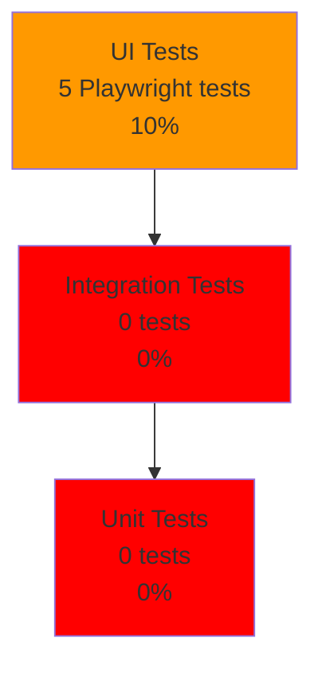
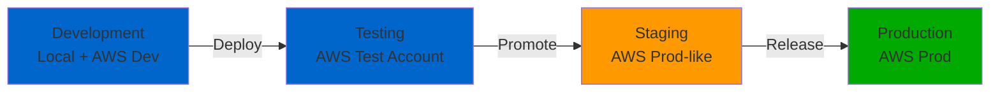

# Testing and Quality Assurance
# AWS DRS Orchestration System

**Version**: 1.0  
**Date**: November 12, 2025  
**Status**: Testing Framework Established (MVP Testing In Progress)  
**Document Owner**: QA Engineering Team  
**Target Audience**: QA Engineers, Test Engineers, Developers, Product Managers

---

## Document Purpose

This Testing and Quality Assurance document defines the complete testing strategy, test plans, quality metrics, and testing procedures for the AWS DRS Orchestration system. It ensures comprehensive test coverage across all functional and non-functional requirements.

**Key Objective**: Enable QA teams to validate system quality, identify defects early, and maintain high reliability standards.

---

## Table of Contents

1. [Executive Summary](#executive-summary)
2. [Testing Strategy](#testing-strategy)
3. [Test Environments](#test-environments)
4. [Test Types & Coverage](#test-types--coverage)
5. [Test Plans](#test-plans)
6. [Quality Metrics](#quality-metrics)
7. [Testing Findings](#testing-findings)
8. [Defect Management](#defect-management)
9. [Continuous Testing](#continuous-testing)
10. [Acceptance Criteria](#acceptance-criteria)

---

## Executive Summary

### Testing Overview

**Testing Status**: ⚠️ **18% Complete** (21/119 requirements tested)  
**Critical Gap**: Execution Engine (0% tested) - **HIGHEST PRIORITY**  
**Test Automation**: 5 Playwright smoke tests (all passing)  
**Manual Testing**: Protection Groups, Recovery Plans (CRUD operations tested)  
**Performance Testing**: Not started  
**Security Testing**: Not started

### Test Coverage Summary

| Component | Requirements | Tested | Coverage | Status |
|-----------|--------------|--------|----------|--------|
| Protection Groups | 16 | 8 | 50% | ⚠️ Partial |
| Recovery Plans | 24 | 5 | 21% | ⚠️ Partial |
| Execution Engine | 18 | 0 | **0%** | ❌ **Critical** |
| Server Discovery | 8 | 4 | 50% | ⚠️ Partial |
| Authentication | 11 | 4 | 36% | ⚠️ Partial |
| **Total Functional** | **87** | **21** | **24%** | **⚠️ Needs Work** |
| Non-Functional | 32 | 0 | 0% | ❌ Not Started |
| **Grand Total** | **119** | **21** | **18%** | **⚠️ Critical Gap** |

### Key Issues Discovered

1. **Critical Bug**: Recovery Plan edit causes UI data inconsistency (Session 33)
   - Severity: P1 (blocks production use)
   - Status: Root cause identified, fix in progress
   
2. **Execution Engine**: Completely untested
   - 0 wave orchestration tests
   - 0 DRS integration tests  
   - 0 health check tests

3. **Performance**: No baseline established
   - No load testing performed
   - No stress testing performed
   - No concurrency testing performed

---

## Testing Strategy

### Overall Approach

**Testing Philosophy**: Shift-Left + Continuous Testing  
- Write tests before/during development (TDD where feasible)
- Automated smoke tests on every commit
- Manual exploratory testing for complex workflows
- Performance baseline established before production

### Testing Pyramid



**Current State**: ⚠️ **Inverted Pyramid** (all UI tests, no integration/unit tests)  
**Target State**: 70% unit, 20% integration, 10% UI (per test automation best practices)

### Test Types Priority

**Phase 1 (Current Sprint - Weeks 1-2)**:
1. ✅ Smoke Tests (UI) - COMPLETE
2. 🔄 Integration Tests (API + DynamoDB) - IN PROGRESS (0%)
3. ❌ Execution Engine Tests - NOT STARTED (CRITICAL!)

**Phase 2 (Weeks 3-4)**:
4. Unit Tests (Lambda functions)
5. Performance Tests (load, stress, spike)
6. Security Tests (OWASP Top 10, IAM policies)

**Phase 3 (Weeks 5-6)**:
7. Chaos Engineering (failure injection)
8. Disaster Recovery Tests (region failover)
9. Compliance Tests (audit logging, GDPR)

---

## Test Environments

### Environment Strategy



### Environment Details

**Development Environment**:
- **Purpose**: Local development and debugging
- **Infrastructure**: LocalStack for DynamoDB, SAM Local for Lambda
- **Data**: Synthetic test data (no real servers)
- **Access**: All developers
- **Refresh**: On-demand (developer-controlled)

**Testing Environment**:
- **Purpose**: Automated test execution (CI/CD)
- **Infrastructure**: AWS Test Account (123456789012)
- **Region**: us-east-1
- **Data**: Synthetic test data + sample DRS servers
- **Access**: QA team + CI/CD pipeline
- **Refresh**: Daily (tear down + rebuild)

**Staging Environment**:
- **Purpose**: Pre-production validation
- **Infrastructure**: AWS Staging Account (987654321098)
- **Region**: us-east-1 (mirrors production)
- **Data**: Production-like data (anonymized)
- **Access**: QA team + Product team
- **Refresh**: Weekly (data sync from production)

**Production Environment**:
- **Purpose**: Live system
- **Infrastructure**: AWS Production Account (555555555555)
- **Region**: us-east-1 (primary)
- **Data**: Real customer data
- **Access**: Operations team only
- **Monitoring**: 24/7 CloudWatch + PagerDuty

---

## Test Types & Coverage

### 1. Smoke Tests (UI) ✅ COMPLETE

**Purpose**: Verify critical user journeys work end-to-end  
**Tool**: Playwright (TypeScript)  
**Execution**: Automated (on every commit)  
**Duration**: 2 minutes  
**Coverage**: 5 tests, all passing ✅

**Test Cases**:
```
1. ✅ Login - User can authenticate successfully
2. ✅ Protection Groups - Create button opens dialog
3. ✅ Protection Groups - Edit dialog can be opened/closed  
4. ✅ Recovery Plans - Create button opens dialog
5. ✅ Recovery Plans - Edit dialog works (⚠️ with known bug)
```

**Configuration** (`tests/playwright/smoke-tests.spec.ts`):
```typescript
test.describe('Smoke Tests', () => {
  test('User can login successfully', async ({ page }) => {
    await page.goto('http://localhost:5173/login');
    await page.fill('input[name="username"]', testUser.username);
    await page.fill('input[name="password"]', testUser.password);
    await page.click('button[type="submit"]');
    await expect(page).toHaveURL(/dashboard/);
  });
  
  test('Protection Group dialog can be opened and closed', async ({ page }) => {
    // ... test implementation
  });
});
```

**Execution**:
```bash
cd tests/playwright
npm test  # Run all smoke tests
npm test -- --headed  # Run with browser visible
npm test -- --debug  # Run with Playwright Inspector
```

---

### 2. Integration Tests (API + DynamoDB) ❌ NOT STARTED

**Purpose**: Verify API endpoints integrate correctly with DynamoDB  
**Tool**: pytest + boto3 (Python)  
**Execution**: Automated (CI/CD)  
**Duration**: Est. 10 minutes  
**Coverage**: 0 tests ❌

**Planned Test Structure**:
```python
# tests/integration/test_protection_groups.py

import boto3
import pytest
from moto import mock_dynamodb

@mock_dynamodb
class TestProtectionGroupsIntegration:
    
    def setup_method(self):
        """Create mock DynamoDB table"""
        dynamodb = boto3.resource('dynamodb', region_name='us-east-1')
        self.table = dynamodb.create_table(
            TableName='protection-groups-test',
            KeySchema=[{'AttributeName': 'PK', 'KeyType': 'HASH'}],
            BillingMode='PAY_PER_REQUEST'
        )
    
    def test_create_protection_group_success(self):
        """Test creating a valid protection group"""
        response = create_protection_group({
            'name': 'Test-PG',
            'region': 'us-east-1',
            'serverIds': ['s-123', 's-456']
        })
        assert response['statusCode'] == 201
        assert 'id' in response['body']
    
    def test_create_protection_group_duplicate_name(self):
        """Test duplicate name rejection"""
        create_protection_group({'name': 'Duplicate', ...})
        response = create_protection_group({'name': 'duplicate', ...})
        assert response['statusCode'] == 409
        assert 'already exists' in response['body']['error']
    
    def test_create_protection_group_server_already_assigned(self):
        """Test server assignment conflict"""
        # Create PG1 with server s-123
        create_protection_group({...,'serverIds': ['s-123']})
        # Try to create PG2 with same server
        response = create_protection_group({...,'serverIds': ['s-123']})
        assert response['statusCode'] == 409
```

**Required Test Coverage** (48 integration tests planned):
- Protection Groups: 16 tests (CRUD + validations)
- Recovery Plans: 24 tests (CRUD + wave validations)
- Server Discovery: 8 tests (DRS API integration)

---

### 3. Execution Engine Tests ❌ **CRITICAL - NOT STARTED**

**Purpose**: Verify wave orchestration and DRS job management  
**Tool**: pytest + moto (AWS mocks)  
**Execution**: Automated (CI/CD)  
**Duration**: Est. 20 minutes  
**Coverage**: 0 tests ❌ **HIGHEST PRIORITY**

**Critical Test Scenarios**:

```python
# tests/integration/test_execution_engine.py

@mock_drs
@mock_ec2
@mock_stepfunctions
class TestExecutionEngine:
    
    def test_wave_sequential_execution(self):
        """Test SEQUENTIAL wave launches servers one-by-one"""
        plan = create_test_plan({
            'waves': [{
                'waveNumber': 1,
                'executionType': 'SEQUENTIAL',
                'serverIds': ['s-1', 's-2', 's-3']
            }]
        })
        
        execution = start_execution(plan['id'], 'DRILL')
        
        # Verify servers launched in order
        jobs = get_drs_jobs()
        assert len(jobs) == 1  # First server only
        
        complete_drs_job(jobs[0]['jobID'])
        jobs = get_drs_jobs()
        assert len(jobs) == 2  # Second server started
    
    def test_wave_parallel_execution(self):
        """Test PARALLEL wave launches all servers simultaneously"""
        plan = create_test_plan({
            'waves': [{
                'waveNumber': 1,
                'executionType': 'PARALLEL',
                'serverIds': ['s-1', 's-2', 's-3']
            }]
        })
        
        execution = start_execution(plan['id'], 'DRILL')
        
        # Verify all servers launched at once
        jobs = get_drs_jobs()
        assert len(jobs) == 3
    
    def test_wave_dependency_order(self):
        """Test waves execute in dependency order"""
        plan = create_test_plan({
            'waves': [
                {'waveNumber': 1, 'dependencies': []},
                {'waveNumber': 2, 'dependencies': [1]},
                {'waveNumber': 3, 'dependencies': [2]}
            ]
        })
        
        execution = start_execution(plan['id'], 'DRILL')
        
        # Wave 1 starts immediately
        assert get_wave_status(1) == 'RUNNING'
        assert get_wave_status(2) == 'PENDING'
        assert get_wave_status(3) == 'PENDING'
        
        # Complete wave 1 → wave 2 starts
        complete_wave(1)
        assert get_wave_status(2) == 'RUNNING'
        assert get_wave_status(3) == 'PENDING'
    
    def test_health_checks_pass(self):
        """Test instance health checks validation"""
        plan = create_test_plan({'waves': [...]})
        execution = start_execution(plan['id'], 'DRILL')
        
        # Mock EC2 instance status checks
        complete_drs_job('job-123')
        instance_id = get_recovered_instance('s-1')
        
        set_instance_status(instance_id, {
            'InstanceState': 'running',
            'SystemStatus': 'ok',
            'InstanceStatus': 'ok'
        })
        
        # Verify execution marks instance healthy
        status = get_execution_status(execution['id'])
        assert status['waves'][0]['servers'][0]['health'] == 'HEALTHY'
    
    def test_execution_timeout_handling(self):
        """Test Lambda timeout handling in long-running executions"""
        # TODO: Implement chunked execution with continuation
        pass
    
    def test_drill_vs_recovery_mode(self):
        """Test isDrill parameter passed correctly to DRS"""
        # DRILL mode: isDrill=true
        exec_drill = start_execution(plan['id'], 'DRILL')
        jobs_drill = get_drs_jobs()
        assert jobs_drill[0]['isDrill'] == True
        
        # RECOVERY mode: isDrill=false  
        exec_prod = start_execution(plan['id'], 'RECOVERY')
        jobs_prod = get_drs_jobs()
        assert jobs_prod[0]['isDrill'] == False
```

**Required Test Coverage** (18 execution engine tests planned):
- Wave orchestration: 6 tests (sequential, parallel, dependencies)
- DRS job management: 4 tests (start, monitor, complete, fail)
- Health checks: 3 tests (pass, fail, timeout)
- Error handling: 5 tests (timeout, DRS errors, partial failures)

---

### 4. Performance Tests ❌ NOT STARTED

**Purpose**: Establish performance baselines and validate scalability  
**Tool**: Locust (Python) + CloudWatch  
**Execution**: Weekly (on-demand)  
**Duration**: 1 hour per test  
**Coverage**: 0 tests ❌

**Test Scenarios**:

**Load Test** (Normal Traffic):
```python
# tests/performance/load_test.py

from locust import HttpUser, task, between

class DRSOrchestrationUser(HttpUser):
    wait_time = between(1, 5)  # 1-5 seconds between requests
    
    def on_start(self):
        """Login once per user"""
        response = self.client.post("/auth/login", json={
            "username": "test-user",
            "password": "test-password"
        })
        self.token = response.json()['token']
        self.client.headers = {'Authorization': f'Bearer {self.token}'}
    
    @task(3)  # Weight: 3x more common than other tasks
    def list_protection_groups(self):
        """List protection groups"""
        self.client.get("/protection-groups")
    
    @task(2)
    def list_recovery_plans(self):
        """List recovery plans"""
        self.client.get("/recovery-plans")
    
    @task(1)
    def get_executions(self):
        """List executions"""
        self.client.get("/executions")
    
    @task(1)
    def create_protection_group(self):
        """Create protection group (write operation)"""
        self.client.post("/protection-groups", json={
            "name": f"LoadTest-PG-{uuid.uuid4()}",
            "region": "us-east-1",
            "serverIds": ["s-test-123"]
        })
```

**Execution**:
```bash
# Run load test: 100 users, 10 users/second spawn rate, 10 minutes
locust -f tests/performance/load_test.py \
  --host https://api.drs-orchestration.example.com \
  --users 100 \
  --spawn-rate 10 \
  --run-time 10m \
  --headless
```

**Performance Targets**:
| Metric | Target | Acceptable | Unacceptable |
|--------|--------|------------|--------------|
| API Response Time (p95) | <100ms | <500ms | >1s |
| API Response Time (p99) | <500ms | <1s | >2s |
| Lambda Cold Start | <2s | <5s | >10s |
| DynamoDB Latency (p95) | <10ms | <50ms | >100ms |
| Concurrent Users | 100 | 50 | <25 |
| Requests/Second | 100 | 50 | <25 |

**Stress Test** (High Traffic):
- Ramp up to 500 users over 10 minutes
- Identify breaking point
- Verify graceful degradation (throttling, not crashes)

**Spike Test** (Traffic Surge):
- Sudden spike from 10 → 200 users in 30 seconds
- Verify auto-scaling response
- Measure recovery time to normal

---

### 5. Security Tests ❌ NOT STARTED

**Purpose**: Validate security controls and identify vulnerabilities  
**Tool**: OWASP ZAP + custom scripts  
**Execution**: Weekly + before releases  
**Duration**: 2 hours per scan  
**Coverage**: 0 tests ❌

**Test Categories**:

**A. Authentication & Authorization Tests**:
```python
def test_jwt_token_expiration():
    """Test JWT tokens expire after 1 hour"""
    token = login_and_get_token()
    time.sleep(3601)  # Wait 1 hour 1 second
    response = api_get('/protection-groups', token)
    assert response.status_code == 401  # Unauthorized
    
def test_jwt_token_signature_validation():
    """Test tampered JWT tokens rejected"""
    token = login_and_get_token()
    tampered = token[:-10] + "TAMPERED"
    response = api_get('/protection-groups', tampered)
    assert response.status_code == 401
    
def test_unauthorized_api_access():
    """Test unauthenticated requests blocked"""
    response = api_get('/protection-groups')  # No token
    assert response.status_code == 401
    
def test_cross_user_data_access():
    """Test users can't access other users' data"""
    user1_token = login('user1', 'pass1')
    user2_token = login('user2', 'pass2')
    
    # User 1 creates protection group
    pg = api_post('/protection-groups', {...}, user1_token)
    
    # User 2 tries to access user 1's protection group
    response = api_get(f'/protection-groups/{pg["id"]}', user2_token)
    assert response.status_code == 403  # Forbidden
```

**B. Input Validation Tests** (SQL Injection, XSS, etc.):
```python
def test_sql_injection_protection():
    """Test SQL injection attempts blocked"""
    malicious_payloads = [
        "'; DROP TABLE protection_groups; --",
        "1' OR '1'='1",
        "admin'--",
        "1' UNION SELECT * FROM users--"
    ]
    for payload in malicious_payloads:
        response = api_post('/protection-groups', {
            'name': payload,
            'region': 'us-east-1'
        })
        # Should either reject (400) or sanitize input
        assert response.status_code in [400, 201]
        if response.status_code == 201:
            # Verify payload was sanitized
            assert payload not in response.json()['name']

def test_xss_protection():
    """Test XSS payloads sanitized"""
    xss_payloads = [
        "<script>alert('XSS')</script>",
        "",
        "javascript:alert('XSS')"
    ]
    for payload in xss_payloads:
        response = api_post('/protection-groups', {
            'name': payload,
            'description': payload
        })
        if response.status_code == 201:
            # Verify HTML escaped
            assert '<script>' not in response.json()['name']
```

**C. AWS IAM Policy Tests**:
```bash
# Verify Lambda has least-privilege IAM permissions
aws iam simulate-principal-policy \
  --policy-source-arn arn:aws:iam::123456789012:role/DRS-Orchestration-Lambda \
  --action-names \
    "s3:GetObject" \
    "drs:StartRecovery" \
    "dynamodb:PutItem" \
    "iam:CreateUser" \
  --resource-arns "*"

# Expected:
# s3:GetObject → Denied ✅
# drs:StartRecovery → Allowed ✅  
# dynamodb:PutItem → Allowed ✅
# iam:CreateUser → Denied ✅ (no IAM access)
```

---

## Test Plans

### Test Plan 1: Protection Groups (50% Complete)

**Objective**: Verify all Protection Group CRUD operations and validations

**Test Cases** (16 total, 8 tested):

| ID | Test Case | Priority | Status | Notes |
|----|-----------|----------|--------|-------|
| PG-001 | Create Protection Group with valid data | Critical | ✅ Passed | Manual |
| PG-002 | Create Protection Group with duplicate name | Critical | ✅ Passed | Returns 409 Conflict |
| PG-003 | Create Protection Group with invalid region | High | ✅ Passed | Returns 400 Bad Request |
| PG-004 | Create Protection Group with already-assigned server | Critical | ✅ Passed | Returns 409 Conflict |
| PG-005 | List all Protection Groups | Critical | ✅ Passed | Returns array |
| PG-006 | Get single Protection Group by ID | Critical | ✅ Passed | Returns full object |
| PG-007 | Get non-existent Protection Group | High | ✅ Passed | Returns 404 Not Found |
| PG-008 | Update Protection Group description | High | ✅ Passed | Updates successfully |
| PG-009 | Update Protection Group - add servers | High | ❌ Not Tested | |
| PG-010 | Update Protection Group - remove servers | High | ❌ Not Tested | |
| PG-011 | Update Protection Group - try to change name | Medium | ❌ Not Tested | Should reject |
| PG-012 | Delete Protection Group (not in use) | High | ❌ Not Tested | |
| PG-013 | Delete Protection Group (in use by Recovery Plan) | Critical | ❌ Not Tested | Should reject with 409 |
| PG-014 | Tag filtering during server discovery | Medium | ❌ Not Tested | |
| PG-015 | Create Protection Group with 200 servers (max) | Low | ❌ Not Tested | Performance test |
| PG-016 | Create Protection Group with 201 servers | Low | ❌ Not Tested | Should reject |

---

### Test Plan 2: Recovery Plans (21% Complete)

**Objective**: Verify Recovery Plan management and wave configurations

**Test Cases** (24 total, 5 tested):

| ID | Test Case | Priority | Status | Notes |
|----|-----------|----------|--------|-------|
| RP-001 | Create Recovery Plan with valid data | Critical | ✅ Passed | Manual |
| RP-002 | Create Recovery Plan with duplicate name | Critical | ✅ Passed | Returns 409 |
| RP-003 | Create Recovery Plan with missing servers in waves | Critical | ❌ Not Tested | Should reject |
| RP-004 | Create Recovery Plan with duplicate servers across waves | Critical | ❌ Not Tested | Should reject |
| RP-005 | Create Recovery Plan with circular wave dependencies | Critical | ❌ Not Tested | Should reject |
| RP-006 | List all Recovery Plans | Critical | ✅ Passed | Returns array |
| RP-007 | Get single Recovery Plan by ID | Critical | ✅ Passed | Returns full object with waves |
| RP-008 | Update Recovery Plan - modify wave configuration | Critical | ⚠️ **BUG FOUND** | Data inconsistency bug |
| RP-009 | Update Recovery Plan - add wave | High | ❌ Not Tested | |
| RP-010 | Update Recovery Plan - remove wave | High | ❌ Not Tested | |
| RP-011 | Update Recovery Plan - reorder waves | Medium | ❌ Not Tested | |
| RP-012 | Delete Recovery Plan (not executing) | High | ✅ Passed | Deletes successfully |
| RP-013 | Delete Recovery Plan (currently executing) | Critical | ❌ Not Tested | Should reject with 409 |
| RP-014 | SEQUENTIAL wave execution | Critical | ❌ **NOT TESTED** | **CRITICAL GAP** |
| RP-015 | PARALLEL wave execution | Critical | ❌ **NOT TESTED** | **CRITICAL GAP** |
| RP-016 | Wave dependency validation | Critical | ❌ **NOT TESTED** | **CRITICAL GAP** |
| RP-017 | Wave wait time between waves | High | ❌ **NOT TESTED** | |
| RP-018 | Recovery Plan with 50 waves (max expected) | Low | ❌ Not Tested | Performance |
| RP-019 | Wave execution order (Wave 1 → 2 → 3) | Critical | ❌ **NOT TESTED** | **CRITICAL GAP** |
| RP-020 | Fail-forward strategy (Wave 2 fails, Wave 3 continues) | Critical | ❌ **NOT TESTED** | **CRITICAL GAP** |
| RP-021 | Mixed execution types (SEQ wave 1, PAR wave 2) | High | ❌ **NOT TESTED** | |
| RP-022 | Complex dependency (Wave 3 depends on Wave 1 and 2) | High | ❌ **NOT TESTED** | |
| RP-023 | Invalid dependency (Wave 2 depends on Wave 3) | Medium | ❌ Not Tested | Should reject |
| RP-024 | Recovery Plan with Protection Group from different regions | Medium | ❌ Not Tested | Edge case |

---

### Test Plan 3: Execution Engine (0% Complete) ❌ **CRITICAL**

**Objective**: Verify wave orchestration, DRS integration, and health checks

**Test Cases** (18 total, 0 tested):

| ID | Test Case | Priority | Status | Notes |
|----|-----------|----------|--------|-------|
| EXE-001 | Start execution in DRILL mode | Critical | ❌ **NOT TESTED** | **P0 - MUST TEST** |
| EXE-002 | Start execution in RECOVERY mode | Critical | ❌ **NOT TESTED** | **P0 - MUST TEST** |
| EXE-003 | DRS StartRecovery API called correctly | Critical | ❌ **NOT TESTED** | **P0** |
| EXE-004 | DRS job monitoring - poll until COMPLETED | Critical | ❌ **NOT TESTED** | **P0** |
| EXE-005 | Instance health checks pass | Critical | ❌ **NOT TESTED** | **P0** |
| EXE-006 | Instance health checks fail (mark unhealthy, continue) | High | ❌ **NOT TESTED** | |
| EXE-007 | SEQUENTIAL wave - servers launch one-by-one | Critical | ❌ **NOT TESTED** | **P0** |
| EXE-008 | PARALLEL wave - servers launch simultaneously | Critical | ❌ **NOT TESTED** | **P0** |
| EXE-009 | Wave dependency execution order | Critical | ❌ **NOT TESTED** | **P0** |
| EXE-010 | Wave wait time enforced between waves | High | ❌ **NOT TESTED** | |
| EXE-011 | Execution status updates real-time | Critical | ❌ **NOT TESTED** | **P0** |
| EXE-012 | Cancel running execution | High | ❌ **NOT TESTED** | |
| EXE-013 | Lambda timeout handling (chunked execution) | Critical | ❌ **NOT TESTED** | **P0** |
| EXE-014 | DRS job failure - fail-forward to next wave | Critical | ❌ **NOT TESTED** | **P0** |
| EXE-015 | Execution history recorded correctly | Critical | ❌ **NOT TESTED** | **P0** |
| EXE-016 | Multiple concurrent executions (different plans) | High | ❌ **NOT TESTED** | |
| EXE-017 | Prevent concurrent execution of same plan | Critical | ❌ **NOT TESTED** | **P0** |
| EXE-018 | Cross-account execution (hub/spoke model) | High | ❌ **NOT TESTED** | |

**Test Priority**: ALL 18 tests are P0/P1 - this is the HIGHEST PRIORITY testing gap.

---

## Quality Metrics

### Current Metrics (Session 28 Testing)

**Code Coverage**: Not measured (no unit tests)  
**Defect Density**: 1 critical bug / 2,847 lines of frontend code = 0.35 defects/KLOC  
**Test Execution Time**: 2 minutes (5 smoke tests)  
**Test Pass Rate**: 100% (5/5 smoke tests passing)  
**Manual Test Coverage**: ~10% of requirements  
**Automated Test Coverage**: ~5% of requirements

### Target Metrics (Production Readiness)

| Metric | Current | Target | Gap |
|--------|---------|--------|-----|
| Requirements Tested | 18% | 95% | -77% |
| Code Coverage | 0% | 80% | -80% |
| Defect Density | 0.
