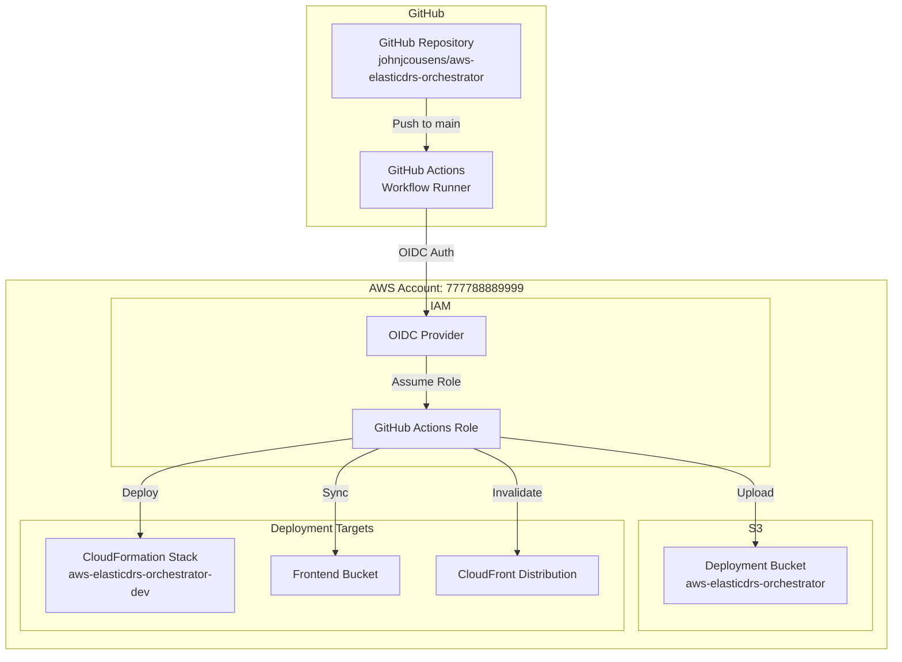

# AWS DRS Orchestration - CI/CD Setup Guide

This guide provides detailed instructions for using and configuring the GitHub Actions CI/CD infrastructure for the AWS DRS Orchestration platform.

## Table of Contents

1. [Overview](#overview)
2. [Current Infrastructure](#current-infrastructure)
3. [Quick Start](#quick-start)
4. [Pipeline Architecture](#pipeline-architecture)
5. [Development Workflow](#development-workflow)
6. [Pipeline Monitoring](#pipeline-monitoring)
7. [Troubleshooting](#troubleshooting)
8. [Advanced Configuration](#advanced-configuration)

---

## Overview

The AWS DRS Orchestration platform uses **GitHub Actions** for automated CI/CD with OIDC-based AWS authentication (no long-lived credentials required).

### Pipeline Benefits

- ✅ **6-Stage Pipeline**: Complete validation, security scan, build, test, and deployment automation
- ✅ **OIDC Authentication**: Secure AWS access without long-lived credentials
- ✅ **Security Scanning**: Integrated Bandit and Safety security checks
- ✅ **Fast Deployments**: ~20 minute full deployments
- ✅ **No Circular Dependencies**: GitHub Actions runs outside AWS, avoiding self-update issues
- ✅ **Native Git Integration**: No CodeCommit mirroring required

## Current Infrastructure

### Deployed CI/CD Components

| Component | Name | Purpose |
|-----------|------|---------|
| **Workflow** | `.github/workflows/deploy.yml` | Main CI/CD orchestration |
| **Repository** | `johnjcousens/aws-elasticdrs-orchestrator` | GitHub source repository |
| **Authentication** | OIDC (OpenID Connect) | Secure AWS access |
| **OIDC Stack** | `cfn/github-oidc-stack.yaml` | IAM role for GitHub Actions |
| **Account** | 777788889999 | AWS account for all resources |
| **Deployment Bucket** | `aws-elasticdrs-orchestrator` | Artifact storage |

### Pipeline Stages

| Stage | Purpose | Duration | Key Actions |
|-------|---------|----------|-------------|
| **Validate** | Template and code validation | ~2 min | CloudFormation validation, Python linting, TypeScript checking |
| **Security Scan** | Security analysis | ~2 min | Bandit security scan, Safety dependency check |
| **Build** | Package creation | ~3 min | Lambda packaging, frontend build |
| **Test** | Automated testing | ~2 min | Unit tests, integration tests |
| **Deploy Infrastructure** | AWS resource deployment | ~10 min | CloudFormation stack updates |
| **Deploy Frontend** | Frontend deployment | ~2 min | S3 sync, CloudFront invalidation |

**Total Duration**: ~20 minutes for complete deployment

## Quick Start

### Prerequisites

- GitHub repository with admin access
- AWS CLI configured with appropriate permissions
- S3 deployment bucket exists (`aws-elasticdrs-orchestrator`)

### Step 1: Deploy the GitHub OIDC Stack (One-Time)

```bash
# Set your parameters
export PROJECT_NAME="aws-elasticdrs-orchestrator"
export ENVIRONMENT="dev"
export GITHUB_ORG="johnjcousens"
export GITHUB_REPO="aws-elasticdrs-orchestrator"
export DEPLOYMENT_BUCKET="aws-elasticdrs-orchestrator"
export APP_STACK_NAME="${PROJECT_NAME}-${ENVIRONMENT}"

# Deploy the OIDC stack
aws cloudformation deploy \
  --template-file cfn/github-oidc-stack.yaml \
  --stack-name "${PROJECT_NAME}-github-oidc" \
  --parameter-overrides \
    ProjectName="${PROJECT_NAME}" \
    Environment="${ENVIRONMENT}" \
    GitHubOrg="${GITHUB_ORG}" \
    GitHubRepo="${GITHUB_REPO}" \
    DeploymentBucket="${DEPLOYMENT_BUCKET}" \
    ApplicationStackName="${APP_STACK_NAME}" \
  --capabilities CAPABILITY_NAMED_IAM \
  --region us-east-1

# Get the role ARN for GitHub secrets
aws cloudformation describe-stacks \
  --stack-name "${PROJECT_NAME}-github-oidc" \
  --query 'Stacks[0].Outputs[?OutputKey==`GitHubActionsRoleArn`].OutputValue' \
  --output text
```

### Step 2: Configure GitHub Repository Secrets

Go to your GitHub repository → Settings → Secrets and variables → Actions → New repository secret

Add these secrets:

| Secret Name | Value | Description |
|-------------|-------|-------------|
| `AWS_ROLE_ARN` | `arn:aws:iam::777788889999:role/aws-elasticdrs-orchestrator-github-actions-dev` | IAM role ARN from Step 1 |
| `DEPLOYMENT_BUCKET` | `aws-elasticdrs-orchestrator` | S3 bucket for artifacts |
| `STACK_NAME` | `aws-elasticdrs-orchestrator-dev` | CloudFormation stack name |
| `ADMIN_EMAIL` | `admin@example.com` | Admin email for Cognito |

### Step 3: Trigger Your First Pipeline

```bash
# Ensure you're on main branch
git checkout main

# Push to GitHub to trigger pipeline
git add .
git commit -m "Your changes"
git push origin main
```

### Step 4: Monitor Pipeline Execution

- **GitHub Actions Console**: https://github.com/johnjcousens/aws-elasticdrs-orchestrator/actions
- **Expected Duration**: ~20 minutes for complete deployment
- **Success Indicators**: All 6 stages show green checkmarks

## Pipeline Architecture



## Development Workflow

### Daily Development Process

#### Option A: GitHub CI/CD (Recommended for Production)
```bash
# 1. Make changes on feature branch
git checkout -b feature/new-feature
# Make changes
git add .
git commit -m "Add new feature"
git push origin feature/new-feature

# 2. Create Pull Request on GitHub
# 3. After merge to main, pipeline triggers automatically
```

#### Option B: Manual Deployment (Recommended for Development)
```bash
# Fast development workflow using S3 deployment bucket
./scripts/sync-to-deployment-bucket.sh                    # Sync all to S3
./scripts/sync-to-deployment-bucket.sh --update-lambda-code  # Update Lambda functions (~5s)
./scripts/sync-to-deployment-bucket.sh --deploy-cfn       # Deploy CloudFormation (~5-10min)
```

### When to Use Each Approach

| Scenario | Recommended Approach | Duration |
|----------|---------------------|----------|
| **Daily Development** | Manual deployment with `--update-lambda-code` | ~5 seconds |
| **Infrastructure Changes** | Manual deployment with `--deploy-cfn` | ~5-10 minutes |
| **Production Releases** | GitHub Actions CI/CD | ~20 minutes |
| **Team Collaboration** | GitHub Actions CI/CD | ~20 minutes |
| **Security Validation** | GitHub Actions CI/CD (includes security scanning) | ~20 minutes |

### Branch Strategy

- **main**: Production-ready code, triggers full deployment
- **feature/***: Feature development branches
- **hotfix/***: Critical fixes, can be fast-tracked
- **develop**: Integration branch (optional)

### Pipeline Triggers

| Action | Trigger | Result |
|--------|---------|--------|
| Push to `main` | Automatic | Full 6-stage pipeline execution |
| Pull Request | Automatic | Validation and testing only |
| Manual dispatch | Manual | Full deployment with environment selection |

## Pipeline Monitoring

### GitHub Actions Console

Monitor pipeline execution at:
https://github.com/johnjcousens/aws-elasticdrs-orchestrator/actions

### Manual Trigger

You can also trigger deployments manually:

1. Go to Actions tab in GitHub
2. Select "Deploy AWS DRS Orchestration"
3. Click "Run workflow"
4. Select environment (dev/test/prod)
5. Click "Run workflow"

### AWS Resource Monitoring

```bash
# Check CloudFormation stack status
AWS_PAGER="" aws cloudformation describe-stacks \
  --stack-name aws-elasticdrs-orchestrator-dev \
  --region us-east-1 \
  --query 'Stacks[0].StackStatus'

# Check Lambda function update time
AWS_PAGER="" aws lambda get-function \
  --function-name aws-elasticdrs-orchestrator-api-handler-dev \
  --query 'Configuration.LastModified' \
  --output text

# Check frontend bucket sync
AWS_PAGER="" aws s3 ls s3://aws-elasticdrs-orchestrator-frontend-dev/assets/ | head -5
```

## Troubleshooting

### Common Pipeline Failures

#### 1. OIDC Authentication Fails
**Symptoms**: Pipeline fails with "Could not assume role" error
**Solutions**:
```bash
# Verify OIDC stack is deployed
AWS_PAGER="" aws cloudformation describe-stacks \
  --stack-name aws-elasticdrs-orchestrator-github-oidc \
  --region us-east-1

# Check GitHub repository matches trust policy
# Ensure workflow has id-token: write permission
```

#### 2. Validate Stage Failure
**Symptoms**: CloudFormation template validation errors
**Solutions**:
```bash
# Validate templates locally
aws cloudformation validate-template \
  --template-body file://cfn/master-template.yaml \
  --region us-east-1

# Check Python code quality
flake8 lambda/ --config .flake8
black --check lambda/
```

#### 3. Security Scan Stage Failure
**Symptoms**: Security vulnerabilities detected
**Solutions**:
```bash
# Run Bandit locally
bandit -r lambda/ -f json

# Run Safety check
safety check -r lambda/requirements.txt
```

#### 4. Build Stage Failure
**Symptoms**: Lambda packaging or frontend build issues
**Solutions**:
```bash
# Test Lambda packaging locally
cd lambda/api-handler
pip install -r requirements.txt -t .
zip -r api-handler.zip .

# Test frontend build locally
cd frontend
npm install
npm run build
```

#### 5. Deploy Infrastructure Failure
**Symptoms**: CloudFormation deployment errors
**Solutions**:
```bash
# Check CloudFormation events
AWS_PAGER="" aws cloudformation describe-stack-events \
  --stack-name aws-elasticdrs-orchestrator-dev \
  --region us-east-1 \
  --query 'StackEvents[?ResourceStatus==`CREATE_FAILED` || ResourceStatus==`UPDATE_FAILED`]' | head -50

# Check IAM role permissions
AWS_PAGER="" aws iam get-role \
  --role-name aws-elasticdrs-orchestrator-github-actions-dev
```

### Debug Commands

```bash
# Get CloudFormation stack outputs
AWS_PAGER="" aws cloudformation describe-stacks \
  --stack-name aws-elasticdrs-orchestrator-dev \
  --region us-east-1 \
  --query 'Stacks[0].Outputs'

# Check S3 deployment bucket contents
AWS_PAGER="" aws s3 ls s3://aws-elasticdrs-orchestrator/ --recursive | head -20
```

## Advanced Configuration

### Environment Variables

Key environment variables used in the workflow:

```yaml
# GitHub Actions workflow environment
PROJECT_NAME: aws-elasticdrs-orchestrator
ENVIRONMENT: dev
DEPLOYMENT_BUCKET: aws-elasticdrs-orchestrator
AWS_REGION: us-east-1
STACK_NAME: aws-elasticdrs-orchestrator-dev
```

### Multi-Environment Support

The workflow supports multiple environments via manual dispatch:

```yaml
# In .github/workflows/deploy.yml
on:
  workflow_dispatch:
    inputs:
      environment:
        description: 'Environment to deploy'
        required: true
        default: 'dev'
        type: choice
        options:
          - dev
          - test
          - prod
```

### Custom Workflow Modifications

To customize the workflow, edit `.github/workflows/deploy.yml`:

```yaml
# Add custom validation steps
- name: Custom Validation
  run: |
    python scripts/custom-validation.py
    
# Add custom notifications
- name: Slack Notification
  if: always()
  uses: 8398a7/action-slack@v3
  with:
    status: ${{ job.status }}
    webhook_url: ${{ secrets.SLACK_WEBHOOK }}
```

## Best Practices

### Security
- ✅ Use OIDC authentication (no long-lived credentials)
- ✅ Store sensitive data in GitHub Secrets
- ✅ Enable branch protection for main branch
- ✅ Regular security scanning with Bandit and Safety

### Performance
- ✅ Use caching for npm and pip dependencies
- ✅ Parallel job execution where possible
- ✅ Efficient artifact management
- ✅ Incremental deployments for Lambda code

### Reliability
- ✅ Comprehensive error handling in workflow
- ✅ Automatic rollback on deployment failures
- ✅ Health checks and monitoring
- ✅ Manual deployment fallback option

### Cost Optimization
- ✅ GitHub Actions free tier for public repos
- ✅ Efficient workflow design to minimize minutes
- ✅ S3 lifecycle policies for artifacts
- ✅ Resource cleanup after deployments

## Related Documentation

- [GitHub Actions Setup Guide](GITHUB_ACTIONS_SETUP_GUIDE.md) - Detailed OIDC setup
- [Fresh Deployment Guide](FRESH_DEPLOYMENT_GUIDE.md) - Complete fresh environment setup
- [Development Workflow Guide](../DEVELOPMENT_WORKFLOW_GUIDE.md) - Daily development procedures
- [Troubleshooting Guide](../TROUBLESHOOTING_GUIDE.md) - Common issues and solutions

---

## Historical Note

> **Migration from AWS CodePipeline**: This project previously used AWS CodePipeline with CodeCommit for CI/CD. The migration to GitHub Actions was completed in January 2026 (v1.3.0) to eliminate circular dependency issues where the pipeline would try to update the CloudFormation stack containing itself. The GitHub Actions approach provides simpler architecture, better debugging, and native Git integration without requiring CodeCommit mirroring.

This comprehensive CI/CD setup guide provides everything needed to configure, customize, and maintain the AWS DRS Orchestration CI/CD pipeline with GitHub Actions.
