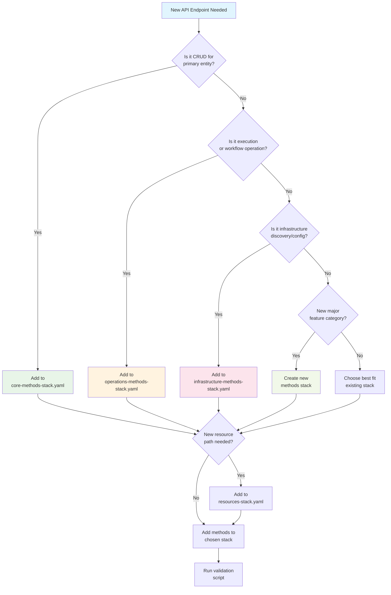

# API Development Quick Reference

## Adding New API Endpoints - Decision Tree



## Stack Selection Guide

| Endpoint Type | Example | Stack |
|---------------|---------|-------|
| **CRUD Operations** | `/protection-groups`, `/recovery-plans` | `core-methods-stack.yaml` |
| **Execution Control** | `/executions/{id}/pause`, `/executions/{id}/resume` | `operations-methods-stack.yaml` |
| **DRS Operations** | `/drs/start-recovery`, `/drs/jobs` | `operations-methods-stack.yaml` |
| **Infrastructure** | `/drs/source-servers`, `/ec2/subnets` | `infrastructure-methods-stack.yaml` |
| **Configuration** | `/config`, `/settings` | `core-methods-stack.yaml` |
| **Cross-Account** | `/accounts/targets` | `infrastructure-methods-stack.yaml` |

## Step-by-Step Process

### 1. Add Resource (if new path needed)

```yaml
# In cfn/api-gateway-resources-stack.yaml
NewFeatureResource:
  Type: AWS::ApiGateway::Resource
  Properties:
    RestApiId: !Ref RestApiId
    ParentId: !Ref RootResourceId
    PathPart: 'new-feature'

# Export the resource ID
Outputs:
  NewFeatureResourceId:
    Description: 'API Gateway Resource ID for New Feature'
    Value: !Ref NewFeatureResource
    Export:
      Name: !Sub '${AWS::StackName}-NewFeatureResourceId'
```

### 2. Add Methods to Appropriate Stack

```yaml
# In appropriate cfn/api-gateway-*-methods-stack.yaml

# Import resource ID
Parameters:
  NewFeatureResourceId:
    Type: String
    Description: 'Resource ID for new feature endpoint'

# Add GET method
NewFeatureGetMethod:
  Type: AWS::ApiGateway::Method
  Properties:
    RestApiId: !Ref RestApiId
    ResourceId: !Ref NewFeatureResourceId
    HttpMethod: GET
    AuthorizationType: COGNITO_USER_POOLS
    AuthorizerId: !Ref AuthorizerId
    Integration:
      Type: AWS_PROXY
      IntegrationHttpMethod: POST
      Uri: !Sub 'arn:aws:apigateway:${AWS::Region}:lambda:path/2015-03-31/functions/${LambdaFunctionArn}/invocations'

# Add OPTIONS method for CORS
NewFeatureOptionsMethod:
  Type: AWS::ApiGateway::Method
  Properties:
    RestApiId: !Ref RestApiId
    ResourceId: !Ref NewFeatureResourceId
    HttpMethod: OPTIONS
    AuthorizationType: NONE
    Integration:
      Type: MOCK
      IntegrationResponses:
        - StatusCode: 200
          ResponseParameters:
            method.response.header.Access-Control-Allow-Headers: "'Content-Type,X-Amz-Date,Authorization,X-Api-Key,X-Amz-Security-Token'"
            method.response.header.Access-Control-Allow-Methods: "'GET,OPTIONS'"
            method.response.header.Access-Control-Allow-Origin: "'*'"
          ResponseTemplates:
            application/json: ''
      RequestTemplates:
        application/json: '{"statusCode": 200}'
    MethodResponses:
      - StatusCode: 200
        ResponseParameters:
          method.response.header.Access-Control-Allow-Headers: false
          method.response.header.Access-Control-Allow-Methods: false
          method.response.header.Access-Control-Allow-Origin: false
```

### 3. Update Master Template (if new stack created)

```yaml
# In cfn/master-template.yaml
ApiGatewayNewCategoryMethodsStack:
  Type: AWS::CloudFormation::Stack
  DependsOn: ApiGatewayResourcesStack
  Properties:
    TemplateURL: !Sub '${TemplateBaseUrl}/api-gateway-new-category-methods-stack.yaml'
    Parameters:
      RestApiId: !GetAtt ApiGatewayCoreStack.Outputs.RestApiId
      AuthorizerId: !GetAtt ApiGatewayCoreStack.Outputs.AuthorizerId
      LambdaFunctionArn: !GetAtt LambdaStack.Outputs.ApiHandlerFunctionArn
      NewFeatureResourceId: !GetAtt ApiGatewayResourcesStack.Outputs.NewFeatureResourceId
```

## Validation Commands

```bash
# Run architecture validation
./scripts/validate-api-architecture.sh

# Check CloudFormation syntax
make validate

# Check resource counts
grep -E "^  [A-Za-z][A-Za-z0-9]*:$" cfn/api-gateway-*-methods-stack.yaml | wc -l

# Check template sizes
ls -la cfn/api-gateway-*.yaml | awk '{print $5/1024 "KB", $9}'
```

## Common Patterns

### CRUD Endpoint Set
```yaml
# GET /items
ItemsGetMethod: ...

# POST /items  
ItemsPostMethod: ...

# GET /items/{id}
ItemGetMethod: ...

# PUT /items/{id}
ItemPutMethod: ...

# DELETE /items/{id}
ItemDeleteMethod: ...

# OPTIONS for each resource
ItemsOptionsMethod: ...
ItemOptionsMethod: ...
```

### Action Endpoint
```yaml
# POST /items/{id}/action
ItemActionMethod:
  Properties:
    HttpMethod: POST
    # ... standard integration

ItemActionOptionsMethod:
  Properties:
    HttpMethod: OPTIONS
    # ... standard CORS
```

## Naming Conventions

| Pattern | Example | Usage |
|---------|---------|-------|
| `[Feature]sGetMethod` | `ProtectionGroupsGetMethod` | GET /protection-groups |
| `[Feature]GetMethod` | `ProtectionGroupGetMethod` | GET /protection-groups/{id} |
| `[Feature]sPostMethod` | `ProtectionGroupsPostMethod` | POST /protection-groups |
| `[Feature]PutMethod` | `ProtectionGroupPutMethod` | PUT /protection-groups/{id} |
| `[Feature]DeleteMethod` | `ProtectionGroupDeleteMethod` | DELETE /protection-groups/{id} |
| `[Feature][Action]Method` | `ExecutionPauseMethod` | POST /executions/{id}/pause |
| `[Feature]OptionsMethod` | `ProtectionGroupOptionsMethod` | OPTIONS /protection-groups/{id} |

## Resource Limits

| Metric | Warning | Action Required |
|--------|---------|-----------------|
| Resources per stack | 350+ | 400+ |
| Template size | 800KB+ | 900KB+ |
| Methods without OPTIONS | Any | Add CORS |
| Hardcoded values | Any | Use parameters |

## Troubleshooting

### "Template too large" Error
```bash
# Check template sizes
ls -la cfn/api-gateway-*.yaml

# Split large method stack into multiple stacks
# Move related methods to new stack file
```

### "Resource limit exceeded" Error
```bash
# Count resources per stack
./scripts/validate-api-architecture.sh

# Create new method stack for additional endpoints
```

### CORS Issues
```bash
# Ensure every non-OPTIONS method has corresponding OPTIONS method
grep -c "HttpMethod: GET\|POST\|PUT\|DELETE" cfn/api-gateway-*-methods-stack.yaml
grep -c "HttpMethod: OPTIONS" cfn/api-gateway-*-methods-stack.yaml
```

### Deployment Failures
```bash
# Check parameter passing between stacks
# Ensure resources stack exports all resource IDs
# Ensure method stacks import required parameters
```

## Best Practices Checklist

- [ ] Choose appropriate method stack based on functionality
- [ ] Add resource to resources stack if new path needed
- [ ] Follow naming convention: `[Feature][Action]Method`
- [ ] Include OPTIONS method for CORS
- [ ] Use AWS_PROXY integration pattern
- [ ] Use parameters instead of hardcoded values
- [ ] Export resource IDs from resources stack
- [ ] Import required parameters in method stacks
- [ ] Run validation script before committing
- [ ] Update API Reference Guide documentation
- [ ] Test in development environment

This quick reference ensures consistent API development following the nested stack architecture pattern.