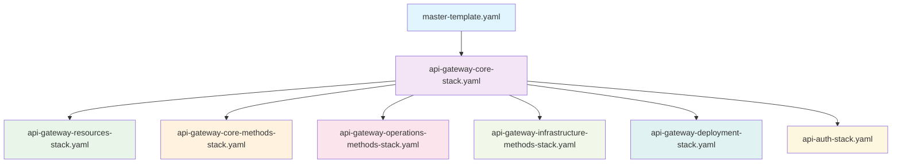

# API Gateway Architecture Guide

## Overview

The AWS DRS Orchestration API Gateway uses a **nested stack architecture** to organize resources logically and avoid CloudFormation template size limits. This guide explains the architecture pattern and provides guidelines for future API development.

---

## Current Architecture Pattern

### Stack Hierarchy



### Stack Responsibilities

| Stack | Purpose | Resource Count | CloudFormation Limit |
|-------|---------|----------------|---------------------|
| `api-gateway-core-stack.yaml` | REST API, Authorizer, Lambda Permissions | ~10 | 500 resources |
| `api-gateway-resources-stack.yaml` | API Resources (URL paths) | ~50 | 500 resources |
| `api-gateway-core-methods-stack.yaml` | Core CRUD methods (Protection Groups, Recovery Plans) | ~30 | 500 resources |
| `api-gateway-operations-methods-stack.yaml` | Execution & DRS operation methods | ~40 | 500 resources |
| `api-gateway-infrastructure-methods-stack.yaml` | Infrastructure & configuration methods | ~35 | 500 resources |
| `api-gateway-deployment-stack.yaml` | Deployment, Stage, CORS responses | ~15 | 500 resources |
| `api-auth-stack.yaml` | Cognito User Pool, Client, Identity Pool | ~10 | 500 resources |

**Total Resources**: ~190 across 7 stacks (well under individual stack limits)

---

## Why This Architecture?

### 1. **CloudFormation Template Size Limits**
- **Resource Limit**: 500 resources per template
- **Template Size**: 1MB limit (460KB for S3, 51KB for direct upload)
- **Current API**: 47+ endpoints × 2-4 resources each = 150+ resources
- **Future Growth**: Room for 100+ additional endpoints

### 2. **Logical Separation of Concerns**
- **Core**: Foundational API infrastructure
- **Resources**: URL path structure
- **Methods by Category**: Grouped by functional domain
- **Deployment**: Stage management and CORS
- **Auth**: Authentication and authorization

### 3. **Development Team Efficiency**
- **Parallel Development**: Teams can work on different method categories
- **Faster Deployments**: Only changed stacks are updated
- **Easier Debugging**: Smaller, focused templates
- **Clear Ownership**: Each stack has a specific purpose

### 4. **Maintenance Benefits**
- **Reduced Complexity**: Each template is manageable size
- **Faster Validation**: cfn-lint runs quickly on smaller files
- **Easier Reviews**: Code reviews focus on specific functionality
- **Rollback Granularity**: Can rollback individual method categories

---

## API Endpoint Organization

### Current Endpoint Categories

#### Core Methods (`api-gateway-core-methods-stack.yaml`)
- **Protection Groups**: `/protection-groups`, `/protection-groups/{id}`
- **Recovery Plans**: `/recovery-plans`, `/recovery-plans/{id}`
- **Configuration**: `/config`, `/settings`
- **Health**: `/health`, `/version`

**Pattern**: CRUD operations for primary entities

#### Operations Methods (`api-gateway-operations-methods-stack.yaml`)
- **Executions**: `/executions`, `/executions/{id}/*`
- **DRS Operations**: `/drs/start-recovery`, `/drs/jobs`
- **Control Operations**: `/executions/{id}/pause`, `/executions/{id}/resume`

**Pattern**: Action-oriented operations and workflow control

#### Infrastructure Methods (`api-gateway-infrastructure-methods-stack.yaml`)
- **DRS Infrastructure**: `/drs/source-servers`, `/drs/quotas`
- **AWS Infrastructure**: `/ec2/subnets`, `/ec2/security-groups`
- **Cross-Account**: `/accounts/targets`

**Pattern**: Infrastructure discovery and configuration

---

## Development Guidelines

### 1. **Adding New Endpoints**

#### Step 1: Determine the Correct Stack
```bash
# Use this decision tree:
# Is it a CRUD operation for a primary entity? → core-methods-stack
# Is it an execution or workflow operation? → operations-methods-stack  
# Is it infrastructure discovery/config? → infrastructure-methods-stack
# Is it a new resource path? → Add to resources-stack first
```

#### Step 2: Add Resource (if needed)
```yaml
# In api-gateway-resources-stack.yaml
NewFeatureResource:
  Type: AWS::ApiGateway::Resource
  Properties:
    RestApiId: !Ref RestApiId
    ParentId: !Ref RootResourceId  # or appropriate parent
    PathPart: 'new-feature'

NewFeatureByIdResource:
  Type: AWS::ApiGateway::Resource
  Properties:
    RestApiId: !Ref RestApiId
    ParentId: !Ref NewFeatureResource
    PathPart: '{id}'
```

#### Step 3: Add Methods to Appropriate Stack
```yaml
# In the appropriate methods stack
NewFeatureGetMethod:
  Type: AWS::ApiGateway::Method
  Properties:
    RestApiId: !Ref RestApiId
    ResourceId: !Ref NewFeatureResourceId  # Imported from resources stack
    HttpMethod: GET
    AuthorizationType: COGNITO_USER_POOLS
    AuthorizerId: !Ref AuthorizerId
    Integration:
      Type: AWS_PROXY
      IntegrationHttpMethod: POST
      Uri: !Sub 'arn:aws:apigateway:${AWS::Region}:lambda:path/2015-03-31/functions/${LambdaFunctionArn}/invocations'

NewFeatureOptionsMethod:
  Type: AWS::ApiGateway::Method
  Properties:
    RestApiId: !Ref RestApiId
    ResourceId: !Ref NewFeatureResourceId
    HttpMethod: OPTIONS
    AuthorizationType: NONE
    Integration:
      Type: MOCK
      IntegrationResponses:
        - StatusCode: 200
          ResponseParameters:
            method.response.header.Access-Control-Allow-Headers: "'Content-Type,X-Amz-Date,Authorization,X-Api-Key,X-Amz-Security-Token'"
            method.response.header.Access-Control-Allow-Methods: "'GET,OPTIONS'"
            method.response.header.Access-Control-Allow-Origin: "'*'"
          ResponseTemplates:
            application/json: ''
      RequestTemplates:
        application/json: '{"statusCode": 200}'
    MethodResponses:
      - StatusCode: 200
        ResponseParameters:
          method.response.header.Access-Control-Allow-Headers: false
          method.response.header.Access-Control-Allow-Methods: false
          method.response.header.Access-Control-Allow-Origin: false
```

### 2. **Stack Size Monitoring**

#### Resource Count Tracking
```bash
# Check current resource counts
aws cloudformation describe-stack-resources --stack-name aws-elasticdrs-orchestrator-api-gateway-core-methods-dev --query 'StackResources[].ResourceType' | grep -c "AWS::"

# Monitor template sizes
ls -la cfn/api-gateway-*.yaml | awk '{print $5, $9}' | sort -n
```

#### Threshold Guidelines
- **Warning**: 400+ resources in a single stack
- **Action Required**: 450+ resources in a single stack
- **Template Size Warning**: 800KB+ template size
- **Template Size Action**: 900KB+ template size

### 3. **When to Create New Method Stacks**

#### Triggers for New Stack Creation
1. **Resource Count**: Any method stack approaching 400 resources
2. **Functional Domain**: New major feature category (e.g., reporting, analytics)
3. **Team Ownership**: Different team responsible for new functionality
4. **Deployment Cadence**: Features with different release schedules

#### New Stack Creation Process
```yaml
# 1. Create new methods stack file
# cfn/api-gateway-[category]-methods-stack.yaml

# 2. Add to master template
ApiGateway[Category]MethodsStack:
  Type: AWS::CloudFormation::Stack
  DependsOn: ApiGatewayResourcesStack
  Properties:
    TemplateURL: !Sub '${TemplateBaseUrl}/api-gateway-[category]-methods-stack.yaml'
    Parameters:
      RestApiId: !GetAtt ApiGatewayCoreStack.Outputs.RestApiId
      AuthorizerId: !GetAtt ApiGatewayCoreStack.Outputs.AuthorizerId
      LambdaFunctionArn: !GetAtt LambdaStack.Outputs.ApiHandlerFunctionArn
      # Import resource IDs from resources stack
      [Category]ResourceId: !GetAtt ApiGatewayResourcesStack.Outputs.[Category]ResourceId

# 3. Export resource IDs from resources stack
Outputs:
  [Category]ResourceId:
    Description: 'API Gateway Resource ID for [Category]'
    Value: !Ref [Category]Resource
    Export:
      Name: !Sub '${AWS::StackName}-[Category]ResourceId'
```

---

## Best Practices

### 1. **Resource Naming Conventions**
```yaml
# Pattern: [Feature][Action]Method
# Examples:
ProtectionGroupsGetMethod:     # GET /protection-groups
ProtectionGroupGetMethod:      # GET /protection-groups/{id}
ProtectionGroupsPostMethod:    # POST /protection-groups
ProtectionGroupPutMethod:      # PUT /protection-groups/{id}
ProtectionGroupDeleteMethod:   # DELETE /protection-groups/{id}

# Always include OPTIONS method for CORS
ProtectionGroupsOptionsMethod: # OPTIONS /protection-groups
ProtectionGroupOptionsMethod:  # OPTIONS /protection-groups/{id}
```

### 2. **Parameter Passing Between Stacks**
```yaml
# Core stack exports foundational resources
Outputs:
  RestApiId:
    Value: !Ref RestApi
    Export:
      Name: !Sub '${AWS::StackName}-RestApiId'

# Method stacks import what they need
Parameters:
  RestApiId:
    Type: String
    Description: 'REST API ID from core stack'
  
  ProtectionGroupsResourceId:
    Type: String
    Description: 'Resource ID for protection groups endpoint'
```

### 3. **CORS Consistency**
```yaml
# Standard CORS headers for all OPTIONS methods
ResponseParameters:
  method.response.header.Access-Control-Allow-Headers: "'Content-Type,X-Amz-Date,Authorization,X-Api-Key,X-Amz-Security-Token'"
  method.response.header.Access-Control-Allow-Methods: "'GET,POST,PUT,DELETE,OPTIONS'"  # Adjust per endpoint
  method.response.header.Access-Control-Allow-Origin: "'*'"
```

### 4. **Lambda Integration Pattern**
```yaml
# Standard AWS_PROXY integration for all methods
Integration:
  Type: AWS_PROXY
  IntegrationHttpMethod: POST  # Always POST for Lambda proxy
  Uri: !Sub 'arn:aws:apigateway:${AWS::Region}:lambda:path/2015-03-31/functions/${LambdaFunctionArn}/invocations'
```

---

## Migration Strategy for Large Changes

### Scenario: Adding 20+ New Endpoints

#### Option 1: Extend Existing Stacks (Recommended if under limits)
```bash
# Check current resource counts
./scripts/check-stack-sizes.sh

# If all stacks < 350 resources, distribute new endpoints
# Core methods: 5 new CRUD endpoints
# Operations: 8 new execution endpoints  
# Infrastructure: 7 new discovery endpoints
```

#### Option 2: Create New Category Stack
```bash
# If adding cohesive new feature (e.g., reporting)
# Create: api-gateway-reporting-methods-stack.yaml
# Add 20 endpoints in new dedicated stack
```

#### Option 3: Split Existing Stack
```bash
# If existing stack approaching limit
# Split operations-methods into:
# - api-gateway-execution-methods-stack.yaml (execution operations)
# - api-gateway-drs-methods-stack.yaml (DRS operations)
```

---

## Monitoring and Maintenance

### 1. **Automated Checks**
```bash
# Add to CI/CD pipeline
./scripts/validate-api-architecture.sh

# Checks:
# - Resource counts per stack
# - Template sizes
# - Naming convention compliance
# - CORS consistency
# - Parameter passing correctness
```

### 2. **Documentation Updates**
```bash
# Update when adding endpoints:
# 1. This architecture guide
# 2. API Reference Guide (docs/guides/API_REFERENCE_GUIDE.md)
# 3. Endpoint count in this document
# 4. Resource count tracking
```

### 3. **Performance Monitoring**
```bash
# Monitor deployment times per stack
# CloudFormation stack update duration
# Identify stacks that take longest to deploy
```

---

## Future Considerations

### 1. **API Gateway V2 Migration**
- **HTTP APIs**: Faster, cheaper than REST APIs
- **Simpler CORS**: Built-in CORS support
- **OpenAPI 3.0**: Better specification support
- **Migration Path**: Gradual endpoint migration

### 2. **Service Mesh Integration**
- **App Mesh**: For microservices communication
- **Service Discovery**: Dynamic endpoint registration
- **Load Balancing**: Advanced routing capabilities

### 3. **GraphQL Consideration**
- **Single Endpoint**: Reduces CloudFormation complexity
- **Schema Evolution**: Easier API versioning
- **Real-time**: Built-in subscription support
- **Trade-offs**: Different caching, security model

---

## Quick Reference

### Adding New Endpoint Checklist
- [ ] Determine appropriate method stack based on functionality
- [ ] Add resource to `api-gateway-resources-stack.yaml` (if new path)
- [ ] Add GET/POST/PUT/DELETE methods to appropriate method stack
- [ ] Add OPTIONS method for CORS support
- [ ] Follow naming conventions: `[Feature][Action]Method`
- [ ] Use standard AWS_PROXY integration pattern
- [ ] Include standard CORS headers
- [ ] Update API Reference Guide documentation
- [ ] Test deployment in development environment
- [ ] Monitor resource counts and template sizes

### Stack Selection Guide
- **Core Methods**: CRUD for Protection Groups, Recovery Plans, Config
- **Operations Methods**: Executions, DRS operations, workflow control
- **Infrastructure Methods**: AWS resource discovery, cross-account config
- **New Category**: 15+ endpoints for new major feature

This architecture ensures the API Gateway remains maintainable, scalable, and follows AWS best practices while supporting future growth and development team efficiency.