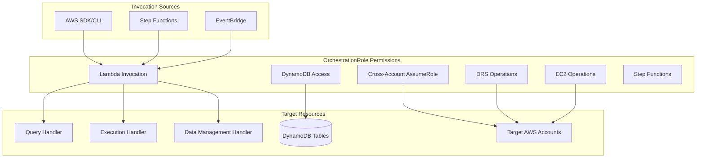

# OrchestrationRole IAM Policy Documentation

## Overview

The **OrchestrationRole** is the central IAM role that enables direct Lambda invocation mode and cross-account disaster recovery operations in the AWS DRS Orchestration Platform. This role consolidates permissions for all Lambda functions, Step Functions state machines, and cross-account DRS operations.

### Purpose

- **Direct Lambda Invocation**: Enables headless operation without API Gateway or Cognito
- **Cross-Account DRS Operations**: Assumes roles in target AWS accounts for disaster recovery
- **Unified Permissions**: Single role shared by all Lambda functions and Step Functions
- **Least Privilege**: Scoped permissions following AWS security best practices

### Role Usage

The OrchestrationRole is used by:
- **Lambda Functions**: All 6 Lambda handlers (query, execution, data-management, orchestration, polling, notifications)
- **Step Functions**: DR orchestration state machine
- **Direct Invocations**: AWS SDK/CLI calls from automation systems
- **EventBridge**: Scheduled polling and monitoring rules

## Architecture



## Required IAM Permissions

### 1. Lambda Invocation Permissions

**Purpose**: Enable direct invocation of Lambda functions without API Gateway

**Required Actions**:
```json
{
  "Effect": "Allow",
  "Action": [
    "lambda:InvokeFunction"
  ],
  "Resource": [
    "arn:aws:lambda:REGION:ACCOUNT_ID:function:PROJECT-query-handler-ENVIRONMENT",
    "arn:aws:lambda:REGION:ACCOUNT_ID:function:PROJECT-execution-handler-ENVIRONMENT",
    "arn:aws:lambda:REGION:ACCOUNT_ID:function:PROJECT-data-management-handler-ENVIRONMENT"
  ]
}
```

**Why Required**:
- Enables AWS SDK/CLI to invoke Lambda functions directly
- Required for headless operation mode
- Supports automation workflows and CI/CD pipelines

**Validates**: Requirements 11.1, 11.2, 11.3

---

### 2. DynamoDB Permissions

**Purpose**: Read and write access to all DynamoDB tables for data persistence

**Required Actions**:
```json
{
  "Effect": "Allow",
  "Action": [
    "dynamodb:GetItem",
    "dynamodb:PutItem",
    "dynamodb:UpdateItem",
    "dynamodb:DeleteItem",
    "dynamodb:Query",
    "dynamodb:Scan",
    "dynamodb:BatchGetItem",
    "dynamodb:BatchWriteItem"
  ],
  "Resource": [
    "arn:aws:dynamodb:REGION:ACCOUNT_ID:table/PROJECT-protection-groups-ENVIRONMENT",
    "arn:aws:dynamodb:REGION:ACCOUNT_ID:table/PROJECT-recovery-plans-ENVIRONMENT",
    "arn:aws:dynamodb:REGION:ACCOUNT_ID:table/PROJECT-execution-history-ENVIRONMENT",
    "arn:aws:dynamodb:REGION:ACCOUNT_ID:table/PROJECT-target-accounts-ENVIRONMENT"
  ]
}
```

**Why Required**:
- Protection groups and recovery plans storage
- Execution history tracking
- Target account configuration
- Server launch configurations

**Validates**: Requirements 11.4, 11.5

---

### 3. Step Functions Permissions

**Purpose**: Start and manage Step Functions executions for wave-based recovery

**Required Actions**:
```json
{
  "Effect": "Allow",
  "Action": [
    "states:StartExecution",
    "states:DescribeExecution",
    "states:ListExecutions",
    "states:SendTaskSuccess",
    "states:SendTaskFailure",
    "states:SendTaskHeartbeat"
  ],
  "Resource": [
    "arn:aws:states:REGION:ACCOUNT_ID:stateMachine:PROJECT-orchestration-ENVIRONMENT",
    "arn:aws:states:REGION:ACCOUNT_ID:execution:PROJECT-orchestration-ENVIRONMENT:*"
  ]
}
```

**Why Required**:
- Start recovery plan executions
- Monitor execution progress
- Implement pause/resume callback pattern
- Handle execution lifecycle

**Validates**: Requirements 11.6

---

### 4. Cross-Account AssumeRole Permissions

**Purpose**: Assume roles in target AWS accounts for cross-account DRS operations

**Required Actions**:
```json
{
  "Effect": "Allow",
  "Action": [
    "sts:AssumeRole"
  ],
  "Resource": [
    "arn:aws:iam::*:role/DRSOrchestrationRole"
  ]
}
```

**Why Required**:
- Perform DRS operations in target AWS accounts
- Access DRS source servers across accounts
- Manage recovery instances in target accounts
- Standardized role name pattern: `DRSOrchestrationRole`

**Security Note**: The wildcard (`*`) in account ID is intentional to support multiple target accounts. The role name is standardized to `DRSOrchestrationRole` for security.

**Validates**: Requirements 11.7, 13.1, 13.2

---

### 5. DRS Read Permissions

**Purpose**: Query DRS source servers, recovery snapshots, and job status

**Required Actions**:
```json
{
  "Effect": "Allow",
  "Action": [
    "drs:DescribeSourceServers",
    "drs:DescribeRecoverySnapshots",
    "drs:DescribeRecoveryInstances",
    "drs:DescribeJobs",
    "drs:DescribeJobLogItems",
    "drs:GetLaunchConfiguration",
    "drs:GetReplicationConfiguration",
    "drs:GetFailbackReplicationConfiguration",
    "drs:DescribeLaunchConfigurationTemplates",
    "drs:DescribeReplicationConfigurationTemplates",
    "drs:ListLaunchActions",
    "drs:ListTagsForResource",
    "drs:ListExtensibleSourceServers",
    "drs:ListStagingAccounts"
  ],
  "Resource": "*"
}
```

**Why Required**:
- List and describe DRS source servers
- Query replication status and recovery points
- Retrieve launch configurations
- Monitor DRS job progress
- List staging accounts for capacity management

**Resource Wildcard**: DRS API requires `"Resource": "*"` by design

---

### 6. DRS Write Permissions

**Purpose**: Execute recovery operations and update DRS configurations

**Required Actions**:
```json
{
  "Effect": "Allow",
  "Action": [
    "drs:StartRecovery",
    "drs:CreateRecoveryInstanceForDrs",
    "drs:TerminateRecoveryInstances",
    "drs:DisconnectRecoveryInstance",
    "drs:StartFailbackLaunch",
    "drs:StopFailback",
    "drs:ReverseReplication",
    "drs:UpdateLaunchConfiguration",
    "drs:UpdateReplicationConfiguration",
    "drs:UpdateFailbackReplicationConfiguration",
    "drs:PutLaunchAction",
    "drs:DeleteLaunchAction",
    "drs:TagResource",
    "drs:UntagResource",
    "drs:GetAgentInstallationAssetsForDrs",
    "drs:IssueAgentCertificateForDrs",
    "drs:CreateSourceServerForDrs"
  ],
  "Resource": "*"
}
```

**Why Required**:
- Start disaster recovery operations
- Create recovery instances
- Terminate recovery instances after drill/recovery
- Update launch configurations
- Manage DRS tags
- Support failback operations

**Critical Permission**: `drs:CreateRecoveryInstanceForDrs` is required for the `AllowLaunchingIntoThisInstance` pattern

**Resource Wildcard**: DRS API requires `"Resource": "*"` by design

---

### 7. EC2 Permissions

**Purpose**: Comprehensive EC2 access for DRS operations including instance management, networking, and launch templates

**Required Actions**:
```json
{
  "Effect": "Allow",
  "Action": [
    "ec2:DescribeInstances",
    "ec2:DescribeInstanceStatus",
    "ec2:DescribeInstanceTypes",
    "ec2:DescribeInstanceAttribute",
    "ec2:DescribeInstanceTypeOfferings",
    "ec2:StartInstances",
    "ec2:StopInstances",
    "ec2:TerminateInstances",
    "ec2:ModifyInstanceAttribute",
    "ec2:GetConsoleOutput",
    "ec2:GetConsoleScreenshot",
    "ec2:RunInstances",
    "ec2:DescribeVolumes",
    "ec2:DescribeVolumeAttribute",
    "ec2:CreateVolume",
    "ec2:DeleteVolume",
    "ec2:AttachVolume",
    "ec2:DetachVolume",
    "ec2:ModifyVolume",
    "ec2:DescribeSnapshots",
    "ec2:CreateSnapshot",
    "ec2:DeleteSnapshot",
    "ec2:DescribeImages",
    "ec2:RegisterImage",
    "ec2:DeregisterImage",
    "ec2:DescribeSecurityGroups",
    "ec2:CreateSecurityGroup",
    "ec2:AuthorizeSecurityGroupIngress",
    "ec2:AuthorizeSecurityGroupEgress",
    "ec2:RevokeSecurityGroupEgress",
    "ec2:DescribeSubnets",
    "ec2:DescribeVpcs",
    "ec2:DescribeVpcAttribute",
    "ec2:DescribeNetworkInterfaces",
    "ec2:CreateNetworkInterface",
    "ec2:DeleteNetworkInterface",
    "ec2:ModifyNetworkInterfaceAttribute",
    "ec2:CreateNetworkInterfacePermission",
    "ec2:DescribeInternetGateways",
    "ec2:DescribeNetworkAcls",
    "ec2:DescribeRouteTables",
    "ec2:DescribeDhcpOptions",
    "ec2:DescribeManagedPrefixLists",
    "ec2:GetManagedPrefixListEntries",
    "ec2:GetManagedPrefixListAssociations",
    "ec2:DescribeAvailabilityZones",
    "ec2:DescribeAccountAttributes",
    "ec2:DescribeCapacityReservations",
    "ec2:DescribeHosts",
    "ec2:DescribeKeyPairs",
    "ec2:GetEbsEncryptionByDefault",
    "ec2:GetEbsDefaultKmsKeyId",
    "ec2:CreateTags",
    "ec2:DeleteTags",
    "ec2:DescribeTags",
    "ec2:CreateLaunchTemplate",
    "ec2:CreateLaunchTemplateVersion",
    "ec2:DescribeLaunchTemplates",
    "ec2:DescribeLaunchTemplateVersions",
    "ec2:ModifyLaunchTemplate",
    "ec2:DeleteLaunchTemplate",
    "ec2:DeleteLaunchTemplateVersions"
  ],
  "Resource": "*"
}
```

**Why Required**:
- **Instance Management**: Start, stop, terminate recovery instances
- **Volume Operations**: Manage EBS volumes for recovered workloads
- **Snapshot Management**: Create and manage recovery snapshots
- **Image Operations**: Register/deregister AMIs for drill conversions
- **Network Configuration**: Manage security groups, network interfaces, VPC settings
- **Launch Templates**: Critical for DRS launch configuration management
- **Capacity Planning**: Query availability zones and instance type offerings

**Resource Wildcard**: EC2 API requires `"Resource": "*"` for most describe operations

**Based On**: AWS managed policy `AWSElasticDisasterRecoveryServiceRolePolicy`

---

### 8. IAM Permissions

**Purpose**: Pass IAM roles to DRS and EC2 services, query instance profiles

**Required Actions**:
```json
{
  "Effect": "Allow",
  "Action": [
    "iam:PassRole"
  ],
  "Resource": "*",
  "Condition": {
    "StringEquals": {
      "iam:PassedToService": [
        "drs.amazonaws.com",
        "ec2.amazonaws.com"
      ]
    }
  }
}
```

```json
{
  "Effect": "Allow",
  "Action": [
    "iam:GetInstanceProfile",
    "iam:ListInstanceProfiles",
    "iam:ListRoles",
    "iam:ListAccountAliases"
  ],
  "Resource": "*"
}
```

**Why Required**:
- **PassRole**: DRS needs to launch EC2 instances with IAM instance profiles
- **GetInstanceProfile**: Retrieve instance profile configurations for launch
- **ListInstanceProfiles**: Query available instance profiles
- **ListRoles**: Discover available IAM roles
- **ListAccountAliases**: Display friendly account names in UI

**Security**: PassRole is scoped to DRS and EC2 services only via condition

---

### 9. KMS Permissions

**Purpose**: Access encrypted EBS volumes and DRS replication data

**Required Actions**:
```json
{
  "Effect": "Allow",
  "Action": [
    "kms:DescribeKey",
    "kms:ListAliases",
    "kms:CreateGrant"
  ],
  "Resource": "*",
  "Condition": {
    "StringEquals": {
      "kms:ViaService": [
        "ec2.REGION.amazonaws.com",
        "drs.REGION.amazonaws.com"
      ]
    }
  }
}
```

**Why Required**:
- **DescribeKey**: Query KMS key metadata for encrypted volumes
- **ListAliases**: Discover available KMS keys
- **CreateGrant**: Allow DRS to use customer-managed keys for replication

**Security**: Scoped to EC2 and DRS service usage only via condition

---

### 10. CloudFormation Permissions

**Purpose**: Query stack information for custom resource handlers

**Required Actions**:
```json
{
  "Effect": "Allow",
  "Action": [
    "cloudformation:DescribeStacks",
    "cloudformation:DescribeStackEvents",
    "cloudformation:DescribeStackResource",
    "cloudformation:DescribeStackResources",
    "cloudformation:ListStacks"
  ],
  "Resource": "*"
}
```

**Why Required**:
- Frontend deployer Lambda queries stack outputs
- Custom resource handlers need stack metadata
- Deployment automation requires stack status

---

### 11. S3 Permissions

**Purpose**: Access deployment artifacts and configuration files

**Required Actions**:
```json
{
  "Effect": "Allow",
  "Action": [
    "s3:GetObject",
    "s3:PutObject",
    "s3:DeleteObject",
    "s3:ListBucket"
  ],
  "Resource": [
    "arn:aws:s3:::PROJECT-ENVIRONMENT/*",
    "arn:aws:s3:::PROJECT-ENVIRONMENT"
  ]
}
```

**Why Required**:
- Read Lambda deployment packages
- Access configuration files
- Frontend deployment operations

---

## Complete IAM Policy Examples

### Option 1: Inline Policy (Recommended for CloudFormation)

This approach embeds all policies directly in the IAM role definition. Best for CloudFormation deployments.

```yaml
OrchestrationRole:
  Type: AWS::IAM::Role
  Properties:
    RoleName: !Sub "${ProjectName}-orchestration-role-${Environment}"
    AssumeRolePolicyDocument:
      Version: "2012-10-17"
      Statement:
        - Effect: Allow
          Principal:
            Service:
              - lambda.amazonaws.com
              - states.amazonaws.com
          Action: sts:AssumeRole
    ManagedPolicyArns:
      - arn:aws:iam::aws:policy/service-role/AWSLambdaBasicExecutionRole
    Policies:
      - PolicyName: LambdaInvocationAccess
        PolicyDocument:
          Version: "2012-10-17"
          Statement:
            - Effect: Allow
              Action:
                - lambda:InvokeFunction
              Resource:
                - !Sub "arn:${AWS::Partition}:lambda:${AWS::Region}:${AWS::AccountId}:function:${ProjectName}-query-handler-${Environment}"
                - !Sub "arn:${AWS::Partition}:lambda:${AWS::Region}:${AWS::AccountId}:function:${ProjectName}-execution-handler-${Environment}"
                - !Sub "arn:${AWS::Partition}:lambda:${AWS::Region}:${AWS::AccountId}:function:${ProjectName}-data-management-handler-${Environment}"
      
      - PolicyName: DynamoDBAccess
        PolicyDocument:
          Version: "2012-10-17"
          Statement:
            - Effect: Allow
              Action:
                - dynamodb:GetItem
                - dynamodb:PutItem
                - dynamodb:UpdateItem
                - dynamodb:DeleteItem
                - dynamodb:Query
                - dynamodb:Scan
                - dynamodb:BatchGetItem
                - dynamodb:BatchWriteItem
              Resource:
                - !Sub "arn:${AWS::Partition}:dynamodb:${AWS::Region}:${AWS::AccountId}:table/${ProjectName}-*"
      
      - PolicyName: StepFunctionsAccess
        PolicyDocument:
          Version: "2012-10-17"
          Statement:
            - Effect: Allow
              Action:
                - states:StartExecution
                - states:DescribeExecution
                - states:ListExecutions
                - states:SendTaskSuccess
                - states:SendTaskFailure
                - states:SendTaskHeartbeat
              Resource:
                - !Sub "arn:${AWS::Partition}:states:${AWS::Region}:${AWS::AccountId}:stateMachine:${ProjectName}-*"
                - !Sub "arn:${AWS::Partition}:states:${AWS::Region}:${AWS::AccountId}:execution:${ProjectName}-*:*"
      
      - PolicyName: DRSReadAccess
        PolicyDocument:
          Version: "2012-10-17"
          Statement:
            - Effect: Allow
              Action:
                - drs:DescribeSourceServers
                - drs:DescribeRecoverySnapshots
                - drs:DescribeRecoveryInstances
                - drs:DescribeJobs
                - drs:DescribeJobLogItems
                - drs:GetLaunchConfiguration
                - drs:GetReplicationConfiguration
                - drs:GetFailbackReplicationConfiguration
                - drs:DescribeLaunchConfigurationTemplates
                - drs:DescribeReplicationConfigurationTemplates
                - drs:ListLaunchActions
                - drs:ListTagsForResource
                - drs:ListExtensibleSourceServers
                - drs:ListStagingAccounts
              Resource: "*"
      
      - PolicyName: DRSWriteAccess
        PolicyDocument:
          Version: "2012-10-17"
          Statement:
            - Effect: Allow
              Action:
                - drs:StartRecovery
                - drs:CreateRecoveryInstanceForDrs
                - drs:TerminateRecoveryInstances
                - drs:DisconnectRecoveryInstance
                - drs:StartFailbackLaunch
                - drs:StopFailback
                - drs:ReverseReplication
                - drs:UpdateLaunchConfiguration
                - drs:UpdateReplicationConfiguration
                - drs:UpdateFailbackReplicationConfiguration
                - drs:PutLaunchAction
                - drs:DeleteLaunchAction
                - drs:TagResource
                - drs:UntagResource
                - drs:GetAgentInstallationAssetsForDrs
                - drs:IssueAgentCertificateForDrs
                - drs:CreateSourceServerForDrs
              Resource: "*"
      
      - PolicyName: EC2Access
        PolicyDocument:
          Version: "2012-10-17"
          Statement:
            - Effect: Allow
              Action:
                - ec2:DescribeInstances
                - ec2:DescribeInstanceStatus
                - ec2:DescribeInstanceTypes
                - ec2:DescribeInstanceAttribute
                - ec2:DescribeInstanceTypeOfferings
                - ec2:StartInstances
                - ec2:StopInstances
                - ec2:TerminateInstances
                - ec2:ModifyInstanceAttribute
                - ec2:GetConsoleOutput
                - ec2:GetConsoleScreenshot
                - ec2:RunInstances
                - ec2:DescribeVolumes
                - ec2:DescribeVolumeAttribute
                - ec2:CreateVolume
                - ec2:DeleteVolume
                - ec2:AttachVolume
                - ec2:DetachVolume
                - ec2:ModifyVolume
                - ec2:DescribeSnapshots
                - ec2:CreateSnapshot
                - ec2:DeleteSnapshot
                - ec2:DescribeImages
                - ec2:RegisterImage
                - ec2:DeregisterImage
                - ec2:DescribeSecurityGroups
                - ec2:CreateSecurityGroup
                - ec2:AuthorizeSecurityGroupIngress
                - ec2:AuthorizeSecurityGroupEgress
                - ec2:RevokeSecurityGroupEgress
                - ec2:DescribeSubnets
                - ec2:DescribeVpcs
                - ec2:DescribeVpcAttribute
                - ec2:DescribeNetworkInterfaces
                - ec2:CreateNetworkInterface
                - ec2:DeleteNetworkInterface
                - ec2:ModifyNetworkInterfaceAttribute
                - ec2:CreateNetworkInterfacePermission
                - ec2:DescribeInternetGateways
                - ec2:DescribeNetworkAcls
                - ec2:DescribeRouteTables
                - ec2:DescribeDhcpOptions
                - ec2:DescribeManagedPrefixLists
                - ec2:GetManagedPrefixListEntries
                - ec2:GetManagedPrefixListAssociations
                - ec2:DescribeAvailabilityZones
                - ec2:DescribeAccountAttributes
                - ec2:DescribeCapacityReservations
                - ec2:DescribeHosts
                - ec2:DescribeKeyPairs
                - ec2:GetEbsEncryptionByDefault
                - ec2:GetEbsDefaultKmsKeyId
                - ec2:CreateTags
                - ec2:DeleteTags
                - ec2:DescribeTags
                - ec2:CreateLaunchTemplate
                - ec2:CreateLaunchTemplateVersion
                - ec2:DescribeLaunchTemplates
                - ec2:DescribeLaunchTemplateVersions
                - ec2:ModifyLaunchTemplate
                - ec2:DeleteLaunchTemplate
                - ec2:DeleteLaunchTemplateVersions
              Resource: "*"
      
      - PolicyName: IAMAccess
        PolicyDocument:
          Version: "2012-10-17"
          Statement:
            - Effect: Allow
              Action:
                - iam:PassRole
              Resource: "*"
              Condition:
                StringEquals:
                  iam:PassedToService:
                    - drs.amazonaws.com
                    - ec2.amazonaws.com
            - Effect: Allow
              Action:
                - iam:GetInstanceProfile
                - iam:ListInstanceProfiles
                - iam:ListRoles
                - iam:ListAccountAliases
              Resource: "*"
      
      - PolicyName: STSAccess
        PolicyDocument:
          Version: "2012-10-17"
          Statement:
            - Effect: Allow
              Action:
                - sts:AssumeRole
              Resource:
                - !Sub "arn:${AWS::Partition}:iam::*:role/DRSOrchestrationRole"
      
      - PolicyName: KMSAccess
        PolicyDocument:
          Version: "2012-10-17"
          Statement:
            - Effect: Allow
              Action:
                - kms:DescribeKey
                - kms:ListAliases
                - kms:CreateGrant
              Resource: "*"
              Condition:
                StringEquals:
                  kms:ViaService:
                    - !Sub "ec2.${AWS::Region}.amazonaws.com"
                    - !Sub "drs.${AWS::Region}.amazonaws.com"
      
      - PolicyName: CloudFormationAccess
        PolicyDocument:
          Version: "2012-10-17"
          Statement:
            - Effect: Allow
              Action:
                - cloudformation:DescribeStacks
                - cloudformation:DescribeStackEvents
                - cloudformation:DescribeStackResource
                - cloudformation:DescribeStackResources
                - cloudformation:ListStacks
              Resource: "*"
      
      - PolicyName: S3Access
        PolicyDocument:
          Version: "2012-10-17"
          Statement:
            - Effect: Allow
              Action:
                - s3:GetObject
                - s3:PutObject
                - s3:DeleteObject
                - s3:ListBucket
              Resource:
                - !Sub "arn:${AWS::Partition}:s3:::${ProjectName}-${Environment}/*"
                - !Sub "arn:${AWS::Partition}:s3:::${ProjectName}-${Environment}"
```

---

### Option 2: Managed Policy Approach

Create a customer-managed IAM policy and attach it to the role. Best for manual IAM management.

**Step 1: Create the managed policy**

```bash
# Create policy document
cat > orchestration-policy.json << 'EOF'
{
  "Version": "2012-10-17",
  "Statement": [
    {
      "Sid": "LambdaInvocation",
      "Effect": "Allow",
      "Action": [
        "lambda:InvokeFunction"
      ],
      "Resource": [
        "arn:aws:lambda:*:*:function:hrp-drs-tech-adapter-*"
      ]
    },
    {
      "Sid": "DynamoDBAccess",
      "Effect": "Allow",
      "Action": [
        "dynamodb:GetItem",
        "dynamodb:PutItem",
        "dynamodb:UpdateItem",
        "dynamodb:DeleteItem",
        "dynamodb:Query",
        "dynamodb:Scan",
        "dynamodb:BatchGetItem",
        "dynamodb:BatchWriteItem"
      ],
      "Resource": [
        "arn:aws:dynamodb:*:*:table/hrp-drs-tech-adapter-*"
      ]
    },
    {
      "Sid": "StepFunctionsAccess",
      "Effect": "Allow",
      "Action": [
        "states:StartExecution",
        "states:DescribeExecution",
        "states:ListExecutions",
        "states:SendTaskSuccess",
        "states:SendTaskFailure",
        "states:SendTaskHeartbeat"
      ],
      "Resource": [
        "arn:aws:states:*:*:stateMachine:hrp-drs-tech-adapter-*",
        "arn:aws:states:*:*:execution:hrp-drs-tech-adapter-*:*"
      ]
    },
    {
      "Sid": "DRSReadAccess",
      "Effect": "Allow",
      "Action": [
        "drs:DescribeSourceServers",
        "drs:DescribeRecoverySnapshots",
        "drs:DescribeRecoveryInstances",
        "drs:DescribeJobs",
        "drs:DescribeJobLogItems",
        "drs:GetLaunchConfiguration",
        "drs:GetReplicationConfiguration",
        "drs:GetFailbackReplicationConfiguration",
        "drs:DescribeLaunchConfigurationTemplates",
        "drs:DescribeReplicationConfigurationTemplates",
        "drs:ListLaunchActions",
        "drs:ListTagsForResource",
        "drs:ListExtensibleSourceServers",
        "drs:ListStagingAccounts"
      ],
      "Resource": "*"
    },
    {
      "Sid": "DRSWriteAccess",
      "Effect": "Allow",
      "Action": [
        "drs:StartRecovery",
        "drs:CreateRecoveryInstanceForDrs",
        "drs:TerminateRecoveryInstances",
        "drs:DisconnectRecoveryInstance",
        "drs:StartFailbackLaunch",
        "drs:StopFailback",
        "drs:ReverseReplication",
        "drs:UpdateLaunchConfiguration",
        "drs:UpdateReplicationConfiguration",
        "drs:UpdateFailbackReplicationConfiguration",
        "drs:PutLaunchAction",
        "drs:DeleteLaunchAction",
        "drs:TagResource",
        "drs:UntagResource",
        "drs:GetAgentInstallationAssetsForDrs",
        "drs:IssueAgentCertificateForDrs",
        "drs:CreateSourceServerForDrs"
      ],
      "Resource": "*"
    },
    {
      "Sid": "EC2Access",
      "Effect": "Allow",
      "Action": [
        "ec2:DescribeInstances",
        "ec2:DescribeInstanceStatus",
        "ec2:DescribeInstanceTypes",
        "ec2:DescribeInstanceAttribute",
        "ec2:DescribeInstanceTypeOfferings",
        "ec2:StartInstances",
        "ec2:StopInstances",
        "ec2:TerminateInstances",
        "ec2:ModifyInstanceAttribute",
        "ec2:GetConsoleOutput",
        "ec2:GetConsoleScreenshot",
        "ec2:RunInstances",
        "ec2:DescribeVolumes",
        "ec2:DescribeVolumeAttribute",
        "ec2:CreateVolume",
        "ec2:DeleteVolume",
        "ec2:AttachVolume",
        "ec2:DetachVolume",
        "ec2:ModifyVolume",
        "ec2:DescribeSnapshots",
        "ec2:CreateSnapshot",
        "ec2:DeleteSnapshot",
        "ec2:DescribeImages",
        "ec2:RegisterImage",
        "ec2:DeregisterImage",
        "ec2:DescribeSecurityGroups",
        "ec2:CreateSecurityGroup",
        "ec2:AuthorizeSecurityGroupIngress",
        "ec2:AuthorizeSecurityGroupEgress",
        "ec2:RevokeSecurityGroupEgress",
        "ec2:DescribeSubnets",
        "ec2:DescribeVpcs",
        "ec2:DescribeVpcAttribute",
        "ec2:DescribeNetworkInterfaces",
        "ec2:CreateNetworkInterface",
        "ec2:DeleteNetworkInterface",
        "ec2:ModifyNetworkInterfaceAttribute",
        "ec2:CreateNetworkInterfacePermission",
        "ec2:DescribeInternetGateways",
        "ec2:DescribeNetworkAcls",
        "ec2:DescribeRouteTables",
        "ec2:DescribeDhcpOptions",
        "ec2:DescribeManagedPrefixLists",
        "ec2:GetManagedPrefixListEntries",
        "ec2:GetManagedPrefixListAssociations",
        "ec2:DescribeAvailabilityZones",
        "ec2:DescribeAccountAttributes",
        "ec2:DescribeCapacityReservations",
        "ec2:DescribeHosts",
        "ec2:DescribeKeyPairs",
        "ec2:GetEbsEncryptionByDefault",
        "ec2:GetEbsDefaultKmsKeyId",
        "ec2:CreateTags",
        "ec2:DeleteTags",
        "ec2:DescribeTags",
        "ec2:CreateLaunchTemplate",
        "ec2:CreateLaunchTemplateVersion",
        "ec2:DescribeLaunchTemplates",
        "ec2:DescribeLaunchTemplateVersions",
        "ec2:ModifyLaunchTemplate",
        "ec2:DeleteLaunchTemplate",
        "ec2:DeleteLaunchTemplateVersions"
      ],
      "Resource": "*"
    },
    {
      "Sid": "IAMPassRole",
      "Effect": "Allow",
      "Action": [
        "iam:PassRole"
      ],
      "Resource": "*",
      "Condition": {
        "StringEquals": {
          "iam:PassedToService": [
            "drs.amazonaws.com",
            "ec2.amazonaws.com"
          ]
        }
      }
    },
    {
      "Sid": "IAMReadAccess",
      "Effect": "Allow",
      "Action": [
        "iam:GetInstanceProfile",
        "iam:ListInstanceProfiles",
        "iam:ListRoles",
        "iam:ListAccountAliases"
      ],
      "Resource": "*"
    },
    {
      "Sid": "STSAssumeRole",
      "Effect": "Allow",
      "Action": [
        "sts:AssumeRole"
      ],
      "Resource": [
        "arn:aws:iam::*:role/DRSOrchestrationRole"
      ]
    },
    {
      "Sid": "KMSAccess",
      "Effect": "Allow",
      "Action": [
        "kms:DescribeKey",
        "kms:ListAliases",
        "kms:CreateGrant"
      ],
      "Resource": "*",
      "Condition": {
        "StringEquals": {
          "kms:ViaService": [
            "ec2.*.amazonaws.com",
            "drs.*.amazonaws.com"
          ]
        }
      }
    },
    {
      "Sid": "CloudFormationAccess",
      "Effect": "Allow",
      "Action": [
        "cloudformation:DescribeStacks",
        "cloudformation:DescribeStackEvents",
        "cloudformation:DescribeStackResource",
        "cloudformation:DescribeStackResources",
        "cloudformation:ListStacks"
      ],
      "Resource": "*"
    },
    {
      "Sid": "S3Access",
      "Effect": "Allow",
      "Action": [
        "s3:GetObject",
        "s3:PutObject",
        "s3:DeleteObject",
        "s3:ListBucket"
      ],
      "Resource": [
        "arn:aws:s3:::hrp-drs-tech-adapter-*/*",
        "arn:aws:s3:::hrp-drs-tech-adapter-*"
      ]
    }
  ]
}
EOF

# Create the managed policy
aws iam create-policy \
  --policy-name DRSOrchestrationPolicy \
  --policy-document file://orchestration-policy.json \
  --description "Permissions for AWS DRS Orchestration Platform"
```

**Step 2: Create the IAM role**

```bash
# Create trust policy
cat > trust-policy.json << 'EOF'
{
  "Version": "2012-10-17",
  "Statement": [
    {
      "Effect": "Allow",
      "Principal": {
        "Service": [
          "lambda.amazonaws.com",
          "states.amazonaws.com"
        ]
      },
      "Action": "sts:AssumeRole"
    }
  ]
}
EOF

# Create the role
aws iam create-role \
  --role-name DRSOrchestrationRole \
  --assume-role-policy-document file://trust-policy.json \
  --description "Unified role for AWS DRS Orchestration Platform"

# Attach AWS managed policy for Lambda basic execution
aws iam attach-role-policy \
  --role-name DRSOrchestrationRole \
  --policy-arn arn:aws:iam::aws:policy/service-role/AWSLambdaBasicExecutionRole

# Attach custom managed policy
ACCOUNT_ID=$(aws sts get-caller-identity --query Account --output text)
aws iam attach-role-policy \
  --role-name DRSOrchestrationRole \
  --policy-arn arn:aws:iam::${ACCOUNT_ID}:policy/DRSOrchestrationPolicy
```

---

## Least Privilege Principles

### Resource Scoping

Where possible, permissions are scoped to specific resources:

✅ **Scoped Permissions**:
- Lambda functions: Scoped to project-specific function names
- DynamoDB tables: Scoped to project-specific table names
- Step Functions: Scoped to project-specific state machines
- S3 buckets: Scoped to project-specific bucket names

⚠️ **Wildcard Resources** (Required by AWS Service APIs):
- DRS operations: `"Resource": "*"` (DRS API design requirement)
- EC2 describe operations: `"Resource": "*"` (EC2 API design requirement)
- IAM read operations: `"Resource": "*"` (IAM API design requirement)
- KMS operations: `"Resource": "*"` (scoped via `kms:ViaService` condition)

### Condition-Based Restrictions

Permissions are further restricted using IAM conditions:

1. **IAM PassRole**: Limited to DRS and EC2 services only
   ```json
   "Condition": {
     "StringEquals": {
       "iam:PassedToService": ["drs.amazonaws.com", "ec2.amazonaws.com"]
     }
   }
   ```

2. **KMS Access**: Limited to EC2 and DRS service usage
   ```json
   "Condition": {
     "StringEquals": {
       "kms:ViaService": ["ec2.*.amazonaws.com", "drs.*.amazonaws.com"]
     }
   }
   ```

3. **Cross-Account AssumeRole**: Limited to standardized role name
   ```json
   "Resource": ["arn:aws:iam::*:role/DRSOrchestrationRole"]
   ```

### Excluded Permissions

The OrchestrationRole explicitly **does NOT** have permissions for:

❌ **IAM Management**:
- Creating/deleting IAM users or roles
- Modifying IAM policies
- Creating access keys

❌ **Account-Level Changes**:
- Modifying AWS account settings
- Changing billing configurations
- Altering AWS Organizations structure

❌ **Destructive Operations Outside Scope**:
- Deleting S3 buckets (only objects)
- Deleting DynamoDB tables (only items)
- Terminating instances outside DRS recovery context

---

## Troubleshooting Common Permission Issues

### Issue 1: Lambda Invocation Denied

**Error**:
```
User: arn:aws:iam::123456789012:role/OrchestrationRole is not authorized to perform: lambda:InvokeFunction on resource: arn:aws:lambda:us-east-1:123456789012:function:query-handler
```

**Cause**: OrchestrationRole lacks `lambda:InvokeFunction` permission

**Solution**:
```bash
# Verify role has Lambda invocation permissions
aws iam get-role-policy \
  --role-name hrp-drs-tech-adapter-orchestration-role-dev \
  --policy-name LambdaInvocationAccess

# If missing, update CloudFormation stack or add inline policy
```

---

### Issue 2: DynamoDB Access Denied

**Error**:
```
User: arn:aws:iam::123456789012:role/OrchestrationRole is not authorized to perform: dynamodb:GetItem on resource: arn:aws:dynamodb:us-east-1:123456789012:table/protection-groups
```

**Cause**: Table name doesn't match resource pattern in IAM policy

**Solution**:
```bash
# Check table name matches pattern
aws dynamodb list-tables --query 'TableNames[?contains(@, `hrp-drs-tech-adapter`)]'

# Verify IAM policy resource pattern
aws iam get-role-policy \
  --role-name hrp-drs-tech-adapter-orchestration-role-dev \
  --policy-name DynamoDBAccess
```

---

### Issue 3: Cross-Account AssumeRole Failed

**Error**:
```
User: arn:aws:iam::123456789012:role/OrchestrationRole is not authorized to perform: sts:AssumeRole on resource: arn:aws:iam::987654321098:role/DRSOrchestrationRole
```

**Cause**: Either OrchestrationRole lacks `sts:AssumeRole` permission, or target account role doesn't trust the orchestration account

**Solution**:

**Step 1**: Verify OrchestrationRole has AssumeRole permission
```bash
aws iam get-role-policy \
  --role-name hrp-drs-tech-adapter-orchestration-role-dev \
  --policy-name STSAccess
```

**Step 2**: Verify target account role exists and trusts orchestration account
```bash
# In target account (987654321098)
aws iam get-role --role-name DRSOrchestrationRole

# Check trust policy allows orchestration account
aws iam get-role --role-name DRSOrchestrationRole \
  --query 'Role.AssumeRolePolicyDocument'
```

**Step 3**: Ensure target account role trust policy includes orchestration account
```json
{
  "Version": "2012-10-17",
  "Statement": [
    {
      "Effect": "Allow",
      "Principal": {
        "AWS": "arn:aws:iam::123456789012:role/hrp-drs-tech-adapter-orchestration-role-dev"
      },
      "Action": "sts:AssumeRole"
    }
  ]
}
```

---

### Issue 4: DRS CreateRecoveryInstanceForDrs Denied

**Error**:
```
User: arn:aws:iam::123456789012:role/OrchestrationRole is not authorized to perform: drs:CreateRecoveryInstanceForDrs
```

**Cause**: Missing critical DRS permission for recovery instance creation

**Solution**:
```bash
# Verify DRS write permissions include CreateRecoveryInstanceForDrs
aws iam get-role-policy \
  --role-name hrp-drs-tech-adapter-orchestration-role-dev \
  --policy-name DRSWriteAccess \
  --query 'PolicyDocument.Statement[?contains(Action, `drs:CreateRecoveryInstanceForDrs`)]'

# If missing, update IAM policy to include this action
```

---

### Issue 5: EC2 Launch Template Operations Denied

**Error**:
```
User: arn:aws:iam::123456789012:role/OrchestrationRole is not authorized to perform: ec2:CreateLaunchTemplateVersion
```

**Cause**: Missing EC2 launch template permissions (critical for DRS)

**Solution**:
```bash
# Verify EC2 permissions include launch template operations
aws iam get-role-policy \
  --role-name hrp-drs-tech-adapter-orchestration-role-dev \
  --policy-name EC2Access \
  --query 'PolicyDocument.Statement[?contains(Action, `ec2:CreateLaunchTemplate`)]'
```

---

### Issue 6: KMS Access Denied for Encrypted Volumes

**Error**:
```
User: arn:aws:iam::123456789012:role/OrchestrationRole is not authorized to perform: kms:CreateGrant on resource: arn:aws:kms:us-east-1:123456789012:key/abc-123
```

**Cause**: Missing KMS permissions or condition not met

**Solution**:
```bash
# Verify KMS permissions exist
aws iam get-role-policy \
  --role-name hrp-drs-tech-adapter-orchestration-role-dev \
  --policy-name KMSAccess

# Ensure kms:ViaService condition includes ec2 and drs services
```

---

## Validation Steps

### Step 1: Verify Role Exists

```bash
# Check if OrchestrationRole exists
aws iam get-role --role-name hrp-drs-tech-adapter-orchestration-role-dev

# Expected output: Role details with ARN
```

### Step 2: Verify Trust Policy

```bash
# Check trust policy allows Lambda and Step Functions
aws iam get-role --role-name hrp-drs-tech-adapter-orchestration-role-dev \
  --query 'Role.AssumeRolePolicyDocument'

# Expected: Trust policy includes lambda.amazonaws.com and states.amazonaws.com
```

### Step 3: Verify Inline Policies

```bash
# List all inline policies
aws iam list-role-policies --role-name hrp-drs-tech-adapter-orchestration-role-dev

# Expected output: List of policy names (LambdaInvocationAccess, DynamoDBAccess, etc.)
```

### Step 4: Verify Managed Policies

```bash
# List attached managed policies
aws iam list-attached-role-policies --role-name hrp-drs-tech-adapter-orchestration-role-dev

# Expected: AWSLambdaBasicExecutionRole at minimum
```

### Step 5: Test Lambda Invocation Permission

```bash
# Attempt to invoke Lambda function using OrchestrationRole credentials
aws lambda invoke \
  --function-name hrp-drs-tech-adapter-query-handler-dev \
  --payload '{"operation": "list_protection_groups"}' \
  response.json

# Expected: Successful invocation with response data
```

### Step 6: Test DynamoDB Access

```bash
# Attempt to scan DynamoDB table
aws dynamodb scan \
  --table-name hrp-drs-tech-adapter-protection-groups-dev \
  --limit 1

# Expected: Successful scan with items or empty result
```

### Step 7: Test Cross-Account AssumeRole

```bash
# Attempt to assume role in target account
aws sts assume-role \
  --role-arn arn:aws:iam::TARGET_ACCOUNT_ID:role/DRSOrchestrationRole \
  --role-session-name test-session

# Expected: Temporary credentials returned
```

### Step 8: Verify DRS Permissions

```bash
# Test DRS describe operation
aws drs describe-source-servers --max-results 1

# Expected: List of source servers or empty result (not access denied)
```

### Step 9: Verify EC2 Permissions

```bash
# Test EC2 describe operation
aws ec2 describe-instances --max-results 1

# Expected: List of instances or empty result (not access denied)
```

### Step 10: Comprehensive Permission Check Script

```bash
#!/bin/bash
# comprehensive-permission-check.sh

ROLE_NAME="hrp-drs-tech-adapter-orchestration-role-dev"
REGION="us-east-1"

echo "=== OrchestrationRole Permission Validation ==="
echo ""

# 1. Check role exists
echo "1. Checking if role exists..."
if aws iam get-role --role-name "$ROLE_NAME" &>/dev/null; then
  echo "   ✓ Role exists"
else
  echo "   ✗ Role not found"
  exit 1
fi

# 2. Check trust policy
echo "2. Checking trust policy..."
TRUST_POLICY=$(aws iam get-role --role-name "$ROLE_NAME" --query 'Role.AssumeRolePolicyDocument' --output json)
if echo "$TRUST_POLICY" | grep -q "lambda.amazonaws.com"; then
  echo "   ✓ Lambda service principal found"
else
  echo "   ✗ Lambda service principal missing"
fi
if echo "$TRUST_POLICY" | grep -q "states.amazonaws.com"; then
  echo "   ✓ Step Functions service principal found"
else
  echo "   ✗ Step Functions service principal missing"
fi

# 3. Check inline policies
echo "3. Checking inline policies..."
POLICIES=$(aws iam list-role-policies --role-name "$ROLE_NAME" --query 'PolicyNames' --output text)
REQUIRED_POLICIES=(
  "LambdaInvocationAccess"
  "DynamoDBAccess"
  "StepFunctionsAccess"
  "DRSReadAccess"
  "DRSWriteAccess"
  "EC2Access"
  "IAMAccess"
  "STSAccess"
  "KMSAccess"
)

for policy in "${REQUIRED_POLICIES[@]}"; do
  if echo "$POLICIES" | grep -q "$policy"; then
    echo "   ✓ $policy found"
  else
    echo "   ⚠ $policy missing"
  fi
done

# 4. Check managed policies
echo "4. Checking managed policies..."
MANAGED=$(aws iam list-attached-role-policies --role-name "$ROLE_NAME" --query 'AttachedPolicies[*].PolicyName' --output text)
if echo "$MANAGED" | grep -q "AWSLambdaBasicExecutionRole"; then
  echo "   ✓ AWSLambdaBasicExecutionRole attached"
else
  echo "   ✗ AWSLambdaBasicExecutionRole missing"
fi

# 5. Test Lambda invocation (if function exists)
echo "5. Testing Lambda invocation permission..."
FUNCTION_NAME="hrp-drs-tech-adapter-query-handler-dev"
if aws lambda get-function --function-name "$FUNCTION_NAME" &>/dev/null; then
  if aws lambda invoke --function-name "$FUNCTION_NAME" --payload '{"operation":"list_protection_groups"}' /tmp/response.json &>/dev/null; then
    echo "   ✓ Lambda invocation successful"
  else
    echo "   ✗ Lambda invocation failed"
  fi
else
  echo "   ⚠ Lambda function not found (skipping test)"
fi

# 6. Test DynamoDB access (if table exists)
echo "6. Testing DynamoDB access..."
TABLE_NAME="hrp-drs-tech-adapter-protection-groups-dev"
if aws dynamodb describe-table --table-name "$TABLE_NAME" &>/dev/null; then
  if aws dynamodb scan --table-name "$TABLE_NAME" --limit 1 &>/dev/null; then
    echo "   ✓ DynamoDB access successful"
  else
    echo "   ✗ DynamoDB access failed"
  fi
else
  echo "   ⚠ DynamoDB table not found (skipping test)"
fi

# 7. Test DRS permissions
echo "7. Testing DRS permissions..."
if aws drs describe-source-servers --max-results 1 &>/dev/null; then
  echo "   ✓ DRS access successful"
else
  echo "   ✗ DRS access failed"
fi

# 8. Test EC2 permissions
echo "8. Testing EC2 permissions..."
if aws ec2 describe-instances --max-results 1 &>/dev/null; then
  echo "   ✓ EC2 access successful"
else
  echo "   ✗ EC2 access failed"
fi

echo ""
echo "=== Validation Complete ==="
```

**Usage**:
```bash
chmod +x comprehensive-permission-check.sh
./comprehensive-permission-check.sh
```

---

## AWS CLI Commands Reference

### Create Role from Scratch

```bash
# Set variables
PROJECT_NAME="hrp-drs-tech-adapter"
ENVIRONMENT="test"
ROLE_NAME="${PROJECT_NAME}-orchestration-role-${ENVIRONMENT}"
ACCOUNT_ID=$(aws sts get-caller-identity --query Account --output text)
REGION="us-east-1"

# Create trust policy
cat > trust-policy.json << 'EOF'
{
  "Version": "2012-10-17",
  "Statement": [
    {
      "Effect": "Allow",
      "Principal": {
        "Service": [
          "lambda.amazonaws.com",
          "states.amazonaws.com"
        ]
      },
      "Action": "sts:AssumeRole"
    }
  ]
}
EOF

# Create role
aws iam create-role \
  --role-name "$ROLE_NAME" \
  --assume-role-policy-document file://trust-policy.json \
  --description "Unified orchestration role for AWS DRS Orchestration Platform"

# Attach AWS managed policy
aws iam attach-role-policy \
  --role-name "$ROLE_NAME" \
  --policy-arn arn:aws:iam::aws:policy/service-role/AWSLambdaBasicExecutionRole

# Add inline policies (see complete policy examples above)
# Use aws iam put-role-policy for each inline policy
```

### Update Existing Role

```bash
# Update inline policy
aws iam put-role-policy \
  --role-name hrp-drs-tech-adapter-orchestration-role-dev \
  --policy-name LambdaInvocationAccess \
  --policy-document file://lambda-invocation-policy.json

# Update trust policy
aws iam update-assume-role-policy \
  --role-name hrp-drs-tech-adapter-orchestration-role-dev \
  --policy-document file://trust-policy.json
```

### Delete Role

```bash
# List and detach managed policies
aws iam list-attached-role-policies --role-name hrp-drs-tech-adapter-orchestration-role-dev \
  --query 'AttachedPolicies[*].PolicyArn' --output text | \
  xargs -I {} aws iam detach-role-policy --role-name hrp-drs-tech-adapter-orchestration-role-dev --policy-arn {}

# Delete inline policies
aws iam list-role-policies --role-name hrp-drs-tech-adapter-orchestration-role-dev \
  --query 'PolicyNames' --output text | \
  xargs -I {} aws iam delete-role-policy --role-name hrp-drs-tech-adapter-orchestration-role-dev --policy-name {}

# Delete role
aws iam delete-role --role-name hrp-drs-tech-adapter-orchestration-role-dev
```

---

## Related Documentation

- **[Direct Lambda Invocation Mode Design](../../.kiro/specs/direct-lambda-invocation-mode/design.md)**: Complete design specification
- **[API Reference](../../.kiro/specs/direct-lambda-invocation-mode/api-reference.md)**: All operations and request/response formats
- **[Cross-Account Role Setup](../deployment/CROSS_ACCOUNT_SETUP.md)**: Target account role configuration
- **[CloudFormation Templates](../../cfn/)**: Infrastructure as code definitions
- **[IAM Authorization Utils](../../lambda/shared/iam_utils.py)**: IAM principal validation logic

---

## Security Best Practices

### 1. Regular Permission Audits

- Review IAM policies quarterly
- Remove unused permissions
- Verify cross-account trust relationships
- Check for overly permissive wildcards

### 2. Enable CloudTrail Logging

```bash
# Ensure CloudTrail is enabled for IAM events
aws cloudtrail lookup-events \
  --lookup-attributes AttributeKey=ResourceType,AttributeValue=AWS::IAM::Role \
  --max-results 10
```

### 3. Use IAM Access Analyzer

```bash
# Create IAM Access Analyzer
aws accessanalyzer create-analyzer \
  --analyzer-name drs-orchestration-analyzer \
  --type ACCOUNT

# Check for external access findings
aws accessanalyzer list-findings \
  --analyzer-arn arn:aws:access-analyzer:us-east-1:ACCOUNT_ID:analyzer/drs-orchestration-analyzer
```

### 4. Monitor Failed Authorization Attempts

```bash
# Query CloudWatch Logs for authorization failures
aws logs filter-log-events \
  --log-group-name /aws/lambda/hrp-drs-tech-adapter-query-handler-dev \
  --filter-pattern "AUTHORIZATION_FAILED" \
  --start-time $(date -u -d '1 hour ago' +%s)000
```

### 5. Implement Service Control Policies (SCPs)

For multi-account environments, use AWS Organizations SCPs to enforce guardrails:

```json
{
  "Version": "2012-10-17",
  "Statement": [
    {
      "Effect": "Deny",
      "Action": [
        "iam:DeleteRole",
        "iam:DeleteRolePolicy",
        "iam:DetachRolePolicy"
      ],
      "Resource": [
        "arn:aws:iam::*:role/*OrchestrationRole*"
      ],
      "Condition": {
        "StringNotEquals": {
          "aws:PrincipalAccount": "MANAGEMENT_ACCOUNT_ID"
        }
      }
    }
  ]
}
```

---

## Summary

The OrchestrationRole is the cornerstone of the AWS DRS Orchestration Platform's IAM architecture, providing:

✅ **Unified Permissions**: Single role for all Lambda functions and Step Functions
✅ **Direct Invocation**: Enables headless operation without API Gateway
✅ **Cross-Account Access**: Supports multi-account disaster recovery
✅ **Least Privilege**: Scoped permissions with condition-based restrictions
✅ **Comprehensive Coverage**: All required AWS service permissions

**Key Takeaways**:
- Use inline policies for CloudFormation deployments
- Use managed policies for manual IAM management
- Always validate permissions after deployment
- Monitor authorization failures in CloudWatch Logs
- Regularly audit and update permissions
- Follow AWS security best practices

For implementation details, see the [CloudFormation master template](../../cfn/master-template.yaml) which includes the complete OrchestrationRole definition.
