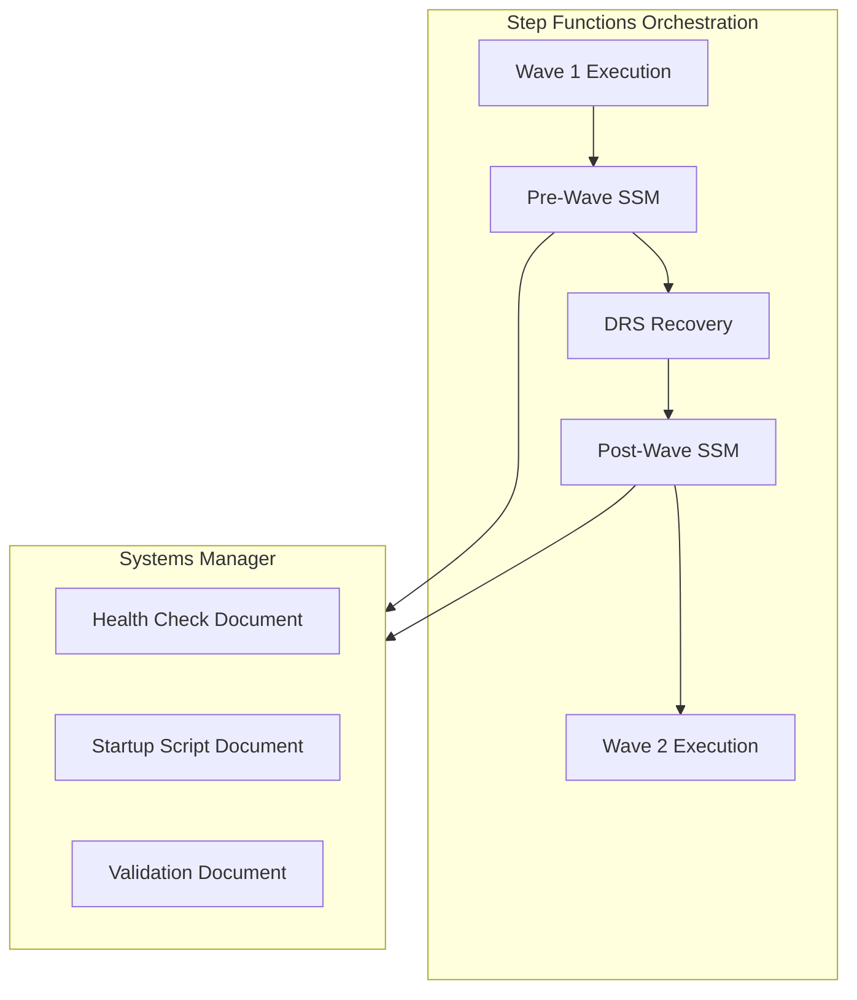
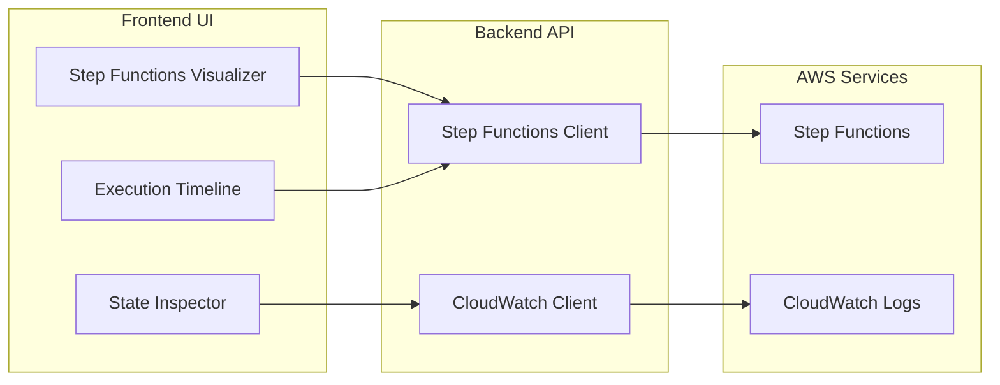
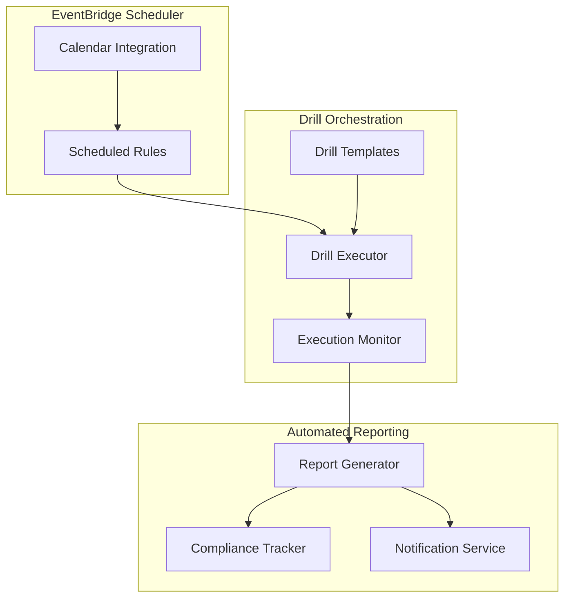

# Automation and Orchestration Features

## Executive Summary

This document consolidates automation and orchestration enhancement features that extend the core DRS orchestration capabilities with advanced workflow automation, visualization, and scheduling features.

---

## Feature Overview

### Consolidated Features

| Feature | Current Status | Priority | LOE | Integration Complexity |
|---------|----------------|----------|-----|----------------------|
| **SSM Automation Integration** | Planned | High | 4-5 weeks | Medium |
| **Step Functions Visualization** | Planned | Medium | 3-4 weeks | Low |
| **Scheduled Drills** | Future | Medium | 5-6 weeks | High |

### Implementation Approach

Implement as **2 major releases** with clear dependencies:

1. **Advanced Orchestration** (7-9 weeks) - SSM + Step Functions features
2. **Scheduled Automation** (5-6 weeks) - Automated drill scheduling

---

## Release 1: Advanced Orchestration (7-9 weeks)

### Scope
Enhanced orchestration capabilities with SSM automation and Step Functions visualization.

#### Components
- **SSM Automation Integration** (from SSM_AUTOMATION_IMPLEMENTATION.md)
- **Step Functions Visualization** (from STEP_FUNCTIONS_VISUALIZATION_IMPLEMENTATION.md)

### SSM Automation Integration (4-5 weeks)

#### Overview
Integrate AWS Systems Manager (SSM) automation documents into the DRS orchestration workflow, enabling pre-wave and post-wave automation tasks.

#### Key Features

##### Pre-Wave Automation
- **Manual Approval Gates**: Pause execution for human validation
- **Health Check Scripts**: Validate application health before recovery
- **Custom Validation**: Run organization-specific validation scripts
- **Dependency Checks**: Verify external dependencies are ready

##### Post-Wave Automation
- **Application Startup**: Automated service startup sequences
- **Health Validation**: Post-recovery health checks
- **Smoke Tests**: Automated functional testing
- **Notification Triggers**: Alert stakeholders of completion

##### SSM Document Management
- **Document Discovery**: Browse available SSM documents
- **Parameter Configuration**: Set document parameters per wave
- **Execution Monitoring**: Real-time SSM execution status
- **Output Capture**: Collect and display automation results

#### Architecture


#### UI Components
```typescript
// SSM Integration Components
- SSMDocumentSelector.tsx
- SSMParameterEditor.tsx
- SSMExecutionMonitor.tsx
- SSMOutputViewer.tsx

// Wave Configuration Extensions
- WaveSSMConfigEditor.tsx
- PreWaveAutomationPanel.tsx
- PostWaveAutomationPanel.tsx
```

#### API Extensions
```python
# SSM Integration endpoints
GET /ssm/documents
GET /ssm/documents/{document-name}
POST /recovery-plans/{plan-id}/waves/{wave-id}/ssm-automation
PUT /recovery-plans/{plan-id}/waves/{wave-id}/ssm-automation/{automation-id}
GET /executions/{execution-id}/ssm-executions
GET /executions/{execution-id}/ssm-executions/{ssm-execution-id}/output
```

### Step Functions Visualization (3-4 weeks)

#### Overview
Real-time visualization of Step Functions state machine execution with detailed state inspection and debugging capabilities.

#### Key Features

##### Real-Time State Machine Visualization
- **Interactive State Diagram**: Visual representation of current execution state
- **State Timeline**: Chronological view of state transitions
- **Current Position Indicator**: Highlight currently executing state
- **State Duration Tracking**: Time spent in each state

##### State Inspection
- **Input/Output Data**: View state input and output JSON
- **Error Details**: Detailed error information for failed states
- **Retry Information**: Retry attempts and backoff details
- **CloudWatch Logs Integration**: Direct links to relevant log entries

##### Execution History
- **Execution Timeline**: Complete execution history with timestamps
- **State Transition Log**: Detailed log of all state changes
- **Performance Metrics**: Execution duration, state performance
- **Comparison View**: Compare current vs previous executions

#### Architecture


#### UI Components
```typescript
// Step Functions Visualization
- StepFunctionsVisualizer.tsx
- StateMachineGraph.tsx
- ExecutionTimeline.tsx
- StateInspector.tsx
- ExecutionComparison.tsx

// Integration Components
- CloudWatchLogsViewer.tsx
- ExecutionMetrics.tsx
- StatePerformanceChart.tsx
```

#### API Extensions
```python
# Step Functions visualization endpoints
GET /step-functions/executions/{execution-arn}
GET /step-functions/executions/{execution-arn}/history
GET /step-functions/executions/{execution-arn}/state/{state-name}
GET /step-functions/state-machines/{state-machine-arn}/definition
GET /cloudwatch/logs/step-functions/{execution-arn}
```

---

## Release 2: Scheduled Automation (5-6 weeks)

### Scope
Automated recurring drill execution with comprehensive scheduling and reporting capabilities.

#### Key Features

##### Automated Drill Scheduling
- **Cron-Based Scheduling**: Flexible scheduling with cron expressions
- **Calendar Integration**: Visual calendar view of scheduled drills
- **Timezone Support**: Multi-timezone scheduling for global operations
- **Holiday Awareness**: Skip drills on configured holidays/blackout periods

##### Drill Templates
- **Template Library**: Pre-configured drill templates for common scenarios
- **Template Inheritance**: Base templates with environment-specific overrides
- **Validation Rules**: Ensure drill templates meet compliance requirements
- **Version Control**: Track template changes and rollback capability

##### Automated Reporting
- **Drill Reports**: Automated generation of drill completion reports
- **Compliance Tracking**: Track drill frequency and success rates
- **Trend Analysis**: Historical drill performance and reliability metrics
- **Stakeholder Notifications**: Automated notifications to relevant teams

##### Failure Handling
- **Retry Logic**: Configurable retry attempts for failed drills
- **Escalation Procedures**: Automated escalation for repeated failures
- **Rollback Automation**: Automatic cleanup of failed drill resources
- **Alert Integration**: Integration with existing alerting systems

#### Architecture


#### UI Components
```typescript
// Scheduling Components
- DrillScheduler.tsx
- ScheduleCalendar.tsx
- CronExpressionBuilder.tsx
- HolidayManager.tsx

// Template Management
- DrillTemplateLibrary.tsx
- DrillTemplateEditor.tsx
- TemplateVersionHistory.tsx

// Reporting Components
- AutomatedReportsPanel.tsx
- ComplianceTracker.tsx
- DrillTrendAnalysis.tsx
```

#### API Extensions
```python
# Scheduled drills endpoints
GET /scheduled-drills
POST /scheduled-drills
PUT /scheduled-drills/{schedule-id}
DELETE /scheduled-drills/{schedule-id}

# Template management
GET /drill-templates
POST /drill-templates
PUT /drill-templates/{template-id}
GET /drill-templates/{template-id}/versions

# Reporting
GET /drill-reports
GET /drill-reports/{report-id}
GET /compliance/drill-frequency
GET /analytics/drill-trends
```

---

## Technical Architecture

### Data Models

#### SSM Automation Configuration
```json
{
  "WaveId": "wave-1",
  "PreWaveAutomation": {
    "Enabled": true,
    "SSMDocuments": [
      {
        "DocumentName": "HealthCheck-WebTier",
        "Parameters": {
          "InstanceIds": ["i-1234567890abcdef0"],
          "Commands": ["systemctl status nginx"]
        },
        "TimeoutMinutes": 10,
        "OnFailure": "ABORT"
      }
    ]
  },
  "PostWaveAutomation": {
    "Enabled": true,
    "SSMDocuments": [
      {
        "DocumentName": "StartupScript-WebTier",
        "Parameters": {
          "InstanceIds": ["i-recovery-instance"],
          "S3BucketName": "startup-scripts",
          "S3KeyPrefix": "web-tier/"
        },
        "TimeoutMinutes": 15,
        "OnFailure": "CONTINUE"
      }
    ]
  }
}
```

#### Step Functions Execution State
```json
{
  "ExecutionArn": "arn:aws:states:us-east-1:123456789012:execution:DRSOrchestration:exec-123",
  "StateMachineArn": "arn:aws:states:us-east-1:123456789012:stateMachine:DRSOrchestration",
  "Status": "RUNNING",
  "StartDate": "2025-12-30T10:00:00Z",
  "CurrentState": {
    "Name": "ExecuteWave1",
    "Type": "Task",
    "EnteredTime": "2025-12-30T10:05:00Z",
    "Input": {
      "WaveId": "wave-1",
      "ProtectionGroupId": "pg-123",
      "ExecutionMode": "DRILL"
    }
  },
  "ExecutionHistory": [
    {
      "Timestamp": "2025-12-30T10:00:00Z",
      "Type": "ExecutionStarted",
      "StateEnteredEventDetails": {
        "Name": "StartExecution",
        "Input": "{\"RecoveryPlanId\":\"rp-123\"}"
      }
    }
  ]
}
```

#### Scheduled Drill Configuration
```json
{
  "ScheduleId": "schedule-123",
  "Name": "Weekly Production Drill",
  "Description": "Automated weekly drill for production environment",
  "CronExpression": "0 2 * * SUN",
  "Timezone": "America/New_York",
  "Enabled": true,
  "DrillTemplate": {
    "TemplateId": "template-prod-weekly",
    "RecoveryPlanId": "rp-production",
    "ExecutionMode": "DRILL",
    "Parameters": {
      "NotificationEmail": "dr-team@company.com",
      "CleanupAfterHours": 4
    }
  },
  "FailureHandling": {
    "MaxRetries": 2,
    "RetryDelayMinutes": 30,
    "EscalationEmail": "dr-escalation@company.com"
  },
  "Reporting": {
    "AutoGenerateReport": true,
    "ReportRecipients": ["dr-team@company.com", "compliance@company.com"],
    "IncludeMetrics": true
  }
}
```

### Integration Points

#### SSM Integration
- **Document Discovery**: List available SSM documents with parameter schemas
- **Execution Management**: Start, monitor, and retrieve results from SSM executions
- **Parameter Validation**: Validate SSM document parameters before execution
- **Output Processing**: Parse and display SSM execution outputs

#### Step Functions Integration
- **Real-Time Updates**: WebSocket connection for live execution updates
- **State Machine Introspection**: Parse state machine definition for visualization
- **CloudWatch Integration**: Retrieve logs and metrics for detailed analysis
- **Error Handling**: Comprehensive error display and debugging information

#### EventBridge Integration
- **Schedule Management**: Create and manage EventBridge scheduled rules
- **Event Routing**: Route scheduled events to drill execution Lambda
- **Calendar Integration**: Sync with external calendar systems
- **Holiday Management**: Integration with holiday/blackout period systems

---

## Implementation Strategy

### Development Phases

#### Phase 1: SSM Automation Foundation (Week 1-2)
- **SSM Client Integration**: Core SSM service integration
- **Document Discovery**: List and describe available SSM documents
- **Parameter Validation**: Validate document parameters and constraints
- **Basic Execution**: Execute SSM documents and retrieve results

#### Phase 2: Wave Integration (Week 3-4)
- **Wave Configuration**: Add SSM automation to wave configuration
- **Pre/Post Wave Hooks**: Integrate SSM execution into orchestration flow
- **Error Handling**: Handle SSM failures and implement retry logic
- **UI Components**: Build SSM configuration and monitoring components

#### Phase 3: Step Functions Visualization (Week 5-7)
- **State Machine Parser**: Parse Step Functions definition for visualization
- **Real-Time Updates**: Implement WebSocket for live execution updates
- **State Inspector**: Build detailed state inspection and debugging tools
- **Performance Metrics**: Add execution performance tracking and analysis

#### Phase 4: Advanced Features (Week 8-9)
- **SSM Output Processing**: Advanced output parsing and display
- **Execution Comparison**: Compare current vs historical executions
- **Integration Testing**: Comprehensive testing of all automation features
- **Documentation**: Complete user guides and API documentation

#### Phase 5: Scheduled Automation (Week 10-15)
- **Schedule Management**: EventBridge integration for drill scheduling
- **Template System**: Drill template creation and management
- **Automated Reporting**: Report generation and distribution
- **Compliance Tracking**: Drill frequency and success rate monitoring

### Testing Strategy

#### Unit Testing
- **SSM Integration**: Mock SSM service responses and error conditions
- **Step Functions Parsing**: Test state machine definition parsing
- **Schedule Logic**: Test cron expression parsing and execution timing
- **Template Validation**: Test drill template validation and inheritance

#### Integration Testing
- **End-to-End Automation**: Complete drill with SSM pre/post automation
- **Real-Time Visualization**: Test Step Functions visualization with live executions
- **Scheduled Execution**: Test automated drill scheduling and execution
- **Error Recovery**: Test failure scenarios and recovery procedures

#### Performance Testing
- **Large State Machines**: Test visualization with complex state machines
- **Concurrent Executions**: Test multiple simultaneous drill executions
- **Schedule Scale**: Test large numbers of scheduled drills
- **Real-Time Updates**: Test WebSocket performance under load

---

## Success Metrics

### Functional Metrics
- **SSM Integration**: Successfully execute 95% of SSM automation tasks
- **Visualization**: Real-time updates within 5 seconds of state changes
- **Scheduled Drills**: 99% successful execution of scheduled drills
- **Template Reuse**: 80% of drills use standardized templates

### Performance Metrics
- **SSM Execution**: < 30 seconds overhead for SSM integration
- **Visualization Load**: < 3 seconds to load Step Functions visualization
- **Schedule Accuracy**: < 1 minute deviation from scheduled execution time
- **Report Generation**: < 5 minutes to generate comprehensive drill reports

### Operational Metrics
- **Automation Success**: 95% success rate for automated pre/post wave tasks
- **Drill Compliance**: 100% compliance with scheduled drill requirements
- **Error Recovery**: < 15 minutes to recover from automation failures
- **User Adoption**: 90% of recovery plans use automation features

---

## Migration from Individual Plans

### Consolidation Benefits
- **Unified Automation**: Single interface for all automation features
- **Shared Infrastructure**: Common WebSocket and real-time update infrastructure
- **Integrated Testing**: Comprehensive testing across related features
- **Consistent UX**: Unified user experience for all orchestration features

### Implementation Dependencies
- **SSM → Step Functions**: Step Functions visualization enhances SSM monitoring
- **Both → Scheduled Drills**: Scheduled automation builds on both foundations
- **Shared Components**: Real-time updates, error handling, notification systems

### Rollout Strategy
- **Phase 1**: Deploy SSM and Step Functions features together
- **Phase 2**: Add scheduled automation after foundation is stable
- **Feature Flags**: Gradual rollout with ability to disable features
- **User Training**: Comprehensive training on new automation capabilities

---

## Conclusion

This consolidated approach to automation and orchestration features provides a comprehensive enhancement to the core DRS orchestration capabilities. By implementing these features in a coordinated manner, we can deliver a powerful automation platform that significantly reduces manual intervention in disaster recovery operations.

The two-release approach ensures that foundational automation capabilities are delivered first, followed by advanced scheduling and reporting features that build upon the established foundation.