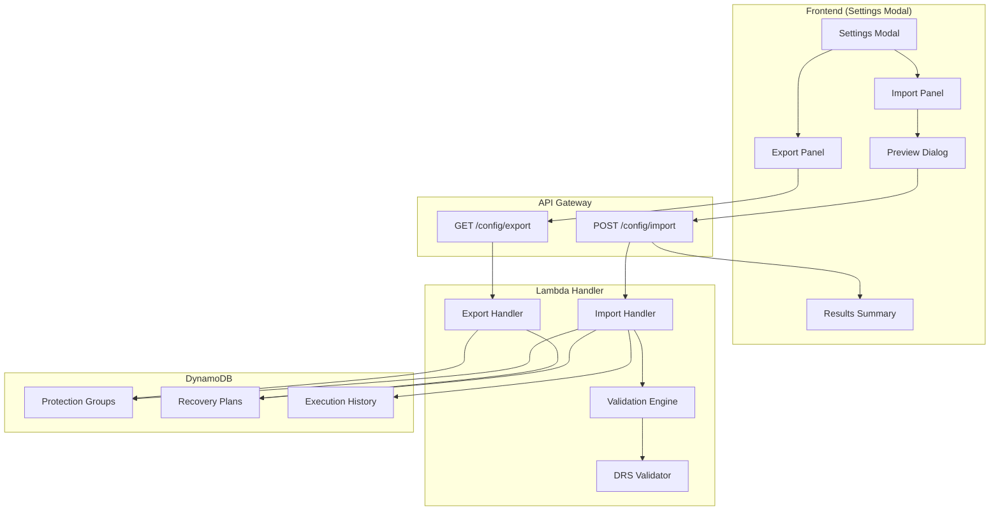
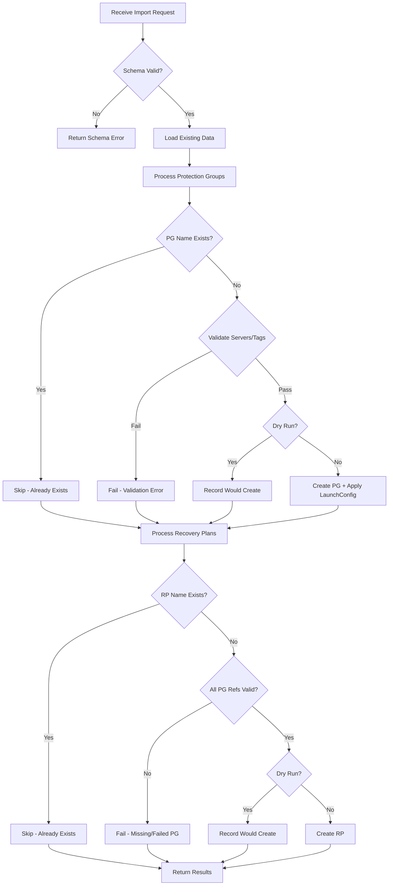

# Configuration Export/Import Specification

## Status: ✅ COMPLETE (Dec 14, 2025)

Feature fully implemented and tested. LaunchConfig settings are preserved on export and automatically applied to DRS source servers on import.

## Overview

This feature enables exporting and importing the complete DRS Orchestration configuration (Protection Groups, Recovery Plans, and Launch Settings) to/from a JSON file. This supports disaster recovery of the orchestration platform itself, environment migration, and configuration backup/restore scenarios.

## Architecture



## Requirements

### Export Requirements

1. Export all Protection Groups and Recovery Plans to JSON via `GET /config/export`
2. Include tag-based Protection Groups with `ServerSelectionTags` for dynamic resolution
3. Include explicit-server Protection Groups with `SourceServerIds` array
4. Include LaunchConfig settings (EC2 template, DRS launch settings)
5. Include metadata (schemaVersion, exportedAt, sourceRegion, exportedBy)
6. UI: One-click export via Settings gear icon with browser download

### Import Requirements

1. Import via `POST /config/import` with JSON body
2. Schema validation before processing
3. Skip existing Protection Groups/Recovery Plans by name (idempotent)
4. Validate explicit servers exist in DRS
5. Validate tag-based selections resolve to at least one server
6. Support `dryRun` parameter for validation without changes
7. Return detailed results (created, skipped, failed arrays)
8. **Apply LaunchConfig to DRS source servers on import**

### Non-Destructive Guarantees

1. Never modify or delete existing resources
2. Skip Protection Groups with server conflicts
3. Skip Recovery Plans with missing Protection Group dependencies
4. Cascade failures when referenced PG fails import
5. Allow import during active executions (skip conflicting resources)

## API Endpoints

### GET /config/export

Returns complete configuration as JSON.

**Response:**
```json
{
  "metadata": {
    "schemaVersion": "1.0",
    "exportedAt": "2024-12-13T10:30:00Z",
    "sourceRegion": "us-east-1",
    "exportedBy": "user@example.com"
  },
  "protectionGroups": [...],
  "recoveryPlans": [...]
}
```

### POST /config/import

Imports configuration from JSON body.

**Request:**
```json
{
  "dryRun": false,
  "config": {
    "metadata": {...},
    "protectionGroups": [...],
    "recoveryPlans": [...]
  }
}
```

**Response:**
```json
{
  "success": true,
  "dryRun": false,
  "correlationId": "uuid",
  "summary": {
    "protectionGroups": { "created": 2, "skipped": 1, "failed": 0 },
    "recoveryPlans": { "created": 1, "skipped": 0, "failed": 0 }
  },
  "created": [...],
  "skipped": [...],
  "failed": [...]
}
```

## Frontend Components

| Component | Purpose |
|-----------|---------|
| `SettingsModal` | Modal with Export/Import tabs, accessed via gear icon |
| `ConfigExportPanel` | One-click JSON download with loading state |
| `ConfigImportPanel` | File picker, preview, dry-run validation |
| `ImportResultsDialog` | Shows created/skipped/failed counts with details |

## Export Schema (v1.0)

```json
{
  "metadata": {
    "schemaVersion": "1.0",
    "exportedAt": "ISO-8601 timestamp",
    "sourceRegion": "us-east-1",
    "exportedBy": "user@example.com"
  },
  "protectionGroups": [
    {
      "GroupName": "DatabaseServers",
      "Region": "us-east-1",
      "ServerSelectionTags": { "DR-Tier": "Database" },
      "LaunchConfig": {
        "SubnetId": "subnet-xxx",
        "SecurityGroupIds": ["sg-xxx"],
        "InstanceType": "c5.12xlarge",
        "CopyPrivateIp": true,
        "CopyTags": true,
        "TargetInstanceTypeRightSizingMethod": "IN_AWS",
        "LaunchDisposition": "STARTED"
      }
    }
  ],
  "recoveryPlans": [
    {
      "PlanName": "Full DR Plan",
      "Waves": [
        { "WaveNumber": 1, "ProtectionGroupName": "DatabaseServers" },
        { "WaveNumber": 2, "ProtectionGroupName": "AppServers", "PauseBeforeWave": true }
      ]
    }
  ]
}
```

## Import Processing Flow



## Implementation Files

| File | Purpose |
|------|---------|
| `lambda/index.py` | Export/import handlers (lines 5655-6100) |
| `cfn/api-stack.yaml` | API Gateway resources for /config/* |
| `frontend/src/components/SettingsModal.tsx` | Settings modal container |
| `frontend/src/components/ConfigExportPanel.tsx` | Export functionality |
| `frontend/src/components/ConfigImportPanel.tsx` | Import with preview |
| `frontend/src/components/ImportResultsDialog.tsx` | Results display |
| `frontend/src/contexts/ApiContext.tsx` | API service methods |

## Key Implementation Details

### LaunchConfig Application on Import

When importing a Protection Group with LaunchConfig, the system:

1. Creates the Protection Group in DynamoDB
2. Resolves servers (explicit IDs or tag-based query)
3. Calls `apply_launch_config_to_servers()` to update DRS source servers
4. Updates EC2 launch templates with subnet, security groups, instance type
5. Updates DRS launch settings (right-sizing, disposition, copy flags)

This ensures imported configurations are immediately functional without manual reconfiguration.

## Git Commits

- `9a34e74` - Initial implementation (export, import, UI components)
- `eb3ba49` - Mark feature complete, fix LaunchConfig application on import
