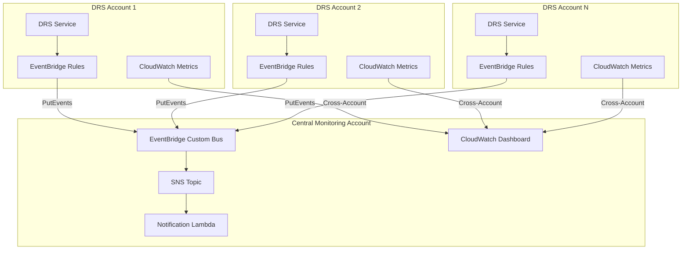

# Cross-Account DRS Monitoring Implementation Plan

## Overview

Centralized monitoring and alerting for AWS DRS across multiple AWS accounts with dynamic account management, cross-account metrics collection, and unified dashboards.

This implementation plan is based on proven patterns from the [AWS DRS Observability Tools](https://github.com/aws-samples/drs-tools/tree/main/drs-observability).

---

## Related Features

This feature is part of a larger DRS management feature set. Understanding the relationships helps clarify scope boundaries:

| Feature | Relationship | Scope Boundary |
|---------|--------------|----------------|
| **#13 Multi-Account Support** | Complementary | #13 provides hub-and-spoke orchestration architecture; this feature (#11) provides monitoring/alerting across those accounts |
| **#18 Extended Source Servers** | Complementary | #18 enables cross-account replication setup; this feature monitors the resulting replication status |

### Scope Clarification

- **This Feature (#11)**: EventBridge events, CloudWatch dashboards, SNS alerting, cross-account metrics collection (monitoring only)
- **#13 Multi-Account Support**: Hub-and-spoke architecture, cross-account IAM roles, unified management UI, scale beyond 300 servers (orchestration)
- **#18 Extended Source Servers**: CreateExtendedSourceServer API, cross-account replication setup (configuration)

### Key Distinction: Cross-Account Features

| Feature | Focus | Primary Use Case |
|---------|-------|------------------|
| #11 Cross-Account Monitoring | Observability | "Alert me when replication stalls in any account" |
| #13 Multi-Account Support | Orchestration | "Run a drill across servers in 4 accounts" |
| #18 Extended Source Servers | Configuration | "Set up cross-account replication for a server" |

---

## Architecture



---

## Components

### 1. Central Account Infrastructure

Deploy in the central monitoring/logging account:

| Component | Purpose |
|-----------|---------|
| EventBridge Custom Bus | Receives DRS events from all accounts |
| EventBridge Rules | Routes events to SNS |
| SNS Topic | Notification distribution |
| CloudWatch Dashboard | Unified metrics visualization |

### 2. Per-Account Infrastructure

Deploy in each DRS account:

| Component | Purpose |
|-----------|---------|
| EventBridge Rules | Captures DRS events, forwards to central bus |
| IAM Role | Allows EventBridge to put events cross-account |
| CloudWatch Dashboard | Local metrics visualization |

### 3. DRS Events Monitored

| Event Type | Description | Severity |
|------------|-------------|----------|
| `DRS Source Server Launch Result` | Recovery instance launch success/failure | Critical |
| `DRS Source Server Data Replication Stalled Change` | Agent stall status changes | Warning |

---

## Implementation Phases

### Phase 1: Central Account Setup (Day 1)

#### 1.1 EventBridge Custom Bus

```yaml
# cfn/monitoring/drs-eventbridge-central-account.yaml
AWSTemplateFormatVersion: '2010-09-09'
Description: Central account EventBridge for DRS monitoring

Parameters:
  AwsOrganizationId:
    Type: String
    Description: AWS Organizations ID for DRS accounts
  NotificationEmail:
    Type: String
    Description: Email for DRS notifications
  EventBusName:
    Type: String
    Default: DrsNotificationEventBus

Resources:
  DrsEventBus:
    Type: AWS::Events::EventBus
    Properties:
      Name: !Ref EventBusName

  DrsEventBusPolicy:
    Type: AWS::Events::EventBusPolicy
    Properties:
      StatementId: OrganizationAccess
      Principal: '*'
      Action: events:PutEvents
      EventBusName: !Ref DrsEventBus
      Condition:
        Type: StringEquals
        Key: aws:PrincipalOrgID
        Value: !Ref AwsOrganizationId

  # Failed Recovery Rule
  DrsFailedRecoveryRule:
    Type: AWS::Events::Rule
    Properties:
      Description: DRS recovery launch failures
      EventBusName: !Ref DrsEventBus
      State: ENABLED
      EventPattern:
        source:
          - aws.drs
        detail-type:
          - DRS Source Server Launch Result
        detail:
          state:
            - RECOVERY_LAUNCH_FAILED
      Targets:
        - Arn: !Ref DrsSnsTopic
          Id: FailedRecovery

  # Stalled Agent Rule
  DrsStalledAgentRule:
    Type: AWS::Events::Rule
    Properties:
      Description: DRS agent stall notifications
      EventBusName: !Ref DrsEventBus
      State: ENABLED
      EventPattern:
        source:
          - aws.drs
        detail-type:
          - DRS Source Server Data Replication Stalled Change
      Targets:
        - Arn: !Ref DrsSnsTopic
          Id: StalledAgent

  # SNS Topic
  DrsSnsTopic:
    Type: AWS::SNS::Topic
    Properties:
      TopicName: DrsNotificationTopic

  DrsSnsSubscription:
    Type: AWS::SNS::Subscription
    Properties:
      Endpoint: !Ref NotificationEmail
      Protocol: email
      TopicArn: !Ref DrsSnsTopic

  DrsSnsTopicPolicy:
    Type: AWS::SNS::TopicPolicy
    Properties:
      Topics:
        - !Ref DrsSnsTopic
      PolicyDocument:
        Version: '2012-10-17'
        Statement:
          - Sid: EventBridgePublish
            Effect: Allow
            Principal:
              Service: events.amazonaws.com
            Action: sns:Publish
            Resource: !Ref DrsSnsTopic

Outputs:
  EventBusArn:
    Value: !GetAtt DrsEventBus.Arn
    Export:
      Name: DrsEventBusArn
  EventBusName:
    Value: !Ref EventBusName
    Export:
      Name: DrsEventBusName
  SnsTopicArn:
    Value: !Ref DrsSnsTopic
    Export:
      Name: DrsSnsTopicArn
```

#### 1.2 Cross-Account CloudWatch Dashboard

```yaml
# cfn/monitoring/drs-cloudwatch-dashboard-cross-account.yaml
AWSTemplateFormatVersion: '2010-09-09'
Description: Cross-account DRS CloudWatch dashboard

Parameters:
  DashboardName:
    Type: String
    Default: DRS-CrossAccount
  DrsAccounts:
    Type: CommaDelimitedList
    Description: List of DRS account IDs
  DrsRegions:
    Type: CommaDelimitedList
    Description: List of DRS regions
    Default: us-east-1,us-west-2

Resources:
  DrsCrossAccountDashboard:
    Type: AWS::CloudWatch::Dashboard
    Properties:
      DashboardName: !Ref DashboardName
      DashboardBody: !Sub |
        {
          "widgets": [
            {
              "type": "text",
              "x": 0,
              "y": 0,
              "width": 24,
              "height": 1,
              "properties": {
                "markdown": "# AWS DRS Cross-Account Monitoring Dashboard"
              }
            },
            {
              "type": "metric",
              "x": 0,
              "y": 1,
              "width": 12,
              "height": 6,
              "properties": {
                "view": "timeSeries",
                "stacked": false,
                "metrics": [
                  [{"expression": "SELECT AVG(LagDuration) FROM SCHEMA(\"AWS/DRS\", SourceServerID) GROUP BY SourceServerID ORDER BY AVG() DESC", "label": "LagDuration", "id": "q1"}]
                ],
                "region": "${AWS::Region}",
                "title": "Replication Lag Duration (All Accounts)",
                "period": 300,
                "stat": "Average"
              }
            },
            {
              "type": "metric",
              "x": 12,
              "y": 1,
              "width": 12,
              "height": 6,
              "properties": {
                "view": "timeSeries",
                "stacked": false,
                "metrics": [
                  [{"expression": "SELECT AVG(Backlog) FROM SCHEMA(\"AWS/DRS\", SourceServerID) GROUP BY SourceServerID ORDER BY AVG() ASC", "label": "Backlog", "id": "q2"}]
                ],
                "region": "${AWS::Region}",
                "title": "Replication Backlog (All Accounts)",
                "period": 300,
                "stat": "Average"
              }
            },
            {
              "type": "alarm",
              "x": 0,
              "y": 7,
              "width": 24,
              "height": 4,
              "properties": {
                "title": "DRS Alarms",
                "alarms": []
              }
            }
          ]
        }
```

### Phase 2: Per-Account Setup (Day 2)

#### 2.1 EventBridge Rules (Per DRS Account)

```yaml
# cfn/monitoring/drs-eventbridge-per-account.yaml
AWSTemplateFormatVersion: '2010-09-09'
Description: Per-account EventBridge rules for DRS monitoring

Parameters:
  CentralAccountId:
    Type: String
    Description: Central monitoring account ID
  EventBusName:
    Type: String
    Default: DrsNotificationEventBus
  EnableStalledAgentRule:
    Type: String
    Default: ENABLED
    AllowedValues: [ENABLED, DISABLED]
  EnableFailedRecoveryRule:
    Type: String
    Default: ENABLED
    AllowedValues: [ENABLED, DISABLED]
  StalledEventsFilter:
    Type: String
    Default: StalledOnly
    AllowedValues: [StalledOnly, All]

Conditions:
  StalledOnlyEvents: !Equals [!Ref StalledEventsFilter, StalledOnly]

Resources:
  EventBridgeRole:
    Type: AWS::IAM::Role
    Properties:
      RoleName: DrsEventBridgeCrossAccountRole
      AssumeRolePolicyDocument:
        Version: '2012-10-17'
        Statement:
          - Effect: Allow
            Principal:
              Service: events.amazonaws.com
            Action: sts:AssumeRole
      Policies:
        - PolicyName: PutEventsToCentralBus
          PolicyDocument:
            Version: '2012-10-17'
            Statement:
              - Effect: Allow
                Action: events:PutEvents
                Resource: !Sub arn:aws:events:${AWS::Region}:${CentralAccountId}:event-bus/${EventBusName}

  FailedRecoveryRule:
    Type: AWS::Events::Rule
    Properties:
      Description: Forward DRS recovery failures to central account
      State: !Ref EnableFailedRecoveryRule
      EventPattern:
        source:
          - aws.drs
        detail-type:
          - DRS Source Server Launch Result
        detail:
          state:
            - RECOVERY_LAUNCH_FAILED
      Targets:
        - Arn: !Sub arn:aws:events:${AWS::Region}:${CentralAccountId}:event-bus/${EventBusName}
          Id: CentralEventBus
          RoleArn: !GetAtt EventBridgeRole.Arn

  StalledAgentRule:
    Type: AWS::Events::Rule
    Properties:
      Description: Forward DRS agent stall events to central account
      State: !Ref EnableStalledAgentRule
      EventPattern: !If
        - StalledOnlyEvents
        - source:
            - aws.drs
          detail-type:
            - DRS Source Server Data Replication Stalled Change
          detail:
            state:
              - STALLED
        - source:
            - aws.drs
          detail-type:
            - DRS Source Server Data Replication Stalled Change
      Targets:
        - Arn: !Sub arn:aws:events:${AWS::Region}:${CentralAccountId}:event-bus/${EventBusName}
          Id: CentralEventBus
          RoleArn: !GetAtt EventBridgeRole.Arn
```

#### 2.2 Per-Account CloudWatch Dashboard

```yaml
# cfn/monitoring/drs-cloudwatch-dashboard-per-account.yaml
AWSTemplateFormatVersion: '2010-09-09'
Description: Per-account DRS CloudWatch dashboard

Parameters:
  DashboardName:
    Type: String
    Default: DRS

Resources:
  DrsDashboard:
    Type: AWS::CloudWatch::Dashboard
    Properties:
      DashboardName: !Ref DashboardName
      DashboardBody: !Sub |
        {
          "widgets": [
            {
              "type": "metric",
              "x": 0,
              "y": 0,
              "width": 12,
              "height": 6,
              "properties": {
                "view": "timeSeries",
                "stacked": false,
                "metrics": [
                  [{"expression": "SELECT AVG(LagDuration) FROM SCHEMA(\"AWS/DRS\", SourceServerID) GROUP BY SourceServerID ORDER BY AVG() DESC", "label": "LagDuration-${AWS::AccountId}-${AWS::Region}", "id": "q1"}]
                ],
                "region": "${AWS::Region}",
                "title": "Replication Lag Duration",
                "period": 300,
                "stat": "Average"
              }
            },
            {
              "type": "metric",
              "x": 12,
              "y": 0,
              "width": 12,
              "height": 6,
              "properties": {
                "view": "timeSeries",
                "stacked": false,
                "metrics": [
                  [{"expression": "SELECT AVG(Backlog) FROM SCHEMA(\"AWS/DRS\", SourceServerID) GROUP BY SourceServerID ORDER BY AVG() ASC", "label": "Backlog-${AWS::AccountId}-${AWS::Region}", "id": "q2"}]
                ],
                "region": "${AWS::Region}",
                "title": "Replication Backlog",
                "period": 300,
                "stat": "Average"
              }
            }
          ]
        }
```

### Phase 3: CloudWatch Agent & Metric Filters (Day 3)

#### 3.1 CloudWatch Metric Filters

```yaml
# cfn/monitoring/drs-cloudwatch-metric-filters.yaml
AWSTemplateFormatVersion: '2010-09-09'
Description: CloudWatch metric filters for DRS agent logs

Parameters:
  LogGroupName:
    Type: String
    Default: aws-replication-agent

Resources:
  DrsWarningMetricFilter:
    Type: AWS::Logs::MetricFilter
    Properties:
      FilterName: DrsReplicationAgentWarnings
      FilterPattern: WARNING
      LogGroupName: !Ref LogGroupName
      MetricTransformations:
        - MetricName: DrsReplicationAgentWarnings
          MetricNamespace: DRSCustomMetrics
          MetricValue: '1'
          Unit: Count

  DrsErrorMetricFilter:
    Type: AWS::Logs::MetricFilter
    Properties:
      FilterName: DrsReplicationAgentErrors
      FilterPattern: ERROR
      LogGroupName: !Ref LogGroupName
      MetricTransformations:
        - MetricName: DrsReplicationAgentErrors
          MetricNamespace: DRSCustomMetrics
          MetricValue: '1'
          Unit: Count

  # Alarms
  DrsErrorAlarm:
    Type: AWS::CloudWatch::Alarm
    Properties:
      AlarmName: DRS-Agent-Errors
      AlarmDescription: DRS replication agent errors detected
      MetricName: DrsReplicationAgentErrors
      Namespace: DRSCustomMetrics
      Statistic: Sum
      Period: 300
      EvaluationPeriods: 1
      Threshold: 1
      ComparisonOperator: GreaterThanOrEqualToThreshold
      TreatMissingData: notBreaching

  DrsWarningAlarm:
    Type: AWS::CloudWatch::Alarm
    Properties:
      AlarmName: DRS-Agent-Warnings
      AlarmDescription: DRS replication agent warnings detected
      MetricName: DrsReplicationAgentWarnings
      Namespace: DRSCustomMetrics
      Statistic: Sum
      Period: 300
      EvaluationPeriods: 3
      Threshold: 10
      ComparisonOperator: GreaterThanOrEqualToThreshold
      TreatMissingData: notBreaching
```

#### 3.2 CloudWatch Agent Configuration

**Linux** (`/opt/aws/amazon-cloudwatch-agent/etc/amazon-cloudwatch-agent.d/drs-agent.json`):

```json
{
  "logs": {
    "logs_collected": {
      "files": {
        "collect_list": [
          {
            "file_path": "/var/log/aws-replication-agent.log",
            "log_group_name": "aws-replication-agent",
            "log_stream_name": "{instance_id}",
            "timezone": "UTC"
          }
        ]
      }
    }
  }
}
```

**Windows** (`C:\ProgramData\Amazon\AmazonCloudWatchAgent\Configs\drs-agent.json`):

```json
{
  "logs": {
    "logs_collected": {
      "files": {
        "collect_list": [
          {
            "file_path": "C:\\Program Files (x86)\\AWS Replication Agent\\logs\\aws-replication-agent.log",
            "log_group_name": "aws-replication-agent",
            "log_stream_name": "{instance_id}",
            "timezone": "UTC"
          }
        ]
      }
    }
  }
}
```

### Phase 4: Integration with DRS Orchestration (Day 4-5)

#### 4.1 Account Management API

Add endpoints to manage monitored accounts:

```python
# lambda/index.py additions

def handle_monitoring_accounts(event, method):
    """Manage monitored DRS accounts"""
    accounts_table = dynamodb.Table(os.environ['MONITORING_ACCOUNTS_TABLE'])
    
    if method == 'GET':
        response = accounts_table.scan()
        return {
            'statusCode': 200,
            'body': json.dumps(response.get('Items', []))
        }
    
    elif method == 'POST':
        body = json.loads(event.get('body', '{}'))
        account_id = body.get('accountId')
        account_name = body.get('accountName')
        regions = body.get('regions', ['us-east-1'])
        
        item = {
            'AccountId': account_id,
            'AccountName': account_name,
            'Regions': regions,
            'Status': 'PENDING_VALIDATION',
            'CreatedAt': int(time.time() * 1000)
        }
        
        accounts_table.put_item(Item=item)
        return {
            'statusCode': 201,
            'body': json.dumps(item)
        }
    
    elif method == 'DELETE':
        account_id = event['pathParameters']['accountId']
        accounts_table.delete_item(Key={'AccountId': account_id})
        return {'statusCode': 204}
```

#### 4.2 Monitoring Dashboard Integration

Add monitoring status to the frontend dashboard:

```typescript
// frontend/src/components/MonitoringStatus.tsx
import { Container, Header, StatusIndicator, Table } from '@cloudscape-design/components';

interface MonitoredAccount {
  accountId: string;
  accountName: string;
  regions: string[];
  status: 'ACTIVE' | 'PENDING_VALIDATION' | 'ERROR';
  lastEventTime?: string;
}

export const MonitoringStatus: React.FC = () => {
  const [accounts, setAccounts] = useState<MonitoredAccount[]>([]);
  
  return (
    <Container header={<Header variant="h2">Cross-Account Monitoring</Header>}>
      <Table
        items={accounts}
        columnDefinitions={[
          { id: 'accountId', header: 'Account ID', cell: item => item.accountId },
          { id: 'accountName', header: 'Name', cell: item => item.accountName },
          { id: 'regions', header: 'Regions', cell: item => item.regions.join(', ') },
          { id: 'status', header: 'Status', cell: item => (
            <StatusIndicator type={item.status === 'ACTIVE' ? 'success' : 'warning'}>
              {item.status}
            </StatusIndicator>
          )},
          { id: 'lastEvent', header: 'Last Event', cell: item => item.lastEventTime || '-' }
        ]}
      />
    </Container>
  );
};
```

---

## Deployment Guide

### Prerequisites

1. AWS Organizations configured
2. CloudWatch cross-account sharing enabled
3. DRS initialized in each account

### Step 1: Deploy Central Account Stack

```bash
aws cloudformation deploy \
  --template-file cfn/monitoring/drs-eventbridge-central-account.yaml \
  --stack-name drs-monitoring-central \
  --parameter-overrides \
    AwsOrganizationId=o-xxxxxxxxxx \
    NotificationEmail=drs-alerts@example.com \
  --capabilities CAPABILITY_IAM \
  --region us-east-1
```

### Step 2: Deploy Per-Account Stacks

For each DRS account:

```bash
aws cloudformation deploy \
  --template-file cfn/monitoring/drs-eventbridge-per-account.yaml \
  --stack-name drs-monitoring-events \
  --parameter-overrides \
    CentralAccountId=123456789012 \
    EventBusName=DrsNotificationEventBus \
  --capabilities CAPABILITY_IAM \
  --region us-east-1
```

### Step 3: Deploy CloudWatch Dashboards

Central account:
```bash
aws cloudformation deploy \
  --template-file cfn/monitoring/drs-cloudwatch-dashboard-cross-account.yaml \
  --stack-name drs-dashboard-cross-account \
  --region us-east-1
```

Per account:
```bash
aws cloudformation deploy \
  --template-file cfn/monitoring/drs-cloudwatch-dashboard-per-account.yaml \
  --stack-name drs-dashboard \
  --region us-east-1
```

### Step 4: Enable CloudWatch Cross-Account Sharing

In each DRS account, enable cross-account sharing:

```bash
aws cloudwatch put-metric-policy \
  --policy-document '{
    "Version": "2012-10-17",
    "Statement": [{
      "Sid": "AllowCrossAccountAccess",
      "Effect": "Allow",
      "Principal": {"AWS": "arn:aws:iam::CENTRAL_ACCOUNT_ID:root"},
      "Action": ["cloudwatch:GetMetricData", "cloudwatch:ListMetrics"],
      "Resource": "*"
    }]
  }'
```

---

## Metrics Reference

### Native DRS Metrics (AWS/DRS Namespace)

| Metric | Description | Unit |
|--------|-------------|------|
| `LagDuration` | Time since last successful replication | Seconds |
| `Backlog` | Amount of data pending replication | Bytes |

### Custom Metrics (DRSCustomMetrics Namespace)

| Metric | Description | Unit |
|--------|-------------|------|
| `DrsReplicationAgentWarnings` | Warning count from agent logs | Count |
| `DrsReplicationAgentErrors` | Error count from agent logs | Count |

---

## Alerting Configuration

### Recommended Alarms

| Alarm | Threshold | Period | Description |
|-------|-----------|--------|-------------|
| High Lag Duration | > 3600 seconds | 5 min | Replication lag exceeds 1 hour |
| High Backlog | > 10 GB | 5 min | Significant data backlog |
| Agent Errors | > 0 | 5 min | Any agent errors detected |
| Agent Warnings | > 10 | 15 min | Excessive warnings |
| Recovery Failure | Any event | Immediate | Recovery launch failed |
| Agent Stalled | Any event | Immediate | Replication stalled |

---

## Cost Estimate

| Component | Monthly Cost (10 accounts) |
|-----------|---------------------------|
| EventBridge Events | ~$5 |
| SNS Notifications | ~$2 |
| CloudWatch Dashboards | ~$3/dashboard |
| CloudWatch Metrics | ~$10 |
| CloudWatch Logs | ~$5/GB |
| **Total** | **~$50-100/month** |

---

## References

- [AWS DRS EventBridge Notifications](https://docs.aws.amazon.com/drs/latest/userguide/monitoring-event-bridge-sample.html)
- [CloudWatch Cross-Account Dashboards](https://docs.aws.amazon.com/AmazonCloudWatch/latest/monitoring/cloudwatch_xaxr_dashboard.html)
- [AWS DRS Observability Tools](https://github.com/aws-samples/drs-tools/tree/main/drs-observability)
- [Multi-Account DRS Implementation](docs/implementation/MULTI_ACCOUNT_DRS_IMPLEMENTATION.md)

---

**Status**: Implementation Plan Complete  
**Source**: AWS DRS Observability Tools (archive/drs-tools/drs-observability)  
**Estimated Effort**: 5 days
