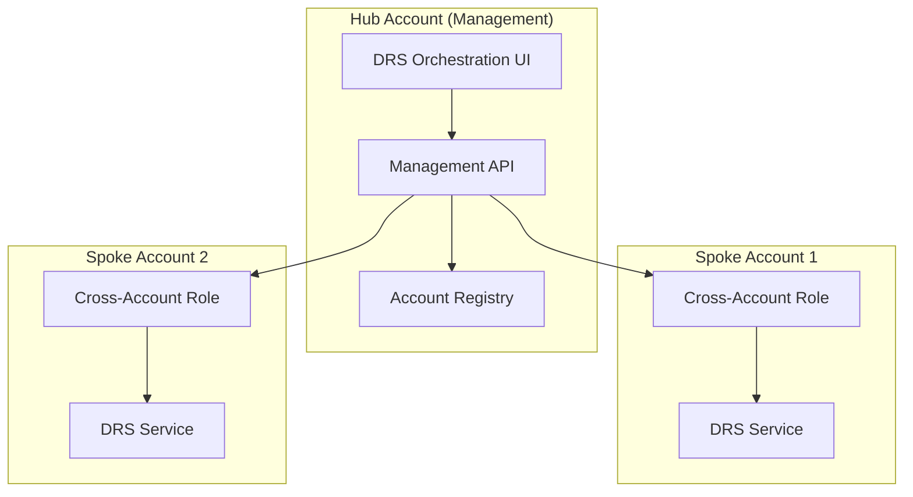
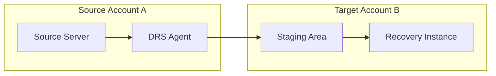
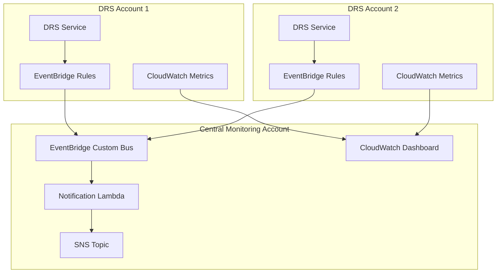

# Cross-Account DRS Features Implementation Guide

## Executive Summary

This document consolidates three related cross-account DRS features that work together to provide enterprise-scale disaster recovery across multiple AWS accounts. These features address different aspects of cross-account DRS management: orchestration, configuration, and monitoring.

---

## Feature Overview

### Three Complementary Features

| Feature | Primary Focus | Key Capability | Implementation Order |
|---------|---------------|----------------|---------------------|
| **#13 Multi-Account Support** | Orchestration | Hub-and-spoke architecture, unified management UI, scale beyond 300 servers | 1st (Foundation) |
| **#18 Extended Source Servers** | Configuration | CreateExtendedSourceServer API, cross-account replication setup | 2nd (Requires #13 UI) |
| **#11 Cross-Account Monitoring** | Observability | EventBridge events, CloudWatch dashboards, alerting across accounts | 3rd (Requires #13 for account discovery) |

### Clear Scope Boundaries

#### #13 Multi-Account Support (Foundation)
- **What**: Hub-and-spoke orchestration architecture
- **Key APIs**: DRS Trusted Accounts, cross-account IAM roles
- **UI Impact**: Unified management interface across accounts
- **Use Case**: "Run a drill across servers in 4 accounts"
- **Dependencies**: None (foundation feature)

#### #18 Extended Source Servers (Configuration)
- **What**: Cross-account replication setup
- **Key APIs**: CreateExtendedSourceServer, cross-account staging areas
- **UI Impact**: Cross-account server configuration forms
- **Use Case**: "Set up cross-account replication for a server"
- **Dependencies**: Requires #13 for account management UI

#### #11 Cross-Account Monitoring (Observability)
- **What**: Centralized monitoring and alerting
- **Key APIs**: EventBridge cross-account events, CloudWatch metrics
- **UI Impact**: Cross-account dashboards and alerts
- **Use Case**: "Alert me when replication stalls in any account"
- **Dependencies**: Requires #13 for account discovery

---

## Implementation Strategy

### Phase 1: Multi-Account Support Foundation (#13)
**Duration**: 6-8 weeks
**Priority**: High (enables other features)

#### Architecture


#### Key Components
- **Account Registry**: DynamoDB table storing account metadata
- **Cross-Account IAM Roles**: Assume roles for DRS operations
- **Unified UI**: Single interface for all accounts
- **Account Health Monitoring**: Validate account access and DRS status

#### Implementation Steps
1. **Account Management API** (2 weeks)
   - Account registration and validation
   - Cross-account IAM role setup
   - Account health checks

2. **Unified UI Components** (2 weeks)
   - Account selector in navigation
   - Cross-account server discovery
   - Account status indicators

3. **Cross-Account Orchestration** (2 weeks)
   - Multi-account recovery plan execution
   - Cross-account server selection
   - Coordinated wave execution

4. **Testing and Validation** (2 weeks)
   - Multi-account drill testing
   - Performance validation
   - Security review

### Phase 2: Extended Source Servers (#18)
**Duration**: 4-6 weeks
**Priority**: Medium (extends #13 capabilities)

#### Architecture


#### Key Components
- **CreateExtendedSourceServer API Integration**
- **Cross-Account Replication Configuration UI**
- **Staging Area Management**
- **Cross-Account Recovery Instance Management**

#### Implementation Steps
1. **API Integration** (2 weeks)
   - CreateExtendedSourceServer implementation
   - Cross-account replication setup
   - Staging area configuration

2. **UI Extensions** (2 weeks)
   - Cross-account server configuration forms
   - Target account selection
   - Replication status monitoring

3. **Testing and Validation** (2 weeks)
   - Cross-account replication testing
   - Recovery validation
   - Performance testing

### Phase 3: Cross-Account Monitoring (#11)
**Duration**: 4-6 weeks
**Priority**: Medium (enhances observability)

#### Architecture


#### Key Components
- **Cross-Account EventBridge Rules**
- **Centralized CloudWatch Dashboard**
- **SNS Notification System**
- **Account Health Monitoring**

#### Implementation Steps
1. **EventBridge Integration** (2 weeks)
   - Cross-account event rules
   - Custom event bus setup
   - Event filtering and routing

2. **Monitoring Dashboard** (2 weeks)
   - Cross-account metrics collection
   - Unified dashboard creation
   - Alert configuration

3. **Notification System** (2 weeks)
   - SNS topic setup
   - Lambda notification processor
   - Multi-channel alerting

---

## Technical Specifications

### AWS DRS Native Multi-Account Features

#### Trusted Accounts Feature
- **Limit**: Up to 100 trusted accounts per DRS account
- **Capability**: Cross-account server management
- **API**: `PutDrsSettings`, `GetDrsSettings`
- **Use Case**: Central management of distributed DRS deployments

#### Multiple Staging Accounts Pattern
- **Purpose**: Scale beyond 300 servers per account
- **Architecture**: Hub account manages multiple spoke accounts
- **Benefits**: Isolated billing, separate access controls

### Service Limits Impact

| Limit | Single Account | Multi-Account Solution |
|-------|----------------|------------------------|
| Replicating servers | 300 per account | 300 × N accounts |
| Max servers in jobs | 500 | 500 per account |
| Servers per job | 100 | 100 per account |
| Concurrent jobs | 20 | 20 per account |

### Cross-Account IAM Requirements

#### Hub Account Role
```json
{
  "Version": "2012-10-17",
  "Statement": [
    {
      "Effect": "Allow",
      "Action": [
        "sts:AssumeRole"
      ],
      "Resource": "arn:aws:iam::*:role/DRSOrchestrationCrossAccountRole"
    }
  ]
}
```

#### Spoke Account Role
```json
{
  "Version": "2012-10-17",
  "Statement": [
    {
      "Effect": "Allow",
      "Action": [
        "drs:*",
        "ec2:Describe*",
        "ec2:CreateTags"
      ],
      "Resource": "*"
    }
  ]
}
```

---

## Data Models

### Account Registry (DynamoDB)
```json
{
  "AccountId": "123456789012",
  "AccountName": "Production East",
  "Region": "us-east-1",
  "RoleArn": "arn:aws:iam::123456789012:role/DRSOrchestrationCrossAccountRole",
  "Status": "ACTIVE",
  "LastHealthCheck": "2025-12-30T10:00:00Z",
  "ServerCount": 150,
  "TrustedAccountSetup": true,
  "ExtendedSourceServersEnabled": true,
  "MonitoringEnabled": true
}
```

### Cross-Account Server Reference
```json
{
  "ServerId": "s-1234567890abcdef0",
  "SourceAccountId": "123456789012",
  "TargetAccountId": "210987654321",
  "ReplicationType": "EXTENDED_SOURCE_SERVER",
  "StagingAreaSubnet": "subnet-12345678",
  "ReplicationStatus": "HEALTHY"
}
```

---

## Testing Strategy

### Multi-Account Test Environment
- **Hub Account**: Central management and UI
- **Spoke Account 1**: 50 test servers
- **Spoke Account 2**: 30 test servers
- **Monitoring Account**: Centralized observability

### Test Scenarios
1. **Cross-Account Discovery**: Verify server discovery across accounts
2. **Multi-Account Drill**: Execute drill spanning multiple accounts
3. **Extended Source Server Setup**: Configure cross-account replication
4. **Cross-Account Monitoring**: Validate alerts and dashboards
5. **Account Failover**: Test behavior when spoke account is unavailable

### Performance Validation
- **Server Discovery**: < 30 seconds for 1000+ servers across accounts
- **Cross-Account API Calls**: < 5 seconds per account
- **Multi-Account Drill**: Coordinate execution across 5+ accounts

---

## Security Considerations

### Cross-Account Access
- **Principle of Least Privilege**: Minimal permissions for cross-account roles
- **Temporary Credentials**: Use STS assume role for all cross-account operations
- **Audit Trail**: CloudTrail logging for all cross-account API calls

### Data Isolation
- **Account Boundaries**: Maintain strict data isolation between accounts
- **Encryption**: All cross-account data transfer encrypted in transit
- **Access Controls**: Role-based access to specific accounts only

### Compliance
- **SOC 2**: Cross-account access logging and monitoring
- **PCI DSS**: Separate accounts for different compliance zones
- **GDPR**: Data residency controls per account

---

## Migration Strategy

### From Single-Account to Multi-Account

#### Phase 1: Parallel Deployment
- Deploy multi-account solution alongside existing single-account
- Validate functionality with subset of servers
- No impact to existing operations

#### Phase 2: Gradual Migration
- Move protection groups to multi-account solution
- Maintain existing recovery plans during transition
- Validate each migration step

#### Phase 3: Cutover
- Complete migration of all protection groups
- Decommission single-account deployment
- Update documentation and training

### Rollback Plan
- Keep single-account deployment active during migration
- Ability to revert protection groups if issues arise
- Comprehensive testing before each migration phase

---

## Success Metrics

### Functional Metrics
- **Account Management**: Successfully manage 10+ AWS accounts
- **Server Scale**: Support 1000+ servers across accounts
- **Cross-Account Operations**: < 5 second response time
- **Drill Coordination**: Execute drills across 5+ accounts simultaneously

### Operational Metrics
- **Availability**: 99.9% uptime for cross-account operations
- **Performance**: < 30 second server discovery across all accounts
- **Reliability**: < 0.1% failure rate for cross-account API calls

### Business Metrics
- **Cost Optimization**: 20% reduction in DRS costs through account optimization
- **Operational Efficiency**: 50% reduction in multi-account management overhead
- **Compliance**: 100% audit trail coverage for cross-account operations

---

## Implementation Timeline

### Total Duration: 14-20 weeks

| Phase | Feature | Duration | Dependencies |
|-------|---------|----------|--------------|
| 1 | Multi-Account Support (#13) | 6-8 weeks | None |
| 2 | Extended Source Servers (#18) | 4-6 weeks | Phase 1 complete |
| 3 | Cross-Account Monitoring (#11) | 4-6 weeks | Phase 1 complete |

### Parallel Development Opportunities
- **Phases 2 & 3** can be developed in parallel after Phase 1 completion
- **Testing infrastructure** can be set up during Phase 1
- **Documentation** can be written in parallel with development

---

## Conclusion

This consolidated approach to cross-account DRS features provides a clear implementation path with well-defined scope boundaries. By implementing these features in the specified order, we ensure each builds upon the previous foundation while maintaining clear separation of concerns.

The multi-account architecture enables enterprise-scale disaster recovery while maintaining the simplicity and reliability of the existing single-account solution.