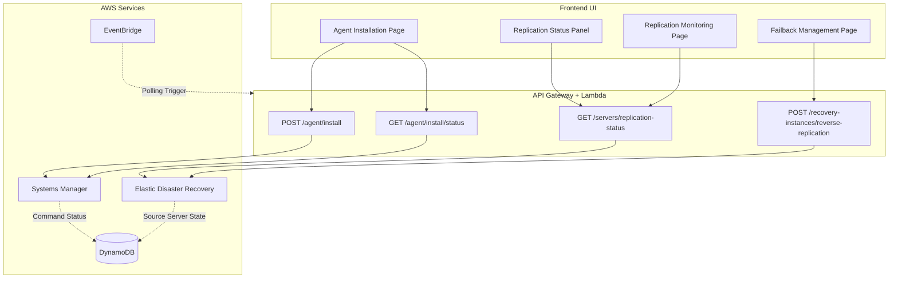
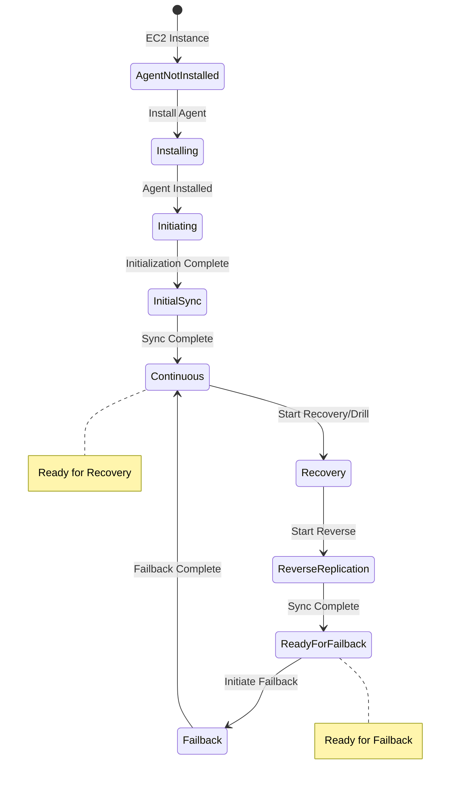

# DRS Agent Installation & Replication Monitoring Implementation Plan

## Executive Summary

This document outlines the implementation plan for integrating DRS agent installation, replication progress monitoring, and reverse replication (failback) visualization into the AWS DRS Orchestration UI.

---

## Related Features

This feature is part of a larger DRS management feature set. Understanding the relationships helps clarify scope boundaries:

| Feature | Relationship | Scope Boundary |
|---------|--------------|----------------|
| **#15 Failover & Failback Orchestration** | Complementary | #15 uses agent installation on RECOVERY instances for failback; this feature (#14) covers agent installation on SOURCE servers |
| **#12 Server Info MVP** | Complementary | #12 displays replication status; this feature provides the agent installation and replication initialization that creates that status |
| **#17 Source Servers Page** | Complementary | #17 displays servers after agent installation; this feature handles the installation process |

### Scope Clarification

- **This Feature (#14)**: Agent installation on SOURCE servers via SSM, replication initialization monitoring (11 steps), continuous replication status, reverse replication visualization
- **#15 Failover & Failback**: Agent installation on RECOVERY instances for failback, failback orchestration, re-protection workflow
- **#12 Server Info MVP**: Read-only display of replication status after agent is installed
- **#17 Source Servers Page**: List view of servers with replication status summary

### Key Distinction: Agent Installation Targets

| Scenario | Target | Feature |
|----------|--------|---------|
| Initial protection setup | Source servers (on-premises or EC2) | This feature (#14) |
| Failback preparation | Recovery instances in DR region | #15 Failover & Failback |

---

## Research Findings

### DRS Data Replication States

From the DRS API, `dataReplicationState` has these valid values:

| State | Description |
|-------|-------------|
| `STOPPED` | Replication is stopped |
| `INITIATING` | Replication initialization in progress |
| `INITIAL_SYNC` | Initial data sync in progress |
| `BACKLOG` | Processing backlog of changes |
| `CREATING_SNAPSHOT` | Creating point-in-time snapshot |
| `CONTINUOUS` | Continuous data protection active (ready for recovery) |
| `PAUSED` | Replication paused |
| `RESCAN` | Rescanning disks |
| `STALLED` | Replication stalled (requires attention) |
| `DISCONNECTED` | Agent disconnected from service |

### DRS Replication Initialization Steps

The `DataReplicationInitiationStep` tracks 11 sequential steps:

| Step | Name | Description |
|------|------|-------------|
| 1 | `WAIT` | Waiting to start |
| 2 | `CREATE_SECURITY_GROUP` | Creating staging area security group |
| 3 | `LAUNCH_REPLICATION_SERVER` | Launching replication server EC2 instance |
| 4 | `BOOT_REPLICATION_SERVER` | Booting replication server |
| 5 | `AUTHENTICATE_WITH_SERVICE` | Authenticating with DRS service |
| 6 | `DOWNLOAD_REPLICATION_SOFTWARE` | Downloading replication software |
| 7 | `CREATE_STAGING_DISKS` | Creating staging EBS volumes |
| 8 | `ATTACH_STAGING_DISKS` | Attaching staging disks to replication server |
| 9 | `PAIR_REPLICATION_SERVER_WITH_AGENT` | Pairing replication server with agent |
| 10 | `CONNECT_AGENT_TO_REPLICATION_SERVER` | Connecting agent to replication server |
| 11 | `START_DATA_TRANSFER` | Starting data transfer |

Each step has status: `NOT_STARTED`, `IN_PROGRESS`, `SUCCEEDED`, `FAILED`, `SKIPPED`


### DRS Source Server Lifecycle

Key lifecycle attributes from `LifeCycle` object:

| Attribute | Description |
|-----------|-------------|
| `addedToServiceDateTime` | When server was added to DRS |
| `firstByteDateTime` | When first byte was replicated |
| `elapsedReplicationDuration` | Total replication time |
| `lastSeenByServiceDateTime` | Last agent heartbeat |
| `lastLaunch` | Last recovery/drill launch info |

### Reverse Replication (Failback) States

For recovery instances, `reversedDirectionLaunchState`:

| State | Description |
|-------|-------------|
| `Not started` | Reverse replication not initiated |
| `Synchronizing` | Reverse replication in progress |
| `Ready` | Ready for failback launch |
| `Completed` | Failback completed (on-premises only) |
| `Error` | Error during reverse replication |

### Failback Mechanisms by Source Type

| Source Infrastructure | Failback Mechanism |
|----------------------|-------------------|
| On-Premises | Failback Client ISO or DRS Failback Automation |
| AWS Same Account | Start Reverse Replication on Recovery Instance |
| AWS Cross Account | Start Reverse Replication in Failover Account |
| Other Cloud | Provider-specific configuration |

---

## Implementation Architecture




---

## Phase 1: DRS Agent Installation via SSM

### 1.1 New API Endpoints

#### POST /agent/install

Initiates DRS agent installation on EC2 instances via SSM.

```python
# Request
{
    "instanceIds": ["i-1234567890abcdef0", "i-0987654321fedcba0"],
    "targetRegion": "us-west-2",  # DRS replication target region
    "tags": "Environment=Production,Application=WebServer"  # Optional
}

# Response
{
    "commandId": "cmd-1234567890abcdef0",
    "instanceIds": ["i-1234567890abcdef0", "i-0987654321fedcba0"],
    "status": "Pending",
    "documentName": "AWSDisasterRecovery-InstallDRAgentOnInstance"
}
```

#### GET /agent/install/{commandId}/status

Returns installation progress for all target instances.

```python
# Response
{
    "commandId": "cmd-1234567890abcdef0",
    "overallStatus": "InProgress",  # Pending|InProgress|Success|Failed|Cancelled
    "instances": [
        {
            "instanceId": "i-1234567890abcdef0",
            "status": "Success",
            "statusDetails": "Success",
            "startTime": "2025-12-15T10:00:00Z",
            "endTime": "2025-12-15T10:05:32Z",
            "outputUrl": "s3://bucket/logs/..."
        },
        {
            "instanceId": "i-0987654321fedcba0",
            "status": "InProgress",
            "statusDetails": "Installing agent...",
            "startTime": "2025-12-15T10:00:00Z",
            "progress": 65
        }
    ]
}
```

### 1.2 Lambda Implementation

```python
# lambda/index.py - New handlers

def install_drs_agent(event, context):
    """Initiate DRS agent installation via SSM."""
    body = json.loads(event.get('body', '{}'))
    instance_ids = body.get('instanceIds', [])
    target_region = body.get('targetRegion')
    tags = body.get('tags', '')
    
    # Validate inputs
    if not instance_ids or not target_region:
        return error_response(400, 'instanceIds and targetRegion required')
    
    if len(instance_ids) > 50:
        return error_response(400, 'Maximum 50 instances per request')
    
    ssm = boto3.client('ssm')
    
    # Send SSM command using AWS-managed document
    response = ssm.send_command(
        InstanceIds=instance_ids,
        DocumentName='AWSDisasterRecovery-InstallDRAgentOnInstance',
        Parameters={
            'Region': [target_region],
            'Tags': [tags] if tags else ['']
        },
        TimeoutSeconds=3600,
        Comment=f'DRS Agent Installation - Target: {target_region}'
    )
    
    command_id = response['Command']['CommandId']
    
    # Store in DynamoDB for tracking
    table = dynamodb.Table(os.environ['AGENT_INSTALLATIONS_TABLE'])
    table.put_item(Item={
        'CommandId': command_id,
        'InstanceIds': instance_ids,
        'TargetRegion': target_region,
        'Status': 'Pending',
        'CreatedAt': datetime.utcnow().isoformat(),
        'CreatedBy': get_user_from_event(event)
    })
    
    return success_response({
        'commandId': command_id,
        'instanceIds': instance_ids,
        'status': 'Pending',
        'documentName': 'AWSDisasterRecovery-InstallDRAgentOnInstance'
    })


def get_agent_install_status(event, context):
    """Get SSM command execution status."""
    command_id = event['pathParameters']['commandId']
    
    ssm = boto3.client('ssm')
    
    # Get command invocations
    response = ssm.list_command_invocations(
        CommandId=command_id,
        Details=True
    )
    
    instances = []
    for inv in response.get('CommandInvocations', []):
        instance_status = {
            'instanceId': inv['InstanceId'],
            'status': inv['Status'],
            'statusDetails': inv.get('StatusDetails', ''),
            'startTime': inv.get('RequestedDateTime', '').isoformat() if inv.get('RequestedDateTime') else None,
            'endTime': inv.get('EndDateTime', '').isoformat() if inv.get('EndDateTime') else None,
        }
        
        # Extract output if available
        if inv.get('CommandPlugins'):
            plugin = inv['CommandPlugins'][0]
            instance_status['output'] = plugin.get('Output', '')[:1000]  # Truncate
            instance_status['outputUrl'] = plugin.get('OutputS3BucketName')
        
        instances.append(instance_status)
    
    # Determine overall status
    statuses = [i['status'] for i in instances]
    if all(s == 'Success' for s in statuses):
        overall = 'Success'
    elif any(s == 'Failed' for s in statuses):
        overall = 'Failed'
    elif any(s in ['InProgress', 'Pending'] for s in statuses):
        overall = 'InProgress'
    else:
        overall = 'Unknown'
    
    return success_response({
        'commandId': command_id,
        'overallStatus': overall,
        'instances': instances
    })
```


### 1.3 Frontend Components

#### AgentInstallationPage.tsx

```typescript
// frontend/src/pages/AgentInstallationPage.tsx
import React, { useState, useEffect } from 'react';
import {
  ContentLayout, Container, Header, SpaceBetween, Button,
  Table, StatusIndicator, ProgressBar, FormField, Multiselect,
  Select, Input, Alert, Box, ColumnLayout
} from '@cloudscape-design/components';
import { useApi } from '../contexts/ApiContext';

interface InstallationInstance {
  instanceId: string;
  status: 'Pending' | 'InProgress' | 'Success' | 'Failed' | 'Cancelled';
  statusDetails: string;
  startTime?: string;
  endTime?: string;
  progress?: number;
}

interface InstallationJob {
  commandId: string;
  overallStatus: string;
  instances: InstallationInstance[];
}

export const AgentInstallationPage: React.FC = () => {
  const { api } = useApi();
  const [selectedInstances, setSelectedInstances] = useState<string[]>([]);
  const [targetRegion, setTargetRegion] = useState<string>('');
  const [tags, setTags] = useState<string>('');
  const [activeJobs, setActiveJobs] = useState<InstallationJob[]>([]);
  const [installing, setInstalling] = useState(false);

  // Poll active jobs every 5 seconds
  useEffect(() => {
    const interval = setInterval(() => {
      activeJobs.forEach(job => {
        if (job.overallStatus === 'InProgress' || job.overallStatus === 'Pending') {
          refreshJobStatus(job.commandId);
        }
      });
    }, 5000);
    return () => clearInterval(interval);
  }, [activeJobs]);

  const handleInstall = async () => {
    setInstalling(true);
    try {
      const response = await api.post('/agent/install', {
        instanceIds: selectedInstances,
        targetRegion,
        tags
      });
      setActiveJobs(prev => [...prev, { ...response.data, instances: [] }]);
    } finally {
      setInstalling(false);
    }
  };

  const getStatusIndicator = (status: string) => {
    const statusMap: Record<string, 'success' | 'error' | 'in-progress' | 'pending'> = {
      Success: 'success',
      Failed: 'error',
      InProgress: 'in-progress',
      Pending: 'pending',
      Cancelled: 'error'
    };
    return <StatusIndicator type={statusMap[status] || 'pending'}>{status}</StatusIndicator>;
  };

  return (
    <ContentLayout
      header={
        <Header
          variant="h1"
          description="Install DRS replication agent on EC2 instances"
          actions={
            <Button
              variant="primary"
              onClick={handleInstall}
              loading={installing}
              disabled={!selectedInstances.length || !targetRegion}
            >
              Install Agent
            </Button>
          }
        >
          DRS Agent Installation
        </Header>
      }
    >
      <SpaceBetween size="l">
        {/* Configuration Form */}
        <Container header={<Header variant="h2">Installation Configuration</Header>}>
          <ColumnLayout columns={2}>
            <FormField label="Target EC2 Instances" description="Select instances to install agent">
              <Multiselect
                selectedOptions={selectedInstances.map(id => ({ value: id, label: id }))}
                onChange={({ detail }) => 
                  setSelectedInstances(detail.selectedOptions.map(o => o.value!))
                }
                options={[]} // Populated from EC2 discovery
                filteringType="auto"
                placeholder="Select instances"
              />
            </FormField>
            <FormField label="DRS Target Region" description="Region to replicate data to">
              <Select
                selectedOption={targetRegion ? { value: targetRegion } : null}
                onChange={({ detail }) => setTargetRegion(detail.selectedOption.value!)}
                options={DRS_REGIONS}
                placeholder="Select target region"
              />
            </FormField>
          </ColumnLayout>
          <FormField label="Tags (Optional)" description="KEY=VALUE pairs, comma-separated">
            <Input
              value={tags}
              onChange={({ detail }) => setTags(detail.value)}
              placeholder="Environment=Production,Application=WebServer"
            />
          </FormField>
        </Container>

        {/* Active Installation Jobs */}
        {activeJobs.length > 0 && (
          <Container header={<Header variant="h2">Installation Progress</Header>}>
            {activeJobs.map(job => (
              <InstallationJobCard key={job.commandId} job={job} />
            ))}
          </Container>
        )}
      </SpaceBetween>
    </ContentLayout>
  );
};
```


---

## Phase 2: Replication Progress Monitoring

### 2.1 New API Endpoints

#### GET /servers/{sourceServerId}/replication-status

Returns detailed replication status including initialization steps.

```python
# Response
{
    "sourceServerId": "s-1234567890abcdef0",
    "hostname": "web-server-01",
    "dataReplicationState": "INITIAL_SYNC",
    "etaDateTime": "2025-12-15T14:30:00Z",
    "lagDuration": "PT0S",
    "lifecycle": {
        "addedToServiceDateTime": "2025-12-15T10:00:00Z",
        "firstByteDateTime": "2025-12-15T10:15:00Z",
        "elapsedReplicationDuration": "PT4H30M",
        "lastSeenByServiceDateTime": "2025-12-15T14:30:00Z"
    },
    "initializationSteps": [
        {"name": "WAIT", "status": "SUCCEEDED"},
        {"name": "CREATE_SECURITY_GROUP", "status": "SUCCEEDED"},
        {"name": "LAUNCH_REPLICATION_SERVER", "status": "SUCCEEDED"},
        {"name": "BOOT_REPLICATION_SERVER", "status": "SUCCEEDED"},
        {"name": "AUTHENTICATE_WITH_SERVICE", "status": "SUCCEEDED"},
        {"name": "DOWNLOAD_REPLICATION_SOFTWARE", "status": "SUCCEEDED"},
        {"name": "CREATE_STAGING_DISKS", "status": "SUCCEEDED"},
        {"name": "ATTACH_STAGING_DISKS", "status": "SUCCEEDED"},
        {"name": "PAIR_REPLICATION_SERVER_WITH_AGENT", "status": "SUCCEEDED"},
        {"name": "CONNECT_AGENT_TO_REPLICATION_SERVER", "status": "IN_PROGRESS"},
        {"name": "START_DATA_TRANSFER", "status": "NOT_STARTED"}
    ],
    "replicatedDisks": [
        {
            "deviceName": "/dev/sda1",
            "totalStorageBytes": 107374182400,
            "replicatedStorageBytes": 53687091200,
            "rescannedStorageBytes": 0,
            "backloggedStorageBytes": 0,
            "progressPercent": 50
        },
        {
            "deviceName": "/dev/sdb",
            "totalStorageBytes": 536870912000,
            "replicatedStorageBytes": 268435456000,
            "progressPercent": 50
        }
    ],
    "overallProgress": 50,
    "stagingArea": {
        "status": "READY",
        "stagingAccountId": "123456789012",
        "stagingSourceServerArn": "arn:aws:drs:us-west-2:123456789012:source-server/s-xxx"
    },
    "error": null
}
```

### 2.2 Lambda Implementation

```python
def get_replication_status(event, context):
    """Get detailed replication status for a source server."""
    source_server_id = event['pathParameters']['sourceServerId']
    region = event.get('queryStringParameters', {}).get('region', os.environ['AWS_REGION'])
    
    drs = boto3.client('drs', region_name=region)
    
    # Get source server details
    response = drs.describe_source_servers(
        filters={'sourceServerIDs': [source_server_id]}
    )
    
    if not response.get('items'):
        return error_response(404, f'Source server {source_server_id} not found')
    
    server = response['items'][0]
    data_rep_info = server.get('dataReplicationInfo', {})
    lifecycle = server.get('lifeCycle', {})
    
    # Calculate overall progress from disk replication
    replicated_disks = data_rep_info.get('replicatedDisks', [])
    total_bytes = sum(d.get('totalStorageBytes', 0) for d in replicated_disks)
    replicated_bytes = sum(d.get('replicatedStorageBytes', 0) for d in replicated_disks)
    overall_progress = (replicated_bytes / total_bytes * 100) if total_bytes > 0 else 0
    
    # Format disk info with progress
    disks = []
    for disk in replicated_disks:
        total = disk.get('totalStorageBytes', 0)
        replicated = disk.get('replicatedStorageBytes', 0)
        disks.append({
            'deviceName': disk.get('deviceName'),
            'totalStorageBytes': total,
            'replicatedStorageBytes': replicated,
            'rescannedStorageBytes': disk.get('rescannedStorageBytes', 0),
            'backloggedStorageBytes': disk.get('backloggedStorageBytes', 0),
            'progressPercent': (replicated / total * 100) if total > 0 else 0
        })
    
    # Get initialization steps
    init_info = data_rep_info.get('dataReplicationInitiation', {})
    init_steps = init_info.get('steps', [])
    
    return success_response({
        'sourceServerId': source_server_id,
        'hostname': server.get('sourceProperties', {}).get('identificationHints', {}).get('hostname'),
        'dataReplicationState': data_rep_info.get('dataReplicationState'),
        'etaDateTime': data_rep_info.get('etaDateTime'),
        'lagDuration': data_rep_info.get('lagDuration'),
        'lifecycle': {
            'addedToServiceDateTime': lifecycle.get('addedToServiceDateTime'),
            'firstByteDateTime': lifecycle.get('firstByteDateTime'),
            'elapsedReplicationDuration': lifecycle.get('elapsedReplicationDuration'),
            'lastSeenByServiceDateTime': lifecycle.get('lastSeenByServiceDateTime')
        },
        'initializationSteps': [
            {'name': step.get('name'), 'status': step.get('status')}
            for step in init_steps
        ],
        'replicatedDisks': disks,
        'overallProgress': round(overall_progress, 1),
        'stagingArea': server.get('stagingArea'),
        'error': data_rep_info.get('dataReplicationError')
    })
```


### 2.3 Frontend Components

#### ReplicationStatusPanel.tsx

```typescript
// frontend/src/components/ReplicationStatusPanel.tsx
import React from 'react';
import {
  Container, Header, SpaceBetween, StatusIndicator, ProgressBar,
  Box, ColumnLayout, Badge, Table, Icon
} from '@cloudscape-design/components';

interface InitializationStep {
  name: string;
  status: 'NOT_STARTED' | 'IN_PROGRESS' | 'SUCCEEDED' | 'FAILED' | 'SKIPPED';
}

interface ReplicatedDisk {
  deviceName: string;
  totalStorageBytes: number;
  replicatedStorageBytes: number;
  progressPercent: number;
}

interface ReplicationStatus {
  sourceServerId: string;
  hostname: string;
  dataReplicationState: string;
  etaDateTime?: string;
  lagDuration?: string;
  overallProgress: number;
  initializationSteps: InitializationStep[];
  replicatedDisks: ReplicatedDisk[];
  error?: { rawError: string };
}

const STEP_LABELS: Record<string, string> = {
  WAIT: 'Waiting',
  CREATE_SECURITY_GROUP: 'Create Security Group',
  LAUNCH_REPLICATION_SERVER: 'Launch Replication Server',
  BOOT_REPLICATION_SERVER: 'Boot Replication Server',
  AUTHENTICATE_WITH_SERVICE: 'Authenticate with DRS',
  DOWNLOAD_REPLICATION_SOFTWARE: 'Download Replication Software',
  CREATE_STAGING_DISKS: 'Create Staging Disks',
  ATTACH_STAGING_DISKS: 'Attach Staging Disks',
  PAIR_REPLICATION_SERVER_WITH_AGENT: 'Pair Server with Agent',
  CONNECT_AGENT_TO_REPLICATION_SERVER: 'Connect Agent',
  START_DATA_TRANSFER: 'Start Data Transfer'
};

const STATE_CONFIG: Record<string, { type: string; label: string; color: string }> = {
  STOPPED: { type: 'stopped', label: 'Stopped', color: 'grey' },
  INITIATING: { type: 'in-progress', label: 'Initiating', color: 'blue' },
  INITIAL_SYNC: { type: 'in-progress', label: 'Initial Sync', color: 'blue' },
  BACKLOG: { type: 'warning', label: 'Processing Backlog', color: 'yellow' },
  CREATING_SNAPSHOT: { type: 'in-progress', label: 'Creating Snapshot', color: 'blue' },
  CONTINUOUS: { type: 'success', label: 'Continuous (Ready)', color: 'green' },
  PAUSED: { type: 'stopped', label: 'Paused', color: 'grey' },
  RESCAN: { type: 'in-progress', label: 'Rescanning', color: 'blue' },
  STALLED: { type: 'error', label: 'Stalled', color: 'red' },
  DISCONNECTED: { type: 'error', label: 'Disconnected', color: 'red' }
};

export const ReplicationStatusPanel: React.FC<{ status: ReplicationStatus }> = ({ status }) => {
  const stateConfig = STATE_CONFIG[status.dataReplicationState] || STATE_CONFIG.STOPPED;
  
  const formatBytes = (bytes: number) => {
    const gb = bytes / (1024 ** 3);
    return gb >= 1 ? `${gb.toFixed(1)} GB` : `${(bytes / (1024 ** 2)).toFixed(0)} MB`;
  };

  const getStepIcon = (stepStatus: string) => {
    switch (stepStatus) {
      case 'SUCCEEDED': return <Icon name="status-positive" variant="success" />;
      case 'IN_PROGRESS': return <Icon name="status-in-progress" variant="link" />;
      case 'FAILED': return <Icon name="status-negative" variant="error" />;
      case 'SKIPPED': return <Icon name="status-stopped" variant="subtle" />;
      default: return <Icon name="status-pending" variant="subtle" />;
    }
  };

  return (
    <SpaceBetween size="l">
      {/* Overall Status */}
      <Container header={<Header variant="h2">Replication Status</Header>}>
        <ColumnLayout columns={4} variant="text-grid">
          <div>
            <Box variant="awsui-key-label">State</Box>
            <StatusIndicator type={stateConfig.type as any}>
              {stateConfig.label}
            </StatusIndicator>
          </div>
          <div>
            <Box variant="awsui-key-label">Overall Progress</Box>
            <ProgressBar
              value={status.overallProgress}
              label={`${status.overallProgress.toFixed(1)}%`}
              status={status.dataReplicationState === 'CONTINUOUS' ? 'success' : 'in-progress'}
            />
          </div>
          <div>
            <Box variant="awsui-key-label">ETA</Box>
            <Box>{status.etaDateTime || 'Calculating...'}</Box>
          </div>
          <div>
            <Box variant="awsui-key-label">Lag</Box>
            <Box>{status.lagDuration || 'N/A'}</Box>
          </div>
        </ColumnLayout>
      </Container>

      {/* Initialization Steps Timeline */}
      {status.dataReplicationState === 'INITIATING' && (
        <Container header={<Header variant="h2">Initialization Progress</Header>}>
          <SpaceBetween size="xs">
            {status.initializationSteps.map((step, index) => (
              <Box key={step.name} padding={{ left: 's' }}>
                <SpaceBetween direction="horizontal" size="xs">
                  {getStepIcon(step.status)}
                  <Box color={step.status === 'IN_PROGRESS' ? 'text-status-info' : undefined}>
                    {index + 1}. {STEP_LABELS[step.name] || step.name}
                  </Box>
                  {step.status === 'IN_PROGRESS' && (
                    <Badge color="blue">In Progress</Badge>
                  )}
                </SpaceBetween>
              </Box>
            ))}
          </SpaceBetween>
        </Container>
      )}

      {/* Disk Replication Progress */}
      <Container header={<Header variant="h2">Disk Replication</Header>}>
        <Table
          items={status.replicatedDisks}
          columnDefinitions={[
            { id: 'device', header: 'Device', cell: d => d.deviceName },
            { id: 'total', header: 'Total Size', cell: d => formatBytes(d.totalStorageBytes) },
            { id: 'replicated', header: 'Replicated', cell: d => formatBytes(d.replicatedStorageBytes) },
            {
              id: 'progress',
              header: 'Progress',
              cell: d => (
                <ProgressBar
                  value={d.progressPercent}
                  status={d.progressPercent >= 100 ? 'success' : 'in-progress'}
                />
              )
            }
          ]}
        />
      </Container>

      {/* Error Display */}
      {status.error && (
        <Container header={<Header variant="h2">Error</Header>}>
          <StatusIndicator type="error">{status.error.rawError}</StatusIndicator>
        </Container>
      )}
    </SpaceBetween>
  );
};
```


---

## Phase 3: Reverse Replication & Failback Management

### 3.1 New API Endpoints

#### GET /recovery-instances

List all recovery instances with reverse replication status.

```python
# Response
{
    "recoveryInstances": [
        {
            "recoveryInstanceId": "i-recovery123",
            "ec2InstanceId": "i-0abc123def456",
            "sourceServerId": "s-source123",
            "sourceServerHostname": "web-server-01",
            "reversedDirectionLaunchState": "Synchronizing",
            "dataReplicationStatus": "Initial sync",
            "dataReplicationProgress": 45,
            "pendingAction": "Launch for failback on us-east-1",
            "replicatingToSourceServer": {
                "region": "us-east-1",
                "sourceServerId": "s-reverse123"
            },
            "lastLaunchResult": "Launch successful"
        }
    ]
}
```

#### POST /recovery-instances/{id}/reverse-replication

Start reverse replication for a recovery instance.

```python
# Request
{
    "targetRegion": "us-east-1"  # For cross-region failback
}

# Response
{
    "recoveryInstanceId": "i-recovery123",
    "reverseReplicationStatus": "Initiated",
    "targetSourceServerId": "s-reverse123",
    "message": "Reverse replication started successfully"
}
```

#### POST /recovery-instances/{id}/failback

Initiate failback launch from recovery instance.

```python
# Request
{
    "isDrill": false,
    "pointInTimeSnapshotId": "pit-123"  # Optional, uses latest if not specified
}

# Response
{
    "jobId": "drsjob-failback123",
    "status": "PENDING",
    "targetInstances": ["i-failback123"]
}
```

### 3.2 Lambda Implementation

```python
def list_recovery_instances(event, context):
    """List recovery instances with reverse replication status."""
    region = event.get('queryStringParameters', {}).get('region', os.environ['AWS_REGION'])
    
    drs = boto3.client('drs', region_name=region)
    
    response = drs.describe_recovery_instances()
    
    instances = []
    for ri in response.get('items', []):
        # Get data replication info for reverse replication
        data_rep = ri.get('dataReplicationInfo', {})
        
        # Calculate progress
        disks = data_rep.get('replicatedDisks', [])
        total = sum(d.get('totalStorageBytes', 0) for d in disks)
        replicated = sum(d.get('replicatedStorageBytes', 0) for d in disks)
        progress = (replicated / total * 100) if total > 0 else 0
        
        instances.append({
            'recoveryInstanceId': ri.get('recoveryInstanceID'),
            'ec2InstanceId': ri.get('ec2InstanceID'),
            'sourceServerId': ri.get('sourceServerID'),
            'reversedDirectionLaunchState': ri.get('failback', {}).get('state'),
            'dataReplicationStatus': data_rep.get('dataReplicationState'),
            'dataReplicationProgress': round(progress, 1),
            'pendingAction': get_pending_action(ri),
            'replicatingToSourceServer': {
                'region': ri.get('failback', {}).get('failbackToOriginalServer', {}).get('region'),
                'sourceServerId': ri.get('failback', {}).get('failbackToOriginalServer', {}).get('sourceServerID')
            },
            'lastLaunchResult': ri.get('failback', {}).get('failbackLaunchType')
        })
    
    return success_response({'recoveryInstances': instances})


def start_reverse_replication(event, context):
    """Start reverse replication for a recovery instance."""
    recovery_instance_id = event['pathParameters']['id']
    body = json.loads(event.get('body', '{}'))
    
    drs = boto3.client('drs')
    
    try:
        response = drs.start_replication(
            sourceServerID=recovery_instance_id  # Recovery instance acts as source for reverse
        )
        
        return success_response({
            'recoveryInstanceId': recovery_instance_id,
            'reverseReplicationStatus': 'Initiated',
            'message': 'Reverse replication started successfully'
        })
    except drs.exceptions.ConflictException as e:
        return error_response(409, f'Reverse replication already in progress: {str(e)}')


def initiate_failback(event, context):
    """Initiate failback launch from recovery instance."""
    recovery_instance_id = event['pathParameters']['id']
    body = json.loads(event.get('body', '{}'))
    is_drill = body.get('isDrill', False)
    
    drs = boto3.client('drs')
    
    # Get the source server associated with reverse replication
    ri_response = drs.describe_recovery_instances(
        filters={'recoveryInstanceIDs': [recovery_instance_id]}
    )
    
    if not ri_response.get('items'):
        return error_response(404, 'Recovery instance not found')
    
    ri = ri_response['items'][0]
    reverse_source_server_id = ri.get('failback', {}).get('failbackToOriginalServer', {}).get('sourceServerID')
    
    if not reverse_source_server_id:
        return error_response(400, 'No reverse replication source server found')
    
    # Start recovery (failback) from the reverse source server
    response = drs.start_recovery(
        isDrill=is_drill,
        sourceServers=[{'sourceServerID': reverse_source_server_id}]
    )
    
    job = response.get('job', {})
    
    return success_response({
        'jobId': job.get('jobID'),
        'status': job.get('status'),
        'targetInstances': [
            ps.get('recoveryInstanceID') 
            for ps in job.get('participatingServers', [])
        ]
    })
```


### 3.3 Frontend Components

#### FailbackManagementPage.tsx

```typescript
// frontend/src/pages/FailbackManagementPage.tsx
import React, { useState, useEffect } from 'react';
import {
  ContentLayout, Container, Header, SpaceBetween, Button,
  Table, StatusIndicator, ProgressBar, Badge, Box, Modal,
  ColumnLayout, Alert
} from '@cloudscape-design/components';
import { useCollection } from '@cloudscape-design/collection-hooks';

interface RecoveryInstance {
  recoveryInstanceId: string;
  ec2InstanceId: string;
  sourceServerId: string;
  sourceServerHostname: string;
  reversedDirectionLaunchState: string;
  dataReplicationStatus: string;
  dataReplicationProgress: number;
  pendingAction: string;
  replicatingToSourceServer: {
    region: string;
    sourceServerId: string;
  };
}

const REVERSE_STATE_CONFIG: Record<string, { type: string; label: string }> = {
  'Not started': { type: 'stopped', label: 'Not Started' },
  'Synchronizing': { type: 'in-progress', label: 'Synchronizing' },
  'Ready': { type: 'success', label: 'Ready for Failback' },
  'Completed': { type: 'success', label: 'Completed' },
  'Error': { type: 'error', label: 'Error' }
};

export const FailbackManagementPage: React.FC = () => {
  const [recoveryInstances, setRecoveryInstances] = useState<RecoveryInstance[]>([]);
  const [selectedInstances, setSelectedInstances] = useState<RecoveryInstance[]>([]);
  const [showFailbackModal, setShowFailbackModal] = useState(false);
  const [loading, setLoading] = useState(true);

  const { items, collectionProps } = useCollection(recoveryInstances, {
    sorting: { defaultState: { sortingColumn: { sortingField: 'sourceServerHostname' } } },
    selection: {}
  });

  const handleStartReverseReplication = async () => {
    for (const instance of selectedInstances) {
      await api.post(`/recovery-instances/${instance.recoveryInstanceId}/reverse-replication`);
    }
    refreshData();
  };

  const handleFailback = async (isDrill: boolean) => {
    for (const instance of selectedInstances) {
      await api.post(`/recovery-instances/${instance.recoveryInstanceId}/failback`, { isDrill });
    }
    setShowFailbackModal(false);
    refreshData();
  };

  const columnDefinitions = [
    {
      id: 'hostname',
      header: 'Source Hostname',
      cell: (item: RecoveryInstance) => item.sourceServerHostname,
      sortingField: 'sourceServerHostname'
    },
    {
      id: 'ec2Instance',
      header: 'Recovery Instance',
      cell: (item: RecoveryInstance) => item.ec2InstanceId
    },
    {
      id: 'reverseState',
      header: 'Reverse Replication',
      cell: (item: RecoveryInstance) => {
        const config = REVERSE_STATE_CONFIG[item.reversedDirectionLaunchState] || 
                       REVERSE_STATE_CONFIG['Not started'];
        return <StatusIndicator type={config.type as any}>{config.label}</StatusIndicator>;
      }
    },
    {
      id: 'progress',
      header: 'Sync Progress',
      cell: (item: RecoveryInstance) => (
        item.reversedDirectionLaunchState === 'Synchronizing' ? (
          <ProgressBar value={item.dataReplicationProgress} />
        ) : (
          <Box color="text-body-secondary">—</Box>
        )
      )
    },
    {
      id: 'pendingAction',
      header: 'Pending Action',
      cell: (item: RecoveryInstance) => (
        item.pendingAction ? (
          <Badge color="blue">{item.pendingAction}</Badge>
        ) : (
          <Box color="text-body-secondary">None</Box>
        )
      )
    },
    {
      id: 'replicatingTo',
      header: 'Replicating To',
      cell: (item: RecoveryInstance) => (
        item.replicatingToSourceServer?.sourceServerId ? (
          <SpaceBetween direction="horizontal" size="xs">
            <Badge>{item.replicatingToSourceServer.region}</Badge>
            <Box>{item.replicatingToSourceServer.sourceServerId}</Box>
          </SpaceBetween>
        ) : (
          <Box color="text-body-secondary">Not configured</Box>
        )
      )
    }
  ];

  return (
    <ContentLayout
      header={
        <Header
          variant="h1"
          description="Manage reverse replication and failback operations"
          actions={
            <SpaceBetween direction="horizontal" size="xs">
              <Button
                onClick={handleStartReverseReplication}
                disabled={selectedInstances.length === 0 || 
                  selectedInstances.some(i => i.reversedDirectionLaunchState !== 'Not started')}
              >
                Start Reverse Replication
              </Button>
              <Button
                variant="primary"
                onClick={() => setShowFailbackModal(true)}
                disabled={selectedInstances.length === 0 ||
                  selectedInstances.some(i => i.reversedDirectionLaunchState !== 'Ready')}
              >
                Initiate Failback
              </Button>
            </SpaceBetween>
          }
        >
          Failback Management
        </Header>
      }
    >
      <Container>
        <Table
          {...collectionProps}
          items={items}
          columnDefinitions={columnDefinitions}
          selectionType="multi"
          selectedItems={selectedInstances}
          onSelectionChange={({ detail }) => setSelectedInstances(detail.selectedItems)}
          loading={loading}
          loadingText="Loading recovery instances..."
          empty={
            <Box textAlign="center" padding="l">
              <b>No recovery instances</b>
              <Box>Launch a recovery or drill first to see recovery instances here.</Box>
            </Box>
          }
        />
      </Container>

      {/* Failback Confirmation Modal */}
      <Modal
        visible={showFailbackModal}
        onDismiss={() => setShowFailbackModal(false)}
        header="Initiate Failback"
        footer={
          <Box float="right">
            <SpaceBetween direction="horizontal" size="xs">
              <Button onClick={() => setShowFailbackModal(false)}>Cancel</Button>
              <Button onClick={() => handleFailback(true)}>Failback Drill</Button>
              <Button variant="primary" onClick={() => handleFailback(false)}>
                Failback (Production)
              </Button>
            </SpaceBetween>
          </Box>
        }
      >
        <SpaceBetween size="m">
          <Alert type="warning">
            Production failback will redirect traffic back to the original source infrastructure.
            Use Failback Drill to test without impacting production.
          </Alert>
          <Box>
            <b>Selected instances:</b>
            <ul>
              {selectedInstances.map(i => (
                <li key={i.recoveryInstanceId}>{i.sourceServerHostname} ({i.ec2InstanceId})</li>
              ))}
            </ul>
          </Box>
        </SpaceBetween>
      </Modal>
    </ContentLayout>
  );
};
```


---

## Phase 4: Unified Replication Dashboard

### 4.1 Dashboard Overview

A comprehensive dashboard showing all servers across the replication lifecycle.



### 4.2 ReplicationDashboard Component

```typescript
// frontend/src/pages/ReplicationDashboard.tsx
import React, { useState, useEffect } from 'react';
import {
  ContentLayout, Container, Header, SpaceBetween, Grid, Box,
  PieChart, BarChart, StatusIndicator, Table, Tabs, Badge
} from '@cloudscape-design/components';

interface DashboardMetrics {
  totalServers: number;
  byState: Record<string, number>;
  byRegion: Record<string, number>;
  recentActivity: ActivityItem[];
  alerts: AlertItem[];
}

export const ReplicationDashboard: React.FC = () => {
  const [metrics, setMetrics] = useState<DashboardMetrics | null>(null);
  const [selectedTab, setSelectedTab] = useState('overview');

  const stateColors: Record<string, string> = {
    CONTINUOUS: '#037f0c',      // Green - Ready
    INITIAL_SYNC: '#0972d3',    // Blue - In Progress
    INITIATING: '#0972d3',      // Blue - In Progress
    STALLED: '#d91515',         // Red - Error
    DISCONNECTED: '#d91515',    // Red - Error
    STOPPED: '#5f6b7a',         // Grey - Stopped
    PAUSED: '#5f6b7a'           // Grey - Paused
  };

  return (
    <ContentLayout
      header={
        <Header variant="h1" description="Monitor DRS replication across all source servers">
          Replication Dashboard
        </Header>
      }
    >
      <SpaceBetween size="l">
        {/* Summary Cards */}
        <Grid gridDefinition={[
          { colspan: 3 }, { colspan: 3 }, { colspan: 3 }, { colspan: 3 }
        ]}>
          <Container>
            <Box variant="awsui-key-label">Total Servers</Box>
            <Box variant="awsui-value-large">{metrics?.totalServers || 0}</Box>
          </Container>
          <Container>
            <Box variant="awsui-key-label">Continuous (Ready)</Box>
            <Box variant="awsui-value-large" color="text-status-success">
              {metrics?.byState.CONTINUOUS || 0}
            </Box>
          </Container>
          <Container>
            <Box variant="awsui-key-label">Syncing</Box>
            <Box variant="awsui-value-large" color="text-status-info">
              {(metrics?.byState.INITIAL_SYNC || 0) + (metrics?.byState.INITIATING || 0)}
            </Box>
          </Container>
          <Container>
            <Box variant="awsui-key-label">Needs Attention</Box>
            <Box variant="awsui-value-large" color="text-status-error">
              {(metrics?.byState.STALLED || 0) + (metrics?.byState.DISCONNECTED || 0)}
            </Box>
          </Container>
        </Grid>

        {/* Charts */}
        <Grid gridDefinition={[{ colspan: 6 }, { colspan: 6 }]}>
          <Container header={<Header variant="h2">Replication State Distribution</Header>}>
            <PieChart
              data={Object.entries(metrics?.byState || {}).map(([state, count]) => ({
                title: state,
                value: count,
                color: stateColors[state] || '#5f6b7a'
              }))}
              detailPopoverContent={(datum) => [
                { key: 'State', value: datum.title },
                { key: 'Count', value: datum.value }
              ]}
              hideFilter
              size="medium"
            />
          </Container>
          <Container header={<Header variant="h2">Servers by Region</Header>}>
            <BarChart
              series={[{
                title: 'Servers',
                type: 'bar',
                data: Object.entries(metrics?.byRegion || {}).map(([region, count]) => ({
                  x: region,
                  y: count
                }))
              }]}
              xTitle="Region"
              yTitle="Server Count"
              hideFilter
            />
          </Container>
        </Grid>

        {/* Tabbed Content */}
        <Tabs
          activeTabId={selectedTab}
          onChange={({ detail }) => setSelectedTab(detail.activeTabId)}
          tabs={[
            {
              id: 'overview',
              label: 'All Servers',
              content: <AllServersTable />
            },
            {
              id: 'syncing',
              label: 'Currently Syncing',
              content: <SyncingServersTable />
            },
            {
              id: 'alerts',
              label: 'Alerts',
              content: <AlertsTable alerts={metrics?.alerts || []} />
            },
            {
              id: 'activity',
              label: 'Recent Activity',
              content: <ActivityTimeline activity={metrics?.recentActivity || []} />
            }
          ]}
        />
      </SpaceBetween>
    </ContentLayout>
  );
};
```


---

## Phase 5: Infrastructure Changes

### 5.1 New DynamoDB Table

Add table for tracking agent installations:

```yaml
# cfn/database-stack.yaml - Add new table

AgentInstallationsTable:
  Type: AWS::DynamoDB::Table
  Properties:
    TableName: !Sub '${ProjectName}-agent-installations-${Environment}'
    BillingMode: PAY_PER_REQUEST
    AttributeDefinitions:
      - AttributeName: CommandId
        AttributeType: S
      - AttributeName: CreatedAt
        AttributeType: S
    KeySchema:
      - AttributeName: CommandId
        KeyType: HASH
    GlobalSecondaryIndexes:
      - IndexName: CreatedAtIndex
        KeySchema:
          - AttributeName: CreatedAt
            KeyType: HASH
        Projection:
          ProjectionType: ALL
    TimeToLiveSpecification:
      AttributeName: TTL
      Enabled: true
    Tags:
      - Key: Project
        Value: !Ref ProjectName
```

### 5.2 IAM Permissions

Add SSM permissions to Lambda execution role:

```yaml
# cfn/lambda-stack.yaml - Add to ApiHandlerRole

- PolicyName: SSMAgentInstallation
  PolicyDocument:
    Version: '2012-10-17'
    Statement:
      - Effect: Allow
        Action:
          - ssm:SendCommand
          - ssm:ListCommands
          - ssm:ListCommandInvocations
          - ssm:GetCommandInvocation
          - ssm:DescribeInstanceInformation
        Resource: '*'
      - Effect: Allow
        Action:
          - ssm:GetDocument
          - ssm:DescribeDocument
        Resource: 
          - !Sub 'arn:aws:ssm:*:*:document/AWSDisasterRecovery-InstallDRAgentOnInstance'

- PolicyName: DRSReplicationMonitoring
  PolicyDocument:
    Version: '2012-10-17'
    Statement:
      - Effect: Allow
        Action:
          - drs:DescribeSourceServers
          - drs:DescribeRecoveryInstances
          - drs:DescribeJobs
          - drs:DescribeJobLogItems
          - drs:StartReplication
          - drs:StopReplication
          - drs:StartRecovery
          - drs:ReverseReplication
        Resource: '*'
```

### 5.3 API Gateway Routes

Add new routes to API Gateway:

```yaml
# cfn/api-stack.yaml - Add new resources

# Agent Installation
AgentInstallResource:
  Type: AWS::ApiGateway::Resource
  Properties:
    RestApiId: !Ref RestApi
    ParentId: !GetAtt RestApi.RootResourceId
    PathPart: agent

AgentInstallSubResource:
  Type: AWS::ApiGateway::Resource
  Properties:
    RestApiId: !Ref RestApi
    ParentId: !Ref AgentInstallResource
    PathPart: install

AgentInstallMethod:
  Type: AWS::ApiGateway::Method
  Properties:
    RestApiId: !Ref RestApi
    ResourceId: !Ref AgentInstallSubResource
    HttpMethod: POST
    AuthorizationType: COGNITO_USER_POOLS
    AuthorizerId: !Ref CognitoAuthorizer
    Integration:
      Type: AWS_PROXY
      IntegrationHttpMethod: POST
      Uri: !Sub 'arn:aws:apigateway:${AWS::Region}:lambda:path/2015-03-31/functions/${ApiHandlerFunction.Arn}/invocations'

# Recovery Instances
RecoveryInstancesResource:
  Type: AWS::ApiGateway::Resource
  Properties:
    RestApiId: !Ref RestApi
    ParentId: !GetAtt RestApi.RootResourceId
    PathPart: recovery-instances

RecoveryInstancesMethod:
  Type: AWS::ApiGateway::Method
  Properties:
    RestApiId: !Ref RestApi
    ResourceId: !Ref RecoveryInstancesResource
    HttpMethod: GET
    AuthorizationType: COGNITO_USER_POOLS
    AuthorizerId: !Ref CognitoAuthorizer
    Integration:
      Type: AWS_PROXY
      IntegrationHttpMethod: POST
      Uri: !Sub 'arn:aws:apigateway:${AWS::Region}:lambda:path/2015-03-31/functions/${ApiHandlerFunction.Arn}/invocations'
```


---

## Phase 6: Navigation & Routing Updates

### 6.1 New Navigation Items

```typescript
// frontend/src/components/cloudscape/AppLayout.tsx - Update navigation

const navigationItems = [
  { type: 'link', text: 'Dashboard', href: '/' },
  { type: 'divider' },
  { type: 'link', text: 'Getting Started', href: '/getting-started' },
  { type: 'link', text: 'Protection Groups', href: '/protection-groups' },
  { type: 'link', text: 'Recovery Plans', href: '/recovery-plans' },
  { type: 'link', text: 'History', href: '/executions' },
  { type: 'divider' },
  { 
    type: 'section',
    text: 'Replication',
    items: [
      { type: 'link', text: 'Replication Dashboard', href: '/replication' },
      { type: 'link', text: 'Agent Installation', href: '/agent-installation' },
      { type: 'link', text: 'Failback Management', href: '/failback' },
    ]
  },
  { type: 'divider' },
  { type: 'link', text: 'Quotas', href: '/quotas' },
];
```

### 6.2 Route Configuration

```typescript
// frontend/src/App.tsx - Add new routes

import { ReplicationDashboard } from './pages/ReplicationDashboard';
import { AgentInstallationPage } from './pages/AgentInstallationPage';
import { FailbackManagementPage } from './pages/FailbackManagementPage';

// Inside Routes
<Route path="/replication" element={
  <ProtectedRoute><AppLayout><ReplicationDashboard /></AppLayout></ProtectedRoute>
} />
<Route path="/agent-installation" element={
  <ProtectedRoute><AppLayout><AgentInstallationPage /></AppLayout></ProtectedRoute>
} />
<Route path="/failback" element={
  <ProtectedRoute><AppLayout><FailbackManagementPage /></AppLayout></ProtectedRoute>
} />
```

---

## Implementation Timeline

| Phase | Description | Effort | Dependencies |
|-------|-------------|--------|--------------|
| **Phase 1** | Agent Installation via SSM | 2 weeks | None |
| **Phase 2** | Replication Progress Monitoring | 2 weeks | Phase 1 |
| **Phase 3** | Reverse Replication & Failback | 2 weeks | Phase 2 |
| **Phase 4** | Unified Dashboard | 1 week | Phases 1-3 |
| **Phase 5** | Infrastructure (CFN) | 1 week | Parallel |
| **Phase 6** | Navigation & Integration | 3 days | Phases 1-4 |

**Total Estimated Effort: 8-9 weeks**

---

## DRS API Reference Summary

### Key APIs Used

| API | Purpose |
|-----|---------|
| `drs:DescribeSourceServers` | Get source server details, replication state, lifecycle |
| `drs:DescribeRecoveryInstances` | Get recovery instance details, reverse replication state |
| `drs:DescribeJobs` | Get job status for recovery/drill operations |
| `drs:DescribeJobLogItems` | Get detailed job event logs |
| `drs:StartRecovery` | Initiate recovery or drill |
| `drs:StartReplication` | Start/restart replication |
| `drs:StopReplication` | Stop replication |
| `drs:ReverseReplication` | Start reverse replication for failback |
| `ssm:SendCommand` | Execute agent installation document |
| `ssm:ListCommandInvocations` | Track installation progress |

### Data Structures

```python
# SourceServer key fields
{
    "sourceServerID": "s-xxx",
    "arn": "arn:aws:drs:region:account:source-server/s-xxx",
    "dataReplicationInfo": {
        "dataReplicationState": "CONTINUOUS",
        "dataReplicationInitiation": {
            "steps": [{"name": "...", "status": "..."}]
        },
        "replicatedDisks": [...],
        "etaDateTime": "...",
        "lagDuration": "PT0S"
    },
    "lifeCycle": {
        "addedToServiceDateTime": "...",
        "firstByteDateTime": "...",
        "elapsedReplicationDuration": "...",
        "lastSeenByServiceDateTime": "..."
    },
    "replicationDirection": "FAILOVER",  # or "FAILBACK"
    "recoveryInstanceId": "i-xxx"  # if recovery launched
}

# RecoveryInstance key fields
{
    "recoveryInstanceID": "i-xxx",
    "ec2InstanceID": "i-xxx",
    "sourceServerID": "s-xxx",
    "failback": {
        "state": "NOT_STARTED|SYNCHRONIZING|READY|COMPLETED|ERROR",
        "failbackToOriginalServer": {
            "region": "us-east-1",
            "sourceServerID": "s-reverse-xxx"
        }
    },
    "dataReplicationInfo": {...}  # Same structure as SourceServer
}
```

---

## Testing Strategy

### Unit Tests

```python
# tests/python/unit/test_agent_installation.py

def test_install_drs_agent_validates_inputs():
    """Test input validation for agent installation."""
    event = {'body': json.dumps({'instanceIds': []})}
    response = install_drs_agent(event, None)
    assert response['statusCode'] == 400

def test_install_drs_agent_limits_instances():
    """Test maximum instance limit."""
    event = {'body': json.dumps({
        'instanceIds': [f'i-{i}' for i in range(51)],
        'targetRegion': 'us-west-2'
    })}
    response = install_drs_agent(event, None)
    assert response['statusCode'] == 400
    assert 'Maximum 50' in json.loads(response['body'])['error']
```

### Integration Tests

```python
# tests/python/integration/test_replication_monitoring.py

@pytest.mark.integration
def test_get_replication_status_returns_all_fields():
    """Test replication status API returns complete data."""
    response = api_client.get(f'/servers/{TEST_SOURCE_SERVER_ID}/replication-status')
    assert response.status_code == 200
    data = response.json()
    assert 'dataReplicationState' in data
    assert 'initializationSteps' in data
    assert 'replicatedDisks' in data
    assert 'overallProgress' in data
```

### E2E Tests (Playwright)

```typescript
// tests/playwright/replication-dashboard.spec.ts

test('replication dashboard shows server states', async ({ page }) => {
  await page.goto('/replication');
  await expect(page.getByText('Replication Dashboard')).toBeVisible();
  await expect(page.getByText('Total Servers')).toBeVisible();
  await expect(page.getByText('Continuous (Ready)')).toBeVisible();
});

test('agent installation flow completes', async ({ page }) => {
  await page.goto('/agent-installation');
  await page.getByPlaceholder('Select instances').click();
  await page.getByText('i-test123').click();
  await page.getByPlaceholder('Select target region').click();
  await page.getByText('us-west-2').click();
  await page.getByRole('button', { name: 'Install Agent' }).click();
  await expect(page.getByText('Installation Progress')).toBeVisible();
});
```

---

## Success Metrics

| Metric | Target | Measurement |
|--------|--------|-------------|
| Agent installation success rate | >95% | SSM command success/total |
| Time to CONTINUOUS state | <4 hours (100GB) | Lifecycle timestamps |
| Dashboard load time | <2 seconds | CloudWatch RUM |
| Failback initiation success | >99% | API success rate |
| User adoption | 80% of DR operations via UI | Usage analytics |

---

## Risks & Mitigations

| Risk | Impact | Mitigation |
|------|--------|------------|
| SSM agent not installed on EC2 | Agent install fails | Pre-check SSM connectivity, show clear error |
| Network connectivity to DRS S3 | Agent download fails | Document VPC endpoint requirements |
| IAM permission gaps | Operations fail | Comprehensive permission testing |
| Large disk sync times | User confusion | Clear progress indicators, ETA display |
| Cross-region latency | Slow API responses | Regional caching, async operations |

---

## References

- [AWS DRS User Guide](https://docs.aws.amazon.com/drs/latest/userguide/)
- [DRS API Reference](https://docs.aws.amazon.com/drs/latest/APIReference/)
- [SSM SendCommand API](https://docs.aws.amazon.com/systems-manager/latest/APIReference/API_SendCommand.html)
- [AWSDisasterRecovery-InstallDRAgentOnInstance Document](ssm-documents/AWSDisasterRecovery-InstallDRAgentOnInstance.yaml)
