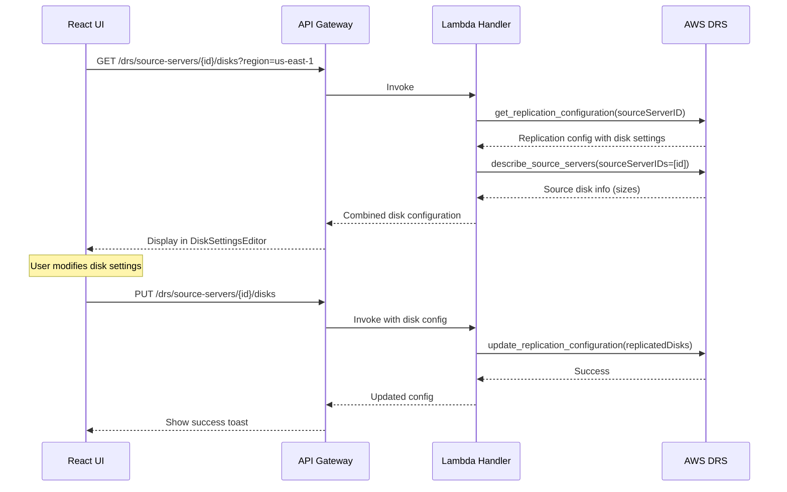
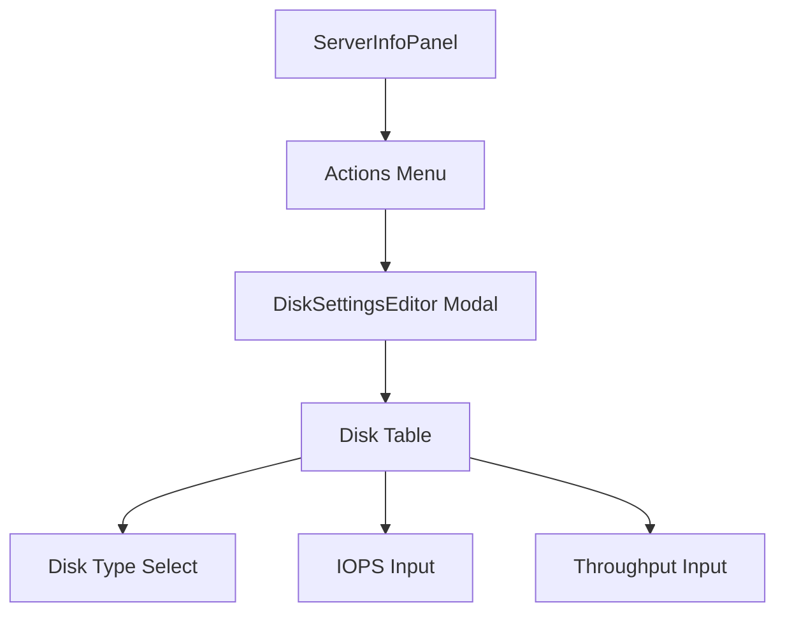

# DRS Disk Settings MVP - Implementation Plan

**Version:** 1.0  
**Date:** December 2025  
**Status:** Ready for Implementation  
**Estimated Effort:** 4-5 days  
**Dependencies:** MVP 1 (Server Info)

---

## Executive Summary

MVP implementation of per-disk configuration for DRS source servers. Configure disk type, IOPS, throughput, and encryption settings for each replicated disk.

### MVP Scope

| Included | Excluded (Future) |
|----------|-------------------|
| View disk configuration | Bulk disk operations |
| Edit disk type (gp3, io1, etc.) | Disk templates |
| Configure IOPS | Auto-optimization |
| Configure throughput | Cost estimation |
| Encryption settings | |

### Business Value

- **Performance tuning**: Optimize disk performance for recovery instances
- **Cost control**: Choose appropriate disk types for workload
- **Compliance**: Ensure encryption requirements are met

---

## DRS Disk Settings

### Disk Configuration Fields

| Field | Type | Description |
|-------|------|-------------|
| `deviceName` | String | Disk device name (/dev/sda1) |
| `isBootDisk` | Boolean | Whether this is the boot disk |
| `stagingDiskType` | Enum | GP2, GP3, IO1, IO2, ST1, SC1, STANDARD |
| `iops` | Integer | IOPS (for io1/io2/gp3) |
| `throughput` | Integer | Throughput MiB/s (for gp3) |

### Disk Type Options

| Type | Use Case | IOPS | Throughput |
|------|----------|------|------------|
| gp3 | General purpose | 3000-16000 | 125-1000 MiB/s |
| gp2 | General purpose (legacy) | Burst to 3000 | N/A |
| io1 | High performance | Up to 64000 | N/A |
| io2 | High performance | Up to 64000 | N/A |
| st1 | Throughput optimized | N/A | Up to 500 MiB/s |
| sc1 | Cold storage | N/A | Up to 250 MiB/s |

---

## Architecture

### Data Flow



### Component Hierarchy



---

## Implementation Plan

### Day 1-2: Backend API

#### API Endpoints

| Method | Endpoint | Description |
|--------|----------|-------------|
| GET | `/drs/source-servers/{id}/disks` | Get disk configuration |
| PUT | `/drs/source-servers/{id}/disks` | Update disk configuration |

#### Lambda Handler

```python
def get_server_disk_settings(event: Dict) -> Dict:
    """Get disk settings for a DRS source server."""
    path_params = event.get('pathParameters', {})
    query_params = event.get('queryStringParameters', {})
    
    server_id = path_params.get('id')
    region = query_params.get('region', 'us-east-1')
    
    if not server_id:
        return response(400, {'error': 'Server ID is required'})
    
    try:
        drs_client = boto3.client('drs', region_name=region)
        
        # Get replication configuration which contains disk settings
        config = drs_client.get_replication_configuration(
            sourceServerID=server_id
        )
        
        # Get source server for disk info
        servers = drs_client.describe_source_servers(
            filters={'sourceServerIDs': [server_id]}
        )
        
        source_disks = []
        if servers.get('items'):
            source_disks = servers['items'][0].get('sourceProperties', {}).get('disks', [])
        
        # Combine source disk info with replication config
        replicated_disks = config.get('replicatedDisks', [])
        
        disks = []
        for disk in replicated_disks:
            source_disk = next(
                (d for d in source_disks if d.get('deviceName') == disk.get('deviceName')),
                {}
            )
            disks.append({
                'deviceName': disk.get('deviceName'),
                'isBootDisk': disk.get('isBootDisk', False),
                'stagingDiskType': disk.get('stagingDiskType', 'GP3'),
                'iops': disk.get('iops'),
                'throughput': disk.get('throughput'),
                'sizeBytes': source_disk.get('bytes', 0)
            })
        
        return response(200, {
            'sourceServerId': server_id,
            'disks': disks
        })
    except drs_client.exceptions.ResourceNotFoundException:
        return response(404, {'error': f'Server {server_id} not found'})
    except Exception as e:
        logger.error(f'Error getting disk settings: {str(e)}')
        return response(500, {'error': str(e)})


def update_server_disk_settings(event: Dict) -> Dict:
    """Update disk settings for a DRS source server."""
    path_params = event.get('pathParameters', {})
    
    try:
        body = json.loads(event.get('body', '{}'))
    except json.JSONDecodeError:
        return response(400, {'error': 'Invalid JSON body'})
    
    server_id = path_params.get('id')
    region = body.get('region', 'us-east-1')
    disks = body.get('disks', [])
    
    if not server_id:
        return response(400, {'error': 'Server ID is required'})
    
    try:
        drs_client = boto3.client('drs', region_name=region)
        
        # Get current config
        current_config = drs_client.get_replication_configuration(
            sourceServerID=server_id
        )
        
        # Build replicated disks update
        replicated_disks = []
        for disk in disks:
            disk_config = {
                'deviceName': disk['deviceName'],
                'isBootDisk': disk.get('isBootDisk', False),
                'stagingDiskType': disk.get('stagingDiskType', 'GP3')
            }
            
            # Add IOPS if applicable
            if disk.get('stagingDiskType') in ['GP3', 'IO1', 'IO2']:
                if disk.get('iops'):
                    disk_config['iops'] = disk['iops']
            
            # Add throughput if GP3
            if disk.get('stagingDiskType') == 'GP3':
                if disk.get('throughput'):
                    disk_config['throughput'] = disk['throughput']
            
            replicated_disks.append(disk_config)
        
        # Update configuration
        drs_client.update_replication_configuration(
            sourceServerID=server_id,
            replicatedDisks=replicated_disks
        )
        
        return response(200, {
            'sourceServerId': server_id,
            'message': 'Disk settings updated successfully'
        })
    except drs_client.exceptions.ResourceNotFoundException:
        return response(404, {'error': f'Server {server_id} not found'})
    except drs_client.exceptions.ValidationException as e:
        return response(400, {'error': f'Validation error: {str(e)}'})
    except Exception as e:
        logger.error(f'Error updating disk settings: {str(e)}')
        return response(500, {'error': str(e)})
```

#### IAM Permissions

```yaml
- Effect: Allow
  Action:
    - drs:GetReplicationConfiguration
    - drs:UpdateReplicationConfiguration
  Resource: '*'
```

---

### Day 3-4: Frontend Component

#### DiskSettingsEditor Component

```typescript
import React, { useState, useEffect } from 'react';
import {
  Modal, Box, SpaceBetween, Button, Table, Select, Input,
  Spinner, Alert, Header, FormField
} from '@cloudscape-design/components';

interface DiskConfig {
  deviceName: string;
  isBootDisk: boolean;
  stagingDiskType: string;
  iops?: number;
  throughput?: number;
  sizeBytes: number;
}

const DISK_TYPES = [
  { value: 'GP3', label: 'General Purpose SSD (gp3)' },
  { value: 'GP2', label: 'General Purpose SSD (gp2)' },
  { value: 'IO1', label: 'Provisioned IOPS SSD (io1)' },
  { value: 'IO2', label: 'Provisioned IOPS SSD (io2)' },
  { value: 'ST1', label: 'Throughput Optimized HDD (st1)' },
  { value: 'SC1', label: 'Cold HDD (sc1)' }
];

export const DiskSettingsEditor: React.FC<{
  visible: boolean;
  onDismiss: () => void;
  serverId: string;
  serverName: string;
  region: string;
}> = ({ visible, onDismiss, serverId, serverName, region }) => {
  const [disks, setDisks] = useState<DiskConfig[]>([]);
  const [loading, setLoading] = useState(true);
  const [saving, setSaving] = useState(false);

  useEffect(() => {
    if (visible) loadDisks();
  }, [visible, serverId]);

  const loadDisks = async () => {
    setLoading(true);
    try {
      const data = await getServerDiskSettings(serverId, region);
      setDisks(data.disks);
    } finally {
      setLoading(false);
    }
  };

  const updateDisk = (deviceName: string, field: string, value: any) => {
    setDisks(disks.map(d => 
      d.deviceName === deviceName ? { ...d, [field]: value } : d
    ));
  };

  const handleSave = async () => {
    setSaving(true);
    try {
      await updateServerDiskSettings(serverId, region, disks);
      toast.success('Disk settings saved');
      onDismiss();
    } finally {
      setSaving(false);
    }
  };

  const formatBytes = (bytes: number) => {
    const gb = bytes / (1024 * 1024 * 1024);
    return `${gb.toFixed(1)} GB`;
  };

  return (
    <Modal
      visible={visible}
      onDismiss={onDismiss}
      header={`Disk Settings: ${serverName}`}
      size="large"
      footer={
        <Box float="right">
          <SpaceBetween direction="horizontal" size="xs">
            <Button onClick={onDismiss}>Cancel</Button>
            <Button variant="primary" onClick={handleSave} loading={saving}>
              Save Changes
            </Button>
          </SpaceBetween>
        </Box>
      }
    >
      {loading ? (
        <Spinner size="large" />
      ) : (
        <Table
          columnDefinitions={[
            { 
              id: 'device', 
              header: 'Device', 
              cell: d => (
                <SpaceBetween direction="horizontal" size="xs">
                  {d.deviceName}
                  {d.isBootDisk && <Badge color="blue">Boot</Badge>}
                </SpaceBetween>
              )
            },
            { id: 'size', header: 'Size', cell: d => formatBytes(d.sizeBytes) },
            {
              id: 'type',
              header: 'Disk Type',
              cell: d => (
                <Select
                  selectedOption={DISK_TYPES.find(t => t.value === d.stagingDiskType)}
                  onChange={({ detail }) => updateDisk(d.deviceName, 'stagingDiskType', detail.selectedOption.value)}
                  options={DISK_TYPES}
                />
              )
            },
            {
              id: 'iops',
              header: 'IOPS',
              cell: d => ['GP3', 'IO1', 'IO2'].includes(d.stagingDiskType) ? (
                <Input
                  type="number"
                  value={String(d.iops || '')}
                  onChange={({ detail }) => updateDisk(d.deviceName, 'iops', parseInt(detail.value))}
                  placeholder="3000"
                />
              ) : '-'
            },
            {
              id: 'throughput',
              header: 'Throughput (MiB/s)',
              cell: d => d.stagingDiskType === 'GP3' ? (
                <Input
                  type="number"
                  value={String(d.throughput || '')}
                  onChange={({ detail }) => updateDisk(d.deviceName, 'throughput', parseInt(detail.value))}
                  placeholder="125"
                />
              ) : '-'
            }
          ]}
          items={disks}
        />
      )}
    </Modal>
  );
};
```

---

## UI Wireframe

```
┌─────────────────────────────────────────────────────────────────────────────┐
│ Disk Settings: web-server-01                                         [X]    │
├─────────────────────────────────────────────────────────────────────────────┤
│                                                                             │
│ ┌───────────────────────────────────────────────────────────────────────┐   │
│ │ Device        │ Size     │ Disk Type              │ IOPS    │ Throughput│ │
│ ├───────────────┼──────────┼────────────────────────┼─────────┼───────────┤ │
│ │ /dev/sda1 🔵  │ 100 GB   │ [GP3 (gp3)        ▼]  │ [3000 ] │ [125    ] │ │
│ │ /dev/sdb      │ 500 GB   │ [GP3 (gp3)        ▼]  │ [6000 ] │ [250    ] │ │
│ │ /dev/sdc      │ 1.0 TB   │ [IO1 (io1)        ▼]  │ [10000] │    -      │ │
│ │ /dev/sdd      │ 2.0 TB   │ [ST1 (st1)        ▼]  │    -    │    -      │ │
│ └───────────────┴──────────┴────────────────────────┴─────────┴───────────┘ │
│                                                                             │
│ 🔵 = Boot Disk                                                              │
│                                                                             │
│ ┌─ Disk Type Reference ───────────────────────────────────────────────────┐ │
│ │ GP3: General purpose SSD, 3000-16000 IOPS, 125-1000 MiB/s throughput    │ │
│ │ GP2: General purpose SSD (legacy), burst to 3000 IOPS                   │ │
│ │ IO1/IO2: Provisioned IOPS SSD, up to 64000 IOPS                         │ │
│ │ ST1: Throughput optimized HDD, up to 500 MiB/s                          │ │
│ │ SC1: Cold HDD, up to 250 MiB/s                                          │ │
│ └─────────────────────────────────────────────────────────────────────────┘ │
│                                                                             │
├─────────────────────────────────────────────────────────────────────────────┤
│                                           [Cancel]  [Save Changes]          │
└─────────────────────────────────────────────────────────────────────────────┘
```

---

## Deployment Checklist

- [ ] Add Lambda handler functions
- [ ] Add IAM permissions  
- [ ] Add API Gateway endpoints
- [ ] Create DiskSettingsEditor component
- [ ] Integrate with ServerInfoPanel
- [ ] Test all disk types

---

## Future Enhancements

| Feature | Effort |
|---------|--------|
| Bulk disk configuration | 2 days |
| Cost estimation | 1-2 days |
| Performance recommendations | 2 days |
