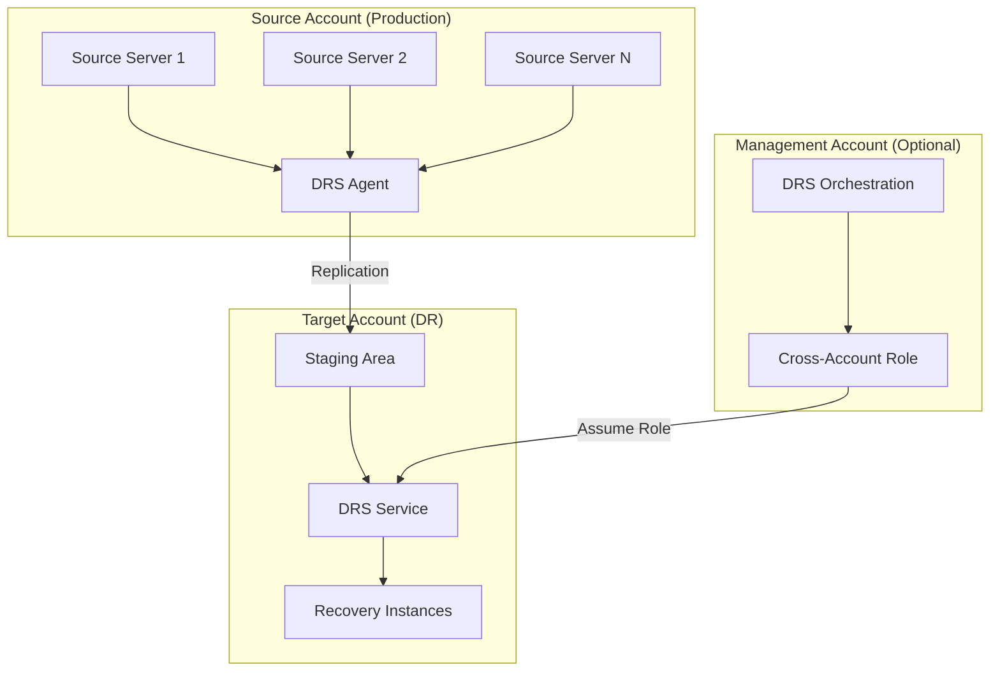

# AWS DRS Extended Source Servers Implementation Plan

## Executive Summary

AWS Elastic Disaster Recovery (DRS) Extended Source Servers enable cross-account disaster recovery by allowing source servers in one AWS account to replicate to a staging area in a different target account. This feature is critical for enterprise multi-account architectures and provides enhanced security isolation between production and DR environments.

---

## Related Features

This feature is part of a larger DRS management feature set. Understanding the relationships helps clarify scope boundaries:

| Feature | Relationship | Scope Boundary |
|---------|--------------|----------------|
| **#13 Multi-Account Support** | Complementary | #13 provides hub-and-spoke orchestration for scaling beyond 300 servers; this feature (#18) provides the cross-account replication setup via CreateExtendedSourceServer API |
| **#11 Cross-Account Monitoring** | Complementary | #11 monitors replication status across accounts; this feature sets up the cross-account replication |

### Scope Clarification

- **This Feature (#18)**: CreateExtendedSourceServer API integration, cross-account replication configuration, staging area setup in target account
- **#13 Multi-Account Support**: Hub-and-spoke architecture, Trusted Accounts feature, unified management UI, cross-account IAM roles for orchestration
- **#11 Cross-Account Monitoring**: EventBridge events, CloudWatch dashboards, alerting (monitoring only)

### Key Distinction: Cross-Account Features

| Feature | Focus | Primary Use Case |
|---------|-------|------------------|
| #18 Extended Source Servers | Configuration | "Set up cross-account replication for a server" |
| #13 Multi-Account Support | Orchestration | "Run a drill across servers in 4 accounts" |
| #11 Cross-Account Monitoring | Observability | "Alert me when replication stalls in any account" |

### When to Use Each Feature

- **Need to replicate a server from Account A to Account B?** → Use #18 Extended Source Servers
- **Need to manage 1000+ servers across multiple accounts?** → Use #13 Multi-Account Support
- **Need alerts when replication fails in any account?** → Use #11 Cross-Account Monitoring

---

## Overview

### What are Extended Source Servers?

Extended Source Servers allow DRS to replicate data from source servers in **Account A** to a staging area in **Account B** (target account). This enables:

- **Cross-account DR**: Production in one account, DR in another
- **Security isolation**: Separate billing and access controls
- **Compliance**: Meet regulatory requirements for data separation
- **Scale**: Overcome single-account DRS limits (300 servers per account)

### Architecture Pattern



---

## Core APIs

### 1. CreateExtendedSourceServer

Creates an extended source server configuration for cross-account replication.

**Endpoint**: `POST /CreateExtendedSourceServer`

**Request Structure**:
```json
{
  "sourceServerArn": "arn:aws:drs:us-east-1:111111111111:source-server/s-1234567890abcdef0",
  "tags": {
    "Environment": "Production",
    "Application": "WebApp"
  }
}
```

**Parameters**:
| Parameter | Type | Required | Description |
|-----------|------|----------|-------------|
| `sourceServerArn` | String | Yes | ARN of source server in source account |
| `tags` | Map | No | Tags to apply to extended source server |

**Response**:
```json
{
  "sourceServer": {
    "sourceServerID": "s-1234567890abcdef0",
    "arn": "arn:aws:drs:us-east-1:222222222222:source-server/s-1234567890abcdef0",
    "isArchived": false,
    "tags": {},
    "sourceProperties": {
      "lastUpdatedDateTime": "2025-12-15T10:00:00Z",
      "recommendedInstanceType": "m5.large",
      "identificationHints": {
        "hostname": "web-server-01",
        "vmWareUuid": "uuid-string"
      },
      "networkInterfaces": [],
      "disks": [],
      "cpus": [],
      "ramBytes": 8589934592,
      "os": {
        "fullString": "Ubuntu 20.04.3 LTS"
      }
    },
    "stagingArea": {
      "stagingAccountID": "222222222222",
      "stagingSourceServerArn": "arn:aws:drs:us-east-1:222222222222:source-server/s-staging-xxx"
    },
    "dataReplicationInfo": {
      "dataReplicationState": "INITIAL_SYNC",
      "dataReplicationInitiation": {
        "startDateTime": "2025-12-15T10:00:00Z",
        "nextAttemptDateTime": null,
        "steps": []
      },
      "etaDateTime": "2025-12-15T12:00:00Z",
      "lagDuration": "PT2H",
      "replicatedDisks": []
    }
  }
}
```

### 2. DescribeSourceServers (Cross-Account)

Lists source servers including extended source servers from other accounts.

**Request Structure**:
```json
{
  "filters": {
    "isArchived": false,
    "sourceServerIDs": ["s-1234567890abcdef0"]
  },
  "maxResults": 100,
  "nextToken": "string"
}
```

**Extended Source Server Response Fields**:
```json
{
  "sourceServerID": "s-1234567890abcdef0",
  "arn": "arn:aws:drs:us-east-1:222222222222:source-server/s-1234567890abcdef0",
  "stagingArea": {
    "stagingAccountID": "222222222222",
    "stagingSourceServerArn": "arn:aws:drs:us-east-1:222222222222:source-server/s-staging-xxx",
    "errorMessage": null
  },
  "sourceProperties": {
    "sourceServerID": "s-1234567890abcdef0"
  },
  "dataReplicationInfo": {
    "dataReplicationState": "CONTINUOUS",
    "lagDuration": "PT30S"
  }
}
```

### 3. UpdateReplicationConfiguration (Cross-Account)

Updates replication settings for extended source servers.

**Request Structure**:
```json
{
  "sourceServerID": "s-1234567890abcdef0",
  "stagingAreaSubnetId": "subnet-12345678",
  "stagingAreaTags": {
    "Name": "DRS-Staging-WebApp",
    "Environment": "DR"
  },
  "replicationServerInstanceType": "m5.large",
  "replicationServersSecurityGroupsIDs": ["sg-12345678"],
  "useDedicatedReplicationServer": false,
  "associateDefaultSecurityGroup": true,
  "bandwidthThrottling": 0,
  "createPublicIP": false,
  "dataPlaneRouting": "PRIVATE_IP",
  "defaultLargeStagingDiskType": "GP3",
  "ebsEncryption": "DEFAULT",
  "ebsEncryptionKeyArn": null,
  "name": "WebApp-Server-01-Replication",
  "pitPolicy": [
    {
      "interval": 10,
      "retentionDuration": 60,
      "ruleID": 1,
      "units": "MINUTE",
      "enabled": true
    }
  ],
  "replicatedDisks": [
    {
      "deviceName": "/dev/sda1",
      "iops": 3000,
      "isBootDisk": true,
      "stagingDiskType": "GP3",
      "throughput": 125
    }
  ]
}
```

### 4. DeleteSourceServer (Extended)

Removes extended source server configuration.

**Request Structure**:
```json
{
  "sourceServerID": "s-1234567890abcdef0"
}
```

**Response**: Empty response with HTTP 204 status.

---

## Cross-Account IAM Setup

### Source Account IAM Role

The source account needs a role that DRS can assume to access the target account.

```yaml
# Source Account Role: DRSCrossAccountSourceRole
Version: '2012-10-17'
Statement:
  - Effect: Allow
    Principal:
      Service: drs.amazonaws.com
    Action: sts:AssumeRole
  - Effect: Allow
    Action:
      - drs:CreateExtendedSourceServer
      - drs:DescribeSourceServers
      - drs:UpdateReplicationConfiguration
      - drs:DeleteSourceServer
    Resource: "*"
  - Effect: Allow
    Action:
      - sts:AssumeRole
    Resource: "arn:aws:iam::TARGET_ACCOUNT:role/DRSCrossAccountTargetRole"
```

### Target Account IAM Role

The target account needs a role that allows the source account's DRS service to manage staging resources.

```yaml
# Target Account Role: DRSCrossAccountTargetRole
Version: '2012-10-17'
Statement:
  - Effect: Allow
    Principal:
      AWS: "arn:aws:iam::SOURCE_ACCOUNT:role/DRSCrossAccountSourceRole"
    Action: sts:AssumeRole
  - Effect: Allow
    Action:
      # DRS staging area management
      - drs:CreateReplicationConfigurationTemplate
      - drs:UpdateReplicationConfigurationTemplate
      - drs:DescribeReplicationConfigurationTemplates
      - drs:DeleteReplicationConfigurationTemplate
      - drs:TagResource
      - drs:UntagResource
      - drs:ListTagsForResource
      
      # EC2 permissions for staging area
      - ec2:CreateVolume
      - ec2:AttachVolume
      - ec2:DetachVolume
      - ec2:DeleteVolume
      - ec2:CreateSnapshot
      - ec2:DeleteSnapshot
      - ec2:DescribeVolumes
      - ec2:DescribeSnapshots
      - ec2:DescribeInstances
      - ec2:RunInstances
      - ec2:TerminateInstances
      - ec2:CreateTags
      - ec2:DescribeTags
      - ec2:CreateLaunchTemplate
      - ec2:CreateLaunchTemplateVersion
      - ec2:ModifyLaunchTemplate
      - ec2:DeleteLaunchTemplate
      - ec2:DescribeLaunchTemplates
      - ec2:DescribeLaunchTemplateVersions
      
      # VPC permissions
      - ec2:DescribeVpcs
      - ec2:DescribeSubnets
      - ec2:DescribeSecurityGroups
      - ec2:DescribeNetworkInterfaces
      - ec2:CreateNetworkInterface
      - ec2:DeleteNetworkInterface
      - ec2:AttachNetworkInterface
      - ec2:DetachNetworkInterface
      
      # IAM permissions for instance profiles
      - iam:PassRole
      - iam:ListInstanceProfiles
      - iam:GetInstanceProfile
    Resource: "*"
  - Effect: Allow
    Action:
      - iam:PassRole
    Resource: "arn:aws:iam::TARGET_ACCOUNT:role/DRSInstanceProfile*"
```

### Trust Relationship Setup

**Source Account Trust Policy**:
```json
{
  "Version": "2012-10-17",
  "Statement": [
    {
      "Effect": "Allow",
      "Principal": {
        "Service": "drs.amazonaws.com"
      },
      "Action": "sts:AssumeRole",
      "Condition": {
        "StringEquals": {
          "sts:ExternalId": "unique-external-id-12345"
        }
      }
    }
  ]
}
```

**Target Account Trust Policy**:
```json
{
  "Version": "2012-10-17",
  "Statement": [
    {
      "Effect": "Allow",
      "Principal": {
        "AWS": "arn:aws:iam::SOURCE_ACCOUNT:role/DRSCrossAccountSourceRole"
      },
      "Action": "sts:AssumeRole",
      "Condition": {
        "StringEquals": {
          "sts:ExternalId": "unique-external-id-12345"
        }
      }
    }
  ]
}
```

---

## Implementation Patterns

### Pattern 1: Cross-Account Source Server Registration

```python
import boto3
from typing import Dict, List, Optional

class DRSExtendedSourceServerManager:
    def __init__(self, source_account_region: str, target_account_region: str):
        self.source_region = source_account_region
        self.target_region = target_account_region
        
    def create_extended_source_server(
        self,
        source_server_arn: str,
        target_account_role_arn: str,
        external_id: str,
        tags: Optional[Dict[str, str]] = None
    ) -> Dict:
        """
        Create extended source server in target account.
        
        Args:
            source_server_arn: ARN of source server in source account
            target_account_role_arn: IAM role ARN in target account
            external_id: External ID for cross-account access
            tags: Optional tags for the extended source server
        
        Returns:
            Extended source server details
        """
        # Assume target account role
        sts = boto3.client('sts')
        assumed_role = sts.assume_role(
            RoleArn=target_account_role_arn,
            RoleSessionName='DRSExtendedSourceServer',
            ExternalId=external_id
        )
        
        # Create DRS client with assumed role credentials
        target_drs = boto3.client(
            'drs',
            region_name=self.target_region,
            aws_access_key_id=assumed_role['Credentials']['AccessKeyId'],
            aws_secret_access_key=assumed_role['Credentials']['SecretAccessKey'],
            aws_session_token=assumed_role['Credentials']['SessionToken']
        )
        
        # Create extended source server
        response = target_drs.create_extended_source_server(
            sourceServerArn=source_server_arn,
            tags=tags or {}
        )
        
        return response['sourceServer']
    
    def list_extended_source_servers(
        self,
        target_account_role_arn: str,
        external_id: str,
        source_server_ids: Optional[List[str]] = None
    ) -> List[Dict]:
        """
        List extended source servers in target account.
        
        Args:
            target_account_role_arn: IAM role ARN in target account
            external_id: External ID for cross-account access
            source_server_ids: Optional filter by source server IDs
        
        Returns:
            List of extended source servers
        """
        # Assume target account role
        sts = boto3.client('sts')
        assumed_role = sts.assume_role(
            RoleArn=target_account_role_arn,
            RoleSessionName='DRSListExtendedServers',
            ExternalId=external_id
        )
        
        # Create DRS client with assumed role credentials
        target_drs = boto3.client(
            'drs',
            region_name=self.target_region,
            aws_access_key_id=assumed_role['Credentials']['AccessKeyId'],
            aws_secret_access_key=assumed_role['Credentials']['SecretAccessKey'],
            aws_session_token=assumed_role['Credentials']['SessionToken']
        )
        
        # List source servers
        filters = {'isArchived': False}
        if source_server_ids:
            filters['sourceServerIDs'] = source_server_ids
        
        servers = []
        next_token = None
        
        while True:
            params = {
                'filters': filters,
                'maxResults': 100
            }
            if next_token:
                params['nextToken'] = next_token
            
            response = target_drs.describe_source_servers(**params)
            servers.extend(response.get('items', []))
            
            next_token = response.get('nextToken')
            if not next_token:
                break
        
        # Filter for extended source servers only
        extended_servers = [
            server for server in servers 
            if 'stagingArea' in server and server['stagingArea']
        ]
        
        return extended_servers
    
    def configure_replication_settings(
        self,
        source_server_id: str,
        target_account_role_arn: str,
        external_id: str,
        staging_subnet_id: str,
        security_group_ids: List[str],
        replication_instance_type: str = 'm5.large'
    ) -> Dict:
        """
        Configure replication settings for extended source server.
        
        Args:
            source_server_id: Source server ID
            target_account_role_arn: IAM role ARN in target account
            external_id: External ID for cross-account access
            staging_subnet_id: Subnet ID for staging area
            security_group_ids: Security group IDs for replication
            replication_instance_type: Instance type for replication server
        
        Returns:
            Updated replication configuration
        """
        # Assume target account role
        sts = boto3.client('sts')
        assumed_role = sts.assume_role(
            RoleArn=target_account_role_arn,
            RoleSessionName='DRSConfigureReplication',
            ExternalId=external_id
        )
        
        # Create DRS client with assumed role credentials
        target_drs = boto3.client(
            'drs',
            region_name=self.target_region,
            aws_access_key_id=assumed_role['Credentials']['AccessKeyId'],
            aws_secret_access_key=assumed_role['Credentials']['SecretAccessKey'],
            aws_session_token=assumed_role['Credentials']['SessionToken']
        )
        
        # Update replication configuration
        response = target_drs.update_replication_configuration(
            sourceServerID=source_server_id,
            stagingAreaSubnetId=staging_subnet_id,
            replicationServersSecurityGroupsIDs=security_group_ids,
            replicationServerInstanceType=replication_instance_type,
            associateDefaultSecurityGroup=True,
            createPublicIP=False,
            dataPlaneRouting='PRIVATE_IP',
            defaultLargeStagingDiskType='GP3',
            ebsEncryption='DEFAULT',
            useDedicatedReplicationServer=False,
            bandwidthThrottling=0,
            pitPolicy=[
                {
                    'interval': 10,
                    'retentionDuration': 60,
                    'ruleID': 1,
                    'units': 'MINUTE',
                    'enabled': True
                }
            ]
        )
        
        return response
```

### Pattern 2: Cross-Account Recovery Orchestration

```python
class CrossAccountRecoveryOrchestrator:
    def __init__(self, management_account_region: str):
        self.region = management_account_region
        
    def start_cross_account_recovery(
        self,
        source_servers: List[Dict],
        target_account_role_arn: str,
        external_id: str,
        is_drill: bool = True
    ) -> Dict:
        """
        Start recovery for extended source servers in target account.
        
        Args:
            source_servers: List of source server configurations
            target_account_role_arn: IAM role ARN in target account
            external_id: External ID for cross-account access
            is_drill: Whether this is a drill recovery
        
        Returns:
            Recovery job details
        """
        # Assume target account role
        sts = boto3.client('sts')
        assumed_role = sts.assume_role(
            RoleArn=target_account_role_arn,
            RoleSessionName='DRSCrossAccountRecovery',
            ExternalId=external_id
        )
        
        # Create DRS client with assumed role credentials
        target_drs = boto3.client(
            'drs',
            region_name=self.region,
            aws_access_key_id=assumed_role['Credentials']['AccessKeyId'],
            aws_secret_access_key=assumed_role['Credentials']['SecretAccessKey'],
            aws_session_token=assumed_role['Credentials']['SessionToken']
        )
        
        # Prepare source servers for recovery
        recovery_servers = []
        for server in source_servers:
            server_config = {'sourceServerID': server['sourceServerID']}
            if 'recoverySnapshotID' in server:
                server_config['recoverySnapshotID'] = server['recoverySnapshotID']
            recovery_servers.append(server_config)
        
        # Start recovery
        response = target_drs.start_recovery(
            isDrill=is_drill,
            sourceServers=recovery_servers,
            tags={
                'CrossAccountRecovery': 'true',
                'SourceAccount': boto3.Session().get_credentials().access_key[:8],
                'RecoveryType': 'Drill' if is_drill else 'Recovery'
            }
        )
        
        return response['job']
    
    def monitor_cross_account_recovery(
        self,
        job_id: str,
        target_account_role_arn: str,
        external_id: str
    ) -> Dict:
        """
        Monitor cross-account recovery job progress.
        
        Args:
            job_id: DRS job ID
            target_account_role_arn: IAM role ARN in target account
            external_id: External ID for cross-account access
        
        Returns:
            Job status and details
        """
        # Assume target account role
        sts = boto3.client('sts')
        assumed_role = sts.assume_role(
            RoleArn=target_account_role_arn,
            RoleSessionName='DRSMonitorRecovery',
            ExternalId=external_id
        )
        
        # Create DRS client with assumed role credentials
        target_drs = boto3.client(
            'drs',
            region_name=self.region,
            aws_access_key_id=assumed_role['Credentials']['AccessKeyId'],
            aws_secret_access_key=assumed_role['Credentials']['SecretAccessKey'],
            aws_session_token=assumed_role['Credentials']['SessionToken']
        )
        
        # Get job details
        response = target_drs.describe_jobs(
            filters={'jobIDs': [job_id]}
        )
        
        if not response['items']:
            raise Exception(f"Job {job_id} not found")
        
        return response['items'][0]
```

---

## Integration with DRS Orchestration Solution

### Database Schema Extensions

**New Table: cross_account_configurations**
```sql
CREATE TABLE cross_account_configurations (
    ConfigurationId VARCHAR(36) PRIMARY KEY,
    SourceAccountId VARCHAR(12) NOT NULL,
    TargetAccountId VARCHAR(12) NOT NULL,
    TargetAccountRoleArn VARCHAR(256) NOT NULL,
    ExternalId VARCHAR(64) NOT NULL,
    Region VARCHAR(32) NOT NULL,
    StagingSubnetId VARCHAR(32),
    SecurityGroupIds TEXT, -- JSON array
    ReplicationInstanceType VARCHAR(32) DEFAULT 'm5.large',
    CreatedDate TIMESTAMP DEFAULT CURRENT_TIMESTAMP,
    LastModifiedDate TIMESTAMP DEFAULT CURRENT_TIMESTAMP,
    CreatedBy VARCHAR(128),
    Status VARCHAR(32) DEFAULT 'ACTIVE'
);
```

**Extended protection_groups table**:
```sql
ALTER TABLE protection_groups ADD COLUMN CrossAccountConfigId VARCHAR(36);
ALTER TABLE protection_groups ADD COLUMN TargetAccountId VARCHAR(12);
ALTER TABLE protection_groups ADD COLUMN ExtendedSourceServerArns TEXT; -- JSON array
```

### API Enhancements

**New Endpoints**:

| Method | Endpoint | Description |
|--------|----------|-------------|
| `GET` | `/cross-account-configs` | List cross-account configurations |
| `POST` | `/cross-account-configs` | Create cross-account configuration |
| `GET` | `/cross-account-configs/{id}` | Get configuration details |
| `PUT` | `/cross-account-configs/{id}` | Update configuration |
| `DELETE` | `/cross-account-configs/{id}` | Delete configuration |
| `POST` | `/cross-account-configs/{id}/test` | Test cross-account connectivity |
| `GET` | `/protection-groups/{id}/extended-servers` | List extended source servers |
| `POST` | `/protection-groups/{id}/register-extended` | Register servers as extended |

**Enhanced Endpoints**:

| Method | Endpoint | Enhancement |
|--------|----------|-------------|
| `POST` | `/executions` | Add `crossAccountMode` parameter |
| `GET` | `/executions/{id}` | Include cross-account job details |
| `GET` | `/drs/source-servers` | Include extended source servers |

### Frontend Enhancements

**New Components**:
- `CrossAccountConfigDialog.tsx` - Configure cross-account settings
- `ExtendedSourceServerPanel.tsx` - Manage extended source servers
- `CrossAccountExecutionMonitor.tsx` - Monitor cross-account recoveries
- `AccountSelector.tsx` - Select source/target accounts

**Enhanced Components**:
- `ProtectionGroupDialog.tsx` - Add cross-account configuration
- `ServerDiscoveryPanel.tsx` - Show extended source servers
- `ExecutionDetails.tsx` - Display cross-account execution info

---

## Service Limits and Considerations

### DRS Service Limits (Per Account)

| Limit | Value | Cross-Account Impact |
|-------|-------|---------------------|
| Max replicating servers | 300 | Can use multiple target accounts |
| Max concurrent jobs | 20 | Applies per target account |
| Max servers per job | 200 | Applies per target account |
| Max extended source servers | 1000 | Per target account |

### Cost Considerations

| Component | Cost Factor |
|-----------|-------------|
| Cross-account data transfer | $0.01-0.02 per GB |
| Staging area EC2 instances | Standard EC2 pricing |
| EBS volumes for staging | Standard EBS pricing |
| Replication bandwidth | Included in DRS pricing |

### Network Requirements

- **VPC Peering or Transit Gateway**: For cross-account connectivity
- **Security Groups**: Allow DRS replication traffic (TCP 443, 1500)
- **Subnets**: Dedicated subnets for staging area recommended
- **NAT Gateway**: For internet access if required

---

## Implementation Phases

### Phase 1: Cross-Account Configuration (2 weeks)
- [ ] Create cross-account configuration management
- [ ] Implement IAM role validation
- [ ] Add cross-account connectivity testing
- [ ] Create configuration UI components

### Phase 2: Extended Source Server Management (2 weeks)
- [ ] Implement CreateExtendedSourceServer API integration
- [ ] Add extended server discovery and listing
- [ ] Create replication configuration management
- [ ] Build extended server management UI

### Phase 3: Cross-Account Recovery (2 weeks)
- [ ] Enhance recovery orchestration for cross-account
- [ ] Implement cross-account job monitoring
- [ ] Add cross-account execution tracking
- [ ] Create cross-account recovery UI

### Phase 4: Advanced Features (1 week)
- [ ] Add cross-account failback support
- [ ] Implement multi-target account scenarios
- [ ] Add cross-account cost tracking
- [ ] Create comprehensive monitoring dashboard

---

## Security Best Practices

### IAM Role Configuration
- Use external IDs for additional security
- Implement least-privilege access policies
- Regular rotation of cross-account credentials
- Monitor cross-account access with CloudTrail

### Network Security
- Use private subnets for staging areas
- Implement VPC Flow Logs monitoring
- Configure security groups with minimal required access
- Use AWS PrivateLink where possible

### Data Protection
- Enable EBS encryption for staging volumes
- Use KMS customer-managed keys
- Implement data classification tagging
- Regular security assessments

---

## Monitoring and Alerting

### CloudWatch Metrics
- Cross-account replication lag
- Extended source server health
- Cross-account job success rates
- Staging area resource utilization

### Recommended Alarms
- Replication lag > 1 hour
- Extended source server disconnection
- Cross-account job failures
- Staging area capacity issues

---

## Troubleshooting Guide

### Common Issues

| Issue | Cause | Resolution |
|-------|-------|------------|
| `AccessDenied` on CreateExtendedSourceServer | IAM permissions | Verify cross-account role trust |
| Replication lag increasing | Network issues | Check VPC connectivity |
| Extended server not appearing | Registration failure | Verify source server ARN |
| Cross-account job failures | Resource limits | Check target account quotas |

### Diagnostic Commands

```bash
# Test cross-account role assumption
aws sts assume-role \
  --role-arn arn:aws:iam::TARGET:role/DRSCrossAccountTargetRole \
  --role-session-name test \
  --external-id unique-external-id

# List extended source servers
aws drs describe-source-servers \
  --filters isArchived=false \
  --region us-east-1

# Check replication status
aws drs describe-source-servers \
  --filters sourceServerIDs=s-1234567890abcdef0 \
  --region us-east-1
```

---

## Future Enhancements

### Multi-Region Cross-Account
- Support cross-region extended source servers
- Implement global replication monitoring
- Add region-specific configuration management

### Automated Failback
- Cross-account failback orchestration
- Automated reverse replication setup
- Failback validation and testing

### Enterprise Integration
- Active Directory integration for cross-account access
- SAML-based cross-account authentication
- Enterprise compliance reporting

---

## References

- [AWS DRS API Reference - CreateExtendedSourceServer](https://docs.aws.amazon.com/drs/latest/APIReference/API_CreateExtendedSourceServer.html)
- [AWS DRS User Guide - Cross-Account Replication](https://docs.aws.amazon.com/drs/latest/userguide/cross-account-replication.html)
- [AWS IAM User Guide - Cross-Account Access](https://docs.aws.amazon.com/IAM/latest/UserGuide/tutorial_cross-account-with-roles.html)
- [AWS DRS Service Quotas](https://docs.aws.amazon.com/general/latest/gr/drs.html)
- [AWS VPC Peering Guide](https://docs.aws.amazon.com/vpc/latest/peering/what-is-vpc-peering.html)