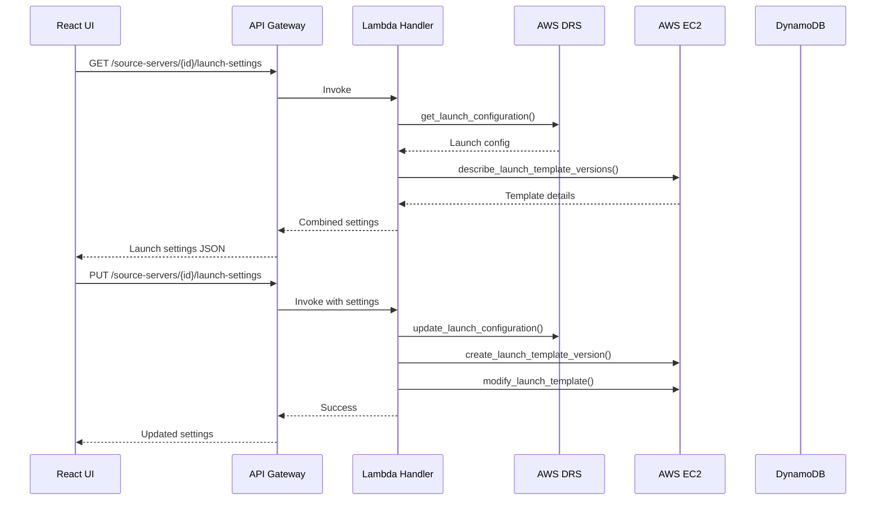
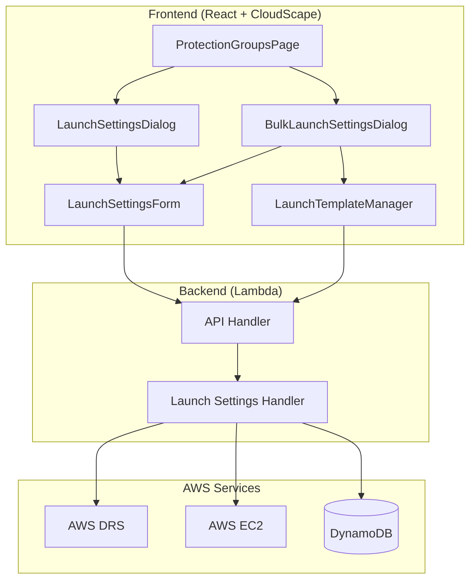

# DRS Launch Settings Management - Implementation Plan

## Executive Summary

This document outlines the implementation plan for integrating DRS Launch Settings management into the AWS DRS Orchestration UI. This feature will allow users to view and modify EC2 launch templates for DRS source servers directly from the web interface, eliminating the need for manual AWS Console navigation or CLI commands.

## Background

### Current State

Currently, DRS launch settings (instance type, networking, IAM profiles, etc.) must be configured through:
- AWS DRS Console (manual, one server at a time)
- AWS CLI (`aws drs update-launch-configuration`)
- Third-party tools like the archived `drs-template-manager` (Go-based S3/Lambda solution)

### Problem Statement

Organizations with many DRS source servers face challenges:
1. **Time-consuming**: Configuring launch settings individually is slow
2. **Error-prone**: Manual configuration leads to inconsistencies
3. **No bulk operations**: Native DRS tooling doesn't support batch updates
4. **Context switching**: Users must leave the orchestration UI to configure settings

### Solution

Integrate launch settings management directly into the DRS Orchestration UI with:
- Single-server configuration via modal dialog
- Bulk configuration using saved templates
- Template library for standardized configurations

## DRS Launch Settings Reference

### Available Settings

| Setting | DRS API Field | Type | Description |
|---------|---------------|------|-------------|
| Instance Type Right-Sizing | `targetInstanceTypeRightSizingMethod` | Enum | NONE, BASIC, IN_AWS |
| Launch Disposition | `launchDisposition` | Enum | STOPPED, STARTED |
| Copy Private IP | `copyPrivateIp` | Boolean | Preserve source private IP |
| Copy Tags | `copyTags` | Boolean | Copy source server tags |
| Licensing | `licensing.osByol` | Boolean | Bring your own license |
| EC2 Launch Template ID | `ec2LaunchTemplateID` | String | Associated EC2 template |

### EC2 Launch Template Settings

The EC2 launch template (referenced by `ec2LaunchTemplateID`) contains:

| Setting | Template Field | Type | Description |
|---------|----------------|------|-------------|
| Instance Type | `InstanceType` | String | t3.small, m5.large, etc. |
| Subnet | `NetworkInterfaces[0].SubnetId` | String | Target VPC subnet |
| Security Groups | `NetworkInterfaces[0].Groups` | Array | Security group IDs |
| IAM Instance Profile | `IamInstanceProfile.Name` | String | Instance profile name |
| EBS Volumes | `BlockDeviceMappings` | Array | Volume configurations |
| Tags | `TagSpecifications` | Array | Instance and volume tags |
| User Data | `UserData` | String | Base64-encoded startup script |

### Required AWS API Calls

```python
# DRS APIs
drs.get_launch_configuration(sourceServerID='s-xxx')
drs.update_launch_configuration(
    sourceServerID='s-xxx',
    targetInstanceTypeRightSizingMethod='BASIC',
    launchDisposition='STARTED',
    copyPrivateIp=True,
    copyTags=True,
    licensing={'osByol': False}
)

# EC2 APIs (for launch template details)
ec2.describe_launch_template_versions(
    LaunchTemplateId='lt-xxx',
    Versions=['$Latest']
)
ec2.create_launch_template_version(
    LaunchTemplateId='lt-xxx',
    LaunchTemplateData={...}
)
ec2.modify_launch_template(
    LaunchTemplateId='lt-xxx',
    DefaultVersion='$Latest'
)

# EC2 APIs (for dropdown options)
ec2.describe_subnets()
ec2.describe_security_groups()
ec2.describe_instance_types()
iam.list_instance_profiles()
```

## Architecture

### Data Flow



### Component Architecture



## Implementation Phases

### Phase 1: Backend API (Priority: High)

**Estimated Effort**: 2-3 days

#### New API Endpoints

| Method | Endpoint | Description |
|--------|----------|-------------|
| GET | `/source-servers/{id}/launch-settings` | Get launch config for a server |
| PUT | `/source-servers/{id}/launch-settings` | Update launch config |
| GET | `/protection-groups/{id}/launch-settings` | Get launch configs for all servers in group |
| PUT | `/protection-groups/{id}/launch-settings` | Bulk update launch configs |
| GET | `/launch-templates` | List saved launch setting templates |
| POST | `/launch-templates` | Save a launch template |
| PUT | `/launch-templates/{id}` | Update a saved template |
| DELETE | `/launch-templates/{id}` | Delete a saved template |
| GET | `/ec2/subnets` | List available subnets (for dropdown) |
| GET | `/ec2/security-groups` | List security groups (for dropdown) |
| GET | `/ec2/instance-types` | List instance types (for dropdown) |

#### Lambda Handler Functions

```python
# lambda/index.py additions

def get_server_launch_settings(server_id: str, region: str) -> Dict:
    """Get combined DRS launch config and EC2 template details"""
    drs_client = boto3.client('drs', region_name=region)
    ec2_client = boto3.client('ec2', region_name=region)
    
    # Get DRS launch configuration
    launch_config = drs_client.get_launch_configuration(
        sourceServerID=server_id
    )
    
    # Get EC2 launch template details
    template_id = launch_config.get('ec2LaunchTemplateID')
    if template_id:
        template_versions = ec2_client.describe_launch_template_versions(
            LaunchTemplateId=template_id,
            Versions=['$Latest']
        )
        template_data = template_versions['LaunchTemplateVersions'][0]['LaunchTemplateData']
    else:
        template_data = {}
    
    return {
        'sourceServerId': server_id,
        'drsConfig': {
            'targetInstanceTypeRightSizingMethod': launch_config.get('targetInstanceTypeRightSizingMethod'),
            'launchDisposition': launch_config.get('launchDisposition'),
            'copyPrivateIp': launch_config.get('copyPrivateIp'),
            'copyTags': launch_config.get('copyTags'),
            'licensing': launch_config.get('licensing', {})
        },
        'ec2Template': {
            'templateId': template_id,
            'instanceType': template_data.get('InstanceType'),
            'subnetId': get_subnet_from_template(template_data),
            'securityGroupIds': get_security_groups_from_template(template_data),
            'iamInstanceProfile': template_data.get('IamInstanceProfile', {}).get('Name'),
            'ebsOptimized': template_data.get('EbsOptimized'),
            'blockDeviceMappings': template_data.get('BlockDeviceMappings', [])
        }
    }

def update_server_launch_settings(server_id: str, region: str, settings: Dict) -> Dict:
    """Update DRS launch config and EC2 template"""
    drs_client = boto3.client('drs', region_name=region)
    ec2_client = boto3.client('ec2', region_name=region)
    
    # Update DRS launch configuration
    drs_config = settings.get('drsConfig', {})
    drs_client.update_launch_configuration(
        sourceServerID=server_id,
        targetInstanceTypeRightSizingMethod=drs_config.get('targetInstanceTypeRightSizingMethod'),
        launchDisposition=drs_config.get('launchDisposition'),
        copyPrivateIp=drs_config.get('copyPrivateIp'),
        copyTags=drs_config.get('copyTags'),
        licensing=drs_config.get('licensing', {})
    )
    
    # Update EC2 launch template if template settings provided
    ec2_template = settings.get('ec2Template', {})
    template_id = ec2_template.get('templateId')
    if template_id and ec2_template:
        template_data = build_template_data(ec2_template)
        ec2_client.create_launch_template_version(
            LaunchTemplateId=template_id,
            LaunchTemplateData=template_data
        )
        ec2_client.modify_launch_template(
            LaunchTemplateId=template_id,
            DefaultVersion='$Latest'
        )
    
    return get_server_launch_settings(server_id, region)
```

#### IAM Permissions Required

Add to Lambda execution role in `cfn/lambda-stack.yaml`:

```yaml
- Effect: Allow
  Action:
    - drs:GetLaunchConfiguration
    - drs:UpdateLaunchConfiguration
  Resource: '*'

- Effect: Allow
  Action:
    - ec2:DescribeLaunchTemplates
    - ec2:DescribeLaunchTemplateVersions
    - ec2:CreateLaunchTemplateVersion
    - ec2:ModifyLaunchTemplate
    - ec2:DescribeSubnets
    - ec2:DescribeSecurityGroups
    - ec2:DescribeInstanceTypes
    - ec2:DescribeVpcs
  Resource: '*'

- Effect: Allow
  Action:
    - iam:ListInstanceProfiles
  Resource: '*'
```

### Phase 2: Frontend Components (Priority: High)

**Estimated Effort**: 3-4 days

#### New Components

##### 1. LaunchSettingsDialog.tsx

Modal dialog for editing single server launch settings.

```typescript
// frontend/src/components/LaunchSettingsDialog.tsx

interface LaunchSettingsDialogProps {
  visible: boolean;
  onDismiss: () => void;
  server: SourceServer;
  region: string;
  onSave: (settings: LaunchSettings) => Promise<void>;
}

export const LaunchSettingsDialog: React.FC<LaunchSettingsDialogProps> = ({
  visible,
  onDismiss,
  server,
  region,
  onSave
}) => {
  const [settings, setSettings] = useState<LaunchSettings | null>(null);
  const [loading, setLoading] = useState(true);
  const [saving, setSaving] = useState(false);

  useEffect(() => {
    if (visible && server) {
      loadSettings();
    }
  }, [visible, server]);

  const loadSettings = async () => {
    setLoading(true);
    try {
      const response = await api.get(`/source-servers/${server.sourceServerID}/launch-settings?region=${region}`);
      setSettings(response.data);
    } catch (error) {
      console.error('Failed to load launch settings:', error);
    } finally {
      setLoading(false);
    }
  };

  return (
    <Modal
      visible={visible}
      onDismiss={onDismiss}
      header={`Launch Settings: ${server.hostname}`}
      size="large"
      footer={
        <Box float="right">
          <SpaceBetween direction="horizontal" size="xs">
            <Button onClick={onDismiss}>Cancel</Button>
            <Button variant="primary" onClick={handleSave} loading={saving}>
              Save Changes
            </Button>
          </SpaceBetween>
        </Box>
      }
    >
      {loading ? (
        <Spinner size="large" />
      ) : (
        <LaunchSettingsForm
          settings={settings}
          onChange={setSettings}
          region={region}
        />
      )}
    </Modal>
  );
};
```

##### 2. LaunchSettingsForm.tsx

Reusable form component with all launch setting fields.

```typescript
// frontend/src/components/LaunchSettingsForm.tsx

interface LaunchSettingsFormProps {
  settings: LaunchSettings;
  onChange: (settings: LaunchSettings) => void;
  region: string;
  readOnly?: boolean;
}

export const LaunchSettingsForm: React.FC<LaunchSettingsFormProps> = ({
  settings,
  onChange,
  region,
  readOnly = false
}) => {
  const [subnets, setSubnets] = useState<SelectOption[]>([]);
  const [securityGroups, setSecurityGroups] = useState<SelectOption[]>([]);
  const [instanceTypes, setInstanceTypes] = useState<SelectOption[]>([]);
  const [instanceProfiles, setInstanceProfiles] = useState<SelectOption[]>([]);

  // Load dropdown options on mount
  useEffect(() => {
    loadDropdownOptions();
  }, [region]);

  return (
    <SpaceBetween direction="vertical" size="l">
      {/* DRS Configuration Section */}
      <Container header={<Header variant="h3">DRS Configuration</Header>}>
        <ColumnLayout columns={2}>
          <FormField label="Instance Type Right-Sizing">
            <RadioGroup
              value={settings.drsConfig.targetInstanceTypeRightSizingMethod}
              onChange={({ detail }) => updateDrsConfig('targetInstanceTypeRightSizingMethod', detail.value)}
              items={[
                { value: 'NONE', label: 'None - Use source instance type' },
                { value: 'BASIC', label: 'Basic - AWS recommends instance type' },
                { value: 'IN_AWS', label: 'In AWS - Match existing AWS instance' }
              ]}
            />
          </FormField>

          <FormField label="Launch Disposition">
            <RadioGroup
              value={settings.drsConfig.launchDisposition}
              onChange={({ detail }) => updateDrsConfig('launchDisposition', detail.value)}
              items={[
                { value: 'STARTED', label: 'Started - Instance starts automatically' },
                { value: 'STOPPED', label: 'Stopped - Instance remains stopped' }
              ]}
            />
          </FormField>

          <FormField label="Copy Options">
            <SpaceBetween direction="vertical" size="xs">
              <Checkbox
                checked={settings.drsConfig.copyPrivateIp}
                onChange={({ detail }) => updateDrsConfig('copyPrivateIp', detail.checked)}
              >
                Copy Private IP Address
              </Checkbox>
              <Checkbox
                checked={settings.drsConfig.copyTags}
                onChange={({ detail }) => updateDrsConfig('copyTags', detail.checked)}
              >
                Copy Tags from Source Server
              </Checkbox>
            </SpaceBetween>
          </FormField>

          <FormField label="Licensing">
            <Checkbox
              checked={settings.drsConfig.licensing?.osByol}
              onChange={({ detail }) => updateDrsConfig('licensing', { osByol: detail.checked })}
            >
              Bring Your Own License (BYOL)
            </Checkbox>
          </FormField>
        </ColumnLayout>
      </Container>

      {/* EC2 Template Section */}
      <Container header={<Header variant="h3">EC2 Launch Template</Header>}>
        <ColumnLayout columns={2}>
          <FormField label="Instance Type">
            <Select
              selectedOption={instanceTypes.find(t => t.value === settings.ec2Template.instanceType)}
              onChange={({ detail }) => updateEc2Template('instanceType', detail.selectedOption?.value)}
              options={instanceTypes}
              filteringType="auto"
              placeholder="Select instance type"
            />
          </FormField>

          <FormField label="Target Subnet">
            <Select
              selectedOption={subnets.find(s => s.value === settings.ec2Template.subnetId)}
              onChange={({ detail }) => updateEc2Template('subnetId', detail.selectedOption?.value)}
              options={subnets}
              filteringType="auto"
              placeholder="Select subnet"
            />
          </FormField>

          <FormField label="Security Groups">
            <Multiselect
              selectedOptions={securityGroups.filter(sg => 
                settings.ec2Template.securityGroupIds?.includes(sg.value)
              )}
              onChange={({ detail }) => updateEc2Template(
                'securityGroupIds', 
                detail.selectedOptions.map(o => o.value)
              )}
              options={securityGroups}
              filteringType="auto"
              placeholder="Select security groups"
            />
          </FormField>

          <FormField label="IAM Instance Profile">
            <Select
              selectedOption={instanceProfiles.find(p => p.value === settings.ec2Template.iamInstanceProfile)}
              onChange={({ detail }) => updateEc2Template('iamInstanceProfile', detail.selectedOption?.value)}
              options={instanceProfiles}
              filteringType="auto"
              placeholder="Select instance profile"
            />
          </FormField>
        </ColumnLayout>
      </Container>
    </SpaceBetween>
  );
};
```

##### 3. BulkLaunchSettingsDialog.tsx

Dialog for applying settings to multiple servers.

```typescript
// frontend/src/components/BulkLaunchSettingsDialog.tsx

interface BulkLaunchSettingsDialogProps {
  visible: boolean;
  onDismiss: () => void;
  servers: SourceServer[];
  protectionGroupId: string;
  region: string;
  onApply: (templateId: string) => Promise<void>;
}
```

#### Integration Points

1. **ProtectionGroupsPage.tsx**: Add "Configure Launch Settings" action button per server row
2. **ServerListItem.tsx**: Add launch settings icon/button
3. **New route**: `/launch-templates` for template management page

#### TypeScript Types

```typescript
// frontend/src/types/index.ts additions

export interface LaunchSettings {
  sourceServerId: string;
  drsConfig: DrsLaunchConfig;
  ec2Template: Ec2TemplateConfig;
}

export interface DrsLaunchConfig {
  targetInstanceTypeRightSizingMethod: 'NONE' | 'BASIC' | 'IN_AWS';
  launchDisposition: 'STOPPED' | 'STARTED';
  copyPrivateIp: boolean;
  copyTags: boolean;
  licensing: {
    osByol: boolean;
  };
}

export interface Ec2TemplateConfig {
  templateId: string;
  instanceType: string;
  subnetId: string;
  securityGroupIds: string[];
  iamInstanceProfile: string;
  ebsOptimized: boolean;
  blockDeviceMappings: BlockDeviceMapping[];
}

export interface LaunchSettingsTemplate {
  templateId: string;
  name: string;
  description: string;
  settings: Omit<LaunchSettings, 'sourceServerId'>;
  createdBy: string;
  createdAt: string;
  updatedAt: string;
}
```

### Phase 3: Template Management (Priority: Medium)

**Estimated Effort**: 2 days

#### DynamoDB Table Schema

Option A: New table `launch-templates-{env}`

```yaml
# cfn/database-stack.yaml addition

LaunchTemplatesTable:
  Type: AWS::DynamoDB::Table
  Properties:
    TableName: !Sub 'launch-templates-${Environment}'
    BillingMode: PAY_PER_REQUEST
    AttributeDefinitions:
      - AttributeName: TemplateId
        AttributeType: S
    KeySchema:
      - AttributeName: TemplateId
        KeyType: HASH
    PointInTimeRecoverySpecification:
      PointInTimeRecoveryEnabled: true
    SSESpecification:
      SSEEnabled: true
```

Option B: Store in existing protection-groups table with `Type: LAUNCH_TEMPLATE`

#### Template Data Model

```json
{
  "TemplateId": "lt-uuid-xxx",
  "Name": "Production Web Servers",
  "Description": "Standard configuration for web tier servers",
  "Settings": {
    "drsConfig": {
      "targetInstanceTypeRightSizingMethod": "BASIC",
      "launchDisposition": "STARTED",
      "copyPrivateIp": true,
      "copyTags": true,
      "licensing": { "osByol": false }
    },
    "ec2Template": {
      "instanceType": "t3.medium",
      "securityGroupIds": ["sg-web-tier"],
      "iamInstanceProfile": "WebServerRole"
    }
  },
  "CreatedBy": "admin@example.com",
  "CreatedAt": "2024-01-01T00:00:00Z",
  "UpdatedAt": "2024-01-15T12:00:00Z"
}
```

#### Template Management UI

```typescript
// frontend/src/pages/LaunchTemplatesPage.tsx

// Features:
// - List all saved templates in a table
// - Create new template from scratch or from existing server
// - Edit template settings
// - Delete templates
// - Apply template to selected servers
```

## UI Mockups

### Launch Settings Dialog

```
┌─────────────────────────────────────────────────────────────────────┐
│ Launch Settings: web-server-01                               [X]    │
├─────────────────────────────────────────────────────────────────────┤
│                                                                     │
│ ┌─ DRS Configuration ─────────────────────────────────────────────┐ │
│ │                                                                 │ │
│ │ Instance Type Right-Sizing                                      │ │
│ │ ○ None - Use source instance type                               │ │
│ │ ● Basic - AWS recommends instance type                          │ │
│ │ ○ In AWS - Match existing AWS instance                          │ │
│ │                                                                 │ │
│ │ Launch Disposition                                              │ │
│ │ ● Started - Instance starts automatically                       │ │
│ │ ○ Stopped - Instance remains stopped                            │ │
│ │                                                                 │ │
│ │ Copy Options                                                    │ │
│ │ [✓] Copy Private IP Address                                     │ │
│ │ [✓] Copy Tags from Source Server                                │ │
│ │                                                                 │ │
│ │ Licensing                                                       │ │
│ │ [ ] Bring Your Own License (BYOL)                               │ │
│ │                                                                 │ │
│ └─────────────────────────────────────────────────────────────────┘ │
│                                                                     │
│ ┌─ EC2 Launch Template ───────────────────────────────────────────┐ │
│ │                                                                 │ │
│ │ Instance Type          Target Subnet                            │ │
│ │ [t3.medium         ▼]  [subnet-abc123 (10.0.1.0/24)        ▼]  │ │
│ │                                                                 │ │
│ │ Security Groups                                                 │ │
│ │ [sg-web-tier, sg-default                                   ▼]  │ │
│ │                                                                 │ │
│ │ IAM Instance Profile                                            │ │
│ │ [AWSElasticDisasterRecoveryRecoveryInstanceRole            ▼]  │ │
│ │                                                                 │ │
│ └─────────────────────────────────────────────────────────────────┘ │
│                                                                     │
│ ┌─ Template Actions ──────────────────────────────────────────────┐ │
│ │ [Load from Template ▼]        [Save as New Template]            │ │
│ └─────────────────────────────────────────────────────────────────┘ │
│                                                                     │
│                                        [Cancel]  [Save Changes]     │
└─────────────────────────────────────────────────────────────────────┘
```

### Protection Groups Page with Launch Settings

```
┌─────────────────────────────────────────────────────────────────────┐
│ Protection Groups                                                   │
├─────────────────────────────────────────────────────────────────────┤
│ [Create Protection Group]  [Bulk Configure Launch Settings ▼]      │
├─────────────────────────────────────────────────────────────────────┤
│                                                                     │
│ ▼ Web Servers (us-east-1) - 3 servers                              │
│ ┌──────┬──────────────────┬────────────┬─────────────┬────────────┐│
│ │  ☐   │ Server Name      │ Status     │ Instance    │ Actions    ││
│ ├──────┼──────────────────┼────────────┼─────────────┼────────────┤│
│ │  ☐   │ web-server-01    │ ● Healthy  │ t3.medium   │ [⚙️] [🗑️] ││
│ │  ☐   │ web-server-02    │ ● Healthy  │ t3.medium   │ [⚙️] [🗑️] ││
│ │  ☐   │ web-server-03    │ ○ Stalled  │ t3.small    │ [⚙️] [🗑️] ││
│ └──────┴──────────────────┴────────────┴─────────────┴────────────┘│
│                                                                     │
│ ▼ Database Servers (us-east-1) - 2 servers                         │
│ ┌──────┬──────────────────┬────────────┬─────────────┬────────────┐│
│ │  ☐   │ Server Name      │ Status     │ Instance    │ Actions    ││
│ ├──────┼──────────────────┼────────────┼─────────────┼────────────┤│
│ │  ☐   │ db-primary       │ ● Healthy  │ r5.large    │ [⚙️] [🗑️] ││
│ │  ☐   │ db-replica       │ ● Healthy  │ r5.large    │ [⚙️] [🗑️] ││
│ └──────┴──────────────────┴────────────┴─────────────┴────────────┘│
│                                                                     │
└─────────────────────────────────────────────────────────────────────┘

Legend: [⚙️] = Launch Settings  [🗑️] = Remove from Group
```

## Implementation Timeline

| Week | Phase | Deliverables |
|------|-------|--------------|
| 1 | Phase 1 | Backend API endpoints, IAM permissions |
| 2 | Phase 2 | LaunchSettingsDialog, LaunchSettingsForm |
| 2 | Phase 2 | Integration with ProtectionGroupsPage |
| 3 | Phase 3 | Template management (optional) |
| 3 | Testing | E2E testing, documentation |

## Testing Strategy

### Unit Tests

```python
# tests/python/unit/test_launch_settings.py

def test_get_server_launch_settings():
    """Test retrieving launch settings for a server"""
    pass

def test_update_server_launch_settings():
    """Test updating launch settings"""
    pass

def test_bulk_update_launch_settings():
    """Test bulk update for protection group"""
    pass
```

### Integration Tests

```python
# tests/python/integration/test_launch_settings_api.py

def test_launch_settings_api_flow():
    """Test complete API flow: get -> update -> verify"""
    pass
```

### E2E Tests

```typescript
// tests/playwright/launch-settings.spec.ts

test('should open launch settings dialog', async ({ page }) => {
  // Navigate to protection groups
  // Click launch settings button
  // Verify dialog opens with correct data
});

test('should update launch settings', async ({ page }) => {
  // Open dialog
  // Modify settings
  // Save and verify
});
```

## Risk Assessment

| Risk | Impact | Mitigation |
|------|--------|------------|
| EC2 API rate limits | Medium | Implement caching for dropdown options |
| Launch template version limits | Low | AWS allows 5000 versions per template |
| Permission errors | High | Comprehensive IAM testing before release |
| UI complexity | Medium | Progressive disclosure, sensible defaults |

## Success Metrics

1. **Adoption**: 80% of users configure launch settings via UI vs CLI
2. **Time Savings**: 75% reduction in time to configure launch settings
3. **Error Reduction**: 90% reduction in misconfiguration incidents
4. **User Satisfaction**: Positive feedback in user surveys

## Advanced Features (From drs-configuration-synchronizer)

The archived `drs-configuration-synchronizer` solution provides additional patterns that could be incorporated:

### Tag-Based Configuration Overrides

Apply different settings based on DRS source server tags using override files:

```yaml
# Pattern: override_for_tag__{TagKey}__{TagValue}.yml

# Example: override_for_tag__tier__database.yml
drsConfig:
  targetInstanceTypeRightSizingMethod: NONE  # Keep exact instance type for DBs
  copyPrivateIp: true
ec2Template:
  instanceType: r5.xlarge
  securityGroupIds:
    - sg-database-tier
```

**Implementation**: Store override rules in DynamoDB, apply during bulk operations based on server tags.

### Automatic Subnet Assignment

Automatically assign target subnet based on source server private IP and VPC CIDR matching:

```python
def find_matching_subnet(source_ip: str, available_subnets: List[Dict]) -> Optional[str]:
    """
    Find subnet where source IP falls within CIDR block.
    
    Criteria:
    - VPC tagged with drstarget=true
    - Subnet tagged with drstarget=true
    - Source IP within subnet CIDR
    - IP not in AWS reserved range (first 4 + last 1)
    """
    import ipaddress
    source_addr = ipaddress.ip_address(source_ip)
    
    for subnet in available_subnets:
        network = ipaddress.ip_network(subnet['CidrBlock'])
        if source_addr in network:
            return subnet['SubnetId']
    return None
```

**Use Case**: On-premises to AWS DRS migrations where DR network mirrors source network topology.

### Replication Settings Management

Extend beyond launch settings to include replication configuration:

| Setting | API Field | Description |
|---------|-----------|-------------|
| Bandwidth Throttling | `bandwidthThrottling` | Limit replication bandwidth (Mbps) |
| Staging Area Subnet | `stagingAreaSubnetId` | Subnet for replication servers |
| EBS Encryption | `ebsEncryption` | DEFAULT, CUSTOM, or NONE |
| Encryption Key | `ebsEncryptionKeyArn` | KMS key for EBS encryption |
| Dedicated Replication Server | `useDedicatedReplicationServer` | Dedicated vs shared |

### Server Exclusion Lists

Allow excluding specific servers from bulk configuration operations:

```csv
# config-sync-exclusions.csv
Name,ExcludeAll,ExcludeNetworkConfiguration,ExcludeLaunchSettings
LEGACY-SERVER-01,true,,
SPECIAL-CONFIG-02,false,true,false
```

### Configuration Sync Reports

Generate inventory reports after bulk operations:

| Field | Description |
|-------|-------------|
| AwsAccountId | Target account |
| SourceServerId | DRS source server ID |
| Hostname | Server hostname |
| CopyPrivateIp | Current setting |
| LaunchTemplateSubnet | Configured subnet |
| LaunchTemplateSecurityGroups | Configured SGs |
| SyncStatus | SUCCESS/FAILED/SKIPPED |

**Delivery**: Upload to S3 bucket and/or send via SNS notification.

## References

### AWS Documentation
- [AWS DRS Launch Settings Documentation](https://docs.aws.amazon.com/drs/latest/userguide/ec2-launch.html)
- [EC2 Launch Templates](https://docs.aws.amazon.com/AWSEC2/latest/UserGuide/ec2-launch-templates.html)
- [DRS Replication Settings](https://docs.aws.amazon.com/drs/latest/userguide/replication-settings.html)

### Archive Reference Implementations
- [drs-template-manager](archive/drs-tools/drs-template-manager/README.md) - S3-triggered batch template updates (Go/Lambda)
- [drs-configuration-synchronizer](archive/drs-tools/drs-configuration-synchronizer/README.md) - Comprehensive config-as-code with tag overrides, auto-subnet assignment, replication settings (Python/SAM)
- [drs-synch-ec2-tags-and-instance-type](archive/drs-tools/drs-synch-ec2-tags-and-instance-type/README.md) - Tag and instance type sync (Python/Lambda)

### Design Resources
- [CloudScape Form Patterns](https://cloudscape.design/patterns/general/forms/)
