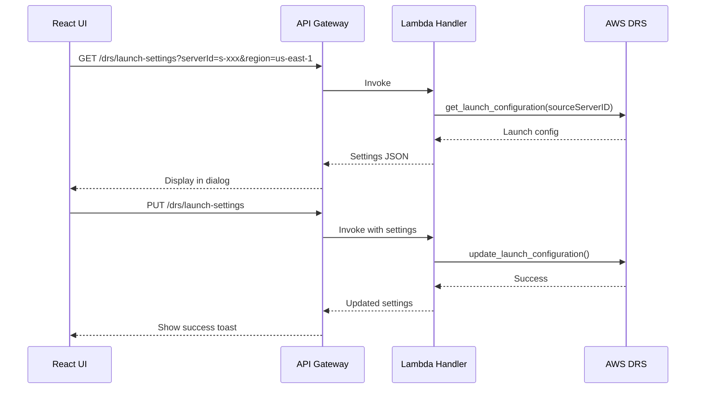

# DRS Launch Settings MVP - Implementation Plan

**Version:** 1.0  
**Date:** December 2025  
**Status:** Ready for Implementation  
**Estimated Effort:** 5-7 days

---

## Executive Summary

MVP implementation of DRS Launch Settings management with single-server configuration dialog. This focused scope delivers immediate value while deferring EC2 template editing and template library to future phases.

### MVP Scope

| Included | Excluded (Future) |
|----------|-------------------|
| Single-server launch settings dialog | EC2 launch template editing |
| DRS configuration read/update | Bulk operations |
| Integration with Protection Groups page | Template library |
| Basic validation | Advanced features from archived tool |

### Business Value

- **Eliminate context switching**: Configure DRS settings without leaving the UI
- **Faster configuration**: Direct access vs navigating AWS Console
- **Visibility**: See current settings at a glance

---

## DRS Launch Configuration Settings

### Available Settings (MVP Scope)

| Setting | API Field | Type | Options |
|---------|-----------|------|---------|
| Right-Sizing | `targetInstanceTypeRightSizingMethod` | Enum | NONE, BASIC, IN_AWS |
| Launch Disposition | `launchDisposition` | Enum | STOPPED, STARTED |
| Copy Private IP | `copyPrivateIp` | Boolean | true/false |
| Copy Tags | `copyTags` | Boolean | true/false |
| BYOL Licensing | `licensing.osByol` | Boolean | true/false |

### AWS API Calls

```python
# Read launch configuration
drs.get_launch_configuration(sourceServerID='s-xxx')

# Update launch configuration
drs.update_launch_configuration(
    sourceServerID='s-xxx',
    targetInstanceTypeRightSizingMethod='BASIC',
    launchDisposition='STARTED',
    copyPrivateIp=True,
    copyTags=True,
    licensing={'osByol': False}
)
```

---

## Architecture

### Data Flow



---

## Implementation Plan

### Day 1-2: Backend API

#### New API Endpoints

| Method | Endpoint | Description |
|--------|----------|-------------|
| GET | `/drs/launch-settings` | Get launch config for a server |
| PUT | `/drs/launch-settings` | Update launch config |


#### Lambda Handler Implementation

Add to `lambda/index.py`:

```python
def get_launch_settings(event: Dict) -> Dict:
    """Get DRS launch configuration for a source server."""
    import logging
    logger = logging.getLogger()
    
    params = event.get('queryStringParameters', {})
    server_id = params.get('serverId')
    region = params.get('region', 'us-east-1')
    
    if not server_id:
        return response(400, {'error': 'serverId is required'})
    
    # Validate region has DRS support
    if region not in ['us-east-1', 'us-west-2', 'eu-west-1', 'ap-southeast-2']:  # Add all DRS regions
        return response(400, {'error': f'DRS not supported in region {region}'})
    
    try:
        drs_client = boto3.client('drs', region_name=region)
        launch_config = drs_client.get_launch_configuration(
            sourceServerID=server_id
        )
        
        return response(200, {
            'sourceServerId': server_id,
            'region': region,
            'targetInstanceTypeRightSizingMethod': launch_config.get('targetInstanceTypeRightSizingMethod', 'NONE'),
            'launchDisposition': launch_config.get('launchDisposition', 'STOPPED'),
            'copyPrivateIp': launch_config.get('copyPrivateIp', False),
            'copyTags': launch_config.get('copyTags', False),
            'licensing': launch_config.get('licensing', {'osByol': False}),
            'ec2LaunchTemplateID': launch_config.get('ec2LaunchTemplateID'),
            'name': launch_config.get('name', '')
        })
    except drs_client.exceptions.ResourceNotFoundException:
        return response(404, {'error': f'Source server {server_id} not found'})
    except Exception as e:
        logger.error(f'Error getting launch settings: {str(e)}')
        return response(500, {'error': str(e)})


def update_launch_settings(event: Dict) -> Dict:
    """Update DRS launch configuration for a source server."""
    import logging
    logger = logging.getLogger()
    
    try:
        body = json.loads(event.get('body', '{}'))
    except json.JSONDecodeError:
        return response(400, {'error': 'Invalid JSON body'})
    
    server_id = body.get('sourceServerId')
    region = body.get('region', 'us-east-1')
    
    if not server_id:
        return response(400, {'error': 'sourceServerId is required'})
    
    # Validate enum values
    valid_right_sizing = ['NONE', 'BASIC', 'IN_AWS']
    valid_disposition = ['STOPPED', 'STARTED']
    
    if 'targetInstanceTypeRightSizingMethod' in body:
        if body['targetInstanceTypeRightSizingMethod'] not in valid_right_sizing:
            return response(400, {'error': 'Invalid targetInstanceTypeRightSizingMethod'})
    
    if 'launchDisposition' in body:
        if body['launchDisposition'] not in valid_disposition:
            return response(400, {'error': 'Invalid launchDisposition'})
    
    try:
        drs_client = boto3.client('drs', region_name=region)
        
        # Validate enum values
        valid_right_sizing = ['NONE', 'BASIC', 'IN_AWS']
        valid_disposition = ['STOPPED', 'STARTED']
        
        if 'targetInstanceTypeRightSizingMethod' in body:
            if body['targetInstanceTypeRightSizingMethod'] not in valid_right_sizing:
                return response(400, {'error': 'Invalid targetInstanceTypeRightSizingMethod'})
        
        if 'launchDisposition' in body:
            if body['launchDisposition'] not in valid_disposition:
                return response(400, {'error': 'Invalid launchDisposition'})
        
        # Build update params (only include provided fields)
        update_params = {'sourceServerID': server_id}
        
        if 'targetInstanceTypeRightSizingMethod' in body:
            update_params['targetInstanceTypeRightSizingMethod'] = body['targetInstanceTypeRightSizingMethod']
        if 'launchDisposition' in body:
            update_params['launchDisposition'] = body['launchDisposition']
        if 'copyPrivateIp' in body:
            update_params['copyPrivateIp'] = body['copyPrivateIp']
        if 'copyTags' in body:
            update_params['copyTags'] = body['copyTags']
        if 'licensing' in body:
            update_params['licensing'] = body['licensing']
        
        result = drs_client.update_launch_configuration(**update_params)
        
        return response(200, {
            'sourceServerId': server_id,
            'region': region,
            'targetInstanceTypeRightSizingMethod': result.get('targetInstanceTypeRightSizingMethod'),
            'launchDisposition': result.get('launchDisposition'),
            'copyPrivateIp': result.get('copyPrivateIp'),
            'copyTags': result.get('copyTags'),
            'licensing': result.get('licensing', {}),
            'message': 'Launch settings updated successfully'
        })
    except drs_client.exceptions.ResourceNotFoundException:
        return response(404, {'error': f'Source server {server_id} not found'})
    except drs_client.exceptions.ValidationException as e:
        return response(400, {'error': f'Validation error: {str(e)}'})
    except Exception as e:
        logger.error(f'Error updating launch settings: {str(e)}')
        return response(500, {'error': str(e)})
```

#### Route Handler Update

Add to route handling in `lambda/index.py`:

```python
# In handler function
elif path == '/drs/launch-settings':
    if method == 'GET':
        return get_launch_settings(event)
    elif method == 'PUT':
        return update_launch_settings(event)
```

#### IAM Permissions

Add to `cfn/lambda-stack.yaml` OrchestrationRole:

```yaml
- Effect: Allow
  Action:
    - drs:GetLaunchConfiguration
    - drs:UpdateLaunchConfiguration
  Resource: '*'
```

#### API Gateway Configuration

Add to `cfn/api-stack.yaml`:

```yaml
# Ensure DRSResource exists (add if missing)
DRSResource:
  Type: AWS::ApiGateway::Resource
  Properties:
    RestApiId: !Ref ApiGateway
    ParentId: !Ref ApiGatewayRootResource
    PathPart: drs

# /drs/launch-settings resource
DRSLaunchSettingsResource:
  Type: AWS::ApiGateway::Resource
  Properties:
    RestApiId: !Ref ApiGateway
    ParentId: !Ref DRSResource
    PathPart: launch-settings

DRSLaunchSettingsGetMethod:
  Type: AWS::ApiGateway::Method
  Properties:
    RestApiId: !Ref ApiGateway
    ResourceId: !Ref DRSLaunchSettingsResource
    HttpMethod: GET
    AuthorizationType: COGNITO_USER_POOLS
    AuthorizerId: !Ref CognitoAuthorizer
    Integration:
      Type: AWS_PROXY
      IntegrationHttpMethod: POST
      Uri: !Sub 'arn:aws:apigateway:${AWS::Region}:lambda:path/2015-03-31/functions/${ApiHandlerFunction.Arn}/invocations'

DRSLaunchSettingsPutMethod:
  Type: AWS::ApiGateway::Method
  Properties:
    RestApiId: !Ref ApiGateway
    ResourceId: !Ref DRSLaunchSettingsResource
    HttpMethod: PUT
    AuthorizationType: COGNITO_USER_POOLS
    AuthorizerId: !Ref CognitoAuthorizer
    Integration:
      Type: AWS_PROXY
      IntegrationHttpMethod: POST
      Uri: !Sub 'arn:aws:apigateway:${AWS::Region}:lambda:path/2015-03-31/functions/${ApiHandlerFunction.Arn}/invocations'

DRSLaunchSettingsOptionsMethod:
  Type: AWS::ApiGateway::Method
  Properties:
    RestApiId: !Ref ApiGateway
    ResourceId: !Ref DRSLaunchSettingsResource
    HttpMethod: OPTIONS
    AuthorizationType: NONE
    Integration:
      Type: MOCK
      IntegrationResponses:
        - StatusCode: 200
          ResponseParameters:
            method.response.header.Access-Control-Allow-Headers: "'Content-Type,Authorization'"
            method.response.header.Access-Control-Allow-Methods: "'GET,PUT,OPTIONS'"
            method.response.header.Access-Control-Allow-Origin: "'*'"
          ResponseTemplates:
            application/json: ''
      RequestTemplates:
        application/json: '{"statusCode": 200}'
    MethodResponses:
      - StatusCode: 200
        ResponseParameters:
          method.response.header.Access-Control-Allow-Headers: true
          method.response.header.Access-Control-Allow-Methods: true
          method.response.header.Access-Control-Allow-Origin: true
```

---

### Day 3-4: Frontend Components

#### TypeScript Types

Add to `frontend/src/types/index.ts`:

```typescript
export interface LaunchSettings {
  sourceServerId: string;
  region: string;
  targetInstanceTypeRightSizingMethod: 'NONE' | 'BASIC' | 'IN_AWS';
  launchDisposition: 'STOPPED' | 'STARTED';
  copyPrivateIp: boolean;
  copyTags: boolean;
  licensing: {
    osByol: boolean;
  };
  ec2LaunchTemplateID?: string;
  name?: string;
}
```

#### API Service

Add to `frontend/src/services/api.ts`:

```typescript
export const getLaunchSettings = async (
  serverId: string,
  region: string
): Promise<LaunchSettings> => {
  const response = await apiClient.get('/drs/launch-settings', {
    params: { serverId, region }
  });
  return response.data;
};

export const updateLaunchSettings = async (
  settings: Partial<LaunchSettings> & { sourceServerId: string; region: string }
): Promise<LaunchSettings> => {
  const response = await apiClient.put('/drs/launch-settings', settings);
  return response.data;
};
```

#### LaunchSettingsDialog Component

Create `frontend/src/components/LaunchSettingsDialog.tsx`:

```typescript
import React, { useState, useEffect } from 'react';
import {
  Modal,
  Box,
  SpaceBetween,
  Button,
  FormField,
  RadioGroup,
  Checkbox,
  Spinner,
  Alert,
  Container,
  Header,
  ColumnLayout
} from '@cloudscape-design/components';
import { LaunchSettings } from '../types';
import { getLaunchSettings, updateLaunchSettings } from '../services/api';
import { useNotifications } from '../hooks/useNotifications';

interface LaunchSettingsDialogProps {
  visible: boolean;
  onDismiss: () => void;
  serverId: string;
  serverName: string;
  region: string;
}

export const LaunchSettingsDialog: React.FC<LaunchSettingsDialogProps> = ({
  visible,
  onDismiss,
  serverId,
  serverName,
  region
}) => {
  const [settings, setSettings] = useState<LaunchSettings | null>(null);
  const [loading, setLoading] = useState(true);
  const [saving, setSaving] = useState(false);
  const [error, setError] = useState<string | null>(null);
  const { addNotification } = useNotifications();

  useEffect(() => {
    if (visible && serverId) {
      loadSettings();
    }
  }, [visible, serverId, region]);

  const loadSettings = async () => {
    setLoading(true);
    setError(null);
    try {
      const data = await getLaunchSettings(serverId, region);
      setSettings(data);
    } catch (err: any) {
      setError(err.response?.data?.error || 'Failed to load launch settings');
    } finally {
      setLoading(false);
    }
  };

  const handleSave = async () => {
    if (!settings) return;
    
    // Show confirmation for significant changes
    const hasSignificantChanges = 
      settings.targetInstanceTypeRightSizingMethod !== 'NONE' ||
      settings.launchDisposition === 'STARTED';
    
    if (hasSignificantChanges) {
      const confirmed = window.confirm(
        'These settings will affect how recovery instances are launched. Continue?'
      );
      if (!confirmed) return;
    }
    
    setSaving(true);
    try {
      await updateLaunchSettings({
        sourceServerId: serverId,
        region,
        targetInstanceTypeRightSizingMethod: settings.targetInstanceTypeRightSizingMethod,
        launchDisposition: settings.launchDisposition,
        copyPrivateIp: settings.copyPrivateIp,
        copyTags: settings.copyTags,
        licensing: settings.licensing
      });
      addNotification({
        type: 'success',
        content: 'Launch settings updated successfully'
      });
      onDismiss();
    } catch (err: any) {
      addNotification({
        type: 'error',
        content: err.response?.data?.error || 'Failed to update launch settings'
      });
    } finally {
      setSaving(false);
    }
  };

  const updateSetting = <K extends keyof LaunchSettings>(
    key: K,
    value: LaunchSettings[K]
  ) => {
    if (settings) {
      setSettings({ ...settings, [key]: value });
    }
  };

  return (
    <Modal
      visible={visible}
      onDismiss={onDismiss}
      header={`Launch Settings: ${serverName}`}
      size="medium"
      footer={
        <Box float="right">
          <SpaceBetween direction="horizontal" size="xs">
            <Button onClick={onDismiss} disabled={saving}>
              Cancel
            </Button>
            <Button
              variant="primary"
              onClick={handleSave}
              loading={saving}
              disabled={loading || !!error}
            >
              Save Changes
            </Button>
          </SpaceBetween>
        </Box>
      }
    >
      {loading ? (
        <Box textAlign="center" padding="xxl">
          <Spinner size="large" />
        </Box>
      ) : error ? (
        <Alert type="error" header="Error loading settings">
          {error}
        </Alert>
      ) : settings ? (
        <SpaceBetween direction="vertical" size="l">
          <Container 
            header={<Header variant="h3">Recovery Instance Configuration</Header>}
            loading={loading}
          >
            <SpaceBetween direction="vertical" size="m">
              <FormField
                label="Instance Type Right-Sizing"
                description="How AWS DRS determines the recovery instance type"
              >
                <RadioGroup
                  value={settings.targetInstanceTypeRightSizingMethod}
                  onChange={({ detail }) =>
                    updateSetting('targetInstanceTypeRightSizingMethod', detail.value as any)
                  }
                  items={[
                    {
                      value: 'NONE',
                      label: 'None',
                      description: 'Use the instance type from the EC2 launch template'
                    },
                    {
                      value: 'BASIC',
                      label: 'Basic',
                      description: 'AWS recommends an instance type based on source server specs'
                    },
                    {
                      value: 'IN_AWS',
                      label: 'In AWS',
                      description: 'Match an existing AWS instance with the same hostname'
                    }
                  ]}
                />
              </FormField>

              <FormField
                label="Launch Disposition"
                description="Whether the recovery instance starts automatically after launch"
              >
                <RadioGroup
                  value={settings.launchDisposition}
                  onChange={({ detail }) =>
                    updateSetting('launchDisposition', detail.value as any)
                  }
                  items={[
                    {
                      value: 'STARTED',
                      label: 'Started',
                      description: 'Instance starts automatically after launch'
                    },
                    {
                      value: 'STOPPED',
                      label: 'Stopped',
                      description: 'Instance remains stopped after launch'
                    }
                  ]}
                />
              </FormField>
            </SpaceBetween>
          </Container>

          <Container 
            header={<Header variant="h3">Copy Options</Header>}
            loading={loading}
          >
            <ColumnLayout columns={2}>
              <Checkbox
                checked={settings.copyPrivateIp}
                onChange={({ detail }) => updateSetting('copyPrivateIp', detail.checked)}
              >
                Copy Private IP Address
              </Checkbox>
              <Checkbox
                checked={settings.copyTags}
                onChange={({ detail }) => updateSetting('copyTags', detail.checked)}
              >
                Copy Tags from Source Server
              </Checkbox>
            </ColumnLayout>
          </Container>

          <Container 
            header={<Header variant="h3">Licensing</Header>}
            loading={loading}
          >
            <Checkbox
              checked={settings.licensing?.osByol || false}
              onChange={({ detail }) =>
                updateSetting('licensing', { osByol: detail.checked })
              }
            >
              Bring Your Own License (BYOL)
            </Checkbox>
          </Container>

          {settings.ec2LaunchTemplateID && (
            <Alert type="info">
              EC2 Launch Template: <code>{settings.ec2LaunchTemplateID}</code>
              <br />
              <small>Edit EC2 template settings in the AWS Console</small>
            </Alert>
          )}
        </SpaceBetween>
      ) : null}
    </Modal>
  );
};

export default LaunchSettingsDialog;
```


---

### Day 5: Integration with Protection Groups Page

#### Add Launch Settings Button to Server Table

Update `frontend/src/pages/ProtectionGroupsPage.tsx`:

```typescript
import { LaunchSettingsDialog } from '../components/LaunchSettingsDialog';
import { Icon } from '@cloudscape-design/components';

// Add state for dialog
const [launchSettingsServer, setLaunchSettingsServer] = useState<{
  serverId: string;
  serverName: string;
  region: string;
} | null>(null);

// Add to table column definitions
{
  id: 'actions',
  header: 'Actions',
  cell: (server) => (
    <SpaceBetween direction="horizontal" size="xs">
      <Button
        iconName="settings"
        variant="icon"
        ariaLabel="Launch settings"
        onClick={() => setLaunchSettingsServer({
          serverId: server.sourceServerID,
          serverName: server.hostname || server.sourceServerID,
          region: protectionGroup.region
        })}
      />
      <Button
        iconName="remove"
        variant="icon"
        ariaLabel="Remove from group"
        onClick={() => handleRemoveServer(server.sourceServerID)}
      />
    </SpaceBetween>
  ),
  width: 100
}

// Add dialog at end of component
<LaunchSettingsDialog
  visible={!!launchSettingsServer}
  onDismiss={() => setLaunchSettingsServer(null)}
  serverId={launchSettingsServer?.serverId || ''}
  serverName={launchSettingsServer?.serverName || ''}
  region={launchSettingsServer?.region || ''}
/>
```

#### Alternative: Add to Actions Dropdown

If using ButtonDropdown for actions:

```typescript
<ButtonDropdown
  items={[
    { id: 'launch-settings', text: 'Launch Settings', iconName: 'settings' },
    { id: 'remove', text: 'Remove from Group', iconName: 'remove' }
  ]}
  onItemClick={({ detail }) => {
    if (detail.id === 'launch-settings') {
      setLaunchSettingsServer({
        serverId: server.sourceServerID,
        serverName: server.hostname,
        region: protectionGroup.region
      });
    } else if (detail.id === 'remove') {
      handleRemoveServer(server.sourceServerID);
    }
  }}
>
  Actions
</ButtonDropdown>
```

---

### Day 6-7: Testing & Polish

#### Unit Tests

Create `tests/python/unit/test_launch_settings.py`:

```python
import pytest
from unittest.mock import Mock, patch
import json

# Import the handler functions
from lambda.index import get_launch_settings, update_launch_settings


class TestGetLaunchSettings:
    """Tests for get_launch_settings function."""

    @patch('lambda.index.boto3.client')
    def test_get_launch_settings_success(self, mock_boto_client):
        """Test successful retrieval of launch settings."""
        mock_drs = Mock()
        mock_boto_client.return_value = mock_drs
        mock_drs.get_launch_configuration.return_value = {
            'targetInstanceTypeRightSizingMethod': 'BASIC',
            'launchDisposition': 'STARTED',
            'copyPrivateIp': True,
            'copyTags': True,
            'licensing': {'osByol': False},
            'ec2LaunchTemplateID': 'lt-12345'
        }

        event = {
            'queryStringParameters': {
                'serverId': 's-12345',
                'region': 'us-east-1'
            }
        }

        result = get_launch_settings(event)
        body = json.loads(result['body'])

        assert result['statusCode'] == 200
        assert body['sourceServerId'] == 's-12345'
        assert body['targetInstanceTypeRightSizingMethod'] == 'BASIC'
        assert body['copyPrivateIp'] is True

    @patch('lambda.index.boto3.client')
    def test_get_launch_settings_missing_server_id(self, mock_boto_client):
        """Test error when serverId is missing."""
        event = {'queryStringParameters': {}}

        result = get_launch_settings(event)

        assert result['statusCode'] == 400
        assert 'serverId is required' in result['body']

    @patch('lambda.index.boto3.client')
    def test_get_launch_settings_server_not_found(self, mock_boto_client):
        """Test error when server doesn't exist."""
        mock_drs = Mock()
        mock_boto_client.return_value = mock_drs
        mock_drs.get_launch_configuration.side_effect = \
            mock_drs.exceptions.ResourceNotFoundException({}, 'GetLaunchConfiguration')

        event = {
            'queryStringParameters': {
                'serverId': 's-nonexistent',
                'region': 'us-east-1'
            }
        }

        result = get_launch_settings(event)

        assert result['statusCode'] == 404


class TestUpdateLaunchSettings:
    """Tests for update_launch_settings function."""

    @patch('lambda.index.boto3.client')
    def test_update_launch_settings_success(self, mock_boto_client):
        """Test successful update of launch settings."""
        mock_drs = Mock()
        mock_boto_client.return_value = mock_drs
        mock_drs.update_launch_configuration.return_value = {
            'targetInstanceTypeRightSizingMethod': 'NONE',
            'launchDisposition': 'STOPPED',
            'copyPrivateIp': False,
            'copyTags': True,
            'licensing': {'osByol': True}
        }

        event = {
            'body': json.dumps({
                'sourceServerId': 's-12345',
                'region': 'us-east-1',
                'targetInstanceTypeRightSizingMethod': 'NONE',
                'launchDisposition': 'STOPPED',
                'copyPrivateIp': False,
                'copyTags': True,
                'licensing': {'osByol': True}
            })
        }

        result = update_launch_settings(event)
        body = json.loads(result['body'])

        assert result['statusCode'] == 200
        assert body['targetInstanceTypeRightSizingMethod'] == 'NONE'
        assert body['licensing']['osByol'] is True

    @patch('lambda.index.boto3.client')
    def test_update_launch_settings_partial_update(self, mock_boto_client):
        """Test partial update with only some fields."""
        mock_drs = Mock()
        mock_boto_client.return_value = mock_drs
        mock_drs.update_launch_configuration.return_value = {
            'copyPrivateIp': True
        }

        event = {
            'body': json.dumps({
                'sourceServerId': 's-12345',
                'region': 'us-east-1',
                'copyPrivateIp': True
            })
        }

        result = update_launch_settings(event)

        assert result['statusCode'] == 200
        # Verify only copyPrivateIp was passed to API
        call_args = mock_drs.update_launch_configuration.call_args
        assert 'copyPrivateIp' in call_args.kwargs
        assert 'launchDisposition' not in call_args.kwargs
```

#### Frontend Component Test

Create `frontend/src/components/__tests__/LaunchSettingsDialog.test.tsx`:

```typescript
import { render, screen, waitFor } from '@testing-library/react';
import userEvent from '@testing-library/user-event';
import { LaunchSettingsDialog } from '../LaunchSettingsDialog';
import * as api from '../../services/api';
import { vi } from 'vitest';

vi.mock('../../services/api');

describe('LaunchSettingsDialog', () => {
  const mockSettings = {
    sourceServerId: 's-12345',
    region: 'us-east-1',
    targetInstanceTypeRightSizingMethod: 'BASIC' as const,
    launchDisposition: 'STARTED' as const,
    copyPrivateIp: true,
    copyTags: true,
    licensing: { osByol: false }
  };

  beforeEach(() => {
    vi.mocked(api.getLaunchSettings).mockResolvedValue(mockSettings);
  });

  it('loads and displays launch settings', async () => {
    render(
      <LaunchSettingsDialog
        visible={true}
        onDismiss={() => {}}
        serverId="s-12345"
        serverName="web-server-01"
        region="us-east-1"
      />
    );

    await waitFor(() => {
      expect(screen.getByText('Launch Settings: web-server-01')).toBeInTheDocument();
    });

    expect(screen.getByLabelText(/Basic/)).toBeChecked();
    expect(screen.getByLabelText(/Copy Private IP/)).toBeChecked();
  });

  it('saves updated settings', async () => {
    vi.mocked(api.updateLaunchSettings).mockResolvedValue(mockSettings);
    const onDismiss = vi.fn();

    render(
      <LaunchSettingsDialog
        visible={true}
        onDismiss={onDismiss}
        serverId="s-12345"
        serverName="web-server-01"
        region="us-east-1"
      />
    );

    await waitFor(() => {
      expect(screen.getByText('Save Changes')).toBeInTheDocument();
    });

    await userEvent.click(screen.getByText('Save Changes'));

    await waitFor(() => {
      expect(api.updateLaunchSettings).toHaveBeenCalled();
      expect(onDismiss).toHaveBeenCalled();
    });
  });
});
```

---

## UI Mockup

```text
┌─────────────────────────────────────────────────────────────────┐
│ Launch Settings: web-server-01                           [X]    │
├─────────────────────────────────────────────────────────────────┤
│                                                                 │
│ ┌─ Recovery Instance Configuration ───────────────────────────┐ │
│ │                                                             │ │
│ │ Instance Type Right-Sizing                                  │ │
│ │ How AWS DRS determines the recovery instance type           │ │
│ │                                                             │ │
│ │ ○ None                                                      │ │
│ │   Use the instance type from the EC2 launch template        │ │
│ │                                                             │ │
│ │ ● Basic                                                     │ │
│ │   AWS recommends an instance type based on source specs     │ │
│ │                                                             │ │
│ │ ○ In AWS                                                    │ │
│ │   Match an existing AWS instance with the same hostname     │ │
│ │                                                             │ │
│ │ Launch Disposition                                          │ │
│ │ Whether the recovery instance starts automatically          │ │
│ │                                                             │ │
│ │ ● Started - Instance starts automatically after launch      │ │
│ │ ○ Stopped - Instance remains stopped after launch           │ │
│ │                                                             │ │
│ └─────────────────────────────────────────────────────────────┘ │
│                                                                 │
│ ┌─ Copy Options ──────────────────────────────────────────────┐ │
│ │                                                             │ │
│ │ [✓] Copy Private IP Address    [✓] Copy Tags from Source   │ │
│ │                                                             │ │
│ └─────────────────────────────────────────────────────────────┘ │
│                                                                 │
│ ┌─ Licensing ─────────────────────────────────────────────────┐ │
│ │                                                             │ │
│ │ [ ] Bring Your Own License (BYOL)                           │ │
│ │                                                             │ │
│ └─────────────────────────────────────────────────────────────┘ │
│                                                                 │
│ ┌─────────────────────────────────────────────────────────────┐ │
│ │ ℹ EC2 Launch Template: lt-0abc123def456                     │ │
│ │   Edit EC2 template settings in the AWS Console             │ │
│ └─────────────────────────────────────────────────────────────┘ │
│                                                                 │
│                                   [Cancel]  [Save Changes]      │
└─────────────────────────────────────────────────────────────────┘
```

---

## Deployment Checklist

### Backend

- [ ] Add `get_launch_settings` function to `lambda/index.py`
- [ ] Add `update_launch_settings` function to `lambda/index.py`
- [ ] Add route handling for `/drs/launch-settings`
- [ ] Add IAM permissions to `cfn/lambda-stack.yaml`
- [ ] Add API Gateway resources to `cfn/api-stack.yaml`
- [ ] Deploy and test API endpoints

### Frontend

- [ ] Add `LaunchSettings` type to `types/index.ts`
- [ ] Add API functions to `services/api.ts`
- [ ] Create `LaunchSettingsDialog.tsx` component
- [ ] Integrate with `ProtectionGroupsPage.tsx`
- [ ] Build and deploy frontend

### Testing

- [ ] Unit tests for Lambda functions
- [ ] Component tests for dialog
- [ ] Manual E2E testing

---

## Future Enhancements (Post-MVP)

| Feature | Priority | Effort |
|---------|----------|--------|
| EC2 launch template editing | High | 3-4 days |
| Bulk apply to protection group | High | 2-3 days |
| Template library | Medium | 2-3 days |
| Tag-based configuration overrides | Low | 2 days |
| Automatic subnet assignment | Low | 1-2 days |

---

## References

- [Full Implementation Plan](DRS_LAUNCH_SETTINGS_IMPLEMENTATION_PLAN.md)
- [AWS DRS API - GetLaunchConfiguration](https://docs.aws.amazon.com/drs/latest/APIReference/API_GetLaunchConfiguration.html)
- [AWS DRS API - UpdateLaunchConfiguration](https://docs.aws.amazon.com/drs/latest/APIReference/API_UpdateLaunchConfiguration.html)
