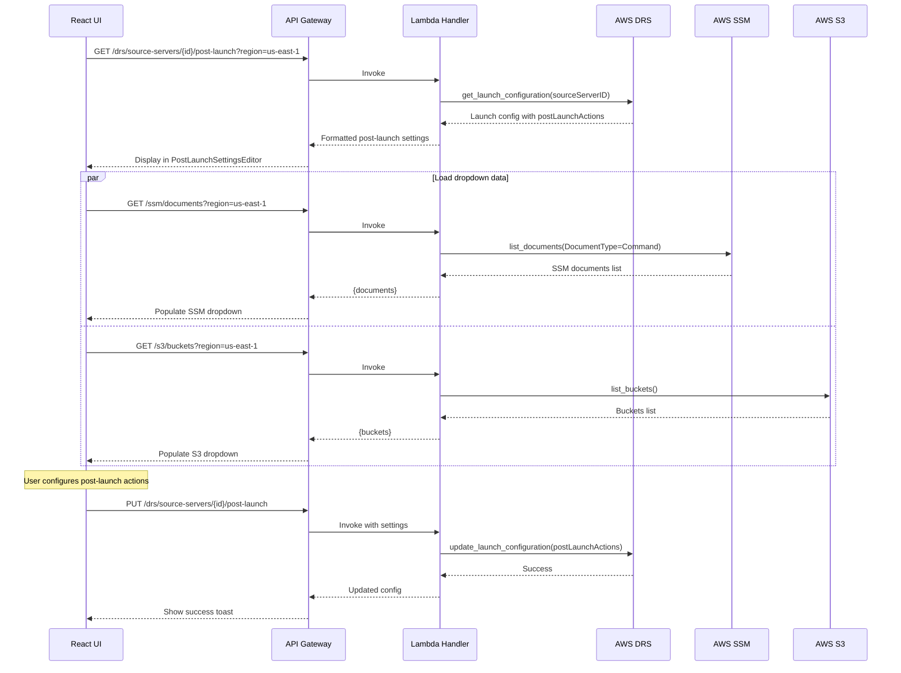
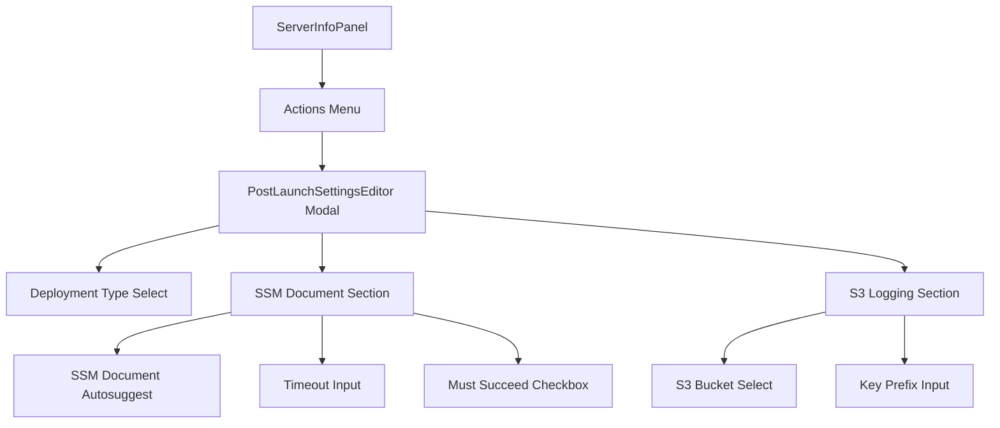
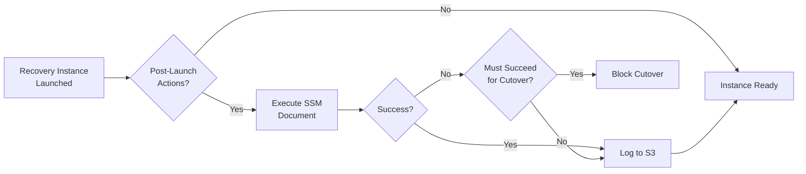

# DRS Post-Launch Settings MVP - Implementation Plan

**Version:** 1.0  
**Date:** December 2025  
**Status:** Ready for Implementation  
**Estimated Effort:** 4-5 days  
**Dependencies:** MVP 1 (Server Info)

---

## Executive Summary

MVP implementation of post-launch action configuration for DRS source servers. Configure SSM automation documents, deployment type, and S3 bucket for logs that execute after recovery instance launch.

### MVP Scope

| Included | Excluded (Future) |
|----------|-------------------|
| View post-launch configuration | Bulk post-launch updates |
| SSM document selection | Custom SSM document creation |
| Deployment type (test/cutover) | Post-launch templates |
| S3 log bucket configuration | Log analysis |
| Activation timeout | |

### Business Value

- **Automated validation**: Run health checks after instance launch
- **Configuration management**: Apply configurations via SSM
- **Audit compliance**: Store post-launch logs in S3
- **Deployment flexibility**: Different actions for drill vs recovery

---

## DRS Post-Launch Actions

### Post-Launch Configuration Fields

| Field | Type | Description |
|-------|------|-------------|
| `deployment` | Enum | TEST_AND_CUTOVER or CUTOVER |
| `ssmDocument` | Object | SSM document configuration |
| `ssmDocument.ssmDocumentName` | String | SSM document name |
| `ssmDocument.timeoutSeconds` | Integer | Execution timeout (120-3600) |
| `ssmDocument.mustSucceedForCutover` | Boolean | Block cutover on failure |
| `s3LogBucket` | String | S3 bucket for logs |
| `s3OutputKeyPrefix` | String | S3 key prefix for logs |

### Deployment Types

| Type | Description |
|------|-------------|
| TEST_AND_CUTOVER | Launch in test mode first, then cutover |
| CUTOVER | Direct cutover without test phase |

### Common SSM Documents

| Document | Purpose |
|----------|---------|
| AWS-RunPowerShellScript | Run PowerShell commands (Windows) |
| AWS-RunShellScript | Run shell commands (Linux) |
| AWS-ApplyAnsiblePlaybooks | Apply Ansible playbooks |
| AWS-RunPatchBaseline | Apply patches |
| Custom documents | Organization-specific automation |

---

## Architecture

### Data Flow



### Component Hierarchy



### Post-Launch Execution Flow



---

## Implementation Plan

### Day 1-2: Backend API

#### API Endpoints

| Method | Endpoint | Description |
|--------|----------|-------------|
| GET | `/drs/source-servers/{id}/post-launch` | Get post-launch configuration |
| PUT | `/drs/source-servers/{id}/post-launch` | Update post-launch configuration |
| GET | `/ssm/documents?region={region}` | List available SSM documents |
| GET | `/s3/buckets?region={region}` | List available S3 buckets |

#### Lambda Handler - Get Post-Launch Config

```python
def get_server_post_launch_settings(event: Dict) -> Dict:
    """Get post-launch settings for a DRS source server."""
    path_params = event.get('pathParameters', {})
    query_params = event.get('queryStringParameters', {})
    
    server_id = path_params.get('id')
    region = query_params.get('region', 'us-east-1')
    
    if not server_id:
        return response(400, {'error': 'Server ID is required'})
    
    try:
        drs_client = boto3.client('drs', region_name=region)
        
        config = drs_client.get_launch_configuration(
            sourceServerID=server_id
        )
        
        post_launch = config.get('postLaunchActions', {})
        
        return response(200, {
            'sourceServerId': server_id,
            'deployment': post_launch.get('deployment', 'TEST_AND_CUTOVER'),
            'ssmDocument': post_launch.get('ssmDocuments', [{}])[0] if post_launch.get('ssmDocuments') else None,
            's3LogBucket': post_launch.get('s3LogBucket'),
            's3OutputKeyPrefix': post_launch.get('s3OutputKeyPrefix'),
            'cloudWatchLogGroupName': post_launch.get('cloudWatchLogGroupName')
        })
    except drs_client.exceptions.ResourceNotFoundException:
        return response(404, {'error': f'Server {server_id} not found'})
    except Exception as e:
        logger.error(f'Error getting post-launch settings: {str(e)}')
        return response(500, {'error': str(e)})


def update_server_post_launch_settings(event: Dict) -> Dict:
    """Update post-launch settings for a DRS source server."""
    path_params = event.get('pathParameters', {})
    
    try:
        body = json.loads(event.get('body', '{}'))
    except json.JSONDecodeError:
        return response(400, {'error': 'Invalid JSON body'})
    
    server_id = path_params.get('id')
    region = body.get('region', 'us-east-1')
    
    if not server_id:
        return response(400, {'error': 'Server ID is required'})
    
    try:
        drs_client = boto3.client('drs', region_name=region)
        
        # Build post-launch actions
        post_launch_actions = {
            'deployment': body.get('deployment', 'TEST_AND_CUTOVER')
        }
        
        # Add SSM document if provided
        if body.get('ssmDocument'):
            ssm_doc = body['ssmDocument']
            post_launch_actions['ssmDocuments'] = [{
                'ssmDocumentName': ssm_doc.get('ssmDocumentName'),
                'timeoutSeconds': ssm_doc.get('timeoutSeconds', 600),
                'mustSucceedForCutover': ssm_doc.get('mustSucceedForCutover', False)
            }]
            
            # Add parameters if provided
            if ssm_doc.get('parameters'):
                post_launch_actions['ssmDocuments'][0]['parameters'] = ssm_doc['parameters']
        
        # Add S3 logging if provided
        if body.get('s3LogBucket'):
            post_launch_actions['s3LogBucket'] = body['s3LogBucket']
        if body.get('s3OutputKeyPrefix'):
            post_launch_actions['s3OutputKeyPrefix'] = body['s3OutputKeyPrefix']
        
        # Update launch configuration
        drs_client.update_launch_configuration(
            sourceServerID=server_id,
            postLaunchActions=post_launch_actions
        )
        
        return response(200, {
            'sourceServerId': server_id,
            'message': 'Post-launch settings updated successfully'
        })
    except drs_client.exceptions.ResourceNotFoundException:
        return response(404, {'error': f'Server {server_id} not found'})
    except drs_client.exceptions.ValidationException as e:
        return response(400, {'error': f'Validation error: {str(e)}'})
    except Exception as e:
        logger.error(f'Error updating post-launch settings: {str(e)}')
        return response(500, {'error': str(e)})
```

#### Lambda Handler - List SSM Documents

```python
def list_ssm_documents(event: Dict) -> Dict:
    """List available SSM documents for post-launch actions."""
    query_params = event.get('queryStringParameters', {})
    region = query_params.get('region', 'us-east-1')
    doc_type = query_params.get('type', 'Command')  # Command, Automation
    
    try:
        ssm_client = boto3.client('ssm', region_name=region)
        
        documents = []
        paginator = ssm_client.get_paginator('list_documents')
        
        for page in paginator.paginate(
            Filters=[
                {'Key': 'DocumentType', 'Values': [doc_type]}
            ]
        ):
            for doc in page.get('DocumentIdentifiers', []):
                documents.append({
                    'name': doc['Name'],
                    'owner': doc.get('Owner', 'Unknown'),
                    'documentType': doc.get('DocumentType'),
                    'platformTypes': doc.get('PlatformTypes', []),
                    'documentVersion': doc.get('DocumentVersion'),
                    'description': doc.get('Description', '')
                })
        
        # Sort by name
        documents.sort(key=lambda x: x['name'])
        
        return response(200, {
            'documents': documents,
            'count': len(documents)
        })
    except Exception as e:
        logger.error(f'Error listing SSM documents: {str(e)}')
        return response(500, {'error': str(e)})


def list_s3_buckets(event: Dict) -> Dict:
    """List available S3 buckets for post-launch logs."""
    query_params = event.get('queryStringParameters', {})
    region = query_params.get('region', 'us-east-1')
    
    try:
        s3_client = boto3.client('s3', region_name=region)
        
        buckets_response = s3_client.list_buckets()
        
        buckets = []
        for bucket in buckets_response.get('Buckets', []):
            # Get bucket location to filter by region
            try:
                location = s3_client.get_bucket_location(Bucket=bucket['Name'])
                bucket_region = location.get('LocationConstraint') or 'us-east-1'
                
                # Only include buckets in the same region or global
                if bucket_region == region or bucket_region == 'us-east-1':
                    buckets.append({
                        'name': bucket['Name'],
                        'creationDate': bucket['CreationDate'].isoformat(),
                        'region': bucket_region
                    })
            except Exception:
                # Skip buckets we can't access
                continue
        
        return response(200, {
            'buckets': buckets,
            'count': len(buckets)
        })
    except Exception as e:
        logger.error(f'Error listing S3 buckets: {str(e)}')
        return response(500, {'error': str(e)})
```

#### IAM Permissions

```yaml
- Effect: Allow
  Action:
    - drs:GetLaunchConfiguration
    - drs:UpdateLaunchConfiguration
  Resource: '*'
- Effect: Allow
  Action:
    - ssm:ListDocuments
    - ssm:DescribeDocument
  Resource: '*'
- Effect: Allow
  Action:
    - s3:ListAllMyBuckets
    - s3:GetBucketLocation
  Resource: '*'
```

---

### Day 3-4: Frontend Component

#### PostLaunchSettingsEditor Component

```typescript
import React, { useState, useEffect } from 'react';
import {
  Modal, Box, SpaceBetween, Button, FormField, Select, Input,
  Checkbox, Spinner, Alert, Header, ColumnLayout, Toggle,
  Autosuggest, ExpandableSection
} from '@cloudscape-design/components';

interface PostLaunchConfig {
  deployment: string;
  ssmDocument: SsmDocumentConfig | null;
  s3LogBucket: string;
  s3OutputKeyPrefix: string;
}

interface SsmDocumentConfig {
  ssmDocumentName: string;
  timeoutSeconds: number;
  mustSucceedForCutover: boolean;
  parameters?: Record<string, string[]>;
}

const DEPLOYMENT_OPTIONS = [
  { value: 'TEST_AND_CUTOVER', label: 'Test and Cutover', description: 'Launch in test mode first, then cutover' },
  { value: 'CUTOVER', label: 'Cutover Only', description: 'Direct cutover without test phase' }
];

export const PostLaunchSettingsEditor: React.FC<{
  visible: boolean;
  onDismiss: () => void;
  serverId: string;
  serverName: string;
  region: string;
}> = ({ visible, onDismiss, serverId, serverName, region }) => {
  const [config, setConfig] = useState<PostLaunchConfig | null>(null);
  const [ssmDocuments, setSsmDocuments] = useState<any[]>([]);
  const [s3Buckets, setS3Buckets] = useState<any[]>([]);
  const [loading, setLoading] = useState(true);
  const [saving, setSaving] = useState(false);
  const [error, setError] = useState<string | null>(null);
  const [enableSsm, setEnableSsm] = useState(false);
  const [enableS3Logging, setEnableS3Logging] = useState(false);

  useEffect(() => {
    if (visible) {
      loadData();
    }
  }, [visible, serverId]);

  const loadData = async () => {
    setLoading(true);
    setError(null);
    try {
      const [configData, docsData, bucketsData] = await Promise.all([
        getServerPostLaunchSettings(serverId, region),
        listSsmDocuments(region),
        listS3Buckets(region)
      ]);
      setConfig(configData);
      setSsmDocuments(docsData.documents);
      setS3Buckets(bucketsData.buckets);
      setEnableSsm(!!configData.ssmDocument);
      setEnableS3Logging(!!configData.s3LogBucket);
    } catch (err) {
      setError('Failed to load post-launch settings');
    } finally {
      setLoading(false);
    }
  };

  const handleSave = async () => {
    if (!config) return;
    setSaving(true);
    try {
      const saveConfig = {
        ...config,
        ssmDocument: enableSsm ? config.ssmDocument : null,
        s3LogBucket: enableS3Logging ? config.s3LogBucket : null,
        s3OutputKeyPrefix: enableS3Logging ? config.s3OutputKeyPrefix : null
      };
      await updateServerPostLaunchSettings(serverId, region, saveConfig);
      toast.success('Post-launch settings saved');
      onDismiss();
    } catch (err) {
      setError('Failed to save post-launch settings');
    } finally {
      setSaving(false);
    }
  };

  const updateConfig = (field: string, value: any) => {
    if (config) {
      setConfig({ ...config, [field]: value });
    }
  };

  const updateSsmDocument = (field: string, value: any) => {
    if (config) {
      const ssmDoc = config.ssmDocument || {
        ssmDocumentName: '',
        timeoutSeconds: 600,
        mustSucceedForCutover: false
      };
      setConfig({
        ...config,
        ssmDocument: { ...ssmDoc, [field]: value }
      });
    }
  };

  return (
    <Modal
      visible={visible}
      onDismiss={onDismiss}
      header={`Post-Launch Settings: ${serverName}`}
      size="large"
      footer={
        <Box float="right">
          <SpaceBetween direction="horizontal" size="xs">
            <Button onClick={onDismiss}>Cancel</Button>
            <Button variant="primary" onClick={handleSave} loading={saving}>
              Save Changes
            </Button>
          </SpaceBetween>
        </Box>
      }
    >
      {loading ? (
        <Spinner size="large" />
      ) : error ? (
        <Alert type="error">{error}</Alert>
      ) : config && (
        <SpaceBetween direction="vertical" size="l">
          {/* Deployment Type */}
          <FormField 
            label="Deployment Type"
            description="Choose how recovery instances are launched"
          >
            <Select
              selectedOption={DEPLOYMENT_OPTIONS.find(o => o.value === config.deployment)}
              onChange={({ detail }) => updateConfig('deployment', detail.selectedOption?.value)}
              options={DEPLOYMENT_OPTIONS}
            />
          </FormField>

          {/* SSM Document */}
          <ExpandableSection 
            headerText="SSM Automation Document"
            headerDescription="Run automation after instance launch"
          >
            <SpaceBetween direction="vertical" size="m">
              <Toggle
                checked={enableSsm}
                onChange={({ detail }) => setEnableSsm(detail.checked)}
              >
                Enable SSM post-launch action
              </Toggle>
              
              {enableSsm && (
                <ColumnLayout columns={2}>
                  <FormField label="SSM Document">
                    <Autosuggest
                      value={config.ssmDocument?.ssmDocumentName || ''}
                      onChange={({ detail }) => updateSsmDocument('ssmDocumentName', detail.value)}
                      options={ssmDocuments.map(d => ({ value: d.name, label: d.name, description: d.description }))}
                      placeholder="Select or type document name"
                      enteredTextLabel={value => `Use: ${value}`}
                    />
                  </FormField>
                  <FormField 
                    label="Timeout (seconds)"
                    description="120-3600 seconds"
                  >
                    <Input
                      type="number"
                      value={String(config.ssmDocument?.timeoutSeconds || 600)}
                      onChange={({ detail }) => updateSsmDocument('timeoutSeconds', parseInt(detail.value))}
                    />
                  </FormField>
                </ColumnLayout>
              )}
              
              {enableSsm && (
                <Checkbox
                  checked={config.ssmDocument?.mustSucceedForCutover || false}
                  onChange={({ detail }) => updateSsmDocument('mustSucceedForCutover', detail.checked)}
                >
                  Must succeed for cutover (block cutover if SSM action fails)
                </Checkbox>
              )}
            </SpaceBetween>
          </ExpandableSection>

          {/* S3 Logging */}
          <ExpandableSection 
            headerText="S3 Logging"
            headerDescription="Store post-launch action logs in S3"
          >
            <SpaceBetween direction="vertical" size="m">
              <Toggle
                checked={enableS3Logging}
                onChange={({ detail }) => setEnableS3Logging(detail.checked)}
              >
                Enable S3 logging
              </Toggle>
              
              {enableS3Logging && (
                <ColumnLayout columns={2}>
                  <FormField label="S3 Bucket">
                    <Select
                      selectedOption={s3Buckets.find(b => b.name === config.s3LogBucket)
                        ? { value: config.s3LogBucket, label: config.s3LogBucket }
                        : null}
                      onChange={({ detail }) => updateConfig('s3LogBucket', detail.selectedOption?.value)}
                      options={s3Buckets.map(b => ({ value: b.name, label: b.name }))}
                      placeholder="Select bucket"
                    />
                  </FormField>
                  <FormField 
                    label="Key Prefix"
                    description="Optional prefix for log files"
                  >
                    <Input
                      value={config.s3OutputKeyPrefix || ''}
                      onChange={({ detail }) => updateConfig('s3OutputKeyPrefix', detail.value)}
                      placeholder="drs-logs/"
                    />
                  </FormField>
                </ColumnLayout>
              )}
            </SpaceBetween>
          </ExpandableSection>
        </SpaceBetween>
      )}
    </Modal>
  );
};
```

---

### Day 5: Integration & Testing

#### Integration Points

1. Add "Post-Launch Settings" button to ServerInfoPanel
2. Wire up API service functions
3. Test SSM document selection
4. Test S3 bucket configuration
5. Validate timeout constraints

---

## UI Wireframe

```
┌─────────────────────────────────────────────────────────────────────────────┐
│ Post-Launch Settings: web-server-01                                  [X]    │
├─────────────────────────────────────────────────────────────────────────────┤
│                                                                             │
│ Deployment Type                                                             │
│ Choose how recovery instances are launched                                  │
│ ┌─────────────────────────────────────────────────────────────────────────┐ │
│ │ [Test and Cutover                                                   ▼] │ │
│ │   Launch in test mode first, then cutover                              │ │
│ └─────────────────────────────────────────────────────────────────────────┘ │
│                                                                             │
│ ▼ SSM Automation Document                                                   │
│   Run automation after instance launch                                      │
│ ┌─────────────────────────────────────────────────────────────────────────┐ │
│ │ [●] Enable SSM post-launch action                                       │ │
│ │                                                                         │ │
│ │ SSM Document                    │ Timeout (seconds)                     │ │
│ │ [AWS-RunShellScript        ▼]  │ [600                ]                 │ │
│ │                                 │ 120-3600 seconds                      │ │
│ │                                                                         │ │
│ │ ☑ Must succeed for cutover (block cutover if SSM action fails)         │ │
│ └─────────────────────────────────────────────────────────────────────────┘ │
│                                                                             │
│ ▼ S3 Logging                                                                │
│   Store post-launch action logs in S3                                       │
│ ┌─────────────────────────────────────────────────────────────────────────┐ │
│ │ [●] Enable S3 logging                                                   │ │
│ │                                                                         │ │
│ │ S3 Bucket                       │ Key Prefix                            │ │
│ │ [my-drs-logs-bucket        ▼]  │ [drs-logs/                ]           │ │
│ │                                 │ Optional prefix for log files         │ │
│ └─────────────────────────────────────────────────────────────────────────┘ │
│                                                                             │
│ ┌─────────────────────────────────────────────────────────────────────────┐ │
│ │ ℹ️ Post-launch actions run after the recovery instance is launched.     │ │
│ │    Use SSM documents to run health checks, apply configurations, or    │ │
│ │    execute custom scripts on the recovered instance.                   │ │
│ └─────────────────────────────────────────────────────────────────────────┘ │
│                                                                             │
├─────────────────────────────────────────────────────────────────────────────┤
│                                           [Cancel]  [Save Changes]          │
└─────────────────────────────────────────────────────────────────────────────┘
```

---

## Deployment Checklist

- [ ] Add Lambda handler functions
- [ ] Add IAM permissions for SSM and S3
- [ ] Add API Gateway endpoints
- [ ] Create PostLaunchSettingsEditor component
- [ ] Integrate with ServerInfoPanel
- [ ] Test SSM document execution
- [ ] Test S3 logging configuration

---

## Future Enhancements

| Feature | Effort |
|---------|--------|
| Bulk post-launch configuration | 2 days |
| Custom SSM document creation | 3-4 days |
| Post-launch templates | 2 days |
| Log analysis dashboard | 3 days |
| SSM parameter management | 2 days |
