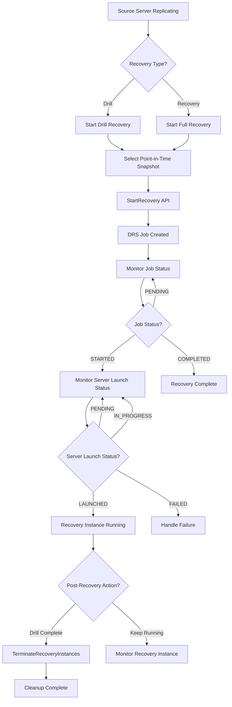
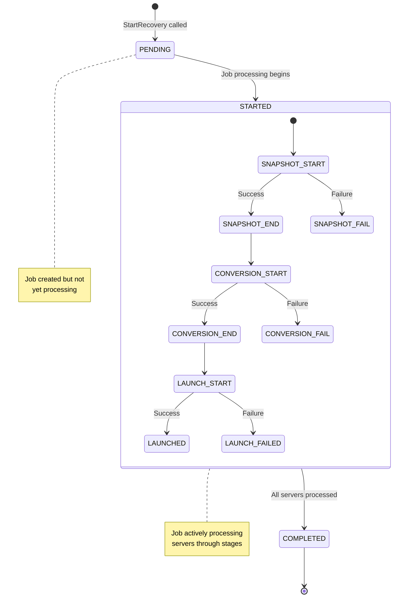

# DRS Recovery Deep Dive: Implementation Plan

## Executive Summary

This document provides a comprehensive technical deep dive into AWS Elastic Disaster Recovery (DRS) recovery operations, covering all API calls, data structures, state transitions, and implementation patterns needed to enhance the DRS Orchestration solution's recovery capabilities.

---

## Recovery Lifecycle Overview



---

## Core DRS Recovery APIs

### 1. StartRecovery

Launches Recovery Instances for specified Source Servers.

**Endpoint**: `POST /StartRecovery`

**Request Structure**:
```json
{
  "isDrill": true,
  "sourceServers": [
    {
      "sourceServerID": "s-1234567890abcdef0",
      "recoverySnapshotID": "pit-1234567890abcdef0"
    }
  ],
  "tags": {
    "Environment": "DR-Test",
    "ExecutionId": "exec-uuid"
  }
}
```

**Parameters**:
| Parameter | Type | Required | Description |
|-----------|------|----------|-------------|
| `isDrill` | Boolean | No | Whether this is a drill (default: false) |
| `sourceServers` | Array | Yes | 1-200 source servers to recover |
| `sourceServers[].sourceServerID` | String | Yes | Source server ID (pattern: `s-[0-9a-zA-Z]{17}`) |
| `sourceServers[].recoverySnapshotID` | String | No | Point-in-time snapshot ID (omit for latest) |
| `tags` | Map | No | Tags to apply to recovery job |

**Response**: Returns a `Job` object with job details.

**Errors**:
| Error | HTTP Code | Description |
|-------|-----------|-------------|
| `ConflictException` | 409 | Server already has active recovery |
| `ServiceQuotaExceededException` | 402 | Exceeded DRS service limits |
| `ThrottlingException` | 429 | Rate limit exceeded |
| `UninitializedAccountException` | 400 | DRS not initialized in account |

---

### 2. DescribeJobs

Returns a list of DRS jobs with filtering and pagination.

**Endpoint**: `POST /DescribeJobs`

**Request Structure**:
```json
{
  "filters": {
    "jobIDs": ["drsjob-1234567890abcdef0"],
    "fromDate": "2025-12-01T00:00:00Z",
    "toDate": "2025-12-15T23:59:59Z"
  },
  "maxResults": 100,
  "nextToken": "string"
}
```

**Job Object Structure**:
```json
{
  "jobID": "drsjob-1234567890abcdef0",
  "arn": "arn:aws:drs:us-east-1:123456789012:job/drsjob-xxx",
  "type": "LAUNCH",
  "status": "STARTED",
  "initiatedBy": "START_DRILL",
  "creationDateTime": "2025-12-15T10:00:00Z",
  "endDateTime": null,
  "participatingServers": [
    {
      "sourceServerID": "s-1234567890abcdef0",
      "recoveryInstanceID": "i-0abc123def456789",
      "launchStatus": "IN_PROGRESS",
      "launchActionsStatus": {
        "runs": [],
        "ssmAgentDiscoveryDatetime": "2025-12-15T10:05:00Z"
      }
    }
  ],
  "tags": {}
}
```

---

### 3. Job Status Values

| Status | Description |
|--------|-------------|
| `PENDING` | Job created, not yet started |
| `STARTED` | Job is actively running |
| `COMPLETED` | Job finished successfully |

### 4. Job Type Values

| Type | Description |
|------|-------------|
| `LAUNCH` | Recovery instance launch job |
| `TERMINATE` | Recovery instance termination job |
| `CREATE_CONVERTED_SNAPSHOT` | Snapshot conversion job |

### 5. Job InitiatedBy Values

| Value | Description |
|-------|-------------|
| `START_RECOVERY` | Full recovery initiated |
| `START_DRILL` | Drill recovery initiated |
| `FAILBACK` | Failback operation |
| `DIAGNOSTIC` | Diagnostic operation |
| `TERMINATE_RECOVERY_INSTANCES` | Instance termination |
| `TARGET_ACCOUNT` | Cross-account operation |

---

### 6. ParticipatingServer Launch Status Values

| Status | Description |
|--------|-------------|
| `PENDING` | Server queued for launch |
| `IN_PROGRESS` | Server launch in progress |
| `LAUNCHED` | Server successfully launched |
| `FAILED` | Server launch failed |
| `TERMINATED` | Recovery instance terminated |

---

### 7. DescribeJobLogItems

Retrieves detailed job logs with pagination.

**Endpoint**: `POST /DescribeJobLogItems`

**Request Structure**:
```json
{
  "jobID": "drsjob-1234567890abcdef0",
  "maxResults": 100,
  "nextToken": "string"
}
```

**Job Log Event Types**:
| Event | Description |
|-------|-------------|
| `JOB_START` | Job started |
| `JOB_END` | Job completed |
| `JOB_CANCEL` | Job cancelled |
| `SERVER_SKIPPED` | Server skipped (already recovering) |
| `SNAPSHOT_START` | Snapshot creation started |
| `SNAPSHOT_END` | Snapshot creation completed |
| `SNAPSHOT_FAIL` | Snapshot creation failed |
| `USING_PREVIOUS_SNAPSHOT` | Using existing snapshot |
| `USING_PREVIOUS_SNAPSHOT_FAILED` | Failed to use existing snapshot |
| `CONVERSION_START` | Volume conversion started |
| `CONVERSION_END` | Volume conversion completed |
| `CONVERSION_FAIL` | Volume conversion failed |
| `LAUNCH_START` | Instance launch started |
| `LAUNCH_FAILED` | Instance launch failed |
| `CLEANUP_START` | Cleanup started |
| `CLEANUP_END` | Cleanup completed |
| `CLEANUP_FAIL` | Cleanup failed |
| `DEPLOY_NETWORK_CONFIGURATION_START` | Network config deployment started |
| `DEPLOY_NETWORK_CONFIGURATION_END` | Network config deployment completed |
| `DEPLOY_NETWORK_CONFIGURATION_FAILED` | Network config deployment failed |
| `UPDATE_NETWORK_CONFIGURATION_START` | Network config update started |
| `UPDATE_NETWORK_CONFIGURATION_END` | Network config update completed |
| `UPDATE_NETWORK_CONFIGURATION_FAILED` | Network config update failed |
| `UPDATE_LAUNCH_TEMPLATE_START` | Launch template update started |
| `UPDATE_LAUNCH_TEMPLATE_END` | Launch template update completed |
| `UPDATE_LAUNCH_TEMPLATE_FAILED` | Launch template update failed |
| `NETWORK_RECOVERY_FAIL` | Network recovery failed |

**JobLogEventData Structure**:
```json
{
  "sourceServerID": "s-1234567890abcdef0",
  "targetInstanceID": "i-0abc123def456789",
  "conversionServerID": "i-conv123456789",
  "rawError": "Error message if applicable",
  "conversionProperties": {},
  "eventResourceData": {}
}
```

---

### 8. DescribeRecoverySnapshots

Lists all point-in-time recovery snapshots for a source server.

**Endpoint**: `POST /DescribeRecoverySnapshots`

**Request Structure**:
```json
{
  "sourceServerID": "s-1234567890abcdef0",
  "filters": {
    "fromDateTime": "2025-12-01T00:00:00Z",
    "toDateTime": "2025-12-15T23:59:59Z"
  },
  "order": "DESC",
  "maxResults": 100,
  "nextToken": "string"
}
```

**RecoverySnapshot Structure**:
```json
{
  "snapshotID": "pit-1234567890abcdef0",
  "sourceServerID": "s-1234567890abcdef0",
  "timestamp": "2025-12-15T10:00:00Z",
  "expectedTimestamp": "2025-12-15T10:00:00Z",
  "ebsSnapshots": ["snap-1234567890abcdef0", "snap-0987654321fedcba0"]
}
```

**Use Cases**:
- List available recovery points for point-in-time recovery
- Allow users to select specific snapshot for recovery
- Display snapshot history in UI

---

### 9. DescribeRecoveryInstances

Lists recovery instances with detailed information.

**Endpoint**: `POST /DescribeRecoveryInstances`

**Request Structure**:
```json
{
  "filters": {
    "recoveryInstanceIDs": ["i-0abc123def456789"],
    "sourceServerIDs": ["s-1234567890abcdef0"]
  },
  "maxResults": 100,
  "nextToken": "string"
}
```

**RecoveryInstance Structure**:
```json
{
  "recoveryInstanceID": "i-0abc123def456789",
  "ec2InstanceID": "i-0abc123def456789",
  "ec2InstanceState": {
    "name": "running"
  },
  "sourceServerID": "s-1234567890abcdef0",
  "isDrill": true,
  "jobID": "drsjob-1234567890abcdef0",
  "pointInTimeSnapshotDateTime": "2025-12-15T10:00:00Z",
  "dataReplicationInfo": {
    "dataReplicationState": "CONTINUOUS",
    "dataReplicationInitiation": {},
    "etaDateTime": null,
    "lagDuration": "PT0S",
    "replicatedDisks": []
  },
  "failback": {
    "state": "NOT_STARTED",
    "failbackJobID": null,
    "failbackLaunchType": null,
    "failbackToOriginalServer": null,
    "agentLastSeenByServiceDateTime": null,
    "failbackClientID": null,
    "failbackClientLastSeenByServiceDateTime": null
  },
  "originEnvironment": "ON_PREMISES",
  "originAvailabilityZone": null,
  "tags": {}
}
```

---

### 10. TerminateRecoveryInstances

Terminates EC2 recovery instances and removes them from DRS.

**Endpoint**: `POST /TerminateRecoveryInstances`

**Request Structure**:
```json
{
  "recoveryInstanceIDs": ["i-0abc123def456789", "i-0def456789abc123"]
}
```

**Parameters**:
| Parameter | Type | Required | Description |
|-----------|------|----------|-------------|
| `recoveryInstanceIDs` | Array | Yes | 1-200 recovery instance IDs |

**Response**: Returns a `Job` object for the termination job.

**Important Notes**:
- Creates a TERMINATE type job
- Terminates EC2 instances
- Removes recovery instances from DRS service
- Use after successful drill validation

---

## Recovery Flow State Machine



---

## Implementation Patterns

### Pattern 1: Start Recovery with Polling

```python
import boto3
import time

def start_recovery_with_polling(
    source_server_ids: list,
    is_drill: bool = True,
    recovery_snapshot_id: str = None,
    tags: dict = None,
    region: str = 'us-east-1'
) -> dict:
    """
    Start DRS recovery and poll until completion.
    
    Args:
        source_server_ids: List of source server IDs to recover
        is_drill: Whether this is a drill (default: True)
        recovery_snapshot_id: Optional specific snapshot ID
        tags: Optional tags for the recovery job
        region: AWS region
    
    Returns:
        Final job status with recovery instance details
    """
    drs = boto3.client('drs', region_name=region)
    
    # Build source servers request
    source_servers = []
    for server_id in source_server_ids:
        server_request = {'sourceServerID': server_id}
        if recovery_snapshot_id:
            server_request['recoverySnapshotID'] = recovery_snapshot_id
        source_servers.append(server_request)
    
    # Start recovery
    response = drs.start_recovery(
        isDrill=is_drill,
        sourceServers=source_servers,
        tags=tags or {}
    )
    
    job_id = response['job']['jobID']
    print(f"Started recovery job: {job_id}")
    
    # Poll for completion
    while True:
        job_response = drs.describe_jobs(
            filters={'jobIDs': [job_id]}
        )
        
        if not job_response['items']:
            raise Exception(f"Job {job_id} not found")
        
        job = job_response['items'][0]
        status = job['status']
        
        print(f"Job status: {status}")
        
        # Check participating servers
        for server in job.get('participatingServers', []):
            print(f"  Server {server['sourceServerID']}: {server['launchStatus']}")
        
        if status == 'COMPLETED':
            return job
        elif status == 'PENDING' or status == 'STARTED':
            time.sleep(30)  # Poll every 30 seconds
        else:
            raise Exception(f"Unexpected job status: {status}")


def get_job_logs(job_id: str, region: str = 'us-east-1') -> list:
    """
    Get detailed job logs for troubleshooting.
    
    Args:
        job_id: DRS job ID
        region: AWS region
    
    Returns:
        List of job log events
    """
    drs = boto3.client('drs', region_name=region)
    
    logs = []
    next_token = None
    
    while True:
        params = {'jobID': job_id, 'maxResults': 100}
        if next_token:
            params['nextToken'] = next_token
        
        response = drs.describe_job_log_items(**params)
        logs.extend(response.get('items', []))
        
        next_token = response.get('nextToken')
        if not next_token:
            break
    
    return logs
```

### Pattern 2: Point-in-Time Recovery Selection

```python
def get_available_snapshots(
    source_server_id: str,
    from_date: str = None,
    to_date: str = None,
    region: str = 'us-east-1'
) -> list:
    """
    Get available recovery snapshots for a source server.
    
    Args:
        source_server_id: Source server ID
        from_date: Optional start date filter (ISO format)
        to_date: Optional end date filter (ISO format)
        region: AWS region
    
    Returns:
        List of available recovery snapshots
    """
    drs = boto3.client('drs', region_name=region)
    
    params = {
        'sourceServerID': source_server_id,
        'order': 'DESC',  # Most recent first
        'maxResults': 100
    }
    
    if from_date or to_date:
        params['filters'] = {}
        if from_date:
            params['filters']['fromDateTime'] = from_date
        if to_date:
            params['filters']['toDateTime'] = to_date
    
    snapshots = []
    next_token = None
    
    while True:
        if next_token:
            params['nextToken'] = next_token
        
        response = drs.describe_recovery_snapshots(**params)
        snapshots.extend(response.get('items', []))
        
        next_token = response.get('nextToken')
        if not next_token:
            break
    
    return snapshots


def start_point_in_time_recovery(
    source_server_id: str,
    snapshot_id: str,
    is_drill: bool = True,
    region: str = 'us-east-1'
) -> dict:
    """
    Start recovery from a specific point-in-time snapshot.
    
    Args:
        source_server_id: Source server ID
        snapshot_id: Recovery snapshot ID (pit-xxx format)
        is_drill: Whether this is a drill
        region: AWS region
    
    Returns:
        Recovery job details
    """
    drs = boto3.client('drs', region_name=region)
    
    response = drs.start_recovery(
        isDrill=is_drill,
        sourceServers=[{
            'sourceServerID': source_server_id,
            'recoverySnapshotID': snapshot_id
        }]
    )
    
    return response['job']
```

### Pattern 3: Recovery Instance Monitoring

```python
def monitor_recovery_instances(
    source_server_ids: list = None,
    recovery_instance_ids: list = None,
    region: str = 'us-east-1'
) -> list:
    """
    Monitor recovery instances and their status.
    
    Args:
        source_server_ids: Optional filter by source servers
        recovery_instance_ids: Optional filter by recovery instances
        region: AWS region
    
    Returns:
        List of recovery instance details
    """
    drs = boto3.client('drs', region_name=region)
    
    filters = {}
    if source_server_ids:
        filters['sourceServerIDs'] = source_server_ids
    if recovery_instance_ids:
        filters['recoveryInstanceIDs'] = recovery_instance_ids
    
    instances = []
    next_token = None
    
    while True:
        params = {'maxResults': 100}
        if filters:
            params['filters'] = filters
        if next_token:
            params['nextToken'] = next_token
        
        response = drs.describe_recovery_instances(**params)
        instances.extend(response.get('items', []))
        
        next_token = response.get('nextToken')
        if not next_token:
            break
    
    return instances


def get_recovery_instance_details(instances: list) -> list:
    """
    Extract key details from recovery instances.
    
    Args:
        instances: List of recovery instance objects
    
    Returns:
        List of simplified instance details
    """
    details = []
    
    for instance in instances:
        detail = {
            'recoveryInstanceID': instance['recoveryInstanceID'],
            'ec2InstanceID': instance.get('ec2InstanceID'),
            'ec2State': instance.get('ec2InstanceState', {}).get('name'),
            'sourceServerID': instance['sourceServerID'],
            'isDrill': instance.get('isDrill', False),
            'jobID': instance.get('jobID'),
            'snapshotDateTime': instance.get('pointInTimeSnapshotDateTime'),
            'failbackState': instance.get('failback', {}).get('state', 'NOT_STARTED')
        }
        details.append(detail)
    
    return details
```

### Pattern 4: Terminate Recovery Instances

```python
def terminate_recovery_instances(
    recovery_instance_ids: list,
    region: str = 'us-east-1',
    wait_for_completion: bool = True
) -> dict:
    """
    Terminate recovery instances after drill completion.
    
    Args:
        recovery_instance_ids: List of recovery instance IDs to terminate
        region: AWS region
        wait_for_completion: Whether to wait for termination to complete
    
    Returns:
        Termination job details
    """
    drs = boto3.client('drs', region_name=region)
    
    # Start termination
    response = drs.terminate_recovery_instances(
        recoveryInstanceIDs=recovery_instance_ids
    )
    
    job = response['job']
    job_id = job['jobID']
    print(f"Started termination job: {job_id}")
    
    if not wait_for_completion:
        return job
    
    # Poll for completion
    while True:
        job_response = drs.describe_jobs(
            filters={'jobIDs': [job_id]}
        )
        
        if not job_response['items']:
            raise Exception(f"Job {job_id} not found")
        
        job = job_response['items'][0]
        status = job['status']
        
        print(f"Termination job status: {status}")
        
        if status == 'COMPLETED':
            return job
        elif status in ['PENDING', 'STARTED']:
            time.sleep(15)
        else:
            raise Exception(f"Unexpected job status: {status}")
```

---

## Integration with Orchestration Engine

### Current Implementation Enhancement

The existing orchestration engine in `lambda/orchestration_stepfunctions.py` can be enhanced with:

1. **Point-in-Time Snapshot Selection**
   - Add `recoverySnapshotId` to wave configuration
   - Allow users to select specific snapshots per server
   - Default to latest snapshot if not specified

2. **Enhanced Job Monitoring**
   - Poll `DescribeJobLogItems` for detailed progress
   - Surface job log events in execution history
   - Provide real-time event streaming to frontend

3. **Recovery Instance Tracking**
   - Store recovery instance IDs in execution record
   - Track EC2 instance state changes
   - Enable instance termination from execution details

4. **Error Handling Improvements**
   - Parse `rawError` from job logs
   - Map DRS error codes to user-friendly messages
   - Implement automatic retry for transient failures

### Proposed API Enhancements

| Endpoint | Enhancement |
|----------|-------------|
| `POST /executions` | Add `snapshotSelection` parameter |
| `GET /executions/{id}` | Include `recoveryInstances` array |
| `GET /executions/{id}/job-logs` | New endpoint for job log events |
| `POST /executions/{id}/terminate-instances` | Already implemented |
| `GET /drs/snapshots?sourceServerId={id}` | New endpoint for snapshot listing |

---

## Service Limits and Quotas

| Limit | Value | Notes |
|-------|-------|-------|
| Max servers per StartRecovery | 200 | Per API call |
| Max concurrent recovery jobs | 20 | Per account per region |
| Max replicating servers | 300 | Per account per region |
| Max servers across active jobs | 500 | Per account per region |
| Recovery snapshot retention | Based on PIT policy | Configurable per server |

---

## Error Handling Matrix

| Error | Cause | Resolution |
|-------|-------|------------|
| `ConflictException` | Server already recovering | Wait for existing job or cancel |
| `ServiceQuotaExceededException` | Exceeded DRS limits | Reduce batch size or wait |
| `ThrottlingException` | API rate limit | Implement exponential backoff |
| `UninitializedAccountException` | DRS not initialized | Initialize DRS in account |
| `LAUNCH_FAILED` | EC2 launch failure | Check IAM permissions, VPC config |
| `CONVERSION_FAIL` | Volume conversion error | Check disk compatibility |
| `SNAPSHOT_FAIL` | Snapshot creation error | Verify replication status |

---

## IAM Permissions Required

```yaml
# Minimum permissions for recovery operations
- drs:StartRecovery
- drs:DescribeJobs
- drs:DescribeJobLogItems
- drs:DescribeRecoverySnapshots
- drs:DescribeRecoveryInstances
- drs:TerminateRecoveryInstances

# EC2 permissions (required by DRS during recovery)
- ec2:RunInstances
- ec2:CreateVolume
- ec2:AttachVolume
- ec2:CreateLaunchTemplate
- ec2:CreateLaunchTemplateVersion
- ec2:CreateTags
- ec2:DescribeInstances
- ec2:DescribeVolumes
- ec2:DescribeLaunchTemplates
```

---

## DRS Agent Management

### Agent Uninstallation

Recovery instances from DRS already have the agent installed. Before reinstalling the agent to point to a different region (e.g., for reverse replication/failback), the existing agent must be uninstalled.

**Error if not uninstalled first**:
> "Cannot install agent, as this server was previously installed to replicate into another region or account. To allow installation, first disconnect and delete the previously installed source server."

**Uninstaller Locations**:

| Platform | Uninstall Script Path |
|----------|----------------------|
| Windows | `C:\Program Files (x86)\AWS Replication Agent\uninstall_agent_windows.bat` |
| Linux | `/var/lib/aws-replication-agent/uninstall_agent_linux.sh` |

**Windows Uninstall via SSM**:
```powershell
# Stop agent service
& "C:\Program Files (x86)\AWS Replication Agent\stopAgent.bat"

# Run uninstaller
Set-Location "C:\Program Files (x86)\AWS Replication Agent"
& .\uninstall_agent_windows.bat

# Clean up folder
Remove-Item -Path "C:\Program Files (x86)\AWS Replication Agent" -Recurse -Force

# Reboot to complete cleanup
Restart-Computer -Force
```

**Linux Uninstall via SSM**:
```bash
# Stop agent
sudo /var/lib/aws-replication-agent/stopAgent.sh

# Run uninstaller
sudo /var/lib/aws-replication-agent/uninstall_agent_linux.sh

# Clean up folder
sudo rm -rf /var/lib/aws-replication-agent

# Reboot
sudo reboot
```

**Important**: After uninstalling, the instance must be rebooted before reinstalling the agent. The SSM agent will reconnect after reboot, allowing the new agent installation to proceed.

---

## Next Steps for Implementation

### Phase 1: Point-in-Time Recovery (1 week)
- [ ] Add `GET /drs/snapshots` endpoint
- [ ] Update Recovery Plan UI with snapshot selector
- [ ] Modify `StartRecovery` call to include snapshot ID
- [ ] Update execution record with snapshot details

### Phase 2: Enhanced Job Monitoring (1 week)
- [ ] Add `GET /executions/{id}/job-logs` endpoint
- [ ] Create JobEventsTimeline component enhancement
- [ ] Implement real-time log streaming
- [ ] Add error message parsing and display

### Phase 3: Recovery Instance Management (1 week)
- [ ] Enhance execution details with instance info
- [ ] Add instance state monitoring
- [ ] Improve terminate instances UX
- [ ] Add instance details modal

### Phase 4: Error Handling & Resilience (1 week)
- [ ] Implement retry logic for transient failures
- [ ] Add comprehensive error mapping
- [ ] Create troubleshooting guide integration
- [ ] Add CloudWatch Logs deep links

---

## References

- [AWS DRS API Reference](https://docs.aws.amazon.com/drs/latest/APIReference/)
- [StartRecovery API](https://docs.aws.amazon.com/drs/latest/APIReference/API_StartRecovery.html)
- [DescribeJobs API](https://docs.aws.amazon.com/drs/latest/APIReference/API_DescribeJobs.html)
- [DescribeJobLogItems API](https://docs.aws.amazon.com/drs/latest/APIReference/API_DescribeJobLogItems.html)
- [DescribeRecoverySnapshots API](https://docs.aws.amazon.com/drs/latest/APIReference/API_DescribeRecoverySnapshots.html)
- [DescribeRecoveryInstances API](https://docs.aws.amazon.com/drs/latest/APIReference/API_DescribeRecoveryInstances.html)
- [TerminateRecoveryInstances API](https://docs.aws.amazon.com/drs/latest/APIReference/API_TerminateRecoveryInstances.html)
- [DRS Post-Launch Actions](https://docs.aws.amazon.com/drs/latest/userguide/post-launch-action-settings-overview.html)
