# DRS Replication Settings Management for Pre-Provisioned Instances

**Version**: 1.0  
**Date**: January 8, 2026  
**Author**: DR Operations Team  
**Status**: Implementation Ready  

---

## Executive Summary

This document defines the implementation approach for managing DRS replication settings across source servers with simplified configuration for pre-provisioned DR instances. The solution leverages existing DRS orchestration patterns and extends the current tag-based synchronization system to support configuration templates, drift detection, and automated remediation.

## Problem Statement

As a DR Operations Engineer, I need DRS replication settings managed consistently across source servers with simplified configuration for pre-provisioned instances, ensuring predictable recovery behavior and reducing configuration drift.

## Solution Architecture

### Current Implementation Foundation

The solution builds upon existing capabilities in the DRS Orchestration solution:

**Existing Components**:
- **Tag Synchronization**: EventBridge-scheduled EC2 → DRS tag sync
- **Launch Settings Management**: Hierarchical configuration with Protection Group inheritance
- **Cross-Account Operations**: Role assumption for multi-account DRS management
- **API-First Design**: REST API with 47+ endpoints for automation

**Enterprise DR Patterns** (from archive):
- **Module Factory Pattern**: Pluggable technology adapters
- **Configuration Templates**: JSON-based resource definitions
- **Drift Detection**: Automated configuration validation
- **4-Phase Lifecycle**: Instantiate → Activate → Cleanup → Replicate

### Enhanced Architecture

```mermaid
flowchart TB
    subgraph "Configuration Management"
        TEMPLATE["📋 Replication Template"]
        VALIDATION["✅ Name Tag Validation"]
        DRIFT["🔍 Drift Detection"]
    end
    
    subgraph "Current DRS Solution"
        TAG_SYNC["🏷️ Tag Sync (EventBridge)"]
        LAUNCH_CONFIG["⚙️ Launch Settings"]
        API["🌐 REST API (47+ endpoints)"]
    end
    
    subgraph "Pre-Provisioned Support"
        INSTANCE_PAIRS["🔗 Primary-DR Pairs"]
        SIMPLIFIED_CONFIG["⚡ Simplified Config"]
        AUTO_REMEDIATION["🔧 Auto Remediation"]
    end
    
    TEMPLATE --> TAG_SYNC
    VALIDATION --> INSTANCE_PAIRS
    DRIFT --> AUTO_REMEDIATION
    TAG_SYNC --> LAUNCH_CONFIG
    LAUNCH_CONFIG --> API
```



## Implementation Components

### 1. Configuration Template System

**Template Structure** (extends existing Protection Group configuration):

```json
{
  "replicationTemplate": {
    "templateId": "standard-pre-provisioned-v1",
    "templateName": "Standard Pre-Provisioned Instance Configuration",
    "applicableScenarios": ["pre-provisioned"],
    "replicationSettings": {
      "replicatedDisks": {
        "replicateBootDisk": true,
        "replicateDataDisks": true,
        "stagingAreaSubnetId": "subnet-12345678",
        "stagingAreaTags": {
          "Environment": "DR-Staging",
          "Purpose": "DRS-Replication"
        }
      },
      "dataRoutingAndThrottling": {
        "dataRoutingPolicy": "PRIVATE_IP",
        "throttlingPolicy": "UNLIMITED",
        "createPublicIP": false
      },
      "pointInTimeSnapshotPolicy": {
        "enabled": true,
        "interval": 10,
        "retentionDuration": 60,
        "ruleUnits": "MINUTE"
      }
    },
    "launchConfiguration": {
      "launchDisposition": "STARTED",
      "licensing": {
        "osByol": false
      },
      "targetInstanceTypeRightSizingMethod": "BASIC",
      "copyPrivateIp": true,
      "copyTags": true,
      "preProvisionedInstanceSupport": {
        "enabled": true,
        "requireNameTagMatching": true,
        "allowLaunchIntoExistingInstance": true
      }
    }
  }
}
```

**Implementation** (extends existing `lambda/index.py` API handler):

```python
def apply_replication_template(event, context):
    """Apply replication template to tagged source servers."""
    try:
        # Get template and target servers
        template_id = event['templateId']
        server_tags = event['serverTags']
        
        # Leverage existing tag-based server discovery
        servers = get_servers_by_tags(server_tags)
        template = get_replication_template(template_id)
        
        results = []
        for server in servers:
            # Apply template settings
            result = apply_template_to_server(server, template)
            results.append(result)
            
        return {
            'statusCode': 200,
            'body': json.dumps({
                'appliedServers': len(results),
                'results': results
            })
        }
        
    except Exception as e:
        logger.error(f"Template application failed: {str(e)}")
        return error_response(500, str(e))

def apply_template_to_server(server, template):
    """Apply template configuration to individual server."""
    source_server_id = server['sourceServerID']
    
    # Pre-provisioned instance logic
    if template['launchConfiguration']['preProvisionedInstanceSupport']['enabled']:
        # Find matching pre-provisioned instance
        target_instance = find_matching_pre_provisioned_instance(server)
        if target_instance:
            # Simplified configuration for pre-provisioned
            update_launch_configuration_pre_provisioned(source_server_id, target_instance)
        else:
            raise Exception(f"No matching pre-provisioned instance found for {source_server_id}")
    
    # Apply replication settings
    update_replication_settings(source_server_id, template['replicationSettings'])
    
    return {
        'sourceServerId': source_server_id,
        'status': 'applied',
        'templateId': template['templateId']
    }
```

### 2. Name Tag Matching Validation

**Validation Logic** (extends existing cross-region operations):

```python
def validate_name_tag_matching(primary_region, dr_region, server_tags):
    """Validate Name tag matching between primary and DR regions."""
    
    # Get instances in both regions
    primary_instances = get_instances_by_tags(primary_region, server_tags)
    dr_instances = get_instances_by_tags(dr_region, server_tags)
    
    validation_results = []
    
    for primary_instance in primary_instances:
        primary_name = get_instance_name_tag(primary_instance)
        
        # Find matching DR instance
        matching_dr_instance = None
        for dr_instance in dr_instances:
            dr_name = get_instance_name_tag(dr_instance)
            if primary_name == dr_name:
                matching_dr_instance = dr_instance
                break
        
        validation_results.append({
            'primaryInstanceId': primary_instance['InstanceId'],
            'primaryName': primary_name,
            'drInstanceId': matching_dr_instance['InstanceId'] if matching_dr_instance else None,
            'drName': get_instance_name_tag(matching_dr_instance) if matching_dr_instance else None,
            'matched': matching_dr_instance is not None,
            'hasAllowLaunchingTag': has_allow_launching_tag(matching_dr_instance) if matching_dr_instance else False
        })
    
    return validation_results

def has_allow_launching_tag(instance):
    """Check if instance has AWSDRS:AllowLaunchingIntoThisInstance tag."""
    tags = {tag['Key']: tag['Value'] for tag in instance.get('Tags', [])}
    return tags.get('AWSDRS') == 'AllowLaunchingIntoThisInstance'
```

### 3. Simplified Configuration for Pre-Provisioned Instances

**Configuration Logic** (leverages existing launch settings patterns):

```python
def update_launch_configuration_pre_provisioned(source_server_id, target_instance):
    """Simplified launch configuration for pre-provisioned instances."""
    
    # Minimal configuration required for pre-provisioned instances
    launch_config = {
        'launchIntoInstanceProperties': {
            'launchIntoEC2InstanceID': target_instance['InstanceId']
        },
        'licensing': {
            'osByol': False  # Use existing license
        },
        'targetInstanceTypeRightSizingMethod': 'NONE',  # Use existing instance type
        'copyPrivateIp': False,  # Keep existing IP
        'copyTags': True  # Sync tags
    }
    
    # Apply configuration
    drs_client.update_launch_configuration(
        sourceServerID=source_server_id,
        **launch_config
    )
    
    return {
        'sourceServerId': source_server_id,
        'targetInstanceId': target_instance['InstanceId'],
        'configurationType': 'pre-provisioned-simplified'
    }
```

### 4. Configuration Drift Detection

**Drift Detection** (extends existing EventBridge scheduling):

```python
def detect_configuration_drift(event, context):
    """Detect drift in DRS replication settings."""
    
    # Get all source servers with templates
    servers_with_templates = get_servers_with_replication_templates()
    
    drift_results = []
    
    for server_config in servers_with_templates:
        source_server_id = server_config['sourceServerId']
        template_id = server_config['templateId']
        
        # Get current configuration
        current_config = get_current_replication_settings(source_server_id)
        expected_config = get_replication_template(template_id)
        
        # Compare configurations
        drift_detected = compare_configurations(current_config, expected_config)
        
        if drift_detected:
            drift_results.append({
                'sourceServerId': source_server_id,
                'templateId': template_id,
                'driftDetails': drift_detected,
                'detectedAt': datetime.utcnow().isoformat()
            })
    
    # Store drift results and trigger remediation
    if drift_results:
        store_drift_results(drift_results)
        trigger_drift_remediation(drift_results)
    
    return {
        'driftDetected': len(drift_results),
        'results': drift_results
    }

def compare_configurations(current, expected):
    """Compare current vs expected configuration."""
    drift_items = []
    
    # Compare replication settings
    if current.get('dataRoutingPolicy') != expected['replicationSettings']['dataRoutingAndThrottling']['dataRoutingPolicy']:
        drift_items.append({
            'setting': 'dataRoutingPolicy',
            'current': current.get('dataRoutingPolicy'),
            'expected': expected['replicationSettings']['dataRoutingAndThrottling']['dataRoutingPolicy']
        })
    
    # Compare launch configuration
    if current.get('targetInstanceTypeRightSizingMethod') != expected['launchConfiguration']['targetInstanceTypeRightSizingMethod']:
        drift_items.append({
            'setting': 'targetInstanceTypeRightSizingMethod',
            'current': current.get('targetInstanceTypeRightSizingMethod'),
            'expected': expected['launchConfiguration']['targetInstanceTypeRightSizingMethod']
        })
    
    return drift_items if drift_items else None
```

### 5. Automatic Remediation

**Remediation Logic** (integrates with existing Step Functions orchestration):

```python
def trigger_drift_remediation(drift_results):
    """Trigger automatic remediation for configuration drift."""
    
    for drift_result in drift_results:
        source_server_id = drift_result['sourceServerId']
        template_id = drift_result['templateId']
        
        # Create remediation execution
        remediation_input = {
            'sourceServerId': source_server_id,
            'templateId': template_id,
            'driftDetails': drift_result['driftDetails'],
            'remediationType': 'automatic'
        }
        
        # Use existing Step Functions pattern
        step_functions_client.start_execution(
            stateMachineArn=os.environ['DRIFT_REMEDIATION_STATE_MACHINE_ARN'],
            name=f"drift-remediation-{source_server_id}-{int(time.time())}",
            input=json.dumps(remediation_input)
        )

def remediate_configuration_drift(event, context):
    """Remediate configuration drift for a source server."""
    
    source_server_id = event['sourceServerId']
    template_id = event['templateId']
    drift_details = event['driftDetails']
    
    # Get template and apply corrections
    template = get_replication_template(template_id)
    
    remediation_results = []
    
    for drift_item in drift_details:
        setting = drift_item['setting']
        expected_value = drift_item['expected']
        
        # Apply correction based on setting type
        if setting in ['dataRoutingPolicy', 'throttlingPolicy']:
            update_replication_settings_item(source_server_id, setting, expected_value)
        elif setting in ['targetInstanceTypeRightSizingMethod', 'copyPrivateIp']:
            update_launch_configuration_item(source_server_id, setting, expected_value)
        
        remediation_results.append({
            'setting': setting,
            'correctedValue': expected_value,
            'status': 'remediated'
        })
    
    return {
        'sourceServerId': source_server_id,
        'remediatedSettings': len(remediation_results),
        'results': remediation_results
    }
```

### 6. New Server Auto-Configuration

**Auto-Configuration** (extends existing tag sync EventBridge rules):

```python
def auto_configure_new_servers(event, context):
    """Automatically apply standard configuration to new DRS source servers."""
    
    # Get newly discovered source servers (from EventBridge DRS events)
    new_servers = get_new_source_servers_from_event(event)
    
    configuration_results = []
    
    for server in new_servers:
        source_server_id = server['sourceServerID']
        
        # Determine applicable template based on server tags
        server_tags = get_source_server_tags(source_server_id)
        applicable_template = determine_applicable_template(server_tags)
        
        if applicable_template:
            # Apply template
            result = apply_template_to_server(server, applicable_template)
            configuration_results.append(result)
            
            # Record template association
            record_server_template_association(source_server_id, applicable_template['templateId'])
    
    return {
        'configuredServers': len(configuration_results),
        'results': configuration_results
    }

def determine_applicable_template(server_tags):
    """Determine which template applies to a server based on tags."""
    
    # Check for pre-provisioned instance indicators
    if server_tags.get('DR-Type') == 'pre-provisioned':
        return get_replication_template('standard-pre-provisioned-v1')
    elif server_tags.get('Environment') == 'Production':
        return get_replication_template('production-standard-v1')
    else:
        return get_replication_template('default-standard-v1')
```

## API Integration

### REST API Endpoints

**New Endpoints** (extends existing 47+ endpoint API):

```bash
# Apply replication template
POST /api/v1/drs/replication-templates/apply
{
  "templateId": "standard-pre-provisioned-v1",
  "serverTags": {"Environment": "Production", "DR-Type": "pre-provisioned"}
}

# Validate name tag matching
POST /api/v1/drs/validation/name-tag-matching
{
  "primaryRegion": "us-east-1",
  "drRegion": "us-west-2",
  "serverTags": {"Environment": "Production"}
}

# Detect configuration drift
GET /api/v1/drs/drift-detection/scan
POST /api/v1/drs/drift-detection/remediate
{
  "sourceServerId": "s-1234567890abcdef0",
  "remediationType": "automatic"
}

# Get replication templates
GET /api/v1/drs/replication-templates
GET /api/v1/drs/replication-templates/{templateId}
```

### EventBridge Integration

**Enhanced EventBridge Rules** (extends existing tag sync scheduling):

```yaml
# Configuration drift detection (daily)
DriftDetectionRule:
  Type: AWS::Events::Rule
  Properties:
    ScheduleExpression: "cron(0 2 * * ? *)"  # Daily at 2 AM
    Targets:
      - Arn: !GetAtt DriftDetectionFunction.Arn
        Id: "DriftDetectionTarget"

# New server auto-configuration (real-time)
NewServerConfigurationRule:
  Type: AWS::Events::Rule
  Properties:
    EventPattern:
      source: ["aws.drs"]
      detail-type: ["DRS Source Server State Change"]
      detail:
        state: ["HEALTHY"]
    Targets:
      - Arn: !GetAtt AutoConfigurationFunction.Arn
        Id: "AutoConfigurationTarget"
```

## Testing Strategy

### Unit Tests

```python
def test_apply_replication_template():
    """Test template application to source servers."""
    # Test template application logic
    # Verify configuration updates
    # Check error handling

def test_name_tag_validation():
    """Test name tag matching validation."""
    # Test cross-region validation
    # Verify matching logic
    # Check edge cases

def test_drift_detection():
    """Test configuration drift detection."""
    # Test drift comparison logic
    # Verify drift identification
    # Check remediation triggers
```

### Integration Tests

```python
def test_end_to_end_configuration_sync():
    """Test complete configuration synchronization flow."""
    # Create test servers with tags
    # Apply template via API
    # Verify DRS configuration updates
    # Test drift detection and remediation
```

## Deployment Plan

### Phase 1: Template System (Week 1-2)
- Implement replication template structure
- Create template storage and retrieval
- Add template application API endpoints

### Phase 2: Validation & Pre-Provisioned Support (Week 3-4)
- Implement name tag matching validation
- Add pre-provisioned instance configuration logic
- Create validation API endpoints

### Phase 3: Drift Detection (Week 5-6)
- Implement configuration comparison logic
- Add EventBridge-scheduled drift detection
- Create drift reporting and storage

### Phase 4: Auto-Remediation (Week 7-8)
- Implement automatic remediation logic
- Add Step Functions orchestration for remediation
- Create remediation API endpoints

### Phase 5: New Server Auto-Configuration (Week 9-10)
- Implement new server detection
- Add automatic template application
- Create EventBridge integration for real-time processing

## Success Criteria

✅ **Template Application**: Settings synchronized across all tagged servers  
✅ **Pre-Provisioned Support**: Launch template synchronization simplified for pre-provisioned instances  
✅ **Name Tag Validation**: Primary-DR instance pairs validated with Name tag matching  
✅ **Drift Detection**: Configuration drift detected and reported  
✅ **Auto-Remediation**: Drift remediation triggered automatically  
✅ **New Server Configuration**: Standard configuration applied to new source servers  
✅ **API Integration**: All functionality accessible via REST API  
✅ **Testing Coverage**: Comprehensive unit and integration tests implemented  

## Monitoring and Observability

### CloudWatch Metrics
- Template application success/failure rates
- Drift detection frequency and results
- Remediation execution metrics
- New server auto-configuration rates

### CloudWatch Alarms
- High drift detection rates
- Remediation failures
- Template application failures
- Name tag validation failures

### Dashboard Integration
- Extends existing DRS Orchestration dashboard
- Configuration drift status
- Template compliance metrics
- Pre-provisioned instance health

---

**Implementation Status**: Ready for Development  
**Estimated Effort**: 10 weeks  
**Dependencies**: Current DRS Orchestration solution (v1.4.6+)  
**Integration**: Leverages existing API, EventBridge, and Step Functions infrastructure