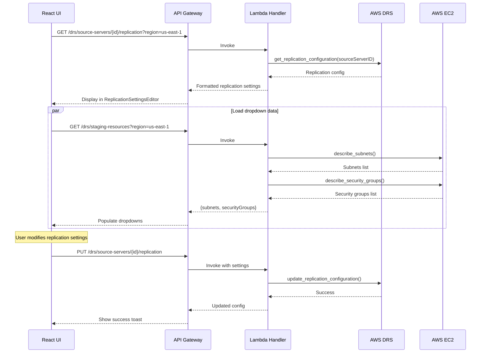
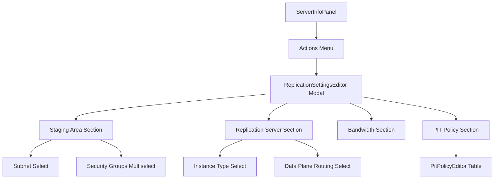

# DRS Replication Settings MVP - Implementation Plan

**Version:** 1.0  
**Date:** December 2025  
**Status:** Ready for Implementation  
**Estimated Effort:** 5-6 days  
**Dependencies:** MVP 1 (Server Info)

---

## Executive Summary

MVP implementation of replication configuration for DRS source servers. Configure staging area subnet, bandwidth throttling, point-in-time (PIT) policy, and replication server settings.

### MVP Scope

| Included | Excluded (Future) |
|----------|-------------------|
| View replication configuration | Bulk replication updates |
| Staging area subnet selection | Replication templates |
| Bandwidth throttling | Auto-optimization |
| PIT snapshot policy | Cost estimation |
| Replication server type | |
| Data plane routing | |

### Business Value

- **Network control**: Configure staging area in appropriate subnet
- **Bandwidth management**: Throttle replication to avoid network saturation
- **Recovery flexibility**: Configure PIT snapshots for point-in-time recovery
- **Performance tuning**: Select appropriate replication server instance type

---

## DRS Replication Configuration

### Replication Configuration Fields

| Field | Type | Description |
|-------|------|-------------|
| `stagingAreaSubnetId` | String | Subnet for staging area resources |
| `associateDefaultSecurityGroup` | Boolean | Associate default SG with staging |
| `replicationServersSecurityGroupsIDs` | Array | Security groups for replication servers |
| `replicationServerInstanceType` | String | EC2 instance type for replication server |
| `useDedicatedReplicationServer` | Boolean | Use dedicated vs shared replication server |
| `bandwidthThrottling` | Integer | Bandwidth limit in Mbps (0 = unlimited) |
| `dataPlaneRouting` | Enum | PRIVATE_IP or PUBLIC_IP |
| `createPublicIP` | Boolean | Create public IP for replication server |
| `ebsEncryption` | Enum | DEFAULT or CUSTOM |
| `ebsEncryptionKeyArn` | String | KMS key ARN for EBS encryption |
| `pitPolicy` | Array | Point-in-time snapshot retention rules |

### PIT Policy Structure

```json
{
  "pitPolicy": [
    {
      "interval": 10,
      "retentionDuration": 60,
      "units": "MINUTE",
      "enabled": true
    },
    {
      "interval": 1,
      "retentionDuration": 24,
      "units": "HOUR",
      "enabled": true
    },
    {
      "interval": 1,
      "retentionDuration": 7,
      "units": "DAY",
      "enabled": true
    }
  ]
}
```

### Replication Server Instance Types

| Type | vCPUs | Memory | Use Case |
|------|-------|--------|----------|
| t3.small | 2 | 2 GB | Small workloads (<5 servers) |
| t3.medium | 2 | 4 GB | Medium workloads (5-10 servers) |
| t3.large | 2 | 8 GB | Larger workloads (10-20 servers) |
| m5.large | 2 | 8 GB | High throughput |
| m5.xlarge | 4 | 16 GB | Very high throughput |

---

## Architecture

### Data Flow



### Component Hierarchy



---

## Implementation Plan

### Day 1-2: Backend API

#### API Endpoints

| Method | Endpoint | Description |
|--------|----------|-------------|
| GET | `/drs/source-servers/{id}/replication` | Get replication configuration |
| PUT | `/drs/source-servers/{id}/replication` | Update replication configuration |
| GET | `/drs/staging-resources?region={region}` | Get available subnets and security groups |

#### Lambda Handler - Get Replication Config

```python
def get_server_replication_settings(event: Dict) -> Dict:
    """Get replication settings for a DRS source server."""
    path_params = event.get('pathParameters', {})
    query_params = event.get('queryStringParameters', {})
    
    server_id = path_params.get('id')
    region = query_params.get('region', 'us-east-1')
    
    if not server_id:
        return response(400, {'error': 'Server ID is required'})
    
    try:
        drs_client = boto3.client('drs', region_name=region)
        
        config = drs_client.get_replication_configuration(
            sourceServerID=server_id
        )
        
        return response(200, {
            'sourceServerId': server_id,
            'stagingAreaSubnetId': config.get('stagingAreaSubnetId'),
            'associateDefaultSecurityGroup': config.get('associateDefaultSecurityGroup'),
            'replicationServersSecurityGroupsIDs': config.get('replicationServersSecurityGroupsIDs', []),
            'replicationServerInstanceType': config.get('replicationServerInstanceType'),
            'useDedicatedReplicationServer': config.get('useDedicatedReplicationServer'),
            'bandwidthThrottling': config.get('bandwidthThrottling', 0),
            'dataPlaneRouting': config.get('dataPlaneRouting'),
            'createPublicIP': config.get('createPublicIP'),
            'ebsEncryption': config.get('ebsEncryption'),
            'ebsEncryptionKeyArn': config.get('ebsEncryptionKeyArn'),
            'pitPolicy': config.get('pitPolicy', [])
        })
    except drs_client.exceptions.ResourceNotFoundException:
        return response(404, {'error': f'Server {server_id} not found'})
    except Exception as e:
        logger.error(f'Error getting replication settings: {str(e)}')
        return response(500, {'error': str(e)})
```

#### Lambda Handler - Update Replication Config

```python
def update_server_replication_settings(event: Dict) -> Dict:
    """Update replication settings for a DRS source server."""
    path_params = event.get('pathParameters', {})
    
    try:
        body = json.loads(event.get('body', '{}'))
    except json.JSONDecodeError:
        return response(400, {'error': 'Invalid JSON body'})
    
    server_id = path_params.get('id')
    region = body.get('region', 'us-east-1')
    
    if not server_id:
        return response(400, {'error': 'Server ID is required'})
    
    try:
        drs_client = boto3.client('drs', region_name=region)
        
        # Build update params
        update_params = {'sourceServerID': server_id}
        
        # Optional fields
        if 'stagingAreaSubnetId' in body:
            update_params['stagingAreaSubnetId'] = body['stagingAreaSubnetId']
        if 'associateDefaultSecurityGroup' in body:
            update_params['associateDefaultSecurityGroup'] = body['associateDefaultSecurityGroup']
        if 'replicationServersSecurityGroupsIDs' in body:
            update_params['replicationServersSecurityGroupsIDs'] = body['replicationServersSecurityGroupsIDs']
        if 'replicationServerInstanceType' in body:
            update_params['replicationServerInstanceType'] = body['replicationServerInstanceType']
        if 'useDedicatedReplicationServer' in body:
            update_params['useDedicatedReplicationServer'] = body['useDedicatedReplicationServer']
        if 'bandwidthThrottling' in body:
            update_params['bandwidthThrottling'] = body['bandwidthThrottling']
        if 'dataPlaneRouting' in body:
            update_params['dataPlaneRouting'] = body['dataPlaneRouting']
        if 'createPublicIP' in body:
            update_params['createPublicIP'] = body['createPublicIP']
        if 'ebsEncryption' in body:
            update_params['ebsEncryption'] = body['ebsEncryption']
        if 'ebsEncryptionKeyArn' in body:
            update_params['ebsEncryptionKeyArn'] = body['ebsEncryptionKeyArn']
        if 'pitPolicy' in body:
            update_params['pitPolicy'] = body['pitPolicy']
        
        drs_client.update_replication_configuration(**update_params)
        
        return response(200, {
            'sourceServerId': server_id,
            'message': 'Replication settings updated successfully'
        })
    except drs_client.exceptions.ResourceNotFoundException:
        return response(404, {'error': f'Server {server_id} not found'})
    except drs_client.exceptions.ValidationException as e:
        return response(400, {'error': f'Validation error: {str(e)}'})
    except Exception as e:
        logger.error(f'Error updating replication settings: {str(e)}')
        return response(500, {'error': str(e)})
```

#### Lambda Handler - Get Staging Resources

```python
def get_staging_resources(event: Dict) -> Dict:
    """Get available subnets and security groups for staging area."""
    query_params = event.get('queryStringParameters', {})
    region = query_params.get('region', 'us-east-1')
    
    try:
        ec2_client = boto3.client('ec2', region_name=region)
        
        # Get subnets
        subnets_response = ec2_client.describe_subnets()
        subnets = []
        for subnet in subnets_response.get('Subnets', []):
            name = next(
                (tag['Value'] for tag in subnet.get('Tags', []) if tag['Key'] == 'Name'),
                subnet['SubnetId']
            )
            subnets.append({
                'subnetId': subnet['SubnetId'],
                'name': name,
                'vpcId': subnet['VpcId'],
                'availabilityZone': subnet['AvailabilityZone'],
                'cidrBlock': subnet['CidrBlock']
            })
        
        # Get security groups
        sgs_response = ec2_client.describe_security_groups()
        security_groups = []
        for sg in sgs_response.get('SecurityGroups', []):
            security_groups.append({
                'groupId': sg['GroupId'],
                'groupName': sg['GroupName'],
                'vpcId': sg['VpcId'],
                'description': sg.get('Description', '')
            })
        
        return response(200, {
            'subnets': subnets,
            'securityGroups': security_groups
        })
    except Exception as e:
        logger.error(f'Error getting staging resources: {str(e)}')
        return response(500, {'error': str(e)})
```

#### IAM Permissions

```yaml
- Effect: Allow
  Action:
    - drs:GetReplicationConfiguration
    - drs:UpdateReplicationConfiguration
  Resource: '*'
- Effect: Allow
  Action:
    - ec2:DescribeSubnets
    - ec2:DescribeSecurityGroups
    - ec2:DescribeVpcs
  Resource: '*'
```

---

### Day 3-5: Frontend Component

#### ReplicationSettingsEditor Component

```typescript
import React, { useState, useEffect } from 'react';
import {
  Modal, Box, SpaceBetween, Button, FormField, Select, Input,
  Checkbox, Spinner, Alert, Header, ColumnLayout, Toggle,
  Multiselect, ExpandableSection
} from '@cloudscape-design/components';

interface ReplicationConfig {
  stagingAreaSubnetId: string;
  associateDefaultSecurityGroup: boolean;
  replicationServersSecurityGroupsIDs: string[];
  replicationServerInstanceType: string;
  useDedicatedReplicationServer: boolean;
  bandwidthThrottling: number;
  dataPlaneRouting: string;
  createPublicIP: boolean;
  ebsEncryption: string;
  ebsEncryptionKeyArn?: string;
  pitPolicy: PitRule[];
}

interface PitRule {
  interval: number;
  retentionDuration: number;
  units: string;
  enabled: boolean;
}

const INSTANCE_TYPES = [
  { value: 't3.small', label: 't3.small (2 vCPU, 2 GB)' },
  { value: 't3.medium', label: 't3.medium (2 vCPU, 4 GB)' },
  { value: 't3.large', label: 't3.large (2 vCPU, 8 GB)' },
  { value: 'm5.large', label: 'm5.large (2 vCPU, 8 GB)' },
  { value: 'm5.xlarge', label: 'm5.xlarge (4 vCPU, 16 GB)' }
];

const DATA_PLANE_OPTIONS = [
  { value: 'PRIVATE_IP', label: 'Private IP' },
  { value: 'PUBLIC_IP', label: 'Public IP' }
];

export const ReplicationSettingsEditor: React.FC<{
  visible: boolean;
  onDismiss: () => void;
  serverId: string;
  serverName: string;
  region: string;
}> = ({ visible, onDismiss, serverId, serverName, region }) => {
  const [config, setConfig] = useState<ReplicationConfig | null>(null);
  const [subnets, setSubnets] = useState<any[]>([]);
  const [securityGroups, setSecurityGroups] = useState<any[]>([]);
  const [loading, setLoading] = useState(true);
  const [saving, setSaving] = useState(false);
  const [error, setError] = useState<string | null>(null);

  useEffect(() => {
    if (visible) {
      loadData();
    }
  }, [visible, serverId]);

  const loadData = async () => {
    setLoading(true);
    setError(null);
    try {
      const [configData, resourcesData] = await Promise.all([
        getServerReplicationSettings(serverId, region),
        getStagingResources(region)
      ]);
      setConfig(configData);
      setSubnets(resourcesData.subnets);
      setSecurityGroups(resourcesData.securityGroups);
    } catch (err) {
      setError('Failed to load replication settings');
    } finally {
      setLoading(false);
    }
  };

  const handleSave = async () => {
    if (!config) return;
    setSaving(true);
    try {
      await updateServerReplicationSettings(serverId, region, config);
      toast.success('Replication settings saved');
      onDismiss();
    } catch (err) {
      setError('Failed to save replication settings');
    } finally {
      setSaving(false);
    }
  };

  const updateConfig = (field: string, value: any) => {
    if (config) {
      setConfig({ ...config, [field]: value });
    }
  };

  return (
    <Modal
      visible={visible}
      onDismiss={onDismiss}
      header={`Replication Settings: ${serverName}`}
      size="large"
      footer={
        <Box float="right">
          <SpaceBetween direction="horizontal" size="xs">
            <Button onClick={onDismiss}>Cancel</Button>
            <Button variant="primary" onClick={handleSave} loading={saving}>
              Save Changes
            </Button>
          </SpaceBetween>
        </Box>
      }
    >
      {loading ? (
        <Spinner size="large" />
      ) : error ? (
        <Alert type="error">{error}</Alert>
      ) : config && (
        <SpaceBetween direction="vertical" size="l">
          {/* Staging Area */}
          <ExpandableSection headerText="Staging Area" defaultExpanded>
            <ColumnLayout columns={2}>
              <FormField label="Staging Area Subnet">
                <Select
                  selectedOption={subnets.find(s => s.subnetId === config.stagingAreaSubnetId) 
                    ? { value: config.stagingAreaSubnetId, label: subnets.find(s => s.subnetId === config.stagingAreaSubnetId)?.name }
                    : null}
                  onChange={({ detail }) => updateConfig('stagingAreaSubnetId', detail.selectedOption?.value)}
                  options={subnets.map(s => ({ value: s.subnetId, label: `${s.name} (${s.cidrBlock})` }))}
                  placeholder="Select subnet"
                />
              </FormField>
              <FormField label="Security Groups">
                <Multiselect
                  selectedOptions={config.replicationServersSecurityGroupsIDs.map(id => {
                    const sg = securityGroups.find(s => s.groupId === id);
                    return { value: id, label: sg?.groupName || id };
                  })}
                  onChange={({ detail }) => updateConfig('replicationServersSecurityGroupsIDs', 
                    detail.selectedOptions.map(o => o.value))}
                  options={securityGroups.map(sg => ({ value: sg.groupId, label: sg.groupName }))}
                  placeholder="Select security groups"
                />
              </FormField>
            </ColumnLayout>
            <Checkbox
              checked={config.associateDefaultSecurityGroup}
              onChange={({ detail }) => updateConfig('associateDefaultSecurityGroup', detail.checked)}
            >
              Associate default security group
            </Checkbox>
          </ExpandableSection>

          {/* Replication Server */}
          <ExpandableSection headerText="Replication Server" defaultExpanded>
            <ColumnLayout columns={2}>
              <FormField label="Instance Type">
                <Select
                  selectedOption={INSTANCE_TYPES.find(t => t.value === config.replicationServerInstanceType)}
                  onChange={({ detail }) => updateConfig('replicationServerInstanceType', detail.selectedOption?.value)}
                  options={INSTANCE_TYPES}
                />
              </FormField>
              <FormField label="Data Plane Routing">
                <Select
                  selectedOption={DATA_PLANE_OPTIONS.find(o => o.value === config.dataPlaneRouting)}
                  onChange={({ detail }) => updateConfig('dataPlaneRouting', detail.selectedOption?.value)}
                  options={DATA_PLANE_OPTIONS}
                />
              </FormField>
            </ColumnLayout>
            <SpaceBetween direction="horizontal" size="l">
              <Checkbox
                checked={config.useDedicatedReplicationServer}
                onChange={({ detail }) => updateConfig('useDedicatedReplicationServer', detail.checked)}
              >
                Use dedicated replication server
              </Checkbox>
              <Checkbox
                checked={config.createPublicIP}
                onChange={({ detail }) => updateConfig('createPublicIP', detail.checked)}
              >
                Create public IP
              </Checkbox>
            </SpaceBetween>
          </ExpandableSection>

          {/* Bandwidth Throttling */}
          <ExpandableSection headerText="Bandwidth Throttling">
            <FormField 
              label="Bandwidth Limit (Mbps)" 
              description="Set to 0 for unlimited bandwidth"
            >
              <Input
                type="number"
                value={String(config.bandwidthThrottling)}
                onChange={({ detail }) => updateConfig('bandwidthThrottling', parseInt(detail.value) || 0)}
              />
            </FormField>
          </ExpandableSection>

          {/* Point-in-Time Policy */}
          <ExpandableSection headerText="Point-in-Time Snapshot Policy">
            <PitPolicyEditor
              pitPolicy={config.pitPolicy}
              onChange={(policy) => updateConfig('pitPolicy', policy)}
            />
          </ExpandableSection>
        </SpaceBetween>
      )}
    </Modal>
  );
};
```

#### PitPolicyEditor Sub-Component

```typescript
const PitPolicyEditor: React.FC<{
  pitPolicy: PitRule[];
  onChange: (policy: PitRule[]) => void;
}> = ({ pitPolicy, onChange }) => {
  const updateRule = (index: number, field: string, value: any) => {
    const updated = [...pitPolicy];
    updated[index] = { ...updated[index], [field]: value };
    onChange(updated);
  };

  return (
    <Table
      columnDefinitions={[
        {
          id: 'enabled',
          header: 'Enabled',
          cell: (item, index) => (
            <Toggle
              checked={item.enabled}
              onChange={({ detail }) => updateRule(index, 'enabled', detail.checked)}
            />
          ),
          width: 80
        },
        {
          id: 'interval',
          header: 'Interval',
          cell: (item, index) => (
            <Input
              type="number"
              value={String(item.interval)}
              onChange={({ detail }) => updateRule(index, 'interval', parseInt(detail.value))}
            />
          ),
          width: 100
        },
        {
          id: 'units',
          header: 'Units',
          cell: (item, index) => (
            <Select
              selectedOption={{ value: item.units, label: item.units }}
              onChange={({ detail }) => updateRule(index, 'units', detail.selectedOption?.value)}
              options={[
                { value: 'MINUTE', label: 'Minutes' },
                { value: 'HOUR', label: 'Hours' },
                { value: 'DAY', label: 'Days' }
              ]}
            />
          ),
          width: 120
        },
        {
          id: 'retention',
          header: 'Retention',
          cell: (item, index) => (
            <Input
              type="number"
              value={String(item.retentionDuration)}
              onChange={({ detail }) => updateRule(index, 'retentionDuration', parseInt(detail.value))}
            />
          ),
          width: 100
        }
      ]}
      items={pitPolicy}
    />
  );
};
```

---

### Day 6: Integration & Testing

#### Integration Points

1. Add "Replication Settings" button to ServerInfoPanel
2. Wire up API service functions
3. Test with various subnet/security group configurations
4. Validate PIT policy updates

---

## UI Wireframe

```
┌─────────────────────────────────────────────────────────────────────────────┐
│ Replication Settings: web-server-01                                  [X]    │
├─────────────────────────────────────────────────────────────────────────────┤
│                                                                             │
│ ▼ Staging Area                                                              │
│ ┌─────────────────────────────────────────────────────────────────────────┐ │
│ │ Staging Area Subnet          │ Security Groups                          │ │
│ │ [Private-Subnet-A (10.0.1 ▼] │ [sg-abc123 (drs-staging)          ▼]    │ │
│ │                              │ [sg-def456 (default)              ▼]    │ │
│ │                                                                         │ │
│ │ ☑ Associate default security group                                      │ │
│ └─────────────────────────────────────────────────────────────────────────┘ │
│                                                                             │
│ ▼ Replication Server                                                        │
│ ┌─────────────────────────────────────────────────────────────────────────┐ │
│ │ Instance Type                │ Data Plane Routing                       │ │
│ │ [t3.small (2 vCPU, 2 GB) ▼] │ [Private IP                         ▼]  │ │
│ │                                                                         │ │
│ │ ☑ Use dedicated replication server    ☐ Create public IP               │ │
│ └─────────────────────────────────────────────────────────────────────────┘ │
│                                                                             │
│ ▼ Bandwidth Throttling                                                      │
│ ┌─────────────────────────────────────────────────────────────────────────┐ │
│ │ Bandwidth Limit (Mbps)                                                  │ │
│ │ [0                    ]  (0 = unlimited)                                │ │
│ └─────────────────────────────────────────────────────────────────────────┘ │
│                                                                             │
│ ▼ Point-in-Time Snapshot Policy                                             │
│ ┌─────────────────────────────────────────────────────────────────────────┐ │
│ │ Enabled │ Interval │ Units   │ Retention                                │ │
│ ├─────────┼──────────┼─────────┼──────────────────────────────────────────┤ │
│ │   ☑     │ [10    ] │ [MIN ▼] │ [60    ] minutes                         │ │
│ │   ☑     │ [1     ] │ [HR  ▼] │ [24    ] hours                           │ │
│ │   ☑     │ [1     ] │ [DAY ▼] │ [7     ] days                            │ │
│ └─────────────────────────────────────────────────────────────────────────┘ │
│                                                                             │
├─────────────────────────────────────────────────────────────────────────────┤
│                                           [Cancel]  [Save Changes]          │
└─────────────────────────────────────────────────────────────────────────────┘
```

---

## Deployment Checklist

- [ ] Add Lambda handler functions
- [ ] Add IAM permissions for EC2 describe operations
- [ ] Add API Gateway endpoints
- [ ] Create ReplicationSettingsEditor component
- [ ] Create PitPolicyEditor sub-component
- [ ] Integrate with ServerInfoPanel
- [ ] Test all configuration options

---

## Future Enhancements

| Feature | Effort |
|---------|--------|
| Bulk replication configuration | 2-3 days |
| Replication templates | 2 days |
| Bandwidth optimization recommendations | 2 days |
| PIT policy presets | 1 day |
