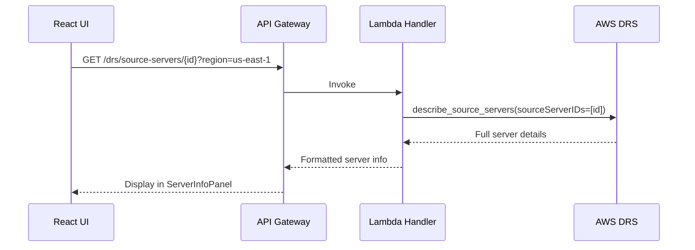

# DRS Server Info & Recovery Dashboard MVP - Implementation Plan

**Version:** 1.0  
**Date:** December 2025  
**Status:** Ready for Implementation  
**Estimated Effort:** 3-4 days  
**Dependencies:** None (Foundation MVP)

---

## Executive Summary

MVP implementation of a comprehensive Server Info & Recovery Dashboard view. This provides read-only visibility into DRS source server details, replication state, recovery readiness, and lifecycle information directly in the UI.

### MVP Scope

| Included | Excluded (Future) |
|----------|-------------------|
| Server details panel | Historical metrics |
| Replication status & progress | Alerting/notifications |
| Recovery readiness indicators | Automated health checks |
| Lifecycle state display | Multi-server comparison |
| Data replication lag | Export/reporting |
| Last recovery result | |

### Business Value

- **Single pane of glass**: View all server info without AWS Console
- **Recovery readiness**: Instant visibility into which servers are ready
- **Replication monitoring**: Track sync progress and lag times
- **Troubleshooting**: Quick access to server state for issue diagnosis

---

## DRS Source Server Data Model

### Key Fields from DescribeSourceServers API

| Field | Type | Description |
|-------|------|-------------|
| `sourceServerID` | String | Unique server identifier (s-xxx) |
| `arn` | String | Server ARN |
| `hostname` | String | Source server hostname |
| `isArchived` | Boolean | Whether server is archived |
| `lifeCycle` | Object | Lifecycle state and timestamps |
| `dataReplicationInfo` | Object | Replication status and progress |
| `sourceProperties` | Object | OS, CPU, RAM, disks, network |
| `replicationDirection` | String | FAILOVER or FAILBACK |
| `reversedDirectionSourceServerArn` | String | ARN if reversed |
| `lastLaunchResult` | String | Last recovery result |
| `tags` | Object | Resource tags |

### Lifecycle States

| State | Description |
|-------|-------------|
| `STOPPED` | Replication stopped |
| `NOT_READY` | Agent installed, not ready |
| `READY_FOR_TEST` | Ready for drill |
| `READY_FOR_CUTOVER` | Ready for recovery |
| `CUTTING_OVER` | Recovery in progress |
| `DISCONNECTED` | Agent disconnected |

### Data Replication States

| State | Description |
|-------|-------------|
| `STOPPED` | Replication stopped |
| `INITIATING` | Initial sync starting |
| `INITIAL_SYNC` | Initial sync in progress |
| `BACKLOG` | Catching up backlog |
| `CREATING_SNAPSHOT` | Creating snapshot |
| `CONTINUOUS` | Continuous replication active |
| `PAUSED` | Replication paused |
| `RESCAN` | Rescanning disks |
| `STALLED` | Replication stalled |
| `DISCONNECTED` | Agent disconnected |

---

## Architecture

### Data Flow



---

## Implementation Plan

### Day 1: Backend API

#### New API Endpoint

| Method | Endpoint | Description |
|--------|----------|-------------|
| GET | `/drs/source-servers/{id}` | Get detailed server info |

#### Lambda Handler

Add to `lambda/index.py`:

```python
def get_source_server_details(event: Dict) -> Dict:
    """Get detailed DRS source server information."""
    path_params = event.get('pathParameters', {})
    query_params = event.get('queryStringParameters', {})
    
    server_id = path_params.get('id')
    region = query_params.get('region', 'us-east-1')
    
    if not server_id:
        return response(400, {'error': 'Server ID is required'})
    
    try:
        drs_client = boto3.client('drs', region_name=region)
        
        result = drs_client.describe_source_servers(
            filters={'sourceServerIDs': [server_id]}
        )
        
        if not result.get('items'):
            return response(404, {'error': f'Server {server_id} not found'})
        
        server = result['items'][0]
        
        # Format response
        return response(200, {
            'sourceServerId': server.get('sourceServerID'),
            'arn': server.get('arn'),
            'hostname': server.get('sourceProperties', {}).get('identificationHints', {}).get('hostname'),
            'isArchived': server.get('isArchived', False),
            'replicationDirection': server.get('replicationDirection'),
            
            # Lifecycle info
            'lifeCycle': {
                'state': server.get('lifeCycle', {}).get('state'),
                'lastSeenByServiceDateTime': server.get('lifeCycle', {}).get('lastSeenByServiceDateTime'),
                'lastTestDateTime': server.get('lifeCycle', {}).get('lastTest', {}).get('initiatedDateTime'),
                'lastCutoverDateTime': server.get('lifeCycle', {}).get('lastCutover', {}).get('initiatedDateTime'),
                'addedToServiceDateTime': server.get('lifeCycle', {}).get('addedToServiceDateTime'),
                'elapsedReplicationDuration': server.get('lifeCycle', {}).get('elapsedReplicationDuration')
            },
            
            # Replication info
            'dataReplicationInfo': {
                'state': server.get('dataReplicationInfo', {}).get('dataReplicationState'),
                'lagDuration': server.get('dataReplicationInfo', {}).get('lagDuration'),
                'etaDateTime': server.get('dataReplicationInfo', {}).get('etaDateTime'),
                'replicatedDisks': server.get('dataReplicationInfo', {}).get('replicatedDisks', []),
                'lastSnapshotDateTime': server.get('dataReplicationInfo', {}).get('lastSnapshotDateTime')
            },
            
            # Source properties
            'sourceProperties': {
                'os': server.get('sourceProperties', {}).get('os', {}),
                'cpus': server.get('sourceProperties', {}).get('cpus', []),
                'ramBytes': server.get('sourceProperties', {}).get('ramBytes'),
                'disks': server.get('sourceProperties', {}).get('disks', []),
                'networkInterfaces': server.get('sourceProperties', {}).get('networkInterfaces', []),
                'recommendedInstanceType': server.get('sourceProperties', {}).get('recommendedInstanceType')
            },
            
            # Recovery info
            'lastLaunchResult': server.get('lastLaunchResult'),
            'recoveryInstanceId': server.get('recoveryInstanceId'),
            
            # Tags
            'tags': server.get('tags', {})
        })
        
    except drs_client.exceptions.UninitializedAccountException:
        return response(400, {'error': f'DRS not initialized in {region}'})
    except Exception as e:
        logger.error(f'Error getting server details: {str(e)}')
        return response(500, {'error': str(e)})
```

#### Route Handler

```python
# Match pattern: /drs/source-servers/{id}
elif path.startswith('/drs/source-servers/') and method == 'GET':
    return get_source_server_details(event)
```

---

### Day 2: Frontend - Types & API Service

#### TypeScript Types

Add to `frontend/src/types/index.ts`:

```typescript
export interface SourceServerDetails {
  sourceServerId: string;
  arn: string;
  hostname: string;
  isArchived: boolean;
  replicationDirection: 'FAILOVER' | 'FAILBACK';
  lifeCycle: LifeCycleInfo;
  dataReplicationInfo: DataReplicationInfo;
  sourceProperties: SourceProperties;
  lastLaunchResult: string;
  recoveryInstanceId?: string;
  tags: Record<string, string>;
}

export interface LifeCycleInfo {
  state: LifeCycleState;
  lastSeenByServiceDateTime?: string;
  lastTestDateTime?: string;
  lastCutoverDateTime?: string;
  addedToServiceDateTime?: string;
  elapsedReplicationDuration?: string;
}

export type LifeCycleState = 
  | 'STOPPED'
  | 'NOT_READY'
  | 'READY_FOR_TEST'
  | 'READY_FOR_CUTOVER'
  | 'CUTTING_OVER'
  | 'DISCONNECTED';

export interface DataReplicationInfo {
  state: DataReplicationState;
  lagDuration?: string;
  etaDateTime?: string;
  replicatedDisks: ReplicatedDisk[];
  lastSnapshotDateTime?: string;
}

export type DataReplicationState =
  | 'STOPPED'
  | 'INITIATING'
  | 'INITIAL_SYNC'
  | 'BACKLOG'
  | 'CREATING_SNAPSHOT'
  | 'CONTINUOUS'
  | 'PAUSED'
  | 'RESCAN'
  | 'STALLED'
  | 'DISCONNECTED';

export interface ReplicatedDisk {
  deviceName: string;
  totalStorageBytes: number;
  replicatedStorageBytes: number;
  rescannedStorageBytes: number;
  backloggedStorageBytes: number;
}

export interface SourceProperties {
  os: {
    fullString?: string;
  };
  cpus: Array<{ cores: number; modelName: string }>;
  ramBytes: number;
  disks: Array<{ deviceName: string; bytes: number }>;
  networkInterfaces: Array<{ macAddress: string; ips: string[] }>;
  recommendedInstanceType?: string;
}
```

#### API Service

Add to `frontend/src/services/api.ts`:

```typescript
export const getSourceServerDetails = async (
  serverId: string,
  region: string
): Promise<SourceServerDetails> => {
  const response = await apiClient.get(`/drs/source-servers/${serverId}`, {
    params: { region }
  });
  return response.data;
};
```

---

### Day 3-4: Frontend - ServerInfoPanel Component

Create `frontend/src/components/ServerInfoPanel.tsx`:

```typescript
import React, { useState, useEffect } from 'react';
import {
  Container,
  Header,
  SpaceBetween,
  Box,
  ColumnLayout,
  StatusIndicator,
  ProgressBar,
  Badge,
  Spinner,
  Alert,
  KeyValuePairs,
  Tabs
} from '@cloudscape-design/components';
import { SourceServerDetails } from '../types';
import { getSourceServerDetails } from '../services/api';
import { formatDistanceToNow, format } from 'date-fns';

interface ServerInfoPanelProps {
  serverId: string;
  region: string;
  onClose?: () => void;
}

export const ServerInfoPanel: React.FC<ServerInfoPanelProps> = ({
  serverId,
  region,
  onClose
}) => {
  const [server, setServer] = useState<SourceServerDetails | null>(null);
  const [loading, setLoading] = useState(true);
  const [error, setError] = useState<string | null>(null);

  useEffect(() => {
    loadServerDetails();
  }, [serverId, region]);

  const loadServerDetails = async () => {
    setLoading(true);
    setError(null);
    try {
      const data = await getSourceServerDetails(serverId, region);
      setServer(data);
    } catch (err: any) {
      setError(err.response?.data?.error || 'Failed to load server details');
    } finally {
      setLoading(false);
    }
  };

  const getLifeCycleStatus = (state: string) => {
    const statusMap: Record<string, { type: any; label: string }> = {
      'READY_FOR_TEST': { type: 'success', label: 'Ready for Test' },
      'READY_FOR_CUTOVER': { type: 'success', label: 'Ready for Cutover' },
      'CONTINUOUS': { type: 'success', label: 'Replicating' },
      'INITIAL_SYNC': { type: 'in-progress', label: 'Initial Sync' },
      'CUTTING_OVER': { type: 'in-progress', label: 'Cutting Over' },
      'STALLED': { type: 'error', label: 'Stalled' },
      'DISCONNECTED': { type: 'error', label: 'Disconnected' },
      'STOPPED': { type: 'stopped', label: 'Stopped' }
    };
    return statusMap[state] || { type: 'info', label: state };
  };

  const formatBytes = (bytes: number) => {
    if (bytes === 0) return '0 B';
    const k = 1024;
    const sizes = ['B', 'KB', 'MB', 'GB', 'TB'];
    const i = Math.floor(Math.log(bytes) / Math.log(k));
    return parseFloat((bytes / Math.pow(k, i)).toFixed(2)) + ' ' + sizes[i];
  };

  if (loading) {
    return (
      <Container>
        <Box textAlign="center" padding="xxl">
          <Spinner size="large" />
        </Box>
      </Container>
    );
  }

  if (error) {
    return (
      <Alert type="error" header="Error loading server details">
        {error}
      </Alert>
    );
  }

  if (!server) return null;

  const lifeCycleStatus = getLifeCycleStatus(server.lifeCycle.state);
  const replicationStatus = getLifeCycleStatus(server.dataReplicationInfo.state);

  return (
    <SpaceBetween direction="vertical" size="l">
      {/* Recovery Readiness Header */}
      <Container
        header={
          <Header variant="h2" description={server.sourceServerId}>
            {server.hostname}
          </Header>
        }
      >
        <ColumnLayout columns={4} variant="text-grid">
          <div>
            <Box variant="awsui-key-label">Lifecycle State</Box>
            <StatusIndicator type={lifeCycleStatus.type}>
              {lifeCycleStatus.label}
            </StatusIndicator>
          </div>
          <div>
            <Box variant="awsui-key-label">Replication State</Box>
            <StatusIndicator type={replicationStatus.type}>
              {replicationStatus.label}
            </StatusIndicator>
          </div>
          <div>
            <Box variant="awsui-key-label">Last Recovery</Box>
            <Badge color={server.lastLaunchResult === 'SUCCEEDED' ? 'green' : 'red'}>
              {server.lastLaunchResult || 'Never'}
            </Badge>
          </div>
          <div>
            <Box variant="awsui-key-label">Replication Lag</Box>
            {server.dataReplicationInfo.lagDuration || 'N/A'}
          </div>
        </ColumnLayout>
      </Container>

      <Tabs
        tabs={[
          {
            id: 'overview',
            label: 'Overview',
            content: (
              <Container header={<Header variant="h3">Server Details</Header>}>
                <KeyValuePairs
                  columns={2}
                  items={[
                    { label: 'Server ID', value: server.sourceServerId },
                    { label: 'Hostname', value: server.hostname },
                    { label: 'Operating System', value: server.sourceProperties.os.fullString || 'Unknown' },
                    { label: 'Recommended Instance', value: server.sourceProperties.recommendedInstanceType || 'N/A' },
                    { label: 'RAM', value: formatBytes(server.sourceProperties.ramBytes || 0) },
                    { label: 'CPUs', value: server.sourceProperties.cpus?.map(c => `${c.cores} cores`).join(', ') || 'N/A' },
                    { label: 'Added to Service', value: server.lifeCycle.addedToServiceDateTime ? format(new Date(server.lifeCycle.addedToServiceDateTime), 'PPpp') : 'N/A' },
                    { label: 'Last Seen', value: server.lifeCycle.lastSeenByServiceDateTime ? formatDistanceToNow(new Date(server.lifeCycle.lastSeenByServiceDateTime), { addSuffix: true }) : 'N/A' }
                  ]}
                />
              </Container>
            )
          },
          {
            id: 'replication',
            label: 'Replication',
            content: (
              <Container header={<Header variant="h3">Replication Status</Header>}>
                <SpaceBetween direction="vertical" size="m">
                  <KeyValuePairs
                    columns={2}
                    items={[
                      { label: 'State', value: <StatusIndicator type={replicationStatus.type}>{replicationStatus.label}</StatusIndicator> },
                      { label: 'Lag Duration', value: server.dataReplicationInfo.lagDuration || 'N/A' },
                      { label: 'ETA', value: server.dataReplicationInfo.etaDateTime ? format(new Date(server.dataReplicationInfo.etaDateTime), 'PPpp') : 'N/A' },
                      { label: 'Last Snapshot', value: server.dataReplicationInfo.lastSnapshotDateTime ? format(new Date(server.dataReplicationInfo.lastSnapshotDateTime), 'PPpp') : 'N/A' }
                    ]}
                  />
                  
                  <Header variant="h4">Disk Replication Progress</Header>
                  {server.dataReplicationInfo.replicatedDisks.map((disk, idx) => (
                    <div key={idx}>
                      <Box variant="awsui-key-label">{disk.deviceName}</Box>
                      <ProgressBar
                        value={(disk.replicatedStorageBytes / disk.totalStorageBytes) * 100}
                        description={`${formatBytes(disk.replicatedStorageBytes)} / ${formatBytes(disk.totalStorageBytes)}`}
                        status={disk.backloggedStorageBytes > 0 ? 'in-progress' : 'success'}
                      />
                    </div>
                  ))}
                </SpaceBetween>
              </Container>
            )
          },
          {
            id: 'network',
            label: 'Network',
            content: (
              <Container header={<Header variant="h3">Network Interfaces</Header>}>
                <SpaceBetween direction="vertical" size="s">
                  {server.sourceProperties.networkInterfaces.map((nic, idx) => (
                    <KeyValuePairs
                      key={idx}
                      columns={2}
                      items={[
                        { label: 'MAC Address', value: nic.macAddress },
                        { label: 'IP Addresses', value: nic.ips?.join(', ') || 'N/A' }
                      ]}
                    />
                  ))}
                </SpaceBetween>
              </Container>
            )
          },
          {
            id: 'disks',
            label: 'Disks',
            content: (
              <Container header={<Header variant="h3">Source Disks</Header>}>
                <SpaceBetween direction="vertical" size="s">
                  {server.sourceProperties.disks.map((disk, idx) => (
                    <KeyValuePairs
                      key={idx}
                      columns={2}
                      items={[
                        { label: 'Device', value: disk.deviceName },
                        { label: 'Size', value: formatBytes(disk.bytes) }
                      ]}
                    />
                  ))}
                </SpaceBetween>
              </Container>
            )
          }
        ]}
      />
    </SpaceBetween>
  );
};

export default ServerInfoPanel;
```

---

## Deployment Checklist

### Backend
- [ ] Add `get_source_server_details` function to `lambda/index.py`
- [ ] Add route handling for `/drs/source-servers/{id}`
- [ ] Add API Gateway resource and method
- [ ] Deploy and test

### Frontend
- [ ] Add TypeScript types for server details
- [ ] Add API service function
- [ ] Create `ServerInfoPanel` component
- [ ] Integrate with ProtectionGroupsPage (view button)
- [ ] Build and deploy

---

## UI Mockup

```text
┌─────────────────────────────────────────────────────────────────────┐
│ web-server-01                                                       │
│ s-0abc123def456789                                                  │
├─────────────────────────────────────────────────────────────────────┤
│                                                                     │
│ Lifecycle State    Replication State    Last Recovery    Lag       │
│ ● Ready for Test   ● Replicating        ✓ SUCCEEDED      00:00:05  │
│                                                                     │
├─────────────────────────────────────────────────────────────────────┤
│ [Overview] [Replication] [Network] [Disks]                          │
├─────────────────────────────────────────────────────────────────────┤
│                                                                     │
│ Server Details                                                      │
│ ┌─────────────────────────────┬─────────────────────────────┐      │
│ │ Server ID                   │ s-0abc123def456789          │      │
│ │ Hostname                    │ web-server-01               │      │
│ │ Operating System            │ Ubuntu 22.04 LTS            │      │
│ │ Recommended Instance        │ t3.medium                   │      │
│ │ RAM                         │ 8 GB                        │      │
│ │ CPUs                        │ 4 cores                     │      │
│ │ Added to Service            │ Dec 1, 2025, 10:30 AM       │      │
│ │ Last Seen                   │ 2 minutes ago               │      │
│ └─────────────────────────────┴─────────────────────────────┘      │
│                                                                     │
└─────────────────────────────────────────────────────────────────────┘
```

---

## Future Enhancements

| Feature | Priority | Effort |
|---------|----------|--------|
| Auto-refresh (30s interval) | High | 0.5 days |
| Recovery history timeline | Medium | 1-2 days |
| Export server report | Low | 1 day |
| Multi-server comparison | Low | 2-3 days |
