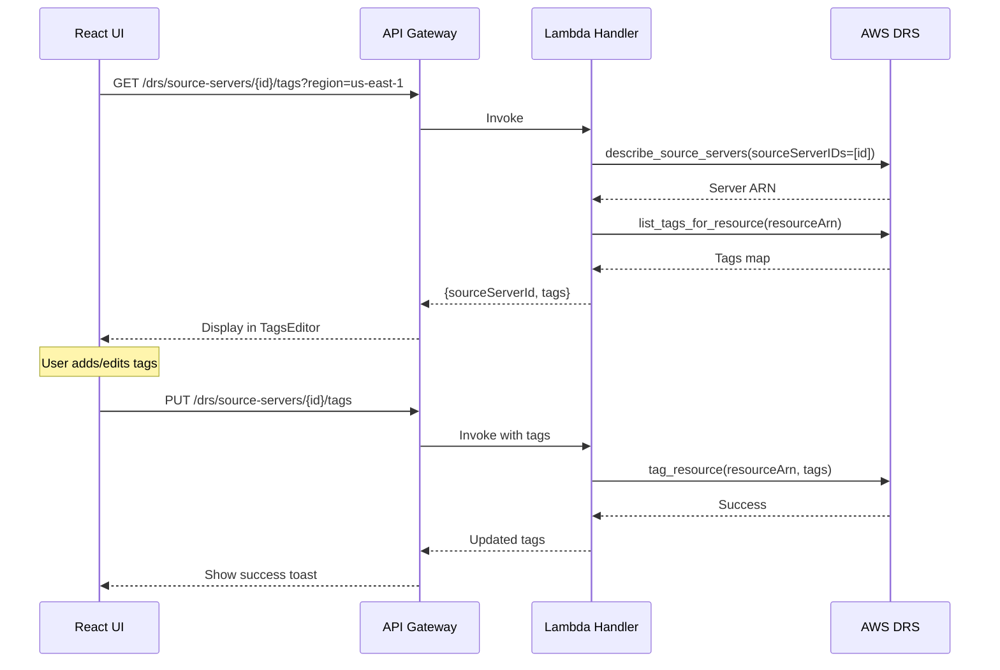
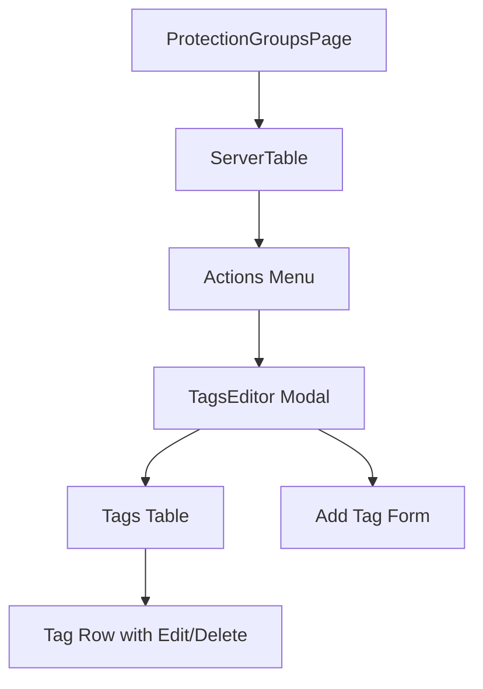

# DRS Tags Management MVP - Implementation Plan

**Version:** 1.0  
**Date:** December 2025  
**Status:** Ready for Implementation  
**Estimated Effort:** 3-4 days  
**Dependencies:** MVP 1 (Server Info)

---

## Executive Summary

MVP implementation of DRS source server tag management. View, add, edit, and delete tags directly from the UI without navigating to AWS Console.

### MVP Scope

| Included | Excluded (Future) |
|----------|-------------------|
| View server tags | Bulk tag operations |
| Add new tags | Tag templates |
| Edit existing tags | Tag-based filtering |
| Delete tags | Tag sync from EC2 |
| Tag validation | Tag policies |

### Business Value

- **Organize servers**: Tag servers for grouping and identification
- **Cost allocation**: Apply cost center tags for billing
- **Automation**: Tags used by automation scripts and policies

---

## Architecture

### Data Flow



### Component Hierarchy



---

## DRS Tags API

### API Operations

| Operation | API | Description |
|-----------|-----|-------------|
| List Tags | `ListTagsForResource` | Get all tags for a server |
| Add Tags | `TagResource` | Add one or more tags |
| Remove Tags | `UntagResource` | Remove tags by key |

### Tag Constraints

- Max 50 tags per resource
- Key: 1-128 characters, no `aws:` prefix
- Value: 0-256 characters
- Case-sensitive

---

## Implementation Plan

### Day 1: Backend API

#### API Endpoints

| Method | Endpoint | Description |
|--------|----------|-------------|
| GET | `/drs/source-servers/{id}/tags` | List tags |
| PUT | `/drs/source-servers/{id}/tags` | Add/update tags |
| DELETE | `/drs/source-servers/{id}/tags` | Remove tags |

#### Lambda Handler

```python
def get_server_tags(event: Dict) -> Dict:
    """Get tags for a DRS source server."""
    path_params = event.get('pathParameters', {})
    query_params = event.get('queryStringParameters', {})
    
    server_id = path_params.get('id')
    region = query_params.get('region', 'us-east-1')
    
    if not server_id:
        return response(400, {'error': 'Server ID is required'})
    
    try:
        drs_client = boto3.client('drs', region_name=region)
        
        # Get server ARN first
        servers = drs_client.describe_source_servers(
            filters={'sourceServerIDs': [server_id]}
        )
        if not servers.get('items'):
            return response(404, {'error': f'Server {server_id} not found'})
        
        server_arn = servers['items'][0]['arn']
        
        # Get tags
        result = drs_client.list_tags_for_resource(resourceArn=server_arn)
        
        return response(200, {
            'sourceServerId': server_id,
            'tags': result.get('tags', {})
        })
    except Exception as e:
        logger.error(f'Error getting tags: {str(e)}')
        return response(500, {'error': str(e)})


def update_server_tags(event: Dict) -> Dict:
    """Add or update tags for a DRS source server."""
    path_params = event.get('pathParameters', {})
    
    try:
        body = json.loads(event.get('body', '{}'))
    except json.JSONDecodeError:
        return response(400, {'error': 'Invalid JSON body'})
    
    server_id = path_params.get('id')
    region = body.get('region', 'us-east-1')
    tags = body.get('tags', {})
    
    if not server_id:
        return response(400, {'error': 'Server ID is required'})
    if not tags:
        return response(400, {'error': 'Tags are required'})
    
    # Validate tags
    for key, value in tags.items():
        if key.startswith('aws:'):
            return response(400, {'error': 'Tag keys cannot start with aws:'})
        if len(key) > 128:
            return response(400, {'error': f'Tag key "{key}" exceeds 128 characters'})
        if len(value) > 256:
            return response(400, {'error': f'Tag value for "{key}" exceeds 256 characters'})
    
    try:
        drs_client = boto3.client('drs', region_name=region)
        
        # Get server ARN
        servers = drs_client.describe_source_servers(
            filters={'sourceServerIDs': [server_id]}
        )
        if not servers.get('items'):
            return response(404, {'error': f'Server {server_id} not found'})
        
        server_arn = servers['items'][0]['arn']
        
        # Add tags
        drs_client.tag_resource(resourceArn=server_arn, tags=tags)
        
        # Return updated tags
        result = drs_client.list_tags_for_resource(resourceArn=server_arn)
        
        return response(200, {
            'sourceServerId': server_id,
            'tags': result.get('tags', {}),
            'message': 'Tags updated successfully'
        })
    except Exception as e:
        logger.error(f'Error updating tags: {str(e)}')
        return response(500, {'error': str(e)})


def delete_server_tags(event: Dict) -> Dict:
    """Remove tags from a DRS source server."""
    path_params = event.get('pathParameters', {})
    
    try:
        body = json.loads(event.get('body', '{}'))
    except json.JSONDecodeError:
        return response(400, {'error': 'Invalid JSON body'})
    
    server_id = path_params.get('id')
    region = body.get('region', 'us-east-1')
    tag_keys = body.get('tagKeys', [])
    
    if not server_id:
        return response(400, {'error': 'Server ID is required'})
    if not tag_keys:
        return response(400, {'error': 'Tag keys are required'})
    
    try:
        drs_client = boto3.client('drs', region_name=region)
        
        # Get server ARN
        servers = drs_client.describe_source_servers(
            filters={'sourceServerIDs': [server_id]}
        )
        if not servers.get('items'):
            return response(404, {'error': f'Server {server_id} not found'})
        
        server_arn = servers['items'][0]['arn']
        
        # Remove tags
        drs_client.untag_resource(resourceArn=server_arn, tagKeys=tag_keys)
        
        # Return updated tags
        result = drs_client.list_tags_for_resource(resourceArn=server_arn)
        
        return response(200, {
            'sourceServerId': server_id,
            'tags': result.get('tags', {}),
            'message': 'Tags removed successfully'
        })
    except Exception as e:
        logger.error(f'Error removing tags: {str(e)}')
        return response(500, {'error': str(e)})
```

#### IAM Permissions

```yaml
- Effect: Allow
  Action:
    - drs:ListTagsForResource
    - drs:TagResource
    - drs:UntagResource
  Resource: '*'
```

---

### Day 2-3: Frontend Component

#### TypeScript Types

```typescript
export interface ServerTags {
  sourceServerId: string;
  tags: Record<string, string>;
}

export interface TagEditorItem {
  key: string;
  value: string;
  existing?: boolean;
}
```

#### TagsEditor Component

Create `frontend/src/components/TagsEditor.tsx`:

```typescript
import React, { useState, useEffect } from 'react';
import {
  Modal,
  Box,
  SpaceBetween,
  Button,
  Table,
  Input,
  Spinner,
  Alert,
  Header
} from '@cloudscape-design/components';
import { getServerTags, updateServerTags, deleteServerTags } from '../services/api';
import toast from 'react-hot-toast';

interface TagsEditorProps {
  visible: boolean;
  onDismiss: () => void;
  serverId: string;
  serverName: string;
  region: string;
}

interface TagItem {
  key: string;
  value: string;
  isNew?: boolean;
}

export const TagsEditor: React.FC<TagsEditorProps> = ({
  visible,
  onDismiss,
  serverId,
  serverName,
  region
}) => {
  const [tags, setTags] = useState<TagItem[]>([]);
  const [loading, setLoading] = useState(true);
  const [saving, setSaving] = useState(false);
  const [error, setError] = useState<string | null>(null);
  const [newKey, setNewKey] = useState('');
  const [newValue, setNewValue] = useState('');

  useEffect(() => {
    if (visible && serverId) {
      loadTags();
    }
  }, [visible, serverId]);

  const loadTags = async () => {
    setLoading(true);
    setError(null);
    try {
      const data = await getServerTags(serverId, region);
      const tagItems = Object.entries(data.tags).map(([key, value]) => ({
        key,
        value: value as string,
        isNew: false
      }));
      setTags(tagItems);
    } catch (err: any) {
      setError(err.response?.data?.error || 'Failed to load tags');
    } finally {
      setLoading(false);
    }
  };

  const handleAddTag = () => {
    if (!newKey.trim()) {
      toast.error('Tag key is required');
      return;
    }
    if (newKey.startsWith('aws:')) {
      toast.error('Tag keys cannot start with aws:');
      return;
    }
    if (tags.some(t => t.key === newKey)) {
      toast.error('Tag key already exists');
      return;
    }
    
    setTags([...tags, { key: newKey, value: newValue, isNew: true }]);
    setNewKey('');
    setNewValue('');
  };

  const handleRemoveTag = (key: string) => {
    setTags(tags.filter(t => t.key !== key));
  };

  const handleUpdateValue = (key: string, value: string) => {
    setTags(tags.map(t => t.key === key ? { ...t, value } : t));
  };

  const handleSave = async () => {
    setSaving(true);
    try {
      // Build tags object
      const tagsToSave: Record<string, string> = {};
      tags.forEach(t => {
        tagsToSave[t.key] = t.value;
      });
      
      await updateServerTags(serverId, region, tagsToSave);
      toast.success('Tags saved successfully');
      onDismiss();
    } catch (err: any) {
      toast.error(err.response?.data?.error || 'Failed to save tags');
    } finally {
      setSaving(false);
    }
  };

  return (
    <Modal
      visible={visible}
      onDismiss={onDismiss}
      header={`Tags: ${serverName}`}
      size="large"
      footer={
        <Box float="right">
          <SpaceBetween direction="horizontal" size="xs">
            <Button onClick={onDismiss}>Cancel</Button>
            <Button variant="primary" onClick={handleSave} loading={saving}>
              Save Tags
            </Button>
          </SpaceBetween>
        </Box>
      }
    >
      {loading ? (
        <Box textAlign="center" padding="xxl"><Spinner size="large" /></Box>
      ) : error ? (
        <Alert type="error">{error}</Alert>
      ) : (
        <SpaceBetween direction="vertical" size="l">
          <Table
            columnDefinitions={[
              { id: 'key', header: 'Key', cell: item => item.key, width: 200 },
              { 
                id: 'value', 
                header: 'Value', 
                cell: item => (
                  <Input
                    value={item.value}
                    onChange={({ detail }) => handleUpdateValue(item.key, detail.value)}
                  />
                )
              },
              {
                id: 'actions',
                header: 'Actions',
                cell: item => (
                  <Button
                    iconName="remove"
                    variant="icon"
                    onClick={() => handleRemoveTag(item.key)}
                  />
                ),
                width: 80
              }
            ]}
            items={tags}
            empty="No tags"
          />
          
          <Header variant="h4">Add New Tag</Header>
          <SpaceBetween direction="horizontal" size="s">
            <Input
              value={newKey}
              onChange={({ detail }) => setNewKey(detail.value)}
              placeholder="Key"
            />
            <Input
              value={newValue}
              onChange={({ detail }) => setNewValue(detail.value)}
              placeholder="Value"
            />
            <Button onClick={handleAddTag}>Add</Button>
          </SpaceBetween>
        </SpaceBetween>
      )}
    </Modal>
  );
};
```

---

## UI Wireframe

```
┌─────────────────────────────────────────────────────────────────────┐
│ Tags: web-server-01                                          [X]    │
├─────────────────────────────────────────────────────────────────────┤
│                                                                     │
│ ┌─────────────────────────────────────────────────────────────────┐ │
│ │ Key                    │ Value                      │ Actions   │ │
│ ├────────────────────────┼────────────────────────────┼───────────┤ │
│ │ Environment            │ [Production        ]       │   [🗑]    │ │
│ │ CostCenter             │ [CC-12345          ]       │   [🗑]    │ │
│ │ Application            │ [WebApp            ]       │   [🗑]    │ │
│ │ Owner                  │ [devops-team       ]       │   [🗑]    │ │
│ └────────────────────────┴────────────────────────────┴───────────┘ │
│                                                                     │
│ ── Add New Tag ─────────────────────────────────────────────────── │
│                                                                     │
│ Key: [_______________]  Value: [_______________]  [Add Tag]         │
│                                                                     │
│ ℹ️ Tags cannot start with "aws:" prefix. Max 50 tags per server.    │
│                                                                     │
├─────────────────────────────────────────────────────────────────────┤
│                                        [Cancel]  [Save Tags]        │
└─────────────────────────────────────────────────────────────────────┘
```

---

## Deployment Checklist

- [ ] Add Lambda handler functions
- [ ] Add IAM permissions
- [ ] Add API Gateway endpoints
- [ ] Create TagsEditor component
- [ ] Integrate with ServerInfoPanel
- [ ] Test all operations

---

## Future Enhancements

| Feature | Effort |
|---------|--------|
| Bulk tag operations | 2 days |
| Tag templates | 1-2 days |
| Tag-based server filtering | 1 day |
