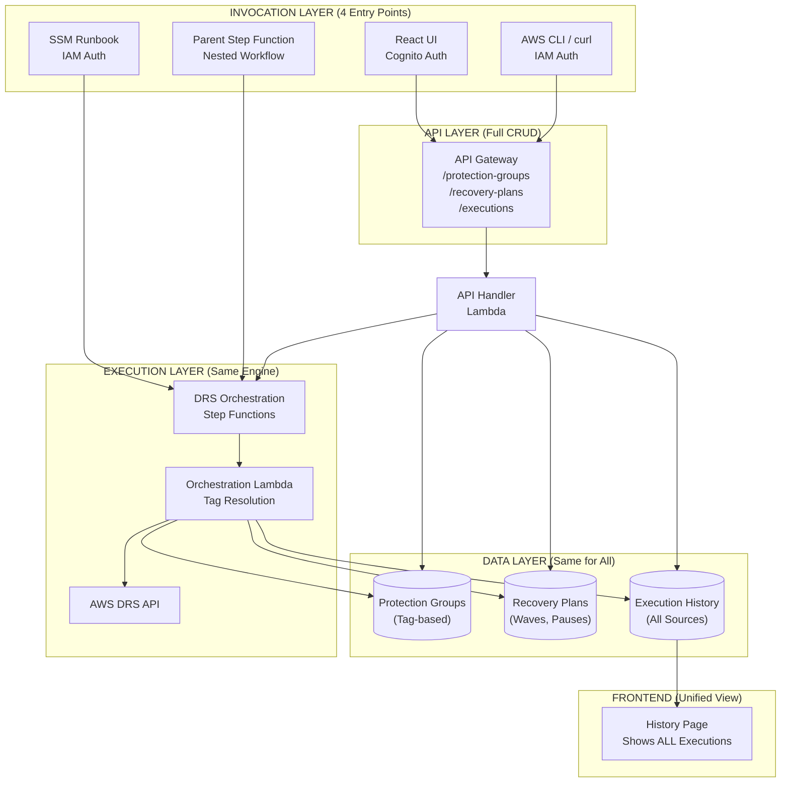
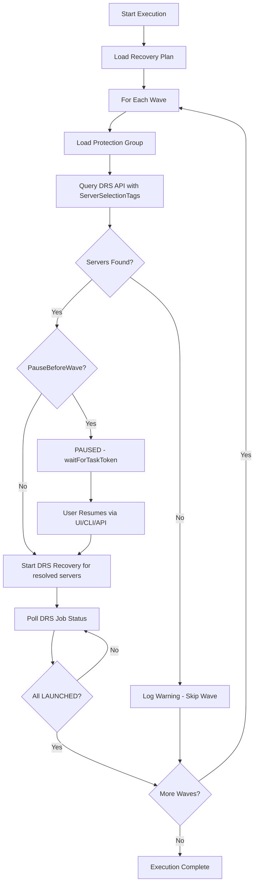
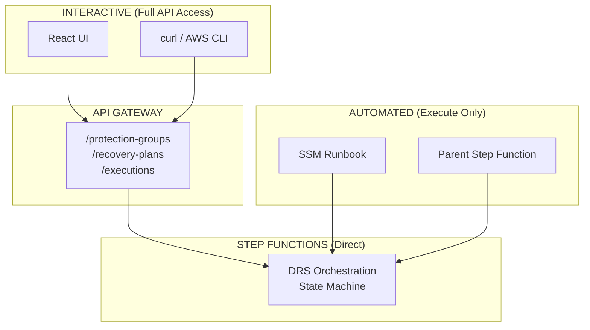
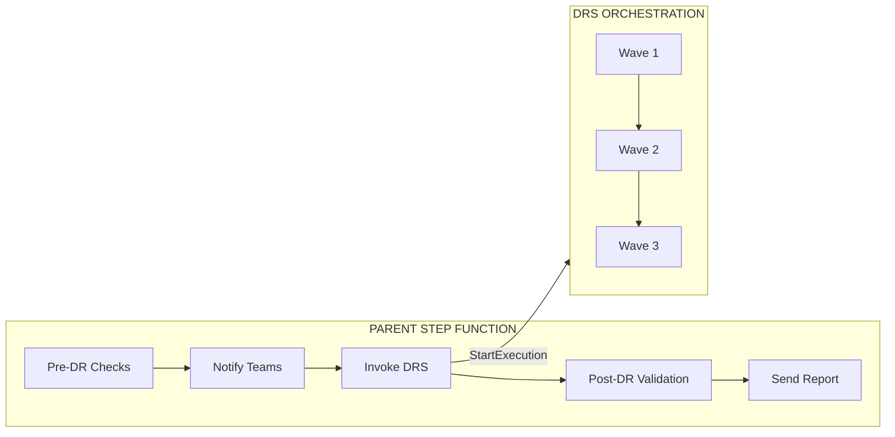

# Unified Tag-Based DRS Orchestration Design

## Version 4.0 | December 2025

---

## 1. Executive Summary

This design implements a **unified DRS orchestration solution** where all invocation methods (UI, CLI, SSM, Step Functions) use the same data model, execution engine, and history tracking. The only change from the current implementation is **tag-based server selection** instead of manual UI-driven server picking.

### Core Principle

**One solution, multiple entry points.** Whether you start a drill from the UI, CLI, SSM runbook, or parent Step Function - it's the same Protection Groups, same Recovery Plans, same execution engine, same History page.

### What Changes

| Aspect | Current (UI-Driven) | New (Tag-Based) |
|--------|---------------------|-----------------|
| Server Selection | Manual via UI picker | Automatic via tag filters |
| When Resolved | At PG creation time | At execution time |
| Server Changes | Must update PG manually | Auto-included if tags match |

### What Stays the Same

- Protection Group concept (named grouping of servers)
- Recovery Plan structure (waves, pause points, dependencies)
- Execution engine (Step Functions + orchestration Lambda)
- History tracking (all executions in same table/page)
- Pause/Resume capability (waitForTaskToken pattern)
- DRS service limits validation

---

## 2. Unified Architecture



### Key Points

| Method | Entry Point | Capabilities | How Plan ID is Provided |
|--------|-------------|--------------|-------------------------|
| **UI** | API Gateway | Full CRUD + Execute | User selects from dropdown |
| **CLI** | API Gateway | Full CRUD + Execute | User provides in request body |
| **SSM** | Step Functions | Execute only | Required input parameter |
| **Step Functions** | Step Functions | Execute only | Configured in parent state machine |

**Plans must exist before automated execution.** SSM and parent Step Functions cannot create Protection Groups or Recovery Plans - they can only execute plans that were created via UI or CLI.

---

## 3. Protection Group Schema

### 3.1 Tag-Based Schema

Protection Groups define **what to recover** using tag filters instead of explicit server IDs:

```json
{
  "GroupId": "pg-abc123",
  "GroupName": "HRP Database Tier",
  "Description": "All database servers for HRP application",
  "Region": "us-east-1",
  
  "ServerSelectionTags": {
    "DR-Application": "HRP",
    "DR-Tier": "Database"
  },
  
  "CreatedAt": 1702400000,
  "UpdatedAt": 1702400000
}
```

### 3.2 Field Definitions

| Field | Required | Description |
|-------|----------|-------------|
| `GroupId` | Auto | UUID generated on creation |
| `GroupName` | Yes | Unique name for the Protection Group |
| `Description` | No | Human-readable description |
| `Region` | Yes | AWS region where DRS servers are located |
| `ServerSelectionTags` | Yes | Tag key-value pairs to match DRS source servers |

### 3.3 Tag Matching Rules

- **AND logic**: All specified tags must match
- **Exact match**: Tag values are case-sensitive
- **Dynamic**: Servers matching tags at execution time are included

Example - this Protection Group:
```json
{
  "ServerSelectionTags": {
    "DR-Application": "HRP",
    "DR-Tier": "Database"
  }
}
```

Matches DRS source servers with **BOTH** `DR-Application=HRP` **AND** `DR-Tier=Database` tags.

---

## 4. Recovery Plan Schema (Unchanged)

Recovery Plans define **how to recover** - wave order, pause points, dependencies. This is completely unchanged from the current implementation:

```json
{
  "PlanId": "plan-xyz789",
  "PlanName": "HRP Full Recovery",
  "Description": "Multi-wave recovery for HRP application",
  "Waves": [
    {
      "WaveNumber": 1,
      "WaveName": "Database Tier",
      "ProtectionGroupIds": ["pg-database"],
      "PauseBeforeWave": false,
      "DependsOnWaves": []
    },
    {
      "WaveNumber": 2,
      "WaveName": "Application Tier",
      "ProtectionGroupIds": ["pg-application"],
      "PauseBeforeWave": true,
      "DependsOnWaves": [1]
    },
    {
      "WaveNumber": 3,
      "WaveName": "Web Tier",
      "ProtectionGroupIds": ["pg-web"],
      "PauseBeforeWave": false,
      "DependsOnWaves": [2]
    }
  ],
  "CreatedAt": 1702400000,
  "UpdatedAt": 1702400000
}
```

### 4.1 Wave Features (All Unchanged)

| Feature | Description | Status |
|---------|-------------|--------|
| **Wave Sequencing** | Waves execute in order | ✅ Unchanged |
| **PauseBeforeWave** | Pause for manual approval before wave starts | ✅ Unchanged |
| **DependsOnWaves** | Explicit wave dependencies | ✅ Unchanged |
| **Multiple PGs per Wave** | Wave can include multiple Protection Groups | ✅ Unchanged |
| **DRS Limits Validation** | Validates against 300 server limit, etc. | ✅ Unchanged |

---

## 5. Execution Flow

### 5.1 Server Resolution at Execution Time



### 5.2 Tag Resolution Query

At execution time, the orchestration Lambda queries DRS:

```python
def resolve_protection_group(protection_group: dict, region: str) -> list:
    """Resolve tag-based Protection Group to actual server IDs."""
    
    tags = protection_group.get('ServerSelectionTags', {})
    
    # Build DRS tag filter
    tag_filters = [
        {'key': key, 'value': value}
        for key, value in tags.items()
    ]
    
    # Query DRS API
    drs = boto3.client('drs', region_name=region)
    response = drs.describe_source_servers(
        filters={'tagFilters': tag_filters}
    )
    
    # Return server IDs
    return [
        server['sourceServerID']
        for server in response.get('items', [])
    ]
```

---

## 6. API Endpoints

All invocation methods use the same API endpoints:

### 6.1 Protection Groups

```bash
# Create Protection Group
POST /protection-groups
{
  "GroupName": "HRP Database Tier",
  "Description": "All HRP database servers",
  "Region": "us-east-1",
  "ServerSelectionTags": {
    "DR-Application": "HRP",
    "DR-Tier": "Database"
  }
}

# List Protection Groups
GET /protection-groups

# Get Protection Group
GET /protection-groups/{id}

# Update Protection Group
PUT /protection-groups/{id}
{
  "GroupName": "HRP Database Tier - Updated",
  "ServerSelectionTags": {
    "DR-Application": "HRP",
    "DR-Tier": "Database",
    "DR-Priority": "High"
  }
}

# Delete Protection Group
DELETE /protection-groups/{id}

# Preview Resolved Servers (NEW)
GET /protection-groups/{id}/resolve
```

### 6.2 Recovery Plans (Unchanged)

```bash
# Create Recovery Plan
POST /recovery-plans
{
  "name": "HRP Full Recovery",
  "waves": [
    {"waveNumber": 1, "protectionGroupIds": ["pg-db"], "pauseBeforeWave": false},
    {"waveNumber": 2, "protectionGroupIds": ["pg-app"], "pauseBeforeWave": true}
  ]
}

# List Recovery Plans (for automation discovery)
GET /recovery-plans

# Get Recovery Plan
GET /recovery-plans/{id}

# Update Recovery Plan
PUT /recovery-plans/{id}

# Delete Recovery Plan
DELETE /recovery-plans/{id}

# Execute Recovery Plan
POST /recovery-plans/{id}/execute
{
  "executionType": "DRILL"
}
```

**List Recovery Plans Response (for automation):**

```json
{
  "plans": [
    {
      "id": "plan-abc123",
      "name": "HRP Full Recovery",
      "description": "Multi-wave recovery for HRP application",
      "waves": [
        {
          "waveNumber": 1,
          "waveName": "Database Tier",
          "protectionGroupIds": ["pg-db-001"],
          "protectionGroupNames": ["HRP Database"],
          "pauseBeforeWave": false
        },
        {
          "waveNumber": 2,
          "waveName": "Application Tier",
          "protectionGroupIds": ["pg-app-001"],
          "protectionGroupNames": ["HRP Application"],
          "pauseBeforeWave": true
        }
      ],
      "totalWaves": 2,
      "createdAt": 1702400000,
      "updatedAt": 1702400000
    },
    {
      "id": "plan-def456",
      "name": "SAP Recovery",
      "description": "SAP application recovery",
      "waves": [...],
      "totalWaves": 3,
      "createdAt": 1702300000,
      "updatedAt": 1702300000
    }
  ],
  "count": 2
}
```

### 6.3 Executions (Unchanged)

```bash
# List Executions
GET /executions

# Get Execution Details
GET /executions/{id}

# Resume Paused Execution
POST /executions/{id}/resume

# Cancel Execution
POST /executions/{id}/cancel

# Terminate Recovery Instances
POST /executions/{id}/terminate
```

### 6.4 Preview Resolved Servers (New Endpoint)

See which servers currently match a Protection Group's tags:

```bash
GET /protection-groups/{id}/resolve
```

Response:
```json
{
  "protectionGroupId": "pg-abc123",
  "protectionGroupName": "HRP Database Tier",
  "region": "us-east-1",
  "tags": {
    "DR-Application": "HRP",
    "DR-Tier": "Database"
  },
  "resolvedServers": [
    {
      "sourceServerId": "s-0abc123def456",
      "hostname": "hrp-db-01.example.com",
      "replicationState": "CONTINUOUS",
      "tags": {
        "DR-Application": "HRP",
        "DR-Tier": "Database",
        "Name": "hrp-db-01"
      }
    },
    {
      "sourceServerId": "s-0def789abc012",
      "hostname": "hrp-db-02.example.com",
      "replicationState": "CONTINUOUS",
      "tags": {
        "DR-Application": "HRP",
        "DR-Tier": "Database",
        "Name": "hrp-db-02"
      }
    }
  ],
  "serverCount": 2,
  "resolvedAt": 1702400000
}
```

---

## 7. Invocation Methods

### 7.1 Overview



| Method | Entry Point | Create PG | Create Plan | Execute | Resume | Use Case |
|--------|-------------|-----------|-------------|---------|--------|----------|
| **UI** | API Gateway | ✅ | ✅ | ✅ | ✅ | Interactive, on-demand |
| **CLI** | API Gateway | ✅ | ✅ | ✅ | ✅ | Scripted, on-demand |
| **SSM** | Step Functions | ❌ | ❌ | ✅ | ❌ | Runbook automation |
| **Step Functions** | Step Functions | ❌ | ❌ | ✅ | ❌ | Nested workflows |

### 7.2 UI (React Frontend)

Same UI workflow, but Protection Group dialog uses tag editor instead of server picker.

**Recovery Plans Page - Shows IDs for Automation:**

```
┌─────────────────────────────────────────────────────────────────────────────┐
│ Recovery Plans                                            [+ Create Plan]   │
├─────────────────────────────────────────────────────────────────────────────┤
│                                                                             │
│ ┌─────────────────────────────────────────────────────────────────────────┐ │
│ │ Name              │ ID              │ Waves │ Protection Groups │ Actions│
│ ├───────────────────┼─────────────────┼───────┼───────────────────┼────────┤
│ │ HRP Full Recovery │ plan-abc123 📋  │ 3     │ HRP DB, HRP App,  │ ▶ Edit │
│ │                   │                 │       │ HRP Web           │   🗑️   │
│ ├───────────────────┼─────────────────┼───────┼───────────────────┼────────┤
│ │ SAP Recovery      │ plan-def456 📋  │ 2     │ SAP DB, SAP App   │ ▶ Edit │
│ │                   │                 │       │                   │   🗑️   │
│ └─────────────────────────────────────────────────────────────────────────┘ │
│                                                                             │
│ 📋 = Click to copy ID for use in CLI, SSM, or Step Functions automation    │
│                                                                             │
└─────────────────────────────────────────────────────────────────────────────┘
```

**Protection Group Dialog - Tag Editor:**

```
┌─────────────────────────────────────────────────────────────┐
│ Create Protection Group                                      │
├─────────────────────────────────────────────────────────────┤
│                                                              │
│ Name *                                                       │
│ ┌─────────────────────────────────────────────────────────┐ │
│ │ HRP Database Tier                                       │ │
│ └─────────────────────────────────────────────────────────┘ │
│                                                              │
│ Region *                                                     │
│ ┌─────────────────────────────────────────────────────────┐ │
│ │ us-east-1 (N. Virginia)                             ▼   │ │
│ └─────────────────────────────────────────────────────────┘ │
│                                                              │
│ Server Selection Tags *                                      │
│ Servers with ALL these tags will be included                 │
│                                                              │
│ ┌──────────────────┬──────────────────┬─────┐               │
│ │ Tag Key          │ Tag Value        │     │               │
│ ├──────────────────┼──────────────────┼─────┤               │
│ │ DR-Application   │ HRP              │  ✕  │               │
│ │ DR-Tier          │ Database         │  ✕  │               │
│ └──────────────────┴──────────────────┴─────┘               │
│ [+ Add Tag]                                                  │
│                                                              │
│ ┌─────────────────────────────────────────────────────────┐ │
│ │ Preview: 2 servers currently match                      │ │
│ │ • hrp-db-01.example.com (s-0abc123...)  CONTINUOUS ✓   │ │
│ │ • hrp-db-02.example.com (s-0def789...)  CONTINUOUS ✓   │ │
│ └─────────────────────────────────────────────────────────┘ │
│                                                              │
│                              [Cancel]  [Create Group]        │
└─────────────────────────────────────────────────────────────┘
```

### 7.3 CLI (curl / AWS CLI)

Same API, same data model - CLI has full parity with UI:

```bash
# Create Protection Group
curl -X POST https://api.example.com/prod/protection-groups \
  -H "Authorization: Bearer $TOKEN" \
  -H "Content-Type: application/json" \
  -d '{
    "GroupName": "HRP Database Tier",
    "Region": "us-east-1",
    "ServerSelectionTags": {
      "DR-Application": "HRP",
      "DR-Tier": "Database"
    }
  }'

# Create Recovery Plan
curl -X POST https://api.example.com/prod/recovery-plans \
  -H "Authorization: Bearer $TOKEN" \
  -H "Content-Type: application/json" \
  -d '{
    "name": "HRP Full Recovery",
    "waves": [
      {"waveNumber": 1, "protectionGroupIds": ["pg-db"], "pauseBeforeWave": false},
      {"waveNumber": 2, "protectionGroupIds": ["pg-app"], "pauseBeforeWave": true}
    ]
  }'

# Start Drill (same as clicking "Start Drill" in UI)
curl -X POST https://api.example.com/prod/recovery-plans/plan-xyz/execute \
  -H "Authorization: Bearer $TOKEN" \
  -H "Content-Type: application/json" \
  -d '{"executionType": "DRILL"}'

# Resume Paused Execution
curl -X POST https://api.example.com/prod/executions/exec-abc/resume \
  -H "Authorization: Bearer $TOKEN"
```

### 7.4 SSM Runbook

SSM Automation documents trigger Step Functions **directly**. The `RecoveryPlanId` is a **required input parameter** - the operator must provide it when starting the runbook.

```yaml
# ssm-documents/drs-orchestration-runbook.yaml
schemaVersion: '0.3'
description: 'Execute DRS Orchestration Recovery Plan'
assumeRole: '{{AutomationAssumeRole}}'

parameters:
  RecoveryPlanId:
    type: String
    description: 'Recovery Plan ID to execute (required)'
  ExecutionType:
    type: String
    allowedValues: ['DRILL', 'RECOVERY']
    default: 'DRILL'
  AutomationAssumeRole:
    type: String
    description: 'IAM role for SSM Automation'

mainSteps:
  - name: ExecuteRecoveryPlan
    action: aws:executeStateMachine
    inputs:
      stateMachineArn: !Sub 'arn:aws:states:${AWS::Region}:${AWS::AccountId}:stateMachine:drs-orchestration-${Environment}'
      input: |
        {
          "recoveryPlanId": "{{RecoveryPlanId}}",
          "executionType": "{{ExecutionType}}",
          "invocationSource": "SSM",
          "initiatedBy": "ssm:{{automation:EXECUTION_ID}}"
        }
```

**How the operator knows which plan to use:**

1. **From UI**: Recovery Plan ID is displayed on the Recovery Plans page (with copy button)
2. **From CLI**: Query `GET /recovery-plans` to list all plans with IDs
3. **From API response**: Plan ID returned when creating a new plan

### 7.5 Parent Step Function (Nested Workflows)

A parent Step Function can invoke DRS Orchestration as part of a larger DR workflow. The `recoveryPlanId` is **configured in the parent state machine definition** by the developer.



**Use Cases:**

| Scenario | Parent Step Function Does |
|----------|---------------------------|
| **Enterprise DR** | Pre-checks → DRS Orchestration → Post-validation → Reporting |
| **Multi-Region DR** | Run DRS in us-east-1, then us-west-2 |
| **Multi-Application DR** | Run HRP recovery, then SAP recovery, then Oracle |
| **DR with Approvals** | Get manager approval → Run DRS → Notify stakeholders |

**Parent Step Function Definition:**

```json
{
  "Comment": "Enterprise DR Workflow",
  "StartAt": "PreDRChecks",
  "States": {
    "PreDRChecks": {
      "Type": "Task",
      "Resource": "arn:aws:lambda:us-east-1:123456789012:function:pre-dr-checks",
      "Next": "NotifyTeams"
    },
    "NotifyTeams": {
      "Type": "Task",
      "Resource": "arn:aws:states:::sns:publish",
      "Parameters": {
        "TopicArn": "arn:aws:sns:us-east-1:123456789012:dr-notifications",
        "Message": "Starting DR drill..."
      },
      "Next": "ExecuteDRSOrchestration"
    },
    "ExecuteDRSOrchestration": {
      "Type": "Task",
      "Resource": "arn:aws:states:::states:startExecution.sync:2",
      "Parameters": {
        "StateMachineArn": "arn:aws:states:us-east-1:123456789012:stateMachine:drs-orchestration",
        "Input": {
          "recoveryPlanId": "plan-xyz",
          "executionType": "DRILL",
          "invocationSource": "STEPFUNCTIONS",
          "invocationDetails": {
            "parentStateMachineArn.$": "$$.StateMachine.Id",
            "parentExecutionId.$": "$$.Execution.Id"
          },
          "initiatedBy.$": "States.Format('stepfunctions:{}', $$.Execution.Id)"
        }
      },
      "Next": "PostDRValidation"
    },
    "PostDRValidation": {
      "Type": "Task",
      "Resource": "arn:aws:lambda:us-east-1:123456789012:function:post-dr-validation",
      "Next": "SendReport"
    },
    "SendReport": {
      "Type": "Task",
      "Resource": "arn:aws:states:::sns:publish",
      "Parameters": {
        "TopicArn": "arn:aws:sns:us-east-1:123456789012:dr-notifications",
        "Message.$": "States.Format('DR drill completed: {}', $.status)"
      },
      "End": true
    }
  }
}
```

**Key Points:**

- Uses `states:startExecution.sync:2` to wait for DRS Orchestration to complete
- Passes `invocationSource: "STEPFUNCTIONS"` for tracking
- Includes parent execution ID for correlation
- Can handle success/failure and branch accordingly

---

## 8. Execution History (Unified)

### 8.1 All Executions in Same Table

Regardless of invocation method, all executions are stored in the same `execution-history` DynamoDB table:

```json
{
  "ExecutionId": "exec-abc123",
  "PlanId": "plan-xyz789",
  "PlanName": "HRP Full Recovery",
  "ExecutionType": "DRILL",
  "Status": "COMPLETED",
  "StartTime": 1702400000,
  "EndTime": 1702403600,
  
  "InvocationSource": "EVENTBRIDGE",
  "InitiatedBy": "schedule:weekly-drill",
  
  "TotalWaves": 3,
  "TotalServers": 10,
  "WaveExecutions": [...]
}
```

### 8.2 Invocation Source Tracking

| Source | InitiatedBy Format | Example |
|--------|-------------------|---------|
| **UI** | `user@example.com` | `jsmith@company.com` |
| **CLI** | `cli:username` | `cli:jsmith` |
| **SSM** | `ssm:execution-id` | `ssm:abc-123-def` |
| **Step Functions** | `stepfunctions:execution-id` | `stepfunctions:arn:aws:states:...` |

### 8.3 History Page (Shows All)

The History page displays all executions regardless of source:

| Plan | Type | Status | Source | Started | Servers |
|------|------|--------|--------|---------|---------|
| HRP Full Recovery | DRILL | ✅ Completed | 🖥️ UI | Dec 14, 2:30 PM | 10 |
| HRP Full Recovery | DRILL | ✅ Completed | ⌨️ CLI | Dec 12, 10:00 AM | 10 |
| HRP Full Recovery | DRILL | ⏸️ Paused | 📋 SSM | Dec 10, 9:00 AM | 10 |
| HRP Full Recovery | DRILL | ✅ Completed | 🔗 Step Functions | Dec 8, 3:00 AM | 10 |

---

## 9. DRS Source Server Tagging

### 9.1 Required Tags

For servers to be included in DR orchestration, they must have appropriate tags on the DRS source server:

| Tag Key | Example Values | Purpose |
|---------|----------------|---------|
| `DR-Application` | `HRP`, `SAP`, `Oracle` | Application identifier |
| `DR-Tier` | `Database`, `Application`, `Web` | Application tier |
| `DR-Enabled` | `true`, `false` | Enable/disable for DR |
| `DR-Priority` | `High`, `Medium`, `Low` | Recovery priority |

### 9.2 Tagging DRS Source Servers

```bash
# Tag a DRS source server
aws drs tag-resource \
  --resource-arn arn:aws:drs:us-east-1:123456789012:source-server/s-0abc123def456 \
  --tags DR-Application=HRP,DR-Tier=Database,DR-Enabled=true
```

### 9.3 Example Tag Strategy

```
HRP Application - DRS Source Server Tags
────────────────────────────────────────

Database Tier (2 servers):
  hrp-db-01:  DR-Application=HRP, DR-Tier=Database
  hrp-db-02:  DR-Application=HRP, DR-Tier=Database

Application Tier (5 servers):
  hrp-app-01: DR-Application=HRP, DR-Tier=Application
  hrp-app-02: DR-Application=HRP, DR-Tier=Application
  hrp-app-03: DR-Application=HRP, DR-Tier=Application
  hrp-app-04: DR-Application=HRP, DR-Tier=Application
  hrp-app-05: DR-Application=HRP, DR-Tier=Application

Web Tier (3 servers):
  hrp-web-01: DR-Application=HRP, DR-Tier=Web
  hrp-web-02: DR-Application=HRP, DR-Tier=Web
  hrp-web-03: DR-Application=HRP, DR-Tier=Web
```

---

## 10. Implementation Status

### Completed ✅

| Component | File | Status |
|-----------|------|--------|
| Design Document | `docs/implementation/DUAL_MODE_ORCHESTRATION_DESIGN.md` | ✅ v4.0 |
| Tag Discovery Lambda | `lambda/tag_discovery.py` | ✅ Complete |
| Execution Registry Lambda | `lambda/execution_registry.py` | ✅ Complete |
| Invocation Source Badge | `frontend/src/components/InvocationSourceBadge.tsx` | ✅ Complete |
| Executions Page Updates | `frontend/src/pages/ExecutionsPage.tsx` | ✅ Updated |
| SSM Runbook | `ssm-documents/drs-orchestration-runbook.yaml` | ✅ Complete |
| TypeScript Types | `frontend/src/types/index.ts` | ✅ Updated - tag-only schema |
| Protection Group Dialog | `frontend/src/components/ProtectionGroupDialog.tsx` | ✅ Rewritten with tag editor |
| Recovery Plans Page | `frontend/src/pages/RecoveryPlansPage.tsx` | ✅ Added Plan ID column with copy |
| API Client | `frontend/src/services/api.ts` | ✅ Added resolveProtectionGroupTags |
| API Handler - Create PG | `lambda/index.py` | ✅ Uses `ServerSelectionTags` |
| API Handler - Update PG | `lambda/index.py` | ✅ Uses `ServerSelectionTags` |
| API Handler - Resolve Endpoint | `lambda/index.py` | ✅ `POST /protection-groups/resolve` |
| API Handler - Tag Query | `lambda/index.py` | ✅ `query_drs_servers_by_tags()` |
| API Handler - Conflict Check | `lambda/index.py` | ✅ Tag-based server resolution |
| API Handler - Wave Validation | `lambda/index.py` | ✅ Tag-based server resolution |
| Orchestration Lambda | `lambda/orchestration_stepfunctions.py` | ✅ Resolves tags at execution time |

### Remaining 🔲

| Component | File | Work Required |
|-----------|------|---------------|
| Legacy Cleanup | `lambda/index.py` | Remove deprecated `list_source_servers` (optional) |
| Database Migration | N/A | Migrate existing PGs to tag-based schema (if any exist) |

---

## 11. Migration Plan

### 11.1 Database Schema Change

Protection Groups table:

```
BEFORE:
- GroupId (PK)
- GroupName
- Region
- SourceServerIds []  ← REMOVE

AFTER:
- GroupId (PK)
- GroupName
- Region
- ServerSelectionTags {}  ← ADD
```

### 11.2 Migration Steps

1. **Deploy new Lambda** with tag-based support
2. **Add ServerSelectionTags field** to existing PGs (empty initially)
3. **Update frontend** to use tag editor
4. **Migrate existing PGs** by inferring tags from server metadata
5. **Remove SourceServerIds** field after migration complete

### 11.3 Backward Compatibility

During migration, API will:
- Accept both `sourceServerIds` (legacy) and `ServerSelectionTags` (new)
- Prefer `ServerSelectionTags` if both provided
- Log deprecation warning for `sourceServerIds` usage

---

## 12. Benefits Summary

| Benefit | Description |
|---------|-------------|
| **Unified Solution** | Same data model for UI, CLI, SSM, Step Functions |
| **Dynamic Discovery** | New servers auto-included when tagged correctly |
| **No Manual Updates** | PGs don't need updating when servers change |
| **Full Feature Parity** | Waves, pauses, dependencies work for all invocation methods |
| **Single History View** | All executions visible in same History page |
| **Automation Ready** | CLI, SSM, Step Functions use same execution engine as UI |

---

## 13. Future Enhancements

### 13.1 EventBridge Scheduled Drills (Phase 2)

Add EventBridge rules to trigger scheduled drills automatically:

```yaml
# cfn/eventbridge-stack.yaml (Future)
WeeklyDrillRule:
  Type: AWS::Events::Rule
  Properties:
    Name: !Sub "${ProjectName}-weekly-drill-${Environment}"
    Description: "Weekly DR drill every Saturday 6 AM UTC"
    ScheduleExpression: "cron(0 6 ? * SAT *)"
    State: ENABLED
    Targets:
      - Id: StepFunctionsTarget
        Arn: !Ref OrchestrationStateMachineArn
        RoleArn: !GetAtt EventBridgeRole.Arn
        Input: !Sub |
          {
            "recoveryPlanId": "${RecoveryPlanId}",
            "executionType": "DRILL",
            "invocationSource": "EVENTBRIDGE",
            "initiatedBy": "schedule:weekly-drill"
          }
```

**Considerations:**
- Plan ID must be hardcoded in the rule or stored in a configuration
- Need UI to manage scheduled rules
- Need notification on scheduled drill completion/failure

### 13.2 SNS Notifications (Phase 2)

Add SNS notifications for execution events:
- Execution started
- Wave completed
- Execution paused (waiting for resume)
- Execution completed
- Execution failed

### 13.3 Multi-Account Support (Phase 2)

Support tag-based discovery across multiple AWS accounts using cross-account IAM roles.
