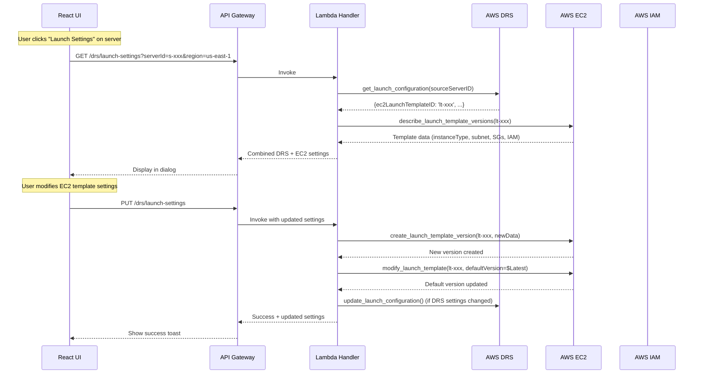
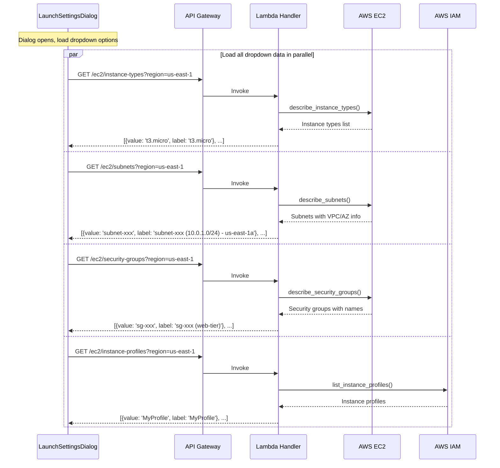

# EC2 Launch Template Management MVP - Implementation Plan

**Version:** 1.0  
**Date:** December 2025  
**Status:** Ready for Implementation  
**Estimated Effort:** 4-5 days  
**Prerequisite:** DRS Launch Settings MVP (completed first)

---

## Executive Summary

MVP implementation of EC2 Launch Template editing for single servers. This extends the DRS Launch Settings MVP to include EC2 template configuration (instance type, subnet, security groups, IAM profile). No bulk operations or template library.

### MVP Scope

| Included | Excluded (Future) |
|----------|-------------------|
| Single-server EC2 template editing | Bulk operations |
| Instance type selection | Template library |
| Subnet selection | Tag-based overrides |
| Security group selection | Automatic subnet assignment |
| IAM instance profile selection | Replication settings |
| Integration with existing LaunchSettingsDialog | Configuration sync reports |

### Business Value

- **AWS-Validated Approach**: Follows patterns from official AWS DRS tools
- **Complete configuration**: Edit both DRS settings AND EC2 template in one dialog
- **Eliminate AWS Console navigation**: No need to switch to EC2 console
- **Reduce errors**: Dropdown selections prevent typos in resource IDs
- **Enterprise-Ready**: Supports same settings as AWS Configuration Synchronizer
- **Tag-Based Future**: Foundation for tag-based configuration management

---

## EC2 Launch Template Settings

### AWS-Approved Settings (Based on Official Tools Analysis)

Based on analysis of AWS's official DRS tools ([template-manager](https://github.com/aws-samples/drs-tools/tree/main/drs-template-manager) and [configuration-synchronizer](https://github.com/aws-samples/drs-tools/tree/main/drs-configuration-synchronizer)), AWS officially supports editing these launch template settings:

#### ✅ Safe to Edit (MVP Scope)
| Setting | EC2 API Field | Type | Description | AWS Tool Support |
|---------|---------------|------|-------------|------------------|
| **Instance Type** | `InstanceType` | String | t3.small, m5.large, r5.xlarge, etc. | ✅ Template Manager, Config Sync |
| **Subnet** | `NetworkInterfaces[0].SubnetId` | String | Target VPC subnet for recovery | ✅ Config Sync (auto-assignment) |
| **Security Groups** | `NetworkInterfaces[0].Groups` | Array | Security group IDs | ✅ Template Manager, Config Sync |
| **IAM Instance Profile** | `IamInstanceProfile.Name` | String | Instance profile for permissions | ✅ Template Manager, Config Sync |
| **Monitoring** | `Monitoring.Enabled` | Boolean | CloudWatch detailed monitoring | ✅ Config Sync |
| **Tags** | `TagSpecifications` | Array | Instance and volume tags | ✅ Template Manager, Config Sync |

#### ⚠️ AWS Manages (Do Not Edit)
| Setting | Reason | AWS Tool Behavior |
|---------|--------|-------------------|
| **ImageId** | DRS creates recovery-specific AMIs | Always `null` in Template Manager |
| **BlockDeviceMappings** | DRS maps source server disks | Ignored by Config Sync |
| **UserData** | DRS may inject recovery scripts | Always `null` in Template Manager |
| **KeyName** | Handled separately by DRS | Ignored by Config Sync |

### AWS API Calls Required

```python
# Read EC2 launch template (from DRS launch config)
drs.get_launch_configuration(sourceServerID='s-xxx')
# Returns: ec2LaunchTemplateID

# Get template details
ec2.describe_launch_template_versions(
    LaunchTemplateId='lt-xxx',
    Versions=['$Latest']
)

# Update template (create new version + set as default)
ec2.create_launch_template_version(
    LaunchTemplateId='lt-xxx',
    LaunchTemplateData={
        'InstanceType': 't3.medium',
        'NetworkInterfaces': [{
            'DeviceIndex': 0,
            'SubnetId': 'subnet-xxx',
            'Groups': ['sg-xxx', 'sg-yyy']
        }],
        'IamInstanceProfile': {'Name': 'MyInstanceProfile'}
    }
)

ec2.modify_launch_template(
    LaunchTemplateId='lt-xxx',
    DefaultVersion='$Latest'
)

# Dropdown data APIs
ec2.describe_subnets(Filters=[{'Name': 'vpc-id', 'Values': ['vpc-xxx']}])
ec2.describe_security_groups(Filters=[{'Name': 'vpc-id', 'Values': ['vpc-xxx']}])
ec2.describe_instance_types()
iam.list_instance_profiles()
```

---

## Architecture

### Data Flow



### Dropdown Data Loading



---

## Implementation Plan

### Day 1: Backend API - EC2 Dropdown Endpoints

#### New API Endpoints

| Method | Endpoint | Description | AWS Tool Reference |
|--------|----------|-------------|--------------------|
| GET | `/ec2/instance-types` | List available EC2 instance types | Template Manager pattern |
| GET | `/ec2/subnets` | List VPC subnets | Config Sync auto-assignment |
| GET | `/ec2/security-groups` | List security groups | Template Manager + Config Sync |
| GET | `/ec2/instance-profiles` | List IAM instance profiles | Config Sync pattern |

#### Lambda Handler Implementation

Add to `lambda/index.py`:

```python
def get_ec2_instance_types(event: Dict) -> Dict:
    """Get available EC2 instance types for dropdown."""
    import logging
    logger = logging.getLogger()
    
    params = event.get('queryStringParameters', {})
    region = params.get('region', 'us-east-1')
    
    # Validate region
    if not region:
        return response(400, {'error': 'region is required'})
    
    try:
        ec2_client = boto3.client('ec2', region_name=region)
        
        # Get common instance types (paginated)
        instance_types = []
        paginator = ec2_client.get_paginator('describe_instance_types')
        
        # Filter to common families to reduce response size (based on AWS DRS recommendations)
        common_families = ['t3', 't3a', 'm5', 'm5a', 'm5n', 'r5', 'r5a', 'r5n', 'c5', 'c5a', 'c5n', 'm6i', 'r6i', 'c6i']
        
        for page in paginator.paginate(
            Filters=[{
                'Name': 'instance-type',
                'Values': [f'{family}.*' for family in common_families]
            }]
        ):
            for it in page['InstanceTypes']:
                instance_types.append({
                    'value': it['InstanceType'],
                    'label': it['InstanceType'],
                    'vcpus': it['VCpuInfo']['DefaultVCpus'],
                    'memory': it['MemoryInfo']['SizeInMiB']
                })
        
        # Sort by family then size
        instance_types.sort(key=lambda x: x['value'])
        
        return response(200, {'instanceTypes': instance_types})
    except Exception as e:
        logger.error(f'Error getting instance types: {str(e)}')
        return response(500, {'error': str(e)})


def get_ec2_subnets(event: Dict) -> Dict:
    """Get VPC subnets for dropdown."""
    import logging
    logger = logging.getLogger()
    
    params = event.get('queryStringParameters', {})
    region = params.get('region', 'us-east-1')
    vpc_id = params.get('vpcId')  # Optional filter
    
    if not region:
        return response(400, {'error': 'region is required'})
    
    try:
        ec2_client = boto3.client('ec2', region_name=region)
        
        filters = []
        if vpc_id:
            filters.append({'Name': 'vpc-id', 'Values': [vpc_id]})
        
        result = ec2_client.describe_subnets(Filters=filters if filters else [])
        
        subnets = []
        for subnet in result['Subnets']:
            name_tag = next(
                (tag['Value'] for tag in subnet.get('Tags', []) if tag['Key'] == 'Name'),
                None
            )
            label = f"{subnet['SubnetId']}"
            if name_tag:
                label = f"{name_tag} ({subnet['SubnetId']})"
            label += f" - {subnet['CidrBlock']} - {subnet['AvailabilityZone']}"
            
            subnets.append({
                'value': subnet['SubnetId'],
                'label': label,
                'vpcId': subnet['VpcId'],
                'availabilityZone': subnet['AvailabilityZone'],
                'cidrBlock': subnet['CidrBlock']
            })
        
        return response(200, {'subnets': subnets})
    except Exception as e:
        logger.error(f'Error getting subnets: {str(e)}')
        return response(500, {'error': str(e)})


def get_ec2_security_groups(event: Dict) -> Dict:
    """Get security groups for dropdown."""
    import logging
    logger = logging.getLogger()
    
    params = event.get('queryStringParameters', {})
    region = params.get('region', 'us-east-1')
    vpc_id = params.get('vpcId')  # Optional filter
    
    if not region:
        return response(400, {'error': 'region is required'})
    
    try:
        ec2_client = boto3.client('ec2', region_name=region)
        
        filters = []
        if vpc_id:
            filters.append({'Name': 'vpc-id', 'Values': [vpc_id]})
        
        result = ec2_client.describe_security_groups(Filters=filters if filters else [])
        
        security_groups = []
        for sg in result['SecurityGroups']:
            label = f"{sg['GroupName']} ({sg['GroupId']})"
            if sg.get('Description'):
                label += f" - {sg['Description'][:50]}"
            
            security_groups.append({
                'value': sg['GroupId'],
                'label': label,
                'groupName': sg['GroupName'],
                'vpcId': sg['VpcId'],
                'description': sg.get('Description', '')
            })
        
        return response(200, {'securityGroups': security_groups})
    except Exception as e:
        logger.error(f'Error getting security groups: {str(e)}')
        return response(500, {'error': str(e)})


def get_ec2_instance_profiles(event: Dict) -> Dict:
    """Get IAM instance profiles for dropdown."""
    import logging
    logger = logging.getLogger()
    
    params = event.get('queryStringParameters', {})
    region = params.get('region', 'us-east-1')
    
    if not region:
        return response(400, {'error': 'region is required'})
    
    try:
        iam_client = boto3.client('iam', region_name=region)
        
        profiles = []
        paginator = iam_client.get_paginator('list_instance_profiles')
        
        for page in paginator.paginate():
            for profile in page['InstanceProfiles']:
                profiles.append({
                    'value': profile['InstanceProfileName'],
                    'label': profile['InstanceProfileName'],
                    'arn': profile['Arn'],
                    'roles': [role['RoleName'] for role in profile.get('Roles', [])]
                })
        
        profiles.sort(key=lambda x: x['value'])
        
        return response(200, {'instanceProfiles': profiles})
    except Exception as e:
        logger.error(f'Error getting instance profiles: {str(e)}')
        return response(500, {'error': str(e)})
```

#### Route Handler Updates

Add to route handling in `lambda/index.py`:

```python
elif path == '/ec2/instance-types':
    if method == 'GET':
        return get_ec2_instance_types(event)
elif path == '/ec2/subnets':
    if method == 'GET':
        return get_ec2_subnets(event)
elif path == '/ec2/security-groups':
    if method == 'GET':
        return get_ec2_security_groups(event)
elif path == '/ec2/instance-profiles':
    if method == 'GET':
        return get_ec2_instance_profiles(event)
```

---

### Day 2: Backend API - Launch Template Read/Update

#### Update Existing Launch Settings Endpoints

Extend `get_launch_settings` and `update_launch_settings` to include EC2 template data:

```python
def get_launch_settings(event: Dict) -> Dict:
    """Get DRS launch configuration AND EC2 template details for a source server."""
    params = event.get('queryStringParameters', {})
    server_id = params.get('serverId')
    region = params.get('region', 'us-east-1')
    
    if not server_id:
        return response(400, {'error': 'serverId is required'})
    
    try:
        drs_client = boto3.client('drs', region_name=region)
        ec2_client = boto3.client('ec2', region_name=region)
        
        # Get DRS launch configuration
        launch_config = drs_client.get_launch_configuration(
            sourceServerID=server_id
        )
        
        # Get EC2 launch template details if available
        ec2_template_data = {}
        template_id = launch_config.get('ec2LaunchTemplateID')
        
        if template_id:
            try:
                template_versions = ec2_client.describe_launch_template_versions(
                    LaunchTemplateId=template_id,
                    Versions=['$Latest']
                )
                if template_versions['LaunchTemplateVersions']:
                    template_data = template_versions['LaunchTemplateVersions'][0]['LaunchTemplateData']
                    
                    # Extract network interface settings
                    network_interfaces = template_data.get('NetworkInterfaces', [])
                    subnet_id = None
                    security_group_ids = []
                    
                    if network_interfaces:
                        ni = network_interfaces[0]
                        subnet_id = ni.get('SubnetId')
                        security_group_ids = ni.get('Groups', [])
                    
                    ec2_template_data = {
                        'templateId': template_id,
                        'instanceType': template_data.get('InstanceType'),
                        'subnetId': subnet_id,
                        'securityGroupIds': security_group_ids,
                        'iamInstanceProfile': template_data.get('IamInstanceProfile', {}).get('Name'),
                        'monitoring': template_data.get('Monitoring', {}).get('Enabled', False),
                        'disableApiTermination': template_data.get('DisableApiTermination', False),
                        'metadataOptions': template_data.get('MetadataOptions', {})
                    }
            except ec2_client.exceptions.ClientError as e:
                logger.warning(f'Could not get EC2 template {template_id}: {str(e)}')
        
        return response(200, {
            'sourceServerId': server_id,
            'region': region,
            # DRS settings
            'targetInstanceTypeRightSizingMethod': launch_config.get('targetInstanceTypeRightSizingMethod', 'NONE'),
            'launchDisposition': launch_config.get('launchDisposition', 'STOPPED'),
            'copyPrivateIp': launch_config.get('copyPrivateIp', False),
            'copyTags': launch_config.get('copyTags', False),
            'licensing': launch_config.get('licensing', {'osByol': False}),
            # EC2 template settings
            'ec2Template': ec2_template_data,
            'name': launch_config.get('name', '')
        })
    except drs_client.exceptions.ResourceNotFoundException:
        return response(404, {'error': f'Source server {server_id} not found'})
    except Exception as e:
        logger.error(f'Error getting launch settings: {str(e)}')
        return response(500, {'error': str(e)})


def update_launch_settings(event: Dict) -> Dict:
    """Update DRS launch configuration AND EC2 template for a source server."""
    try:
        body = json.loads(event.get('body', '{}'))
    except json.JSONDecodeError:
        return response(400, {'error': 'Invalid JSON body'})
    
    server_id = body.get('sourceServerId')
    region = body.get('region', 'us-east-1')
    
    if not server_id:
        return response(400, {'error': 'sourceServerId is required'})
    
    try:
        drs_client = boto3.client('drs', region_name=region)
        ec2_client = boto3.client('ec2', region_name=region)
        
        # Update DRS launch configuration
        drs_update_params = {'sourceServerID': server_id}
        
        if 'targetInstanceTypeRightSizingMethod' in body:
            drs_update_params['targetInstanceTypeRightSizingMethod'] = body['targetInstanceTypeRightSizingMethod']
        if 'launchDisposition' in body:
            drs_update_params['launchDisposition'] = body['launchDisposition']
        if 'copyPrivateIp' in body:
            drs_update_params['copyPrivateIp'] = body['copyPrivateIp']
        if 'copyTags' in body:
            drs_update_params['copyTags'] = body['copyTags']
        if 'licensing' in body:
            drs_update_params['licensing'] = body['licensing']
        
        drs_result = drs_client.update_launch_configuration(**drs_update_params)
        
        # Update EC2 launch template if ec2Template provided
        ec2_template = body.get('ec2Template', {})
        template_id = ec2_template.get('templateId') or drs_result.get('ec2LaunchTemplateID')
        
        if template_id and ec2_template:
            # Build new template data
            template_data = {}
            
            if ec2_template.get('instanceType'):
                template_data['InstanceType'] = ec2_template['instanceType']
            
            # Build network interface config
            if ec2_template.get('subnetId') or ec2_template.get('securityGroupIds'):
                network_interface = {'DeviceIndex': 0}
                if ec2_template.get('subnetId'):
                    network_interface['SubnetId'] = ec2_template['subnetId']
                if ec2_template.get('securityGroupIds'):
                    network_interface['Groups'] = ec2_template['securityGroupIds']
                template_data['NetworkInterfaces'] = [network_interface]
            
            if ec2_template.get('iamInstanceProfile'):
                template_data['IamInstanceProfile'] = {'Name': ec2_template['iamInstanceProfile']}
            
            # Add monitoring setting (AWS Config Sync pattern)
            if 'monitoring' in ec2_template:
                template_data['Monitoring'] = {'Enabled': ec2_template['monitoring']}
            
            # Add metadata options (AWS Config Sync security pattern)
            if ec2_template.get('metadataOptions'):
                template_data['MetadataOptions'] = ec2_template['metadataOptions']
            
            if template_data:
                # Create new version
                ec2_client.create_launch_template_version(
                    LaunchTemplateId=template_id,
                    LaunchTemplateData=template_data
                )
                
                # Set as default version
                ec2_client.modify_launch_template(
                    LaunchTemplateId=template_id,
                    DefaultVersion='$Latest'
                )
        
        return response(200, {
            'sourceServerId': server_id,
            'region': region,
            'targetInstanceTypeRightSizingMethod': drs_result.get('targetInstanceTypeRightSizingMethod'),
            'launchDisposition': drs_result.get('launchDisposition'),
            'copyPrivateIp': drs_result.get('copyPrivateIp'),
            'copyTags': drs_result.get('copyTags'),
            'licensing': drs_result.get('licensing', {}),
            'message': 'Launch settings updated successfully'
        })
    except drs_client.exceptions.ResourceNotFoundException:
        return response(404, {'error': f'Source server {server_id} not found'})
    except drs_client.exceptions.ValidationException as e:
        return response(400, {'error': f'Validation error: {str(e)}'})
    except Exception as e:
        logger.error(f'Error updating launch settings: {str(e)}')
        return response(500, {'error': str(e)})
```

#### IAM Permissions

Add to `cfn/lambda-stack.yaml` OrchestrationRole:

```yaml
# EC2 Read permissions (for dropdowns) - Based on AWS DRS tools
- Effect: Allow
  Action:
    - ec2:DescribeInstanceTypes
    - ec2:DescribeSubnets
    - ec2:DescribeSecurityGroups
    - ec2:DescribeVpcs
    - ec2:DescribeLaunchTemplates
    - ec2:DescribeLaunchTemplateVersions
  Resource: '*'

# EC2 Write permissions (for template updates) - AWS Template Manager pattern
- Effect: Allow
  Action:
    - ec2:CreateLaunchTemplateVersion  # AWS Template Manager requirement
    - ec2:ModifyLaunchTemplate         # AWS Template Manager requirement
  Resource: !Sub 'arn:aws:ec2:*:${AWS::AccountId}:launch-template/*'

# IAM Read permissions (for instance profiles dropdown) - AWS Config Sync pattern
- Effect: Allow
  Action:
    - iam:ListInstanceProfiles
  Resource: '*'
```

#### API Gateway Configuration

Add to `cfn/api-stack.yaml`:

```yaml
# /ec2 parent resource
EC2Resource:
  Type: AWS::ApiGateway::Resource
  Properties:
    RestApiId: !Ref ApiGateway
    ParentId: !GetAtt ApiGateway.RootResourceId
    PathPart: ec2

# /ec2/instance-types
EC2InstanceTypesResource:
  Type: AWS::ApiGateway::Resource
  Properties:
    RestApiId: !Ref ApiGateway
    ParentId: !Ref EC2Resource
    PathPart: instance-types

EC2InstanceTypesGetMethod:
  Type: AWS::ApiGateway::Method
  Properties:
    RestApiId: !Ref ApiGateway
    ResourceId: !Ref EC2InstanceTypesResource
    HttpMethod: GET
    AuthorizationType: COGNITO_USER_POOLS
    AuthorizerId: !Ref CognitoAuthorizer
    Integration:
      Type: AWS_PROXY
      IntegrationHttpMethod: POST
      Uri: !Sub 'arn:aws:apigateway:${AWS::Region}:lambda:path/2015-03-31/functions/${ApiHandlerFunction.Arn}/invocations'

# /ec2/subnets
EC2SubnetsResource:
  Type: AWS::ApiGateway::Resource
  Properties:
    RestApiId: !Ref ApiGateway
    ParentId: !Ref EC2Resource
    PathPart: subnets

EC2SubnetsGetMethod:
  Type: AWS::ApiGateway::Method
  Properties:
    RestApiId: !Ref ApiGateway
    ResourceId: !Ref EC2SubnetsResource
    HttpMethod: GET
    AuthorizationType: COGNITO_USER_POOLS
    AuthorizerId: !Ref CognitoAuthorizer
    Integration:
      Type: AWS_PROXY
      IntegrationHttpMethod: POST
      Uri: !Sub 'arn:aws:apigateway:${AWS::Region}:lambda:path/2015-03-31/functions/${ApiHandlerFunction.Arn}/invocations'

# /ec2/security-groups
EC2SecurityGroupsResource:
  Type: AWS::ApiGateway::Resource
  Properties:
    RestApiId: !Ref ApiGateway
    ParentId: !Ref EC2Resource
    PathPart: security-groups

EC2SecurityGroupsGetMethod:
  Type: AWS::ApiGateway::Method
  Properties:
    RestApiId: !Ref ApiGateway
    ResourceId: !Ref EC2SecurityGroupsResource
    HttpMethod: GET
    AuthorizationType: COGNITO_USER_POOLS
    AuthorizerId: !Ref CognitoAuthorizer
    Integration:
      Type: AWS_PROXY
      IntegrationHttpMethod: POST
      Uri: !Sub 'arn:aws:apigateway:${AWS::Region}:lambda:path/2015-03-31/functions/${ApiHandlerFunction.Arn}/invocations'

# /ec2/instance-profiles
EC2InstanceProfilesResource:
  Type: AWS::ApiGateway::Resource
  Properties:
    RestApiId: !Ref ApiGateway
    ParentId: !Ref EC2Resource
    PathPart: instance-profiles

EC2InstanceProfilesGetMethod:
  Type: AWS::ApiGateway::Method
  Properties:
    RestApiId: !Ref ApiGateway
    ResourceId: !Ref EC2InstanceProfilesResource
    HttpMethod: GET
    AuthorizationType: COGNITO_USER_POOLS
    AuthorizerId: !Ref CognitoAuthorizer
    Integration:
      Type: AWS_PROXY
      IntegrationHttpMethod: POST
      Uri: !Sub 'arn:aws:apigateway:${AWS::Region}:lambda:path/2015-03-31/functions/${ApiHandlerFunction.Arn}/invocations'

# CORS OPTIONS methods for each endpoint (similar pattern)
```

---

### Day 3: Frontend - TypeScript Types & API Service

#### TypeScript Types

Update `frontend/src/types/index.ts`:

```typescript
// Extend existing LaunchSettings type
export interface LaunchSettings {
  sourceServerId: string;
  region: string;
  // DRS settings
  targetInstanceTypeRightSizingMethod: 'NONE' | 'BASIC' | 'IN_AWS';
  launchDisposition: 'STOPPED' | 'STARTED';
  copyPrivateIp: boolean;
  copyTags: boolean;
  licensing: {
    osByol: boolean;
  };
  // EC2 template settings (NEW)
  ec2Template?: Ec2TemplateConfig;
  name?: string;
}

export interface Ec2TemplateConfig {
  templateId?: string;
  instanceType?: string;
  subnetId?: string;
  securityGroupIds?: string[];
  iamInstanceProfile?: string;
  ebsOptimized?: boolean;
}

// Dropdown option types
export interface InstanceTypeOption {
  value: string;
  label: string;
  vcpus?: number;
  memory?: number;
}

export interface SubnetOption {
  value: string;
  label: string;
  vpcId: string;
  availabilityZone: string;
  cidrBlock: string;
}

export interface SecurityGroupOption {
  value: string;
  label: string;
  groupName: string;
  vpcId: string;
  description: string;
}

export interface InstanceProfileOption {
  value: string;
  label: string;
  arn: string;
  roles: string[];
}
```

#### API Service Functions

Add to `frontend/src/services/api.ts`:

```typescript
// EC2 dropdown data APIs
export const getInstanceTypes = async (region: string): Promise<InstanceTypeOption[]> => {
  const response = await apiClient.get('/ec2/instance-types', {
    params: { region }
  });
  return response.data.instanceTypes;
};

export const getSubnets = async (region: string, vpcId?: string): Promise<SubnetOption[]> => {
  const response = await apiClient.get('/ec2/subnets', {
    params: { region, vpcId }
  });
  return response.data.subnets;
};

export const getSecurityGroups = async (region: string, vpcId?: string): Promise<SecurityGroupOption[]> => {
  const response = await apiClient.get('/ec2/security-groups', {
    params: { region, vpcId }
  });
  return response.data.securityGroups;
};

export const getInstanceProfiles = async (region: string): Promise<InstanceProfileOption[]> => {
  const response = await apiClient.get('/ec2/instance-profiles', {
    params: { region }
  });
  return response.data.instanceProfiles;
};
```

---

### Day 4: Frontend - Enhanced LaunchSettingsDialog

#### Update LaunchSettingsDialog Component

Extend `frontend/src/components/LaunchSettingsDialog.tsx` to include EC2 template section:

```typescript
import React, { useState, useEffect } from 'react';
import {
  Modal,
  Box,
  SpaceBetween,
  Button,
  FormField,
  RadioGroup,
  Checkbox,
  Spinner,
  Alert,
  Container,
  Header,
  ColumnLayout,
  Select,
  Multiselect,
  SelectProps
} from '@cloudscape-design/components';
import { LaunchSettings, InstanceTypeOption, SubnetOption, SecurityGroupOption, InstanceProfileOption } from '../types';
import { 
  getLaunchSettings, 
  updateLaunchSettings,
  getInstanceTypes,
  getSubnets,
  getSecurityGroups,
  getInstanceProfiles
} from '../services/api';
import toast from 'react-hot-toast';

interface LaunchSettingsDialogProps {
  visible: boolean;
  onDismiss: () => void;
  serverId: string;
  serverName: string;
  region: string;
}

export const LaunchSettingsDialog: React.FC<LaunchSettingsDialogProps> = ({
  visible,
  onDismiss,
  serverId,
  serverName,
  region
}) => {
  // Settings state
  const [settings, setSettings] = useState<LaunchSettings | null>(null);
  const [loading, setLoading] = useState(true);
  const [saving, setSaving] = useState(false);
  const [error, setError] = useState<string | null>(null);

  // Dropdown options state
  const [instanceTypes, setInstanceTypes] = useState<InstanceTypeOption[]>([]);
  const [subnets, setSubnets] = useState<SubnetOption[]>([]);
  const [securityGroups, setSecurityGroups] = useState<SecurityGroupOption[]>([]);
  const [instanceProfiles, setInstanceProfiles] = useState<InstanceProfileOption[]>([]);
  const [loadingDropdowns, setLoadingDropdowns] = useState(true);

  useEffect(() => {
    if (visible && serverId) {
      loadSettings();
      loadDropdownOptions();
    }
  }, [visible, serverId, region]);

  const loadSettings = async () => {
    setLoading(true);
    setError(null);
    try {
      const data = await getLaunchSettings(serverId, region);
      setSettings(data);
    } catch (err: any) {
      setError(err.response?.data?.error || 'Failed to load launch settings');
    } finally {
      setLoading(false);
    }
  };

  const loadDropdownOptions = async () => {
    setLoadingDropdowns(true);
    try {
      const [types, subs, sgs, profiles] = await Promise.all([
        getInstanceTypes(region),
        getSubnets(region),
        getSecurityGroups(region),
        getInstanceProfiles(region)
      ]);
      setInstanceTypes(types);
      setSubnets(subs);
      setSecurityGroups(sgs);
      setInstanceProfiles(profiles);
    } catch (err) {
      console.error('Failed to load dropdown options:', err);
    } finally {
      setLoadingDropdowns(false);
    }
  };

  const handleSave = async () => {
    if (!settings) return;
    
    setSaving(true);
    try {
      await updateLaunchSettings({
        sourceServerId: serverId,
        region,
        targetInstanceTypeRightSizingMethod: settings.targetInstanceTypeRightSizingMethod,
        launchDisposition: settings.launchDisposition,
        copyPrivateIp: settings.copyPrivateIp,
        copyTags: settings.copyTags,
        licensing: settings.licensing,
        ec2Template: settings.ec2Template
      });
      toast.success('Launch settings updated successfully');
      onDismiss();
    } catch (err: any) {
      toast.error(err.response?.data?.error || 'Failed to update launch settings');
    } finally {
      setSaving(false);
    }
  };

  const updateSetting = <K extends keyof LaunchSettings>(
    key: K,
    value: LaunchSettings[K]
  ) => {
    if (settings) {
      setSettings({ ...settings, [key]: value });
    }
  };

  const updateEc2Template = (key: string, value: any) => {
    if (settings) {
      setSettings({
        ...settings,
        ec2Template: {
          ...settings.ec2Template,
          [key]: value
        }
      });
    }
  };

  // Convert options to CloudScape SelectProps format
  const instanceTypeOptions: SelectProps.Option[] = instanceTypes.map(t => ({
    value: t.value,
    label: t.label,
    description: t.vcpus && t.memory ? `${t.vcpus} vCPUs, ${Math.round(t.memory / 1024)} GB RAM` : undefined
  }));

  const subnetOptions: SelectProps.Option[] = subnets.map(s => ({
    value: s.value,
    label: s.label
  }));

  const securityGroupOptions: SelectProps.Option[] = securityGroups.map(sg => ({
    value: sg.value,
    label: sg.label
  }));

  const instanceProfileOptions: SelectProps.Option[] = instanceProfiles.map(p => ({
    value: p.value,
    label: p.label
  }));

  return (
    <Modal
      visible={visible}
      onDismiss={onDismiss}
      header={`Launch Settings: ${serverName}`}
      size="large"
      footer={
        <Box float="right">
          <SpaceBetween direction="horizontal" size="xs">
            <Button onClick={onDismiss} disabled={saving}>
              Cancel
            </Button>
            <Button
              variant="primary"
              onClick={handleSave}
              loading={saving}
              disabled={loading || !!error}
            >
              Save Changes
            </Button>
          </SpaceBetween>
        </Box>
      }
    >
      {loading ? (
        <Box textAlign="center" padding="xxl">
          <Spinner size="large" />
        </Box>
      ) : error ? (
        <Alert type="error" header="Error loading settings">
          {error}
        </Alert>
      ) : settings ? (
        <SpaceBetween direction="vertical" size="l">
          {/* DRS Configuration Section */}
          <Container header={<Header variant="h3">DRS Configuration</Header>}>
            <SpaceBetween direction="vertical" size="m">
              <FormField
                label="Instance Type Right-Sizing"
                description="How AWS DRS determines the recovery instance type"
              >
                <RadioGroup
                  value={settings.targetInstanceTypeRightSizingMethod}
                  onChange={({ detail }) =>
                    updateSetting('targetInstanceTypeRightSizingMethod', detail.value as any)
                  }
                  items={[
                    { value: 'NONE', label: 'None', description: 'Use instance type from EC2 launch template' },
                    { value: 'BASIC', label: 'Basic', description: 'AWS recommends based on source specs' },
                    { value: 'IN_AWS', label: 'In AWS', description: 'Match existing AWS instance' }
                  ]}
                />
              </FormField>

              <FormField
                label="Launch Disposition"
                description="Whether recovery instance starts automatically"
              >
                <RadioGroup
                  value={settings.launchDisposition}
                  onChange={({ detail }) =>
                    updateSetting('launchDisposition', detail.value as any)
                  }
                  items={[
                    { value: 'STARTED', label: 'Started', description: 'Instance starts automatically' },
                    { value: 'STOPPED', label: 'Stopped', description: 'Instance remains stopped' }
                  ]}
                />
              </FormField>

              <ColumnLayout columns={2}>
                <Checkbox
                  checked={settings.copyPrivateIp}
                  onChange={({ detail }) => updateSetting('copyPrivateIp', detail.checked)}
                >
                  Copy Private IP Address
                </Checkbox>
                <Checkbox
                  checked={settings.copyTags}
                  onChange={({ detail }) => updateSetting('copyTags', detail.checked)}
                >
                  Copy Tags from Source Server
                </Checkbox>
              </ColumnLayout>

              <Checkbox
                checked={settings.licensing?.osByol || false}
                onChange={({ detail }) =>
                  updateSetting('licensing', { osByol: detail.checked })
                }
              >
                Bring Your Own License (BYOL)
              </Checkbox>
            </SpaceBetween>
          </Container>

          {/* EC2 Launch Template Section */}
          {settings.ec2Template?.templateId && (
            <Container header={<Header variant="h3">EC2 Launch Template</Header>}>
              {loadingDropdowns ? (
                <Box textAlign="center" padding="l">
                  <Spinner /> Loading options...
                </Box>
              ) : (
                <SpaceBetween direction="vertical" size="m">
                  <ColumnLayout columns={2}>
                    <FormField label="Instance Type">
                      <Select
                        selectedOption={
                          instanceTypeOptions.find(o => o.value === settings.ec2Template?.instanceType) || null
                        }
                        onChange={({ detail }) =>
                          updateEc2Template('instanceType', detail.selectedOption?.value)
                        }
                        options={instanceTypeOptions}
                        filteringType="auto"
                        placeholder="Select instance type"
                      />
                    </FormField>

                    <FormField label="Target Subnet">
                      <Select
                        selectedOption={
                          subnetOptions.find(o => o.value === settings.ec2Template?.subnetId) || null
                        }
                        onChange={({ detail }) =>
                          updateEc2Template('subnetId', detail.selectedOption?.value)
                        }
                        options={subnetOptions}
                        filteringType="auto"
                        placeholder="Select subnet"
                      />
                    </FormField>
                  </ColumnLayout>

                  <FormField label="Security Groups">
                    <Multiselect
                      selectedOptions={
                        securityGroupOptions.filter(o =>
                          settings.ec2Template?.securityGroupIds?.includes(o.value || '')
                        )
                      }
                      onChange={({ detail }) =>
                        updateEc2Template(
                          'securityGroupIds',
                          detail.selectedOptions.map(o => o.value)
                        )
                      }
                      options={securityGroupOptions}
                      filteringType="auto"
                      placeholder="Select security groups"
                    />
                  </FormField>

                  <FormField label="IAM Instance Profile">
                    <Select
                      selectedOption={
                        instanceProfileOptions.find(o => o.value === settings.ec2Template?.iamInstanceProfile) || null
                      }
                      onChange={({ detail }) =>
                        updateEc2Template('iamInstanceProfile', detail.selectedOption?.value)
                      }
                      options={instanceProfileOptions}
                      filteringType="auto"
                      placeholder="Select instance profile"
                    />
                  </FormField>

                  <ColumnLayout columns={2}>
                    <Checkbox
                      checked={settings.ec2Template?.monitoring || false}
                      onChange={({ detail }) => updateEc2Template('monitoring', detail.checked)}
                    >
                      Enable Detailed Monitoring
                    </Checkbox>
                    <Checkbox
                      checked={settings.ec2Template?.disableApiTermination || false}
                      onChange={({ detail }) => updateEc2Template('disableApiTermination', detail.checked)}
                    >
                      Enable Termination Protection
                    </Checkbox>
                  </ColumnLayout>

                  <Alert type="info">
                    Template ID: <code>{settings.ec2Template.templateId}</code><br/>
                    <small>Settings follow AWS DRS Configuration Synchronizer patterns</small>
                  </Alert>
                </SpaceBetween>
              )}
            </Container>
          )}

          {!settings.ec2Template?.templateId && (
            <Alert type="warning">
              No EC2 launch template associated with this server. EC2 template settings cannot be edited.
            </Alert>
          )}
        </SpaceBetween>
      ) : null}
    </Modal>
  );
};

export default LaunchSettingsDialog;
```

---

### Day 5: Testing & Polish

#### Unit Tests - Backend

Create `tests/python/unit/test_ec2_launch_template.py`:

```python
import pytest
from unittest.mock import Mock, patch, MagicMock
import json

from lambda.index import (
    get_launch_settings,
    update_launch_settings,
    get_ec2_instance_types,
    get_ec2_subnets,
    get_ec2_security_groups,
    get_ec2_instance_profiles
)


class TestGetLaunchSettingsWithEc2Template:
    """Tests for get_launch_settings with EC2 template data."""

    @patch('lambda.index.boto3.client')
    def test_get_launch_settings_with_ec2_template(self, mock_boto_client):
        """Test retrieval includes EC2 template details."""
        mock_drs = Mock()
        mock_ec2 = Mock()
        
        def client_factory(service, **kwargs):
            if service == 'drs':
                return mock_drs
            elif service == 'ec2':
                return mock_ec2
            return Mock()
        
        mock_boto_client.side_effect = client_factory
        
        mock_drs.get_launch_configuration.return_value = {
            'targetInstanceTypeRightSizingMethod': 'BASIC',
            'launchDisposition': 'STARTED',
            'copyPrivateIp': True,
            'copyTags': True,
            'licensing': {'osByol': False},
            'ec2LaunchTemplateID': 'lt-12345'
        }
        
        mock_ec2.describe_launch_template_versions.return_value = {
            'LaunchTemplateVersions': [{
                'LaunchTemplateData': {
                    'InstanceType': 't3.medium',
                    'NetworkInterfaces': [{
                        'SubnetId': 'subnet-abc123',
                        'Groups': ['sg-111', 'sg-222']
                    }],
                    'IamInstanceProfile': {'Name': 'MyProfile'}
                }
            }]
        }

        event = {
            'queryStringParameters': {
                'serverId': 's-12345',
                'region': 'us-east-1'
            }
        }

        result = get_launch_settings(event)
        body = json.loads(result['body'])

        assert result['statusCode'] == 200
        assert body['ec2Template']['templateId'] == 'lt-12345'
        assert body['ec2Template']['instanceType'] == 't3.medium'
        assert body['ec2Template']['subnetId'] == 'subnet-abc123'
        assert body['ec2Template']['securityGroupIds'] == ['sg-111', 'sg-222']
        assert body['ec2Template']['iamInstanceProfile'] == 'MyProfile'


class TestUpdateLaunchSettingsWithEc2Template:
    """Tests for update_launch_settings with EC2 template updates."""

    @patch('lambda.index.boto3.client')
    def test_update_ec2_template(self, mock_boto_client):
        """Test updating EC2 launch template."""
        mock_drs = Mock()
        mock_ec2 = Mock()
        
        def client_factory(service, **kwargs):
            if service == 'drs':
                return mock_drs
            elif service == 'ec2':
                return mock_ec2
            return Mock()
        
        mock_boto_client.side_effect = client_factory
        
        mock_drs.update_launch_configuration.return_value = {
            'targetInstanceTypeRightSizingMethod': 'BASIC',
            'ec2LaunchTemplateID': 'lt-12345'
        }

        event = {
            'body': json.dumps({
                'sourceServerId': 's-12345',
                'region': 'us-east-1',
                'targetInstanceTypeRightSizingMethod': 'BASIC',
                'ec2Template': {
                    'templateId': 'lt-12345',
                    'instanceType': 't3.large',
                    'subnetId': 'subnet-new',
                    'securityGroupIds': ['sg-new']
                }
            })
        }

        result = update_launch_settings(event)

        assert result['statusCode'] == 200
        
        # Verify EC2 template was updated
        mock_ec2.create_launch_template_version.assert_called_once()
        mock_ec2.modify_launch_template.assert_called_once()
        
        # Check template data
        call_args = mock_ec2.create_launch_template_version.call_args
        template_data = call_args.kwargs['LaunchTemplateData']
        assert template_data['InstanceType'] == 't3.large'
        assert template_data['NetworkInterfaces'][0]['SubnetId'] == 'subnet-new'


class TestEc2DropdownEndpoints:
    """Tests for EC2 dropdown data endpoints."""

    @patch('lambda.index.boto3.client')
    def test_get_instance_types(self, mock_boto_client):
        """Test instance types endpoint."""
        mock_ec2 = Mock()
        mock_boto_client.return_value = mock_ec2
        
        mock_paginator = Mock()
        mock_ec2.get_paginator.return_value = mock_paginator
        mock_paginator.paginate.return_value = [{
            'InstanceTypes': [
                {'InstanceType': 't3.micro', 'VCpuInfo': {'DefaultVCpus': 2}, 'MemoryInfo': {'SizeInMiB': 1024}},
                {'InstanceType': 't3.small', 'VCpuInfo': {'DefaultVCpus': 2}, 'MemoryInfo': {'SizeInMiB': 2048}}
            ]
        }]

        event = {'queryStringParameters': {'region': 'us-east-1'}}
        result = get_ec2_instance_types(event)
        body = json.loads(result['body'])

        assert result['statusCode'] == 200
        assert len(body['instanceTypes']) == 2
        assert body['instanceTypes'][0]['value'] == 't3.micro'

    @patch('lambda.index.boto3.client')
    def test_get_subnets(self, mock_boto_client):
        """Test subnets endpoint."""
        mock_ec2 = Mock()
        mock_boto_client.return_value = mock_ec2
        
        mock_ec2.describe_subnets.return_value = {
            'Subnets': [{
                'SubnetId': 'subnet-123',
                'VpcId': 'vpc-abc',
                'CidrBlock': '10.0.1.0/24',
                'AvailabilityZone': 'us-east-1a',
                'Tags': [{'Key': 'Name', 'Value': 'Private-1a'}]
            }]
        }

        event = {'queryStringParameters': {'region': 'us-east-1'}}
        result = get_ec2_subnets(event)
        body = json.loads(result['body'])

        assert result['statusCode'] == 200
        assert len(body['subnets']) == 1
        assert body['subnets'][0]['value'] == 'subnet-123'
        assert 'Private-1a' in body['subnets'][0]['label']

    @patch('lambda.index.boto3.client')
    def test_get_security_groups(self, mock_boto_client):
        """Test security groups endpoint."""
        mock_ec2 = Mock()
        mock_boto_client.return_value = mock_ec2
        
        mock_ec2.describe_security_groups.return_value = {
            'SecurityGroups': [{
                'GroupId': 'sg-123',
                'GroupName': 'web-tier',
                'VpcId': 'vpc-abc',
                'Description': 'Web tier security group'
            }]
        }

        event = {'queryStringParameters': {'region': 'us-east-1'}}
        result = get_ec2_security_groups(event)
        body = json.loads(result['body'])

        assert result['statusCode'] == 200
        assert len(body['securityGroups']) == 1
        assert body['securityGroups'][0]['value'] == 'sg-123'

    @patch('lambda.index.boto3.client')
    def test_get_instance_profiles(self, mock_boto_client):
        """Test instance profiles endpoint."""
        mock_iam = Mock()
        mock_boto_client.return_value = mock_iam
        
        mock_paginator = Mock()
        mock_iam.get_paginator.return_value = mock_paginator
        mock_paginator.paginate.return_value = [{
            'InstanceProfiles': [{
                'InstanceProfileName': 'WebServerRole',
                'Arn': 'arn:aws:iam::123456789:instance-profile/WebServerRole',
                'Roles': [{'RoleName': 'WebServerRole'}]
            }]
        }]

        event = {'queryStringParameters': {'region': 'us-east-1'}}
        result = get_ec2_instance_profiles(event)
        body = json.loads(result['body'])

        assert result['statusCode'] == 200
        assert len(body['instanceProfiles']) == 1
        assert body['instanceProfiles'][0]['value'] == 'WebServerRole'
```

#### Frontend Component Test

Create `frontend/src/components/__tests__/LaunchSettingsDialog.ec2.test.tsx`:

```typescript
import { render, screen, waitFor } from '@testing-library/react';
import userEvent from '@testing-library/user-event';
import { LaunchSettingsDialog } from '../LaunchSettingsDialog';
import * as api from '../../services/api';
import { vi } from 'vitest';

vi.mock('../../services/api');

describe('LaunchSettingsDialog - EC2 Template', () => {
  const mockSettings = {
    sourceServerId: 's-12345',
    region: 'us-east-1',
    targetInstanceTypeRightSizingMethod: 'BASIC' as const,
    launchDisposition: 'STARTED' as const,
    copyPrivateIp: true,
    copyTags: true,
    licensing: { osByol: false },
    ec2Template: {
      templateId: 'lt-12345',
      instanceType: 't3.medium',
      subnetId: 'subnet-abc',
      securityGroupIds: ['sg-111'],
      iamInstanceProfile: 'MyProfile'
    }
  };

  const mockInstanceTypes = [
    { value: 't3.micro', label: 't3.micro', vcpus: 2, memory: 1024 },
    { value: 't3.medium', label: 't3.medium', vcpus: 2, memory: 4096 }
  ];

  const mockSubnets = [
    { value: 'subnet-abc', label: 'subnet-abc (10.0.1.0/24)', vpcId: 'vpc-1', availabilityZone: 'us-east-1a', cidrBlock: '10.0.1.0/24' }
  ];

  const mockSecurityGroups = [
    { value: 'sg-111', label: 'sg-111 (web-tier)', groupName: 'web-tier', vpcId: 'vpc-1', description: 'Web tier' }
  ];

  const mockInstanceProfiles = [
    { value: 'MyProfile', label: 'MyProfile', arn: 'arn:aws:iam::123:instance-profile/MyProfile', roles: ['MyRole'] }
  ];

  beforeEach(() => {
    vi.mocked(api.getLaunchSettings).mockResolvedValue(mockSettings);
    vi.mocked(api.getInstanceTypes).mockResolvedValue(mockInstanceTypes);
    vi.mocked(api.getSubnets).mockResolvedValue(mockSubnets);
    vi.mocked(api.getSecurityGroups).mockResolvedValue(mockSecurityGroups);
    vi.mocked(api.getInstanceProfiles).mockResolvedValue(mockInstanceProfiles);
  });

  it('displays EC2 template section when template exists', async () => {
    render(
      <LaunchSettingsDialog
        visible={true}
        onDismiss={() => {}}
        serverId="s-12345"
        serverName="web-server-01"
        region="us-east-1"
      />
    );

    await waitFor(() => {
      expect(screen.getByText('EC2 Launch Template')).toBeInTheDocument();
    });

    expect(screen.getByText('Instance Type')).toBeInTheDocument();
    expect(screen.getByText('Target Subnet')).toBeInTheDocument();
    expect(screen.getByText('Security Groups')).toBeInTheDocument();
    expect(screen.getByText('IAM Instance Profile')).toBeInTheDocument();
  });

  it('shows warning when no EC2 template exists', async () => {
    vi.mocked(api.getLaunchSettings).mockResolvedValue({
      ...mockSettings,
      ec2Template: undefined
    });

    render(
      <LaunchSettingsDialog
        visible={true}
        onDismiss={() => {}}
        serverId="s-12345"
        serverName="web-server-01"
        region="us-east-1"
      />
    );

    await waitFor(() => {
      expect(screen.getByText(/No EC2 launch template associated/)).toBeInTheDocument();
    });
  });

  it('saves EC2 template changes', async () => {
    vi.mocked(api.updateLaunchSettings).mockResolvedValue(mockSettings);
    const onDismiss = vi.fn();

    render(
      <LaunchSettingsDialog
        visible={true}
        onDismiss={onDismiss}
        serverId="s-12345"
        serverName="web-server-01"
        region="us-east-1"
      />
    );

    await waitFor(() => {
      expect(screen.getByText('Save Changes')).toBeInTheDocument();
    });

    await userEvent.click(screen.getByText('Save Changes'));

    await waitFor(() => {
      expect(api.updateLaunchSettings).toHaveBeenCalledWith(
        expect.objectContaining({
          ec2Template: expect.objectContaining({
            templateId: 'lt-12345'
          })
        })
      );
    });
  });
});
```

---

## UI Mockup

```text
┌─────────────────────────────────────────────────────────────────────┐
│ Launch Settings: web-server-01                               [X]    │
├─────────────────────────────────────────────────────────────────────┤
│                                                                     │
│ ┌─ DRS Configuration ─────────────────────────────────────────────┐ │
│ │                                                                 │ │
│ │ Instance Type Right-Sizing                                      │ │
│ │ ○ None - Use instance type from EC2 launch template             │ │
│ │ ● Basic - AWS recommends based on source specs                  │ │
│ │ ○ In AWS - Match existing AWS instance                          │ │
│ │                                                                 │ │
│ │ Launch Disposition                                              │ │
│ │ ● Started - Instance starts automatically                       │ │
│ │ ○ Stopped - Instance remains stopped                            │ │
│ │                                                                 │ │
│ │ [✓] Copy Private IP Address    [✓] Copy Tags from Source        │ │
│ │ [ ] Bring Your Own License (BYOL)                               │ │
│ │                                                                 │ │
│ └─────────────────────────────────────────────────────────────────┘ │
│                                                                     │
│ ┌─ EC2 Launch Template ───────────────────────────────────────────┐ │
│ │                                                                 │ │
│ │ Instance Type                    Target Subnet                  │ │
│ │ [t3.medium (2 vCPUs, 4 GB) ▼]   [Private-1a (subnet-abc) ▼]    │ │
│ │                                                                 │ │
│ │ Security Groups                                                 │ │
│ │ [web-tier (sg-111), default (sg-222)                       ▼]  │ │
│ │                                                                 │ │
│ │ IAM Instance Profile                                            │ │
│ │ [AWSElasticDisasterRecoveryRecoveryInstanceRole            ▼]  │ │
│ │                                                                 │ │
│ │ ┌─────────────────────────────────────────────────────────────┐ │ │
│ │ │ ℹ Template ID: lt-0abc123def456789                          │ │ │
│ │ └─────────────────────────────────────────────────────────────┘ │ │
│ │                                                                 │ │
│ └─────────────────────────────────────────────────────────────────┘ │
│                                                                     │
│                                        [Cancel]  [Save Changes]     │
└─────────────────────────────────────────────────────────────────────┘
```

---

## Deployment Checklist

### Backend

- [ ] Add `get_ec2_instance_types` function to `lambda/index.py`
- [ ] Add `get_ec2_subnets` function to `lambda/index.py`
- [ ] Add `get_ec2_security_groups` function to `lambda/index.py`
- [ ] Add `get_ec2_instance_profiles` function to `lambda/index.py`
- [ ] Update `get_launch_settings` to include EC2 template data
- [ ] Update `update_launch_settings` to update EC2 template
- [ ] Add route handling for `/ec2/*` endpoints
- [ ] Add IAM permissions to `cfn/lambda-stack.yaml`
- [ ] Add API Gateway resources to `cfn/api-stack.yaml`
- [ ] Deploy and test API endpoints

### Frontend

- [ ] Add `Ec2TemplateConfig` type to `types/index.ts`
- [ ] Add dropdown option types to `types/index.ts`
- [ ] Add EC2 API functions to `services/api.ts`
- [ ] Update `LaunchSettingsDialog.tsx` with EC2 template section
- [ ] Build and deploy frontend

### Testing

- [ ] Unit tests for Lambda functions
- [ ] Component tests for dialog
- [ ] Manual E2E testing

---

## Future Enhancements (Post-MVP)

### Based on AWS DRS Tools Analysis

| Feature | Priority | Effort | AWS Tool Reference |
|---------|----------|--------|--------------------|
| **Tag-based configuration** | High | 3-4 days | Config Sync core feature |
| **Bulk apply to protection group** | High | 2-3 days | Template Manager pattern |
| **Template library** | Medium | 2-3 days | Template Manager S3 storage |
| **Automatic subnet assignment** | Medium | 2-3 days | Config Sync IP-to-subnet mapping |
| **VPC filtering for subnets/SGs** | Medium | 1 day | Config Sync VPC tagging |
| **Configuration as Code export** | Medium | 2-3 days | Config Sync YAML format |
| **Metadata options security** | Low | 1 day | Config Sync security hardening |
| **Instance type recommendations** | Low | 1-2 days | DRS right-sizing integration |

### AWS Configuration Synchronizer Features
- **Tag-based overrides**: `override_for_tag__Environment__Production.yml`
- **Multi-account support**: Cross-account role assumptions
- **Configuration drift detection**: Scheduled synchronization
- **SNS notifications**: Execution reports and error alerts

---

## Dependencies

This MVP depends on:
- **DRS Launch Settings MVP** - Must be completed first (provides base dialog and DRS settings)

## Risk Assessment

| Risk | Impact | Mitigation |
|------|--------|------------|
| EC2 API rate limits | Medium | Cache dropdown options for 5 minutes |
| Large number of instance types | Low | Filter to common families only |
| Launch template version limits | Low | AWS allows 5000 versions per template |
| Permission errors | High | Comprehensive IAM testing before release |

---

## References

### Implementation Plans
- [DRS Launch Settings MVP Plan](DRS_LAUNCH_SETTINGS_MVP_PLAN.md)
- [Full Implementation Plan](DRS_LAUNCH_SETTINGS_IMPLEMENTATION_PLAN.md)

### AWS Documentation
- [AWS DRS API Reference](https://docs.aws.amazon.com/drs/latest/APIReference/)
- [EC2 Launch Templates](https://docs.aws.amazon.com/AWSEC2/latest/UserGuide/ec2-launch-templates.html)

### AWS Official Tools Analysis
- [DRS Template Manager Analysis](../research/DRS_TEMPLATE_MANAGER_ANALYSIS.md)
- [DRS Configuration Synchronizer Analysis](../research/DRS_CONFIGURATION_SYNCHRONIZER_ANALYSIS.md)
- [DRS Launch Template Settings Research](../research/DRS_LAUNCH_TEMPLATE_SETTINGS_RESEARCH.md)

### AWS Sample Tools
- [AWS DRS Template Manager](https://github.com/aws-samples/drs-tools/tree/main/drs-template-manager)
- [AWS DRS Configuration Synchronizer](https://github.com/aws-samples/drs-tools/tree/main/drs-configuration-synchronizer)
