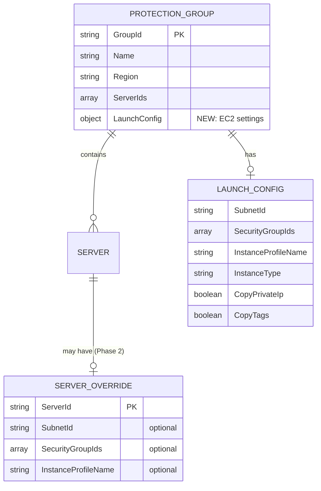
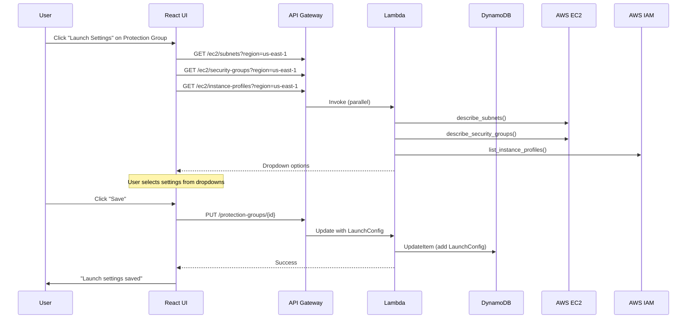
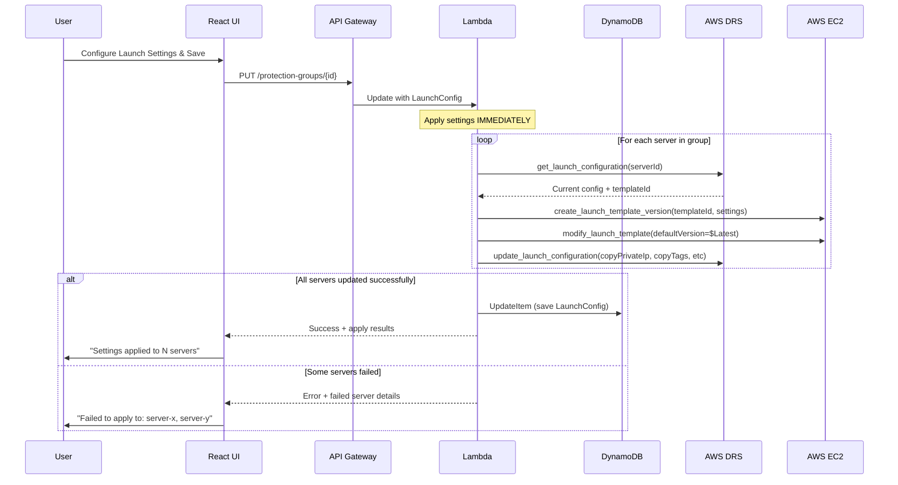

# EC2 Launch Template Management MVP v2 - DynamoDB-Based UI Configuration

**Version:** 2.0  
**Date:** December 2025  
**Status:** Ready for Implementation  
**Estimated Effort:** 5-6 days  
**Key Change:** DynamoDB-based configuration managed entirely through UI (no S3 JSON files)

---

## Executive Summary

This updated MVP replaces the S3 JSON configuration approach with a **DynamoDB-based, UI-driven configuration system**. Users configure EC2 launch settings (subnet, security groups, instance profile) at the **Protection Group level** through the UI, with configurations stored in DynamoDB. No JSON files to maintain.

### Key Design Principles

| Principle | Implementation |
|-----------|----------------|
| **UI-First** | All configuration through CloudScape UI - no JSON files |
| **DynamoDB Storage** | Persistent configuration in existing DynamoDB infrastructure |
| **Protection Group Level** | Bulk settings applied to all servers in a group |
| **Future: Server Overrides** | Phase 2 will add individual server-level overrides |

### MVP Scope

| Included | Excluded (Phase 2) |
|----------|-------------------|
| Protection Group-level EC2 settings | Individual server overrides |
| UI dropdowns for subnet/SG/profile | Tag-based configuration |
| DynamoDB persistence | Configuration templates library |
| Apply settings on drill/recovery | Configuration sync reports |
| Settings validation | Multi-account support |

---

## Architecture Overview

### Data Model



### DynamoDB Schema Update

Extend the existing `protection-groups` table with a `LaunchConfig` attribute:

```json
{
  "GroupId": "pg-abc123",
  "Name": "Web Tier",
  "Region": "us-east-1",
  "ServerIds": ["s-111", "s-222", "s-333"],
  "LaunchConfig": {
    "SubnetId": "subnet-abc123",
    "SecurityGroupIds": ["sg-web-tier", "sg-common"],
    "InstanceProfileName": "DRSRecoveryInstanceRole",
    "InstanceType": "t3.medium",
    "CopyPrivateIp": true,
    "CopyTags": true,
    "Licensing": { "osByol": false }
  },
  "CreatedAt": "2025-12-01T00:00:00Z",
  "UpdatedAt": "2025-12-13T00:00:00Z",
  "Version": 3
}
```

---

## User Flow

### Configure Protection Group Launch Settings



### Apply Settings on Save (Not During Recovery)



**Key benefit**: During drill/recovery, settings are already applied - no additional configuration needed.

---

## Implementation Plan

### Day 1: Backend - EC2 Dropdown Endpoints

#### New API Endpoints

| Method | Endpoint | Description |
|--------|----------|-------------|
| GET | `/ec2/subnets?region={region}` | List VPC subnets |
| GET | `/ec2/security-groups?region={region}` | List security groups |
| GET | `/ec2/instance-profiles?region={region}` | List IAM instance profiles |
| GET | `/ec2/instance-types?region={region}` | List EC2 instance types |

#### Lambda Implementation

Add to `lambda/index.py`:

```python
def get_ec2_subnets(event: Dict) -> Dict:
    """Get VPC subnets for dropdown selection."""
    params = event.get('queryStringParameters', {}) or {}
    region = params.get('region', 'us-east-1')
    
    if not region:
        return response(400, {'error': 'region is required', 'code': 'MISSING_REGION'})
    
    try:
        ec2 = boto3.client('ec2', region_name=region)
        result = ec2.describe_subnets()
        
        subnets = []
        for subnet in result['Subnets']:
            name = next(
                (t['Value'] for t in subnet.get('Tags', []) if t['Key'] == 'Name'),
                None
            )
            label = f"{subnet['SubnetId']}"
            if name:
                label = f"{name} ({subnet['SubnetId']})"
            label += f" - {subnet['CidrBlock']} - {subnet['AvailabilityZone']}"
            
            subnets.append({
                'value': subnet['SubnetId'],
                'label': label,
                'vpcId': subnet['VpcId'],
                'az': subnet['AvailabilityZone'],
                'cidr': subnet['CidrBlock']
            })
        
        subnets.sort(key=lambda x: x['label'])
        return response(200, {'subnets': subnets})
    except Exception as e:
        logger.error(f'Error getting subnets: {e}')
        return response(500, {'error': str(e)})


def get_ec2_security_groups(event: Dict) -> Dict:
    """Get security groups for dropdown selection."""
    params = event.get('queryStringParameters', {}) or {}
    region = params.get('region', 'us-east-1')
    vpc_id = params.get('vpcId')  # Optional filter
    
    if not region:
        return response(400, {'error': 'region is required', 'code': 'MISSING_REGION'})
    
    try:
        ec2 = boto3.client('ec2', region_name=region)
        filters = [{'Name': 'vpc-id', 'Values': [vpc_id]}] if vpc_id else []
        result = ec2.describe_security_groups(Filters=filters)
        
        groups = []
        for sg in result['SecurityGroups']:
            label = f"{sg['GroupName']} ({sg['GroupId']})"
            groups.append({
                'value': sg['GroupId'],
                'label': label,
                'name': sg['GroupName'],
                'vpcId': sg['VpcId'],
                'description': sg.get('Description', '')[:100]
            })
        
        groups.sort(key=lambda x: x['name'])
        return response(200, {'securityGroups': groups})
    except Exception as e:
        logger.error(f'Error getting security groups: {e}')
        return response(500, {'error': str(e)})


def get_ec2_instance_profiles(event: Dict) -> Dict:
    """Get IAM instance profiles for dropdown selection."""
    params = event.get('queryStringParameters', {}) or {}
    region = params.get('region', 'us-east-1')
    
    try:
        iam = boto3.client('iam', region_name=region)
        profiles = []
        paginator = iam.get_paginator('list_instance_profiles')
        
        for page in paginator.paginate():
            for profile in page['InstanceProfiles']:
                profiles.append({
                    'value': profile['InstanceProfileName'],
                    'label': profile['InstanceProfileName'],
                    'arn': profile['Arn']
                })
        
        profiles.sort(key=lambda x: x['label'])
        return response(200, {'instanceProfiles': profiles})
    except Exception as e:
        logger.error(f'Error getting instance profiles: {e}')
        return response(500, {'error': str(e)})


def get_ec2_instance_types(event: Dict) -> Dict:
    """Get common EC2 instance types for dropdown selection."""
    params = event.get('queryStringParameters', {}) or {}
    region = params.get('region', 'us-east-1')
    
    try:
        ec2 = boto3.client('ec2', region_name=region)
        
        # Filter to common families for DRS recovery
        common_families = ['t3', 't3a', 'm5', 'm5a', 'm6i', 'r5', 'r5a', 'r6i', 'c5', 'c5a', 'c6i']
        
        types = []
        paginator = ec2.get_paginator('describe_instance_types')
        
        for page in paginator.paginate(
            Filters=[{'Name': 'instance-type', 'Values': [f'{f}.*' for f in common_families]}]
        ):
            for it in page['InstanceTypes']:
                vcpus = it['VCpuInfo']['DefaultVCpus']
                mem_gb = round(it['MemoryInfo']['SizeInMiB'] / 1024)
                types.append({
                    'value': it['InstanceType'],
                    'label': f"{it['InstanceType']} ({vcpus} vCPU, {mem_gb} GB)",
                    'vcpus': vcpus,
                    'memoryGb': mem_gb
                })
        
        types.sort(key=lambda x: (x['value'].split('.')[0], x['vcpus']))
        return response(200, {'instanceTypes': types})
    except Exception as e:
        logger.error(f'Error getting instance types: {e}')
        return response(500, {'error': str(e)})
```

Add route handling:

```python
elif path == '/ec2/subnets':
    if method == 'GET':
        return get_ec2_subnets(event)
elif path == '/ec2/security-groups':
    if method == 'GET':
        return get_ec2_security_groups(event)
elif path == '/ec2/instance-profiles':
    if method == 'GET':
        return get_ec2_instance_profiles(event)
elif path == '/ec2/instance-types':
    if method == 'GET':
        return get_ec2_instance_types(event)
```


---

### Day 2: Backend - Protection Group LaunchConfig Storage

#### Update Protection Group API

Modify `update_protection_group` in `lambda/index.py` to accept and store `LaunchConfig`:

```python
def update_protection_group(event: Dict) -> Dict:
    """Update protection group including LaunchConfig."""
    try:
        body = json.loads(event.get('body', '{}'))
    except json.JSONDecodeError:
        return response(400, {'error': 'Invalid JSON', 'code': 'INVALID_JSON'})
    
    group_id = event.get('pathParameters', {}).get('id')
    if not group_id:
        return response(400, {'error': 'Group ID required', 'code': 'MISSING_ID'})
    
    # Get existing group for version check
    table = dynamodb.Table(PROTECTION_GROUPS_TABLE)
    existing = table.get_item(Key={'GroupId': group_id}).get('Item')
    
    if not existing:
        return response(404, {'error': 'Protection group not found', 'code': 'NOT_FOUND'})
    
    # Optimistic locking
    if 'Version' in body and body['Version'] != existing.get('Version', 1):
        return response(409, {'error': 'Version conflict', 'code': 'VERSION_CONFLICT'})
    
    # Build update expression
    update_parts = ['UpdatedAt = :updated', 'Version = :version']
    expr_values = {
        ':updated': datetime.utcnow().isoformat() + 'Z',
        ':version': existing.get('Version', 1) + 1
    }
    
    # Standard fields
    if 'Name' in body:
        update_parts.append('Name = :name')
        expr_values[':name'] = body['Name']
    
    if 'ServerIds' in body:
        update_parts.append('ServerIds = :servers')
        expr_values[':servers'] = body['ServerIds']
    
    # NEW: LaunchConfig field
    if 'LaunchConfig' in body:
        launch_config = body['LaunchConfig']
        # Validate LaunchConfig structure
        valid_keys = {'SubnetId', 'SecurityGroupIds', 'InstanceProfileName', 
                      'InstanceType', 'CopyPrivateIp', 'CopyTags', 'Licensing'}
        
        if not isinstance(launch_config, dict):
            return response(400, {'error': 'LaunchConfig must be an object', 'code': 'INVALID_LAUNCH_CONFIG'})
        
        # Validate SecurityGroupIds is array if present
        if 'SecurityGroupIds' in launch_config:
            if not isinstance(launch_config['SecurityGroupIds'], list):
                return response(400, {'error': 'SecurityGroupIds must be an array', 'code': 'INVALID_SECURITY_GROUPS'})
        
        update_parts.append('LaunchConfig = :launchConfig')
        expr_values[':launchConfig'] = launch_config
    
    update_expr = 'SET ' + ', '.join(update_parts)
    
    try:
        result = table.update_item(
            Key={'GroupId': group_id},
            UpdateExpression=update_expr,
            ExpressionAttributeValues=expr_values,
            ReturnValues='ALL_NEW'
        )
        return response(200, result['Attributes'])
    except Exception as e:
        logger.error(f'Error updating protection group: {e}')
        return response(500, {'error': str(e)})
```

#### Update GET to Return LaunchConfig

The existing `get_protection_group` already returns all attributes, so `LaunchConfig` will be included automatically when present.

---

### Day 3: Backend - Apply LaunchConfig on Protection Group Save

Settings are applied **immediately when the Protection Group is saved**, not during recovery. This provides:
- Immediate validation feedback
- No surprises during drill/recovery
- DRS/EC2 state always matches DynamoDB

#### Add Apply Function to API Handler

Add to `lambda/index.py`:

```python
def apply_launch_config_to_servers(server_ids: list, launch_config: dict, region: str) -> dict:
    """Apply LaunchConfig to all servers' EC2 launch templates and DRS settings.
    
    Called immediately when Protection Group is saved.
    Returns summary of results for each server.
    """
    if not launch_config or not server_ids:
        return {'applied': 0, 'skipped': 0, 'failed': 0, 'details': []}
    
    drs = boto3.client('drs', region_name=region)
    ec2 = boto3.client('ec2', region_name=region)
    
    results = {'applied': 0, 'skipped': 0, 'failed': 0, 'details': []}
    
    for server_id in server_ids:
        try:
            # Get DRS launch configuration to find template ID
            drs_config = drs.get_launch_configuration(sourceServerID=server_id)
            template_id = drs_config.get('ec2LaunchTemplateID')
            
            if not template_id:
                results['skipped'] += 1
                results['details'].append({
                    'serverId': server_id,
                    'status': 'skipped',
                    'reason': 'No EC2 launch template'
                })
                continue
            
            # Build EC2 template data
            template_data = {}
            
            if launch_config.get('InstanceType'):
                template_data['InstanceType'] = launch_config['InstanceType']
            
            if launch_config.get('SubnetId') or launch_config.get('SecurityGroupIds'):
                network_interface = {'DeviceIndex': 0}
                if launch_config.get('SubnetId'):
                    network_interface['SubnetId'] = launch_config['SubnetId']
                if launch_config.get('SecurityGroupIds'):
                    network_interface['Groups'] = launch_config['SecurityGroupIds']
                template_data['NetworkInterfaces'] = [network_interface]
            
            if launch_config.get('InstanceProfileName'):
                template_data['IamInstanceProfile'] = {'Name': launch_config['InstanceProfileName']}
            
            # Update EC2 launch template if we have changes
            if template_data:
                ec2.create_launch_template_version(
                    LaunchTemplateId=template_id,
                    LaunchTemplateData=template_data
                )
                ec2.modify_launch_template(
                    LaunchTemplateId=template_id,
                    DefaultVersion='$Latest'
                )
            
            # Update DRS launch configuration
            drs_update = {'sourceServerID': server_id}
            if 'CopyPrivateIp' in launch_config:
                drs_update['copyPrivateIp'] = launch_config['CopyPrivateIp']
            if 'CopyTags' in launch_config:
                drs_update['copyTags'] = launch_config['CopyTags']
            if 'Licensing' in launch_config:
                drs_update['licensing'] = launch_config['Licensing']
            
            if len(drs_update) > 1:
                drs.update_launch_configuration(**drs_update)
            
            results['applied'] += 1
            results['details'].append({
                'serverId': server_id,
                'status': 'applied',
                'templateId': template_id
            })
            
        except Exception as e:
            logger.error(f'Error applying LaunchConfig to {server_id}: {e}')
            results['failed'] += 1
            results['details'].append({
                'serverId': server_id,
                'status': 'failed',
                'error': str(e)
            })
    
    return results
```

#### Update Protection Group Save to Apply Settings

Modify `update_protection_group` to apply settings immediately:

```python
def update_protection_group(event: Dict) -> Dict:
    """Update protection group and apply LaunchConfig to servers."""
    # ... existing validation code ...
    
    # If LaunchConfig changed, apply to all servers immediately
    if 'LaunchConfig' in body:
        launch_config = body['LaunchConfig']
        server_ids = body.get('ServerIds', existing.get('ServerIds', []))
        region = existing.get('Region')
        
        # Apply to DRS/EC2 immediately
        apply_results = apply_launch_config_to_servers(server_ids, launch_config, region)
        
        # If any failed, return error (don't save partial state)
        if apply_results['failed'] > 0:
            failed_servers = [d for d in apply_results['details'] if d['status'] == 'failed']
            return response(400, {
                'error': 'Failed to apply launch settings to some servers',
                'code': 'LAUNCH_CONFIG_APPLY_FAILED',
                'failedServers': failed_servers
            })
    
    # ... rest of DynamoDB update code ...
    
    # Include apply results in response
    result = table.update_item(...)
    response_data = result['Attributes']
    if 'LaunchConfig' in body:
        response_data['launchConfigApplyResults'] = apply_results
    
    return response(200, response_data)
```

#### Same for Create Protection Group

```python
def create_protection_group(event: Dict) -> Dict:
    """Create protection group and apply LaunchConfig to servers."""
    # ... existing validation code ...
    
    # If LaunchConfig provided, apply to servers before saving
    if body.get('LaunchConfig') and body.get('ServerIds'):
        apply_results = apply_launch_config_to_servers(
            body['ServerIds'],
            body['LaunchConfig'],
            body['Region']
        )
        
        if apply_results['failed'] > 0:
            failed_servers = [d for d in apply_results['details'] if d['status'] == 'failed']
            return response(400, {
                'error': 'Failed to apply launch settings to some servers',
                'code': 'LAUNCH_CONFIG_APPLY_FAILED',
                'failedServers': failed_servers
            })
    
    # ... rest of DynamoDB create code ...
```


---

### Day 4: Frontend - LaunchConfig UI in Protection Group Dialog

#### Update TypeScript Types

Add to `frontend/src/types/index.ts`:

```typescript
export interface LaunchConfig {
  SubnetId?: string;
  SecurityGroupIds?: string[];
  InstanceProfileName?: string;
  InstanceType?: string;
  CopyPrivateIp?: boolean;
  CopyTags?: boolean;
  Licensing?: {
    osByol?: boolean;
  };
}

export interface ProtectionGroup {
  GroupId: string;
  Name: string;
  Region: string;
  ServerIds: string[];
  LaunchConfig?: LaunchConfig;  // NEW
  CreatedAt: string;
  UpdatedAt: string;
  Version: number;
}

// Dropdown option types
export interface SubnetOption {
  value: string;
  label: string;
  vpcId: string;
  az: string;
  cidr: string;
}

export interface SecurityGroupOption {
  value: string;
  label: string;
  name: string;
  vpcId: string;
  description: string;
}

export interface InstanceProfileOption {
  value: string;
  label: string;
  arn: string;
}

export interface InstanceTypeOption {
  value: string;
  label: string;
  vcpus: number;
  memoryGb: number;
}
```

#### Add API Service Functions

Add to `frontend/src/services/api.ts`:

```typescript
// EC2 resource APIs for dropdowns
export const getSubnets = async (region: string): Promise<SubnetOption[]> => {
  const response = await apiClient.get('/ec2/subnets', { params: { region } });
  return response.data.subnets;
};

export const getSecurityGroups = async (region: string, vpcId?: string): Promise<SecurityGroupOption[]> => {
  const response = await apiClient.get('/ec2/security-groups', { params: { region, vpcId } });
  return response.data.securityGroups;
};

export const getInstanceProfiles = async (region: string): Promise<InstanceProfileOption[]> => {
  const response = await apiClient.get('/ec2/instance-profiles', { params: { region } });
  return response.data.instanceProfiles;
};

export const getInstanceTypes = async (region: string): Promise<InstanceTypeOption[]> => {
  const response = await apiClient.get('/ec2/instance-types', { params: { region } });
  return response.data.instanceTypes;
};
```

#### Create LaunchConfigSection Component

Create `frontend/src/components/LaunchConfigSection.tsx`:

```typescript
import React, { useState, useEffect } from 'react';
import {
  Container,
  Header,
  SpaceBetween,
  FormField,
  Select,
  Multiselect,
  Checkbox,
  ColumnLayout,
  Spinner,
  Box,
  Alert,
  SelectProps
} from '@cloudscape-design/components';
import {
  LaunchConfig,
  SubnetOption,
  SecurityGroupOption,
  InstanceProfileOption,
  InstanceTypeOption
} from '../types';
import {
  getSubnets,
  getSecurityGroups,
  getInstanceProfiles,
  getInstanceTypes
} from '../services/api';

interface LaunchConfigSectionProps {
  region: string;
  launchConfig: LaunchConfig;
  onChange: (config: LaunchConfig) => void;
  disabled?: boolean;
}

export const LaunchConfigSection: React.FC<LaunchConfigSectionProps> = ({
  region,
  launchConfig,
  onChange,
  disabled = false
}) => {
  const [loading, setLoading] = useState(true);
  const [error, setError] = useState<string | null>(null);
  
  // Dropdown options
  const [subnets, setSubnets] = useState<SubnetOption[]>([]);
  const [securityGroups, setSecurityGroups] = useState<SecurityGroupOption[]>([]);
  const [instanceProfiles, setInstanceProfiles] = useState<InstanceProfileOption[]>([]);
  const [instanceTypes, setInstanceTypes] = useState<InstanceTypeOption[]>([]);

  useEffect(() => {
    if (region) {
      loadDropdownOptions();
    }
  }, [region]);

  const loadDropdownOptions = async () => {
    setLoading(true);
    setError(null);
    try {
      const [subs, sgs, profiles, types] = await Promise.all([
        getSubnets(region),
        getSecurityGroups(region),
        getInstanceProfiles(region),
        getInstanceTypes(region)
      ]);
      setSubnets(subs);
      setSecurityGroups(sgs);
      setInstanceProfiles(profiles);
      setInstanceTypes(types);
    } catch (err: any) {
      setError('Failed to load EC2 resources. Check IAM permissions.');
      console.error('Error loading dropdown options:', err);
    } finally {
      setLoading(false);
    }
  };

  const updateConfig = (key: keyof LaunchConfig, value: any) => {
    onChange({ ...launchConfig, [key]: value });
  };

  // Convert to CloudScape options format
  const subnetOptions: SelectProps.Option[] = subnets.map(s => ({
    value: s.value,
    label: s.label
  }));

  const sgOptions: SelectProps.Option[] = securityGroups.map(sg => ({
    value: sg.value,
    label: sg.label
  }));

  const profileOptions: SelectProps.Option[] = instanceProfiles.map(p => ({
    value: p.value,
    label: p.label
  }));

  const typeOptions: SelectProps.Option[] = instanceTypes.map(t => ({
    value: t.value,
    label: t.label
  }));

  if (loading) {
    return (
      <Container header={<Header variant="h3">Launch Settings</Header>}>
        <Box textAlign="center" padding="l">
          <Spinner /> Loading EC2 resources...
        </Box>
      </Container>
    );
  }

  if (error) {
    return (
      <Container header={<Header variant="h3">Launch Settings</Header>}>
        <Alert type="error">{error}</Alert>
      </Container>
    );
  }

  return (
    <Container
      header={
        <Header
          variant="h3"
          description="Configure EC2 settings applied to all servers in this group during recovery"
        >
          Launch Settings
        </Header>
      }
    >
      <SpaceBetween direction="vertical" size="m">
        <ColumnLayout columns={2}>
          <FormField
            label="Target Subnet"
            description="VPC subnet for recovery instances"
          >
            <Select
              selectedOption={subnetOptions.find(o => o.value === launchConfig.SubnetId) || null}
              onChange={({ detail }) => updateConfig('SubnetId', detail.selectedOption?.value)}
              options={subnetOptions}
              placeholder="Select subnet"
              filteringType="auto"
              disabled={disabled}
            />
          </FormField>

          <FormField
            label="Instance Type"
            description="EC2 instance type for recovery"
          >
            <Select
              selectedOption={typeOptions.find(o => o.value === launchConfig.InstanceType) || null}
              onChange={({ detail }) => updateConfig('InstanceType', detail.selectedOption?.value)}
              options={typeOptions}
              placeholder="Select instance type"
              filteringType="auto"
              disabled={disabled}
            />
          </FormField>
        </ColumnLayout>

        <FormField
          label="Security Groups"
          description="Security groups for recovery instances"
        >
          <Multiselect
            selectedOptions={sgOptions.filter(o => 
              launchConfig.SecurityGroupIds?.includes(o.value || '')
            )}
            onChange={({ detail }) => 
              updateConfig('SecurityGroupIds', detail.selectedOptions.map(o => o.value))
            }
            options={sgOptions}
            placeholder="Select security groups"
            filteringType="auto"
            disabled={disabled}
          />
        </FormField>

        <FormField
          label="IAM Instance Profile"
          description="IAM role for recovery instances"
        >
          <Select
            selectedOption={profileOptions.find(o => o.value === launchConfig.InstanceProfileName) || null}
            onChange={({ detail }) => updateConfig('InstanceProfileName', detail.selectedOption?.value)}
            options={profileOptions}
            placeholder="Select instance profile"
            filteringType="auto"
            disabled={disabled}
          />
        </FormField>

        <ColumnLayout columns={3}>
          <Checkbox
            checked={launchConfig.CopyPrivateIp || false}
            onChange={({ detail }) => updateConfig('CopyPrivateIp', detail.checked)}
            disabled={disabled}
          >
            Copy Private IP
          </Checkbox>
          <Checkbox
            checked={launchConfig.CopyTags || false}
            onChange={({ detail }) => updateConfig('CopyTags', detail.checked)}
            disabled={disabled}
          >
            Copy Tags
          </Checkbox>
          <Checkbox
            checked={launchConfig.Licensing?.osByol || false}
            onChange={({ detail }) => updateConfig('Licensing', { osByol: detail.checked })}
            disabled={disabled}
          >
            BYOL Licensing
          </Checkbox>
        </ColumnLayout>
      </SpaceBetween>
    </Container>
  );
};

export default LaunchConfigSection;
```


#### Update ProtectionGroupDialog

Add LaunchConfigSection to `frontend/src/components/ProtectionGroupDialog.tsx`:

```typescript
// Add import
import { LaunchConfigSection } from './LaunchConfigSection';

// In the dialog component, add state for LaunchConfig
const [launchConfig, setLaunchConfig] = useState<LaunchConfig>(
  existingGroup?.LaunchConfig || {}
);

// Add to the form, after server selection
<LaunchConfigSection
  region={region}
  launchConfig={launchConfig}
  onChange={setLaunchConfig}
  disabled={saving}
/>

// Include in save payload
const handleSave = async () => {
  const payload = {
    Name: name,
    Region: region,
    ServerIds: selectedServers,
    LaunchConfig: launchConfig,  // Include LaunchConfig
    Version: existingGroup?.Version
  };
  // ... rest of save logic
};
```

---

### Day 5: IAM Permissions & API Gateway

#### IAM Permissions

Add to `cfn/lambda-stack.yaml` ApiHandlerRole:

```yaml
# EC2 Read permissions for dropdowns
- Effect: Allow
  Action:
    - ec2:DescribeSubnets
    - ec2:DescribeSecurityGroups
    - ec2:DescribeInstanceTypes
    - ec2:DescribeLaunchTemplates
    - ec2:DescribeLaunchTemplateVersions
  Resource: '*'

# EC2 Write permissions for template updates
- Effect: Allow
  Action:
    - ec2:CreateLaunchTemplateVersion
    - ec2:ModifyLaunchTemplate
  Resource: !Sub 'arn:aws:ec2:*:${AWS::AccountId}:launch-template/*'

# IAM Read permissions for instance profiles
- Effect: Allow
  Action:
    - iam:ListInstanceProfiles
  Resource: '*'
```

#### API Gateway Resources

Add to `cfn/api-stack.yaml`:

```yaml
# /ec2 parent resource
Ec2Resource:
  Type: AWS::ApiGateway::Resource
  Properties:
    RestApiId: !Ref ApiGateway
    ParentId: !GetAtt ApiGateway.RootResourceId
    PathPart: ec2

# /ec2/subnets
Ec2SubnetsResource:
  Type: AWS::ApiGateway::Resource
  Properties:
    RestApiId: !Ref ApiGateway
    ParentId: !Ref Ec2Resource
    PathPart: subnets

Ec2SubnetsGet:
  Type: AWS::ApiGateway::Method
  Properties:
    RestApiId: !Ref ApiGateway
    ResourceId: !Ref Ec2SubnetsResource
    HttpMethod: GET
    AuthorizationType: COGNITO_USER_POOLS
    AuthorizerId: !Ref CognitoAuthorizer
    Integration:
      Type: AWS_PROXY
      IntegrationHttpMethod: POST
      Uri: !Sub 'arn:aws:apigateway:${AWS::Region}:lambda:path/2015-03-31/functions/${ApiHandlerArn}/invocations'

# /ec2/security-groups
Ec2SecurityGroupsResource:
  Type: AWS::ApiGateway::Resource
  Properties:
    RestApiId: !Ref ApiGateway
    ParentId: !Ref Ec2Resource
    PathPart: security-groups

Ec2SecurityGroupsGet:
  Type: AWS::ApiGateway::Method
  Properties:
    RestApiId: !Ref ApiGateway
    ResourceId: !Ref Ec2SecurityGroupsResource
    HttpMethod: GET
    AuthorizationType: COGNITO_USER_POOLS
    AuthorizerId: !Ref CognitoAuthorizer
    Integration:
      Type: AWS_PROXY
      IntegrationHttpMethod: POST
      Uri: !Sub 'arn:aws:apigateway:${AWS::Region}:lambda:path/2015-03-31/functions/${ApiHandlerArn}/invocations'

# /ec2/instance-profiles
Ec2InstanceProfilesResource:
  Type: AWS::ApiGateway::Resource
  Properties:
    RestApiId: !Ref ApiGateway
    ParentId: !Ref Ec2Resource
    PathPart: instance-profiles

Ec2InstanceProfilesGet:
  Type: AWS::ApiGateway::Method
  Properties:
    RestApiId: !Ref ApiGateway
    ResourceId: !Ref Ec2InstanceProfilesResource
    HttpMethod: GET
    AuthorizationType: COGNITO_USER_POOLS
    AuthorizerId: !Ref CognitoAuthorizer
    Integration:
      Type: AWS_PROXY
      IntegrationHttpMethod: POST
      Uri: !Sub 'arn:aws:apigateway:${AWS::Region}:lambda:path/2015-03-31/functions/${ApiHandlerArn}/invocations'

# /ec2/instance-types
Ec2InstanceTypesResource:
  Type: AWS::ApiGateway::Resource
  Properties:
    RestApiId: !Ref ApiGateway
    ParentId: !Ref Ec2Resource
    PathPart: instance-types

Ec2InstanceTypesGet:
  Type: AWS::ApiGateway::Method
  Properties:
    RestApiId: !Ref ApiGateway
    ResourceId: !Ref Ec2InstanceTypesResource
    HttpMethod: GET
    AuthorizationType: COGNITO_USER_POOLS
    AuthorizerId: !Ref CognitoAuthorizer
    Integration:
      Type: AWS_PROXY
      IntegrationHttpMethod: POST
      Uri: !Sub 'arn:aws:apigateway:${AWS::Region}:lambda:path/2015-03-31/functions/${ApiHandlerArn}/invocations'

# CORS OPTIONS for each (follow existing pattern)
```

---

### Day 6: Testing & Documentation

#### Test Cases

1. **EC2 Dropdown API Tests**
   - GET /ec2/subnets returns subnets with labels
   - GET /ec2/security-groups returns SGs with names
   - GET /ec2/instance-profiles returns profiles
   - GET /ec2/instance-types returns filtered types
   - Missing region returns 400 MISSING_REGION

2. **Protection Group Save + Apply Tests**
   - Create group with LaunchConfig applies to DRS/EC2 immediately
   - Update group LaunchConfig applies to DRS/EC2 immediately
   - Failed apply returns error, doesn't save to DynamoDB
   - Response includes apply results (applied/skipped/failed counts)
   - Servers without EC2 templates are skipped (not failed)

3. **DRS/EC2 Integration Tests**
   - EC2 launch template version created with correct settings
   - EC2 launch template default version set to $Latest
   - DRS launch configuration updated (copyPrivateIp, copyTags, licensing)
   - Invalid subnet/SG returns meaningful error

4. **UI Tests**
   - Dropdowns load on dialog open
   - Selections persist on save
   - Edit mode shows existing values
   - Error toast shows failed servers
   - Success toast shows "Settings applied to N servers"

---

## UI Mockup

```text
┌─────────────────────────────────────────────────────────────────────┐
│ Create Protection Group                                      [X]    │
├─────────────────────────────────────────────────────────────────────┤
│                                                                     │
│ ┌─ Basic Information ─────────────────────────────────────────────┐ │
│ │ Name                          Region                            │ │
│ │ [Web Tier________________]    [us-east-1 (N. Virginia)     ▼]  │ │
│ └─────────────────────────────────────────────────────────────────┘ │
│                                                                     │
│ ┌─ Server Selection ──────────────────────────────────────────────┐ │
│ │ [Search servers...]                                             │ │
│ │ ┌─────────────────────────────────────────────────────────────┐ │ │
│ │ │ ☑ web-server-01 (s-abc123)  ● Available                     │ │ │
│ │ │ ☑ web-server-02 (s-def456)  ● Available                     │ │ │
│ │ │ ☐ db-server-01 (s-ghi789)   ○ Assigned to "DB Tier"         │ │ │
│ │ └─────────────────────────────────────────────────────────────┘ │ │
│ │ 2 servers selected                                              │ │
│ └─────────────────────────────────────────────────────────────────┘ │
│                                                                     │
│ ┌─ Launch Settings ───────────────────────────────────────────────┐ │
│ │ Configure EC2 settings applied to all servers during recovery   │ │
│ │                                                                 │ │
│ │ Target Subnet                    Instance Type                  │ │
│ │ [Private-1a (subnet-abc) ▼]     [t3.medium (2 vCPU, 4GB)   ▼] │ │
│ │                                                                 │ │
│ │ Security Groups                                                 │ │
│ │ [web-tier (sg-111), common (sg-222)                        ▼]  │ │
│ │                                                                 │ │
│ │ IAM Instance Profile                                            │ │
│ │ [DRSRecoveryInstanceRole                                   ▼]  │ │
│ │                                                                 │ │
│ │ [✓] Copy Private IP    [✓] Copy Tags    [ ] BYOL Licensing     │ │
│ └─────────────────────────────────────────────────────────────────┘ │
│                                                                     │
│                                        [Cancel]  [Create Group]     │
└─────────────────────────────────────────────────────────────────────┘
```

---

## Phase 2: Individual Server Overrides

In a future phase, add server-level overrides that take precedence over group settings:

```typescript
// Server override stored in separate table or as nested attribute
interface ServerOverride {
  ServerId: string;
  SubnetId?: string;           // Override group subnet
  SecurityGroupIds?: string[]; // Override group SGs
  InstanceProfileName?: string;// Override group profile
  InstanceType?: string;       // Override group type
}

// Resolution logic in orchestration
function getEffectiveConfig(serverId: string, groupConfig: LaunchConfig, overrides: ServerOverride[]): LaunchConfig {
  const serverOverride = overrides.find(o => o.ServerId === serverId);
  if (!serverOverride) return groupConfig;
  
  return {
    SubnetId: serverOverride.SubnetId || groupConfig.SubnetId,
    SecurityGroupIds: serverOverride.SecurityGroupIds || groupConfig.SecurityGroupIds,
    InstanceProfileName: serverOverride.InstanceProfileName || groupConfig.InstanceProfileName,
    InstanceType: serverOverride.InstanceType || groupConfig.InstanceType,
    CopyPrivateIp: groupConfig.CopyPrivateIp,
    CopyTags: groupConfig.CopyTags,
    Licensing: groupConfig.Licensing
  };
}
```

---

## Comparison: S3 JSON vs DynamoDB UI

| Aspect | S3 JSON (Old) | DynamoDB UI (New) |
|--------|---------------|-------------------|
| User Experience | Edit JSON files | Point-and-click UI |
| Validation | Manual/error-prone | Dropdown selections |
| Storage | S3 bucket | Existing DynamoDB |
| Versioning | S3 versioning | DynamoDB Version field |
| Access Control | S3 policies | Cognito + API Gateway |
| Audit Trail | S3 access logs | DynamoDB UpdatedAt |
| Bulk Operations | Edit JSON array | UI multi-select |
| Learning Curve | JSON knowledge | None |

---

## Deployment Checklist

### Backend
- [ ] Add EC2 dropdown endpoints to Lambda
- [ ] Add route handling for /ec2/* paths
- [ ] Update protection group API for LaunchConfig
- [ ] Update orchestration to apply LaunchConfig
- [ ] Add IAM permissions to CloudFormation
- [ ] Add API Gateway resources

### Frontend
- [ ] Add TypeScript types
- [ ] Add API service functions
- [ ] Create LaunchConfigSection component
- [ ] Update ProtectionGroupDialog
- [ ] Build and deploy

### Testing
- [ ] Test dropdown APIs
- [ ] Test LaunchConfig persistence
- [ ] Test recovery with LaunchConfig
- [ ] E2E test full flow

---

## References

- [Original MVP Plan](EC2_LAUNCH_TEMPLATE_MVP_PLAN.md) - S3-based approach (superseded)
- [DRS Launch Settings Research](../research/DRS_LAUNCH_TEMPLATE_SETTINGS_RESEARCH.md)
- [AWS DRS Configuration Synchronizer](https://github.com/aws-samples/drs-tools/tree/main/drs-configuration-synchronizer)


---

## CLI / Automation Support

All features are accessible via REST API, supporting UI, CLI, SSM, and Step Functions invocation methods (Dual Mode Orchestration).

### CLI Examples

#### Get EC2 Resources for Configuration

```bash
# Get available subnets
curl -H "Authorization: Bearer $TOKEN" \
  "$API_ENDPOINT/ec2/subnets?region=us-east-1"

# Get security groups (optionally filter by VPC)
curl -H "Authorization: Bearer $TOKEN" \
  "$API_ENDPOINT/ec2/security-groups?region=us-east-1&vpcId=vpc-abc123"

# Get instance profiles
curl -H "Authorization: Bearer $TOKEN" \
  "$API_ENDPOINT/ec2/instance-profiles?region=us-east-1"

# Get instance types
curl -H "Authorization: Bearer $TOKEN" \
  "$API_ENDPOINT/ec2/instance-types?region=us-east-1"
```

#### Create Protection Group with LaunchConfig

```bash
curl -X POST -H "Authorization: Bearer $TOKEN" \
  -H "Content-Type: application/json" \
  "$API_ENDPOINT/protection-groups" \
  -d '{
    "Name": "Web Tier",
    "Region": "us-east-1",
    "ServerIds": ["s-abc123", "s-def456"],
    "LaunchConfig": {
      "SubnetId": "subnet-abc123",
      "SecurityGroupIds": ["sg-web", "sg-common"],
      "InstanceProfileName": "DRSRecoveryRole",
      "InstanceType": "t3.medium",
      "CopyPrivateIp": true,
      "CopyTags": true
    }
  }'
```

#### Update Protection Group LaunchConfig

```bash
curl -X PUT -H "Authorization: Bearer $TOKEN" \
  -H "Content-Type: application/json" \
  "$API_ENDPOINT/protection-groups/pg-abc123" \
  -d '{
    "LaunchConfig": {
      "SubnetId": "subnet-new",
      "SecurityGroupIds": ["sg-updated"],
      "InstanceProfileName": "NewRole",
      "InstanceType": "m5.large"
    },
    "Version": 3
  }'
```

Response includes apply results:
```json
{
  "GroupId": "pg-abc123",
  "Name": "Web Tier",
  "LaunchConfig": { ... },
  "launchConfigApplyResults": {
    "applied": 2,
    "skipped": 0,
    "failed": 0,
    "details": [
      {"serverId": "s-abc123", "status": "applied", "templateId": "lt-111"},
      {"serverId": "s-def456", "status": "applied", "templateId": "lt-222"}
    ]
  }
}
```

### SSM Automation Example

```yaml
# SSM Document snippet for configuring Protection Group
- name: ConfigureProtectionGroup
  action: aws:executeAwsApi
  inputs:
    Service: lambda
    Api: Invoke
    FunctionName: !Sub 'drs-orchestration-api-handler-${Environment}'
    Payload:
      httpMethod: PUT
      path: /protection-groups/{{ProtectionGroupId}}
      body:
        LaunchConfig:
          SubnetId: '{{TargetSubnet}}'
          SecurityGroupIds: '{{SecurityGroups}}'
          InstanceProfileName: '{{InstanceProfile}}'
```

### Step Functions Integration

```json
{
  "ConfigureLaunchSettings": {
    "Type": "Task",
    "Resource": "arn:aws:states:::lambda:invoke",
    "Parameters": {
      "FunctionName": "${ApiHandlerArn}",
      "Payload": {
        "httpMethod": "PUT",
        "path.$": "States.Format('/protection-groups/{}', $.protectionGroupId)",
        "body": {
          "LaunchConfig": {
            "SubnetId.$": "$.targetSubnet",
            "SecurityGroupIds.$": "$.securityGroups",
            "InstanceProfileName.$": "$.instanceProfile"
          }
        }
      }
    },
    "ResultPath": "$.configResult",
    "Next": "StartRecovery"
  }
}
```

### AWS CLI Direct (Without API)

For automation that bypasses the orchestration API:

```bash
# Apply settings directly to DRS/EC2 (what the API does internally)

# 1. Get DRS launch config to find template ID
TEMPLATE_ID=$(aws drs get-launch-configuration \
  --source-server-id s-abc123 \
  --query 'ec2LaunchTemplateID' --output text)

# 2. Create new template version with settings
aws ec2 create-launch-template-version \
  --launch-template-id $TEMPLATE_ID \
  --launch-template-data '{
    "InstanceType": "t3.medium",
    "NetworkInterfaces": [{
      "DeviceIndex": 0,
      "SubnetId": "subnet-abc123",
      "Groups": ["sg-web", "sg-common"]
    }],
    "IamInstanceProfile": {"Name": "DRSRecoveryRole"}
  }'

# 3. Set as default version
aws ec2 modify-launch-template \
  --launch-template-id $TEMPLATE_ID \
  --default-version '$Latest'

# 4. Update DRS settings
aws drs update-launch-configuration \
  --source-server-id s-abc123 \
  --copy-private-ip \
  --copy-tags
```

### Bulk Configuration Script

```bash
#!/bin/bash
# bulk-configure-launch-settings.sh
# Configure all servers in a protection group

API_ENDPOINT="https://your-api.execute-api.us-east-1.amazonaws.com/prod"
TOKEN="your-jwt-token"

# Configuration
PROTECTION_GROUP_ID="pg-abc123"
SUBNET_ID="subnet-target"
SECURITY_GROUPS='["sg-web", "sg-common"]'
INSTANCE_PROFILE="DRSRecoveryRole"
INSTANCE_TYPE="t3.medium"

# Update protection group with LaunchConfig
curl -s -X PUT \
  -H "Authorization: Bearer $TOKEN" \
  -H "Content-Type: application/json" \
  "$API_ENDPOINT/protection-groups/$PROTECTION_GROUP_ID" \
  -d "{
    \"LaunchConfig\": {
      \"SubnetId\": \"$SUBNET_ID\",
      \"SecurityGroupIds\": $SECURITY_GROUPS,
      \"InstanceProfileName\": \"$INSTANCE_PROFILE\",
      \"InstanceType\": \"$INSTANCE_TYPE\",
      \"CopyPrivateIp\": true,
      \"CopyTags\": true
    }
  }" | jq '.launchConfigApplyResults'
```

---

## API Contract Summary

| Method | Endpoint | Description | CLI Support |
|--------|----------|-------------|-------------|
| GET | `/ec2/subnets?region={r}` | List subnets | ✅ |
| GET | `/ec2/security-groups?region={r}` | List security groups | ✅ |
| GET | `/ec2/instance-profiles?region={r}` | List IAM profiles | ✅ |
| GET | `/ec2/instance-types?region={r}` | List instance types | ✅ |
| POST | `/protection-groups` | Create with LaunchConfig | ✅ |
| PUT | `/protection-groups/{id}` | Update LaunchConfig | ✅ |
| GET | `/protection-groups/{id}` | Get with LaunchConfig | ✅ |

All endpoints return JSON and support the same authentication (Cognito JWT) used by the UI.
