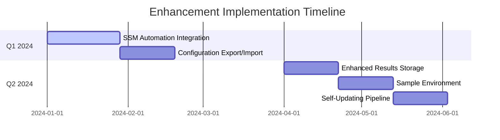

# AWS DRS Orchestration Enhancement Roadmap
*Adopting Best Practices from AWS DRS Plan Automation*

## Executive Summary

After analyzing the [AWS DRS Tools repository](https://github.com/aws-samples/drs-tools), we've identified 5 key enhancement opportunities that could significantly improve our DRS Orchestration platform while maintaining our enterprise-grade architecture.

## Enhancement Overview

| Enhancement | Effort | Impact | Risk | Priority | Timeline |
|-------------|--------|--------|------|----------|----------|
| [SSM Automation Integration](#1-ssm-automation-integration) | 4 weeks | High | Medium | 1 | Q1 2024 |
| [Configuration Export/Import](#5-configuration-exportimport-enhancement) | 3 weeks | High | Low | 2 | Q1 2024 |
| [Enhanced Results Storage](#2-enhanced-results-storage--audit-trail) | 3 weeks | Medium | Low | 3 | Q2 2024 |
| [Sample Environment](#3-sample-environment-deployment) | 3 weeks | Medium | Low | 4 | Q2 2024 |
| [Self-Updating Pipeline](#4-self-updating-cicd-pipeline) | 3 weeks | Medium | Medium | 5 | Q2 2024 |

**Total Effort**: 16 weeks | **Resource Requirements**: 1 senior developer

---

## 1. SSM Automation Integration

### Current State
- Wave-based execution with pause/resume
- No pre/post-wave automation capabilities

### Enhancement Opportunity
Add SSM Automation runbooks for pre/post-wave actions, enabling broader disaster recovery automation beyond EC2 instances.

### Implementation Plan

#### Phase 1: Data Model Extension (1 week)
```json
{
    "WaveName": "Database Tier",
    "ProtectionGroupId": "pg-123",
    "PreWaveActions": [
        {
            "Name": "Stop Application Services",
            "DocumentName": "StopServices",
            "Parameters": {"ServiceNames": ["app-service"]},
            "MaxWaitTime": 300
        }
    ],
    "PostWaveActions": [
        {
            "Name": "Validate Database Connectivity", 
            "DocumentName": "ValidateDB",
            "Parameters": {"ConnectionString": "{{resolve:secretsmanager:db-conn}}"},
            "MaxWaitTime": 600
        }
    ]
}
```

#### Phase 2: Step Functions Integration (2 weeks)
```yaml
# Update step-functions-stack.yaml
PreWaveActionsState:
  Type: Task
  Resource: arn:aws:states:::aws-sdk:ssm:startAutomationExecution
  Parameters:
    DocumentName.$: $.Wave.PreWaveActions[0].DocumentName
    Parameters.$: $.Wave.PreWaveActions[0].Parameters
  Next: WaitForPreWaveCompletion

PostWaveActionsState:
  Type: Task  
  Resource: arn:aws:states:::aws-sdk:ssm:startAutomationExecution
  Parameters:
    DocumentName.$: $.Wave.PostWaveActions[0].DocumentName
    Parameters.$: $.Wave.PostWaveActions[0].Parameters
  Next: WaitForPostWaveCompletion
```

#### Phase 3: Frontend UI (1 week)
```typescript
// Add to WaveConfiguration component
interface PrePostWaveAction {
  name: string;
  documentName: string;
  parameters: Record<string, string[]>;
  maxWaitTime: number;
}

const ActionEditor = ({ actions, onChange }: ActionEditorProps) => (
  <FormField label="Pre-Wave Actions">
    <SpaceBetween size="s">
      {actions.map((action, index) => (
        <Container key={index}>
          <Input 
            value={action.documentName}
            placeholder="SSM Document Name"
            onChange={({detail}) => updateAction(index, 'documentName', detail.value)}
          />
        </Container>
      ))}
    </SpaceBetween>
  </FormField>
);
```

### Benefits
- **Broader Automation**: Support for RDS, Lambda, Route 53, S3 automation
- **Flexible Integration**: Any SSM Automation document can be used
- **Sequenced Actions**: Pre/post-wave automation with proper ordering

---

## 2. Enhanced Results Storage & Audit Trail

### Current State
- Basic execution history in DynamoDB
- Limited audit trail capabilities

### Enhancement Opportunity
Comprehensive execution results with detailed job logs, automation outputs, and audit trails.

### Implementation Plan

#### Phase 1: Results Schema Enhancement (1 week)
```python
# Enhanced execution history structure
{
    "ExecutionId": "exec-123",
    "PlanId": "plan-456", 
    "DetailedResults": {
        "duration": "15m 30s",
        "sourceServers": [
            {
                "sourceServerID": "s-123",
                "hostname": "web-01",
                "drsJob": {
                    "jobID": "drsjob-456",
                    "status": "COMPLETED",
                    "launchTime": "2024-01-15T10:30:00Z",
                    "completionTime": "2024-01-15T10:35:00Z"
                },
                "recoveryInstance": {
                    "instanceId": "i-789",
                    "privateIp": "10.0.1.100",
                    "launchTime": "2024-01-15T10:33:00Z"
                }
            }
        ],
        "waveResults": [
            {
                "waveName": "Database",
                "preWaveActions": [
                    {
                        "name": "Stop Services",
                        "automationExecutionId": "auto-123",
                        "status": "Success",
                        "duration": "45s",
                        "outputs": {"StoppedServices": ["mysql", "redis"]}
                    }
                ],
                "drsJob": {
                    "jobID": "drsjob-456",
                    "participatingServers": 3,
                    "launchedInstances": 3,
                    "duration": "8m 15s"
                },
                "postWaveActions": [
                    {
                        "name": "Validate Connectivity",
                        "automationExecutionId": "auto-124", 
                        "status": "Success",
                        "outputs": {"ConnectionTest": "PASSED"}
                    }
                ]
            }
        ]
    }
}
```

#### Phase 2: Results Collection (2 weeks)
```python
def collect_detailed_results(execution_id: str) -> Dict:
    """Collect comprehensive execution results"""
    execution = get_execution_details(execution_id)
    
    detailed_results = {
        "sourceServers": [],
        "waveResults": []
    }
    
    for wave in execution.get("Waves", []):
        wave_result = {
            "waveName": wave.get("WaveName"),
            "preWaveActions": collect_ssm_results(wave.get("PreWaveActions", [])),
            "drsJob": collect_drs_job_details(wave.get("JobId")),
            "postWaveActions": collect_ssm_results(wave.get("PostWaveActions", []))
        }
        detailed_results["waveResults"].append(wave_result)
    
    return detailed_results

def collect_ssm_results(actions: List[Dict]) -> List[Dict]:
    """Collect SSM automation execution results"""
    ssm = boto3.client('ssm')
    results = []
    
    for action in actions:
        exec_id = action.get("AutomationExecutionId")
        if exec_id:
            response = ssm.get_automation_execution(AutomationExecutionId=exec_id)
            results.append({
                "name": action.get("Name"),
                "automationExecutionId": exec_id,
                "status": response.get("AutomationExecutionStatus"),
                "outputs": response.get("Outputs", {})
            })
    
    return results
```

### Benefits
- **Complete Audit Trail**: Detailed execution history for compliance
- **Troubleshooting**: Comprehensive logs for debugging failed executions
- **Reporting**: Rich data for recovery metrics and analysis

---

## 3. Sample Environment Deployment

### Current State
- Manual test environment setup
- No automated demo/testing infrastructure

### Enhancement Opportunity
Automated sample environment deployment for testing and demonstrations.

### Implementation Plan

#### Phase 1: Sample Infrastructure Template (1 week)
```yaml
# cfn/sample-environment-stack.yaml
AWSTemplateFormatVersion: '2010-09-09'
Description: 'Sample 3-tier application for DRS Orchestration testing'

Resources:
  # VPC and Networking
  SampleVPC:
    Type: AWS::EC2::VPC
    Properties:
      CidrBlock: 10.0.0.0/16
      EnableDnsHostnames: true
      Tags:
        - Key: Name
          Value: !Sub '${ProjectName}-sample-vpc'

  # Database Tier (1 instance)
  DatabaseInstance:
    Type: AWS::EC2::Instance
    Properties:
      ImageId: !Ref LatestAmiId
      InstanceType: t3.micro
      SubnetId: !Ref PrivateSubnet
      SecurityGroupIds: [!Ref DatabaseSecurityGroup]
      UserData: !Base64 |
        #!/bin/bash
        yum update -y
        yum install -y mysql-server
        # Install DRS agent
        wget -O ./aws-replication-installer-init.py https://aws-elastic-disaster-recovery-us-east-1.s3.amazonaws.com/latest/linux/aws-replication-installer-init.py
        python3 aws-replication-installer-init.py --region us-east-1 --no-prompt
      Tags:
        - Key: Name
          Value: sample-database-server
        - Key: DR-Application
          Value: sample-app
        - Key: DR-Tier
          Value: database
        - Key: Environment
          Value: demo
```

#### Phase 2: Sample Data Seeding (1 week)
```python
# scripts/seed-sample-data.py
def create_sample_protection_groups():
    """Create protection groups for sample environment"""
    protection_groups = [
        {
            "GroupName": "Sample-Database-Servers",
            "Description": "Database tier for sample application",
            "Region": "us-east-1",
            "ServerSelectionTags": {
                "DR-Application": "sample-app",
                "DR-Tier": "database"
            }
        },
        {
            "GroupName": "Sample-Application-Servers", 
            "Description": "Application tier for sample application",
            "Region": "us-east-1",
            "ServerSelectionTags": {
                "DR-Application": "sample-app",
                "DR-Tier": "application"
            }
        },
        {
            "GroupName": "Sample-Web-Servers",
            "Description": "Web tier for sample application", 
            "Region": "us-east-1",
            "ServerSelectionTags": {
                "DR-Application": "sample-app",
                "DR-Tier": "web"
            }
        }
    ]
    
    for pg in protection_groups:
        create_protection_group(pg)

def create_sample_recovery_plan():
    """Create sample recovery plan with 3 waves"""
    plan = {
        "PlanName": "Sample-3-Tier-Application",
        "Description": "Sample recovery plan demonstrating wave-based recovery",
        "Waves": [
            {
                "WaveName": "Database Tier",
                "ProtectionGroupId": get_pg_id_by_name("Sample-Database-Servers"),
                "PreWaveActions": [
                    {
                        "Name": "Create SSM OpsItem - Database Wave Starting",
                        "DocumentName": "CreateOpsItem",
                        "Parameters": {
                            "Title": ["DRS Sample - Database Recovery Starting"],
                            "Description": ["Database tier recovery initiated"],
                            "Category": ["Recovery"]
                        }
                    }
                ]
            },
            {
                "WaveName": "Application Tier", 
                "ProtectionGroupId": get_pg_id_by_name("Sample-Application-Servers"),
                "DependsOn": ["Database Tier"]
            },
            {
                "WaveName": "Web Tier",
                "ProtectionGroupId": get_pg_id_by_name("Sample-Web-Servers"), 
                "DependsOn": ["Application Tier"]
            }
        ]
    }
    
    create_recovery_plan(plan)
```

#### Phase 3: Deployment Script (1 week)
```bash
#!/bin/bash
# scripts/deploy-sample-environment.sh

set -e

REGION=${1:-us-east-1}
ENVIRONMENT=${2:-demo}

echo "Deploying sample environment to $REGION..."

# Deploy sample infrastructure
aws cloudformation deploy \
  --template-file cfn/sample-environment-stack.yaml \
  --stack-name drs-orchestration-sample-env \
  --parameter-overrides \
    ProjectName=drs-orchestration \
    Environment=$ENVIRONMENT \
  --region $REGION

# Wait for instances to be running
echo "Waiting for instances to be running..."
aws ec2 wait instance-running \
  --instance-ids $(aws ec2 describe-instances \
    --filters "Name=tag:Environment,Values=$ENVIRONMENT" \
    --query 'Reservations[].Instances[].InstanceId' \
    --output text) \
  --region $REGION

# Seed sample data
echo "Creating sample protection groups and recovery plan..."
python3 scripts/seed-sample-data.py --region $REGION --environment $ENVIRONMENT

echo "Sample environment deployed successfully!"
echo "Access the DRS Orchestration UI to see the sample recovery plan."
```

### Benefits
- **Quick Demos**: Automated demo environment setup
- **Testing**: Consistent test environment for development
- **Training**: Hands-on environment for user training

---

## 4. Self-Updating CI/CD Pipeline

### Current State
- Static pipeline configuration
- Manual pipeline updates required

### Enhancement Opportunity
Self-updating pipeline that can modify its own configuration, similar to AWS samples pattern.

### Implementation Plan

#### Phase 1: Pipeline Self-Update Stage (1 week)
```yaml
# buildspecs/update-pipeline-buildspec.yml
version: 0.2
phases:
  pre_build:
    commands:
      - echo "Checking for pipeline configuration changes..."
  build:
    commands:
      - |
        # Compare current pipeline with source
        aws codepipeline get-pipeline \
          --name aws-elasticdrs-orchestrator-pipeline-dev \
          --query 'pipeline' > current-pipeline.json
        
        # Deploy updated pipeline if changes detected
        if ! cmp -s buildspecs/pipeline-config.json current-pipeline.json; then
          echo "Pipeline changes detected, updating..."
          aws cloudformation deploy \
            --template-file cfn/codepipeline-stack.yaml \
            --stack-name aws-elasticdrs-orchestrator-pipeline-dev \
            --capabilities CAPABILITY_IAM
        else
          echo "No pipeline changes detected"
        fi
```

#### Phase 2: Enhanced Pipeline Configuration (1 week)
```yaml
# cfn/codepipeline-stack.yaml - Add self-update stage
Stages:
  - Name: Source
    Actions: [SourceAction]
  
  - Name: UpdatePipeline  # NEW: Self-update stage
    Actions:
      - Name: UpdatePipeline
        ActionTypeId:
          Category: Build
          Owner: AWS
          Provider: CodeBuild
          Version: '1'
        Configuration:
          ProjectName: !Ref UpdatePipelineProject
        InputArtifacts: [SourceArtifacts]
        RunOrder: 1
  
  - Name: Validate
    Actions: [ValidateAction]
  # ... rest of stages
```

#### Phase 3: Configuration Versioning (1 week)
```python
# scripts/pipeline-config-manager.py
def compare_pipeline_configs(current: Dict, new: Dict) -> bool:
    """Compare pipeline configurations for changes"""
    # Remove metadata that changes on every deployment
    current_clean = remove_metadata(current)
    new_clean = remove_metadata(new)
    
    return current_clean == new_clean

def update_pipeline_if_changed():
    """Update pipeline only if configuration changed"""
    current = get_current_pipeline_config()
    new = load_new_pipeline_config()
    
    if not compare_pipeline_configs(current, new):
        print("Pipeline configuration changed, updating...")
        deploy_pipeline_update()
        return True
    
    print("No pipeline changes detected")
    return False
```

### Benefits
- **Automated Updates**: Pipeline updates itself when configuration changes
- **Reduced Maintenance**: Less manual intervention required
- **Version Control**: Pipeline configuration tracked in source control

---

## 5. Configuration Export/Import Enhancement

### Current State
- Basic configuration management
- Limited backup/restore capabilities

### Enhancement Opportunity
Complete configuration export/import with validation and migration support.

### Implementation Plan

#### Phase 1: Enhanced Export Format (1 week)
```python
# Enhanced configuration export structure
{
    "exportMetadata": {
        "version": "2.1.0",
        "exportDate": "2024-01-15T10:30:00Z",
        "sourceAccount": "123456789012",
        "sourceRegion": "us-east-1",
        "exportedBy": "user@company.com"
    },
    "protectionGroups": [
        {
            "groupName": "Web-Servers",
            "description": "Web tier servers",
            "region": "us-east-1", 
            "serverSelectionTags": {"Tier": "Web"},
            "launchConfig": {
                "instanceType": "t3.medium",
                "securityGroupIds": ["sg-123"]
            }
        }
    ],
    "recoveryPlans": [
        {
            "planName": "3-Tier-App-Recovery",
            "description": "Complete application recovery",
            "waves": [
                {
                    "waveName": "Database",
                    "protectionGroupName": "DB-Servers",
                    "preWaveActions": [
                        {
                            "name": "Stop Services",
                            "documentName": "StopApplicationServices",
                            "parameters": {"Services": ["app-service"]}
                        }
                    ]
                }
            ]
        }
    ],
    "targetAccounts": [
        {
            "accountId": "987654321098",
            "accountName": "DR-Account",
            "assumeRoleName": "DRSOrchestrationRole"
        }
    ]
}
```

#### Phase 2: Import Validation (1 week)
```python
def validate_import_configuration(config: Dict) -> List[str]:
    """Validate imported configuration for conflicts and issues"""
    errors = []
    
    # Check for name conflicts
    existing_pg_names = get_existing_protection_group_names()
    for pg in config.get("protectionGroups", []):
        if pg["groupName"] in existing_pg_names:
            errors.append(f"Protection Group '{pg['groupName']}' already exists")
    
    # Validate cross-references
    pg_names = {pg["groupName"] for pg in config.get("protectionGroups", [])}
    for plan in config.get("recoveryPlans", []):
        for wave in plan.get("waves", []):
            pg_name = wave.get("protectionGroupName")
            if pg_name and pg_name not in pg_names:
                errors.append(f"Recovery Plan '{plan['planName']}' references non-existent Protection Group '{pg_name}'")
    
    # Validate SSM documents exist
    ssm = boto3.client('ssm')
    for plan in config.get("recoveryPlans", []):
        for wave in plan.get("waves", []):
            for action in wave.get("preWaveActions", []) + wave.get("postWaveActions", []):
                doc_name = action.get("documentName")
                if doc_name:
                    try:
                        ssm.describe_document(Name=doc_name)
                    except ssm.exceptions.InvalidDocument:
                        errors.append(f"SSM Document '{doc_name}' not found")
    
    return errors

def import_configuration_with_options(config: Dict, options: Dict) -> Dict:
    """Import configuration with conflict resolution options"""
    validation_errors = validate_import_configuration(config)
    
    if validation_errors and not options.get("force", False):
        return {"success": False, "errors": validation_errors}
    
    results = {
        "protectionGroups": {"created": 0, "skipped": 0, "errors": []},
        "recoveryPlans": {"created": 0, "skipped": 0, "errors": []},
        "targetAccounts": {"created": 0, "skipped": 0, "errors": []}
    }
    
    # Import with conflict resolution
    for pg in config.get("protectionGroups", []):
        try:
            if options.get("skipExisting", True) and protection_group_exists(pg["groupName"]):
                results["protectionGroups"]["skipped"] += 1
            else:
                create_protection_group(pg)
                results["protectionGroups"]["created"] += 1
        except Exception as e:
            results["protectionGroups"]["errors"].append(str(e))
    
    return {"success": True, "results": results}
```

#### Phase 3: Migration Support (1 week)
```python
def migrate_configuration_format(old_config: Dict, target_version: str) -> Dict:
    """Migrate configuration between versions"""
    current_version = old_config.get("exportMetadata", {}).get("version", "1.0.0")
    
    if current_version == target_version:
        return old_config
    
    # Version-specific migrations
    if current_version == "1.0.0" and target_version == "2.1.0":
        return migrate_v1_to_v2_1(old_config)
    
    raise ValueError(f"Migration from {current_version} to {target_version} not supported")

def migrate_v1_to_v2_1(v1_config: Dict) -> Dict:
    """Migrate v1.0 config to v2.1 format"""
    v2_config = {
        "exportMetadata": {
            "version": "2.1.0",
            "migrated": True,
            "originalVersion": "1.0.0"
        },
        "protectionGroups": [],
        "recoveryPlans": []
    }
    
    # Migrate protection groups - add new fields
    for pg in v1_config.get("protectionGroups", []):
        v2_pg = pg.copy()
        # Add new fields with defaults
        if "launchConfig" not in v2_pg:
            v2_pg["launchConfig"] = {}
        v2_config["protectionGroups"].append(v2_pg)
    
    return v2_config
```

### Benefits
- **Complete Backup**: Full configuration backup and restore
- **Environment Migration**: Easy migration between environments
- **Version Control**: Configuration versioning and migration support

---

## Resource Requirements

### Development Team
- **1 Senior Developer**: 16 weeks total effort
- **QA Support**: Integration testing for each enhancement
- **Technical Writer**: User guide updates

### Infrastructure
- **Development Environment**: For testing enhancements
- **Sample Environment**: For testing sample deployment feature

---

## Success Metrics

| Enhancement | Success Metric |
|-------------|----------------|
| SSM Integration | 90% of recovery plans use pre/post-wave actions |
| Configuration Management | 100% of environments use export/import for backup |
| Sample Environment | 50% reduction in demo setup time |
| Pipeline Efficiency | 25% reduction in deployment pipeline maintenance |
| Results Audit | 100% execution traceability for compliance |

---

## Risk Mitigation

### Technical Risks
- **Feature Flags**: Implement all enhancements behind feature toggles
- **Backward Compatibility**: Maintain existing API contracts
- **Rollback Plan**: Automated rollback for each enhancement
- **Testing**: Comprehensive integration testing with existing features

### Operational Risks
- **Phased Rollout**: Deploy enhancements incrementally
- **User Training**: Provide training for new features
- **Documentation**: Update all user guides and API documentation

---

## Implementation Timeline



---

## Conclusion

These enhancements will significantly improve the AWS DRS Orchestration platform by:

1. **Expanding Automation Capabilities** with SSM integration
2. **Improving Operational Excellence** with enhanced configuration management
3. **Accelerating Adoption** with sample environments and better documentation
4. **Reducing Maintenance Overhead** with self-updating pipelines
5. **Enhancing Compliance** with comprehensive audit trails

The roadmap maintains our enterprise-grade architecture while adopting proven patterns from the AWS samples repository, ensuring we deliver maximum value with minimal risk.