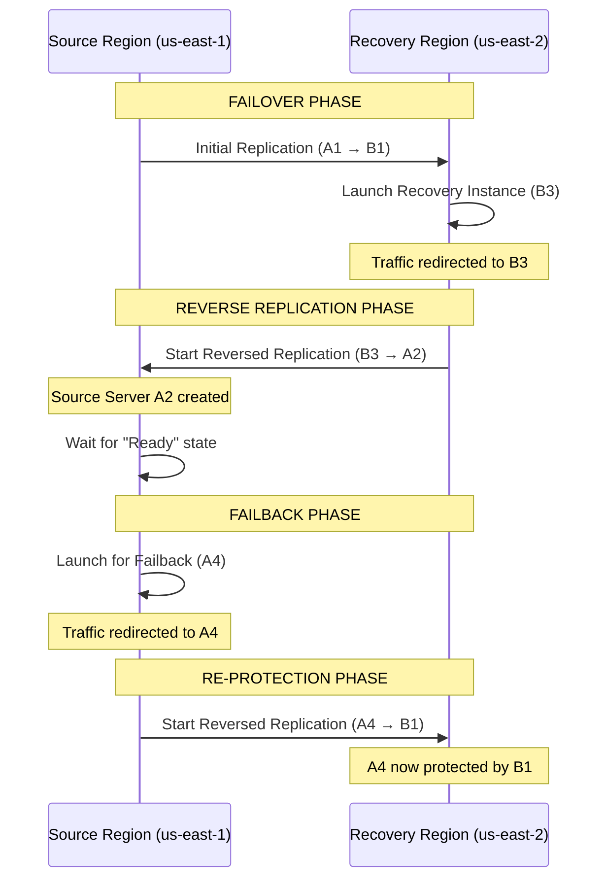
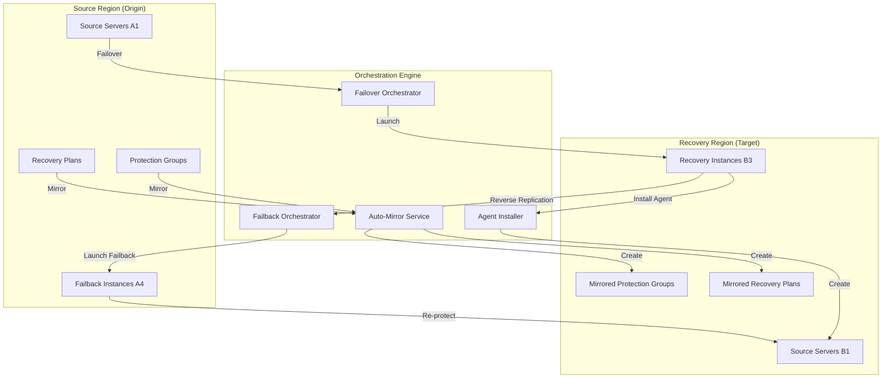
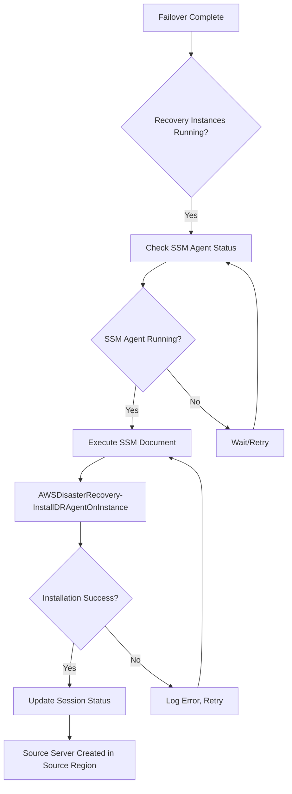
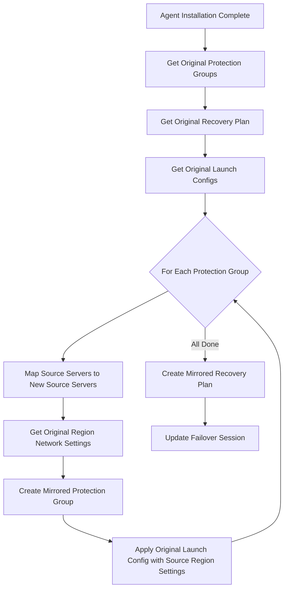
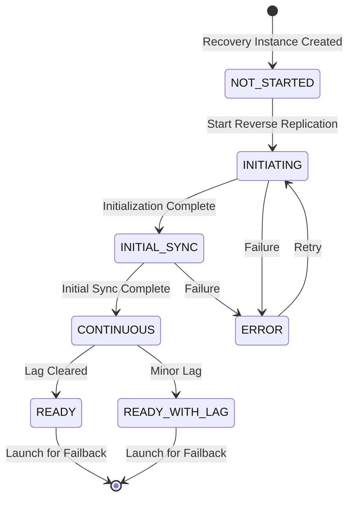
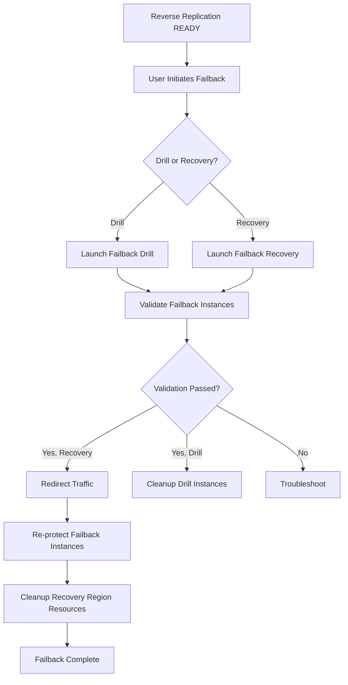
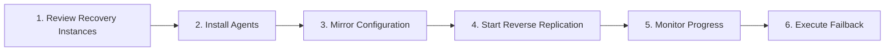

# Failover & Failback Orchestration Implementation Plan

## Executive Summary

This document outlines the implementation plan for automated failover and failback orchestration in the AWS DRS Orchestration UI. The feature enables complete disaster recovery lifecycle management: failover to recovery region, automatic agent installation on recovery instances, automatic Protection Group and Recovery Plan duplication with original region settings, and orchestrated failback to the source region.

## Business Value

- **Complete DR Lifecycle**: End-to-end failover and failback automation
- **Reduced RTO**: Automated protection of recovery instances eliminates manual configuration
- **Operational Simplicity**: One-click failback preparation with automatic configuration mirroring
- **Cost Optimization**: Automated cleanup of resources after failback completion

---

## Related Features

This feature is part of a larger DRS management feature set. Understanding the relationships helps clarify scope boundaries:

| Feature | Relationship | Scope Boundary |
|---------|--------------|----------------|
| **#14 Agent Installation & Replication Monitoring** | Complementary | #14 covers agent installation on SOURCE servers; this feature (#15) covers agent installation on RECOVERY instances for failback |
| **#16 DRS Recovery Deep Dive** | Complementary | #16 provides recovery job details; this feature orchestrates the failover/failback lifecycle |
| **#13 Multi-Account Support** | Complementary | #13 enables cross-account orchestration; this feature handles failover/failback within that architecture |

### Scope Clarification

- **This Feature (#15)**: Complete failover/failback lifecycle, agent installation on RECOVERY instances, reverse replication, failback execution, re-protection
- **#14 Agent Installation**: Agent installation on SOURCE servers, replication initialization monitoring
- **#16 Recovery Deep Dive**: Point-in-time snapshots, job logs, recovery instance tracking (read-only visibility)
- **#13 Multi-Account**: Hub-and-spoke architecture, cross-account IAM roles, unified management

### Key Distinction: Agent Installation Targets

| Scenario | Target | Feature |
|----------|--------|---------|
| Initial protection setup | Source servers (on-premises or EC2) | #14 Agent Installation |
| Failback preparation | Recovery instances in DR region | This feature (#15) |

---

## Research Findings

### DRS Cross-Region Failback Flow

Based on AWS documentation, the cross-region failback process involves:



### Key DRS API Operations

| Operation | API | Description |
|-----------|-----|-------------|
| Start Reverse Replication | `drs:ReverseReplication` | Initiates replication from recovery instance back to source region |
| Launch for Failback | `drs:StartRecovery` | Launches failback instance in source region |
| Describe Recovery Instances | `drs:DescribeRecoveryInstances` | Gets recovery instance status including reverse replication state |
| Stop Replication | `drs:StopReplication` | Stops replication on source server |
| Disconnect from AWS | `drs:DisconnectSourceServer` | Disconnects source server before deletion |
| Delete Source Server | `drs:DeleteSourceServer` | Removes source server from DRS |

### Reverse Replication States

| State | Description |
|-------|-------------|
| `NOT_STARTED` | Reverse replication not initiated |
| `INITIATING` | Starting reverse replication |
| `INITIAL_SYNC` | Initial data sync in progress |
| `CONTINUOUS` | Continuous replication active |
| `READY` | Ready for failback launch |
| `READY_WITH_LAG` | Ready but with replication lag |
| `ERROR` | Error during reverse replication |

---

## Feature Architecture



---

## Implementation Phases

### Phase 1: Failover Completion Tracking (1 week)

Track when failover completes and recovery instances are running.

#### 1.1 New Data Model: Failover Sessions

```python
# DynamoDB Table: failover-sessions-{env}
{
    "SessionId": "fs-uuid",                    # Partition Key
    "ExecutionId": "exec-uuid",                # Link to execution
    "SourceRegion": "us-east-1",
    "RecoveryRegion": "us-east-2",
    "Status": "FAILOVER_COMPLETE",             # PENDING, FAILOVER_COMPLETE, REVERSE_REPLICATING, READY_FOR_FAILBACK, FAILBACK_COMPLETE
    "RecoveryInstances": [
        {
            "recoveryInstanceId": "i-recovery123",
            "ec2InstanceId": "i-0abc123",
            "sourceServerId": "s-source123",
            "hostname": "web-server-01",
            "reverseReplicationState": "NOT_STARTED"
        }
    ],
    "SourceProtectionGroups": ["pg-uuid-1", "pg-uuid-2"],
    "SourceRecoveryPlan": "rp-uuid",
    "MirroredProtectionGroups": [],            # Populated after mirroring
    "MirroredRecoveryPlan": null,
    "CreatedAt": "2025-12-15T10:00:00Z",
    "UpdatedAt": "2025-12-15T14:30:00Z",
    "CreatedBy": "user@example.com"
}
```

#### 1.2 API Endpoints

| Method | Endpoint | Description |
|--------|----------|-------------|
| GET | `/failover-sessions` | List all failover sessions |
| GET | `/failover-sessions/{id}` | Get session details |
| POST | `/failover-sessions` | Create session after failover |
| PUT | `/failover-sessions/{id}` | Update session status |

#### 1.3 Automatic Session Creation

After execution completes with `executionType: RECOVERY`:
1. Query DRS for recovery instances from the execution
2. Create failover session with recovery instance details
3. Store original Protection Group and Recovery Plan references

---

### Phase 2: Agent Installation on Recovery Instances (2 weeks)

Install DRS agent on recovery instances to enable reverse replication.

#### 2.1 Agent Installation Flow



#### 2.2 API Endpoints

| Method | Endpoint | Description |
|--------|----------|-------------|
| POST | `/failover-sessions/{id}/install-agents` | Install agents on all recovery instances |
| GET | `/failover-sessions/{id}/agent-status` | Get agent installation status |

#### 2.3 Lambda Implementation

```python
def install_agents_on_recovery_instances(event, context):
    """Install DRS agents on recovery instances for reverse replication."""
    session_id = event['pathParameters']['id']
    
    # Get failover session
    session = get_failover_session(session_id)
    source_region = session['SourceRegion']
    recovery_region = session['RecoveryRegion']
    
    # Get EC2 instance IDs from recovery instances
    instance_ids = [ri['ec2InstanceId'] for ri in session['RecoveryInstances']]
    
    # Execute SSM document in recovery region
    ssm = boto3.client('ssm', region_name=recovery_region)
    
    response = ssm.send_command(
        InstanceIds=instance_ids,
        DocumentName='AWSDisasterRecovery-InstallDRAgentOnInstance',
        Parameters={
            'Region': [source_region],  # Target region for reverse replication
            'Tags': ['FailoverSession=' + session_id]
        },
        TimeoutSeconds=3600,
        Comment=f'DRS Agent Installation for Failback - Session: {session_id}'
    )
    
    # Update session with command ID
    update_failover_session(session_id, {
        'AgentInstallCommandId': response['Command']['CommandId'],
        'Status': 'INSTALLING_AGENTS'
    })
    
    return success_response({
        'sessionId': session_id,
        'commandId': response['Command']['CommandId'],
        'instanceCount': len(instance_ids)
    })
```

#### 2.4 Prerequisites Check

Before agent installation:
- Verify recovery instances have SSM agent running
- Verify instances have `AmazonSSMManagedInstanceCore` IAM policy
- Verify network connectivity to DRS endpoint in source region

---

### Phase 3: Automatic Protection Group & Recovery Plan Mirroring (2 weeks)

Automatically create mirrored Protection Groups and Recovery Plans in recovery region.

#### 3.1 Mirroring Logic



#### 3.2 Configuration Mapping

| Original Setting | Mirrored Setting | Notes |
|-----------------|------------------|-------|
| Source Server IDs | New Source Server IDs | Map via hostname/tags |
| Subnet ID | Original Region Subnet ID | From original launch config |
| Security Group IDs | Original Region SG IDs | From original launch config |
| Instance Profile | Original Region Profile | From original launch config |
| Instance Type | Same | Preserved |
| Copy Private IP | Same | Preserved |
| Copy Tags | Same | Preserved |

#### 3.3 API Endpoints

| Method | Endpoint | Description |
|--------|----------|-------------|
| POST | `/failover-sessions/{id}/mirror-config` | Create mirrored PGs and RP |
| GET | `/failover-sessions/{id}/mirror-status` | Get mirroring status |

#### 3.4 Lambda Implementation

```python
def mirror_protection_groups(event, context):
    """Create mirrored Protection Groups in recovery region."""
    session_id = event['pathParameters']['id']
    session = get_failover_session(session_id)
    
    source_region = session['SourceRegion']
    recovery_region = session['RecoveryRegion']
    
    mirrored_pgs = []
    
    for pg_id in session['SourceProtectionGroups']:
        # Get original Protection Group
        original_pg = get_protection_group(pg_id)
        original_launch_config = original_pg.get('LaunchConfig', {})
        
        # Map old source servers to new source servers (created by agent install)
        new_source_servers = map_source_servers(
            original_pg['SourceServerIds'],
            session['RecoveryInstances'],
            recovery_region
        )
        
        # Create mirrored Protection Group
        mirrored_pg = {
            'GroupName': f"{original_pg['GroupName']}-failback",
            'Region': recovery_region,
            'SourceServerIds': new_source_servers,
            'LaunchConfig': {
                # Use ORIGINAL region settings for failback
                'SubnetId': original_launch_config.get('SubnetId'),
                'SecurityGroupIds': original_launch_config.get('SecurityGroupIds', []),
                'InstanceProfileArn': original_launch_config.get('InstanceProfileArn'),
                'InstanceType': original_launch_config.get('InstanceType'),
                'CopyPrivateIp': original_launch_config.get('CopyPrivateIp', False),
                'CopyTags': original_launch_config.get('CopyTags', True),
                'Licensing': original_launch_config.get('Licensing', {}),
                'TargetInstanceTypeRightSizingMethod': original_launch_config.get(
                    'TargetInstanceTypeRightSizingMethod', 'BASIC'
                ),
                'LaunchDisposition': original_launch_config.get('LaunchDisposition', 'STARTED')
            },
            'FailoverSessionId': session_id,
            'OriginalProtectionGroupId': pg_id
        }
        
        # Create in DynamoDB
        created_pg = create_protection_group(mirrored_pg)
        
        # Apply launch settings to DRS source servers
        apply_launch_settings_to_servers(
            new_source_servers,
            mirrored_pg['LaunchConfig'],
            recovery_region
        )
        
        mirrored_pgs.append(created_pg['GroupId'])
    
    # Update session
    update_failover_session(session_id, {
        'MirroredProtectionGroups': mirrored_pgs,
        'Status': 'CONFIG_MIRRORED'
    })
    
    return success_response({'mirroredProtectionGroups': mirrored_pgs})


def mirror_recovery_plan(event, context):
    """Create mirrored Recovery Plan in recovery region."""
    session_id = event['pathParameters']['id']
    session = get_failover_session(session_id)
    
    # Get original Recovery Plan
    original_rp = get_recovery_plan(session['SourceRecoveryPlan'])
    
    # Map original PG IDs to mirrored PG IDs
    pg_mapping = dict(zip(
        session['SourceProtectionGroups'],
        session['MirroredProtectionGroups']
    ))
    
    # Create mirrored waves with mapped PG IDs
    mirrored_waves = []
    for wave in original_rp['Waves']:
        mirrored_wave = {
            'WaveNumber': wave['WaveNumber'],
            'ProtectionGroupId': pg_mapping.get(wave['ProtectionGroupId']),
            'DependsOn': wave.get('DependsOn', []),
            'PauseBeforeWave': wave.get('PauseBeforeWave', False),
            'PreWaveActions': wave.get('PreWaveActions', []),
            'PostWaveActions': wave.get('PostWaveActions', [])
        }
        mirrored_waves.append(mirrored_wave)
    
    # Create mirrored Recovery Plan
    mirrored_rp = {
        'PlanName': f"{original_rp['PlanName']}-failback",
        'Description': f"Failback plan for {original_rp['PlanName']}",
        'Waves': mirrored_waves,
        'FailoverSessionId': session_id,
        'OriginalRecoveryPlanId': session['SourceRecoveryPlan']
    }
    
    created_rp = create_recovery_plan(mirrored_rp)
    
    # Update session
    update_failover_session(session_id, {
        'MirroredRecoveryPlan': created_rp['PlanId'],
        'Status': 'READY_FOR_FAILBACK'
    })
    
    return success_response({'mirroredRecoveryPlan': created_rp['PlanId']})
```

---

### Phase 4: Reverse Replication Monitoring (1 week)

Monitor reverse replication progress until ready for failback.

#### 4.1 Reverse Replication States Flow



#### 4.2 API Endpoints

| Method | Endpoint | Description |
|--------|----------|-------------|
| POST | `/failover-sessions/{id}/start-reverse-replication` | Start reverse replication |
| GET | `/failover-sessions/{id}/reverse-replication-status` | Get replication status |

#### 4.3 Polling Integration

- EventBridge rule polls reverse replication status every 60 seconds
- Updates failover session with current state
- Sends notification when READY state reached

---

### Phase 5: Failback Execution (2 weeks)

Execute failback using mirrored Recovery Plan.

#### 5.1 Failback Flow



#### 5.2 API Endpoints

| Method | Endpoint | Description |
|--------|----------|-------------|
| POST | `/failover-sessions/{id}/execute-failback` | Execute failback |
| POST | `/failover-sessions/{id}/re-protect` | Re-protect failback instances |
| POST | `/failover-sessions/{id}/cleanup` | Cleanup recovery region resources |

#### 5.3 Failback Execution Lambda

```python
def execute_failback(event, context):
    """Execute failback using mirrored Recovery Plan."""
    session_id = event['pathParameters']['id']
    body = json.loads(event.get('body', '{}'))
    is_drill = body.get('isDrill', True)
    
    session = get_failover_session(session_id)
    
    # Verify ready for failback
    if session['Status'] != 'READY_FOR_FAILBACK':
        return error_response(400, 'Session not ready for failback')
    
    # Get mirrored Recovery Plan
    mirrored_rp = get_recovery_plan(session['MirroredRecoveryPlan'])
    
    # Create execution using existing orchestration engine
    execution = create_execution({
        'recoveryPlanId': session['MirroredRecoveryPlan'],
        'executionType': 'DRILL' if is_drill else 'RECOVERY',
        'initiatedBy': 'failback-orchestrator',
        'failoverSessionId': session_id
    })
    
    # Update session
    update_failover_session(session_id, {
        'FailbackExecutionId': execution['ExecutionId'],
        'Status': 'FAILBACK_IN_PROGRESS'
    })
    
    return success_response({
        'sessionId': session_id,
        'executionId': execution['ExecutionId'],
        'isDrill': is_drill
    })
```

---

### Phase 6: Frontend UI (2 weeks)

#### 6.1 New Pages

| Page | Description |
|------|-------------|
| Failover Sessions | List all failover sessions with status |
| Failover Session Details | Detailed view with actions |
| Failback Wizard | Step-by-step failback preparation |

#### 6.2 Failover Sessions Page

```typescript
// frontend/src/pages/FailoverSessionsPage.tsx
export const FailoverSessionsPage: React.FC = () => {
  return (
    <ContentLayout
      header={
        <Header
          variant="h1"
          description="Manage failover sessions and prepare for failback"
        >
          Failover Sessions
        </Header>
      }
    >
      <Table
        items={sessions}
        columnDefinitions={[
          { id: 'sessionId', header: 'Session ID', cell: s => s.SessionId },
          { id: 'sourceRegion', header: 'Source Region', cell: s => s.SourceRegion },
          { id: 'recoveryRegion', header: 'Recovery Region', cell: s => s.RecoveryRegion },
          { id: 'status', header: 'Status', cell: s => <FailoverStatusBadge status={s.Status} /> },
          { id: 'instances', header: 'Instances', cell: s => s.RecoveryInstances.length },
          { id: 'actions', header: 'Actions', cell: s => <FailoverActions session={s} /> }
        ]}
      />
    </ContentLayout>
  );
};
```

#### 6.3 Failback Wizard Steps



#### 6.4 FailbackWizard Component

```typescript
// frontend/src/components/FailbackWizard.tsx
const WIZARD_STEPS = [
  {
    title: 'Review Recovery Instances',
    description: 'Verify recovery instances are running and accessible'
  },
  {
    title: 'Install DRS Agents',
    description: 'Install replication agents on recovery instances'
  },
  {
    title: 'Mirror Configuration',
    description: 'Create Protection Groups and Recovery Plan for failback'
  },
  {
    title: 'Start Reverse Replication',
    description: 'Begin replicating data back to source region'
  },
  {
    title: 'Monitor Replication',
    description: 'Wait for replication to reach Ready state'
  },
  {
    title: 'Execute Failback',
    description: 'Launch failback instances in source region'
  }
];
```

---

## Infrastructure Changes

### New DynamoDB Table

```yaml
FailoverSessionsTable:
  Type: AWS::DynamoDB::Table
  Properties:
    TableName: !Sub 'failover-sessions-${Environment}'
    BillingMode: PAY_PER_REQUEST
    AttributeDefinitions:
      - AttributeName: SessionId
        AttributeType: S
      - AttributeName: Status
        AttributeType: S
    KeySchema:
      - AttributeName: SessionId
        KeyType: HASH
    GlobalSecondaryIndexes:
      - IndexName: StatusIndex
        KeySchema:
          - AttributeName: Status
            KeyType: HASH
        Projection:
          ProjectionType: ALL
```

### New IAM Permissions

```yaml
# Additional permissions for failover/failback
- Effect: Allow
  Action:
    - drs:DescribeRecoveryInstances
    - drs:ReverseReplication
    - drs:StartRecovery
    - drs:StopReplication
    - drs:DisconnectSourceServer
    - drs:DeleteSourceServer
    - drs:DeleteRecoveryInstance
  Resource: '*'

- Effect: Allow
  Action:
    - ssm:SendCommand
    - ssm:GetCommandInvocation
    - ssm:ListCommandInvocations
  Resource:
    - !Sub 'arn:aws:ssm:*:${AWS::AccountId}:document/AWSDisasterRecovery-InstallDRAgentOnInstance'
    - !Sub 'arn:aws:ec2:*:${AWS::AccountId}:instance/*'
```

### New API Gateway Routes

```yaml
/failover-sessions:
  GET: ListFailoverSessions
  POST: CreateFailoverSession

/failover-sessions/{id}:
  GET: GetFailoverSession
  PUT: UpdateFailoverSession

/failover-sessions/{id}/install-agents:
  POST: InstallAgentsOnRecoveryInstances

/failover-sessions/{id}/mirror-config:
  POST: MirrorConfiguration

/failover-sessions/{id}/start-reverse-replication:
  POST: StartReverseReplication

/failover-sessions/{id}/reverse-replication-status:
  GET: GetReverseReplicationStatus

/failover-sessions/{id}/execute-failback:
  POST: ExecuteFailback

/failover-sessions/{id}/re-protect:
  POST: ReProtectFailbackInstances

/failover-sessions/{id}/cleanup:
  POST: CleanupRecoveryResources
```

---

## Navigation Updates

```typescript
const navigationItems = [
  { type: 'link', text: 'Dashboard', href: '/' },
  { type: 'divider' },
  { type: 'link', text: 'Getting Started', href: '/getting-started' },
  { type: 'link', text: 'Protection Groups', href: '/protection-groups' },
  { type: 'link', text: 'Recovery Plans', href: '/recovery-plans' },
  { type: 'link', text: 'History', href: '/executions' },
  { type: 'divider' },
  { type: 'link', text: 'Failover Sessions', href: '/failover-sessions' },  // NEW
];
```

---

## Timeline Estimate

| Phase | Duration | Dependencies |
|-------|----------|--------------|
| Phase 1: Failover Completion Tracking | 1 week | None |
| Phase 2: Agent Installation | 2 weeks | Phase 1 |
| Phase 3: Config Mirroring | 2 weeks | Phase 2 |
| Phase 4: Reverse Replication Monitoring | 1 week | Phase 3 |
| Phase 5: Failback Execution | 2 weeks | Phase 4 |
| Phase 6: Frontend UI | 2 weeks | Phases 1-5 |

**Total Estimated LOE: 10-12 weeks**

---

## Success Criteria

1. **Automatic Session Creation**: Failover session created automatically after recovery execution
2. **Agent Installation**: DRS agents installed on all recovery instances via SSM
3. **Config Mirroring**: Protection Groups and Recovery Plans mirrored with original region settings
4. **Reverse Replication**: Automated monitoring until READY state
5. **Failback Execution**: One-click failback using mirrored configuration
6. **Re-protection**: Failback instances automatically re-protected
7. **Cleanup**: Automated cleanup of recovery region resources

---

## Risks and Mitigations

| Risk | Impact | Mitigation |
|------|--------|------------|
| SSM agent not running on recovery instances | Agent installation fails | Pre-check SSM agent status, provide manual installation instructions |
| Network connectivity issues | Reverse replication fails | Validate network requirements before starting |
| Source server mapping failures | Incorrect PG configuration | Use hostname/tags for reliable mapping |
| Cross-region data transfer costs | Unexpected costs | Display cost estimates before starting reverse replication |
| Cleanup failures | Orphaned resources | Provide manual cleanup instructions, resource inventory |

---

## Future Enhancements

1. **Automated Failback Scheduling**: Schedule failback for maintenance windows
2. **Multi-Account Failback**: Support cross-account failover/failback
3. **Failback Drills**: Automated periodic failback drill execution
4. **Cost Tracking**: Track and report cross-region data transfer costs
5. **Runbook Integration**: Generate runbooks for manual failback steps
