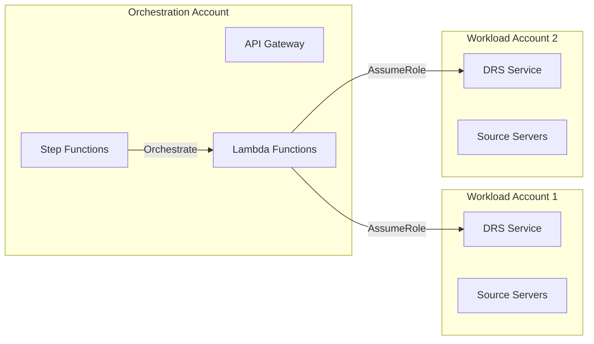
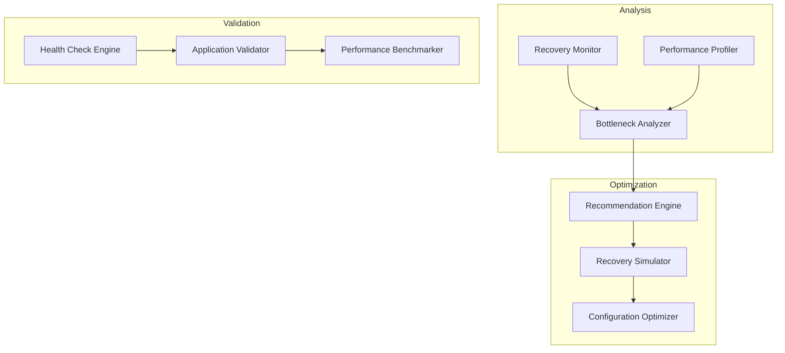

# Implementation Features

## Overview

This document consolidates all implemented and planned features for the AWS DRS Orchestration platform, providing a comprehensive reference for disaster recovery capabilities, automation features, and system enhancements.

---

## Table of Contents

1. [Automation and Orchestration](#automation-and-orchestration)
2. [Cross-Account Features](#cross-account-features)
3. [DRS Source Server Management](#drs-source-server-management)
4. [Notifications and Monitoring](#notifications-and-monitoring)
5. [Recovery Enhancements](#recovery-enhancements)
6. [Scheduled Operations](#scheduled-operations)

---

## Automation and Orchestration

### Wave-Based Recovery Execution

**Status**: ✅ Implemented

Orchestrates disaster recovery in coordinated waves with explicit dependencies between application tiers.

#### Key Capabilities
- **Sequential Wave Execution**: Execute recovery in defined order (database → application → web)
- **Dependency Management**: Ensure prerequisites complete before dependent tiers start
- **Parallel Server Recovery**: Launch multiple servers within a wave simultaneously
- **Wave Progress Tracking**: Real-time visibility into wave execution status
- **Automatic Progression**: Seamless transition between waves upon completion

#### Technical Implementation
- Step Functions state machine with waitForTaskToken pattern
- EventBridge-triggered execution finder for status polling
- DynamoDB execution history tracking
- Real-time frontend polling (3-second intervals)

#### User Experience
```typescript
// Wave configuration in recovery plan
waves: [
  { name: "Database Tier", order: 1, servers: ["db-1", "db-2"] },
  { name: "Application Tier", order: 2, servers: ["app-1", "app-2", "app-3"] },
  { name: "Web Tier", order: 3, servers: ["web-1", "web-2"] }
]
```

### Pause and Resume Execution

**Status**: ✅ Implemented

Provides manual control points during recovery execution for validation and approval.

#### Key Capabilities
- **Pre-Wave Pause**: Pause execution before specific waves for manual validation
- **Manual Resume**: Resume execution when ready after validation
- **State Persistence**: Maintain execution state during pause
- **Timeout Protection**: Prevent indefinite pauses with configurable timeouts
- **Audit Trail**: Track all pause/resume actions with timestamps

#### Technical Implementation
- Step Functions waitForTaskToken for pause state
- API endpoints for pause/resume operations
- DynamoDB state tracking
- Frontend real-time status updates

#### Use Cases
- Validate database recovery before launching application tier
- Perform manual health checks between waves
- Coordinate with external teams before proceeding
- Implement approval workflows for production recoveries

### Execution Polling and Status Synchronization

**Status**: ✅ Implemented

Ensures real-time synchronization between DRS job status and execution state.

#### Key Capabilities
- **Automatic Status Detection**: Detect when DRS jobs complete or fail
- **Real-Time Updates**: Update execution status within seconds of DRS changes
- **Multi-Wave Coordination**: Track status across multiple concurrent waves
- **Error Detection**: Identify and report DRS job failures immediately
- **Performance Optimization**: Efficient polling with minimal API calls

#### Technical Implementation
- EventBridge scheduled rule (1-minute intervals)
- Execution finder Lambda for active execution discovery
- Execution poller Lambda for DRS job status checks
- DynamoDB status updates with optimistic locking

#### Polling Strategy
```python
# Execution finder discovers active executions
active_executions = find_executions_in_polling_state()

# Execution poller checks DRS job status
for execution in active_executions:
    drs_jobs = get_drs_jobs_for_execution(execution)
    if all_jobs_complete(drs_jobs):
        update_execution_status(execution, "COMPLETED")
        send_task_success_to_step_functions(execution)
```

---

## Cross-Account Features

### Cross-Account DRS Operations

**Status**: ✅ Implemented

Enables disaster recovery operations across multiple AWS accounts with centralized orchestration.

#### Key Capabilities
- **Centralized Orchestration**: Single orchestration account manages recovery across multiple workload accounts
- **Secure Role Assumption**: IAM role-based cross-account access with least privilege
- **Multi-Account Discovery**: Discover and manage DRS source servers across accounts
- **Account-Scoped Operations**: Execute recovery operations in target accounts
- **Audit and Compliance**: Centralized logging and audit trail for all cross-account operations

#### Architecture


#### IAM Configuration
```yaml
# Cross-account role in workload accounts
CrossAccountRole:
  Type: AWS::IAM::Role
  Properties:
    AssumeRolePolicyDocument:
      Statement:
        - Effect: Allow
          Principal:
            AWS: !Sub 'arn:aws:iam::${OrchestrationAccountId}:root'
          Action: sts:AssumeRole
    ManagedPolicyArns:
      - !Ref DRSOperationsPolicy
```

### Target Account Management

**Status**: ✅ Implemented

Manages configuration and credentials for cross-account DRS operations.

#### Key Capabilities
- **Account Registration**: Register workload accounts for cross-account operations
- **Role Configuration**: Configure IAM roles for secure cross-account access
- **Region Management**: Specify regions for DRS operations per account
- **Credential Validation**: Validate cross-account access before operations
- **Account Discovery**: Discover available accounts and their DRS configurations

#### API Endpoints
```
POST   /target-accounts              # Register new target account
GET    /target-accounts              # List all target accounts
GET    /target-accounts/{account-id} # Get account details
PUT    /target-accounts/{account-id} # Update account configuration
DELETE /target-accounts/{account-id} # Remove target account
POST   /target-accounts/{account-id}/validate # Validate access
```

#### Data Model
```json
{
  "accountId": "123456789012",
  "accountName": "Production Workload",
  "roleArn": "arn:aws:iam::123456789012:role/DRSOrchestrationRole",
  "regions": ["us-east-1", "us-west-2"],
  "description": "Production environment DRS operations",
  "createdDate": 1704067200000,
  "lastModifiedDate": 1704153600000
}
```

---

## DRS Source Server Management

### Comprehensive Server Configuration

**Status**: ✅ Implemented

Provides complete management of DRS source server configurations including launch settings, replication, and post-launch actions.

#### Key Capabilities
- **Launch Settings Management**: Configure EC2 launch templates and instance properties
- **Replication Configuration**: Manage replication settings and staging area
- **Post-Launch Actions**: Define automated actions after recovery launch
- **Tag Management**: Synchronize tags between EC2 instances and DRS servers
- **Point-in-Time Recovery**: Configure and manage recovery point policies

#### Launch Settings Configuration
```typescript
interface LaunchSettings {
  launchDisposition: 'STARTED' | 'STOPPED';
  licensing: {
    osByol: boolean;
  };
  copyPrivateIp: boolean;
  copyTags: boolean;
  targetInstanceTypeRightSizingMethod: 'NONE' | 'BASIC';
}
```

#### EC2 Launch Template Editor
- **Instance Type Selection**: Choose optimal instance types for recovery
- **Network Configuration**: VPC, subnet, and security group assignment
- **Storage Configuration**: EBS volume types, sizes, and encryption
- **IAM Role Assignment**: Attach IAM instance profiles
- **User Data Scripts**: Configure bootstrap scripts for recovery instances

### Tag Synchronization

**Status**: ✅ Implemented (Manual and Scheduled)

Synchronizes EC2 instance tags to DRS source servers for consistent metadata management.

#### Key Capabilities
- **Manual Sync**: On-demand tag synchronization via UI button
- **Scheduled Sync**: Automatic synchronization on configurable intervals (1-24 hours)
- **Selective Sync**: Sync specific tags or all tags
- **Conflict Resolution**: Handle tag conflicts between EC2 and DRS
- **Audit Trail**: Track all tag synchronization operations

#### Scheduled Sync Configuration
```typescript
interface TagSyncSettings {
  enabled: boolean;
  intervalHours: number; // 1-24
  lastSyncTime?: string;
  nextSyncTime?: string;
}
```

#### EventBridge Integration
```yaml
TagSyncScheduleRule:
  Type: AWS::Events::Rule
  Properties:
    ScheduleExpression: !Sub 'rate(${TagSyncIntervalHours} hours)'
    State: !If [EnableTagSync, ENABLED, DISABLED]
    Targets:
      - Arn: !GetAtt ApiHandlerFunction.Arn
        Input: '{"action": "tag-sync", "source": "eventbridge"}'
```

### Replication Settings Management

**Status**: ✅ Implemented

Manages DRS replication configuration for optimal data protection and recovery performance.

#### Key Capabilities
- **Replication Server Configuration**: Configure staging area instances
- **Bandwidth Throttling**: Control replication bandwidth usage
- **Data Routing**: Configure network paths for replication traffic
- **Encryption Settings**: Manage encryption for data in transit
- **Staging Disk Configuration**: Optimize staging area storage

#### Configuration Options
```typescript
interface ReplicationSettings {
  replicatedDisks: Array<{
    deviceName: string;
    iops?: number;
    stagingDiskType: 'GP2' | 'GP3' | 'ST1' | 'SC1';
    throughput?: number;
  }>;
  replicationServerInstanceType: string;
  useDedicatedReplicationServer: boolean;
  bandwidthThrottling: number; // Mbps
  createPublicIP: boolean;
  dataPlaneRouting: 'PRIVATE_IP' | 'PUBLIC_IP';
  defaultLargeStagingDiskType: 'GP2' | 'GP3' | 'ST1';
  ebsEncryption: 'DEFAULT' | 'CUSTOM';
  ebsEncryptionKeyArn?: string;
}
```

### Post-Launch Settings

**Status**: ✅ Implemented

Configures automated actions to execute after recovery instance launch.

#### Key Capabilities
- **SSM Document Execution**: Run Systems Manager documents post-launch
- **Custom Scripts**: Execute custom scripts for application startup
- **Health Checks**: Automated health validation after launch
- **Service Startup**: Configure service startup sequences
- **Notification Triggers**: Send notifications upon successful launch

#### Configuration
```typescript
interface PostLaunchSettings {
  deployment: 'TEST_AND_CUTOVER' | 'CUTOVER_ONLY' | 'TEST_ONLY';
  ssmDocuments: Array<{
    actionName: string;
    ssmDocumentName: string;
    parameters?: Record<string, string[]>;
    timeoutSeconds: number;
  }>;
}
```

---

## Notifications and Monitoring

### SNS Notification System

**Status**: ✅ Implemented

Comprehensive notification system for real-time alerts and updates on disaster recovery operations.

#### Notification Categories

##### 1. Execution Notifications
- **Started**: Recovery execution initiated
- **Completed**: All waves successfully executed
- **Failed**: Execution failure with error details
- **Paused**: Execution paused for manual validation
- **Resumed**: Execution resumed after pause
- **Cancelled**: Execution cancelled by user

##### 2. DRS Operational Alerts
- **Recovery Launch Failure**: DRS job failed to launch recovery instance
- **Replication Stalled**: Data replication stopped or degraded
- **Agent Issues**: DRS agent connectivity or health problems
- **Service Limits**: Approaching or exceeding DRS service quotas

##### 3. Approval Workflow
- **Approval Required**: Human approval needed before wave execution
- **Approval Granted**: Approval received, execution continuing
- **Approval Denied**: Approval denied, execution cancelled

##### 4. Security Alerts
- **Unauthorized Access**: Failed authentication or authorization attempts
- **Configuration Changes**: Critical configuration modifications
- **Compliance Violations**: Security policy violations detected

#### Notification Formats

**Execution Started**
```
🚀 DRS Execution Started - Production Recovery Plan

Execution Details:
• Execution ID: exec-abc123def456
• Recovery Plan: Production Recovery Plan
• Status: STARTED
• Type: RECOVERY
• Total Waves: 3
• Started At: 2026-01-11 22:00:00 UTC

View execution: https://console.aws.amazon.com/...
```

**DRS Alert - Recovery Failure**
```
🚨 DRS Alert: Recovery Failure - s-1234567890abcdef0

Alert Details:
• Type: Recovery Failure
• Source Server: s-1234567890abcdef0
• Region: us-east-1

Recommended Actions:
1. Review DRS job logs in the AWS console
2. Verify launch template configuration
3. Check IAM permissions for DRS operations

View server: https://console.aws.amazon.com/drs/...
```

#### EventBridge Integration
```yaml
# DRS Recovery Failure Rule
DRSRecoveryFailureRule:
  Type: AWS::Events::Rule
  Properties:
    EventPattern:
      source: ["aws.drs"]
      detail-type: ["DRS Source Server Launch Result"]
      detail:
        state: ["RECOVERY_LAUNCH_FAILED"]
    Targets:
      - Arn: !Ref DRSAlertsTopicArn
```

#### Notification Formatter Lambda
- **Message Formatting**: Converts technical events into user-friendly notifications
- **Template System**: Status-specific message templates with rich formatting
- **Console Integration**: Direct links to AWS console for troubleshooting
- **Multi-format Support**: Plain text and HTML email formats

### CloudWatch Monitoring

**Status**: ✅ Implemented

Comprehensive monitoring and logging for all orchestration operations.

#### Key Metrics
- **Execution Duration**: Time to complete recovery executions
- **Wave Duration**: Time to complete individual waves
- **DRS Job Success Rate**: Percentage of successful DRS recovery jobs
- **API Response Times**: Latency for API operations
- **Error Rates**: Frequency of errors by type

#### CloudWatch Dashboards
- **Execution Overview**: Real-time execution status and progress
- **DRS Operations**: DRS job status and performance metrics
- **API Performance**: API Gateway and Lambda performance
- **System Health**: Overall system health and availability

#### Log Groups
```
/aws/lambda/api-handler              # API operations
/aws/lambda/orchestration-sf         # Step Functions orchestration
/aws/lambda/execution-finder         # Execution discovery
/aws/lambda/execution-poller         # DRS job polling
/aws/lambda/notification-formatter   # Notification processing
```

---

## Recovery Enhancements

### DRS Recovery Deep Dive

**Status**: 🔄 Planned (High Priority, 6-8 weeks)

Advanced recovery analysis and optimization system providing deep insights into recovery processes.

#### Key Features

##### Recovery Process Analysis
- **Step-by-Step Breakdown**: Detailed analysis of each recovery phase
- **Timing Analysis**: Precise timing measurements for each recovery step
- **Resource Utilization**: CPU, memory, network, and storage utilization during recovery
- **Bottleneck Identification**: Identify performance bottlenecks and optimization opportunities
- **Dependency Mapping**: Visual mapping of recovery dependencies and critical paths

##### Performance Optimization
- **Recovery Time Optimization**: Recommendations to reduce RTO
- **Resource Right-Sizing**: Optimal instance types and configurations
- **Parallel Processing**: Identify opportunities for parallel recovery operations
- **Network Optimization**: Network configuration recommendations
- **Storage Optimization**: EBS volume type and configuration recommendations

##### Recovery Validation
- **Health Check Automation**: Automated health checks during and after recovery
- **Application Validation**: Validate application functionality post-recovery
- **Data Integrity Checks**: Verify data consistency after recovery
- **Performance Benchmarking**: Compare recovery performance against baselines
- **Rollback Validation**: Ensure rollback procedures work correctly

#### Architecture


### Failover/Failback Orchestration

**Status**: 🔄 Planned (Medium Priority, 8-10 weeks)

Comprehensive bidirectional recovery orchestration with automated failover and failback capabilities.

#### Key Features

##### Automated Failover
- **Trigger-Based Failover**: Automatic failover based on configurable triggers
- **Health-Based Failover**: Failover triggered by application health degradation
- **Manual Failover**: Controlled manual failover with safety checks
- **Partial Failover**: Selective failover of specific application components
- **Cascading Failover**: Coordinated failover across dependent systems

##### Intelligent Failback
- **Readiness Assessment**: Automated assessment of primary site readiness
- **Data Synchronization**: Ensure data consistency before failback
- **Gradual Failback**: Phased failback with validation at each step
- **Rollback Capability**: Ability to rollback failback if issues detected
- **Zero-Downtime Failback**: Minimize downtime during failback operations

##### State Management
- **Recovery State Tracking**: Track current state of all recovery components
- **State Synchronization**: Ensure consistent state across all systems
- **State Validation**: Validate system state before and after operations
- **State Rollback**: Ability to rollback to previous known good states
- **State Persistence**: Persistent storage of recovery state information

#### Multi-Site Recovery
- **Active-Active Configuration**: Support for active-active recovery configurations
- **Active-Passive Configuration**: Traditional active-passive recovery setups
- **Multi-Region Recovery**: Recovery across multiple AWS regions
- **Hybrid Recovery**: On-premises to cloud and cloud to cloud recovery
- **Cross-Account Recovery**: Recovery across multiple AWS accounts

---

## Scheduled Operations

### Scheduled Tag Synchronization

**Status**: ✅ Implemented

Automatic synchronization of EC2 instance tags to DRS source servers on configurable schedules.

#### Key Capabilities
- **Configurable Intervals**: 1-24 hour sync intervals
- **EventBridge Scheduling**: Reliable scheduling via EventBridge rules
- **Enable/Disable Control**: Toggle scheduled sync without redeployment
- **Manual Override**: Manual sync available alongside scheduled sync
- **Status Monitoring**: Real-time status and next sync time display

#### Configuration Interface
```typescript
// Tag Sync Settings Panel
<TagSyncConfigPanel>
  <Toggle enabled={scheduledSync} onChange={handleToggle} />
  <Select 
    value={intervalHours} 
    options={[1, 2, 4, 6, 8, 12, 24]}
    onChange={handleIntervalChange}
  />
  <StatusDisplay 
    status={isActive ? 'Active' : 'Inactive'}
    nextSync={nextSyncTime}
  />
</TagSyncConfigPanel>
```

#### EventBridge Rule
```yaml
TagSyncScheduleRule:
  Type: AWS::Events::Rule
  Properties:
    Name: !Sub '${ProjectName}-tag-sync-schedule-${Environment}'
    ScheduleExpression: !Sub 'rate(${TagSyncIntervalHours} hours)'
    State: !If [EnableTagSync, ENABLED, DISABLED]
    Targets:
      - Arn: !GetAtt ApiHandlerFunction.Arn
        Id: TagSyncTarget
        Input: |
          {
            "action": "tag-sync",
            "source": "eventbridge",
            "timestamp": "$.time"
          }
```

#### API Endpoints
```
GET  /config/tag-sync              # Get current settings
PUT  /config/tag-sync              # Update settings
POST /infrastructure/tag-sync      # Manual sync trigger
```

---

## Success Metrics

### Functional Metrics
- **Recovery Success Rate**: 99.9% successful recovery executions
- **Wave Completion Rate**: 100% of waves complete successfully
- **Tag Sync Accuracy**: 100% tag synchronization accuracy
- **Cross-Account Operations**: 100% successful cross-account operations
- **Notification Delivery**: 99.99% notification delivery rate

### Performance Metrics
- **Execution Start Time**: < 30 seconds from API call to Step Functions start
- **Wave Transition Time**: < 10 seconds between wave completions
- **Tag Sync Duration**: < 2 minutes for 100 servers
- **API Response Time**: < 500ms for 95th percentile
- **Polling Latency**: < 60 seconds to detect DRS job completion

### Operational Metrics
- **System Availability**: 99.99% uptime for orchestration platform
- **Mean Time to Recovery**: < 4 hours for complete application recovery
- **False Positive Rate**: < 2% for automated failure detection
- **User Satisfaction**: > 4.7/5 rating for platform usability

---

## Future Enhancements

### Planned Features (Next 6 Months)

1. **Advanced Recovery Scenarios** (4-6 weeks)
   - Multi-region failover orchestration
   - Hybrid cloud recovery (on-premises ↔ AWS)
   - Application-aware recovery with health checks
   - Automated rollback on recovery failure

2. **Enhanced Monitoring** (3-4 weeks)
   - Real-time recovery performance dashboards
   - Predictive analytics for recovery time estimation
   - Anomaly detection for replication issues
   - Cost analysis for recovery operations

3. **Integration Enhancements** (2-3 weeks)
   - ServiceNow integration for incident management
   - PagerDuty integration for critical alerts
   - Slack/Teams native integrations
   - Webhook support for custom integrations

4. **Compliance and Governance** (4-5 weeks)
   - Automated compliance reporting
   - Recovery plan versioning and approval workflows
   - Audit trail enhancements
   - Policy-based recovery constraints

### Long-Term Vision (12+ Months)

1. **AI-Powered Recovery Optimization**
   - Machine learning for recovery time prediction
   - Intelligent resource sizing recommendations
   - Automated recovery plan optimization
   - Predictive failure detection

2. **Multi-Cloud Support**
   - Azure Site Recovery integration
   - Google Cloud DR integration
   - Cross-cloud recovery orchestration
   - Unified multi-cloud dashboard

3. **Advanced Automation**
   - Self-healing recovery processes
   - Automated recovery testing
   - Continuous recovery validation
   - Zero-touch recovery operations

---

## Conclusion

The AWS DRS Orchestration platform provides a comprehensive, enterprise-grade solution for disaster recovery automation. With wave-based execution, cross-account support, advanced monitoring, and extensive configuration capabilities, the platform enables organizations to achieve their recovery objectives with confidence and efficiency.

The roadmap of planned enhancements ensures the platform will continue to evolve with emerging best practices and customer needs, maintaining its position as a leading disaster recovery orchestration solution.
