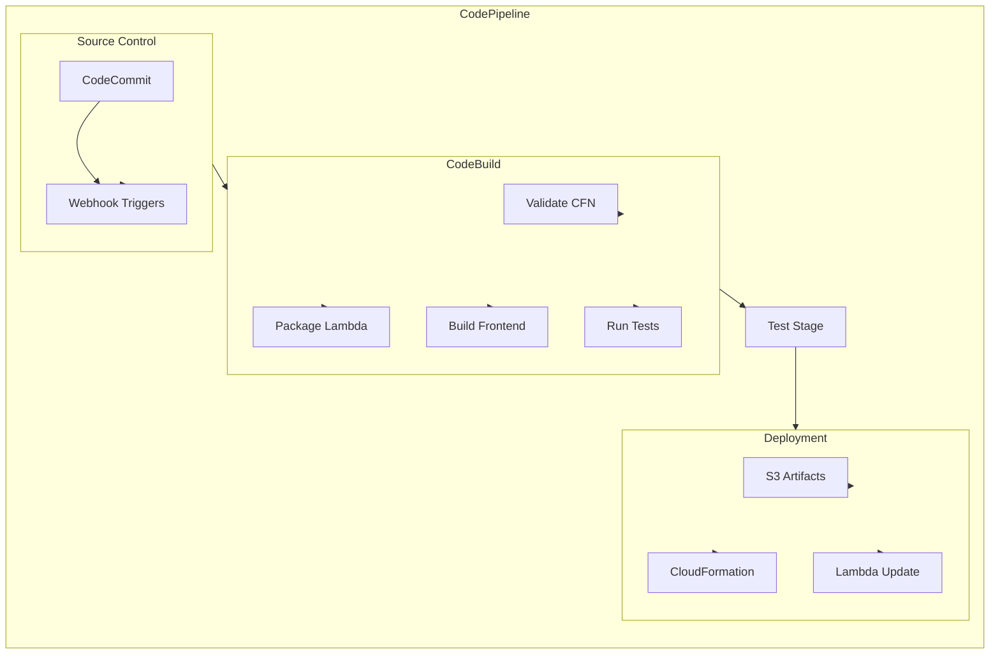
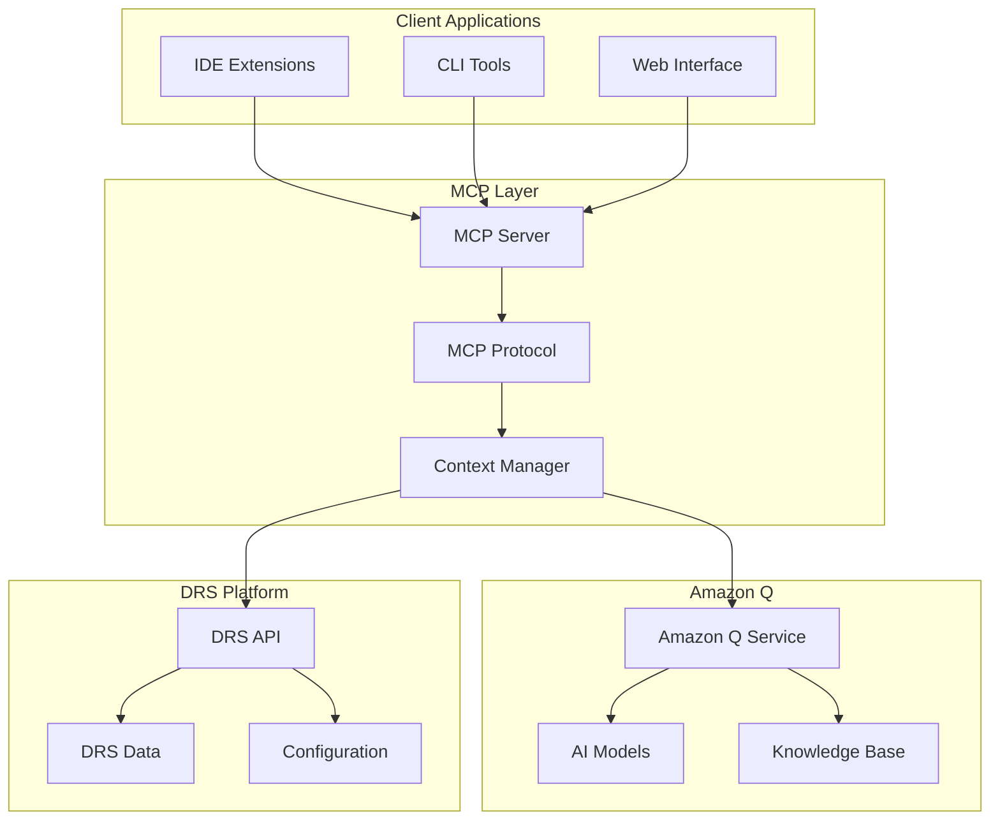

# Infrastructure Improvements Features

## Executive Summary

This document consolidates infrastructure enhancement features that improve the development, deployment, and integration capabilities of the DRS orchestration platform.

---

## Feature Overview

### Consolidated Features

| Feature | Current Status | Priority | LOE | Complexity |
|---------|----------------|----------|-----|------------|
| **CodeBuild/CodeCommit Migration** | Planned | Low | 4-5 weeks | Medium |
| **Amazon Q MCP Integration** | Planned | Low | 2-3 weeks | Low |
| **MCP Integration Platform** | Planned | Low | 3-4 weeks | Medium |
| **EC2 Launch Template Integration** | Planned | Medium | 2-3 weeks | Low |

### Implementation Approach

Implement as **2 major releases** with focus on developer experience:

1. **Development Infrastructure** (6-7 weeks) - CI/CD migration and development tools
2. **Integration Platform** (5-6 weeks) - MCP integrations and external tool support

---

## Release 1: Development Infrastructure (6-7 weeks)

### Scope
Enhanced development and deployment infrastructure with AWS-native CI/CD and improved development tools.

#### Components
- **CodeBuild/CodeCommit Migration** (from CODEBUILD_CODECOMMIT_MIGRATION_PLAN.md)
- **EC2 Launch Template Integration** (from EC2_LAUNCH_TEMPLATE_MVP_PLAN.md)

### CodeBuild/CodeCommit Migration (4-5 weeks)

#### Overview
Migration from GitLab CI/CD to AWS-native CI/CD pipeline using CodeBuild, CodeCommit, and CodePipeline for improved integration with AWS services and reduced external dependencies.

#### Key Features

##### AWS-Native CI/CD Pipeline
- **CodeCommit Repository**: Migrate from GitLab to AWS CodeCommit
- **CodeBuild Projects**: Replace GitLab runners with CodeBuild projects
- **CodePipeline Orchestration**: Orchestrate build, test, and deployment stages
- **CodeDeploy Integration**: Automated deployment to multiple environments
- **AWS Integration**: Native integration with AWS services and IAM

##### Enhanced Build Capabilities
- **Multi-Environment Builds**: Separate build configurations for dev, test, prod
- **Parallel Build Stages**: Parallel execution of independent build tasks
- **Artifact Management**: Improved artifact storage and versioning in S3
- **Build Caching**: Intelligent caching to reduce build times
- **Custom Build Images**: Optimized build images for specific requirements

##### Security and Compliance
- **IAM Integration**: Fine-grained permissions for build and deployment
- **Secrets Management**: Secure handling of build secrets and credentials
- **Audit Trail**: Complete audit trail for all build and deployment activities
- **Compliance Scanning**: Automated security and compliance scanning
- **Code Quality Gates**: Automated code quality and security checks

#### Architecture


#### Migration Components
```yaml
# CodeBuild buildspec.yml
version: 0.2
phases:
  pre_build:
    commands:
      - echo Logging in to Amazon ECR...
      - aws ecr get-login-password --region $AWS_DEFAULT_REGION | docker login --username AWS --password-stdin $AWS_ACCOUNT_ID.dkr.ecr.$AWS_DEFAULT_REGION.amazonaws.com
  build:
    commands:
      - echo Build started on `date`
      - echo Building the Docker image...
      - docker build -t $IMAGE_REPO_NAME:$IMAGE_TAG .
      - docker tag $IMAGE_REPO_NAME:$IMAGE_TAG $AWS_ACCOUNT_ID.dkr.ecr.$AWS_DEFAULT_REGION.amazonaws.com/$IMAGE_REPO_NAME:$IMAGE_TAG
  post_build:
    commands:
      - echo Build completed on `date`
      - echo Pushing the Docker image...
      - docker push $AWS_ACCOUNT_ID.dkr.ecr.$AWS_DEFAULT_REGION.amazonaws.com/$IMAGE_REPO_NAME:$IMAGE_TAG
```

#### API Extensions
```python
# CI/CD management endpoints
GET /cicd/pipelines
GET /cicd/pipelines/{pipeline-name}/status
POST /cicd/pipelines/{pipeline-name}/trigger
GET /cicd/builds/{build-id}
GET /cicd/builds/{build-id}/logs
```

### EC2 Launch Template Integration (2-3 weeks)

#### Overview
Enhanced integration with EC2 Launch Templates to provide standardized, versioned instance configurations for DRS recovery instances.

#### Key Features

##### Launch Template Management
- **Template Discovery**: Browse and select from existing EC2 launch templates
- **Template Validation**: Validate template compatibility with DRS requirements
- **Template Customization**: DRS-specific overrides and customizations
- **Version Management**: Track template versions and enable rollback
- **Template Sharing**: Cross-account template access and sharing

##### DRS Integration
- **Recovery Instance Configuration**: Use launch templates for recovery instances
- **Automatic Template Selection**: Intelligent template selection based on source instance
- **Configuration Override**: Override template settings for specific recovery scenarios
- **Compliance Validation**: Ensure templates meet security and compliance requirements
- **Cost Optimization**: Template recommendations for cost optimization

##### Template Lifecycle
- **Template Creation**: Create DRS-optimized launch templates
- **Template Updates**: Manage template updates and version control
- **Template Testing**: Validate templates before production use
- **Template Retirement**: Manage end-of-life for obsolete templates
- **Template Analytics**: Usage analytics and optimization recommendations

#### UI Components
```typescript
// Launch Template Management
- LaunchTemplateSelector.tsx
- LaunchTemplateEditor.tsx
- LaunchTemplateValidator.tsx
- TemplateVersionHistory.tsx

// DRS Integration
- DRSTemplateConfiguration.tsx
- TemplateOverrideEditor.tsx
- TemplateComplianceChecker.tsx
```

---

## Release 2: Integration Platform (5-6 weeks)

### Scope
Enhanced integration capabilities with MCP (Model Context Protocol) and external development tools.

#### Components
- **Amazon Q MCP Integration** (from AMAZON_Q_MCP_INTEGRATION.md)
- **MCP Integration Platform** (from MCP_INTEGRATION_PLAN.md)

### Amazon Q MCP Integration (2-3 weeks)

#### Overview
Integration with Amazon Q through Model Context Protocol (MCP) to provide AI-powered assistance for DRS orchestration tasks.

#### Key Features

##### AI-Powered Assistance
- **Natural Language Queries**: Query DRS status and configuration using natural language
- **Intelligent Recommendations**: AI-powered recommendations for DRS optimization
- **Automated Documentation**: Generate documentation from DRS configurations
- **Troubleshooting Assistance**: AI-powered troubleshooting for DRS issues
- **Configuration Generation**: Generate DRS configurations from requirements

##### MCP Integration
- **Protocol Implementation**: Full MCP protocol implementation for Amazon Q
- **Context Sharing**: Share DRS context with Amazon Q for better assistance
- **Real-Time Updates**: Real-time synchronization of DRS state with Amazon Q
- **Security Integration**: Secure authentication and authorization for Q access
- **Multi-Modal Support**: Support for text, code, and configuration interactions

##### Developer Experience
- **IDE Integration**: Integration with popular IDEs through MCP
- **Command Line Interface**: CLI integration for Amazon Q assistance
- **Web Interface**: Web-based interface for Amazon Q interactions
- **API Integration**: Programmatic access to Amazon Q capabilities
- **Workflow Integration**: Integration with existing development workflows

#### Architecture


### MCP Integration Platform (3-4 weeks)

#### Overview
Comprehensive MCP integration platform that enables integration with multiple AI tools and development environments.

#### Key Features

##### Multi-Tool Support
- **Amazon Q Integration**: Native integration with Amazon Q
- **Claude Integration**: Integration with Anthropic Claude
- **GitHub Copilot**: Integration with GitHub Copilot
- **Custom AI Tools**: Support for custom AI tool integrations
- **Tool Orchestration**: Coordinate multiple AI tools for complex tasks

##### Development Environment Integration
- **VS Code Extension**: Full-featured VS Code extension with MCP support
- **JetBrains Plugin**: IntelliJ IDEA and other JetBrains IDE support
- **Vim/Neovim Plugin**: Command-line editor integration
- **Emacs Integration**: Emacs editor support
- **Web-Based IDE**: Browser-based development environment

##### Context Management
- **Project Context**: Maintain project-specific context for AI tools
- **Session Management**: Manage AI tool sessions and conversations
- **Context Persistence**: Persist context across development sessions
- **Context Sharing**: Share context between different AI tools
- **Privacy Controls**: Fine-grained privacy controls for context sharing

#### Integration Components
```typescript
// MCP Server Implementation
- MCPServer.ts
- ProtocolHandler.ts
- ContextManager.ts
- SecurityManager.ts

// Tool Integrations
- AmazonQIntegration.ts
- ClaudeIntegration.ts
- CopilotIntegration.ts
- CustomToolIntegration.ts

// Client Libraries
- VSCodeExtension/
- JetBrainsPlugin/
- VimPlugin/
- WebClient/
```

---

## Technical Architecture

### Data Models

#### CI/CD Pipeline Configuration
```json
{
  "PipelineId": "pipeline-123",
  "Name": "DRS Orchestration Pipeline",
  "Description": "Main CI/CD pipeline for DRS orchestration platform",
  "Source": {
    "Type": "CODECOMMIT",
    "Repository": "drs-orchestration",
    "Branch": "main"
  },
  "Stages": [
    {
      "Name": "Source",
      "Actions": [
        {
          "Name": "SourceAction",
          "ActionTypeId": {
            "Category": "Source",
            "Owner": "AWS",
            "Provider": "CodeCommit",
            "Version": "1"
          },
          "Configuration": {
            "RepositoryName": "drs-orchestration",
            "BranchName": "main"
          }
        }
      ]
    },
    {
      "Name": "Build",
      "Actions": [
        {
          "Name": "BuildAction",
          "ActionTypeId": {
            "Category": "Build",
            "Owner": "AWS",
            "Provider": "CodeBuild",
            "Version": "1"
          },
          "Configuration": {
            "ProjectName": "drs-orchestration-build"
          }
        }
      ]
    }
  ]
}
```

#### Launch Template Configuration
```json
{
  "LaunchTemplateId": "lt-123456789abcdef0",
  "LaunchTemplateName": "DRS-Recovery-Template",
  "Description": "Optimized launch template for DRS recovery instances",
  "VersionNumber": 2,
  "LaunchTemplateData": {
    "ImageId": "ami-12345678",
    "InstanceType": "t3.medium",
    "SecurityGroupIds": ["sg-12345678"],
    "SubnetId": "subnet-12345678",
    "IamInstanceProfile": {
      "Name": "DRSRecoveryInstanceProfile"
    },
    "UserData": "IyEvYmluL2Jhc2gKZWNobyAiSW5pdGlhbGl6aW5nIERSUyByZWNvdmVyeSBpbnN0YW5jZSI=",
    "TagSpecifications": [
      {
        "ResourceType": "instance",
        "Tags": [
          {
            "Key": "Purpose",
            "Value": "DRS-Recovery"
          },
          {
            "Key": "Environment",
            "Value": "Production"
          }
        ]
      }
    ]
  },
  "DRSConfiguration": {
    "CompatibilityValidated": true,
    "OptimizationLevel": "PERFORMANCE",
    "CostOptimized": false,
    "SecurityCompliant": true,
    "LastValidation": "2025-12-30T10:00:00Z"
  }
}
```

#### MCP Integration Configuration
```json
{
  "IntegrationId": "mcp-123",
  "Name": "Amazon Q Integration",
  "Type": "AMAZON_Q",
  "Configuration": {
    "Endpoint": "https://q.aws.amazon.com/api/v1",
    "Authentication": {
      "Type": "IAM",
      "RoleArn": "arn:aws:iam::123456789012:role/AmazonQIntegrationRole"
    },
    "Capabilities": [
      "NATURAL_LANGUAGE_QUERY",
      "CODE_GENERATION",
      "DOCUMENTATION_GENERATION",
      "TROUBLESHOOTING_ASSISTANCE"
    ]
  },
  "ContextSharing": {
    "Enabled": true,
    "IncludeConfiguration": true,
    "IncludeExecutionHistory": false,
    "PrivacyLevel": "ORGANIZATION"
  },
  "ClientIntegrations": [
    {
      "Type": "VSCODE_EXTENSION",
      "Version": "1.0.0",
      "Enabled": true
    },
    {
      "Type": "WEB_INTERFACE",
      "Version": "1.0.0",
      "Enabled": true
    }
  ]
}
```

### Integration Points

#### AWS CodeBuild Integration
- **Build Project Management**: Create and manage CodeBuild projects
- **Build Execution**: Trigger and monitor build executions
- **Artifact Management**: Manage build artifacts in S3
- **Log Streaming**: Stream build logs to CloudWatch
- **Environment Management**: Manage build environments and images

#### EC2 Launch Template Integration
- **Template Discovery**: List and describe available launch templates
- **Template Validation**: Validate template compatibility with DRS
- **Template Customization**: Apply DRS-specific customizations
- **Version Management**: Manage template versions and updates
- **Cross-Account Access**: Access templates across AWS accounts

#### MCP Protocol Integration
- **Protocol Implementation**: Full MCP protocol implementation
- **Message Handling**: Handle MCP messages and responses
- **Context Management**: Manage AI tool context and sessions
- **Security**: Implement authentication and authorization
- **Error Handling**: Robust error handling and recovery

---

## Implementation Strategy

### Development Phases

#### Phase 1: CI/CD Migration Foundation (Week 1-3)
- **CodeCommit Setup**: Migrate repository from GitLab to CodeCommit
- **CodeBuild Projects**: Create CodeBuild projects for different stages
- **Basic Pipeline**: Implement basic CodePipeline with essential stages
- **Artifact Management**: Set up S3 artifact storage and management

#### Phase 2: Enhanced CI/CD (Week 4-5)
- **Advanced Pipeline**: Implement advanced pipeline features and parallel stages
- **Security Integration**: Add security scanning and compliance checks
- **Multi-Environment**: Support for multiple deployment environments
- **Monitoring**: Add comprehensive monitoring and alerting

#### Phase 3: Launch Template Integration (Week 6-7)
- **Template Management**: Implement launch template discovery and management
- **DRS Integration**: Integrate launch templates with DRS recovery processes
- **Validation Framework**: Build template validation and compliance checking
- **UI Components**: Create user interface for template management

#### Phase 4: MCP Foundation (Week 8-10)
- **MCP Server**: Implement core MCP server functionality
- **Amazon Q Integration**: Build Amazon Q integration with MCP
- **Basic Client**: Create basic web client for MCP interactions
- **Context Management**: Implement context sharing and management

#### Phase 5: Advanced MCP Integration (Week 11-12)
- **Multi-Tool Support**: Add support for multiple AI tools
- **IDE Integrations**: Build VS Code and other IDE extensions
- **Advanced Features**: Implement advanced MCP features and capabilities
- **Testing and Documentation**: Comprehensive testing and documentation

### Testing Strategy

#### Unit Testing
- **CI/CD Logic**: Test pipeline configuration and build logic
- **Template Validation**: Test launch template validation and compatibility
- **MCP Protocol**: Test MCP protocol implementation and message handling
- **Integration Logic**: Test AI tool integration and context management

#### Integration Testing
- **End-to-End Pipeline**: Test complete CI/CD pipeline execution
- **Template Integration**: Test launch template integration with DRS
- **MCP Workflows**: Test complete MCP workflows with AI tools
- **Cross-Service Integration**: Test integration between different AWS services

#### Performance Testing
- **Build Performance**: Test CI/CD pipeline performance and optimization
- **Template Operations**: Test launch template operations at scale
- **MCP Latency**: Test MCP protocol latency and throughput
- **Concurrent Operations**: Test system performance under concurrent load

---

## Success Metrics

### Functional Metrics
- **CI/CD Migration**: 100% successful migration from GitLab to AWS CodeBuild
- **Build Success Rate**: 95% successful build rate for CI/CD pipeline
- **Template Integration**: 90% of recovery instances use launch templates
- **MCP Adoption**: 70% of developers use MCP integration tools

### Performance Metrics
- **Build Time**: 25% reduction in build time compared to GitLab
- **Template Operations**: < 5 seconds for template validation and selection
- **MCP Response Time**: < 2 seconds for AI tool responses via MCP
- **Pipeline Execution**: < 15 minutes for complete pipeline execution

### Operational Metrics
- **System Reliability**: 99.9% uptime for CI/CD and integration systems
- **Developer Productivity**: 30% improvement in development velocity
- **Cost Optimization**: 20% reduction in CI/CD costs through AWS native services
- **User Satisfaction**: > 4.5/5 rating for infrastructure improvements

---

## Migration from Individual Plans

### Consolidation Benefits
- **Unified Infrastructure**: Single approach to infrastructure improvements
- **Integrated Development Experience**: Consistent development and deployment experience
- **Shared Components**: Common infrastructure for CI/CD and integrations
- **Reduced Complexity**: Simplified management of infrastructure components

### Implementation Dependencies
- **CI/CD → Launch Templates**: Launch templates benefit from CI/CD automation
- **Both → MCP Integration**: MCP integration enhances development experience
- **Shared Infrastructure**: Common AWS services and integration patterns

### Rollout Strategy
- **Phase 1**: Deploy CI/CD migration and launch template integration
- **Phase 2**: Add MCP integration and AI tool support
- **Feature Flags**: Gradual rollout with ability to enable/disable features
- **Developer Training**: Comprehensive training on new infrastructure capabilities

---

## Conclusion

This consolidated approach to infrastructure improvements provides a comprehensive enhancement to the development, deployment, and integration capabilities of the DRS orchestration platform. By implementing these features in a coordinated manner, we can deliver a modern, AWS-native development experience that significantly improves developer productivity and system reliability.

The two-release approach ensures that foundational infrastructure improvements are delivered first, followed by advanced integration capabilities that build upon the established foundation.