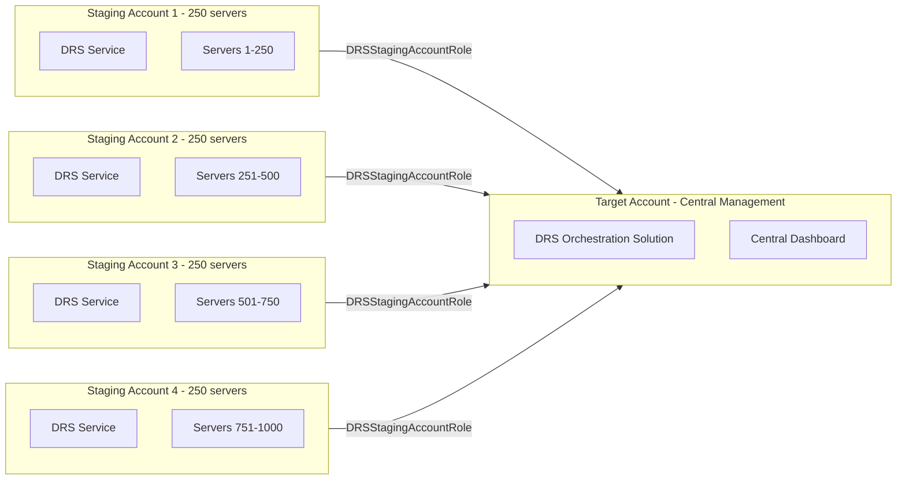
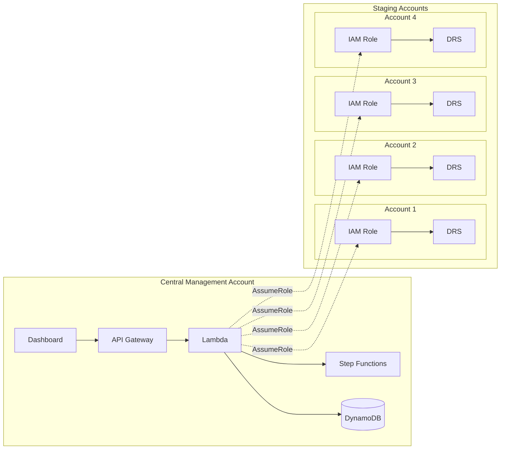
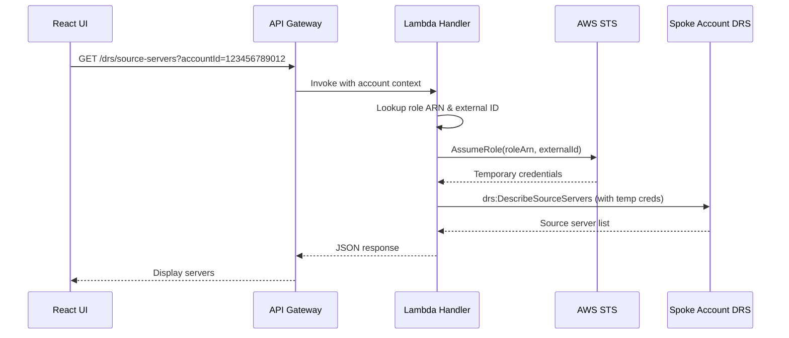

# Multi-Account DRS Implementation Guide

## Scaling Beyond 300 Servers with Centralized Management

---

## Executive Summary

AWS DRS has a **hard limit of 300 replicating servers per account per region**. For customers requiring protection of 1,000+ servers, a multi-account architecture is required. This document provides a comprehensive guide for implementing multi-account DRS support in the DRS Orchestration Solution, including AWS native features, architecture patterns, and detailed implementation steps.

> **Important**: AWS DRS provides native multi-account support through the **Trusted Accounts** feature and **Multiple Staging Accounts** pattern. This document describes how to leverage these native capabilities alongside our DRS Orchestration solution.

---

## Problem Statement

### DRS Service Limits

| Limit | Value | Type |
|-------|-------|------|
| Replicating servers per account per region | 300 | Hard limit |
| Max servers in all jobs | 500 | Soft limit |
| Servers per recovery job | 100 | Hard limit |
| Concurrent jobs | 20 | Soft limit |
| Trusted accounts per DRS account | 100 | Native AWS limit |

### Current State Challenges

- **Operational Overhead**: Managing multiple solution deployments across accounts
- **No Unified View**: Cannot see all DRS source servers across accounts in one UI
- **Inconsistent Configuration**: Recovery plans cannot span multiple accounts
- **Compliance Challenges**: Difficult to maintain consistent DR policies across accounts

### Customer Requirements

- **1,000+ servers** to protect across multiple applications
- **Centralized drill management** from single interface
- **Coordinated recovery** across all accounts
- **Unified monitoring** and reporting
- **Cost optimization** across accounts

---

## AWS DRS Native Multi-Account Features

### Trusted Accounts Feature

AWS DRS provides a native **Trusted Accounts** feature that enables cross-account management:

- **Up to 100 trusted accounts** can be added per DRS account
- **Automatic IAM role creation** via the DRS console
- **Three role types** available for different use cases
- **Commercial-to-Commercial only** (GovCloud-to-GovCloud for GovCloud)

### AWS DRS Native IAM Roles

AWS DRS automatically creates these IAM roles when adding trusted accounts:

| Role Name | Purpose | When Required |
|-----------|---------|---------------|
| `DRSStagingAccountRole` | Multi-account staging feature, allows target account to manage source servers | Always (for multi-account) |
| `DRSSourceNetworkRole` | Network replication feature | When using network replication |
| `DRSCrossAccountReplicationRole` | Cross-account failback | When performing failback |
| `DRSCrossAccountAgentRole` | EC2 instance policy for cross-account | For EC2 marketplace instances |
| `DRSCrossAccountAgentAuthorizedRole` | Agent authorization for cross-account | For EC2 marketplace instances |

### Role Trust Policies

#### DRSStagingAccountRole Trust Policy

```json
{
  "Version": "2012-10-17",
  "Statement": [
    {
      "Effect": "Allow",
      "Principal": {
        "Service": "drs.amazonaws.com"
      },
      "Action": [
        "sts:AssumeRole",
        "sts:SetSourceIdentity"
      ],
      "Condition": {
        "StringLike": {
          "sts:SourceIdentity": "{{target_account}}",
          "aws:SourceAccount": "{{target_account}}"
        },
        "ArnLike": {
          "aws:SourceArn": "arn:aws:drs:*:*:source-server/*"
        }
      }
    }
  ]
}
```

#### DRSSourceNetworkRole Trust Policy

```json
{
  "Version": "2012-10-17",
  "Statement": [
    {
      "Effect": "Allow",
      "Principal": {
        "Service": "drs.amazonaws.com"
      },
      "Action": "sts:AssumeRole",
      "Condition": {
        "StringLike": {
          "aws:SourceAccount": "{{target_account}}"
        },
        "ArnLike": {
          "aws:SourceArn": "arn:aws:drs:*:*:source-network/*"
        }
      }
    }
  ]
}
```

---

## Architecture Overview

### Multiple Staging Accounts Pattern

AWS DRS supports a **Multiple Staging Accounts** architecture for scaling beyond 300 servers:



### Hub-and-Spoke Pattern with DRS Orchestration

Our solution combines AWS DRS native multi-account features with the DRS Orchestration platform:



### Cross-Account Access Flow



### Account Distribution Strategy

| Account | Server Range | Server Count | Headroom | Applications | Purpose |
|---------|-------------|--------------|----------|--------------|---------|
| Staging-Account-1 | 1-250 | 250 | 50 (17%) | Web Tier, Load Balancers | Frontend services |
| Staging-Account-2 | 251-500 | 250 | 50 (17%) | Application Servers | Business logic |
| Staging-Account-3 | 501-750 | 250 | 50 (17%) | Database Servers | Data tier |
| Staging-Account-4 | 751-1000 | 250 | 50 (17%) | Shared Services | DNS, AD, Monitoring |

> **Design Note**: Each account is provisioned at 83% capacity (250/300 servers), leaving 50 servers of headroom per account for growth without requiring new account provisioning.

---

## Manual Setup via AWS DRS Console

This section describes how to manually configure multi-account DRS using the AWS Console before the automated solution is implemented.

### Prerequisites

- AWS accounts in the same AWS Organization (recommended)
- DRS initialized in each staging account
- Administrative access to both target and staging accounts

### Step 1: Initialize DRS in Staging Accounts

For each staging account (where source servers replicate):

1. Navigate to **AWS DRS Console** > **Settings**
2. Click **Initialize Elastic Disaster Recovery**
3. Configure replication settings:
   - Select target VPC and subnet for replication servers
   - Choose instance type for replication servers (default: t3.small)
   - Configure EBS encryption settings
4. Click **Initialize**

### Step 2: Configure EBS Encryption Key Sharing (Required for Encrypted Volumes)

If your source servers have encrypted EBS volumes, you **must** share the KMS encryption key with the target account. This is required for the target account to read EBS snapshots during recovery.

> **Important**: Use a customer managed KMS key (not the default `aws/ebs` key) for EBS encryption in staging accounts. The default key cannot be shared across accounts.

Add the following policy statements to your staging account's KMS key:

```json
[
  {
    "Sid": "Allow DRS staging role to re-encrypt snapshots for target account",
    "Effect": "Allow",
    "Principal": {
      "AWS": "arn:aws:iam::$STAGING_ACCOUNT_ID:role/service-role/DRSStagingAccountRole_$TARGET_ACCOUNT_ID"
    },
    "Action": "kms:ReEncrypt*",
    "Resource": "*",
    "Condition": {
      "StringEquals": {
        "kms:CallerAccount": "$STAGING_ACCOUNT_ID",
        "kms:ViaService": "ec2.$REGION.amazonaws.com"
      }
    }
  },
  {
    "Sid": "Allow target account to use KMS key via EC2",
    "Effect": "Allow",
    "Principal": {
      "AWS": "arn:aws:iam::$TARGET_ACCOUNT_ID:root"
    },
    "Action": "kms:ReEncrypt*",
    "Resource": "*",
    "Condition": {
      "StringEquals": {
        "kms:CallerAccount": "$TARGET_ACCOUNT_ID",
        "kms:ViaService": "ec2.$REGION.amazonaws.com"
      }
    }
  }
]
```

Replace `$STAGING_ACCOUNT_ID`, `$TARGET_ACCOUNT_ID`, and `$REGION` with your values.

> **Note**: If you change an existing source server's encryption from the default key to a customer managed key, this will trigger a **full resync** of the replicated data.

### Step 3: Add Trusted Accounts in Staging Accounts

In each **staging account** (source servers):

1. Navigate to **AWS DRS Console** > **Settings** > **Trusted accounts**
2. Click **Add trusted accounts and create roles**
3. Enter the **Target Account ID** (central management account)
4. Select the roles to create:
   - ✅ **Staging role** (`DRSStagingAccountRole`) - Required for multi-account
   - ☐ **Network role** (`DRSSourceNetworkRole`) - Optional, for network replication
   - ☐ **Failback roles** - Optional, for cross-account failback
5. Click **Add trusted accounts**
6. Verify the roles were created in IAM Console

### Step 3: Verify Trust Relationship

In the **staging account** IAM Console:

1. Navigate to **IAM** > **Roles**
2. Search for `DRSStagingAccountRole`
3. Click on the role and verify the **Trust relationships** tab shows the correct target account

### Step 4: View Source Servers from Target Account

In the **target account** (central management):

1. Navigate to **AWS DRS Console** > **Source servers**
2. Click the **Account** dropdown filter
3. Select the staging account ID
4. Source servers from the staging account should now be visible

### Step 5: Start Recovery from Target Account

1. In the **target account** DRS Console, select source servers from a staging account
2. Click **Initiate recovery** > **Initiate drill** or **Initiate recovery**
3. Configure recovery options
4. Click **Initiate**
5. Monitor the recovery job in **Recovery jobs**

### Troubleshooting Manual Setup

| Issue | Cause | Solution |
|-------|-------|----------|
| Staging account not visible | Trust relationship not configured | Verify `DRSStagingAccountRole` exists with correct trust policy |
| Access Denied viewing servers | Missing permissions | Verify role has `AWSElasticDisasterRecoveryReadOnlyAccess` policy |
| Recovery fails with permission error | Target account lacks permissions | Ensure DRS service-linked role exists in target account |
| Recovery fails with KMS error | EBS encryption key not shared | Add KMS key policy statements (see Step 2 above) |
| Cannot extend EC2 marketplace instance | Missing failback roles | Create `DRSCrossAccountAgentRole` in source account |
| Extension error on source server | Staging source server deleted or role revoked | Check staging account, re-extend if needed |
| Full resync triggered unexpectedly | Changed EBS encryption from default to CMK | Expected behavior - plan for resync time |

### Limitations of Manual Setup

- No unified dashboard across all accounts
- Manual coordination required for multi-account drills
- No automated wave-based orchestration
- Limited audit trail across accounts
- No pause/resume capability for cross-account executions

These limitations are addressed by the DRS Orchestration Solution's multi-account feature.

---

## Extended Source Servers

When source servers from a staging account are made visible in a target account, they become **extended source servers**. Understanding this concept is critical for multi-account operations.

### Key Concepts

| Term | Definition |
|------|------------|
| **Staging Account** | AWS account where source servers replicate (contains the AWS Replication Agent) |
| **Target Account** | AWS account from which you manage and recover source servers |
| **Extended Source Server** | A source server in a staging account that has been "extended" into a target account for management |
| **Extension Status** | Shows whether a source server is successfully extended or has errors |

### Creating Extended Source Servers

In the **target account**:

1. Navigate to **Source servers** > **Actions** > **Create extended source servers**
2. Enter the staging account ID
3. Select source servers to extend (up to 30 shown per page, use "Select all" for bulk)
4. Add optional tags
5. Click **Create extended source servers**

Extended source servers inherit:
- Replication configuration from staging account
- Points in time (recovery snapshots)
- Source server metadata

### Important Limitations

> **Critical**: These limitations apply to all multi-account DRS deployments.

| Limitation | Impact | Workaround |
|------------|--------|------------|
| **Cannot edit replication settings from target account** | Must edit disk settings, bandwidth throttling, etc. from staging account | Use staging account console or API for replication changes |
| **Cannot change staging account while extended** | If server replicates to Account A and is extended to Account B, cannot reinstall agent to replicate to Account C while still extended to B | Delete extended source server first, then reinstall agent |
| **Agent stops after failback** | AWS Replication Agent stops automatically after failback from extended source server | Manually restart agent if continued replication needed |
| **EC2 Marketplace licenses require extra roles** | Servers with marketplace licenses cannot be extended without additional IAM roles | Create `DRSCrossAccountAgentRole` and `DRSCrossAccountAgentAuthorizedRole` in source account |

### Extension Errors

Extended source servers can show **Extension error** status if:

- The staging source server was deleted
- The IAM role was revoked or modified
- The staging account DRS was uninitialized

**Resolution**: Check the extension error details in the source server details page. You may need to:
1. Verify the staging source server still exists
2. Verify the `DRSStagingAccountRole` trust policy is correct
3. Re-extend the source server if the original was deleted

### EC2 Marketplace License Handling

For EC2 instances with marketplace licenses (e.g., RHEL, Windows with SQL Server):

1. In the **source account** (where the EC2 instance runs), create failback roles:
   - `DRSCrossAccountAgentRole`
   - `DRSCrossAccountAgentAuthorizedRole`

2. These roles allow DRS to retrieve marketplace license data when extending the server

3. Without these roles, the server cannot be extended to the target account

See [AWS Documentation: Create a Failback and in-AWS right-sizing role](https://docs.aws.amazon.com/drs/latest/userguide/adding-trusted-account.html#trusted-accounts-failback-role) for role creation steps.

### Deleting Extended Source Servers

- Delete from the **target account** (where it was extended to)
- Deleting an extended source server does **not** affect replication in the staging account
- You can re-extend the same source server after deletion
- To stop replication entirely, disconnect and delete from the **staging account**

---

## Implementation Phases

### Phase 1: Data Model & Backend (3-4 days)

#### 1.1 DynamoDB Schema Updates

Add new table for account configuration:

```yaml
# cfn/database-stack.yaml addition

AccountsTable:
  Type: AWS::DynamoDB::Table
  Properties:
    TableName: !Sub 'drs-accounts-${Environment}'
    BillingMode: PAY_PER_REQUEST
    AttributeDefinitions:
      - AttributeName: AccountId
        AttributeType: S
    KeySchema:
      - AttributeName: AccountId
        KeyType: HASH
    PointInTimeRecoverySpecification:
      PointInTimeRecoveryEnabled: true
    SSESpecification:
      SSEEnabled: true
```

Account record schema:

```json
{
  "AccountId": "123456789012",
  "AccountName": "Production Workloads",
  "AccountAlias": "prod-workloads",
  "CrossAccountRoleArn": "arn:aws:iam::123456789012:role/DRSOrchestrationCrossAccountRole",
  "ExternalId": "unique-external-id-stored-encrypted",
  "Regions": ["us-east-1", "us-west-2"],
  "Status": "ACTIVE",
  "LastValidated": "2025-12-09T10:00:00Z",
  "CreatedAt": "2025-12-01T00:00:00Z",
  "CreatedBy": "admin@example.com"
}
```

#### 1.2 API Endpoints

| Method | Endpoint | Description |
|--------|----------|-------------|
| GET | `/accounts` | List configured accounts |
| POST | `/accounts` | Add new account |
| GET | `/accounts/{id}` | Get account details |
| PUT | `/accounts/{id}` | Update account |
| DELETE | `/accounts/{id}` | Remove account |
| POST | `/accounts/{id}/validate` | Validate cross-account access |
| GET | `/drs/source-servers?accountId={id}` | List servers for specific account |
| GET | `/drs/quotas?region={r}&accountId={id}` | Get DRS capacity for specific account |

#### 1.3 Cross-Account Helper Functions

```python
# lambda/index.py additions

import boto3
from botocore.config import Config
from botocore.exceptions import ClientError

# Cache for cross-account clients (reuse within Lambda execution)
_cross_account_clients = {}

def get_cross_account_client(service: str, account_id: str, region: str):
    """Get boto3 client with cross-account credentials"""
    cache_key = f"{service}:{account_id}:{region}"
    
    if cache_key in _cross_account_clients:
        return _cross_account_clients[cache_key]
    
    try:
        # Get account configuration from DynamoDB
        accounts_table = dynamodb.Table(os.environ['ACCOUNTS_TABLE'])
        response = accounts_table.get_item(Key={'AccountId': account_id})
        account = response.get('Item')
        
        if not account:
            raise ValueError(f"Account {account_id} not found in configuration")
        
        if account.get('Status') != 'ACTIVE':
            raise ValueError(f"Account {account_id} is {account.get('Status', 'UNKNOWN')} - must be ACTIVE")
        
        # Validate required fields
        role_arn = account.get('CrossAccountRoleArn')
        external_id = account.get('ExternalId')
        
        if not role_arn or not external_id:
            raise ValueError(f"Account {account_id} missing required CrossAccountRoleArn or ExternalId")
        
        # Assume cross-account role
        sts_client = boto3.client('sts')
        response = sts_client.assume_role(
            RoleArn=role_arn,
            RoleSessionName=f'drs-orchestration-{account_id[:8]}',
            ExternalId=external_id,
            DurationSeconds=3600
        )
        
        credentials = response['Credentials']
        
        client = boto3.client(
            service,
            region_name=region,
            aws_access_key_id=credentials['AccessKeyId'],
            aws_secret_access_key=credentials['SecretAccessKey'],
            aws_session_token=credentials['SessionToken'],
            config=Config(retries={'max_attempts': 3})
        )
        
        _cross_account_clients[cache_key] = client
        return client
        
    except ClientError as e:
        error_code = e.response['Error']['Code']
        if error_code == 'AccessDenied':
            raise ValueError(f"Access denied assuming role for account {account_id}. Check trust relationship.")
        elif error_code == 'InvalidUserID.NotFound':
            raise ValueError(f"External ID validation failed for account {account_id}")
        else:
            raise ValueError(f"AWS error assuming role for account {account_id}: {e}")
    except Exception as e:
        print(f"Error getting cross-account client for {account_id}: {str(e)}")
        import traceback
        traceback.print_exc()
        raise


def get_drs_account_capacity_cross_account(region: str, account_id: str) -> dict:
    """Get DRS capacity for a spoke account using cross-account role"""
    drs_client = get_cross_account_client('drs', account_id, region)
    
    servers = []
    paginator = drs_client.get_paginator('describe_source_servers')
    for page in paginator.paginate():
        servers.extend(page.get('items', []))
    
    replicating_count = sum(
        1 for s in servers 
        if s.get('dataReplicationInfo', {}).get('dataReplicationState') == 'CONTINUOUS'
    )
    
    jobs = drs_client.describe_jobs(
        filters={'jobIDs': []},
        maxResults=100
    ).get('items', [])
    
    active_jobs = [j for j in jobs if j.get('status') in ['PENDING', 'STARTED']]
    servers_in_jobs = sum(len(j.get('participatingServers', [])) for j in active_jobs)
    
    return {
        'accountId': account_id,
        'region': region,
        'replicatingServers': replicating_count,
        'maxReplicatingServers': 300,      # AWS hard limit
        'targetCapacity': 250,              # Recommended max (83%) for growth headroom
        'concurrentJobs': len(active_jobs),
        'maxConcurrentJobs': 20,
        'serversInActiveJobs': servers_in_jobs,
        'maxServersInAllJobs': 500
    }
```

#### 1.4 IAM Permission Updates

Add to Lambda execution role:

```yaml
# cfn/lambda-stack.yaml addition

- Effect: Allow
  Action:
    - sts:AssumeRole
  Resource:
    - !Sub 'arn:aws:iam::*:role/DRSOrchestrationCrossAccountRole'
  Condition:
    StringEquals:
      sts:ExternalId:
        - !Ref ExternalIdParameter
```

### Phase 2: Cross-Account Role Template (1-2 days)

Create a downloadable CloudFormation template for spoke account setup:

```yaml
# cfn/cross-account-role-template.yaml

AWSTemplateFormatVersion: '2010-09-09'
Description: 'DRS Orchestration Cross-Account Role - Deploy in spoke accounts'

Parameters:
  HubAccountId:
    Type: String
    Description: AWS Account ID of the DRS Orchestration hub account
    AllowedPattern: '^\d{12}$'
    
  ExternalId:
    Type: String
    Description: External ID for secure role assumption
    NoEcho: true
    MinLength: 32
    
  AllowedRegions:
    Type: CommaDelimitedList
    Description: AWS regions where DRS operations are allowed
    Default: 'us-east-1,us-west-2'

Resources:
  DRSOrchestrationCrossAccountRole:
    Type: AWS::IAM::Role
    Properties:
      RoleName: DRSOrchestrationCrossAccountRole
      Description: Cross-account role for DRS Orchestration hub account
      MaxSessionDuration: 3600
      AssumeRolePolicyDocument:
        Version: '2012-10-17'
        Statement:
          - Effect: Allow
            Principal:
              AWS: !Sub 'arn:aws:iam::${HubAccountId}:root'
            Action: sts:AssumeRole
            Condition:
              StringEquals:
                sts:ExternalId: !Ref ExternalId
      Policies:
        - PolicyName: DRSOrchestrationPermissions
          PolicyDocument:
            Version: '2012-10-17'
            Statement:
              - Sid: DRSDiscovery
                Effect: Allow
                Action:
                  - drs:DescribeSourceServers
                  - drs:DescribeReplicationConfigurationTemplates
                  - drs:GetReplicationConfiguration
                  - drs:GetLaunchConfiguration
                  - drs:DescribeJobs
                  - drs:DescribeJobLogItems
                  - drs:DescribeRecoveryInstances
                  - drs:DescribeRecoverySnapshots
                Resource: '*'
              - Sid: DRSRecovery
                Effect: Allow
                Action:
                  - drs:StartRecovery
                  - drs:TerminateRecoveryInstances
                  - drs:DisconnectRecoveryInstance
                  - drs:UpdateLaunchConfiguration
                Resource: '*'
              - Sid: EC2Discovery
                Effect: Allow
                Action:
                  - ec2:DescribeInstances
                  - ec2:DescribeInstanceStatus
                  - ec2:DescribeVolumes
                  - ec2:DescribeSnapshots
                  - ec2:DescribeSecurityGroups
                  - ec2:DescribeSubnets
                  - ec2:DescribeVpcs
                Resource: '*'

Outputs:
  RoleArn:
    Description: ARN of the cross-account role
    Value: !GetAtt DRSOrchestrationCrossAccountRole.Arn
```

### Phase 3: Frontend UI (3-4 days)

#### 3.1 Account Management Page

```typescript
// frontend/src/pages/AccountsPage.tsx

interface Account {
  accountId: string;
  accountName: string;
  accountAlias: string;
  crossAccountRoleArn: string;
  regions: string[];
  status: 'ACTIVE' | 'INACTIVE' | 'PENDING_VALIDATION';
  lastValidated?: string;
}

export const AccountsPage: React.FC = () => {
  const [accounts, setAccounts] = useState<Account[]>([]);
  const [showAddDialog, setShowAddDialog] = useState(false);
  
  return (
    <ContentLayout
      header={
        <Header
          variant="h1"
          description="Manage AWS accounts for cross-account DRS orchestration"
          actions={
            <SpaceBetween direction="horizontal" size="xs">
              <Button onClick={() => downloadTemplate()}>
                Download Role Template
              </Button>
              <Button variant="primary" onClick={() => setShowAddDialog(true)}>
                Add Account
              </Button>
            </SpaceBetween>
          }
        >
          AWS Accounts
        </Header>
      }
    >
      <Table
        items={accounts}
        columnDefinitions={[
          { id: 'accountId', header: 'Account ID', cell: item => item.accountId },
          { id: 'accountName', header: 'Name', cell: item => item.accountName },
          { id: 'regions', header: 'Regions', cell: item => item.regions.join(', ') },
          { id: 'status', header: 'Status', cell: item => <StatusBadge status={item.status} /> },
          { id: 'actions', header: 'Actions', cell: item => (
            <SpaceBetween direction="horizontal" size="xs">
              <Button onClick={() => validateAccount(item.accountId)}>Validate</Button>
              <Button onClick={() => editAccount(item)}>Edit</Button>
              <Button onClick={() => removeAccount(item.accountId)}>Remove</Button>
            </SpaceBetween>
          )}
        ]}
      />
    </ContentLayout>
  );
};
```

#### 3.2 Dashboard Account Selector

Update the Dashboard DRS Capacity panel to support viewing quotas across accounts:

```typescript
// frontend/src/pages/Dashboard.tsx - Updated DRS Capacity section

const accountOptions: SelectProps.Option[] = [
  { value: '', label: 'This Account (Hub)' },
  ...configuredAccounts
    .filter(a => a.status === 'ACTIVE')
    .map(a => ({
      value: a.accountId,
      label: `${a.accountName} (${a.accountId})`
    }))
];

<Container
  header={
    <Header
      variant="h2"
      actions={
        <SpaceBetween direction="horizontal" size="xs">
          <Select
            selectedOption={selectedAccount || accountOptions[0]}
            onChange={({ detail }) => setSelectedAccount(detail.selectedOption)}
            options={accountOptions}
            placeholder="Select account"
          />
          <Select
            selectedOption={selectedRegion}
            onChange={({ detail }) => setSelectedRegion(detail.selectedOption)}
            options={DRS_REGIONS}
            placeholder="Select region"
          />
        </SpaceBetween>
      }
    >
      DRS Capacity
    </Header>
  }
>
  {/* Quota display content */}
</Container>
```

### Phase 4: Navigation & Settings (1 day)

Add navigation item and route:

```typescript
// SideNavigation items
{
  type: 'section',
  text: 'Configuration',
  items: [
    { type: 'link', text: 'AWS Accounts', href: '/accounts' },
    { type: 'link', text: 'Settings', href: '/settings' }
  ]
}

// App.tsx routes
<Route path="/accounts" element={<AccountsPage />} />
```

---

## Data Model Extensions

### Multi-Account Protection Groups

```typescript
interface MultiAccountProtectionGroup {
  id: string;
  name: string;
  description: string;
  accounts: AccountServerMapping[];
  totalServers: number;
  createdAt: number;
  updatedAt: number;
}

interface AccountServerMapping {
  accountId: string;
  accountName: string;
  region: string;
  serverIds: string[];
  serverCount: number;
  maxCapacity: 300;        // AWS hard limit
  targetCapacity: 250;     // Recommended max (83%)
  utilizationPercent: number;
}
```

### Federated Recovery Plans

```typescript
interface FederatedRecoveryPlan {
  id: string;
  name: string;
  description: string;
  waves: FederatedWave[];
  totalAccounts: number;
  totalServers: number;
  estimatedRTO: number;
}

interface FederatedWave {
  waveNumber: number;
  name: string;
  accountExecutions: AccountExecution[];
  dependencies: number[];
  pauseBeforeWave: boolean;
}

interface AccountExecution {
  accountId: string;
  protectionGroupId: string;
  serverIds: string[];
  executionOrder: number;
  estimatedDuration: number;
}
```

---

## Security Considerations

### Cross-Account Security Model

Our solution uses a layered security approach:

1. **AWS DRS Native Roles**: `DRSStagingAccountRole` for DRS service operations
2. **Custom Orchestration Role**: `DRSOrchestrationCrossAccountRole` for our Lambda functions
3. **External ID**: Prevents confused deputy attacks
4. **Organization Boundary**: All accounts must be in same AWS Organization

### Security Best Practices

1. **Least Privilege**: Each account role has minimal required permissions
2. **Organization Boundary**: All accounts must be in same AWS Organization
3. **Temporary Credentials**: Use STS assume role for time-limited access (1 hour max)
4. **Audit Logging**: All cross-account actions logged in CloudTrail
5. **Network Isolation**: Use VPC endpoints where possible
6. **Encryption**: All data encrypted in transit and at rest
7. **External ID Rotation**: Implement annual rotation with grace period

---

## Cost Analysis

### Multi-Account Cost Structure

| Component | Per Account | 4 Accounts | Annual Cost |
|-----------|-------------|------------|-------------|
| DRS Replication | $300/month | $1,200/month | $14,400 |
| Cross-Account Data Transfer | $50/month | $200/month | $2,400 |
| EventBridge Events | $10/month | $40/month | $480 |
| CloudWatch Monitoring | $25/month | $100/month | $1,200 |
| Lambda Execution | $5/month | $20/month | $240 |
| DynamoDB Storage | $10/month | $10/month | $120 |
| S3 Storage | $5/month | $5/month | $60 |
| **Total** | **$405/month** | **$1,575/month** | **$18,900** |

---

## Success Metrics

### Technical Metrics

- **Scale Achievement**: Successfully protect 1,000+ servers
- **Drill Success Rate**: >95% successful drill completions
- **Cross-Account Latency**: <30 seconds for account coordination
- **Availability**: 99.9% uptime for central management

### Business Metrics

- **Cost Efficiency**: <$20/server/month total cost
- **Operational Efficiency**: <2 hours for full 1,000-server drill
- **Compliance**: 100% audit trail coverage
- **User Satisfaction**: >90% user satisfaction score

---

## Timeline Summary

| Phase | Duration | Description |
|-------|----------|-------------|
| Phase 1: Backend | 3-4 days | DynamoDB, API endpoints, cross-account helpers |
| Phase 2: Role Template | 1-2 days | CloudFormation template for spoke accounts |
| Phase 3: Frontend | 3-4 days | Accounts page, dashboard updates, dialogs |
| Phase 4: Navigation | 1 day | Routes and navigation updates |
| Testing & Documentation | 2 days | Integration testing, documentation |
| **Total** | **10-13 days** | |

---

## Related Features & Integration Points

This multi-account implementation integrates with several other planned features. When implementing, ensure consistency across these related solutions.

### Cross-Account DRS Monitoring

**Document**: [CROSS_ACCOUNT_DRS_MONITORING_IMPLEMENTATION.md](CROSS_ACCOUNT_DRS_MONITORING_IMPLEMENTATION.md)

**Integration Points**:
- Uses the same hub-and-spoke EventBridge pattern for forwarding DRS events
- Shares the `AwsOrganizationId` parameter for cross-account event bus policies
- Monitoring should be deployed alongside multi-account DRS for visibility

**Shared Infrastructure**:
```yaml
# Both solutions use this EventBridge policy pattern
OrchestrationEventBusPolicy:
  Type: AWS::Events::EventBusPolicy
  Properties:
    Principal: '*'
    Action: events:PutEvents
    Condition:
      Type: StringEquals
      Key: aws:PrincipalOrgID
      Value: !Ref AwsOrganizationId
```

**Recommendation**: Deploy the Cross-Account Monitoring stack in the same central account as the DRS Orchestration hub to consolidate all cross-account events.

### SNS Notification Integration

**Document**: [SNS_NOTIFICATION_IMPLEMENTATION_PLAN.md](SNS_NOTIFICATION_IMPLEMENTATION_PLAN.md)

**Integration Points**:
- Notifications should include `accountId` in event payloads for multi-account context
- Cross-account execution events should trigger notifications in the central account
- User preferences may need account-level filtering

**Required Updates for Multi-Account**:
```python
# Notification events should include account context
notification = {
    'executionId': execution_id,
    'accountId': account_id,  # Add account context
    'accountName': account_name,
    'planName': plan_name,
    'status': status,
    # ... other fields
}
```

**Shared EventBridge Bus**: Both SNS notifications and multi-account DRS can share the custom EventBridge bus (`${ProjectName}-events-${Environment}`) for event routing.

### DRS Launch Settings Management

**Document**: [DRS_LAUNCH_SETTINGS_IMPLEMENTATION_PLAN.md](DRS_LAUNCH_SETTINGS_IMPLEMENTATION_PLAN.md)

**Integration Points**:
- Launch settings API must support cross-account operations via `accountId` parameter
- Bulk launch settings updates should work across accounts in a Protection Group
- Launch templates saved in DynamoDB should be account-agnostic for reuse

**Cross-Account API Pattern**:
```python
# Launch settings endpoints need account context
def get_server_launch_settings(server_id: str, region: str, account_id: str = None) -> Dict:
    """Get launch settings, optionally from a spoke account"""
    if account_id:
        drs_client = get_cross_account_client('drs', account_id, region)
        ec2_client = get_cross_account_client('ec2', account_id, region)
    else:
        drs_client = boto3.client('drs', region_name=region)
        ec2_client = boto3.client('ec2', region_name=region)
    # ... rest of implementation
```

### DRS Tag Synchronization

**Document**: [DRS_TAG_SYNC_IMPLEMENTATION_PLAN.md](DRS_TAG_SYNC_IMPLEMENTATION_PLAN.md)

**Integration Points**:
- Tag sync operations must support cross-account execution
- Sync history should track which account was synced
- Bulk sync for Protection Groups spanning multiple accounts

**Cross-Account Considerations**:
- The `DRSOrchestrationCrossAccountRole` already includes `drs:TagResource` permission
- Tag sync Lambda needs to use `get_cross_account_client()` helper for spoke accounts
- Sync history table should include `AccountId` attribute

### Step Functions Visualization

**Document**: [STEP_FUNCTIONS_VISUALIZATION_IMPLEMENTATION.md](STEP_FUNCTIONS_VISUALIZATION_IMPLEMENTATION.md)

**Integration Points**:
- Multi-account executions may have multiple Step Functions executions (one per account)
- Visualization should show which account each state is operating on
- State input/output should display account context

**Multi-Account State Machine Considerations**:
- Consider a "federated" execution model where the central state machine coordinates per-account child executions
- Alternative: Single state machine that iterates through accounts sequentially

### CodeBuild/CodeCommit Migration

**Document**: [CODEBUILD_CODECOMMIT_MIGRATION_PLAN.md](CODEBUILD_CODECOMMIT_MIGRATION_PLAN.md)

**Integration Points**:
- CI/CD pipeline should deploy cross-account role template to spoke accounts
- Consider CodePipeline cross-account deployment actions for spoke account resources
- Pipeline should validate cross-account connectivity as part of integration tests

### Shared Infrastructure Patterns

All multi-account features should use consistent patterns:

| Pattern | Implementation | Used By |
|---------|----------------|---------|
| Cross-Account Role Assumption | `get_cross_account_client()` helper | All cross-account features |
| EventBridge Cross-Account | Organization-scoped bus policy | Monitoring, Notifications |
| Account Configuration | `drs-accounts-{env}` DynamoDB table | All features needing account list |
| External ID | Stored encrypted in Secrets Manager | Cross-account role assumption |

### Implementation Order Recommendation

For organizations implementing multiple features:

1. **Multi-Account DRS** (this document) - Foundation for cross-account operations
2. **Cross-Account Monitoring** - Visibility into all accounts immediately
3. **SNS Notifications** - Alerting for cross-account events
4. **Launch Settings** - Configure recovery settings across accounts
5. **Tag Sync** - Maintain tag consistency across accounts
6. **Step Functions Visualization** - Debug cross-account executions

### DynamoDB Table Consolidation

Consider consolidating related tables to reduce operational overhead:

| Proposed Table | Merged From | Partition Key | Sort Key |
|----------------|-------------|---------------|----------|
| `drs-config-{env}` | accounts, launch-templates, notification-preferences | `Type#Id` | `SortKey` |
| `drs-history-{env}` | execution-history, notification-history, tag-sync-history | `Type#Id` | `Timestamp` |

This single-table design reduces the number of DynamoDB tables from 8+ to 2, simplifying backup, monitoring, and cost management.

---

## References

### AWS Documentation

- [Using multiple staging accounts with AWS DRS](https://docs.aws.amazon.com/drs/latest/userguide/multi-account.html)
- [Trusted accounts in AWS DRS](https://docs.aws.amazon.com/drs/latest/userguide/trusted-accounts.html)
- [Adding a trusted account in AWS DRS](https://docs.aws.amazon.com/drs/latest/userguide/adding-trusted-account.html)
- [Cross-account failback](https://docs.aws.amazon.com/drs/latest/userguide/failback-failover-cross-account.html)
- [AWS STS AssumeRole](https://docs.aws.amazon.com/STS/latest/APIReference/API_AssumeRole.html)
- [External ID Confused Deputy Prevention](https://docs.aws.amazon.com/IAM/latest/UserGuide/confused-deputy.html)

### Related Implementation Documents

- [Cross-Account DRS Monitoring](CROSS_ACCOUNT_DRS_MONITORING_IMPLEMENTATION.md) - Centralized monitoring and alerting
- [SNS Notification Integration](SNS_NOTIFICATION_IMPLEMENTATION_PLAN.md) - Event-driven notifications
- [DRS Launch Settings Management](DRS_LAUNCH_SETTINGS_IMPLEMENTATION_PLAN.md) - EC2 launch template configuration
- [DRS Tag Synchronization](DRS_TAG_SYNC_IMPLEMENTATION_PLAN.md) - EC2 to DRS tag sync
- [Step Functions Visualization](STEP_FUNCTIONS_VISUALIZATION_IMPLEMENTATION.md) - Execution state visualization
- [CodeBuild/CodeCommit Migration](CODEBUILD_CODECOMMIT_MIGRATION_PLAN.md) - CI/CD pipeline migration

---

## Conclusion

The multi-account DRS architecture enables customers to scale beyond AWS DRS service limits while maintaining centralized management and operational efficiency. By leveraging AWS DRS native Trusted Accounts feature alongside our DRS Orchestration solution, this approach provides:

1. **Unlimited Scale**: Support for 1,000+ servers across multiple staging accounts
2. **Native Integration**: Uses AWS DRS built-in multi-account capabilities
3. **Centralized Control**: Single interface for all drill and recovery operations
4. **Cost Optimization**: Efficient resource utilization across accounts
5. **Enterprise Security**: Robust cross-account security model with External ID
6. **Operational Excellence**: Automated monitoring and alerting

The phased implementation approach ensures minimal disruption to existing operations while providing a clear path to large-scale DRS deployment.
