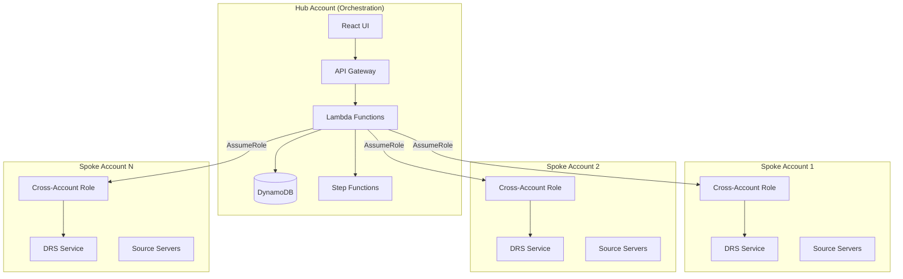
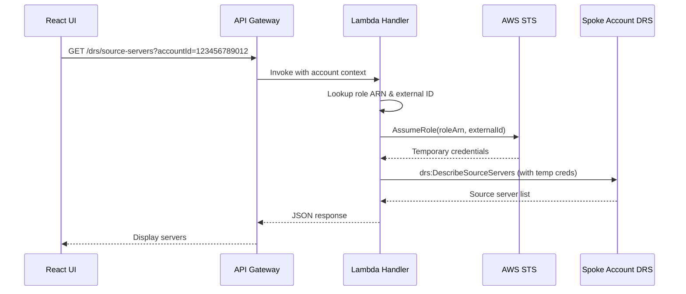

# Multi-Account Support - Implementation Plan

## Executive Summary

This document outlines the implementation plan for adding multi-account support to the AWS DRS Orchestration Solution, enabling centralized disaster recovery management across multiple AWS accounts using a hub-and-spoke architecture with STS AssumeRole.

## Background

### Current State

The DRS Orchestration Solution currently operates within a single AWS account. Organizations with multiple AWS accounts (common in enterprise environments) must deploy separate instances of the solution in each account.

### Problem Statement

- **Operational Overhead**: Managing multiple solution deployments across accounts
- **No Unified View**: Cannot see all DRS source servers across accounts in one UI
- **Inconsistent Configuration**: Recovery plans cannot span multiple accounts
- **Compliance Challenges**: Difficult to maintain consistent DR policies across accounts

### Solution

Implement hub-and-spoke cross-account access using AWS STS AssumeRole, allowing a central orchestration account to manage DRS operations across multiple spoke accounts.

## Architecture

### Hub-and-Spoke Pattern



### Cross-Account Access Flow



## Implementation Phases

### Phase 1: Data Model & Backend (Priority: High)

**Estimated Effort**: 3-4 days

#### 1.1 DynamoDB Schema Updates

Add new table for account configuration:

```yaml
# cfn/database-stack.yaml addition

AccountsTable:
  Type: AWS::DynamoDB::Table
  Properties:
    TableName: !Sub 'drs-accounts-${Environment}'
    BillingMode: PAY_PER_REQUEST
    AttributeDefinitions:
      - AttributeName: AccountId
        AttributeType: S
    KeySchema:
      - AttributeName: AccountId
        KeyType: HASH
    PointInTimeRecoverySpecification:
      PointInTimeRecoveryEnabled: true
    SSESpecification:
      SSEEnabled: true
```

Account record schema:

```json
{
  "AccountId": "123456789012",
  "AccountName": "Production Workloads",
  "AccountAlias": "prod-workloads",
  "CrossAccountRoleArn": "arn:aws:iam::123456789012:role/DRSOrchestrationCrossAccountRole",
  "ExternalId": "unique-external-id-stored-encrypted",
  "Regions": ["us-east-1", "us-west-2"],
  "Status": "ACTIVE",
  "LastValidated": "2025-12-09T10:00:00Z",
  "CreatedAt": "2025-12-01T00:00:00Z",
  "CreatedBy": "admin@example.com"
}
```

Update Protection Groups schema:

```json
{
  "GroupId": "pg-uuid",
  "GroupName": "Production Web Tier",
  "AccountId": "123456789012",
  "Region": "us-east-1",
  "SourceServerIds": ["s-xxx", "s-yyy"]
}
```

#### 1.2 Lambda API Endpoints

New endpoints:

| Method | Endpoint | Description |
|--------|----------|-------------|
| GET | `/accounts` | List configured accounts |
| POST | `/accounts` | Add new account |
| GET | `/accounts/{id}` | Get account details |
| PUT | `/accounts/{id}` | Update account |
| DELETE | `/accounts/{id}` | Remove account |
| POST | `/accounts/{id}/validate` | Validate cross-account access |
| GET | `/drs/source-servers?accountId={id}` | List servers for specific account |
| GET | `/drs/quotas?region={r}&accountId={id}` | Get DRS capacity for specific account |

Updated endpoint for DRS quotas:

```python
# lambda/index.py - Updated get_drs_quotas handler

def get_drs_quotas(event):
    """Get DRS account capacity and quotas, optionally for a cross-account"""
    params = event.get('queryStringParameters') or {}
    region = params.get('region', 'us-east-1')
    account_id = params.get('accountId')  # Optional - if not provided, use hub account
    
    try:
        if account_id:
            # Cross-account query
            capacity = get_drs_account_capacity_cross_account(region, account_id)
        else:
            # Hub account query (existing behavior)
            capacity = get_drs_account_capacity(region)
        
        return {
            'statusCode': 200,
            'body': json.dumps(capacity)
        }
    except Exception as e:
        return {
            'statusCode': 500,
            'body': json.dumps({'error': str(e)})
        }


def get_drs_account_capacity_cross_account(region: str, account_id: str) -> dict:
    """Get DRS capacity for a spoke account using cross-account role"""
    drs_client = get_cross_account_client('drs', account_id, region)
    
    # Same logic as get_drs_account_capacity but using cross-account client
    servers = []
    paginator = drs_client.get_paginator('describe_source_servers')
    for page in paginator.paginate():
        servers.extend(page.get('items', []))
    
    replicating_count = sum(
        1 for s in servers 
        if s.get('dataReplicationInfo', {}).get('dataReplicationState') == 'CONTINUOUS'
    )
    
    jobs = drs_client.describe_jobs(
        filters={'jobIDs': []},
        maxResults=100
    ).get('items', [])
    
    active_jobs = [j for j in jobs if j.get('status') in ['PENDING', 'STARTED']]
    servers_in_jobs = sum(
        len(j.get('participatingServers', [])) for j in active_jobs
    )
    
    return {
        'accountId': account_id,
        'region': region,
        'replicatingServers': replicating_count,
        'maxReplicatingServers': 300,
        'concurrentJobs': len(active_jobs),
        'maxConcurrentJobs': 20,
        'serversInActiveJobs': servers_in_jobs,
        'maxServersInAllJobs': 500
    }
```

#### 1.3 Cross-Account Helper Functions

```python
# lambda/index.py additions

import boto3
from botocore.config import Config

# Cache for cross-account clients (reuse within Lambda execution)
_cross_account_clients = {}

def get_cross_account_client(service: str, account_id: str, region: str) -> Any:
    """
    Get boto3 client with cross-account credentials
    
    Args:
        service: AWS service name (drs, ec2, ssm)
        account_id: Target AWS account ID
        region: AWS region
    
    Returns:
        boto3 client with assumed role credentials
    """
    cache_key = f"{service}:{account_id}:{region}"
    
    if cache_key in _cross_account_clients:
        return _cross_account_clients[cache_key]
    
    # Get account configuration
    accounts_table = dynamodb.Table(os.environ['ACCOUNTS_TABLE'])
    account = accounts_table.get_item(Key={'AccountId': account_id}).get('Item')
    
    if not account:
        raise ValueError(f"Account {account_id} not configured")
    
    if account.get('Status') != 'ACTIVE':
        raise ValueError(f"Account {account_id} is not active")
    
    # Assume role
    sts_client = boto3.client('sts')
    response = sts_client.assume_role(
        RoleArn=account['CrossAccountRoleArn'],
        RoleSessionName=f'drs-orchestration-{account_id[:8]}',
        ExternalId=account['ExternalId'],
        DurationSeconds=3600
    )
    
    credentials = response['Credentials']
    
    # Create client with temporary credentials
    client = boto3.client(
        service,
        region_name=region,
        aws_access_key_id=credentials['AccessKeyId'],
        aws_secret_access_key=credentials['SecretAccessKey'],
        aws_session_token=credentials['SessionToken'],
        config=Config(retries={'max_attempts': 3})
    )
    
    _cross_account_clients[cache_key] = client
    return client


def list_source_servers_multi_account(account_id: str, region: str) -> List[Dict]:
    """List DRS source servers from a specific account"""
    if account_id == os.environ.get('HUB_ACCOUNT_ID', ''):
        # Same account - use default client
        drs_client = boto3.client('drs', region_name=region)
    else:
        # Cross-account - assume role
        drs_client = get_cross_account_client('drs', account_id, region)
    
    servers = []
    paginator = drs_client.get_paginator('describe_source_servers')
    
    for page in paginator.paginate():
        for server in page.get('items', []):
            servers.append({
                'sourceServerID': server['sourceServerID'],
                'hostname': server.get('sourceProperties', {}).get('identificationHints', {}).get('hostname', 'Unknown'),
                'replicationState': server.get('dataReplicationInfo', {}).get('dataReplicationState', 'UNKNOWN'),
                'accountId': account_id,
                'region': region
            })
    
    return servers


def validate_cross_account_access(account_id: str, role_arn: str, external_id: str, regions: List[str]) -> Dict:
    """Validate cross-account role can be assumed and has required permissions"""
    results = {
        'accountId': account_id,
        'roleAssumed': False,
        'regionResults': {},
        'errors': []
    }
    
    try:
        # Test role assumption
        sts_client = boto3.client('sts')
        response = sts_client.assume_role(
            RoleArn=role_arn,
            RoleSessionName='validation-test',
            ExternalId=external_id,
            DurationSeconds=900
        )
        results['roleAssumed'] = True
        
        credentials = response['Credentials']
        
        # Test DRS access in each region
        for region in regions:
            region_result = {'drsAccess': False, 'serverCount': 0}
            try:
                drs_client = boto3.client(
                    'drs',
                    region_name=region,
                    aws_access_key_id=credentials['AccessKeyId'],
                    aws_secret_access_key=credentials['SecretAccessKey'],
                    aws_session_token=credentials['SessionToken']
                )
                
                servers = drs_client.describe_source_servers(maxResults=10)
                region_result['drsAccess'] = True
                region_result['serverCount'] = len(servers.get('items', []))
            except Exception as e:
                region_result['error'] = str(e)
            
            results['regionResults'][region] = region_result
            
    except Exception as e:
        results['errors'].append(str(e))
    
    return results
```

#### 1.4 IAM Permission Updates

Add to Lambda execution role:

```yaml
# cfn/lambda-stack.yaml addition

- Effect: Allow
  Action:
    - sts:AssumeRole
  Resource:
    - !Sub 'arn:aws:iam::*:role/DRSOrchestrationCrossAccountRole'
  Condition:
    StringEquals:
      sts:ExternalId:
        - !Ref ExternalIdParameter  # Or use Secrets Manager
```

### Phase 2: Cross-Account Role Template (Priority: High)

**Estimated Effort**: 1-2 days

> **Reference**: Based on proven patterns from `archive/dr-orchestration-artifacts/role-templates/TargetAccountsAssumeRole.yaml`

#### 2.1 Spoke Account CloudFormation Template

Create a downloadable template for spoke account setup:

```yaml
# cfn/cross-account-role-template.yaml

AWSTemplateFormatVersion: '2010-09-09'
Description: 'DRS Orchestration Cross-Account Role - Deploy in spoke accounts'

Parameters:
  HubAccountId:
    Type: String
    Description: AWS Account ID of the DRS Orchestration hub account
    AllowedPattern: '^\d{12}$'
    
  ExternalId:
    Type: String
    Description: External ID for secure role assumption (provided by hub account)
    NoEcho: true
    MinLength: 32
    
  AllowedRegions:
    Type: CommaDelimitedList
    Description: AWS regions where DRS operations are allowed
    Default: 'us-east-1,us-west-2'

  HubAccountRegion:
    Type: String
    Description: Primary region of the hub account (for role ARN construction)
    Default: 'us-east-1'
    AllowedValues:
      - us-east-1
      - us-east-2
      - us-west-1
      - us-west-2
      - eu-west-1
      - eu-central-1
      - ap-southeast-1
      - ap-southeast-2
      - ap-northeast-1

Resources:
  DRSOrchestrationCrossAccountRole:
    Type: AWS::IAM::Role
    Properties:
      RoleName: DRSOrchestrationCrossAccountRole
      Description: Cross-account role for DRS Orchestration hub account
      MaxSessionDuration: 3600
      AssumeRolePolicyDocument:
        Version: '2012-10-17'
        Statement:
          # Trust the specific Lambda execution role from hub account (more secure than account root)
          - Effect: Allow
            Principal:
              AWS: !Sub 'arn:aws:iam::${HubAccountId}:role/drs-orchestration-api-handler-role-${HubAccountRegion}'
            Action: sts:AssumeRole
            Condition:
              StringEquals:
                sts:ExternalId: !Ref ExternalId
          # Also trust the orchestration Step Functions role
          - Effect: Allow
            Principal:
              AWS: !Sub 'arn:aws:iam::${HubAccountId}:role/drs-orchestration-stepfunctions-role-${HubAccountRegion}'
            Action: sts:AssumeRole
            Condition:
              StringEquals:
                sts:ExternalId: !Ref ExternalId
      Policies:
        - PolicyName: DRSOrchestrationPermissions
          PolicyDocument:
            Version: '2012-10-17'
            Statement:
              # DRS Read Operations
              - Sid: DRSDiscovery
                Effect: Allow
                Action:
                  - drs:DescribeSourceServers
                  - drs:DescribeReplicationConfigurationTemplates
                  - drs:GetReplicationConfiguration
                  - drs:GetLaunchConfiguration
                  - drs:DescribeJobs
                  - drs:DescribeJobLogItems
                  - drs:DescribeRecoveryInstances
                  - drs:DescribeRecoverySnapshots
                Resource: '*'
                
              # DRS Recovery Operations
              - Sid: DRSRecovery
                Effect: Allow
                Action:
                  - drs:StartRecovery
                  - drs:TerminateRecoveryInstances
                  - drs:DisconnectRecoveryInstance
                  - drs:UpdateLaunchConfiguration
                Resource: '*'
                
              # EC2 Read Operations
              - Sid: EC2Discovery
                Effect: Allow
                Action:
                  - ec2:DescribeInstances
                  - ec2:DescribeInstanceStatus
                  - ec2:DescribeVolumes
                  - ec2:DescribeSnapshots
                  - ec2:DescribeSecurityGroups
                  - ec2:DescribeSubnets
                  - ec2:DescribeVpcs
                  - ec2:DescribeLaunchTemplates
                  - ec2:DescribeLaunchTemplateVersions
                Resource: '*'
                
              # EC2 Recovery Instance Operations
              - Sid: EC2RecoveryOperations
                Effect: Allow
                Action:
                  - ec2:StartInstances
                  - ec2:StopInstances
                  - ec2:TerminateInstances
                  - ec2:CreateTags
                Resource: '*'
                Condition:
                  StringEquals:
                    ec2:ResourceTag/AWSElasticDisasterRecoveryManaged: 'drs.amazonaws.com'
                    
              # Launch Template Operations (for DRS)
              - Sid: LaunchTemplateOperations
                Effect: Allow
                Action:
                  - ec2:CreateLaunchTemplateVersion
                  - ec2:ModifyLaunchTemplate
                Resource: '*'
                Condition:
                  StringLike:
                    ec2:ResourceTag/AWSElasticDisasterRecoverySourceServerID: 's-*'
                    
              # SSM for Post-Recovery Automation
              - Sid: SSMCommands
                Effect: Allow
                Action:
                  - ssm:SendCommand
                  - ssm:GetCommandInvocation
                  - ssm:ListCommandInvocations
                Resource:
                  - !Sub 'arn:aws:ssm:*:${AWS::AccountId}:document/AWS-RunShellScript'
                  - !Sub 'arn:aws:ssm:*:${AWS::AccountId}:document/AWS-RunPowerShellScript'
                  - !Sub 'arn:aws:ec2:*:${AWS::AccountId}:instance/*'

Outputs:
  RoleArn:
    Description: ARN of the cross-account role (provide to hub account)
    Value: !GetAtt DRSOrchestrationCrossAccountRole.Arn
    Export:
      Name: !Sub '${AWS::StackName}-RoleArn'
      
  RoleName:
    Description: Name of the cross-account role
    Value: !Ref DRSOrchestrationCrossAccountRole
```

### Phase 3: Frontend UI (Priority: High)

**Estimated Effort**: 3-4 days

#### 3.0 Dashboard DRS Capacity - Account Selector

Update the Dashboard DRS Capacity panel to support viewing quotas across accounts:

```typescript
// frontend/src/pages/Dashboard.tsx - Updated DRS Capacity section

// State for account selection
const [selectedAccount, setSelectedAccount] = useState<SelectProps.Option | null>(null);
const [configuredAccounts, setConfiguredAccounts] = useState<Account[]>([]);

// Fetch configured accounts on mount
useEffect(() => {
  const fetchAccounts = async () => {
    try {
      const response = await apiClient.listAccounts();
      setConfiguredAccounts(response.items || []);
    } catch (err) {
      console.error('Error fetching accounts:', err);
    }
  };
  fetchAccounts();
}, []);

// Build account options for dropdown
const accountOptions: SelectProps.Option[] = [
  { value: '', label: 'This Account (Hub)' },
  ...configuredAccounts
    .filter(a => a.status === 'ACTIVE')
    .map(a => ({
      value: a.accountId,
      label: `${a.accountName} (${a.accountId})`
    }))
];

// Updated DRS Capacity Container
<Container
  header={
    <Header
      variant="h2"
      actions={
        <SpaceBetween direction="horizontal" size="xs">
          <Select
            selectedOption={selectedAccount || accountOptions[0]}
            onChange={({ detail }) => setSelectedAccount(detail.selectedOption)}
            options={accountOptions}
            placeholder="Select account"
          />
          <Select
            selectedOption={selectedRegion}
            onChange={({ detail }) => setSelectedRegion(detail.selectedOption)}
            options={DRS_REGIONS.filter(r => 
              !selectedAccount?.value || 
              configuredAccounts.find(a => a.accountId === selectedAccount.value)?.regions.includes(r.value!)
            )}
            placeholder="Select region"
          />
        </SpaceBetween>
      }
    >
      DRS Capacity
    </Header>
  }
>
  {/* Existing quota display content */}
</Container>
```

Update `fetchDRSQuotas` to include account context:

```typescript
const fetchDRSQuotas = useCallback(async (region: string, accountId?: string) => {
  setQuotasLoading(true);
  setQuotasError(null);
  try {
    const params = new URLSearchParams({ region });
    if (accountId) {
      params.append('accountId', accountId);
    }
    const quotas = await apiClient.getDRSQuotas(region, accountId);
    setDrsQuotas(quotas);
  } catch (err) {
    console.error('Error fetching DRS quotas:', err);
    setQuotasError('Unable to fetch DRS capacity');
    setDrsQuotas(null);
  } finally {
    setQuotasLoading(false);
  }
}, []);

// Update effect to include account
useEffect(() => {
  const region = selectedRegion?.value;
  const accountId = selectedAccount?.value || undefined;
  if (region) {
    fetchDRSQuotas(region, accountId);
    const interval = setInterval(() => {
      fetchDRSQuotas(region, accountId);
    }, 30000);
    return () => clearInterval(interval);
  }
}, [selectedRegion, selectedAccount, fetchDRSQuotas]);
```

#### 3.1 New Components

##### AccountsPage.tsx

```typescript
// frontend/src/pages/AccountsPage.tsx

interface Account {
  accountId: string;
  accountName: string;
  accountAlias: string;
  crossAccountRoleArn: string;
  regions: string[];
  status: 'ACTIVE' | 'INACTIVE' | 'PENDING_VALIDATION';
  lastValidated?: string;
}

export const AccountsPage: React.FC = () => {
  const [accounts, setAccounts] = useState<Account[]>([]);
  const [showAddDialog, setShowAddDialog] = useState(false);
  
  return (
    <ContentLayout
      header={
        <Header
          variant="h1"
          description="Manage AWS accounts for cross-account DRS orchestration"
          actions={
            <SpaceBetween direction="horizontal" size="xs">
              <Button onClick={() => downloadTemplate()}>
                Download Role Template
              </Button>
              <Button variant="primary" onClick={() => setShowAddDialog(true)}>
                Add Account
              </Button>
            </SpaceBetween>
          }
        >
          AWS Accounts
        </Header>
      }
    >
      <Table
        items={accounts}
        columnDefinitions={[
          { id: 'accountId', header: 'Account ID', cell: item => item.accountId },
          { id: 'accountName', header: 'Name', cell: item => item.accountName },
          { id: 'regions', header: 'Regions', cell: item => item.regions.join(', ') },
          { id: 'status', header: 'Status', cell: item => <StatusBadge status={item.status} /> },
          { id: 'actions', header: 'Actions', cell: item => (
            <SpaceBetween direction="horizontal" size="xs">
              <Button onClick={() => validateAccount(item.accountId)}>Validate</Button>
              <Button onClick={() => editAccount(item)}>Edit</Button>
              <Button onClick={() => removeAccount(item.accountId)}>Remove</Button>
            </SpaceBetween>
          )}
        ]}
      />
      
      <AddAccountDialog
        visible={showAddDialog}
        onDismiss={() => setShowAddDialog(false)}
        onAdd={handleAddAccount}
      />
    </ContentLayout>
  );
};
```

##### AddAccountDialog.tsx

```typescript
// frontend/src/components/AddAccountDialog.tsx

export const AddAccountDialog: React.FC<Props> = ({ visible, onDismiss, onAdd }) => {
  const [accountId, setAccountId] = useState('');
  const [accountName, setAccountName] = useState('');
  const [roleArn, setRoleArn] = useState('');
  const [externalId, setExternalId] = useState('');
  const [regions, setRegions] = useState<string[]>(['us-east-1']);
  const [validating, setValidating] = useState(false);
  const [validationResult, setValidationResult] = useState<ValidationResult | null>(null);

  const generateExternalId = () => {
    const array = new Uint8Array(32);
    crypto.getRandomValues(array);
    setExternalId(Array.from(array, b => b.toString(16).padStart(2, '0')).join(''));
  };

  const handleValidate = async () => {
    setValidating(true);
    try {
      const result = await api.post('/accounts/validate', {
        accountId, roleArn, externalId, regions
      });
      setValidationResult(result.data);
    } finally {
      setValidating(false);
    }
  };

  return (
    <Modal
      visible={visible}
      onDismiss={onDismiss}
      header="Add AWS Account"
      size="large"
      footer={
        <Box float="right">
          <SpaceBetween direction="horizontal" size="xs">
            <Button onClick={onDismiss}>Cancel</Button>
            <Button onClick={handleValidate} loading={validating}>
              Validate Access
            </Button>
            <Button 
              variant="primary" 
              onClick={() => onAdd({ accountId, accountName, roleArn, externalId, regions })}
              disabled={!validationResult?.roleAssumed}
            >
              Add Account
            </Button>
          </SpaceBetween>
        </Box>
      }
    >
      <SpaceBetween direction="vertical" size="l">
        <Alert type="info">
          Before adding an account, deploy the cross-account role template in the target account.
          <Link external href="/templates/cross-account-role.yaml">Download Template</Link>
        </Alert>
        
        <FormField label="Account ID" description="12-digit AWS account ID">
          <Input
            value={accountId}
            onChange={({ detail }) => setAccountId(detail.value)}
            placeholder="123456789012"
          />
        </FormField>
        
        <FormField label="Account Name" description="Friendly name for this account">
          <Input
            value={accountName}
            onChange={({ detail }) => setAccountName(detail.value)}
            placeholder="Production Workloads"
          />
        </FormField>
        
        <FormField label="Cross-Account Role ARN" description="ARN from CloudFormation stack output">
          <Input
            value={roleArn}
            onChange={({ detail }) => setRoleArn(detail.value)}
            placeholder="arn:aws:iam::123456789012:role/DRSOrchestrationCrossAccountRole"
          />
        </FormField>
        
        <FormField 
          label="External ID" 
          description="Unique identifier for secure role assumption"
          secondaryControl={
            <Button onClick={generateExternalId}>Generate</Button>
          }
        >
          <Input
            value={externalId}
            onChange={({ detail }) => setExternalId(detail.value)}
            type="password"
          />
        </FormField>
        
        <FormField label="Regions" description="AWS regions with DRS source servers">
          <Multiselect
            selectedOptions={regions.map(r => ({ value: r, label: r }))}
            onChange={({ detail }) => setRegions(detail.selectedOptions.map(o => o.value!))}
            options={AWS_REGIONS.map(r => ({ value: r, label: r }))}
          />
        </FormField>
        
        {validationResult && (
          <Container header={<Header variant="h3">Validation Results</Header>}>
            <StatusIndicator type={validationResult.roleAssumed ? 'success' : 'error'}>
              Role Assumption: {validationResult.roleAssumed ? 'Success' : 'Failed'}
            </StatusIndicator>
            {Object.entries(validationResult.regionResults).map(([region, result]) => (
              <StatusIndicator 
                key={region}
                type={result.drsAccess ? 'success' : 'error'}
              >
                {region}: {result.drsAccess ? `${result.serverCount} servers found` : result.error}
              </StatusIndicator>
            ))}
          </Container>
        )}
      </SpaceBetween>
    </Modal>
  );
};
```

#### 3.2 Update Existing Components

##### ProtectionGroupDialog.tsx

Add account selector:

```typescript
// Add to ProtectionGroupDialog.tsx

<FormField label="AWS Account">
  <Select
    selectedOption={accounts.find(a => a.value === selectedAccountId)}
    onChange={({ detail }) => {
      setSelectedAccountId(detail.selectedOption?.value);
      setSelectedRegion(null); // Reset region when account changes
      setAvailableServers([]); // Clear servers
    }}
    options={[
      { value: '', label: 'This Account (Hub)' },
      ...configuredAccounts.map(a => ({
        value: a.accountId,
        label: `${a.accountName} (${a.accountId})`
      }))
    ]}
    placeholder="Select account"
  />
</FormField>
```

##### ServerDiscoveryPanel.tsx

Update to support multi-account:

```typescript
// Update server discovery to include account context

const discoverServers = async () => {
  setLoading(true);
  try {
    const params = new URLSearchParams({ region });
    if (accountId) {
      params.append('accountId', accountId);
    }
    const response = await api.get(`/drs/source-servers?${params}`);
    setServers(response.data.servers);
  } finally {
    setLoading(false);
  }
};
```

### Phase 4: Navigation & Settings (Priority: Medium)

**Estimated Effort**: 1 day

#### 4.1 Add Navigation Item

```typescript
// Update SideNavigation items

{
  type: 'section',
  text: 'Configuration',
  items: [
    { type: 'link', text: 'AWS Accounts', href: '/accounts' },
    { type: 'link', text: 'Settings', href: '/settings' }
  ]
}
```

#### 4.2 Add Route

```typescript
// App.tsx routes

<Route path="/accounts" element={<AccountsPage />} />
```

## Security Considerations

### External ID Best Practices

1. **Generation**: Use cryptographically secure random generation (32+ bytes)
2. **Storage**: Store encrypted in DynamoDB or AWS Secrets Manager
3. **Rotation**: Implement annual rotation with grace period
4. **Uniqueness**: One external ID per spoke account

### Least Privilege

1. **Resource-level ARNs**: Use where AWS supports (EC2, SSM)
2. **Condition keys**: Restrict by region, resource tags
3. **No wildcards**: Avoid `*` except where required by AWS

### Audit Trail

1. **CloudTrail**: All AssumeRole calls logged
2. **DynamoDB Streams**: Track account configuration changes
3. **CloudWatch Logs**: Log cross-account operations

## Testing Strategy

### Unit Tests

```python
# tests/python/unit/test_cross_account.py

def test_get_cross_account_client_success(mock_sts, mock_dynamodb):
    """Test successful cross-account client creation"""
    mock_dynamodb.get_item.return_value = {
        'Item': {
            'AccountId': '123456789012',
            'CrossAccountRoleArn': 'arn:aws:iam::123456789012:role/Test',
            'ExternalId': 'test-external-id',
            'Status': 'ACTIVE'
        }
    }
    mock_sts.assume_role.return_value = {
        'Credentials': {
            'AccessKeyId': 'AKIA...',
            'SecretAccessKey': 'secret',
            'SessionToken': 'token'
        }
    }
    
    client = get_cross_account_client('drs', '123456789012', 'us-east-1')
    assert client is not None

def test_validate_cross_account_access():
    """Test cross-account validation"""
    pass
```

### Integration Tests

```python
# tests/python/integration/test_multi_account.py

def test_list_servers_cross_account():
    """Test listing servers from spoke account"""
    pass

def test_start_recovery_cross_account():
    """Test starting recovery in spoke account"""
    pass
```

## Deployment Steps

1. **Deploy database updates** (new Accounts table)
2. **Deploy Lambda updates** (cross-account helper functions)
3. **Deploy IAM updates** (AssumeRole permissions)
4. **Deploy frontend updates** (Accounts page, dialogs)
5. **Create spoke account role template** (downloadable CFN)
6. **Test with single spoke account**
7. **Document and release**

## Timeline Estimate

| Phase | Duration |
|-------|----------|
| Phase 1: Backend | 3-4 days |
| Phase 2: Role Template | 1-2 days |
| Phase 3: Frontend | 3-4 days |
| Phase 4: Navigation | 1 day |
| Testing & Documentation | 2 days |
| **Total** | **10-13 days** |

## Success Criteria

- [ ] Accounts can be added/removed from UI
- [ ] Cross-account role template deploys successfully
- [ ] Validation confirms role assumption works
- [ ] Source servers discovered from spoke accounts
- [ ] Protection Groups can reference spoke account servers
- [ ] Recovery executions work across accounts
- [ ] Audit trail captures all cross-account operations

## Implementation Order

The recommended implementation order prioritizes user-visible features:

1. **Phase 1.1**: DynamoDB Accounts table
2. **Phase 1.2**: Account CRUD API endpoints
3. **Phase 2**: Cross-account role template (so users can prepare spoke accounts)
4. **Phase 3.0**: Dashboard DRS Capacity account dropdown (immediate value)
5. **Phase 3.1**: Accounts management page
6. **Phase 1.3**: Cross-account helper functions
7. **Phase 3.2**: Update Protection Groups for multi-account
8. **Phase 4**: Navigation updates

This order allows early testing of cross-account access via the Dashboard before full Protection Group integration.

## References

### AWS Documentation

- [AWS STS AssumeRole](https://docs.aws.amazon.com/STS/latest/APIReference/API_AssumeRole.html)
- [Cross-Account Access Best Practices](https://docs.aws.amazon.com/IAM/latest/UserGuide/tutorial_cross-account-with-roles.html)
- [External ID Confused Deputy Prevention](https://docs.aws.amazon.com/IAM/latest/UserGuide/confused-deputy.html)

### Archive Reference Implementations

- [Cross-Account Role Template](archive/dr-orchestration-artifacts/role-templates/TargetAccountsAssumeRole.yaml) - Production-tested cross-account role pattern with multi-region support
- [Cross-Account Setup Guide](docs/archive/archive_20251112_195507/CROSS_ACCOUNT_ACCESS_SETUP_GUIDE.md) - Original cross-account configuration documentation
- [DRS Observability Templates](archive/drs-tools/drs-observability/) - EventBridge and SNS patterns for cross-account DRS monitoring
