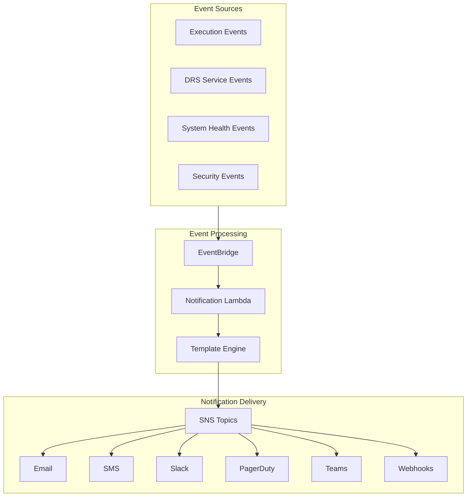
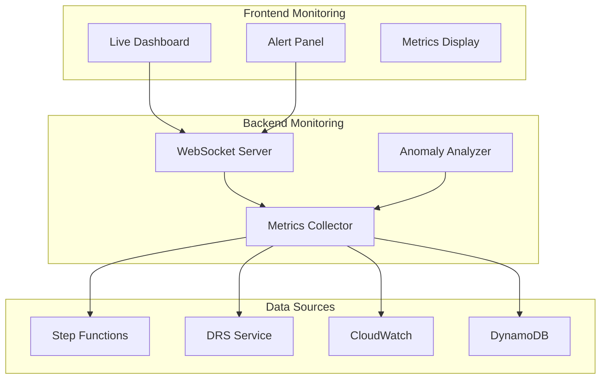
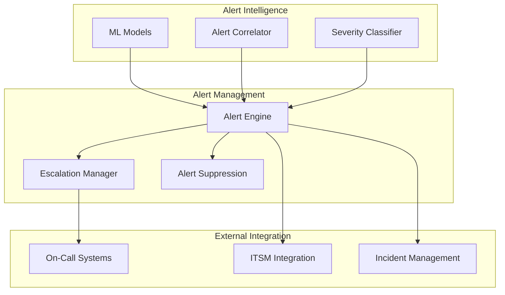
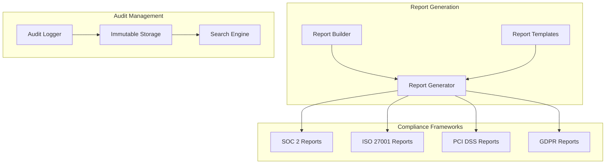

# Notifications and Monitoring Features

## Executive Summary

This document consolidates notification and monitoring enhancement features that provide comprehensive alerting, communication, and observability capabilities for the DRS orchestration platform.

---

## Feature Overview

### Consolidated Features

| Feature | Current Status | Priority | LOE | Integration Complexity |
|---------|----------------|----------|-----|----------------------|
| **SNS Notification Integration** | Planned | High | 3-4 weeks | Medium |
| **Real-Time Execution Monitoring** | Planned | Medium | 2-3 weeks | Low |
| **Advanced Alerting System** | Future | Medium | 4-5 weeks | High |
| **Compliance Reporting** | Future | Low | 3-4 weeks | Medium |

### Implementation Approach

Implement as **2 major releases** with progressive enhancement:

1. **Core Notifications** (5-6 weeks) - SNS integration and real-time monitoring
2. **Advanced Monitoring** (7-8 weeks) - Advanced alerting and compliance reporting

---

## Release 1: Core Notifications (5-6 weeks)

### Scope
Comprehensive notification system with SNS integration and real-time execution monitoring.

#### Components
- **SNS Notification Integration** (from SNS_NOTIFICATION_IMPLEMENTATION_PLAN.md)
- **Real-Time Execution Monitoring** (enhanced from existing polling system)

### SNS Notification Integration (3-4 weeks)

#### Overview
Integrate AWS Simple Notification Service (SNS) to provide multi-channel notifications for DRS orchestration events, execution status changes, and system alerts.

#### Key Features

##### Multi-Channel Notifications
- **Email Notifications**: Rich HTML email templates with execution details
- **SMS Alerts**: Critical alerts via SMS for immediate attention
- **Slack Integration**: Real-time notifications to Slack channels
- **PagerDuty Integration**: Incident management for critical failures
- **Microsoft Teams**: Notifications to Teams channels
- **Custom Webhooks**: Integration with custom notification systems

##### Event-Driven Notifications
- **Execution Lifecycle**: Start, pause, resume, complete, fail notifications
- **Wave Progress**: Individual wave completion and failure alerts
- **DRS Events**: Server status changes, replication issues, recovery failures
- **System Health**: Service availability, performance degradation alerts
- **Security Events**: Authentication failures, unauthorized access attempts

##### Notification Templates
- **Customizable Templates**: Organization-specific notification formats
- **Rich Content**: Include execution details, logs, and recovery instructions
- **Conditional Logic**: Send different notifications based on execution context
- **Localization**: Multi-language notification support
- **Branding**: Organization logos and styling in notifications

#### Architecture


#### UI Components
```typescript
// Notification Configuration
- NotificationSettings.tsx
- SNSTopicManager.tsx
- NotificationTemplateEditor.tsx
- ChannelConfiguration.tsx

// Notification History
- NotificationHistory.tsx
- NotificationDetails.tsx
- DeliveryStatus.tsx
```

#### API Extensions
```python
# Notification management endpoints
GET /notifications/settings
PUT /notifications/settings
POST /notifications/test
GET /notifications/history
GET /notifications/templates
PUT /notifications/templates/{template-id}

# SNS integration endpoints
GET /sns/topics
POST /sns/topics
PUT /sns/subscriptions/{subscription-id}
DELETE /sns/subscriptions/{subscription-id}
```

### Real-Time Execution Monitoring (2-3 weeks)

#### Overview
Enhanced real-time monitoring capabilities with WebSocket connections, live dashboards, and proactive alerting.

#### Key Features

##### Live Execution Dashboard
- **Real-Time Updates**: WebSocket-based live execution status updates
- **Progress Visualization**: Visual progress bars and status indicators
- **Wave Timeline**: Real-time wave execution timeline with current status
- **Resource Monitoring**: Live monitoring of DRS jobs and recovery instances
- **Performance Metrics**: Real-time execution performance and timing metrics

##### Proactive Monitoring
- **Threshold Alerts**: Configurable thresholds for execution duration, failure rates
- **Anomaly Detection**: Identify unusual patterns in execution behavior
- **Predictive Alerts**: Early warning for potential execution failures
- **Resource Utilization**: Monitor AWS service limits and usage patterns
- **Health Checks**: Continuous monitoring of system component health

##### Monitoring Dashboards
- **Executive Dashboard**: High-level KPIs and success metrics
- **Operational Dashboard**: Detailed execution and system status
- **Compliance Dashboard**: Audit trail and compliance metrics
- **Performance Dashboard**: System performance and optimization metrics
- **Custom Dashboards**: User-configurable monitoring views

#### Architecture


#### UI Components
```typescript
// Real-Time Monitoring
- LiveExecutionDashboard.tsx
- RealTimeMetrics.tsx
- ExecutionTimeline.tsx
- AlertsPanel.tsx

// Monitoring Configuration
- MonitoringSettings.tsx
- ThresholdConfiguration.tsx
- DashboardCustomizer.tsx
```

---

## Release 2: Advanced Monitoring (7-8 weeks)

### Scope
Advanced alerting system with intelligent monitoring, compliance reporting, and comprehensive observability.

#### Components
- **Advanced Alerting System** (4-5 weeks)
- **Compliance Reporting** (3-4 weeks)

### Advanced Alerting System (4-5 weeks)

#### Overview
Intelligent alerting system with machine learning-based anomaly detection, escalation procedures, and advanced correlation capabilities.

#### Key Features

##### Intelligent Alerting
- **ML-Based Anomaly Detection**: Machine learning models to detect execution anomalies
- **Pattern Recognition**: Identify recurring issues and failure patterns
- **Correlation Analysis**: Correlate alerts across different system components
- **Alert Suppression**: Intelligent suppression of duplicate and related alerts
- **Severity Classification**: Automatic severity assignment based on impact analysis

##### Escalation Management
- **Escalation Policies**: Configurable escalation chains for different alert types
- **On-Call Integration**: Integration with on-call scheduling systems
- **Auto-Escalation**: Automatic escalation based on response time and severity
- **Acknowledgment Tracking**: Track alert acknowledgment and response times
- **Resolution Workflows**: Guided resolution workflows for common issues

##### Alert Correlation
- **Cross-Service Correlation**: Correlate alerts across AWS services and components
- **Timeline Analysis**: Analyze alert patterns over time to identify trends
- **Impact Assessment**: Assess business impact of alerts and incidents
- **Root Cause Analysis**: Automated root cause analysis for complex failures
- **Incident Management**: Integration with incident management systems

#### Architecture


### Compliance Reporting (3-4 weeks)

#### Overview
Comprehensive compliance reporting system with automated report generation, audit trails, and regulatory compliance support.

#### Key Features

##### Automated Reporting
- **Scheduled Reports**: Automated generation of compliance and operational reports
- **Custom Report Builder**: Drag-and-drop report builder for custom reports
- **Multi-Format Export**: PDF, Excel, CSV, and JSON export formats
- **Report Distribution**: Automated distribution to stakeholders via email/portal
- **Report Templates**: Pre-built templates for common compliance frameworks

##### Audit Trail Management
- **Complete Audit Logs**: Comprehensive logging of all system activities
- **Immutable Records**: Tamper-proof audit trail with cryptographic verification
- **Retention Policies**: Configurable retention policies for different data types
- **Search and Filter**: Advanced search and filtering capabilities for audit data
- **Export Capabilities**: Export audit data for external compliance systems

##### Compliance Frameworks
- **SOC 2 Compliance**: Reports and controls for SOC 2 Type II compliance
- **ISO 27001**: Risk management and security control reporting
- **PCI DSS**: Payment card industry compliance reporting
- **GDPR**: Data protection and privacy compliance tracking
- **Custom Frameworks**: Support for organization-specific compliance requirements

#### Architecture


---

## Technical Architecture

### Data Models

#### Notification Configuration
```json
{
  "NotificationId": "notif-123",
  "Name": "Production Drill Notifications",
  "Description": "Notifications for production environment drills",
  "Enabled": true,
  "EventFilters": {
    "ExecutionTypes": ["DRILL", "RECOVERY"],
    "Environments": ["production"],
    "Severities": ["HIGH", "CRITICAL"]
  },
  "Channels": [
    {
      "Type": "EMAIL",
      "Configuration": {
        "SNSTopicArn": "arn:aws:sns:us-east-1:123456789012:dr-notifications",
        "Recipients": ["dr-team@company.com"],
        "TemplateId": "execution-status-email"
      }
    },
    {
      "Type": "SLACK",
      "Configuration": {
        "WebhookUrl": "https://hooks.slack.com/services/...",
        "Channel": "#disaster-recovery",
        "TemplateId": "execution-status-slack"
      }
    }
  ],
  "Escalation": {
    "Enabled": true,
    "DelayMinutes": 15,
    "EscalationChannels": [
      {
        "Type": "PAGERDUTY",
        "Configuration": {
          "ServiceKey": "pagerduty-service-key",
          "Severity": "critical"
        }
      }
    ]
  }
}
```

#### Alert Configuration
```json
{
  "AlertId": "alert-123",
  "Name": "Execution Duration Alert",
  "Description": "Alert when execution exceeds expected duration",
  "Enabled": true,
  "Conditions": {
    "MetricName": "ExecutionDuration",
    "Threshold": 3600,
    "Operator": "GREATER_THAN",
    "EvaluationPeriods": 1,
    "DatapointsToAlarm": 1
  },
  "Actions": [
    {
      "Type": "SNS_NOTIFICATION",
      "Configuration": {
        "TopicArn": "arn:aws:sns:us-east-1:123456789012:dr-alerts",
        "Message": "Execution {{ExecutionId}} has exceeded expected duration"
      }
    }
  ],
  "Suppression": {
    "Enabled": true,
    "DurationMinutes": 60,
    "SuppressOnAcknowledgment": true
  }
}
```

#### Compliance Report Configuration
```json
{
  "ReportId": "report-123",
  "Name": "Monthly DR Compliance Report",
  "Description": "Monthly disaster recovery compliance report for SOC 2",
  "Framework": "SOC2",
  "Schedule": {
    "Frequency": "MONTHLY",
    "DayOfMonth": 1,
    "TimeZone": "America/New_York"
  },
  "Sections": [
    {
      "Name": "Drill Execution Summary",
      "Type": "EXECUTION_METRICS",
      "Configuration": {
        "Period": "LAST_MONTH",
        "IncludeMetrics": ["success_rate", "average_duration", "failure_reasons"]
      }
    },
    {
      "Name": "Audit Trail",
      "Type": "AUDIT_LOG",
      "Configuration": {
        "Period": "LAST_MONTH",
        "EventTypes": ["execution_start", "execution_complete", "configuration_change"]
      }
    }
  ],
  "Distribution": {
    "Recipients": ["compliance@company.com", "dr-manager@company.com"],
    "Format": "PDF",
    "DeliveryMethod": "EMAIL"
  }
}
```

### Integration Points

#### SNS Integration
- **Topic Management**: Create and manage SNS topics for different notification types
- **Subscription Management**: Manage email, SMS, and webhook subscriptions
- **Message Formatting**: Format messages based on notification templates
- **Delivery Tracking**: Track message delivery status and failures

#### EventBridge Integration
- **Event Routing**: Route system events to appropriate notification handlers
- **Event Filtering**: Filter events based on severity, type, and context
- **Custom Events**: Generate custom events for business-specific scenarios
- **Cross-Account Events**: Handle events from multiple AWS accounts

#### CloudWatch Integration
- **Metrics Collection**: Collect custom metrics for monitoring and alerting
- **Log Analysis**: Analyze CloudWatch logs for error patterns and anomalies
- **Dashboard Creation**: Create CloudWatch dashboards for system monitoring
- **Alarm Management**: Manage CloudWatch alarms for system thresholds

---

## Implementation Strategy

### Development Phases

#### Phase 1: SNS Foundation (Week 1-2)
- **SNS Client Integration**: Core SNS service integration
- **Topic Management**: Create and manage SNS topics and subscriptions
- **Basic Notifications**: Implement basic email and SMS notifications
- **Template System**: Build notification template engine

#### Phase 2: Multi-Channel Notifications (Week 3-4)
- **Slack Integration**: Implement Slack webhook notifications
- **PagerDuty Integration**: Integrate with PagerDuty for incident management
- **Teams Integration**: Add Microsoft Teams notification support
- **Custom Webhooks**: Support for custom webhook integrations

#### Phase 3: Real-Time Monitoring (Week 5-6)
- **WebSocket Infrastructure**: Implement WebSocket server for real-time updates
- **Live Dashboard**: Build real-time execution monitoring dashboard
- **Metrics Collection**: Implement comprehensive metrics collection
- **Basic Alerting**: Add threshold-based alerting capabilities

#### Phase 4: Advanced Alerting (Week 7-10)
- **ML Integration**: Implement machine learning-based anomaly detection
- **Alert Correlation**: Build alert correlation and suppression logic
- **Escalation Management**: Implement escalation policies and workflows
- **Integration Testing**: Comprehensive testing of alerting system

#### Phase 5: Compliance Reporting (Week 11-13)
- **Report Builder**: Implement drag-and-drop report builder
- **Audit Trail**: Build comprehensive audit logging system
- **Compliance Templates**: Create templates for common compliance frameworks
- **Automated Distribution**: Implement scheduled report generation and distribution

### Testing Strategy

#### Unit Testing
- **Notification Logic**: Test notification formatting and delivery logic
- **Alert Processing**: Test alert generation and correlation algorithms
- **Report Generation**: Test report building and formatting logic
- **Template Engine**: Test notification and report template processing

#### Integration Testing
- **End-to-End Notifications**: Test complete notification workflows
- **Real-Time Updates**: Test WebSocket connections and live updates
- **External Integrations**: Test Slack, PagerDuty, and other external integrations
- **Compliance Workflows**: Test complete compliance reporting workflows

#### Performance Testing
- **High-Volume Notifications**: Test system under high notification load
- **Real-Time Scalability**: Test WebSocket performance with many concurrent connections
- **Report Generation**: Test large report generation performance
- **Alert Processing**: Test alert processing under high event volume

---

## Success Metrics

### Functional Metrics
- **Notification Delivery**: 99.9% successful notification delivery rate
- **Real-Time Updates**: < 3 seconds latency for live dashboard updates
- **Alert Accuracy**: < 5% false positive rate for intelligent alerts
- **Report Generation**: 100% successful automated report generation

### Performance Metrics
- **Notification Latency**: < 30 seconds from event to notification delivery
- **Dashboard Load Time**: < 2 seconds for live dashboard initial load
- **Alert Processing**: < 10 seconds from event to alert generation
- **Report Generation Time**: < 5 minutes for standard compliance reports

### Operational Metrics
- **System Availability**: 99.95% uptime for notification and monitoring systems
- **Escalation Effectiveness**: 95% of critical alerts properly escalated
- **Compliance Coverage**: 100% audit trail coverage for compliance requirements
- **User Satisfaction**: > 4.5/5 rating for notification and monitoring features

---

## Migration from Individual Plans

### Consolidation Benefits
- **Unified Notification System**: Single interface for all notification channels
- **Integrated Monitoring**: Comprehensive monitoring across all system components
- **Shared Infrastructure**: Common event processing and template systems
- **Consistent User Experience**: Unified configuration and management interface

### Implementation Dependencies
- **SNS → Real-Time Monitoring**: Real-time monitoring enhances notification capabilities
- **Both → Advanced Alerting**: Advanced alerting builds on notification and monitoring foundations
- **All → Compliance Reporting**: Compliance reporting requires comprehensive audit data

### Rollout Strategy
- **Phase 1**: Deploy core notifications and basic monitoring
- **Phase 2**: Add advanced alerting and intelligence features
- **Feature Flags**: Gradual rollout with ability to enable/disable features
- **User Training**: Comprehensive training on notification and monitoring capabilities

---

## Conclusion

This consolidated approach to notifications and monitoring provides a comprehensive observability and alerting platform for the DRS orchestration system. By implementing these features in a coordinated manner, we can deliver a robust monitoring solution that ensures stakeholders are informed of system status and can respond quickly to issues.

The two-release approach ensures that core notification capabilities are delivered first, followed by advanced monitoring and compliance features that build upon the established foundation.