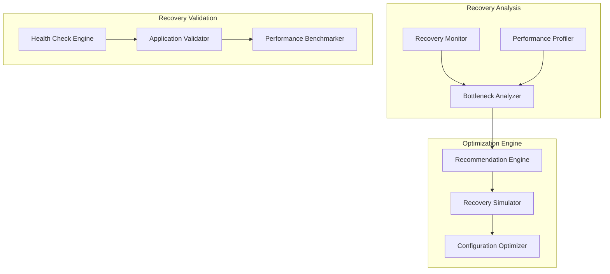
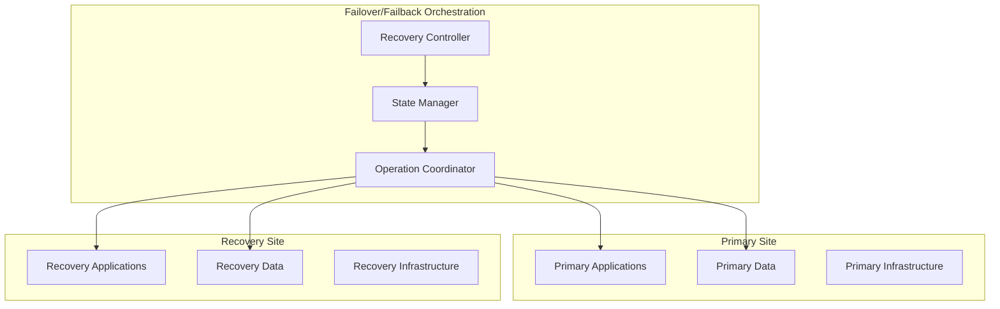

# Recovery Enhancements Features

## Executive Summary

This document consolidates advanced recovery enhancement features that extend the core DRS orchestration capabilities with deep recovery analysis, failover/failback automation, and advanced recovery scenarios.

---

## Feature Overview

### Consolidated Features

| Feature | Current Status | Priority | LOE | Complexity |
|---------|----------------|----------|-----|------------|
| **DRS Recovery Deep Dive** | Planned | High | 6-8 weeks | High |
| **Failover/Failback Orchestration** | Planned | Medium | 8-10 weeks | Very High |
| **Advanced Recovery Scenarios** | Future | Medium | 4-6 weeks | Medium |

### Implementation Approach

Implement as **2 major releases** with significant complexity:

1. **Recovery Analysis & Deep Dive** (6-8 weeks) - Comprehensive recovery analysis and optimization
2. **Failover/Failback Automation** (8-10 weeks) - Bidirectional recovery orchestration

---

## Release 1: Recovery Analysis & Deep Dive (6-8 weeks)

### Scope
Comprehensive recovery analysis, optimization recommendations, and deep recovery insights.

#### Components
- **DRS Recovery Deep Dive** (from DRS_RECOVERY_DEEP_DIVE.md)
- **Recovery Performance Analysis** (new capability)
- **Recovery Optimization Engine** (new capability)

### DRS Recovery Deep Dive (4-5 weeks)

#### Overview
Advanced recovery analysis and optimization system that provides deep insights into recovery processes, performance bottlenecks, and optimization opportunities.

#### Key Features

##### Recovery Process Analysis
- **Step-by-Step Recovery Breakdown**: Detailed analysis of each recovery phase
- **Timing Analysis**: Precise timing measurements for each recovery step
- **Resource Utilization**: CPU, memory, network, and storage utilization during recovery
- **Bottleneck Identification**: Identify performance bottlenecks and optimization opportunities
- **Dependency Mapping**: Visual mapping of recovery dependencies and critical paths

##### Performance Optimization
- **Recovery Time Optimization**: Recommendations to reduce recovery time objectives (RTO)
- **Resource Right-Sizing**: Optimal instance types and configurations for recovery
- **Parallel Processing**: Identify opportunities for parallel recovery operations
- **Network Optimization**: Network configuration recommendations for faster recovery
- **Storage Optimization**: EBS volume type and configuration recommendations

##### Recovery Validation
- **Health Check Automation**: Automated health checks during and after recovery
- **Application Validation**: Validate application functionality post-recovery
- **Data Integrity Checks**: Verify data consistency and integrity after recovery
- **Performance Benchmarking**: Compare recovery performance against baselines
- **Rollback Validation**: Ensure rollback procedures work correctly

#### Architecture


#### UI Components
```typescript
// Recovery Analysis Components
- RecoveryDeepDivePanel.tsx
- RecoveryTimelineAnalyzer.tsx
- PerformanceProfiler.tsx
- BottleneckAnalyzer.tsx

// Optimization Components
- RecoveryOptimizer.tsx
- RecommendationPanel.tsx
- ConfigurationOptimizer.tsx
- RecoverySimulator.tsx

// Validation Components
- RecoveryValidator.tsx
- HealthCheckResults.tsx
- PerformanceBenchmarks.tsx
```

#### API Extensions
```python
# Recovery analysis endpoints
GET /recovery/analysis/{execution-id}
GET /recovery/performance/{execution-id}
GET /recovery/bottlenecks/{execution-id}
POST /recovery/analyze

# Optimization endpoints
GET /recovery/recommendations/{execution-id}
POST /recovery/simulate
PUT /recovery/optimize/{recovery-plan-id}

# Validation endpoints
POST /recovery/validate/{execution-id}
GET /recovery/health-checks/{execution-id}
GET /recovery/benchmarks/{execution-id}
```

### Recovery Performance Analysis (2-3 weeks)

#### Overview
Comprehensive performance analysis system that tracks, measures, and optimizes recovery performance across all dimensions.

#### Key Features

##### Performance Metrics Collection
- **Recovery Time Metrics**: RTO, RPO, and custom recovery time measurements
- **Resource Performance**: CPU, memory, network, and storage performance during recovery
- **Application Performance**: Application-specific performance metrics post-recovery
- **Network Performance**: Bandwidth utilization, latency, and throughput measurements
- **Storage Performance**: IOPS, throughput, and latency for storage operations

##### Historical Performance Tracking
- **Performance Trends**: Track recovery performance over time
- **Baseline Establishment**: Establish performance baselines for comparison
- **Regression Detection**: Detect performance regressions in recovery processes
- **Seasonal Analysis**: Analyze performance patterns over different time periods
- **Comparative Analysis**: Compare performance across different environments

##### Performance Optimization Recommendations
- **Instance Type Recommendations**: Optimal EC2 instance types for recovery workloads
- **Network Configuration**: Network optimization for faster recovery
- **Storage Configuration**: EBS volume optimization for recovery performance
- **Application Tuning**: Application-specific optimization recommendations
- **Infrastructure Scaling**: Scaling recommendations for large recovery operations

---

## Release 2: Failover/Failback Automation (8-10 weeks)

### Scope
Comprehensive bidirectional recovery orchestration with automated failover and failback capabilities.

#### Components
- **Failover/Failback Orchestration** (from FAILOVER_FAILBACK_ORCHESTRATION_PLAN.md)
- **Bidirectional Recovery Management** (new capability)
- **Recovery State Management** (new capability)

### Failover/Failback Orchestration (6-7 weeks)

#### Overview
Advanced orchestration system that manages complete failover and failback scenarios with automated coordination, state management, and rollback capabilities.

#### Key Features

##### Automated Failover
- **Trigger-Based Failover**: Automatic failover based on configurable triggers
- **Health-Based Failover**: Failover triggered by application health degradation
- **Manual Failover**: Controlled manual failover with safety checks
- **Partial Failover**: Selective failover of specific application components
- **Cascading Failover**: Coordinated failover across dependent systems

##### Intelligent Failback
- **Readiness Assessment**: Automated assessment of primary site readiness for failback
- **Data Synchronization**: Ensure data consistency before failback operations
- **Gradual Failback**: Phased failback with validation at each step
- **Rollback Capability**: Ability to rollback failback if issues are detected
- **Zero-Downtime Failback**: Minimize downtime during failback operations

##### State Management
- **Recovery State Tracking**: Track current state of all recovery components
- **State Synchronization**: Ensure consistent state across all systems
- **State Validation**: Validate system state before and after operations
- **State Rollback**: Ability to rollback to previous known good states
- **State Persistence**: Persistent storage of recovery state information

#### Architecture


#### UI Components
```typescript
// Failover/Failback Management
- FailoverController.tsx
- FailbackController.tsx
- RecoveryStateManager.tsx
- OperationCoordinator.tsx

// State Visualization
- RecoveryStateVisualization.tsx
- SiteStatusDashboard.tsx
- DataSynchronizationStatus.tsx
- OperationProgress.tsx
```

### Bidirectional Recovery Management (2-3 weeks)

#### Overview
Advanced recovery management system that handles complex bidirectional recovery scenarios with multiple sites and sophisticated coordination.

#### Key Features

##### Multi-Site Recovery
- **Active-Active Configuration**: Support for active-active recovery configurations
- **Active-Passive Configuration**: Traditional active-passive recovery setups
- **Multi-Region Recovery**: Recovery across multiple AWS regions
- **Hybrid Recovery**: On-premises to cloud and cloud to cloud recovery
- **Cross-Account Recovery**: Recovery across multiple AWS accounts

##### Recovery Coordination
- **Site Coordination**: Coordinate recovery operations across multiple sites
- **Data Consistency**: Ensure data consistency across all recovery sites
- **Traffic Management**: Intelligent traffic routing during recovery operations
- **Load Balancing**: Dynamic load balancing during recovery transitions
- **DNS Management**: Automated DNS updates for recovery operations

---

## Technical Architecture

### Data Models

#### Recovery Analysis Result
```json
{
  "AnalysisId": "analysis-123",
  "ExecutionId": "exec-456",
  "AnalysisTimestamp": "2025-12-30T10:00:00Z",
  "RecoveryPhases": [
    {
      "Phase": "CONVERSION",
      "StartTime": "2025-12-30T10:00:00Z",
      "EndTime": "2025-12-30T10:05:00Z",
      "Duration": 300,
      "ResourceUtilization": {
        "CPU": 85.5,
        "Memory": 72.3,
        "Network": 45.2,
        "Storage": 91.7
      },
      "Bottlenecks": [
        {
          "Type": "STORAGE_IOPS",
          "Severity": "HIGH",
          "Impact": "Increased conversion time by 60 seconds",
          "Recommendation": "Use io2 volumes with higher IOPS"
        }
      ]
    }
  ],
  "PerformanceMetrics": {
    "TotalRecoveryTime": 1800,
    "RTO": 1800,
    "RPO": 300,
    "DataTransferred": 107374182400,
    "AverageNetworkThroughput": 125000000
  },
  "Recommendations": [
    {
      "Type": "INSTANCE_TYPE",
      "Current": "t3.medium",
      "Recommended": "c5.large",
      "ExpectedImprovement": "25% faster recovery",
      "CostImpact": "+$15/month"
    }
  ]
}
```

#### Failover/Failback Configuration
```json
{
  "ConfigurationId": "config-123",
  "Name": "Production Failover Configuration",
  "Type": "ACTIVE_PASSIVE",
  "PrimarySite": {
    "Region": "us-east-1",
    "AccountId": "123456789012",
    "Applications": ["web-tier", "app-tier", "db-tier"],
    "HealthChecks": [
      {
        "Type": "HTTP",
        "Endpoint": "https://app.company.com/health",
        "Interval": 30,
        "Timeout": 10,
        "FailureThreshold": 3
      }
    ]
  },
  "RecoverySite": {
    "Region": "us-west-2",
    "AccountId": "123456789012",
    "Applications": ["web-tier", "app-tier", "db-tier"],
    "ReadinessChecks": [
      {
        "Type": "DATA_SYNC",
        "MaxLagSeconds": 300,
        "ValidationQuery": "SELECT COUNT(*) FROM transactions WHERE created_at > NOW() - INTERVAL 5 MINUTE"
      }
    ]
  },
  "FailoverTriggers": [
    {
      "Type": "HEALTH_CHECK_FAILURE",
      "Configuration": {
        "ConsecutiveFailures": 3,
        "AutoFailover": true,
        "NotificationRequired": true
      }
    },
    {
      "Type": "MANUAL",
      "Configuration": {
        "RequireApproval": true,
        "ApprovalTimeout": 300
      }
    }
  ],
  "FailbackPolicy": {
    "AutoFailback": false,
    "ReadinessValidation": true,
    "DataSyncValidation": true,
    "HealthCheckValidation": true,
    "ApprovalRequired": true
  }
}
```

#### Recovery State
```json
{
  "StateId": "state-123",
  "Timestamp": "2025-12-30T10:00:00Z",
  "CurrentState": "ACTIVE_PRIMARY",
  "PreviousState": "FAILOVER_IN_PROGRESS",
  "StateTransitionHistory": [
    {
      "FromState": "ACTIVE_PRIMARY",
      "ToState": "FAILOVER_IN_PROGRESS",
      "Timestamp": "2025-12-30T09:45:00Z",
      "Trigger": "HEALTH_CHECK_FAILURE",
      "InitiatedBy": "system"
    }
  ],
  "SiteStates": {
    "Primary": {
      "Status": "HEALTHY",
      "Applications": {
        "web-tier": "RUNNING",
        "app-tier": "RUNNING",
        "db-tier": "RUNNING"
      },
      "DataSyncStatus": "CURRENT",
      "LastHealthCheck": "2025-12-30T09:59:30Z"
    },
    "Recovery": {
      "Status": "STANDBY",
      "Applications": {
        "web-tier": "STOPPED",
        "app-tier": "STOPPED",
        "db-tier": "STANDBY"
      },
      "DataSyncStatus": "LAG_5_SECONDS",
      "LastReadinessCheck": "2025-12-30T09:59:45Z"
    }
  }
}
```

### Integration Points

#### DRS Service Integration
- **Recovery Job Monitoring**: Monitor DRS recovery jobs for detailed analysis
- **Performance Metrics Collection**: Collect performance data during recovery operations
- **Configuration Optimization**: Apply optimization recommendations to DRS configurations
- **State Synchronization**: Synchronize recovery state with DRS service state

#### CloudWatch Integration
- **Custom Metrics**: Publish custom recovery performance metrics to CloudWatch
- **Log Analysis**: Analyze CloudWatch logs for recovery performance insights
- **Alarm Integration**: Create CloudWatch alarms for recovery performance thresholds
- **Dashboard Creation**: Create CloudWatch dashboards for recovery monitoring

#### Route 53 Integration
- **DNS Failover**: Automated DNS failover for application endpoints
- **Health Check Integration**: Use Route 53 health checks for failover triggers
- **Traffic Routing**: Intelligent traffic routing during recovery operations
- **Geolocation Routing**: Geographic traffic routing for multi-region recovery

---

## Implementation Strategy

### Development Phases

#### Phase 1: Recovery Analysis Foundation (Week 1-3)
- **Performance Monitoring**: Implement comprehensive performance monitoring
- **Metrics Collection**: Build metrics collection and storage system
- **Analysis Engine**: Develop recovery analysis and bottleneck detection
- **Basic Recommendations**: Implement basic optimization recommendations

#### Phase 2: Deep Dive Capabilities (Week 4-6)
- **Advanced Analysis**: Implement advanced recovery analysis capabilities
- **Optimization Engine**: Build comprehensive optimization recommendation engine
- **Validation Framework**: Implement recovery validation and health checking
- **UI Components**: Build user interface for recovery analysis and optimization

#### Phase 3: Failover Foundation (Week 7-10)
- **State Management**: Implement comprehensive recovery state management
- **Failover Controller**: Build automated failover orchestration system
- **Health Monitoring**: Implement advanced health monitoring and trigger system
- **Basic Failover**: Implement basic failover capabilities with manual triggers

#### Phase 4: Advanced Failover/Failback (Week 11-14)
- **Intelligent Failback**: Implement automated failback with readiness assessment
- **Multi-Site Support**: Add support for complex multi-site recovery scenarios
- **Advanced Coordination**: Implement sophisticated recovery coordination capabilities
- **Integration Testing**: Comprehensive testing of all failover/failback scenarios

### Testing Strategy

#### Unit Testing
- **Analysis Logic**: Test recovery analysis algorithms and bottleneck detection
- **Optimization Engine**: Test recommendation generation and optimization logic
- **State Management**: Test recovery state tracking and synchronization
- **Failover Logic**: Test failover and failback orchestration logic

#### Integration Testing
- **End-to-End Recovery**: Test complete recovery scenarios with analysis
- **Failover/Failback**: Test complete failover and failback workflows
- **Multi-Site Recovery**: Test complex multi-site recovery scenarios
- **Performance Validation**: Validate performance improvements from optimizations

#### Disaster Recovery Testing
- **Real Failover Testing**: Test actual failover scenarios in controlled environments
- **Failback Validation**: Validate failback procedures and data consistency
- **Performance Benchmarking**: Benchmark recovery performance improvements
- **Chaos Engineering**: Test system resilience under various failure scenarios

---

## Success Metrics

### Functional Metrics
- **Recovery Analysis**: 100% of recoveries analyzed with actionable recommendations
- **Optimization Impact**: 25% average improvement in recovery time from optimizations
- **Failover Success**: 99.9% successful automated failover operations
- **Failback Success**: 95% successful automated failback operations

### Performance Metrics
- **Analysis Time**: < 5 minutes to complete recovery analysis
- **Failover Time**: < 15 minutes for automated failover completion
- **Failback Time**: < 30 minutes for automated failback completion
- **RTO Improvement**: 30% average improvement in RTO from optimizations

### Operational Metrics
- **System Availability**: 99.99% availability during recovery operations
- **Data Consistency**: 100% data consistency maintained during failover/failback
- **False Positive Rate**: < 2% false positive rate for automated failover triggers
- **User Satisfaction**: > 4.7/5 rating for recovery enhancement features

---

## Migration from Individual Plans

### Consolidation Benefits
- **Unified Recovery Platform**: Single interface for all recovery enhancement features
- **Integrated Analysis**: Comprehensive analysis across all recovery aspects
- **Shared Infrastructure**: Common performance monitoring and state management
- **Consistent User Experience**: Unified interface for recovery management

### Implementation Dependencies
- **Recovery Analysis → Failover/Failback**: Analysis provides insights for optimization
- **Both → Advanced Scenarios**: Advanced scenarios build on both foundations
- **Shared Components**: Performance monitoring, state management, validation systems

### Rollout Strategy
- **Phase 1**: Deploy recovery analysis and optimization features
- **Phase 2**: Add failover/failback automation capabilities
- **Feature Flags**: Gradual rollout with ability to enable/disable features
- **User Training**: Comprehensive training on advanced recovery capabilities

---

## Conclusion

This consolidated approach to recovery enhancements provides a comprehensive platform for advanced disaster recovery capabilities. By implementing these features in a coordinated manner, we can deliver sophisticated recovery analysis, optimization, and automation that significantly improves recovery outcomes and reduces operational complexity.

The two-release approach ensures that foundational analysis and optimization capabilities are delivered first, followed by advanced failover/failback automation that builds upon the established foundation.