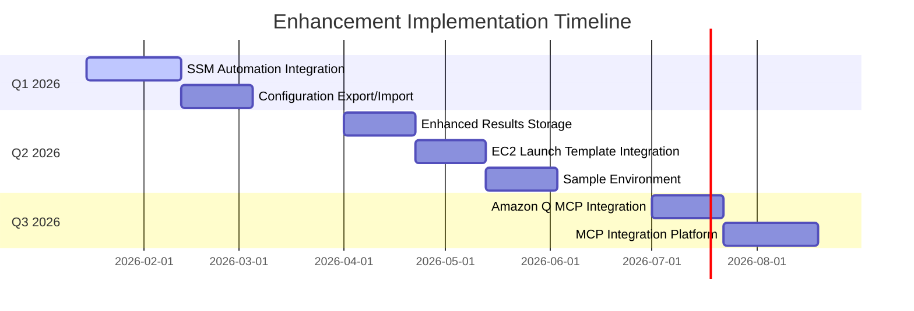

# Implementation Roadmap

## Overview

This document consolidates the infrastructure improvements and enhancement roadmap for the AWS DRS Orchestration platform, providing a comprehensive view of planned features, priorities, and implementation timelines.

---

## Table of Contents

1. [Current Infrastructure Status](#current-infrastructure-status)
2. [Enhancement Priorities](#enhancement-priorities)
3. [Infrastructure Improvements](#infrastructure-improvements)
4. [Platform Enhancements](#platform-enhancements)
5. [Implementation Timeline](#implementation-timeline)
6. [Resource Requirements](#resource-requirements)
7. [Success Metrics](#success-metrics)

---

## Current Infrastructure Status

### CI/CD Platform (✅ Complete)

The project uses **GitHub Actions** for automated CI/CD deployment with OIDC-based AWS authentication.

| Component | Status | Description |
|-----------|--------|-------------|
| **Workflow** | ✅ Deployed | `.github/workflows/deploy.yml` |
| **Repository** | ✅ Active | GitHub (primary) |
| **Authentication** | ✅ Configured | OIDC (no long-lived credentials) |
| **OIDC Stack** | ✅ Deployed | `cfn/github-oidc-stack.yaml` |
| **Pipeline Stages** | ✅ Operational | 6 stages: Validate, Security Scan, Build, Test, Deploy Infrastructure, Deploy Frontend |
| **Deployment Time** | ✅ Optimized | ~20 minutes for full deployment |

**Note**: The project was successfully migrated from GitLab CI/CD to GitHub Actions in January 2026. The CodeBuild/CodeCommit migration originally planned is no longer needed.

### Current Capabilities

- **OIDC Authentication**: Secure AWS access without long-lived credentials
- **Automated Deployment**: Deploy on push to main branch
- **Quality Gates**: Automated linting, type checking, and security scanning
- **Multi-Stage Pipeline**: Separate validation, build, test, and deployment stages
- **Audit Trail**: Complete deployment history via GitHub Actions logs

---

## Enhancement Priorities

### Priority Matrix

| Priority | Enhancement | Effort | Impact | Risk | Timeline |
|----------|-------------|--------|--------|------|----------|
| **1** | SSM Automation Integration | 4 weeks | High | Medium | Q1 2026 |
| **2** | Configuration Export/Import | 3 weeks | High | Low | Q1 2026 |
| **3** | Enhanced Results Storage | 3 weeks | Medium | Low | Q2 2026 |
| **4** | EC2 Launch Template Integration | 2-3 weeks | Medium | Low | Q2 2026 |
| **5** | Sample Environment Deployment | 3 weeks | Medium | Low | Q2 2026 |
| **6** | Amazon Q MCP Integration | 2-3 weeks | Low | Low | Q3 2026 |
| **7** | MCP Integration Platform | 3-4 weeks | Low | Medium | Q3 2026 |

**Total Effort**: 20-23 weeks | **Resource Requirements**: 1 senior developer

---

## Infrastructure Improvements

### 1. EC2 Launch Template Integration

**Status**: 🔄 Planned (Medium Priority, 2-3 weeks)

Enhanced integration with EC2 Launch Templates for standardized, versioned instance configurations.

#### Key Features

##### Launch Template Management
- **Template Discovery**: Browse and select from existing EC2 launch templates
- **Template Validation**: Validate template compatibility with DRS requirements
- **Template Customization**: DRS-specific overrides and customizations
- **Version Management**: Track template versions and enable rollback
- **Template Sharing**: Cross-account template access and sharing

##### DRS Integration
- **Recovery Instance Configuration**: Use launch templates for recovery instances
- **Automatic Template Selection**: Intelligent template selection based on source instance
- **Configuration Override**: Override template settings for specific recovery scenarios
- **Compliance Validation**: Ensure templates meet security and compliance requirements
- **Cost Optimization**: Template recommendations for cost optimization

#### Implementation Phases

**Phase 1: Template Management (Week 1)**
- Implement launch template discovery and listing
- Build template validation framework
- Create template compatibility checker

**Phase 2: DRS Integration (Week 2)**
- Integrate templates with DRS recovery processes
- Implement template selection logic
- Build configuration override system

**Phase 3: UI Components (Week 3)**
- Create template selector component
- Build template editor interface
- Implement template validation UI

#### UI Components
```typescript
// Launch Template Management
- LaunchTemplateSelector.tsx
- LaunchTemplateEditor.tsx
- LaunchTemplateValidator.tsx
- TemplateVersionHistory.tsx

// DRS Integration
- DRSTemplateConfiguration.tsx
- TemplateOverrideEditor.tsx
- TemplateComplianceChecker.tsx
```

### 2. Amazon Q MCP Integration

**Status**: 🔄 Planned (Low Priority, 2-3 weeks)

Integration with Amazon Q through Model Context Protocol (MCP) for AI-powered assistance.

#### Key Features

##### AI-Powered Assistance
- **Natural Language Queries**: Query DRS status and configuration using natural language
- **Intelligent Recommendations**: AI-powered recommendations for DRS optimization
- **Automated Documentation**: Generate documentation from DRS configurations
- **Troubleshooting Assistance**: AI-powered troubleshooting for DRS issues
- **Configuration Generation**: Generate DRS configurations from requirements

##### MCP Integration
- **Protocol Implementation**: Full MCP protocol implementation for Amazon Q
- **Context Sharing**: Share DRS context with Amazon Q for better assistance
- **Real-Time Updates**: Real-time synchronization of DRS state with Amazon Q
- **Security Integration**: Secure authentication and authorization for Q access
- **Multi-Modal Support**: Support for text, code, and configuration interactions

#### Implementation Phases

**Phase 1: MCP Foundation (Week 1)**
- Implement core MCP protocol
- Build context management system
- Create security framework

**Phase 2: Amazon Q Integration (Week 2)**
- Integrate with Amazon Q service
- Implement query handling
- Build response formatting

**Phase 3: Client Integration (Week 3)**
- Create web interface
- Build IDE extensions
- Implement CLI integration

### 3. MCP Integration Platform

**Status**: 🔄 Planned (Low Priority, 3-4 weeks)

Comprehensive MCP integration platform enabling integration with multiple AI tools.

#### Key Features

##### Multi-Tool Support
- **Amazon Q Integration**: Native integration with Amazon Q
- **Claude Integration**: Integration with Anthropic Claude
- **GitHub Copilot**: Integration with GitHub Copilot
- **Custom AI Tools**: Support for custom AI tool integrations
- **Tool Orchestration**: Coordinate multiple AI tools for complex tasks

##### Development Environment Integration
- **VS Code Extension**: Full-featured VS Code extension with MCP support
- **JetBrains Plugin**: IntelliJ IDEA and other JetBrains IDE support
- **Vim/Neovim Plugin**: Command-line editor integration
- **Emacs Integration**: Emacs editor support
- **Web-Based IDE**: Browser-based development environment

#### Implementation Phases

**Phase 1: Platform Foundation (Week 1-2)**
- Build MCP server infrastructure
- Implement protocol handler
- Create context management system

**Phase 2: Tool Integrations (Week 3)**
- Integrate Amazon Q
- Add Claude support
- Implement Copilot integration

**Phase 3: Client Libraries (Week 4)**
- Build VS Code extension
- Create JetBrains plugin
- Implement web client

---

## Platform Enhancements

### 1. SSM Automation Integration

**Status**: 🔄 Planned (High Priority, 4 weeks)

Add SSM Automation runbooks for pre/post-wave actions, enabling broader disaster recovery automation.

#### Key Features

##### Pre/Post-Wave Actions
- **SSM Document Execution**: Execute SSM Automation documents before and after waves
- **Parameter Management**: Pass parameters to SSM documents from recovery plan
- **Timeout Configuration**: Configure maximum wait times for automation execution
- **Error Handling**: Handle automation failures with retry and rollback logic
- **Output Capture**: Capture automation outputs for audit and troubleshooting

##### Supported Automation Types
- **Service Management**: Stop/start services, validate connectivity
- **Database Operations**: Backup, restore, failover operations
- **Network Configuration**: DNS updates, load balancer configuration
- **Application Validation**: Health checks, smoke tests
- **Custom Automation**: Any SSM Automation document

#### Implementation Phases

**Phase 1: Data Model Extension (Week 1)**
```json
{
  "WaveName": "Database Tier",
  "ProtectionGroupId": "pg-123",
  "PreWaveActions": [
    {
      "Name": "Stop Application Services",
      "DocumentName": "StopServices",
      "Parameters": {"ServiceNames": ["app-service"]},
      "MaxWaitTime": 300
    }
  ],
  "PostWaveActions": [
    {
      "Name": "Validate Database Connectivity",
      "DocumentName": "ValidateDB",
      "Parameters": {"ConnectionString": "{{resolve:secretsmanager:db-conn}}"},
      "MaxWaitTime": 600
    }
  ]
}
```

**Phase 2: Step Functions Integration (Week 2-3)**
- Add pre-wave actions state to Step Functions
- Implement SSM automation execution
- Add post-wave actions state
- Build error handling and retry logic

**Phase 3: Frontend UI (Week 4)**
- Create action editor component
- Build SSM document selector
- Implement parameter editor
- Add validation and testing UI

#### Benefits
- **Broader Automation**: Support for RDS, Lambda, Route 53, S3 automation
- **Flexible Integration**: Any SSM Automation document can be used
- **Sequenced Actions**: Pre/post-wave automation with proper ordering

### 2. Configuration Export/Import Enhancement

**Status**: 🔄 Planned (High Priority, 3 weeks)

Complete configuration export/import with validation and migration support.

#### Key Features

##### Enhanced Export Format
- **Complete Configuration**: Export all protection groups, recovery plans, and target accounts
- **Metadata Tracking**: Track export version, date, source account, and user
- **Cross-References**: Maintain relationships between configuration elements
- **Validation Data**: Include validation information for import verification

##### Import Validation
- **Conflict Detection**: Identify naming conflicts with existing configuration
- **Cross-Reference Validation**: Verify all references are valid
- **Resource Validation**: Check that referenced AWS resources exist
- **Version Compatibility**: Ensure import format matches current version

##### Migration Support
- **Version Migration**: Migrate configuration between format versions
- **Backward Compatibility**: Support importing older configuration formats
- **Migration Validation**: Verify migrated configuration is valid
- **Rollback Support**: Ability to rollback failed migrations

#### Implementation Phases

**Phase 1: Enhanced Export Format (Week 1)**
- Design comprehensive export schema
- Implement export functionality
- Add metadata tracking
- Build validation data collection

**Phase 2: Import Validation (Week 2)**
- Implement conflict detection
- Build cross-reference validation
- Add resource validation
- Create validation reporting

**Phase 3: Migration Support (Week 3)**
- Implement version migration
- Build migration validation
- Add rollback support
- Create migration testing framework

#### Benefits
- **Complete Backup**: Full configuration backup and restore
- **Environment Migration**: Easy migration between environments
- **Version Control**: Configuration versioning and migration support

### 3. Enhanced Results Storage & Audit Trail

**Status**: 🔄 Planned (Medium Priority, 3 weeks)

Comprehensive execution results with detailed job logs, automation outputs, and audit trails.

#### Key Features

##### Detailed Results Collection
- **DRS Job Details**: Complete DRS job information including timing and status
- **SSM Automation Results**: Capture SSM automation execution outputs
- **Recovery Instance Details**: Track launched instance information
- **Wave-Level Results**: Detailed results for each wave execution
- **Error Context**: Comprehensive error information for troubleshooting

##### Audit Trail
- **Complete History**: Full audit trail of all execution activities
- **User Actions**: Track all user actions and approvals
- **System Events**: Record all system-generated events
- **Compliance Reporting**: Generate compliance reports from audit data
- **Retention Management**: Configurable retention policies for audit data

#### Implementation Phases

**Phase 1: Results Schema Enhancement (Week 1)**
- Design enhanced results schema
- Implement results collection framework
- Add metadata tracking
- Build storage optimization

**Phase 2: Results Collection (Week 2)**
- Implement DRS job details collection
- Add SSM automation results capture
- Build recovery instance tracking
- Create error context collection

**Phase 3: Audit Trail (Week 3)**
- Implement audit logging
- Build compliance reporting
- Add retention management
- Create audit query interface

#### Benefits
- **Complete Audit Trail**: Detailed execution history for compliance
- **Troubleshooting**: Comprehensive logs for debugging failed executions
- **Reporting**: Rich data for recovery metrics and analysis

### 4. Sample Environment Deployment

**Status**: 🔄 Planned (Medium Priority, 3 weeks)

Automated sample environment deployment for testing and demonstrations.

#### Key Features

##### Sample Infrastructure
- **3-Tier Application**: Database, application, and web tiers
- **DRS Agent Installation**: Automated DRS agent deployment
- **Tag-Based Organization**: Proper tagging for protection group discovery
- **Network Configuration**: Complete VPC and networking setup
- **Security Configuration**: Security groups and IAM roles

##### Sample Data Seeding
- **Protection Groups**: Pre-configured protection groups for each tier
- **Recovery Plan**: Sample 3-wave recovery plan
- **SSM Documents**: Sample automation documents for testing
- **Target Accounts**: Sample cross-account configuration

#### Implementation Phases

**Phase 1: Sample Infrastructure Template (Week 1)**
- Create CloudFormation template for 3-tier app
- Implement DRS agent installation
- Add tagging and organization
- Build network and security configuration

**Phase 2: Sample Data Seeding (Week 2)**
- Create protection group seeding script
- Build recovery plan creation
- Add SSM document samples
- Implement target account configuration

**Phase 3: Deployment Automation (Week 3)**
- Create deployment script
- Build validation checks
- Add cleanup automation
- Create user documentation

#### Benefits
- **Quick Demos**: Automated demo environment setup
- **Testing**: Consistent test environment for development
- **Training**: Hands-on environment for user training

---

## Implementation Timeline

### Q1 2026 (Weeks 1-13)

**Priority 1: SSM Automation Integration (Weeks 1-4)**
- Week 1: Data model extension and API design
- Week 2-3: Step Functions integration and orchestration
- Week 4: Frontend UI and testing

**Priority 2: Configuration Export/Import (Weeks 5-7)**
- Week 5: Enhanced export format implementation
- Week 6: Import validation and conflict detection
- Week 7: Migration support and testing

### Q2 2026 (Weeks 14-26)

**Priority 3: Enhanced Results Storage (Weeks 14-16)**
- Week 14: Results schema enhancement
- Week 15: Results collection implementation
- Week 16: Audit trail and reporting

**Priority 4: EC2 Launch Template Integration (Weeks 17-19)**
- Week 17: Template management implementation
- Week 18: DRS integration
- Week 19: UI components and testing

**Priority 5: Sample Environment (Weeks 20-22)**
- Week 20: Sample infrastructure template
- Week 21: Sample data seeding
- Week 22: Deployment automation and documentation

### Q3 2026 (Weeks 27-39)

**Priority 6: Amazon Q MCP Integration (Weeks 27-29)**
- Week 27: MCP foundation and protocol
- Week 28: Amazon Q integration
- Week 29: Client integration and testing

**Priority 7: MCP Integration Platform (Weeks 30-33)**
- Week 30-31: Platform foundation
- Week 32: Tool integrations
- Week 33: Client libraries and testing

### Timeline Visualization



---

## Resource Requirements

### Development Team
- **1 Senior Developer**: 20-23 weeks total effort
- **QA Support**: Integration testing for each enhancement
- **Technical Writer**: User guide updates for new features

### Infrastructure
- **Development Environment**: For testing enhancements
- **Sample Environment**: For testing sample deployment feature
- **CI/CD Resources**: GitHub Actions minutes for automated testing

### Budget Considerations
- **AWS Services**: Additional costs for sample environment and testing
- **Development Tools**: IDE extensions and MCP integration tools
- **Training**: User training for new features

---

## Success Metrics

### Functional Metrics

| Enhancement | Success Metric | Target |
|-------------|----------------|--------|
| SSM Integration | Recovery plans using pre/post-wave actions | 90% |
| Configuration Management | Environments using export/import for backup | 100% |
| Results Storage | Execution traceability for compliance | 100% |
| Launch Templates | Recovery instances using launch templates | 80% |
| Sample Environment | Reduction in demo setup time | 50% |
| MCP Integration | Developers using MCP integration tools | 70% |

### Performance Metrics

| Metric | Current | Target | Improvement |
|--------|---------|--------|-------------|
| Deployment Time | 20 min | 15 min | 25% |
| Configuration Backup Time | N/A | < 2 min | New capability |
| Results Query Time | N/A | < 1 sec | New capability |
| Template Selection Time | N/A | < 5 sec | New capability |
| Sample Environment Setup | Manual | < 10 min | Automated |

### Operational Metrics

| Metric | Target |
|--------|--------|
| System Reliability | 99.9% uptime |
| Developer Productivity | 30% improvement |
| Cost Optimization | 20% reduction in CI/CD costs |
| User Satisfaction | > 4.5/5 rating |

---

## Risk Mitigation

### Technical Risks

| Risk | Mitigation Strategy |
|------|---------------------|
| Feature Complexity | Implement behind feature toggles for gradual rollout |
| Backward Compatibility | Maintain existing API contracts, version all changes |
| Integration Issues | Comprehensive integration testing with existing features |
| Performance Impact | Performance testing for each enhancement |

### Operational Risks

| Risk | Mitigation Strategy |
|------|---------------------|
| User Adoption | Phased rollout with user training and documentation |
| Support Burden | Comprehensive documentation and troubleshooting guides |
| Resource Constraints | Prioritize enhancements based on impact and effort |
| Timeline Delays | Buffer time in schedule, regular progress reviews |

---

## Conclusion

This roadmap provides a comprehensive plan for enhancing the AWS DRS Orchestration platform over the next 9 months. By implementing these enhancements in priority order, we will:

1. **Expand Automation Capabilities** with SSM integration and launch templates
2. **Improve Operational Excellence** with enhanced configuration management and audit trails
3. **Accelerate Adoption** with sample environments and better documentation
4. **Enhance Developer Experience** with MCP integration and AI-powered assistance
5. **Maintain Enterprise Quality** with comprehensive testing and gradual rollout

The roadmap balances high-impact enhancements with manageable implementation effort, ensuring we deliver maximum value while maintaining system stability and reliability.
