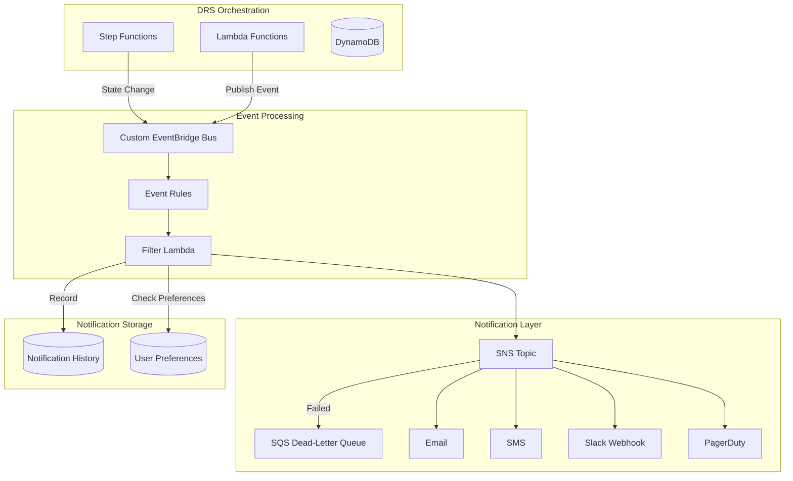
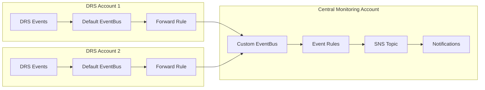

# SNS Notification Integration Implementation Plan

## Overview

This document outlines the implementation plan for integrating SNS notifications into the AWS DRS Orchestration solution. The notification system will provide real-time alerts for execution status changes, DRS events, and system health monitoring.

## Reference Architecture

Based on patterns from `archive/drs-tools/drs-observability/`:

- **Central SNS Topic**: Single topic for all orchestration notifications
- **Custom EventBridge Bus**: Dedicated event bus for DRS orchestration events (supports cross-account)
- **EventBridge Integration**: Event-driven notification triggers with cross-account forwarding
- **Multi-Channel Delivery**: Email, SMS, Slack, PagerDuty support
- **Dead-Letter Queue**: SQS DLQ for failed notification delivery with retry
- **Notification History**: DynamoDB table for audit trail and UI display
- **User Preference Filtering**: Lambda-based filtering for per-user notification preferences
- **CloudWatch Integration**: Metric filters for DRS agent warnings/errors, dashboards for monitoring

## Architecture



### Cross-Account Architecture (Multi-Account Deployments)

For organizations with DRS configured across multiple AWS accounts:



## Phase 1: Core SNS Infrastructure

### 1.1 CloudFormation Resources

Add to `cfn/notification-stack.yaml` (new nested stack):

```yaml
AWSTemplateFormatVersion: '2010-09-09'
Description: SNS Notification Infrastructure for DRS Orchestration

Parameters:
  ProjectName:
    Type: String
  Environment:
    Type: String
  NotificationEmail:
    Type: String
    Description: Primary email for notifications
    Default: ''
  AwsOrganizationId:
    Type: String
    Description: AWS Organizations ID (for cross-account event forwarding)
    Default: ''

Conditions:
  HasNotificationEmail: !Not [!Equals [!Ref NotificationEmail, '']]
  HasOrganizationId: !Not [!Equals [!Ref AwsOrganizationId, '']]

Resources:
  #============================================================================
  # Custom EventBridge Bus (supports cross-account event forwarding)
  #============================================================================
  OrchestrationEventBus:
    Type: AWS::Events::EventBus
    Properties:
      Name: !Sub '${ProjectName}-events-${Environment}'

  # Allow cross-account event publishing from organization
  OrchestrationEventBusPolicy:
    Type: AWS::Events::EventBusPolicy
    Condition: HasOrganizationId
    Properties:
      StatementId: OrganizationEventBusAccess
      EventBusName: !Ref OrchestrationEventBus
      Principal: '*'
      Action: events:PutEvents
      Condition:
        Type: StringEquals
        Key: aws:PrincipalOrgID
        Value: !Ref AwsOrganizationId

  #============================================================================
  # SNS Topic with Dead-Letter Queue
  #============================================================================
  OrchestrationNotificationTopic:
    Type: AWS::SNS::Topic
    Properties:
      TopicName: !Sub '${ProjectName}-notifications-${Environment}'
      DisplayName: DRS Orchestration Notifications
      KmsMasterKeyId: alias/aws/sns
      Tags:
        - Key: Project
          Value: !Ref ProjectName
        - Key: Environment
          Value: !Ref Environment

  # Dead-Letter Queue for failed notifications
  NotificationDeadLetterQueue:
    Type: AWS::SQS::Queue
    Properties:
      QueueName: !Sub '${ProjectName}-notification-dlq-${Environment}'
      MessageRetentionPeriod: 1209600  # 14 days
      KmsMasterKeyId: alias/aws/sqs
      Tags:
        - Key: Project
          Value: !Ref ProjectName

  # DLQ Policy
  NotificationDLQPolicy:
    Type: AWS::SQS::QueuePolicy
    Properties:
      Queues:
        - !Ref NotificationDeadLetterQueue
      PolicyDocument:
        Version: '2012-10-17'
        Statement:
          - Sid: AllowSNSDeadLetter
            Effect: Allow
            Principal:
              Service: sns.amazonaws.com
            Action: sqs:SendMessage
            Resource: !GetAtt NotificationDeadLetterQueue.Arn
            Condition:
              ArnEquals:
                aws:SourceArn: !Ref OrchestrationNotificationTopic

  # SNS Topic Policy
  OrchestrationNotificationTopicPolicy:
    Type: AWS::SNS::TopicPolicy
    Properties:
      Topics:
        - !Ref OrchestrationNotificationTopic
      PolicyDocument:
        Version: '2012-10-17'
        Statement:
          - Sid: AllowEventBridgePublish
            Effect: Allow
            Principal:
              Service: events.amazonaws.com
            Action: sns:Publish
            Resource: !Ref OrchestrationNotificationTopic
          - Sid: AllowLambdaPublish
            Effect: Allow
            Principal:
              Service: lambda.amazonaws.com
            Action: sns:Publish
            Resource: !Ref OrchestrationNotificationTopic
            Condition:
              ArnLike:
                aws:SourceArn: !Sub 'arn:aws:lambda:${AWS::Region}:${AWS::AccountId}:function:${ProjectName}-*'

  # Email Subscription (if provided)
  EmailSubscription:
    Type: AWS::SNS::Subscription
    Condition: HasNotificationEmail
    Properties:
      TopicArn: !Ref OrchestrationNotificationTopic
      Protocol: email
      Endpoint: !Ref NotificationEmail
      RedrivePolicy:
        deadLetterTargetArn: !GetAtt NotificationDeadLetterQueue.Arn

  #============================================================================
  # DynamoDB Tables
  #============================================================================
  
  # User notification preferences
  NotificationPreferencesTable:
    Type: AWS::DynamoDB::Table
    Properties:
      TableName: !Sub '${ProjectName}-notification-preferences-${Environment}'
      BillingMode: PAY_PER_REQUEST
      AttributeDefinitions:
        - AttributeName: UserId
          AttributeType: S
      KeySchema:
        - AttributeName: UserId
          KeyType: HASH
      SSESpecification:
        SSEEnabled: true
      Tags:
        - Key: Project
          Value: !Ref ProjectName

  # Notification history for audit trail and UI display
  NotificationHistoryTable:
    Type: AWS::DynamoDB::Table
    Properties:
      TableName: !Sub '${ProjectName}-notification-history-${Environment}'
      BillingMode: PAY_PER_REQUEST
      AttributeDefinitions:
        - AttributeName: NotificationId
          AttributeType: S
        - AttributeName: Timestamp
          AttributeType: N
        - AttributeName: UserId
          AttributeType: S
      KeySchema:
        - AttributeName: NotificationId
          KeyType: HASH
        - AttributeName: Timestamp
          KeyType: RANGE
      GlobalSecondaryIndexes:
        - IndexName: UserNotificationsIndex
          KeySchema:
            - AttributeName: UserId
              KeyType: HASH
            - AttributeName: Timestamp
              KeyType: RANGE
          Projection:
            ProjectionType: ALL
      TimeToLiveSpecification:
        AttributeName: ExpiresAt
        Enabled: true
      SSESpecification:
        SSEEnabled: true
      Tags:
        - Key: Project
          Value: !Ref ProjectName

  #============================================================================
  # Notification Filter Lambda
  #============================================================================
  NotificationFilterFunction:
    Type: AWS::Lambda::Function
    Properties:
      FunctionName: !Sub '${ProjectName}-notification-filter-${Environment}'
      Runtime: python3.12
      Handler: notification_filter.handler
      Code:
        S3Bucket: !Ref SourceBucket
        S3Key: lambda/notification-filter.zip
      Timeout: 30
      MemorySize: 256
      Environment:
        Variables:
          NOTIFICATION_PREFERENCES_TABLE: !Ref NotificationPreferencesTable
          NOTIFICATION_HISTORY_TABLE: !Ref NotificationHistoryTable
          SNS_TOPIC_ARN: !Ref OrchestrationNotificationTopic
          SLACK_WEBHOOK_SECRET_ARN: !Ref SlackWebhookSecret
      Role: !GetAtt NotificationFilterRole.Arn
      DeadLetterConfig:
        TargetArn: !GetAtt NotificationDeadLetterQueue.Arn

  NotificationFilterRole:
    Type: AWS::IAM::Role
    Properties:
      AssumeRolePolicyDocument:
        Version: '2012-10-17'
        Statement:
          - Effect: Allow
            Principal:
              Service: lambda.amazonaws.com
            Action: sts:AssumeRole
      ManagedPolicyArns:
        - arn:aws:iam::aws:policy/service-role/AWSLambdaBasicExecutionRole
      Policies:
        - PolicyName: NotificationFilterPolicy
          PolicyDocument:
            Version: '2012-10-17'
            Statement:
              - Effect: Allow
                Action:
                  - dynamodb:GetItem
                  - dynamodb:Query
                  - dynamodb:PutItem
                Resource:
                  - !GetAtt NotificationPreferencesTable.Arn
                  - !GetAtt NotificationHistoryTable.Arn
                  - !Sub '${NotificationHistoryTable.Arn}/index/*'
              - Effect: Allow
                Action:
                  - sns:Publish
                Resource: !Ref OrchestrationNotificationTopic
              - Effect: Allow
                Action:
                  - secretsmanager:GetSecretValue
                Resource: !Ref SlackWebhookSecret
              - Effect: Allow
                Action:
                  - sqs:SendMessage
                Resource: !GetAtt NotificationDeadLetterQueue.Arn

  # Secrets Manager for Slack webhook URL
  SlackWebhookSecret:
    Type: AWS::SecretsManager::Secret
    Properties:
      Name: !Sub '${ProjectName}-slack-webhook-${Environment}'
      Description: Slack webhook URL for DRS Orchestration notifications
      SecretString: '{"webhookUrl": ""}'

Outputs:
  NotificationTopicArn:
    Value: !Ref OrchestrationNotificationTopic
    Export:
      Name: !Sub '${ProjectName}-notification-topic-${Environment}'
  NotificationEventBusArn:
    Value: !GetAtt OrchestrationEventBus.Arn
    Export:
      Name: !Sub '${ProjectName}-event-bus-${Environment}'
  NotificationPreferencesTableName:
    Value: !Ref NotificationPreferencesTable
  NotificationHistoryTableName:
    Value: !Ref NotificationHistoryTable
  NotificationDLQUrl:
    Value: !Ref NotificationDeadLetterQueue
  NotificationFilterFunctionArn:
    Value: !GetAtt NotificationFilterFunction.Arn
```

### 1.2 EventBridge Rules

Add EventBridge rules for execution events (targeting the Filter Lambda for user preference filtering):

```yaml
  #============================================================================
  # EventBridge Rules - Route to Filter Lambda
  #============================================================================
  
  # All orchestration events rule (routes to filter Lambda)
  OrchestrationEventsRule:
    Type: AWS::Events::Rule
    Properties:
      Name: !Sub '${ProjectName}-orchestration-events-${Environment}'
      Description: Route all orchestration events to filter Lambda
      EventBusName: !Ref OrchestrationEventBus
      State: ENABLED
      EventPattern:
        source:
          - drs-orchestration
        detail-type:
          - Execution Status Change
          - Wave Status Change
          - Server Recovery Status
      Targets:
        - Id: FilterLambda
          Arn: !GetAtt NotificationFilterFunction.Arn
          DeadLetterConfig:
            Arn: !GetAtt NotificationDeadLetterQueue.Arn

  # Permission for EventBridge to invoke Filter Lambda
  FilterLambdaEventBridgePermission:
    Type: AWS::Lambda::Permission
    Properties:
      FunctionName: !Ref NotificationFilterFunction
      Action: lambda:InvokeFunction
      Principal: events.amazonaws.com
      SourceArn: !GetAtt OrchestrationEventsRule.Arn

  #============================================================================
  # Native DRS Event Rules (from default event bus)
  #============================================================================
  
  # DRS Recovery Failed - forward to custom bus
  DrsRecoveryFailedRule:
    Type: AWS::Events::Rule
    Properties:
      Name: !Sub '${ProjectName}-drs-recovery-failed-${Environment}'
      Description: Capture DRS recovery failures
      EventBusName: default
      State: ENABLED
      EventPattern:
        source:
          - aws.drs
        detail-type:
          - DRS Source Server Launch Result
        detail:
          state:
            - RECOVERY_LAUNCH_FAILED
      Targets:
        - Id: ForwardToCustomBus
          Arn: !GetAtt OrchestrationEventBus.Arn
          RoleArn: !GetAtt EventBridgeForwardRole.Arn

  # DRS Agent Stalled - forward to custom bus
  DrsAgentStalledRule:
    Type: AWS::Events::Rule
    Properties:
      Name: !Sub '${ProjectName}-drs-agent-stalled-${Environment}'
      Description: Capture DRS agent stall events
      EventBusName: default
      State: ENABLED
      EventPattern:
        source:
          - aws.drs
        detail-type:
          - DRS Source Server Data Replication Stalled Change
        detail:
          state:
            - STALLED
      Targets:
        - Id: ForwardToCustomBus
          Arn: !GetAtt OrchestrationEventBus.Arn
          RoleArn: !GetAtt EventBridgeForwardRole.Arn

  # Role for forwarding events between buses
  EventBridgeForwardRole:
    Type: AWS::IAM::Role
    Properties:
      AssumeRolePolicyDocument:
        Version: '2012-10-17'
        Statement:
          - Effect: Allow
            Principal:
              Service: events.amazonaws.com
            Action: sts:AssumeRole
      Policies:
        - PolicyName: PutEventsPolicy
          PolicyDocument:
            Version: '2012-10-17'
            Statement:
              - Effect: Allow
                Action: events:PutEvents
                Resource: !GetAtt OrchestrationEventBus.Arn
```

### 1.3 Cross-Account Event Forwarding (Optional)

For multi-account DRS deployments, deploy this template in each DRS account to forward events to the central monitoring account:

```yaml
# cfn/notification-per-account-stack.yaml
AWSTemplateFormatVersion: '2010-09-09'
Description: Forward DRS events to central monitoring account

Parameters:
  CentralAccountId:
    Type: String
    Description: AWS Account ID of central monitoring account
  CentralEventBusName:
    Type: String
    Description: Name of EventBridge bus in central account
    Default: drs-orchestration-events-prod

Resources:
  EventBridgeForwardRole:
    Type: AWS::IAM::Role
    Properties:
      AssumeRolePolicyDocument:
        Version: '2012-10-17'
        Statement:
          - Effect: Allow
            Principal:
              Service: events.amazonaws.com
            Action: sts:AssumeRole
      Policies:
        - PolicyName: CrossAccountPutEvents
          PolicyDocument:
            Version: '2012-10-17'
            Statement:
              - Effect: Allow
                Action: events:PutEvents
                Resource: !Sub 'arn:aws:events:${AWS::Region}:${CentralAccountId}:event-bus/${CentralEventBusName}'

  DrsRecoveryFailedForwardRule:
    Type: AWS::Events::Rule
    Properties:
      Name: drs-recovery-failed-forward
      EventBusName: default
      State: ENABLED
      EventPattern:
        source:
          - aws.drs
        detail-type:
          - DRS Source Server Launch Result
        detail:
          state:
            - RECOVERY_LAUNCH_FAILED
      Targets:
        - Id: CentralAccount
          Arn: !Sub 'arn:aws:events:${AWS::Region}:${CentralAccountId}:event-bus/${CentralEventBusName}'
          RoleArn: !GetAtt EventBridgeForwardRole.Arn

  DrsAgentStalledForwardRule:
    Type: AWS::Events::Rule
    Properties:
      Name: drs-agent-stalled-forward
      EventBusName: default
      State: ENABLED
      EventPattern:
        source:
          - aws.drs
        detail-type:
          - DRS Source Server Data Replication Stalled Change
        detail:
          state:
            - STALLED
      Targets:
        - Id: CentralAccount
          Arn: !Sub 'arn:aws:events:${AWS::Region}:${CentralAccountId}:event-bus/${CentralEventBusName}'
          RoleArn: !GetAtt EventBridgeForwardRole.Arn
```

## Phase 2: Notification Filter Lambda

### 2.1 Filter Lambda Implementation

The filter Lambda checks user preferences before sending notifications and records all notifications to history:

```python
# lambda/notification_filter.py
"""
Notification Filter Lambda
Filters events based on user preferences and routes to appropriate channels
"""

import json
import boto3
import os
import uuid
import urllib.request
from datetime import datetime, timedelta
from typing import Dict, List, Any, Optional

dynamodb = boto3.resource('dynamodb')
sns = boto3.client('sns')
secretsmanager = boto3.client('secretsmanager')

PREFERENCES_TABLE = os.environ['NOTIFICATION_PREFERENCES_TABLE']
HISTORY_TABLE = os.environ['NOTIFICATION_HISTORY_TABLE']
SNS_TOPIC_ARN = os.environ['SNS_TOPIC_ARN']
SLACK_WEBHOOK_SECRET_ARN = os.environ.get('SLACK_WEBHOOK_SECRET_ARN')

# Cache for preferences (Lambda warm start optimization)
preferences_cache = {}
slack_webhook_cache = None


def handler(event: Dict, context: Any) -> Dict:
    """Main handler for notification filtering"""
    try:
        # Parse EventBridge event
        detail = event.get('detail', {})
        detail_type = event.get('detail-type', '')
        source = event.get('source', '')
        
        # Build notification payload
        notification = build_notification(detail, detail_type, source)
        
        # Get all users who should receive this notification
        recipients = get_notification_recipients(notification)
        
        # Send to each recipient based on their channel preferences
        results = []
        for user_id, channels in recipients.items():
            result = send_notification(user_id, notification, channels)
            results.append(result)
            
            # Record to history
            record_notification_history(user_id, notification, result)
        
        # Also send to default SNS topic for subscribers without preferences
        if not recipients:
            send_to_sns(notification)
            record_notification_history('default', notification, {'status': 'sent', 'channel': 'sns'})
        
        return {
            'statusCode': 200,
            'body': json.dumps({'processed': len(results)})
        }
        
    except Exception as e:
        print(f"Error processing notification: {e}")
        # Record failed notification
        record_notification_history('system', event, {'status': 'failed', 'error': str(e)})
        raise


def build_notification(detail: Dict, detail_type: str, source: str) -> Dict:
    """Build standardized notification payload"""
    notification = {
        'id': str(uuid.uuid4()),
        'timestamp': datetime.utcnow().isoformat() + 'Z',
        'source': source,
        'type': detail_type,
        'severity': determine_severity(detail, detail_type),
    }
    
    if detail_type == 'Execution Status Change':
        notification.update({
            'subject': f"DRS Execution {detail.get('status')}: {detail.get('planName')}",
            'message': build_execution_message(detail),
            'executionId': detail.get('executionId'),
            'planName': detail.get('planName'),
            'status': detail.get('status'),
            'executionType': detail.get('executionType'),
            'eventType': 'execution_' + detail.get('status', 'unknown').lower()
        })
    elif detail_type == 'DRS Source Server Launch Result':
        notification.update({
            'subject': f"DRS Recovery Failed: {detail.get('sourceServerID')}",
            'message': f"DRS recovery failed for source server {detail.get('sourceServerID')}",
            'sourceServerId': detail.get('sourceServerID'),
            'state': detail.get('state'),
            'eventType': 'drs_recovery_failed'
        })
    elif detail_type == 'DRS Source Server Data Replication Stalled Change':
        notification.update({
            'subject': f"DRS Agent Stalled: {detail.get('sourceServerID')}",
            'message': f"DRS replication agent stalled for {detail.get('sourceServerID')}",
            'sourceServerId': detail.get('sourceServerID'),
            'state': detail.get('state'),
            'eventType': 'drs_agent_stalled'
        })
    
    return notification


def determine_severity(detail: Dict, detail_type: str) -> str:
    """Determine notification severity"""
    status = detail.get('status', '').upper()
    state = detail.get('state', '').upper()
    
    if status == 'FAILED' or state == 'RECOVERY_LAUNCH_FAILED':
        return 'CRITICAL'
    elif status == 'PAUSED' or state == 'STALLED':
        return 'HIGH'
    elif status == 'COMPLETED':
        return 'LOW'
    else:
        return 'MEDIUM'


def get_notification_recipients(notification: Dict) -> Dict[str, List[str]]:
    """Get users who should receive this notification based on preferences"""
    table = dynamodb.Table(PREFERENCES_TABLE)
    
    # Scan all preferences (for small user bases; use GSI for larger)
    response = table.scan()
    recipients = {}
    
    event_type = notification.get('eventType', '')
    severity = notification.get('severity', 'MEDIUM')
    
    for item in response.get('Items', []):
        user_id = item['UserId']
        prefs = item.get('Preferences', {})
        channels = item.get('Channels', {})
        filters = item.get('Filters', {})
        
        # Check if user wants this event type
        event_type_map = {
            'execution_pending': 'executionStarted',
            'execution_polling': 'executionStarted',
            'execution_completed': 'executionCompleted',
            'execution_failed': 'executionFailed',
            'execution_paused': 'executionPaused',
            'drs_recovery_failed': 'drsRecoveryFailed',
            'drs_agent_stalled': 'drsAgentStalled'
        }
        
        pref_key = event_type_map.get(event_type)
        if pref_key and not prefs.get(pref_key, True):
            continue
        
        # Check severity filter
        severity_levels = filters.get('severityLevels', ['HIGH', 'CRITICAL'])
        if severity not in severity_levels and severity_levels:
            continue
        
        # Get enabled channels
        enabled_channels = []
        for channel, config in channels.items():
            if config.get('enabled', False):
                enabled_channels.append(channel)
        
        if enabled_channels:
            recipients[user_id] = enabled_channels
    
    return recipients


def send_notification(user_id: str, notification: Dict, channels: List[str]) -> Dict:
    """Send notification to user via specified channels"""
    results = {'user_id': user_id, 'channels': {}}
    
    # Get user preferences for channel details
    table = dynamodb.Table(PREFERENCES_TABLE)
    response = table.get_item(Key={'UserId': user_id})
    user_prefs = response.get('Item', {})
    channel_configs = user_prefs.get('Channels', {})
    
    for channel in channels:
        try:
            if channel == 'email':
                email = channel_configs.get('email', {}).get('address')
                if email:
                    send_email(email, notification)
                    results['channels'][channel] = 'sent'
            elif channel == 'slack':
                webhook_url = channel_configs.get('slack', {}).get('webhookUrl')
                if webhook_url:
                    send_to_slack(webhook_url, notification)
                    results['channels'][channel] = 'sent'
            elif channel == 'sms':
                phone = channel_configs.get('sms', {}).get('phoneNumber')
                if phone:
                    send_sms(phone, notification)
                    results['channels'][channel] = 'sent'
        except Exception as e:
            results['channels'][channel] = f'failed: {str(e)}'
    
    results['status'] = 'sent' if any(v == 'sent' for v in results['channels'].values()) else 'failed'
    return results


def send_to_sns(notification: Dict) -> None:
    """Send notification to SNS topic"""
    sns.publish(
        TopicArn=SNS_TOPIC_ARN,
        Subject=notification.get('subject', 'DRS Orchestration Notification')[:100],
        Message=json.dumps(notification, indent=2),
        MessageAttributes={
            'eventType': {'DataType': 'String', 'StringValue': notification.get('eventType', 'unknown')},
            'severity': {'DataType': 'String', 'StringValue': notification.get('severity', 'MEDIUM')}
        }
    )


def send_email(email: str, notification: Dict) -> None:
    """Send email via SNS"""
    sns.publish(
        TopicArn=SNS_TOPIC_ARN,
        Subject=notification.get('subject', 'DRS Notification')[:100],
        Message=notification.get('message', ''),
        MessageAttributes={
            'email': {'DataType': 'String', 'StringValue': email}
        }
    )


def send_to_slack(webhook_url: str, notification: Dict) -> None:
    """Send formatted message to Slack"""
    severity = notification.get('severity', 'MEDIUM')
    color_map = {
        'CRITICAL': '#ff0000',
        'HIGH': '#ffcc00',
        'MEDIUM': '#0066cc',
        'LOW': '#36a64f'
    }
    
    slack_message = {
        'attachments': [{
            'color': color_map.get(severity, '#808080'),
            'title': notification.get('subject', 'DRS Notification'),
            'text': notification.get('message', ''),
            'fields': [
                {'title': 'Severity', 'value': severity, 'short': True},
                {'title': 'Type', 'value': notification.get('type', 'Unknown'), 'short': True}
            ],
            'footer': 'DRS Orchestration',
            'ts': int(datetime.utcnow().timestamp())
        }]
    }
    
    if notification.get('executionId'):
        slack_message['attachments'][0]['fields'].append({
            'title': 'Execution ID',
            'value': notification['executionId'],
            'short': True
        })
    
    data = json.dumps(slack_message).encode('utf-8')
    req = urllib.request.Request(webhook_url, data=data, headers={'Content-Type': 'application/json'})
    urllib.request.urlopen(req, timeout=10)


def send_sms(phone: str, notification: Dict) -> None:
    """Send SMS via SNS"""
    sns.publish(
        PhoneNumber=phone,
        Message=f"{notification.get('subject')}: {notification.get('message', '')}"[:160]
    )


def record_notification_history(user_id: str, notification: Dict, result: Dict) -> None:
    """Record notification to history table"""
    table = dynamodb.Table(HISTORY_TABLE)
    
    timestamp = int(datetime.utcnow().timestamp() * 1000)
    expires_at = int((datetime.utcnow() + timedelta(days=90)).timestamp())
    
    item = {
        'NotificationId': notification.get('id', str(uuid.uuid4())),
        'Timestamp': timestamp,
        'UserId': user_id,
        'Subject': notification.get('subject', ''),
        'Message': notification.get('message', ''),
        'EventType': notification.get('eventType', ''),
        'Severity': notification.get('severity', 'MEDIUM'),
        'Status': result.get('status', 'unknown'),
        'Channels': result.get('channels', {}),
        'Metadata': {
            'executionId': notification.get('executionId'),
            'planName': notification.get('planName'),
            'sourceServerId': notification.get('sourceServerId')
        },
        'ExpiresAt': expires_at
    }
    
    table.put_item(Item=item)


def build_execution_message(detail: Dict) -> str:
    """Build human-readable execution message"""
    status = detail.get('status', 'UNKNOWN')
    plan_name = detail.get('planName', 'Unknown Plan')
    exec_type = detail.get('executionType', 'Unknown')
    exec_id = detail.get('executionId', 'Unknown')
    wave = detail.get('waveNumber')
    
    messages = {
        'PENDING': f"Execution {exec_id} has been initiated.\n\nPlan: {plan_name}\nType: {exec_type}",
        'POLLING': f"Execution {exec_id} is now running.\n\nPlan: {plan_name}\nType: {exec_type}",
        'PAUSED': f"Execution {exec_id} is paused and awaiting approval.\n\nPlan: {plan_name}\nWave: {wave}\n\nPlease review and resume when ready.",
        'COMPLETED': f"Execution {exec_id} has completed successfully.\n\nPlan: {plan_name}\nType: {exec_type}",
        'FAILED': f"Execution {exec_id} has FAILED.\n\nPlan: {plan_name}\nType: {exec_type}\nError: {detail.get('errorMessage', 'Unknown error')}"
    }
    
    return messages.get(status, f"Execution {exec_id} status changed to {status}")
```

### 2.2 Event Publishing Helper

Add to `lambda/index.py`:

```python
import json
import boto3
from datetime import datetime

eventbridge = boto3.client('events')

def publish_execution_event(execution_id: str, plan_name: str, status: str, 
                            execution_type: str, wave_number: int = None,
                            error_message: str = None):
    """Publish execution status change to EventBridge"""
    detail = {
        'executionId': execution_id,
        'planName': plan_name,
        'status': status,
        'executionType': execution_type,
        'timestamp': datetime.utcnow().isoformat() + 'Z'
    }
    
    if wave_number:
        detail['waveNumber'] = wave_number
    if error_message:
        detail['errorMessage'] = error_message
    
    eventbridge.put_events(
        Entries=[{
            'Source': 'drs-orchestration',
            'DetailType': 'Execution Status Change',
            'Detail': json.dumps(detail),
            'EventBusName': 'default'
        }]
    )
```

### 2.2 Integration Points

Update execution handlers to publish events:

```python
# In start_execution()
def start_execution(event, context):
    # ... existing code ...
    
    # After successful start
    publish_execution_event(
        execution_id=execution_id,
        plan_name=plan['PlanName'],
        status='PENDING',
        execution_type=execution_type
    )
    
    return response

# In orchestration_stepfunctions.py - wave completion
def handle_wave_complete(execution_id, plan_name, wave_number, status):
    publish_execution_event(
        execution_id=execution_id,
        plan_name=plan_name,
        status=status,
        execution_type=execution_type,
        wave_number=wave_number
    )
```

### 2.3 IAM Permissions

Add to Lambda execution role:

```yaml
- Effect: Allow
  Action:
    - events:PutEvents
  Resource: !Sub 'arn:aws:events:${AWS::Region}:${AWS::AccountId}:event-bus/default'
- Effect: Allow
  Action:
    - sns:Publish
  Resource: !Ref OrchestrationNotificationTopic
```

## Phase 3: Notification Preferences & History API

### 3.1 API Endpoints

| Method | Endpoint | Description |
|--------|----------|-------------|
| GET | `/notifications/preferences` | Get user notification preferences |
| PUT | `/notifications/preferences` | Update notification preferences |
| GET | `/notifications/history` | Get notification history for user |
| GET | `/notifications/history/{id}` | Get specific notification details |
| DELETE | `/notifications/history/{id}` | Mark notification as dismissed |
| GET | `/notifications/subscriptions` | List active subscriptions |
| POST | `/notifications/subscriptions` | Add new subscription |
| DELETE | `/notifications/subscriptions/{id}` | Remove subscription |
| POST | `/notifications/test` | Send test notification |
| GET | `/notifications/dlq/stats` | Get DLQ statistics (admin) |
| POST | `/notifications/dlq/retry` | Retry failed notifications (admin) |

### 3.2 Preference Schema

```json
{
  "UserId": "user@example.com",
  "Preferences": {
    "executionStarted": true,
    "executionCompleted": true,
    "executionFailed": true,
    "executionPaused": true,
    "waveCompleted": false,
    "drsAgentStalled": true,
    "drsRecoveryFailed": true
  },
  "Channels": {
    "email": {
      "enabled": true,
      "address": "user@example.com"
    },
    "sms": {
      "enabled": false,
      "phoneNumber": null
    },
    "slack": {
      "enabled": true,
      "webhookUrl": "https://hooks.slack.com/..."
    }
  },
  "Filters": {
    "planIds": [],
    "executionTypes": ["DRILL", "RECOVERY"],
    "severityLevels": ["HIGH", "CRITICAL"]
  }
}
```

### 3.3 Lambda Handler

```python
def handle_notification_preferences(event, context):
    """Handle notification preference CRUD operations"""
    method = event['httpMethod']
    path = event['path']
    user_id = get_user_id_from_token(event)
    
    if '/preferences' in path:
        if method == 'GET':
            return get_preferences(user_id)
        elif method == 'PUT':
            body = json.loads(event['body'])
            return update_preferences(user_id, body)
    
    elif '/history' in path:
        if method == 'GET':
            params = event.get('queryStringParameters') or {}
            return get_notification_history(user_id, params)
        elif method == 'DELETE':
            notification_id = event['pathParameters']['id']
            return dismiss_notification(user_id, notification_id)
    
    elif '/test' in path and method == 'POST':
        return send_test_notification(user_id)
    
    elif '/dlq' in path:
        # Admin-only endpoints
        if not is_admin(user_id):
            return {'statusCode': 403, 'body': 'Admin access required'}
        if 'stats' in path:
            return get_dlq_stats()
        elif 'retry' in path:
            return retry_failed_notifications()
    
    return {'statusCode': 405, 'body': 'Method not allowed'}


def get_preferences(user_id):
    table = dynamodb.Table(NOTIFICATION_PREFERENCES_TABLE)
    response = table.get_item(Key={'UserId': user_id})
    
    if 'Item' not in response:
        # Return default preferences
        return {
            'statusCode': 200,
            'body': json.dumps(get_default_preferences(user_id))
        }
    
    return {'statusCode': 200, 'body': json.dumps(response['Item'])}


def update_preferences(user_id, preferences):
    table = dynamodb.Table(NOTIFICATION_PREFERENCES_TABLE)
    
    # Validate preferences
    if not validate_preferences(preferences):
        return {'statusCode': 400, 'body': 'Invalid preferences'}
    
    preferences['UserId'] = user_id
    preferences['UpdatedAt'] = datetime.utcnow().isoformat() + 'Z'
    
    table.put_item(Item=preferences)
    
    return {'statusCode': 200, 'body': json.dumps(preferences)}


def get_notification_history(user_id: str, params: Dict) -> Dict:
    """Get notification history for user"""
    table = dynamodb.Table(NOTIFICATION_HISTORY_TABLE)
    
    limit = int(params.get('limit', 50))
    start_key = params.get('startKey')
    
    query_params = {
        'IndexName': 'UserNotificationsIndex',
        'KeyConditionExpression': 'UserId = :uid',
        'ExpressionAttributeValues': {':uid': user_id},
        'ScanIndexForward': False,  # Most recent first
        'Limit': limit
    }
    
    if start_key:
        query_params['ExclusiveStartKey'] = json.loads(start_key)
    
    response = table.query(**query_params)
    
    result = {
        'items': response.get('Items', []),
        'count': len(response.get('Items', []))
    }
    
    if 'LastEvaluatedKey' in response:
        result['nextKey'] = json.dumps(response['LastEvaluatedKey'])
    
    return {'statusCode': 200, 'body': json.dumps(result)}


def dismiss_notification(user_id: str, notification_id: str) -> Dict:
    """Mark notification as dismissed"""
    table = dynamodb.Table(NOTIFICATION_HISTORY_TABLE)
    
    # Get the notification to verify ownership
    response = table.query(
        KeyConditionExpression='NotificationId = :nid',
        ExpressionAttributeValues={':nid': notification_id}
    )
    
    if not response.get('Items'):
        return {'statusCode': 404, 'body': 'Notification not found'}
    
    item = response['Items'][0]
    if item.get('UserId') != user_id and item.get('UserId') != 'default':
        return {'statusCode': 403, 'body': 'Access denied'}
    
    # Update dismissed status
    table.update_item(
        Key={'NotificationId': notification_id, 'Timestamp': item['Timestamp']},
        UpdateExpression='SET Dismissed = :d, DismissedAt = :da',
        ExpressionAttributeValues={
            ':d': True,
            ':da': datetime.utcnow().isoformat() + 'Z'
        }
    )
    
    return {'statusCode': 200, 'body': json.dumps({'dismissed': True})}


def send_test_notification(user_id: str) -> Dict:
    """Send a test notification to verify channel configuration"""
    eventbridge = boto3.client('events')
    
    eventbridge.put_events(
        Entries=[{
            'Source': 'drs-orchestration',
            'DetailType': 'Execution Status Change',
            'Detail': json.dumps({
                'executionId': 'test-' + str(uuid.uuid4())[:8],
                'planName': 'Test Notification',
                'status': 'COMPLETED',
                'executionType': 'TEST',
                'timestamp': datetime.utcnow().isoformat() + 'Z'
            }),
            'EventBusName': os.environ.get('EVENT_BUS_NAME', 'default')
        }]
    )
    
    return {'statusCode': 200, 'body': json.dumps({'message': 'Test notification sent'})}


def get_dlq_stats() -> Dict:
    """Get Dead-Letter Queue statistics"""
    sqs = boto3.client('sqs')
    dlq_url = os.environ.get('NOTIFICATION_DLQ_URL')
    
    response = sqs.get_queue_attributes(
        QueueUrl=dlq_url,
        AttributeNames=['ApproximateNumberOfMessages', 'ApproximateNumberOfMessagesNotVisible']
    )
    
    return {
        'statusCode': 200,
        'body': json.dumps({
            'messagesAvailable': int(response['Attributes'].get('ApproximateNumberOfMessages', 0)),
            'messagesInFlight': int(response['Attributes'].get('ApproximateNumberOfMessagesNotVisible', 0))
        })
    }


def retry_failed_notifications() -> Dict:
    """Retry failed notifications from DLQ"""
    sqs = boto3.client('sqs')
    eventbridge = boto3.client('events')
    dlq_url = os.environ.get('NOTIFICATION_DLQ_URL')
    
    retried = 0
    max_retries = 10
    
    while retried < max_retries:
        response = sqs.receive_message(
            QueueUrl=dlq_url,
            MaxNumberOfMessages=10,
            WaitTimeSeconds=1
        )
        
        messages = response.get('Messages', [])
        if not messages:
            break
        
        for message in messages:
            try:
                # Re-publish to EventBridge
                body = json.loads(message['Body'])
                eventbridge.put_events(Entries=[body])
                
                # Delete from DLQ
                sqs.delete_message(
                    QueueUrl=dlq_url,
                    ReceiptHandle=message['ReceiptHandle']
                )
                retried += 1
            except Exception as e:
                print(f"Failed to retry message: {e}")
    
    return {'statusCode': 200, 'body': json.dumps({'retriedCount': retried})}
```

## Phase 4: Frontend Components

### 4.1 Notification History Component

```typescript
// frontend/src/components/NotificationHistory.tsx
import React, { useState, useEffect } from 'react';
import {
  Table,
  Box,
  SpaceBetween,
  Button,
  StatusIndicator,
  Pagination,
  Header,
  TextFilter,
  Badge
} from '@cloudscape-design/components';
import { useCollection } from '@cloudscape-design/collection-hooks';
import { useApi } from '../contexts/ApiContext';
import { formatDistanceToNow } from 'date-fns';

interface NotificationHistoryItem {
  NotificationId: string;
  Timestamp: number;
  Subject: string;
  Message: string;
  EventType: string;
  Severity: string;
  Status: string;
  Channels: Record<string, string>;
  Dismissed?: boolean;
  Metadata?: {
    executionId?: string;
    planName?: string;
    sourceServerId?: string;
  };
}

export const NotificationHistory: React.FC = () => {
  const { api } = useApi();
  const [notifications, setNotifications] = useState<NotificationHistoryItem[]>([]);
  const [loading, setLoading] = useState(true);
  const [nextKey, setNextKey] = useState<string | null>(null);

  useEffect(() => {
    loadNotifications();
  }, []);

  const loadNotifications = async (startKey?: string) => {
    setLoading(true);
    try {
      const params = new URLSearchParams({ limit: '50' });
      if (startKey) params.append('startKey', startKey);
      
      const response = await api.get(`/notifications/history?${params}`);
      const data = response.data;
      
      if (startKey) {
        setNotifications(prev => [...prev, ...data.items]);
      } else {
        setNotifications(data.items);
      }
      setNextKey(data.nextKey || null);
    } catch (error) {
      console.error('Failed to load notifications:', error);
    } finally {
      setLoading(false);
    }
  };

  const dismissNotification = async (id: string) => {
    try {
      await api.delete(`/notifications/history/${id}`);
      setNotifications(prev => 
        prev.map(n => n.NotificationId === id ? { ...n, Dismissed: true } : n)
      );
    } catch (error) {
      console.error('Failed to dismiss notification:', error);
    }
  };

  const getSeverityIndicator = (severity: string) => {
    const map: Record<string, 'error' | 'warning' | 'info' | 'success'> = {
      CRITICAL: 'error',
      HIGH: 'warning',
      MEDIUM: 'info',
      LOW: 'success'
    };
    return <StatusIndicator type={map[severity] || 'info'}>{severity}</StatusIndicator>;
  };

  const { items, collectionProps, filterProps, paginationProps } = useCollection(
    notifications,
    {
      filtering: {
        empty: <Box textAlign="center">No notifications</Box>,
        noMatch: <Box textAlign="center">No matching notifications</Box>,
      },
      pagination: { pageSize: 20 },
      sorting: {
        defaultState: { sortingColumn: { sortingField: 'Timestamp' }, isDescending: true }
      }
    }
  );

  const columnDefinitions = [
    {
      id: 'timestamp',
      header: 'Time',
      cell: (item: NotificationHistoryItem) => formatDistanceToNow(item.Timestamp, { addSuffix: true }),
      sortingField: 'Timestamp',
      width: 150
    },
    {
      id: 'severity',
      header: 'Severity',
      cell: (item: NotificationHistoryItem) => getSeverityIndicator(item.Severity),
      width: 100
    },
    {
      id: 'subject',
      header: 'Subject',
      cell: (item: NotificationHistoryItem) => (
        <SpaceBetween direction="horizontal" size="xs">
          {item.Subject}
          {item.Dismissed && <Badge color="grey">Dismissed</Badge>}
        </SpaceBetween>
      ),
      sortingField: 'Subject'
    },
    {
      id: 'eventType',
      header: 'Event Type',
      cell: (item: NotificationHistoryItem) => item.EventType.replace(/_/g, ' '),
      width: 150
    },
    {
      id: 'channels',
      header: 'Channels',
      cell: (item: NotificationHistoryItem) => (
        <SpaceBetween direction="horizontal" size="xs">
          {Object.entries(item.Channels || {}).map(([channel, status]) => (
            <Badge key={channel} color={status === 'sent' ? 'green' : 'red'}>
              {channel}
            </Badge>
          ))}
        </SpaceBetween>
      ),
      width: 150
    },
    {
      id: 'actions',
      header: 'Actions',
      cell: (item: NotificationHistoryItem) => (
        !item.Dismissed && (
          <Button variant="link" onClick={() => dismissNotification(item.NotificationId)}>
            Dismiss
          </Button>
        )
      ),
      width: 100
    }
  ];

  return (
    <Table
      {...collectionProps}
      columnDefinitions={columnDefinitions}
      items={items}
      loading={loading}
      loadingText="Loading notifications..."
      header={
        <Header
          counter={`(${notifications.length})`}
          actions={
            <Button iconName="refresh" onClick={() => loadNotifications()}>
              Refresh
            </Button>
          }
        >
          Notification History
        </Header>
      }
      filter={
        <TextFilter
          {...filterProps}
          filteringPlaceholder="Search notifications"
        />
      }
      pagination={
        <SpaceBetween direction="horizontal" size="xs">
          <Pagination {...paginationProps} />
          {nextKey && (
            <Button onClick={() => loadNotifications(nextKey)}>Load More</Button>
          )}
        </SpaceBetween>
      }
      empty={
        <Box textAlign="center" color="inherit">
          <b>No notifications</b>
          <Box padding={{ bottom: 's' }} variant="p" color="inherit">
            You haven't received any notifications yet.
          </Box>
        </Box>
      }
    />
  );
};
```

### 4.2 NotificationPreferencesPage

```typescript
// frontend/src/pages/NotificationPreferencesPage.tsx
import React, { useState, useEffect } from 'react';
import {
  Container,
  Header,
  SpaceBetween,
  Toggle,
  FormField,
  Input,
  Button,
  ColumnLayout,
  Box,
  Alert
} from '@cloudscape-design/components';
import { useApi } from '../contexts/ApiContext';

interface NotificationPreferences {
  executionStarted: boolean;
  executionCompleted: boolean;
  executionFailed: boolean;
  executionPaused: boolean;
  waveCompleted: boolean;
  drsAgentStalled: boolean;
  drsRecoveryFailed: boolean;
}

interface ChannelConfig {
  email: { enabled: boolean; address: string };
  sms: { enabled: boolean; phoneNumber: string };
  slack: { enabled: boolean; webhookUrl: string };
}

export const NotificationPreferencesPage: React.FC = () => {
  const { api } = useApi();
  const [preferences, setPreferences] = useState<NotificationPreferences>({
    executionStarted: true,
    executionCompleted: true,
    executionFailed: true,
    executionPaused: true,
    waveCompleted: false,
    drsAgentStalled: true,
    drsRecoveryFailed: true
  });
  const [channels, setChannels] = useState<ChannelConfig>({
    email: { enabled: true, address: '' },
    sms: { enabled: false, phoneNumber: '' },
    slack: { enabled: false, webhookUrl: '' }
  });
  const [saving, setSaving] = useState(false);
  const [success, setSuccess] = useState(false);

  useEffect(() => {
    loadPreferences();
  }, []);

  const loadPreferences = async () => {
    try {
      const response = await api.get('/notifications/preferences');
      if (response.data.Preferences) {
        setPreferences(response.data.Preferences);
      }
      if (response.data.Channels) {
        setChannels(response.data.Channels);
      }
    } catch (error) {
      console.error('Failed to load preferences:', error);
    }
  };

  const savePreferences = async () => {
    setSaving(true);
    try {
      await api.put('/notifications/preferences', {
        Preferences: preferences,
        Channels: channels
      });
      setSuccess(true);
      setTimeout(() => setSuccess(false), 3000);
    } catch (error) {
      console.error('Failed to save preferences:', error);
    } finally {
      setSaving(false);
    }
  };

  return (
    <SpaceBetween size="l">
      <Header
        variant="h1"
        description="Configure how you receive notifications about executions and DRS events"
      >
        Notification Preferences
      </Header>

      {success && (
        <Alert type="success" dismissible onDismiss={() => setSuccess(false)}>
          Preferences saved successfully
        </Alert>
      )}

      <Container header={<Header variant="h2">Event Notifications</Header>}>
        <ColumnLayout columns={2}>
          <FormField label="Execution Started">
            <Toggle
              checked={preferences.executionStarted}
              onChange={({ detail }) =>
                setPreferences({ ...preferences, executionStarted: detail.checked })
              }
            />
          </FormField>
          <FormField label="Execution Completed">
            <Toggle
              checked={preferences.executionCompleted}
              onChange={({ detail }) =>
                setPreferences({ ...preferences, executionCompleted: detail.checked })
              }
            />
          </FormField>
          <FormField label="Execution Failed">
            <Toggle
              checked={preferences.executionFailed}
              onChange={({ detail }) =>
                setPreferences({ ...preferences, executionFailed: detail.checked })
              }
            />
          </FormField>
          <FormField label="Execution Paused (Awaiting Approval)">
            <Toggle
              checked={preferences.executionPaused}
              onChange={({ detail }) =>
                setPreferences({ ...preferences, executionPaused: detail.checked })
              }
            />
          </FormField>
          <FormField label="Wave Completed">
            <Toggle
              checked={preferences.waveCompleted}
              onChange={({ detail }) =>
                setPreferences({ ...preferences, waveCompleted: detail.checked })
              }
            />
          </FormField>
          <FormField label="DRS Agent Stalled">
            <Toggle
              checked={preferences.drsAgentStalled}
              onChange={({ detail }) =>
                setPreferences({ ...preferences, drsAgentStalled: detail.checked })
              }
            />
          </FormField>
        </ColumnLayout>
      </Container>

      <Container header={<Header variant="h2">Notification Channels</Header>}>
        <SpaceBetween size="l">
          <FormField label="Email Notifications">
            <SpaceBetween size="s" direction="horizontal">
              <Toggle
                checked={channels.email.enabled}
                onChange={({ detail }) =>
                  setChannels({
                    ...channels,
                    email: { ...channels.email, enabled: detail.checked }
                  })
                }
              />
              <Input
                value={channels.email.address}
                onChange={({ detail }) =>
                  setChannels({
                    ...channels,
                    email: { ...channels.email, address: detail.value }
                  })
                }
                placeholder="email@example.com"
                disabled={!channels.email.enabled}
              />
            </SpaceBetween>
          </FormField>

          <FormField label="Slack Notifications">
            <SpaceBetween size="s" direction="horizontal">
              <Toggle
                checked={channels.slack.enabled}
                onChange={({ detail }) =>
                  setChannels({
                    ...channels,
                    slack: { ...channels.slack, enabled: detail.checked }
                  })
                }
              />
              <Input
                value={channels.slack.webhookUrl}
                onChange={({ detail }) =>
                  setChannels({
                    ...channels,
                    slack: { ...channels.slack, webhookUrl: detail.value }
                  })
                }
                placeholder="https://hooks.slack.com/services/..."
                disabled={!channels.slack.enabled}
                type="password"
              />
            </SpaceBetween>
          </FormField>
        </SpaceBetween>
      </Container>

      <Box float="right">
        <Button variant="primary" onClick={savePreferences} loading={saving}>
          Save Preferences
        </Button>
      </Box>
    </SpaceBetween>
  );
};
```

### 4.2 Navigation Update

Add to sidebar navigation:

```typescript
// In App.tsx or Navigation component
{
  type: 'link',
  text: 'Notifications',
  href: '/notifications',
  info: <Badge color="blue">New</Badge>
}
```

## Phase 5: DRS Event Integration

### 5.1 DRS EventBridge Rules

Capture native DRS events and forward to notification system:

```yaml
  # DRS Recovery Failed Rule
  DrsRecoveryFailedRule:
    Type: AWS::Events::Rule
    Properties:
      Name: !Sub '${ProjectName}-drs-recovery-failed-${Environment}'
      Description: Notify when DRS recovery fails
      EventBusName: default
      State: ENABLED
      EventPattern:
        source:
          - aws.drs
        detail-type:
          - DRS Source Server Launch Result
        detail:
          state:
            - RECOVERY_LAUNCH_FAILED
      Targets:
        - Id: SNSNotification
          Arn: !Ref OrchestrationNotificationTopic
          InputTransformer:
            InputPathsMap:
              sourceServerId: $.detail.sourceServerID
              state: $.detail.state
            InputTemplate: |
              {
                "subject": "DRS Recovery Failed",
                "message": "DRS recovery failed for source server <sourceServerId>.\n\nState: <state>\n\nPlease check the AWS DRS console for details."
              }

  # DRS Agent Stalled Rule
  DrsAgentStalledRule:
    Type: AWS::Events::Rule
    Properties:
      Name: !Sub '${ProjectName}-drs-agent-stalled-${Environment}'
      Description: Notify when DRS agent stalls
      EventBusName: default
      State: ENABLED
      EventPattern:
        source:
          - aws.drs
        detail-type:
          - DRS Source Server Data Replication Stalled Change
        detail:
          state:
            - STALLED
      Targets:
        - Id: SNSNotification
          Arn: !Ref OrchestrationNotificationTopic
```

## Phase 6: Slack Integration

### 6.1 Slack Webhook Lambda

```python
# lambda/slack_notifier.py
import json
import urllib.request
import os

def handler(event, context):
    """Forward SNS messages to Slack webhook"""
    for record in event['Records']:
        message = json.loads(record['Sns']['Message'])
        
        slack_message = format_slack_message(message)
        
        # Get webhook URL from environment or DynamoDB
        webhook_url = os.environ.get('SLACK_WEBHOOK_URL')
        
        if webhook_url:
            send_to_slack(webhook_url, slack_message)
    
    return {'statusCode': 200}

def format_slack_message(message):
    """Format message for Slack"""
    status = message.get('status', 'UNKNOWN')
    
    # Color based on status
    color_map = {
        'COMPLETED': '#36a64f',  # Green
        'FAILED': '#ff0000',     # Red
        'PAUSED': '#ffcc00',     # Yellow
        'PENDING': '#0066cc',    # Blue
        'POLLING': '#0066cc'     # Blue
    }
    
    return {
        'attachments': [{
            'color': color_map.get(status, '#808080'),
            'title': message.get('subject', 'DRS Orchestration Notification'),
            'text': message.get('message', ''),
            'fields': [
                {
                    'title': 'Execution ID',
                    'value': message.get('executionId', 'N/A'),
                    'short': True
                },
                {
                    'title': 'Status',
                    'value': status,
                    'short': True
                }
            ],
            'footer': 'DRS Orchestration',
            'ts': int(datetime.utcnow().timestamp())
        }]
    }

def send_to_slack(webhook_url, message):
    """Send message to Slack webhook"""
    data = json.dumps(message).encode('utf-8')
    req = urllib.request.Request(
        webhook_url,
        data=data,
        headers={'Content-Type': 'application/json'}
    )
    urllib.request.urlopen(req)
```

## Implementation Timeline

| Phase | Duration | Dependencies |
|-------|----------|--------------|
| Phase 1: Core Infrastructure | 1 week | None |
| Phase 2: Notification Filter Lambda | 1 week | Phase 1 |
| Phase 3: Preferences & History API | 1 week | Phase 1, 2 |
| Phase 4: Frontend Components | 1 week | Phase 3 |
| Phase 5: DRS Event Integration | 3 days | Phase 1 |
| Phase 6: Slack Integration | 3 days | Phase 1 |
| Phase 7: CloudWatch Integration | 3 days | Phase 1 |

Total estimated time: 6-7 weeks

## Testing Strategy

### Unit Tests

```python
# tests/python/unit/test_notifications.py

def test_publish_execution_event():
    """Test EventBridge event publishing"""
    with mock_eventbridge():
        publish_execution_event(
            execution_id='exec-123',
            plan_name='Test Plan',
            status='COMPLETED',
            execution_type='DRILL'
        )
        
        events = get_published_events()
        assert len(events) == 1
        assert events[0]['Source'] == 'drs-orchestration'


def test_notification_preferences_validation():
    """Test preference validation"""
    valid_prefs = {
        'Preferences': {'executionStarted': True},
        'Channels': {'email': {'enabled': True, 'address': 'test@example.com'}}
    }
    assert validate_preferences(valid_prefs) == True
    
    invalid_prefs = {
        'Preferences': {'invalidKey': True}
    }
    assert validate_preferences(invalid_prefs) == False


def test_notification_filter_respects_preferences():
    """Test that filter Lambda respects user preferences"""
    # User has executionCompleted disabled
    mock_preferences = {
        'UserId': 'test@example.com',
        'Preferences': {'executionCompleted': False},
        'Channels': {'email': {'enabled': True, 'address': 'test@example.com'}}
    }
    
    notification = {'eventType': 'execution_completed', 'severity': 'LOW'}
    recipients = get_notification_recipients(notification)
    
    assert 'test@example.com' not in recipients


def test_notification_filter_severity_filtering():
    """Test severity-based filtering"""
    mock_preferences = {
        'UserId': 'test@example.com',
        'Preferences': {'executionFailed': True},
        'Channels': {'email': {'enabled': True}},
        'Filters': {'severityLevels': ['CRITICAL', 'HIGH']}
    }
    
    # LOW severity should be filtered out
    notification = {'eventType': 'execution_completed', 'severity': 'LOW'}
    recipients = get_notification_recipients(notification)
    
    assert 'test@example.com' not in recipients


def test_notification_history_recorded():
    """Test that notifications are recorded to history"""
    with mock_dynamodb():
        notification = {
            'id': 'test-123',
            'subject': 'Test',
            'message': 'Test message',
            'eventType': 'execution_completed',
            'severity': 'LOW'
        }
        result = {'status': 'sent', 'channels': {'email': 'sent'}}
        
        record_notification_history('test@example.com', notification, result)
        
        # Verify record exists
        table = dynamodb.Table(HISTORY_TABLE)
        response = table.query(
            IndexName='UserNotificationsIndex',
            KeyConditionExpression='UserId = :uid',
            ExpressionAttributeValues={':uid': 'test@example.com'}
        )
        assert len(response['Items']) == 1


def test_dlq_retry_logic():
    """Test DLQ retry functionality"""
    with mock_sqs(), mock_eventbridge():
        # Add message to DLQ
        sqs.send_message(QueueUrl=DLQ_URL, MessageBody=json.dumps({
            'Source': 'drs-orchestration',
            'DetailType': 'Execution Status Change',
            'Detail': '{"status": "COMPLETED"}'
        }))
        
        result = retry_failed_notifications()
        
        assert result['retriedCount'] == 1
```

### Integration Tests

```python
# tests/python/integration/test_notification_integration.py

def test_end_to_end_notification():
    """Test full notification flow"""
    # Start execution
    response = api.post('/executions', {...})
    execution_id = response['ExecutionId']
    
    # Wait for SNS notification
    messages = wait_for_sns_messages(timeout=30)
    
    assert len(messages) >= 1
    assert execution_id in messages[0]['Message']


def test_notification_history_api():
    """Test notification history API"""
    # Get history
    response = api.get('/notifications/history')
    assert response.status_code == 200
    
    data = response.json()
    assert 'items' in data
    assert 'count' in data


def test_notification_preferences_api():
    """Test preferences CRUD"""
    # Get default preferences
    response = api.get('/notifications/preferences')
    assert response.status_code == 200
    
    # Update preferences
    prefs = {
        'Preferences': {'executionStarted': False},
        'Channels': {'slack': {'enabled': True, 'webhookUrl': 'https://hooks.slack.com/test'}}
    }
    response = api.put('/notifications/preferences', json=prefs)
    assert response.status_code == 200
    
    # Verify update
    response = api.get('/notifications/preferences')
    assert response.json()['Preferences']['executionStarted'] == False


def test_test_notification_endpoint():
    """Test sending test notification"""
    response = api.post('/notifications/test')
    assert response.status_code == 200
    
    # Verify notification was recorded in history
    time.sleep(5)  # Wait for async processing
    response = api.get('/notifications/history?limit=1')
    assert 'Test Notification' in response.json()['items'][0]['Subject']
```

### E2E Tests

```typescript
// tests/playwright/notifications.spec.ts

test.describe('Notification Preferences', () => {
  test('should display notification preferences page', async ({ page }) => {
    await page.goto('/notifications');
    await expect(page.getByRole('heading', { name: 'Notification Preferences' })).toBeVisible();
  });

  test('should toggle notification preferences', async ({ page }) => {
    await page.goto('/notifications');
    
    // Toggle execution started
    const toggle = page.getByLabel('Execution Started');
    await toggle.click();
    
    // Save
    await page.getByRole('button', { name: 'Save Preferences' }).click();
    
    // Verify success message
    await expect(page.getByText('Preferences saved successfully')).toBeVisible();
  });

  test('should display notification history', async ({ page }) => {
    await page.goto('/notifications');
    await page.getByRole('tab', { name: 'History' }).click();
    
    await expect(page.getByRole('heading', { name: 'Notification History' })).toBeVisible();
  });

  test('should send test notification', async ({ page }) => {
    await page.goto('/notifications');
    await page.getByRole('button', { name: 'Send Test' }).click();
    
    await expect(page.getByText('Test notification sent')).toBeVisible();
  });
});
```

## Security Considerations

1. **SNS Topic Encryption**: Use KMS encryption for SNS topics
2. **Webhook URL Storage**: Store Slack webhooks in Secrets Manager
3. **IAM Least Privilege**: Minimal permissions for notification Lambda
4. **Input Validation**: Validate all user-provided notification preferences
5. **Rate Limiting**: Implement rate limiting to prevent notification spam

## Cost Estimate

| Component | Monthly Cost (Est.) |
|-----------|---------------------|
| SNS (1000 notifications) | $0.50 |
| EventBridge (1000 events) | $1.00 |
| Lambda (notification filter) | $0.50 |
| DynamoDB (preferences + history) | $0.50 |
| SQS (DLQ) | $0.10 |
| Secrets Manager (Slack webhook) | $0.40 |
| CloudWatch (dashboard + alarms) | $3.00 |
| **Total** | **~$6.00/month** |

## References

### Archive Reference Implementations

- [drs-observability](archive/drs-tools/drs-observability/README.MD) - CloudWatch dashboards, EventBridge rules, metric filters
- [drs-eventbridge-central-account.yaml](archive/drs-tools/drs-observability/drs-eventbridge-central-account.yaml) - Central account EventBridge and SNS setup
- [drs-eventbridge-per-account.yaml](archive/drs-tools/drs-observability/drs-eventbridge-per-account.yaml) - Per-account event forwarding
- [cloudwatch_logs_metric_filters.yaml](archive/drs-tools/drs-observability/cloudwatch_logs_metric_filters.yaml) - DRS agent log metric filters
- [drs-cloudwatch-dashboard-per-account.yaml](archive/drs-tools/drs-observability/drs-cloudwatch-dashboard-per-account.yaml) - Per-account CloudWatch dashboard

### AWS Documentation

- [Amazon SNS Developer Guide](https://docs.aws.amazon.com/sns/latest/dg/)
- [Amazon EventBridge User Guide](https://docs.aws.amazon.com/eventbridge/latest/userguide/)
- [DRS EventBridge Events](https://docs.aws.amazon.com/drs/latest/userguide/monitoring-event-bridge-sample.html)
- [CloudWatch Cross-Account Dashboards](https://docs.aws.amazon.com/AmazonCloudWatch/latest/monitoring/cloudwatch_xaxr_dashboard.html)

## Phase 7: CloudWatch Integration (From drs-observability)

Based on patterns from `archive/drs-tools/drs-observability/`:

### 7.1 CloudWatch Metric Filters for DRS Agent Logs

Deploy metric filters to track DRS agent warnings and errors:

```yaml
# cfn/cloudwatch-metrics-stack.yaml
AWSTemplateFormatVersion: '2010-09-09'
Description: CloudWatch Metric Filters for DRS Agent Monitoring

Parameters:
  DrsAgentLogGroupName:
    Type: String
    Description: CloudWatch Log Group name for DRS Replication Agent logs
    Default: aws-replication-agent
  ProjectName:
    Type: String
  Environment:
    Type: String

Resources:
  DrsWarningMetricFilter:
    Type: AWS::Logs::MetricFilter
    Properties:
      FilterName: !Sub '${ProjectName}-drs-agent-warnings-${Environment}'
      FilterPattern: 'WARNING'
      LogGroupName: !Ref DrsAgentLogGroupName
      MetricTransformations:
        - MetricName: DrsReplicationAgentWarnings
          MetricNamespace: !Sub '${ProjectName}/DRS'
          MetricValue: '1'
          Unit: Count

  DrsErrorMetricFilter:
    Type: AWS::Logs::MetricFilter
    Properties:
      FilterName: !Sub '${ProjectName}-drs-agent-errors-${Environment}'
      FilterPattern: 'ERROR'
      LogGroupName: !Ref DrsAgentLogGroupName
      MetricTransformations:
        - MetricName: DrsReplicationAgentErrors
          MetricNamespace: !Sub '${ProjectName}/DRS'
          MetricValue: '1'
          Unit: Count

  # CloudWatch Alarm for DRS Agent Errors
  DrsAgentErrorAlarm:
    Type: AWS::CloudWatch::Alarm
    Properties:
      AlarmName: !Sub '${ProjectName}-drs-agent-errors-${Environment}'
      AlarmDescription: DRS Replication Agent errors detected
      MetricName: DrsReplicationAgentErrors
      Namespace: !Sub '${ProjectName}/DRS'
      Statistic: Sum
      Period: 300
      EvaluationPeriods: 1
      Threshold: 5
      ComparisonOperator: GreaterThanThreshold
      AlarmActions:
        - !ImportValue 
          Fn::Sub: '${ProjectName}-notification-topic-${Environment}'
      TreatMissingData: notBreaching
```

### 7.2 DRS CloudWatch Dashboard

```yaml
  DrsDashboard:
    Type: AWS::CloudWatch::Dashboard
    Properties:
      DashboardName: !Sub '${ProjectName}-drs-${Environment}'
      DashboardBody: !Sub |
        {
          "widgets": [
            {
              "type": "metric",
              "x": 0,
              "y": 0,
              "width": 12,
              "height": 6,
              "properties": {
                "title": "DRS Lag Duration by Source Server",
                "view": "timeSeries",
                "stacked": false,
                "metrics": [
                  [{"expression": "SELECT AVG(LagDuration) FROM SCHEMA(\"AWS/DRS\", SourceServerID) GROUP BY SourceServerID ORDER BY AVG() DESC", "label": "LagDuration", "id": "q1"}]
                ],
                "region": "${AWS::Region}",
                "period": 300
              }
            },
            {
              "type": "metric",
              "x": 12,
              "y": 0,
              "width": 12,
              "height": 6,
              "properties": {
                "title": "DRS Backlog by Source Server",
                "view": "timeSeries",
                "stacked": false,
                "metrics": [
                  [{"expression": "SELECT AVG(Backlog) FROM SCHEMA(\"AWS/DRS\", SourceServerID) GROUP BY SourceServerID ORDER BY AVG() ASC", "label": "Backlog", "id": "q2"}]
                ],
                "region": "${AWS::Region}",
                "period": 300
              }
            },
            {
              "type": "metric",
              "x": 0,
              "y": 6,
              "width": 8,
              "height": 6,
              "properties": {
                "title": "DRS Agent Errors",
                "view": "timeSeries",
                "metrics": [
                  ["${ProjectName}/DRS", "DrsReplicationAgentErrors", {"stat": "Sum", "period": 300}]
                ],
                "region": "${AWS::Region}"
              }
            },
            {
              "type": "metric",
              "x": 8,
              "y": 6,
              "width": 8,
              "height": 6,
              "properties": {
                "title": "DRS Agent Warnings",
                "view": "timeSeries",
                "metrics": [
                  ["${ProjectName}/DRS", "DrsReplicationAgentWarnings", {"stat": "Sum", "period": 300}]
                ],
                "region": "${AWS::Region}"
              }
            },
            {
              "type": "metric",
              "x": 16,
              "y": 6,
              "width": 8,
              "height": 6,
              "properties": {
                "title": "Notification Filter Lambda",
                "view": "timeSeries",
                "metrics": [
                  ["AWS/Lambda", "Invocations", "FunctionName", "${ProjectName}-notification-filter-${Environment}"],
                  ["AWS/Lambda", "Errors", "FunctionName", "${ProjectName}-notification-filter-${Environment}"]
                ],
                "region": "${AWS::Region}"
              }
            }
          ]
        }
```

### 7.3 DLQ Monitoring Alarm

```yaml
  DLQMessagesAlarm:
    Type: AWS::CloudWatch::Alarm
    Properties:
      AlarmName: !Sub '${ProjectName}-notification-dlq-messages-${Environment}'
      AlarmDescription: Failed notifications in DLQ require attention
      MetricName: ApproximateNumberOfMessagesVisible
      Namespace: AWS/SQS
      Dimensions:
        - Name: QueueName
          Value: !Sub '${ProjectName}-notification-dlq-${Environment}'
      Statistic: Sum
      Period: 300
      EvaluationPeriods: 1
      Threshold: 10
      ComparisonOperator: GreaterThanThreshold
      AlarmActions:
        - !ImportValue 
          Fn::Sub: '${ProjectName}-notification-topic-${Environment}'
```

## Future Enhancements

1. **PagerDuty Integration**: Direct PagerDuty incident creation for critical failures
2. **Microsoft Teams**: Teams webhook support
3. **Notification Digest**: Daily/weekly summary emails
4. **Custom Templates**: User-defined notification message templates
5. **Escalation Policies**: Automatic escalation for unacknowledged alerts
6. **Mobile Push**: AWS Pinpoint integration for mobile notifications
7. **Cross-Account Dashboard**: Consolidated CloudWatch dashboard for multi-account DRS deployments
8. **Notification Analytics**: Track notification delivery rates, response times, and user engagement
